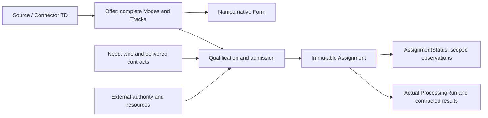

# WoT AV Extension

[marcschier/wot-av-extension](https://github.com/marcschier/wot-av-extension) is a draft vocabulary for describing audio/video
sources, workload requirements, accepted assignments, and execution evidence
alongside W3C Web of Things Thing Descriptions. It contains **38 classes,
105 AV properties, and 17 directly reused external properties**.

**Status: original proposal, `0.1-proposed`.** This is not a W3C specification,
registered vocabulary, deployed service, or interoperability certification.
The namespace `https://example.org/wot/av#` is **unregistered**; the context
identifier `https://example.org/wot/av/context/v0.1` and the example profile URLs
are **unhosted placeholders**, not working download endpoints. The tools use
explicit local mappings for the supplied documents.

## What it describes

An Offer lists complete, jointly usable Modes rather than independent capability
maxima. A Need separates what travels on the wire from what an application must
receive. Native TD Forms remain the access descriptions; the AV vocabulary
references them instead of introducing another endpoint format.



**Live**, **Still**, and **Clip** have different temporal semantics: a Still read
need not trigger a fresh exposure, and a Clip has a finite timeline. Encoded
video/audio are distinct from raw pixels/PCM samples; H264, JPEG, H265, AAC, and
Opus names do not establish decoder or transport support. A Need's hard
requirements, an accepted Assignment, observed readiness, actual processing, and
durable result commitment are separate claims.

## Quick tour

| Location | Purpose |
| --- | --- |
| [spec.md](spec.md) | Main behavioral specification and standards references. |
| [vocabulary/terms.json](vocabulary/terms.json) | Authoritative term inventory, including cardinalities and controlled values. |
| [spec/terms.md](spec/terms.md) | Complete generated term catalogue. |
| [vocabulary/context.jsonld](vocabulary/context.jsonld), [vocabulary/ontology.ttl](vocabulary/ontology.ttl) | Generated JSON-LD context and RDFS vocabulary. |
| [shapes/av.shacl.ttl](shapes/av.shacl.ttl), [spec/validation.md](spec/validation.md) | Structural constraints, executable-check scope, and known limits. |
| [examples/source.td.json](examples/source.td.json), [examples/controller.td.json](examples/controller.td.json) | Synthetic source and controller TDs with named native Forms. |
| [examples/need.jsonld](examples/need.jsonld), [examples/assignment.jsonld](examples/assignment.jsonld) | Still-to-BGR demand and a deliberately non-admitted Assignment fixture. |
| [examples/NOTES.md](examples/NOTES.md), [examples/profiles/](examples/profiles/) | Fixture explanation and illustrative profile documents. |
| [examples/pins.jsonld](examples/pins.jsonld), [examples/manifest.json](examples/manifest.json), [examples/dataset.nq](examples/dataset.nq) | Exact-byte references and a finite query dataset. |
| [examples/query.rq](examples/query.rq), [examples/live.query.rq](examples/live.query.rq), [tests/fixtures/](tests/fixtures/) | Still/Live candidate queries and positive, negative, and limitation fixtures. |
| [tools/validate.py](tools/validate.py), [tools/generate.py](tools/generate.py), [requirements-dev.txt](requirements-dev.txt) | Offline checks, intentional regeneration, and pinned development dependencies. |
| [provenance.json](provenance.json), [release-manifest.json](release-manifest.json) | Canonical-package provenance and its explicitly scoped integrity inventory. |

The release manifest covers the portable canonical package, not these root
documents or the historical archive. It deliberately excludes its own hash.
Preserve `.gitattributes`: line-ending conversion changes exact-byte digests.

## Local setup and checks

Use Python 3.10 or newer. From the repository root in PowerShell, create an
isolated environment if the dependencies are not already available:

```powershell
python -m venv .venv
.\.venv\Scripts\Activate.ps1
python -m pip install -r requirements-dev.txt
python tools\validate.py
python tools\generate.py --check
```

If activation is unavailable, use `.\.venv\Scripts\python.exe` instead of `python`
for installation and the subsequent commands. Dependency installation is a
separate setup step and may need network access. The default validation and
generation-check commands are read-only and offline: they do not contact
devices, fetch contexts, or silently repair stale pins.

After an **intentional, reviewed change** to the inventory, structural rules,
fixture inputs, or tooling, regenerate derived artifacts and reseal their pins:

```powershell
python tools\generate.py
python tools\validate.py
python tools\generate.py --check
```

Do not regenerate merely to hide an unexplained integrity failure. The authored
inventory is the term source; the context, ontology, shapes, and catalogue are
derived outputs. See [validation details](spec/validation.md) for the boundaries
between JSON checks, native TD structure, SHACL, resolved references, and queries.

## What is not implemented

The repository defines admission, lifecycle, grants, clock/queue obligations,
provenance, and eleven profile-contract families. It is **not** an admission
controller, capture application, native binding implementation, decoder, or
complete set of executable schemas for those profiles. Shape conformance and
query matches do not establish native interoperability or physical feasibility.

The worked Assignment is **NOT ADMITTED**: adapter qualification is unavailable
and its illustrative grant is expired at the fixture's evaluation time. The
all-zero qualification digest is a sentinel, not verified content. Requests and
receipts are synthetic; the Live and codec fragments also retain explicitly
unresolved references. No working device, authorization, or runtime acceptance
is claimed by these examples.

## Canonical material, history, and rights

Use the files in the quick tour as the active publication set. The
[historical archive index](research/archive/README.md) and
[publication provenance](research/provenance.json) identify admitted editions,
original fingerprints, transformations, and withheld categories. Historical
material under `research/archive/` is background, not another term authority;
earlier vocabularies, generators, fixtures, and reported outcomes belong to
their own snapshots and may be superseded. Archive inclusion is restricted by
redistribution rights.

Rights-limited earlier research is retained locally and **not committed**.
Private-source code, prose, implementation citations, and personal host paths
are not reproduced in these root documents. The repository therefore does not
contain every earlier research artifact, and its visibility is not a substitute
for redistribution permission.

The repository is published **private**. Do not change its visibility as a
packaging step; any broader distribution requires a separate rights review.

**No first-party reuse license has been selected** for this draft's vocabulary,
documentation, or tooling. Do not infer one from another project's license.
The copied W3C TD context and schema have their own
[upstream notice](third_party/wot/LICENSE.md),
[full license](third_party/wot/LICENSE-W3C-2023.txt), and
[redistribution notice](third_party/wot/NOTICE-W3C.txt).
Their [provenance manifest](third_party/wot/manifest.json) records source
revision, exact bytes, and notice transformations. Those third-party terms
apply to the identified copies; they do not automatically license the new AV
proposal.
