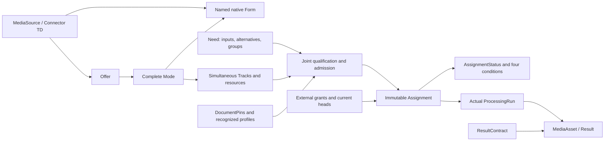
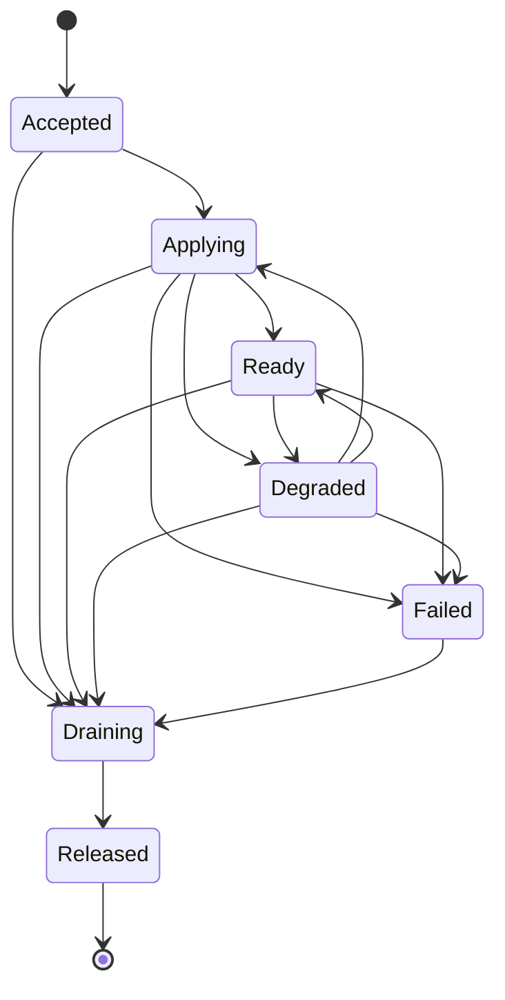

# WoT AV Extension: Media Capabilities, Workload Needs and Execution Evidence

**ORIGINAL PROPOSAL v0.1, 14 September 2026.** This is not a W3C specification, registered vocabulary, deployed service, or interoperability certification. The **unregistered** namespace is `https://example.org/wot/av#`; the separate context URL `https://example.org/wot/av/context/v0.1` is **unhosted**.

## Executive summary

WoT AV adds media capability descriptions, hard workload requirements, immutable accepted assignments, and execution evidence to native WoT descriptions. An Offer advertises complete operating Modes; a Need requests independently specified wire and application-delivery contracts. A controller may accept only a jointly feasible, authorized, qualified plan. Advertisement, acceptance, readiness, actual processing, and durable result commitment remain different assertions.

The release contains **38 classes, 105 AV properties and 17 directly reused external properties**. Native Forms remain the sole operational access descriptions. Eleven pinned profile-contract families delimit details that cannot safely be inferred from codec names or arbitrary configuration JSON. Prototype structure and selected negative cases have been evaluated; hardware behavior, native bindings, complete profile implementations, and production admission have not been established.

## 1. Normative scope and publication package

In this original proposal, **MUST** denotes a requirement for the claimed conformance feature, **MUST NOT** a prohibition, **SHOULD** a recommendation requiring a documented reason for deviation, and **MAY** an option. These words do not add requirements to upstream standards.

The adopted baseline is **WoT TD 1.1 Recommendation, 2023-12-05; JSON-LD 1.1 Recommendation, 2020-07-16; PROV-O Recommendation, 2013-04-30; and DCMI Terms, 2020-01-20**.[^td][^jsonld][^prov][^dc] No TD 2.0, WoT Profiles draft, or successor binding work is implicitly adopted. Optional integrations have their own pinned dependencies.

The publication layout assumes this root `spec.md`, [the complete term catalog](../../../spec/terms.md), [the authoritative inventory](../../../vocabulary/terms.json), [the context](../../../vocabulary/context.jsonld), and [the RDFS vocabulary](../../../vocabulary/ontology.ttl). The inventory fixes every class, property, controlled value, per-class range/cardinality, unit, and profile obligation; the catalog is its normative human reference. Domain alternatives are not conjunctive global RDFS domain axioms. Generated artifacts MUST agree with that inventory and this specification.

Publishers MUST retain immutable release artifacts, dependency identities, digests, and change/deprecation records. Incompatible meanings require new terms or a new namespace. An older pinned controlled set MUST NOT widen silently. Future additions require an explicitly recognized, pinned inventory/profile, stable meanings, field applicability, configuration schemas, and qualified matching behavior.

## 2. Modules and class definitions

The core has 25 classes and 83 properties; lifecycle adds seven classes and 21 properties; artifact/provenance adds six classes and one property. These are functional groupings sharing one context, not isolated ontology imports. Descriptive publishers need not implement control. A claim about assignments, retained artifacts, models, or results activates the corresponding module's obligations.

All class names below are in `av:`. Durable classes have absolute identities as specified in the inventory; intrinsic value nodes need not. Offer, Mode, Track, input, alternative, and requirement identities remain stable within their pinned revision.

| Class | Definition |
|---|---|
| `MediaSource` | Physical or logical media-origin Thing, not its URL or content. |
| `Connector` | Acquisition/adaptation Thing, including host-local native access. |
| `Processor` | Processing or input-receiving Thing, distinct from its running incarnation. |
| `Controller` | Coordination Thing exposing native interactions, not self-executing authority. |
| `Offer` | Discoverable alternatives from one source, not current availability. |
| `Mode` | One complete jointly valid acquisition, Form, track, and resource configuration. |
| `Track` | Named simultaneous media component with one wire representation. |
| `ResourceUse` | One shared resource's complete configuration and sharing rule. |
| `Rational` | Reduced exact ratio with positive denominator and contextual units. |
| `Need` | Immutable desired-intent revision; its current head is external. |
| `InputRequirement` | Named required or optional logical input with alternatives. |
| `InputAlternative` | Complete permitted input contract; predicates AND, alternatives OR. |
| `TrackRequirement` | Wire or delivered logical-track contract, joined by identifier. |
| `IntegerConstraint` | Inclusive integer bounds on a supported field. |
| `RationalConstraint` | Inclusive exact-rational rate bounds. |
| `ChoiceConstraint` | Nonempty allowed-IRI membership for a supported field. |
| `Preference` | Boolean input goal ranked after hard feasibility. |
| `InputGroup` | Disjoint all-or-none input group, optionally synchronized. |
| `QueuePolicy` | Bounded stage-specific overflow and coverage obligation. |
| `TimingConstraint` | Maximum age or skew for an explicit time basis. |
| `TimeSelector` | Instant or half-open interval in a named timeline. |
| `TimestampMapping` | Qualified or advertised bounded clock-mapping description, not exposure evidence. |
| `Timestamp` | Observed clock-relative instant with provenance and uncertainty. |
| `DocumentPin` | Fixed representation, retrieval base, integrity, and provenance scope. |
| `FormReference` | One native named Form and standard operation inside a pinned TD. |
| `Assignment` | Immutable accepted mapping and initial grants, not protocol binding or execution. |
| `InputSelection` | Chosen alternative, Offer, Mode, adapter, and source/sink Forms. |
| `TrackSelection` | Offered Track mapped to same-name wire/delivered requirements. |
| `AssignmentStatus` | Immutable generation- and observer-scoped observation. |
| `LeaseGrant` | Immutable revision of externally enforced authority for one scope. |
| `Condition` | One named four-valued evidence claim. |
| `Fault` | Stable failure code, non-secret explanation, and supporting evidence. |
| `MediaAsset` | Sealed retained still/clip content with a typed manifest. |
| `MediaSample` | Selected retained or ephemeral media unit, not necessarily downloadable. |
| `InferenceModel` | Versioned learned-model manifest, not a Thing Model or schema. |
| `ResultContract` | Versioned payload, meaning, completion, and native delivery contract. |
| `Result` | Identified contracted output with completion, provenance, and commitment evidence. |
| `ProcessingRun` | Actual capture, transformation, training, inference, or indexing activity. |

The four Thing roles are non-disjoint subclasses of `td:Thing`; they are not automatically PROV Agents. ProcessingRun specializes `prov:Activity`; the inventory's immutable records/artifacts specialize `prov:Entity`. No blanket equivalences, sensor alignments, or ontology imports are implied.[^prov]



## 3. Complete property map and scalar discipline

The following compact definitions cover all **105 AV properties**. Prefix every listed name with `av:` in documents. Canonical predicates are singular: `av:offer`, `av:mode`, `av:track`, `av:input`, `av:alternative`. Detailed domain-specific cardinalities and conditional restrictions remain those of `spec/terms.md`; grouping here does not make properties interchangeable.

| Area | Properties and meanings |
|---|---|
| Advertisement | `offer`: advertised/selected Offer; `need`: described/accepted Need revision; `source`: media origin; `connector`: acquisition Thing; `host`: execution host; `backend`: qualified runtime identity. |
| Native access | `locality`: host-local/network access; `binding`: binding specification identity; `mediaDirection`: media relative to addressed Thing; `form`: native Form identity. |
| Joint modes | `mode`: complete alternative or selected Mode; `kind`: Live/Still/Clip; `track`: offered component identity; `resourceUses`: complete shared-resource uses; `resource`: resource scope; `configuration`: exact typed configuration pin; `sharing`: allocation compatibility. |
| Representation | `representation`: encoded/raw boundary family; `width`, `height`: actual image pixels; `codec`: encoded family; `pixelFormat`: raw component packing; `cadence`: constant/variable/triggered semantics; `frameRate`: exact media-timeline cadence. |
| Audio and layout | `sampleRate`: samples/second/channel; `channels`: channel count; `channelLayout`: channel meaning/order; `sampleFormat`: PCM numeric format; `bufferLayout`: image/audio memory organization; `timing`: mapping descriptions or observed timestamps. |
| Ratios | `numerator`: exact signed primitive numerator; `denominator`: positive reduced denominator. |
| Demand | `processor`: service Thing; `input`: named logical inputs; `groups`: all-or-none groups; `preferences`: ordered Boolean goals; `model`: exact learned model; `contract`: declared/accepted/used output contracts; `allowedPreprocessing`: explicitly permitted preprocessing pins. |
| Revision and alternatives | `generation`: desired generation repeated by acceptance/observation; `presence`: required/optional; `alternative`: complete alternatives or chosen alternative; `wireTracks`: pre-transformation requirements; `deliveredTracks`: application-delivery requirements. |
| Constraints | `constraints`: conjunctive typed predicates; `field`: supported constrained property; `lowerInteger`, `upperInteger`: inclusive integer bounds; `lowerRational`, `upperRational`: inclusive rational bounds; `allowedValues`: nonempty IRI choices; `goal`: delivered-track or placement preference. |
| Effects and time | `captureIntent`: permitted acquisition effect; `transformPermissions`: permitted wire-to-delivered operations; `selector`: offered extent or requested selection; `maxAge`: worst-case stage-specific age; `maxSkew`: worst-case included-track/input skew. |
| Queues | `queues`: requested stage policies; `stage`: queue/evaluation boundary; `capacity`: finite positive queue units; `unit`: capacity unit; `overflow`: capacity response; `coveragePolicy`: stage-to-delivery coverage; `gapResponse`: incompleteness response; `limitMs`: age/skew/residence milliseconds. |
| Clocks | `clock`: clock/timeline origin and incarnation; `basis`: physical time meaning; `timeBase`: seconds/tick; `referenceClock`: qualified mapping target; `uncertaintyMs`: conservative error bound; `time`: observed rational seconds. |
| Selection | `start`: nonnegative selector start; `end`: exclusive end; `selection`: sample/edge semantics; `toleranceMs`: permitted covering excess at each edge. |
| Integrity | `document`: effective retrieval location; `documentKind`: representation provenance/content scope; `hexDigest`: complete-octet SHA-256; `pin`: selected representation/dependencies; `expectedThing`: expected TD identity; `operation`: standard TD operation IRI; `jsonPointer`: agreeing original-JSON selector. |
| Accepted paths | `holder`: worker incarnation; `selections`: input/track mappings; `omitted`: explicit optional omissions; `forms`: accepted FormReferences; `requirement`: discharged input or boundary requirement; `assignment`: exact accepted attempt. |
| Observation | `state`: class-specific lifecycle/content state; `incarnation`: observer/stream reset scope; `sequence`: scoped observation/media-unit/renewal ordinal; `observedAt`: observation time; `validFrom`: inclusive grant start; `validUntil`: exclusive freshness/expiry boundary. |
| Authority and evidence | `lease`: initial/current/effect-checked grant revisions; `conditions`: four distinct claims; `condition`: claim name; `conditionState`: four-valued truth; `evidence`: identified support or commitment receipt; `authority`: enforcer; `scope`: fencing/effect domain; `fence`: ownership epoch. |
| Outcomes | `issues`: explicit problems; `code`: stable Fault IRI; `committedAt`: durable commitment time. |

The **17 direct external reuses** retain upstream meanings: `dcterms:identifier` supplies local names/output slots; `dcterms:isVersionOf` revision series; `dcterms:format` pinned-content media type; `dcterms:conformsTo` profile claims; and `dcterms:description`, `dcterms:title`, `dcterms:creator`, `dcterms:publisher`, `dcterms:license`, `dcterms:references` ordinary metadata. Actual execution uses `prov:used`, `prov:wasGeneratedBy`, `prov:wasDerivedFrom`, `prov:wasAssociatedWith`, `prov:wasAttributedTo`, `prov:startedAtTime`, and `prov:endedAtTime`.[^dc][^prov]

Set collections are unordered; only preferences use ordered `@list`. JSON-level validation MUST preserve required member presence and explicit omission records: empty ordinary sets leave no RDF triples, whereas an empty list becomes `rdf:nil`.[^rdfconversion] Sets do not validate uniqueness.

Integers MUST use native JSON integer tokens without decimal/exponent notation within magnitude 9007199254740991; larger values require exact lexical strings with explicit full datatype IRI `http://www.w3.org/2001/XMLSchema#integer`. Ordinary numeric strings are not numbers. Quantities MUST be finite; milliseconds nonnegative; dateTimes timezone-bearing. Rational denominators MUST be positive and fractions gcd-reduced. Rate, rate-bound, and tick-duration numerators MUST be positive; selector offsets nonnegative. Generic ratios and clock-relative timestamps may remain signed.

## 4. Native TD and immutable reference contract

Keep the TD context first and append the AV context without redefining native keys, default vocabularies, security, or operations. Controlled values are IRIs such as `av:FromThing`, not bare relative strings. Full-IRI property spellings need explicit value objects where compact-key coercion would otherwise apply.[^jsonld]

Native Property, Action, Event, Form, and DataSchema roles remain distinct. `@type` on an affordance types that affordance; on an input/output schema it types the **schema node**, not every runtime payload. TD `type` and other DataSchema constraints retain their native purpose. No universal DataSchema alias or invented operation is introduced.[^td]

This profile's **namedForms** mechanism requires an absolute, unique native Form `@id`, including selected control Forms. This is extension-compatible, **not a TD-core identity-preservation or fragment-resolution guarantee**. The native context does not require a Form's explicit `rdf:type`; validation MUST NOT invent an `hctl:Form` class/import prerequisite. Native `href` expands to an `hctl:hasTarget` `xsd:anyURI` literal, not the Form's identity.[^native]

`av:form` identifies that node, never its `href`. Offers and Needs MUST NOT duplicate native targets, security, protocol parameters, or device selectors. Form content types describe exchanged representations: JPEG bytes, JSON control data, or SDP signaling do not become interchangeable codec declarations.[^td]

Every FormReference MUST contain exactly one TD DocumentPin and one compatible existing operation IRI. Resolve native membership, operation/defaults, inherited security, URI variables, binding, and relative targets in the original TD. Preserve its explicit `base` and effective retrieval location; TD base and JSON-LD base have different roles.[^td][^jsonld] An optional RFC 6901 `av:jsonPointer` MUST select the same named Form in the pinned original JSON. It is not an automatically supported TD URI fragment. Legacy nameless descriptions require a separately named, pinned adapter snapshot; no first-Form fallback is permitted.[^pointer]

A DocumentPin records effective `av:document`, `av:documentKind`, `dcterms:format`, and 64 lowercase hexadecimal `av:hexDigest` characters. Hash the **complete representation octets after HTTP content decoding, before parsing or media decoding**. No JCS, whitespace normalization, field stripping, or RDF canonicalization applies. The pin stays outside its covered document.

TD pins selected by FormReferences require `av:expectedThing`. Pin the complete transitive TD/context/vocabulary/schema/profile/artifact dependency closure, cycle-safely, retaining its edges and effective bases. Configuration equality includes this interpretation closure, kind, format, expected identity, and exact bytes, not merely pin IDs or version labels. Missing dependencies prohibit acceptance.

`av:PublisherTD` and `av:DirectorySnapshot` distinguish publisher bytes from directory-enriched descriptions. Enrichment and directory-assigned anonymous identities can change a TD representation; stripping them does not recover an authenticated publisher snapshot.[^discovery]

Media Forms MUST identify binding, locality, and one unambiguous directed media access. `av:FromThing` means media leaves the addressed Thing; `av:ToThing` means media enters it. Neither describes request, signaling, or session-initiation direction. Control-only Forms need no media direction. There is no universal bidirectional value: multi-leg signaling requires binding-defined leg identification and qualification.

## 5. Hard matching and admission

An Offer MUST enumerate complete joint Modes, not independent maxima whose Cartesian product invents capabilities. Each Mode has one Form, acquisition configuration, simultaneous Track set, and complete resource uses. A Track has exactly one representation IRI: `av:EncodedVideo`, `av:RawVideo`, `av:EncodedAudio`, or `av:PCM`; these are **values, not Track subclasses**.

A Need MUST identify its Processor, logical series, generation, state, and named inputs. Every admitted input chooses exactly one complete alternative. Integer constraints support width, height, sampling rate, and channel count; rational constraints support frame rate; choice constraints support only inventory-listed fields. Alternative-level choices are limited to source/host/backend. Bounds are inclusive; identical bounds mean equality; choices mean membership. There are no scripts, implicit conversions, or arbitrary expression paths.

All predicates in an alternative are **AND**; alternatives are **OR**, without array-order priority. Wire and delivered track names are unique per boundary; equal identifiers join one logical track. Each required boundary requirement MUST have exactly one TrackSelection, containing at most one wire and one delivered requirement. Including delivery also includes its declared same-name wire filter, even when that filter is optional.

Optional inputs/tracks MAY be omitted only explicitly: Assignment lists omitted InputRequirements, InputSelection omitted TrackRequirements. Inclusion keeps all predicates hard; a wire-only filter need not include optional delivery. Required tracks MUST share a jointly feasible Mode/path. Groups are disjoint, have at least two inputs, and admit all or none; any required member makes the entire group required. This is admission atomicity, not device transaction atomicity.

Missing advertised facts are unknown; missing hard evidence prevents feasibility. Only a resolved complete Mode's track enumeration can establish absence for that Mode, not the whole source. Missing bounds impose no constraint; empty choice sets are invalid. Empty/omitted transformation or model-preprocessing permissions authorize nothing. Decode, color conversion, each resize policy, resampling, remixing, temporal subsampling, duplication, and preroll decoding are distinct permissions. BGR application images are not model tensors.

Admission MUST enumerate a finite catalog of qualified plans, verify placement, capture authority, all tracks, transformations, clocks, queues, resource costs, and existing allocations jointly. `SameConfiguration` requires complete pinned configuration equivalence; subset overlap is insufficient. `Exclusive` rejects conflicting allocation. At least one input must be selected; an all-optional unmatched Need does not create an empty accepted Assignment.

Only hard-feasible plans are ranked by the ordered Boolean preference vector, true before false. Unknown or omitted goals score false. Stable input/source/mode/configuration identities break ties. Failure MUST retain candidate/path, required/actual evidence, and an inventory Fault code, such as `av:NoJointMode`, `av:BackendTrackUnsupported`, or `av:UnknownRequiredFact`.

## 6. Media cadence, selection, timing and coverage

Video geometry describes actual display/image pixels, not sensor maxima, strides, or tensors. Raw BGR8 is uint8 B,G,R in HWC geometry; detailed colorimetry, plane layout, and native format mappings require configuration. Audio sampling, channel meaning, PCM sample format, and buffering are independent fields.

`av:H265` denotes the ITU-T H.265 / ISO/IEC 23008-2 HEVC bitstream family; exact edition, profile/tier/level, constraints, and initialization require the codec profile. `av:Opus` denotes RFC 6716 coding, requiring exact channel, framing, sampling, and binding parameters. Neither family IRI establishes encoder/decoder presence, browser support, container, or transport. Opus's 48000-Hz RTP clock and `opus/48000/2` signaling do not prove application sampling or channel count. IANA media types are references, not RDF equivalences or automatic Form defaults. H.265 is not made mandatory by the WebRTC video baseline.[^codecs][^opus][^webrtc]

`Constant` requires exact Rational cadence; `Variable` and `Triggered` assert no exact rate; Still omits cadence/rate. **30/1 differs from 30000/1001**; compare by exact cross multiplication. Wire FPS, delivered cadence after loss, and wall-clock processing throughput are distinct. Faster clip processing does not change media cadence. Arrival/deadline guarantees additionally need qualified clock/window semantics.

Still may return an existing image: neither repeated reads nor cache rules prove new exposure. `Observe` permits no trigger/configuration mutation; other capture intents require scoped authority. Clip has a finite offered extent; Live is not a repeatedly refreshed Still or finite Clip.

Selectors use named-timeline rational seconds: `AtInstant` omits end; intervals satisfy `0 <= start < end` inside offered extent. `ExactSamples` uses presentation timestamps and audio-sample trimming. `CoveringInterval` permits only bounded extra media at each edge, never internal omissions. Keyframe access may require permitted preroll decoding. VFR selection MUST NOT substitute frame-index/FPS arithmetic for timestamps.

CaptureTime means video exposure midpoint or associated audio first-sample time; PresentationTime, ReceiptTime, ProcessingTime, and CommitTime remain separate. Exposure/rolling-shutter treatment needs explicit qualification. RTP/RTCP clock association is not itself exposure evidence.[^rtp]

Mappings MUST identify clock incarnation/origin, exact seconds/tick, anchor, half-open valid tick interval, basis provenance, and conservative uncertainty including drift. Resets/wraps invalidate extrapolation. After proven common-clock conversion, calculate `ageMs=1000*(evaluationSeconds-sampleSeconds)+uEvaluationMs+uSampleMs` and pairwise `skewMs=1000*abs(t1Seconds-t2Seconds)+u1Ms+u2Ms`. Each MUST be at most its corresponding `av:limitMs`. Age names ApplicationIngress or InferenceStart; skew compares video with its associated audio block's first sample. Omitted uncertainty is unknown, not zero.

Every accepted plan MUST disclose bounded internal and public queues, including pre-split buffers. `NoIntentionalDrop` prohibits planned discards from its stage through delivery, **not sensor/network loss**. It requires Report or Fail on gaps; Report is incomplete coverage, not complete success. BlockUpstream needs qualified pause or bounded spool. A dropping shared queue before inference/recording branches cannot satisfy the recording branch's no-drop obligation.

## 7. Eleven required pinned profile-contract families

These are original, unhosted contract families, **not implemented profile-body schemas or adapter qualifications**. Recognized instances MUST supply exact fields, schema/dialect, units, semantics, dependency pins, and applicable qualification. An arbitrary JSON blob plus hash is not interoperable configuration. Table kinds classify pinned instance content; they do not turn a manifest into a native endpoint.

| Family IRI; content kind | Required contract content |
|---|---|
| `https://example.org/wot/av/profile/acquisition/v0.1`; ProfileDocument | Continuous/single/burst/playback behavior; trigger/capture owners; configuration/resources; authorized intents; native control FormReferences; uncertain effects. Include Still existing/new-exposure semantics and Clip origin, extent, restart/seek/selection behavior. Device selectors, drivers, privileges, and protocol options remain native. Profile-owned Continuous means no per-frame commands; FreeRun means device-timed acquisition. |
| `https://example.org/wot/av/profile/adapter-plan/v0.1`; ProfileDocument | Implementation/version, host/backend, source/sink Forms and media legs; exact per-track wire/delivered signatures; ordered parameterized transforms; every queue and pre-split topology; pause/spool, coverage, resource costs, clock records, measured qualification provenance and validity. |
| `https://example.org/wot/av/profile/clock-map/v0.1`; ProfileDocument | Incarnation-specific clocks/origins; original ticks; exact timeBase, anchor tick/reference seconds, half-open valid interval, bounded drift uncertainty, and basis evidence. `referenceSeconds=(tick-anchorTick)*timeBase+anchorReferenceSeconds`; no extrapolation across expiry/reset/wrap. UTC anchors identify timezone, authority, and uncertainty. |
| `https://example.org/wot/av/profile/resource-config/v0.1`; ProfileDocument | Entire simultaneous-acquisition resource state, parameters/units, authority/scope, compatible allocations. Equality requires recognized profile plus complete pin/interpretation closure, never missing fields or overlapping subsets. |
| `https://example.org/wot/av/profile/codec-layout/v0.1`; ProfileDocument | Codec profile/level/object type and initialization; raw depth, color matrix/range/chroma siting, plane offsets/strides, alignment/memory kind, and qualified native-format mappings. Unknown required parameters prevent matching. |
| `https://example.org/wot/av/profile/media-manifest/v0.1`; ManifestDocument | Sealed identity/state; every file's safe relative path, media type, length, complete-octet hash; named pinned access Forms; Clip timeline/extent/gaps; derivation; retention deadline and enforcer. Stills are complete, not zero-duration clips. |
| `https://example.org/wot/av/profile/model-manifest/v0.1`; ManifestDocument | Format/dialect/entry file; independently pinned files and checked external-data ranges; ordered tensor names/dtypes/dimensions, equality-scoped symbols versus unknowns, layouts/channels; exact preprocessing, resize/pad/interpolation/rounding/normalization and inverse geometry; postprocessing, thresholds/suppression, labels, runtime requirements. Pin dependencies separately; ONNX additionally identifies independent IR/opset/domain versions.[^onnx] |
| `https://example.org/wot/av/profile/result-contract/v0.1`; ManifestDocument | Payload schema pin and dialect IRI; media/semantic type; exact payload location, including envelope pointer; native delivery/replay Forms; coverage/completion/gap/error/commit rules; output slot, deduplication, effect scope. Optional CloudEvents/xRegistry descriptions have explicit versions and mappings. |
| `https://example.org/wot/av/profile/run-config/v0.1`; ProfileDocument | Actually loaded model/files or identified managed-provider configuration; pre/post/runtime pins; processor incarnation; accepted adapter/selections; grant checks; processing clock/uncertainty; input/output slots and execution/commit responsibility. No execution assertions for unstarted intent. |
| `https://example.org/wot/av/profile/control/v0.1`; ProfileDocument | Versioned submit/release/renew/status/result roles mapped to named native Forms, standard operations, exact schemas/payload locations; scoped idempotency, JCS request fingerprints, durable receipts/replay horizons; compare-current generation/grant; accepted/proposed/rejected/pending/uncertain outcomes with alternatives/issues and explicit support limits; opaque access-grant references; authority, revocation, fencing, drain/cleanup, uncertain-effect rules. |
| `https://example.org/wot/av/profile/commit-receipt/v0.1`; ReceiptDocument | Authenticated durable Result/Assignment/run/contract/output-slot/payload-pin identity; effect authority/scope; checked grants; commitment time/clock/uncertainty. Same `(assignment,run,contract-pin,output-slot)` with different bytes is an integrity conflict; hashes/event IDs do not ensure exactly-once effects. |

Transport-specific native adapters still need executable contracts for negotiation, framing, timestamping, authentication, errors, placement, and lifetime. Listing HTTP, RTSP, UVC, industrial-camera, SRT, HLS, or WebRTC families supplies none of that qualification.

## 8. Immutable lifecycle and ordinary control interactions

Changed intent, model, output contract, or withdrawal requires a new Need revision and increasing generation. Need state is `av:Active` or `av:Withdrawn`. Reallocation creates a new Assignment even for unchanged intent. Need, Assignment, AssignmentStatus, and LeaseGrant revisions MUST remain immutable; mutable current heads belong to external authorities.



These states are recorded by AssignmentStatus, not by mutating Assignment. Released is terminal; failed work needs a new attempt. Cleanup failure remains Draining with issues.

Currentness requires an authorized active head selecting the exact Need/Assignment; equal generations; matching dependency/evidence scope; authorized observer Agent/incarnation; latest accepted sequence in that scope; and externally current grants with matching series/holder/fence. The entire uncertain evaluation-time interval MUST fit status freshness `[observedAt,validUntil)` and every grant's `[validFrom,validUntil)`, subject to earlier revocation. Missing proof is unknown. Restart requires a new incarnation; lower sequences and obsolete incarnations cannot overwrite later evidence. Historical replay never resurrects withdrawn work.

Exactly one condition of each name is required:

| Condition | Positive claim |
|---|---|
| `av:MediaObserved` | Selected samples actually observed. |
| `av:ApplicationReady` | All required delivered-media predicates qualified. |
| `av:ModelLoaded` | Exact accepted model/files/configuration loaded by the holder incarnation. |
| `av:ResultCommitted` | At least one accepted output has durable commitment evidence, not all work complete. |

Truth uses `av:True`, `av:False`, `av:Unknown`, `av:NotApplicable` IRIs. True requires scoped evidence; False is an actual negative assessment. NotApplicable is allowed only for absent model-loading or result obligations. Ready requires ApplicationReady True; model-dependent processing additionally requires ModelLoaded True. Undisclosed provider internals cannot satisfy a required model pin.

Each grant covers one external authority/scope. Per-effect enforcement, not metadata, confers authority. Renewal creates a new ID and increasing sequence while preserving series/holder/fence; reassignment advances fencing within affected scopes. Renewal changes neither intent, observation freshness, nor retention. Unrelated scope counters are incomparable.

Release compares current ownership and drains only its own readers, transforms, reservations, and permitted commits. Shared capture MUST remain for other obligations. Expiry/revocation grants no implicit trigger/commit grace; Released requires authoritative cleanup evidence. Stale cleanup MUST NOT reset a replacement owner. Fences cannot recall issued triggers: ambiguous effects require reconciliation, not blind repetition.

Controller roles are profile-owned identifiers, **not new AV action classes or WoT operations**. Submit/release/renew use native `invokeaction`; status uses `readproperty` and optionally native observation; result delivery uses declared Property/Event operations. Standard action cancellation is not automatically assignment release.[^td]

The control profile MUST scope retry keys by authenticated principal, stable controller, and action; fingerprint complete input with SHA-256/JCS; reject same-key/different-input; persist receipts before acknowledgment; and declare replay horizons. JCS applies to request fingerprints, **not DocumentPin hashing**.[^jcs] Accepted admission names an Assignment; rejected/uncertain outcomes require issues; proposals require explicit alternatives. Unsupported pending/renew/result interfaces MUST NOT be implied.

## 9. Artifacts, models and result provenance

A MediaAsset has one recognized manifest; a partial finalized Clip records gaps. A MediaSample either derives from a retained asset with appropriate selector, or identifies source, stream incarnation, Track, and media-unit sequence. That sequence is not an RTP packet counter.[^rtp]

InferenceModel is neither TD Thing Model, JSON Schema, nor xRegistry model. Application BGR delivery does not authorize RGB tensor conversion, resizing, normalization, or padding: exact model preprocessing requires separate permission. Model, IR, and opset versions remain independent.[^onnx]

A Need declares `av:contract`; its Assignment fixes accepted ResultContracts and dependency pins. Each Result has exactly one contract, output-slot identifier, payload pin, authenticated receipt, committedAt, state, and generating ProcessingRun. Empty detections may be Complete; errors and incomplete transcripts cannot masquerade as empty success. Detection and indexing payloads use different contracts.

For a live inference path, the run links `av:assignment` and actually `prov:used` the MediaSample, model, and execution configuration; the Result links `prov:wasGeneratedBy` that run and appropriate `prov:wasDerivedFrom` inputs. Associate actual responsible Agents and execution times using PROV, not planned usage.[^prov] Computation, transport acknowledgment, and subscriber effects are not durable commitment.

Optional CloudEvents uses pinned v1.0.2, unchanged envelope semantics, JSON-LD only in `data`, stable source+id for retransmission, and profile-defined time as result availability. Envelope identity is not fencing or an exactly-once guarantee.[^ce]

## 10. Worked source, Need and live variant

The complete synthetic Still-to-BGR fixture is published as [source TD](../../../examples/source.td.json), [Need](../../../examples/need.jsonld), [controller TD](../../../examples/controller.td.json), and [Assignment](../../../examples/assignment.jsonld), with pins and query fixtures alongside them. These excerpts inherit their containing contexts and are **not standalone TDs or complete admission records**.

The source's native `snapshot` Property uses this Form; the Offer/Mode references its identity without copying its target:

```json
{
  "@id": "urn:example:av-example:form:snapshot",
  "href": "https://media.example.org/latest.jpg",
  "op": "readproperty",
  "htv:methodName": "GET",
  "contentType": "image/jpeg",
  "response": {"contentType": "image/jpeg"},
  "av:mediaDirection": "av:FromThing",
  "av:locality": "av:Network",
  "av:binding": "urn:example:av-example:profile:http-jpeg:1"
}
```

Its complete Mode offers JPEG 1280x720. The Need separately requires wire JPEG and contiguous delivered BGR8, authorizing Decode and ColorConvert but no resizing, freshness, model, or FPS assumptions. Local-memory delivery invents no Processor sink Form. This delivered requirement excerpt illustrates typed predicates:

```json
{
  "@id": "urn:example:av-example:requirement:delivered:1",
  "@type": "av:TrackRequirement",
  "dcterms:identifier": "picture",
  "av:presence": "av:Required",
  "av:representation": "av:RawVideo",
  "av:constraints": [
    {"@type":"av:ChoiceConstraint","av:field":"av:pixelFormat","av:allowedValues":["av:BGR8"]},
    {"@type":"av:ChoiceConstraint","av:field":"av:bufferLayout","av:allowedValues":["av:Contiguous"]},
    {"@type":"av:IntegerConstraint","av:field":"av:width","av:lowerInteger":1280,"av:upperInteger":1280},
    {"@type":"av:IntegerConstraint","av:field":"av:height","av:lowerInteger":720,"av:upperInteger":720}
  ]
}
```

The controller uses ordinary submit Action, status Property, and release Action. Its request envelope carries `clientKey`, `expectedGeneration`, and a Need pin; those are profile JSON fields, not AV terms. A status pin-reference envelope is not an abbreviated AssignmentStatus. A recorded release receipt is not completed cleanup.

The separate **Live variant** requires same-Mode H264 video 1280x720 at exact 30/1 and AAC mono 48000-sample audio. Delivered BGR may use a capacity-one DropOldest queue with **no hard delivered FPS**; required mono PCM S16LE audio at 48000 samples/second with Interleaved layout still needs a qualified path. A video-only decoder cannot silently omit it. Optional audio omission must be explicit. A separately acquired microphone instead needs another input and, when required, a synchronized group.

A model-bearing variant additionally pins InferenceModel, permitted preprocessing, and ResultContract, then uses the provenance linkage above. The supplied Assignment remains a counterfactual negative fixture: its qualification pin is unresolved and its illustrative grant expired. Neither it nor H265/H264+Opus fragments establishes accepted operation.[^fixtures]

## 11. Discovery and optional registry projections

WoT Thing Description Directories already provide discovery. Search is recommended rather than universally mandatory; SPARQL and notification support are optional. Registration, enrichment, retrieval, paging, and authorization are separate from media admission.[^discovery] A query timeout, refusal, redaction, or unsupported interface is not a successful empty match.

An optional indexing profile MAY retain one named graph per authenticated pinned TD snapshot and an external graph-to-pin manifest. It MUST preserve native Form membership, context closure, complete selected Modes, and revision separation. TDD does not universally guarantee that graph layout. Queries identify candidates for retrieval/qualification, not reservations; watch gaps require reconciliation.

xRegistry projections MAY reuse standard fixed-format Endpoints **without messages, messagegroups, or envelopes**. Under client-relative usage, FromThing maps to consumer and ToThing to producer. Preserve native operation/security/binding meaning; reject unsupported mappings. `ifvalues` constrains protocol-dependent attributes, **not negotiation**. Extensions require model-declared, permitted lowercase names; referenced AV documents remain their semantic authority.[^xr]

Generate projections from pinned whole-Mode/Form/operation/profile tuples, never independent capability axes or another editable media address. Version labels/epochs do not establish immutable bytes, fencing, or distributed transactions; retain snapshots because versions can change or be pruned.[^xrversions]


## 12. Conformance evidence, security and remaining work

Conformance claims MUST name their target: vocabulary publication, annotated TD, domain-record structure, resolved-reference closure, admission/lifecycle implementation, or qualified binding/adapter. Expansion, RDF parsing, and SHACL success are not interchangeable with operational conformance.

Structural validation uses a finite supplied graph with explicitly resolved descriptions and declared lookup-only references; no remote imports or inference are assumed. Intrinsic `sh:node` checks need no invented class assertion. Only the eight inventory-listed intrinsic shapes are closed; Things remain extensible.[^shacl] Full admission additionally checks JSON duplicates/member presence, names, list topology, numeric finiteness/timezones, gcd/cross-products, applicability, graph/pin closure, complete track selection, authority, and runtime qualification.

Release shapes MUST incorporate the reviewed contextual sign repair: positive Rational nodes for frameRate, lower/upper rate bounds, and timeBase; nonnegative nodes for selector start/end. Signed primitive Rational and Timestamp values remain valid. The recorded review exercised **98 paired original/corrected cases**, preserving 90 outcomes and repairing eight sign failures; codec-extension probes were separate. This is evidence for those snapshots, not certification of every generated release or a complete validator.[^shapereview]

The publication package MUST include context, ontology, inventory/catalog, versioned structural shapes with coverage limits, reproducible positive/negative fixtures, pin manifests, and retained provenance. **Executable schemas for all eleven profile bodies, native adapters, measured clock/media/resource qualifications, and complete admission/lifecycle tests remain separate required deliverables**, not completed functionality.

Deployments MUST authenticate publishers and authorities independently of digest integrity; use controlled, bounded context/artifact loaders; validate model paths and external ranges; and enforce discovery/control/media/result authorization separately. Credentials, bearer URLs, and private keys stay outside public TDs, pins, and faults.[^security] Evidence SHOULD minimize personal data and sensitive topology. Retention declarations require an identified enforcer: deleting descriptors, revoking grants, and deleting bytes are distinct operations.

## References

[^td]: [TD 1.1 REC, 2023-12-05](https://www.w3.org/TR/2023/REC-wot-thing-description11-20231205/), sections 5.3.1-5.3.4, 6.3.9, 7.1, and 9.
[^jsonld]: [JSON-LD 1.1 REC, 2020-07-16](https://www.w3.org/TR/2020/REC-json-ld11-20200716/), sections 4.1.3, 4.1.5, 4.1.11, 4.2.3, and 4.3.
[^prov]: [PROV-O REC, 2013-04-30, starting-point terms](https://www.w3.org/TR/2013/REC-prov-o-20130430/#description-starting-point-terms).
[^dc]: [DCMI Terms, 2020-01-20](https://www.dublincore.org/specifications/dublin-core/dcmi-terms/2020-01-20/), section 2.
[^native]: `w3c/wot-thing-description`, commit `87808f1644ba79eb0a58d238385a8bd4a2236853`: [context/td-context-1.1.jsonld:380-451](https://github.com/w3c/wot-thing-description/blob/87808f1644ba79eb0a58d238385a8bd4a2236853/context/td-context-1.1.jsonld#L380-L451); [validation/td-json-schema-validation.json:335-412](https://github.com/w3c/wot-thing-description/blob/87808f1644ba79eb0a58d238385a8bd4a2236853/validation/td-json-schema-validation.json#L335-L412).
[^pointer]: [RFC 6901, section 6](https://www.rfc-editor.org/rfc/rfc6901.html#section-6); [TD media-type registration](https://www.w3.org/TR/2023/REC-wot-thing-description11-20231205/#media-type-section).
[^rdfconversion]: [JSON-LD 1.1 API REC, RDF conversion](https://www.w3.org/TR/2020/REC-json-ld11-api-20200716/#deserialize-json-ld-to-rdf-algorithm), sections 8.2-8.3.
[^codecs]: [ITU-T H.265, 09/2023](https://www.itu.int/rec/T-REC-H.265-202309-S/en); [RFC 7798, sections 1.1 and 7.1](https://www.rfc-editor.org/rfc/rfc7798.html#section-7.1); [IANA video/H265](https://www.iana.org/assignments/media-types/video/H265).
[^opus]: [RFC 6716, section 2](https://www.rfc-editor.org/rfc/rfc6716.html#section-2); [RFC 7587, sections 4.1, 6.1 and 7](https://www.rfc-editor.org/rfc/rfc7587.html#section-4.1); [IANA audio/opus](https://www.iana.org/assignments/media-types/audio/opus).
[^webrtc]: [RFC 7742, sections 5-6.2](https://www.rfc-editor.org/rfc/rfc7742.html#section-5); [RFC 7874, section 3](https://www.rfc-editor.org/rfc/rfc7874.html#section-3).
[^rtp]: [RFC 3550, sections 5.1 and 6.4.1](https://www.rfc-editor.org/rfc/rfc3550.html#section-5.1).
[^jcs]: [RFC 8785, section 3](https://www.rfc-editor.org/rfc/rfc8785.html#section-3); canonicalization is this proposal's control-profile choice.
[^onnx]: `onnx/onnx`, commit `c9f169adac34bd690bf0d628e9aae7fde3d4be85`, docs/IR.md: [69-119](https://github.com/onnx/onnx/blob/c9f169adac34bd690bf0d628e9aae7fde3d4be85/docs/IR.md#L69-L119), [222-251](https://github.com/onnx/onnx/blob/c9f169adac34bd690bf0d628e9aae7fde3d4be85/docs/IR.md#L222-L251), [382-386](https://github.com/onnx/onnx/blob/c9f169adac34bd690bf0d628e9aae7fde3d4be85/docs/IR.md#L382-L386).
[^ce]: `cloudevents/spec`, v1.0.2: [cloudevents/spec.md:248-285](https://github.com/cloudevents/spec/blob/v1.0.2/cloudevents/spec.md#L248-L285), [416-428](https://github.com/cloudevents/spec/blob/v1.0.2/cloudevents/spec.md#L416-L428); [cloudevents/formats/json-format.md:114-174](https://github.com/cloudevents/spec/blob/v1.0.2/cloudevents/formats/json-format.md#L114-L174).
[^discovery]: [WoT Discovery REC, 2023-12-05](https://www.w3.org/TR/2023/REC-wot-discovery-20231205/), sections 7.3.1-7.3.2 and [search](https://www.w3.org/TR/2023/REC-wot-discovery-20231205/#search). Dataset detail: `w3c/wot-discovery`, commit `64c13d74466b5af68e7e56b2c9ce5ba35728bbdc`, [publication/6-rec/Overview.html:4895-5093](https://github.com/w3c/wot-discovery/blob/64c13d74466b5af68e7e56b2c9ce5ba35728bbdc/publication/6-rec/Overview.html#L4895-L5093).
[^xr]: `xregistry/spec`, commit `16483bb564586423de9c128db89f3b61d360f4e3`: [endpoint/spec.md:239-351](https://github.com/xregistry/spec/blob/16483bb564586423de9c128db89f3b61d360f4e3/endpoint/spec.md#L239-L351), [366-450](https://github.com/xregistry/spec/blob/16483bb564586423de9c128db89f3b61d360f4e3/endpoint/spec.md#L366-L450); [endpoint/model.json:561-633](https://github.com/xregistry/spec/blob/16483bb564586423de9c128db89f3b61d360f4e3/endpoint/model.json#L561-L633); [core/model.md:259-287](https://github.com/xregistry/spec/blob/16483bb564586423de9c128db89f3b61d360f4e3/core/model.md#L259-L287), [457-489](https://github.com/xregistry/spec/blob/16483bb564586423de9c128db89f3b61d360f4e3/core/model.md#L457-L489); [core/spec.md:853-859](https://github.com/xregistry/spec/blob/16483bb564586423de9c128db89f3b61d360f4e3/core/spec.md#L853-L859).
[^xrversions]: Same xRegistry commit: [core/spec.md:1206-1246](https://github.com/xregistry/spec/blob/16483bb564586423de9c128db89f3b61d360f4e3/core/spec.md#L1206-L1246); [core/http.md:2881-2905](https://github.com/xregistry/spec/blob/16483bb564586423de9c128db89f3b61d360f4e3/core/http.md#L2881-L2905); [core/model.md:754-771](https://github.com/xregistry/spec/blob/16483bb564586423de9c128db89f3b61d360f4e3/core/model.md#L754-L771).
[^shacl]: [SHACL REC, 2017-07-20](https://www.w3.org/TR/2017/REC-shacl-20170720/), sections 1.5, 2.1.3, 4.1, 4.8.1; structural requirements do not perform remote resolution.
[^security]: [TD 1.1 private security configuration](https://www.w3.org/TR/2023/REC-wot-thing-description11-20231205/#security-multiple).
[^fixtures]: Publication provenance: [worked-example evidence](../historical-worked-example-v0.1/wot-av-example-v0.1.md), sections 1-4. Historical files preserve tested identities and unresolved dependencies; they are not alternative term authorities.
[^shapereview]: Publication provenance: [structural review evidence](../shacl-review/wot-vocab-shape-evidence.md), sections "Result and exact release fix", "Graph boundary", and "H265/Opus integration". The archive identifies exact original/corrected bytes and replay implementation.
