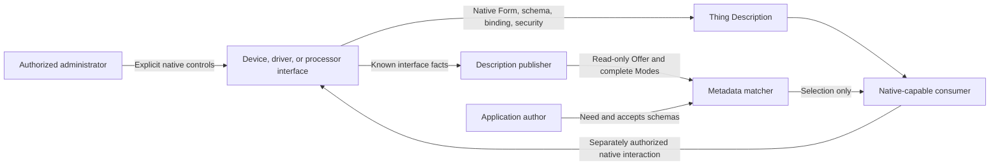
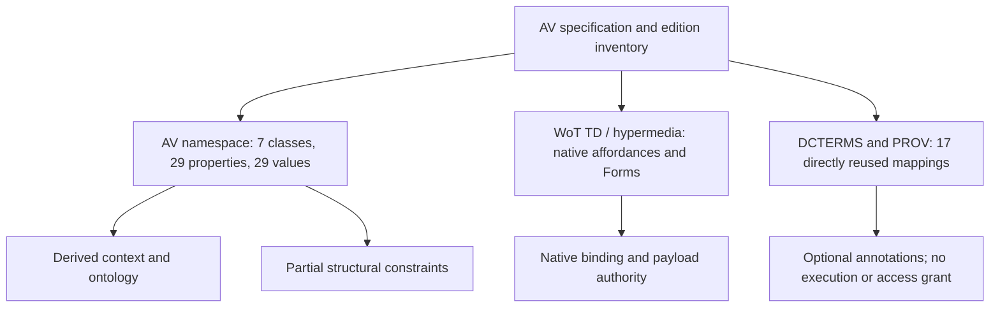
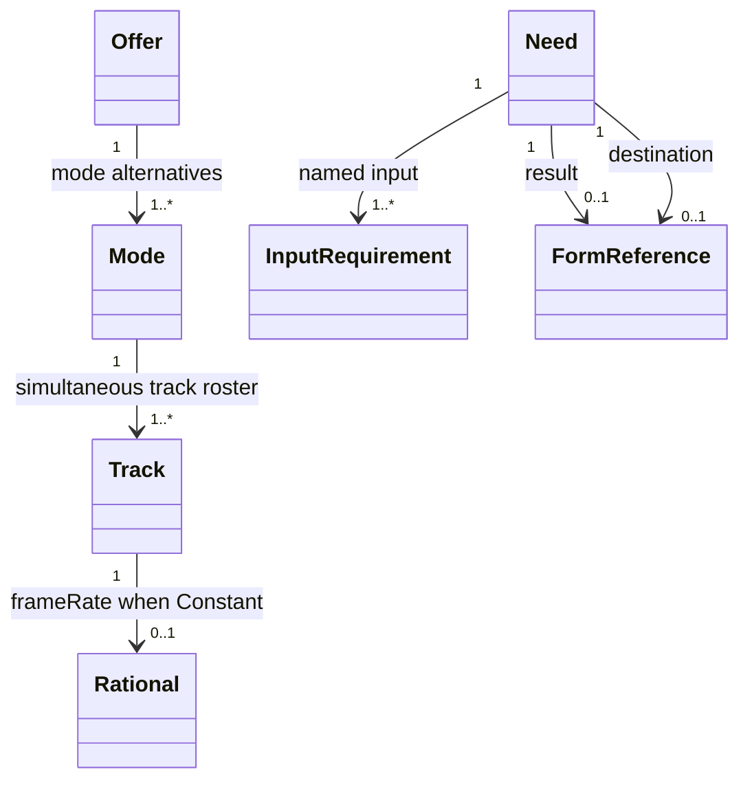
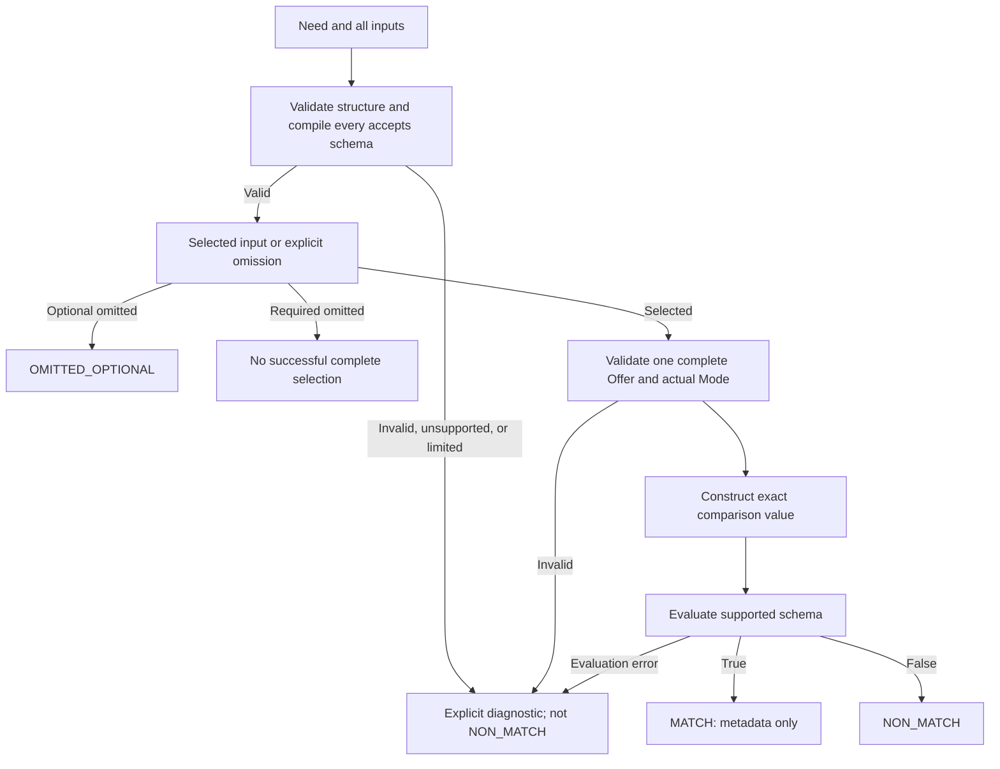
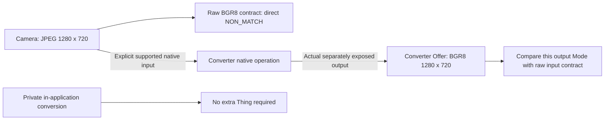
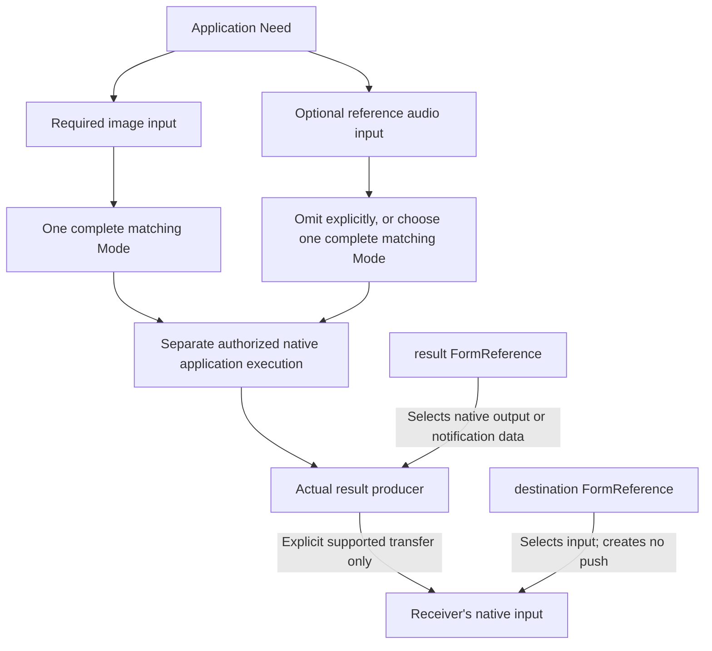

<!--
{
    "title": "Web of Things Audio/Video Description and Matching",
    "shortName": "wot-av",
    "specStatus": "unofficial",
    "publicationStatus": "Independent Editor's Draft",
    "draftDate": "2026-09-16",
    "vocabularyRelease": "0.2-proposed",
    "namespace": "https://example.org/wot/av/0.2#",
    "contextIdentifier": "https://example.org/wot/av/context/v0.2",
    "editors": [],
    "editorIdentityStatus": "Unassigned; no editor has been designated",
    "authoritativeFormat": "Markdown",
    "intendedDestination": "av/spec.md",
    "generatedPublication": "av/index.html",
    "rightsMetadata": "Do not infer or generate a license, affiliation, group, or patent-policy commitment",
    "bibliography": "Resolve the citation keys against the dated references in this document using the publication pipeline's local bibliography"
}
-->

# Web of Things Audio/Video Description and Matching

<a id="abstract"></a>
## Abstract

This specification defines a small, read-only audio/video description vocabulary
for Web of Things (WoT) applications. A publisher describes complete media
interfaces that already exist. An application author describes named inputs
using schemas over those descriptions. A matcher compares one complete offered
interface with one input contract. A native-capable consumer subsequently uses
the selected Thing Description (TD) Form, operation, binding, and security.

The model has seven classes, 29 AV properties, and no mandatory AV profile
families. It distinguishes encoded media from raw pixels or samples, exact
media cadence from delivery timing, and metadata compatibility from successful
access or execution. Results and destinations reuse the producer's and
receiver's native WoT interactions rather than introducing another payload,
assignment, or lifecycle framework. The specification defines independent
conformance roles, serialization and matching algorithms, native-reference
obligations, and the authority and limited coverage of its machine artifacts.

<a id="sotd"></a>
## Status of This Document

**Independent Editor's Draft, 16 September 2026; vocabulary `0.2-proposed`.**
This is an original, provisional specification. It is not a W3C Recommendation,
W3C group publication, registered vocabulary, ONVIF profile, certification,
or statement of deployed interoperability. No W3C or other organizational
endorsement, affiliation, rights assignment, patent-policy commitment, or
submission status is asserted.

The namespace `https://example.org/wot/av/0.2#` is an unregistered placeholder.
The context identifier `https://example.org/wot/av/context/v0.2` is unhosted.
An implementation can use the edition's supplied context through an explicit
local document loader; it cannot assume public retrieval succeeds. Editor
identity, affiliations, hosting, licensing, and any external publication route
remain subject to separate authorization. ReSpec styling does not change this
status. In particular, the renderer must not add a default license or
organizational rights statement.

**Processing edition `2026-09-16-clarifications` (informative).** The
[edition change record](support/migration/specification-clarifications.md)
identifies intentional processing corrections, preserved behavior, and
separate external publication gates. The [AV-D09 technical disposition](support/migration/dimensions-technical-disposition.md)
selects the active-raster meaning and explicit legacy-description migration
rules for this local edition; it is not named external review or formal
publication approval. Paired `GENERATED` regions are assembled and
checked from the sole authored term inventory. An inconsistent assembly is
not a conforming edition. Neither this clarification edition nor relocation
renames the AV namespace, context, package, or model identities. Compatibility
is demonstrated only for the retained ordinary raster example cohort, not
unknown third-party descriptions or incompatible display-oriented contracts.
Editorial, rights, hosting, and standards-route authorization remain future
external gates; their absence does not leave a technical choice open in this
independent draft.

<a id="contents"></a>
## Contents

- [Scope and architecture](#scope)
- [Conformance and authority](#conformance)
- [Terminology, identity, and namespaces](#terminology)
- [Abstract data model and class reference](#data-model)
- [AV property reference](#av-properties)
- [Controlled-value and native-operation reference](#controlled-values)
- [Directly reused external mappings](#external-mappings)
- [Serialization and semantic projection](#serialization)
- [Publication and media invariants](#media-invariants)
- [Portable acceptance-schema profile](#acceptance-profile)
- [Normalization, matching, and selection](#matching)
- [Native Forms, parameters, and security](#native-references)
- [Results, destinations, and explicit conversion](#results)
- [Diagnostics and resource limits](#diagnostics)
- [Security and privacy](#security-privacy)
- [Extensibility, internationalization, and accessibility](#extensions)
- [Normative artifact inventories](#annex-artifacts)
- [Independent implementer exercise](#annex-exercise)
- [Illustrations and implementation-support boundaries](#annex-support)
- [References](#references)

<a id="scope"></a>
<a id="1-decide-whether-another-layer-helps"></a>
## 1. Scope and architecture

If an existing native interface meets an application's requirements, use it
directly. AV metadata is optional. WoT already describes Properties, Actions,
Events, Forms, DataSchemas, and security. This specification adds reusable
media facts and application-owned acceptance criteria; it does not replace
those mechanisms. [[!WOT-TD11]][^td]

<a id="av-native-authority"></a>
**AV-NATIVE-AUTHORITY.** A publisher **MUST** project facts from the described
native interface faithfully. An AV requirement or metadata match **MUST NOT**
be interpreted as a camera configuration write, trigger, authorization,
processor invocation, or implicit change to any source fact.

Read-only is an ownership rule for AV facts, not a new access-control
mechanism. A native Property retains its own `readOnly`, `writeOnly`, and
`observable` behavior. An explicitly selected native operation may allocate
resources or have other native effects. Its actual security and operation
contract still apply.

<a id="figure-native-authority"></a>


**Figure 1 (informative): native authority.** Administration changes native
state; publication describes it; matching selects metadata; native consumption
is a separate, authorized interaction. There is no Need-to-setter path.

The following are outside the AV core: sensor controls, PTZ, exposure or ROI
commands; an AV frame or timestamp format; scheduling, reservations, leases,
freshness windows, clock synchronization, and transaction protocols; generic
codec negotiation; tensor/model manifests; implicit conversion; and an
execution, result-receipt, or provenance framework. Native ONVIF, UVC, GenICam,
and application bindings retain their own contracts. The separate
[ONVIF specification](../onvif/spec.md) is not a prerequisite for metadata-only
AV conformance.

WoT Discovery may supply candidate TDs. Discovery is not authorization,
capacity reservation, or proof of decoder or binding support. Search interface
and pagination behavior come from the advertised discovery service, not from
AV. [[WOT-DISCOVERY]][^discovery]

<a id="conformance"></a>
<a id="9-conformance-security-and-publication-boundaries"></a>
## 2. Conformance and authority

The key words **MUST**, **MUST NOT**, **REQUIRED**, **SHALL**, **SHALL NOT**,
**SHOULD**, **SHOULD NOT**, **RECOMMENDED**, **NOT RECOMMENDED**, **MAY**, and
**OPTIONAL** are interpreted as in BCP 14 only when capitalized.
[[!RFC2119]][[!RFC8174]][^bcp14]

All sections are normative except those expressly marked informative,
illustrative examples, figure captions and diagrams, implementation-support
reports, and the independent implementer exercise. An example illustrates a
rule; it does not add an unstated rule. Normative assertion identifiers are
stable editorial identifiers, not RDF terms or network error messages.

<a id="av-conformance-claims"></a>
**AV-CONFORMANCE-CLAIMS.** A claim **MUST** identify this edition, the applicable
role or roles, accepted input serializations, implemented native bindings if
any, and material resource limits. Passing one partial artifact check
**MUST NOT** be represented as complete AV, TD, native-protocol, or hardware
conformance.

| Role | Required behavior | Not established by this role |
| --- | --- | --- |
| Description Publisher | Publish valid, truthful, complete Offers/Modes and applicable Track facts; maintain valid native references; refresh after relevant native changes. | Authorization, decoder support, permanent availability, or a new exposure. |
| Requirement Author | Publish valid Needs and all InputRequirements, including explicit presence and portable schemas; choose native result/destination roles honestly. | Work submission, execution, or a source's capabilities. |
| Document Processor | Implement the claimed compact or semantic input procedure, original-input checks where available, record/cardinality validation, and explicit diagnostics. | A complete native binding or acceptance-schema evaluator unless separately claimed. |
| Metadata Matcher | Validate contracts before candidate iteration, validate complete selected descriptions, implement the entire portable schema profile within declared limits, and distinguish match, non-match, omission, and error. | Native access, media decoding, synchronization, or delivery. |
| Native-reference Consumer / Binding Implementation | Resolve original TD Forms, operations, bases, variables, payload direction, and security; implement every feature in the native binding scope it claims; report actual failures. | Protocols and security schemes outside its explicit claim, or product certification. |

One implementation may claim several roles. A structural validator or
metadata-only matcher need not implement SOAP, RTSP, camera SDKs, or native
media acquisition. Conversely, a binding claimant cannot use a metadata
helper's missing URI-template implementation as a standards exemption.

<a id="av-authority-single-source"></a>
**AV-AUTHORITY-SINGLE-SOURCE.** `spec.md` is the authoritative assembled
Markdown specification. `terms.json` is the sole authored inventory of term
identifiers, meanings, uses, cardinalities, controlled values, and entry
documentation. The inventory's normative fields are incorporated by
[Annex A](#annex-artifacts), and their complete readable definitions belong
inside this root specification. Composition, processing, and conformance
algorithms are authored in the surrounding Markdown.

<a id="av-edition-consistency"></a>
**AV-EDITION-CONSISTENCY.** The normative inventory, generated reference
regions, context, ontology, declared constraint artifacts, and prose **MUST**
agree. A contradiction is an edition defect that **MUST** block a successful
publication/conformance claim for the affected edition. An implementation
**MUST NOT** select whichever artifact happens to accept its input.

Upstream specifications own their imported semantics. An AV restriction on
their generality is explicitly identified as an AV restriction below.
Generated HTML and standalone reference views are derivatives, not another
authored authority. Runtime samples, tests, fixture oracles, research, support
notes, publication hashes, and historical documents are informative evidence,
not normative sources of AV meaning.

<a id="terminology"></a>
## 3. Terminology, identity, and namespaces

A **Thing** is the physical or logical entity described by a native TD. A
**source Thing** exposes the media interface described by an Offer; a
converter describes its own output Thing, not an imaginary changed camera.
A **publisher** declares those facts, possibly through an adapter. A
**processor** is a separately requested processing Thing, not a model file,
worker process, or implicit source.

A **TD document location** is the explicit location from which a TD is
obtained. A **Form identity** is the absolute `@id` naming a native Form
within that TD. A **native target** is the Form's `href`, after native base
resolution and any authorized parameter expansion. These four coordinates
are different even when their strings happen to coincide.

A **logical name** is the nonempty `dcterms:identifier` of a Track within a
Mode or an InputRequirement within a Need. It is not a device index, packet
identifier, ONVIF token, default input position, or globally unique name.

A **Mode description**, also called the **comparison value**, is the fixed
JSON value constructed by [normalization](#normalization-algorithm). It is
not an eighth class. An **acceptance contract** is the `av:accepts` schema
that tests that value, not a media payload or a native DataSchema.

**Absent** means not declared. **Unknown** means that no usable fact has
been established. **Invalid** means that a requirement of the selected
syntax or semantic contract is violated. **Unsupported** means that the
requested contract or binding is outside the specified or claimed support
boundary. **Non-match** means that a valid description failed a valid,
supported acceptance contract. None is interchangeable with false, zero,
an empty successful result, or a default source fact.

<a id="av-identity-distinction"></a>
**AV-IDENTITY-DISTINCTION.** Processors and consumers **MUST NOT** substitute
Thing identity, TD location, Form identity, and native target for one another.
Identity comparison uses exact Unicode scalar-value strings after required
IRI expansion; it performs no case folding, Unicode normalization, host
normalization, percent-decoding equivalence, or local-name matching.
Absolute IRIs follow [[!RFC3987]]; native URI resolution follows
[[!RFC3986]].[^iri]

AV identity/location values require a scheme and nonempty content after
the colon; HTTP(S) values additionally require an authority. Invalid
percent escapes, forbidden whitespace/control characters, and unpaired
surrogates are rejected, not normalized into a different identity.

| Prefix | Exact namespace |
| --- | --- |
| `av` | `https://example.org/wot/av/0.2#` |
| `td` | `https://www.w3.org/2019/wot/td#` |
| `hctl` | `https://www.w3.org/2019/wot/hypermedia#` |
| `dcterms` | `http://purl.org/dc/terms/` |
| `prov` | `http://www.w3.org/ns/prov#` |
| `rdf` | `http://www.w3.org/1999/02/22-rdf-syntax-ns#` |
| `rdfs` | `http://www.w3.org/2000/01/rdf-schema#` |
| `xsd` | `http://www.w3.org/2001/XMLSchema#` |

Every AV term reference below denotes the exact AV namespace followed by
the displayed local name. Prefix abbreviations do not create aliases for
terms in older or foreign namespaces.

<a id="figure-namespace"></a>


**Figure 2 (informative): namespace boundaries.** AV defines the thin media
model; TD owns interactions; external vocabularies retain their meanings.
Context, ontology, and shapes derive from one edition inventory.

<a id="data-model"></a>
<a id="2-seven-classes-with-clear-ownership-and-defaults"></a>
## 4. Abstract data model and class reference

The identified classes are Offer, Mode, Track, Need, and InputRequirement.
Their complete records require an absolute identity and their explicit AV
class. Rational and FormReference are intrinsic records; they may be
anonymous and their class may be determined by the typed containing slot.
An explicitly supplied intrinsic identity must still be absolute. The
[serialization rules](#serialization) define the precise treatment of these
forms, sets, shared identities, and foreign annotations.

<a id="figure-data-model"></a>


**Figure 3 (informative): all seven classes.** Offer owns alternatives; each
Mode owns simultaneous components. Need owns named input contracts and
optional native result/destination selections. Cardinalities and conditional
requirements are defined in the text, not by diagram notation alone.

**Entry-reading convention.** Every term's declaring party is responsible
for its statement; the native producer/receiver remains authoritative for
operational facts. A cardinality is per subject and property, before any
matching projection. A conditional minimum overrides a general `0..1`
minimum when its condition holds. An omitted required value is invalid;
an omitted optional value makes no claim. There are no implicit AV field
values. Each entry's example and counterexample is informative and uses the
shared complete-record rules rather than repeating an entire fixture.

<!-- BEGIN GENERATED: terms.json#/classes/Offer -->
<a id="class-offer"></a>
### 4.1 `av:Offer`

An Offer is one source Thing's discoverable set of alternative complete media
Modes. The source or adapter publisher authors it from known native interface
facts. A consumer compares its Modes individually and retains the selected
native access coordinates.

**Required:** absolute `@id`, explicit `av:Offer` type, one `av:source`, one
`av:document`, and a nonempty `av:mode` set. The located TD must identify the
source Thing. Absence of an Offer means no AV advertisement, not absence of
native capability. It gives no authorization or availability guarantee.
Example: the JPEG Offer in [the publication example](#example-offer).
Counterexample: an Offer containing independent width and codec options,
but no complete Mode, is invalid.

**Identity:** `iri`; **Superclasses:** none required.

**Defined by:** This unregistered, unhosted WoT AV 0.2-proposed draft

**Declared by:** The source or explicit adapter Thing publisher owns descriptive offered facts. It projects native facts; it does not grant permission to change camera settings.

**Source of truth:** Known facts at this offered native source or explicit processor output interface; native device/driver/media semantics remain authoritative.

**Describes:** One source Thing's discoverable set of alternative complete media Modes.

**Used by:** Consumers compare one complete offered Mode with a whole-input accepts schema, retaining unknown optional facts as absent.

**How to specify:** Identify the Offer with an absolute @id; supply source, document and one or more Modes.

**Boundary:** Read-only descriptive metadata does not configure cameras, infer transformations, authorize access or prove current availability.

**Defaults / omission (not-applicable):** No offer annotation means no AV media advertisement, not absence of native camera capabilities.
<!-- END GENERATED: terms.json#/classes/Offer -->

<!-- BEGIN GENERATED: terms.json#/classes/Mode -->
<a id="class-mode"></a>
### 4.2 `av:Mode`

A Mode is one jointly offered combination of media kind, one native Form,
and the complete simultaneous Track roster. The publisher authors the
combination, not a matcher assembling independent capability maxima.

**Required:** absolute `@id`, explicit `av:Mode` type, one `av:kind`, one
`av:form`, and a nonempty `av:track` set. A consumer tests the whole Mode
without changing it. Omission never permits synthesis of a missing
combination. Example: one Live H.264-plus-AAC interface. Counterexample:
video from one Mode plus audio from another is not a third offered Mode.

**Identity:** `iri`; **Superclasses:** none required.

**Defined by:** This unregistered, unhosted WoT AV 0.2-proposed draft

**Declared by:** The source or explicit adapter Thing publisher owns descriptive offered facts. It projects native facts; it does not grant permission to change camera settings.

**Source of truth:** Known facts at this offered native source or explicit processor output interface; native device/driver/media semantics remain authoritative.

**Describes:** One jointly offered media-kind, native-Form and complete simultaneous Track combination.

**Used by:** Consumers compare one complete offered Mode with a whole-input accepts schema, retaining unknown optional facts as absent.

**How to specify:** Use an absolute @id, kind, form and nonempty track set; source operation details remain in the native TD.

**Boundary:** Read-only descriptive metadata does not configure cameras, infer transformations, authorize access or prove current availability.

**Defaults / omission (not-applicable):** Do not synthesize missing combinations by taking independent maxima or tracks from other Modes.
<!-- END GENERATED: terms.json#/classes/Mode -->

<!-- BEGIN GENERATED: terms.json#/classes/Track -->
<a id="class-track"></a>
### 4.3 `av:Track`

A Track is one named encoded or raw component at the offered interface.
The publisher supplies actual representation facts; the consumer checks
only facts that are both declared and applicable.

**Required:** absolute `@id`, explicit `av:Track` type, one nonempty
`dcterms:identifier`, one `av:representation`, and all fields required by
the [representation matrix](#representation-matrix). Names and identities
are unique within a Mode. Missing essential facts invalidate the concrete
Mode; optional absent facts remain unknown. Example: a JPEG picture Track
with actual dimensions. Counterexample: a video Track with no height is
not an unconstrained-height offer.

**Identity:** `iri`; **Superclasses:** none required.

**Defined by:** This unregistered, unhosted WoT AV 0.2-proposed draft

**Declared by:** The source or explicit adapter Thing publisher owns descriptive offered facts. It projects native facts; it does not grant permission to change camera settings.

**Source of truth:** Known facts at this offered native source or explicit processor output interface; native device/driver/media semantics remain authoritative.

**Describes:** One named simultaneous encoded or raw component at this Thing's offered interface.

**Used by:** Consumers compare one complete offered Mode with a whole-input accepts schema, retaining unknown optional facts as absent.

**How to specify:** Use an absolute @id and dcterms:identifier unique within the Mode; state representation and applicable actual media fields.

**Boundary:** Read-only descriptive metadata does not configure cameras, infer transformations, authorize access or prove current availability.

**Defaults / omission (not-applicable):** Track roster is complete. Missing essential fields invalidate the concrete description; optional absent facts remain unknown.
<!-- END GENERATED: terms.json#/classes/Track -->

<!-- BEGIN GENERATED: terms.json#/classes/Rational -->
<a id="class-rational"></a>
### 4.4 `av:Rational`

A Rational is an exact, reduced signed integer numerator and positive
integer denominator. The declaring publisher supplies both integers; a
consumer preserves the value without floating-point rounding.

**Required:** one `av:numerator` and one `av:denominator`; their greatest
common divisor is one. At `av:frameRate`, the numerator is additionally
positive and the unit is frames per media second. Identity and an explicit
class type are optional for this intrinsic record. No denominator-one or
nominal-rate default exists. Example: `30000/1001`. Counterexamples:
`60000/2002`, a zero denominator, and a negative frame rate are invalid.
Generic zero is represented only by `0/1`.

**Identity:** `node`; **Superclasses:** none required.

**Defined by:** This unregistered, unhosted WoT AV 0.2-proposed draft

**Declared by:** The source or explicit adapter Thing publisher owns descriptive offered facts. It projects native facts; it does not grant permission to change camera settings.

**Source of truth:** The explicitly supplied exact integers; av:frameRate supplies frames per media-second as the unit.

**Describes:** An exact reduced integer numerator and positive integer denominator.

**Used by:** A matcher preserves exact integer pairs rather than rounding frame rates.

**How to specify:** Use numerator and denominator; frameRate requires a positive value. Reuse existing exact-integer and gcd rules.

**Boundary:** No generic clock model, cross-field arithmetic guarantee, runtime throughput or delivered-losslessness claim.

**Defaults / omission (not-applicable):** No denominator-one or nominal-rate fallback.
<!-- END GENERATED: terms.json#/classes/Rational -->

<!-- BEGIN GENERATED: terms.json#/classes/Need -->
<a id="class-need"></a>
### 4.5 `av:Need`

A Need is an identified desired-work input contract, optionally selecting a
processing Thing and native result/destination interactions. The application
or deployment author owns it. Source publishers do not rewrite their facts
to satisfy it.

**Required:** absolute `@id`, explicit `av:Need` type, and a nonempty `av:input`
set. `av:processor`, `av:result`, and `av:destination` are each optional and
single-valued; destination requires result. Ordinary revision metadata may
identify lineage, but no current-head, active-job, execution, or lease state
is implied. Example: one required image plus optional reference audio.
Counterexample: an empty Need is not successful empty work.

**Identity:** `iri`; **Superclasses:** none required.

**Defined by:** This unregistered, unhosted WoT AV 0.2-proposed draft

**Declared by:** The application/deployment author owns requested input constraints and selections, not the camera's offered facts.

**Source of truth:** This explicit workload-author Need revision; it does not replace published source facts or native schemas.

**Describes:** An identified desired-work input contract, optionally naming a target processor and declared result access/destination.

**Used by:** Application discovery/selection code evaluates the requested contract; it does not schedule or execute it.

**How to specify:** Use a stable absolute revision @id and named inputs; revisions use ordinary identifiers/metadata rather than a new current-head protocol.

**Boundary:** A request neither authorizes native camera controls nor proves availability, decoding, acceptance, delivery or durability.

**Defaults / omission (not-applicable):** No inferred active state, generation, assignment, execution or result guarantee.
<!-- END GENERATED: terms.json#/classes/Need -->

<!-- BEGIN GENERATED: terms.json#/classes/InputRequirement -->
<a id="class-inputrequirement"></a>
### 4.6 `av:InputRequirement`

An InputRequirement is one named logical input with an explicit inclusion
rule and one whole-Mode acceptance contract. The application author declares
it; a matcher validates it before selecting or omitting that input.

**Required:** absolute `@id`, explicit `av:InputRequirement` type, one
nonempty `dcterms:identifier`, one `av:presence`, and one object-valued
`av:accepts`. Names and identities are unique within a Need. Optional permits
omission of the whole input, not weakening its schema when selected.
Example: Required Still/BGR8 input. Counterexample: an omitted Optional
input whose schema is malformed is still an invalid requirement.

**Identity:** `iri`; **Superclasses:** none required.

**Defined by:** This unregistered, unhosted WoT AV 0.2-proposed draft

**Declared by:** The application/deployment author owns requested input constraints and selections, not the camera's offered facts.

**Source of truth:** This explicit workload-author Need revision; it does not replace published source facts or native schemas.

**Describes:** One named logical workload input with an explicit required/optional inclusion rule and a complete incoming-Mode acceptance schema.

**Used by:** Application discovery/selection code evaluates the requested contract; it does not schedule or execute it.

**How to specify:** Use @id, dcterms:identifier, explicit presence and accepts. Use whole-contract anyOf for alternatives.

**Boundary:** A request neither authorizes native camera controls nor proves availability, decoding, acceptance, delivery or durability.

**Defaults / omission (not-applicable):** Missing presence/accepts is invalid. Optional inclusion still requires the entire contract to hold.
<!-- END GENERATED: terms.json#/classes/InputRequirement -->

<!-- BEGIN GENERATED: terms.json#/classes/FormReference -->
<a id="class-formreference"></a>
### 4.7 `av:FormReference`

A FormReference selects an existing named native Form and standard TD
operation in an explicitly located TD. The selecting party owns the choice;
the TD publisher owns its target, binding, payload contract, and security.

**Required:** one `av:document`, one `av:form`, and one `av:operation`.
Identity and explicit class type are optional for this intrinsic record.
Resolution requires unique native Form membership, not a matching annotation
or `href`. No first-Form, inferred document, or default-operation selection
is allowed. Example: [the result reference](#example-result-reference).
Counterexample: an `href` and lowercase `invokeaction` token are not a
FormReference.

**Identity:** `node`; **Superclasses:** none required.

**Defined by:** This unregistered, unhosted WoT AV 0.2-proposed draft

**Declared by:** The party choosing an existing native Form owns the choice; the TD publisher owns its address, operation support, input/output schemas, binding and security.

**Source of truth:** The named native TD Form owns href, operation support, payload schema, binding and security; this record owns only the selection.

**Describes:** Selection of a named native Form and standard TD operation in an explicitly located TD document.

**Used by:** A consumer resolves unique native Form membership in the explicitly located TD and checks the selected operation.

**How to specify:** Supply document, form and operation. Verify unique native Form membership and compatible native operation.

**Boundary:** No copied endpoint, first-Form fallback, implicit document lookup, immutable-byte guarantee or authorization.

**Defaults / omission (not-applicable):** All three fields are required. No first-form, href-as-identity, nameless legacy, or implicit document lookup fallback.
<!-- END GENERATED: terms.json#/classes/FormReference -->

<a id="av-properties"></a>
## 5. AV property reference

All 29 AV properties are defined here. IRI-valued properties are RDF
relationships; integer facts denote `xsd:integer`; `accepts` denotes
`rdf:JSON`. The compact representations are specified in
[Section 8](#serialization). Optional external metadata does not relax any
of these AV constraints.

<!-- BEGIN GENERATED: terms.json#/properties/offer -->
<a id="property-offer"></a>
<a id="property-av-offer"></a>
### 5.1 `av:offer`

**Use:** `td:Thing` to `av:Offer`, `0..many`, unordered set serialized as an
array. The publisher associates complete advertisements with the described
source Thing. Consumers follow an explicitly supplied complete record
closure; an identifier alone is not a complete Offer. Omission or an empty
annotation array declares no AV advertisement, not no native capabilities.
Example: one embedded JPEG Offer. Counterexample: an advertised Offer
claiming a different containing Thing as its source violates source ownership.

**Representation:** `node`; unordered array/set. **Unit:** no additional numeric unit.

**Defined by:** This unregistered, unhosted WoT AV 0.2-proposed draft

**Declared by:** The source or explicit adapter Thing publisher owns descriptive offered facts. It projects native facts; it does not grant permission to change camera settings.

**Source of truth:** Known facts at this offered native source or explicit processor output interface; native device/driver/media semantics remain authoritative.

**Describes:** td:Thing: Advertised complete media alternatives, not copied endpoints.

**Used by:** Consumers compare one complete offered Mode with a whole-input accepts schema, retaining unknown optional facts as absent.

**How to specify:** Publish embedded or identified Offer records on the Thing.

**Boundary:** Read-only descriptive metadata does not configure cameras, infer transformations, authorize access or prove current availability.

**Defaults / omission (no-declaration):** No AV advertisement; no statement about all native capabilities.

**Use on `td:Thing`:** range `av:Offer`; cardinality `0..*`.

**Defined by:** This unregistered, unhosted WoT AV 0.2-proposed draft

**Declared by:** The source or explicit adapter Thing publisher owns descriptive offered facts. It projects native facts; it does not grant permission to change camera settings.

**Source of truth:** Known facts at this offered native source or explicit processor output interface; native device/driver/media semantics remain authoritative.

**Describes:** td:Thing: Advertised complete media alternatives, not copied endpoints.

**Used by:** Consumers compare one complete offered Mode with a whole-input accepts schema, retaining unknown optional facts as absent.

**How to specify:** Publish embedded or identified Offer records on the Thing.

**Boundary:** Read-only descriptive metadata does not configure cameras, infer transformations, authorize access or prove current availability.

**Defaults / omission (no-declaration):** No AV advertisement; no statement about all native capabilities.
<!-- END GENERATED: terms.json#/properties/offer -->

<!-- BEGIN GENERATED: terms.json#/properties/need -->
<a id="property-need"></a>
<a id="property-av-need"></a>
### 5.2 `av:need`

**Use:** `td:Thing` to `av:Need`, `0..many`, unordered array. An application
publisher associates identified requirement revisions with its Thing;
consumers obtain the selected complete Need before evaluating it. This is
association, not submission or active-state selection. Omission or an empty
array declares none. Example: an application links its inspection Need.
Counterexample: array order does not select a current revision.

**Representation:** `node`; unordered array/set. **Unit:** no additional numeric unit.

**Defined by:** This unregistered, unhosted WoT AV 0.2-proposed draft

**Declared by:** The application/deployment author owns requested input constraints and selections, not the camera's offered facts.

**Source of truth:** This explicit workload-author Need revision; it does not replace published source facts or native schemas.

**Describes:** td:Thing: Desired-work contracts associated with an application Thing.

**Used by:** Application discovery/selection code evaluates the requested contract; it does not schedule or execute it.

**How to specify:** Link identified Need revisions; no Assignment domain remains.

**Boundary:** A request neither authorizes native camera controls nor proves availability, decoding, acceptance, delivery or durability.

**Defaults / omission (no-declaration):** No declared workload request; no implied active/withdrawn state.

**Use on `td:Thing`:** range `av:Need`; cardinality `0..*`.

**Defined by:** This unregistered, unhosted WoT AV 0.2-proposed draft

**Declared by:** The application/deployment author owns requested input constraints and selections, not the camera's offered facts.

**Source of truth:** This explicit workload-author Need revision; it does not replace published source facts or native schemas.

**Describes:** td:Thing: Desired-work contracts associated with an application Thing.

**Used by:** Application discovery/selection code evaluates the requested contract; it does not schedule or execute it.

**How to specify:** Link identified Need revisions; no Assignment domain remains.

**Boundary:** A request neither authorizes native camera controls nor proves availability, decoding, acceptance, delivery or durability.

**Defaults / omission (no-declaration):** No declared workload request; no implied active/withdrawn state.
<!-- END GENERATED: terms.json#/properties/need -->

<!-- BEGIN GENERATED: terms.json#/properties/source -->
<a id="property-source"></a>
<a id="property-av-source"></a>
### 5.3 `av:source`

**Use:** `av:Offer` to one absolute Thing IRI, `1..1`. The publisher names
the physical or logical source of the advertised interface, including an
adapter or converter for its own output. Consumers compare that exact
identity and verify it against the located TD's native `id`. Omission is
invalid; neither a media URL nor a device index supplies a default.
Example: `urn:example:av-example:source`. Counterexample: treating that URN
as an automatically retrievable TD location.

**Representation:** `node`; one value when present. **Unit:** no additional numeric unit.

**Defined by:** This unregistered, unhosted WoT AV 0.2-proposed draft

**Declared by:** The source or explicit adapter Thing publisher owns descriptive offered facts. It projects native facts; it does not grant permission to change camera settings.

**Source of truth:** Known facts at this offered native source or explicit processor output interface; native device/driver/media semantics remain authoritative.

**Describes:** av:Offer: Physical or logical source Thing publishing this Offer.

**Used by:** Consumers compare one complete offered Mode with a whole-input accepts schema, retaining unknown optional facts as absent.

**How to specify:** Use the Thing id, including an adapter Thing for its own output; do not substitute href or a device index.

**Boundary:** Read-only descriptive metadata does not configure cameras, infer transformations, authorize access or prove current availability.

**Defaults / omission (required):** Invalid Offer. Source identity does not locate its TD document.

**Use on `av:Offer`:** range `IRI`; cardinality `1..1`.

**Defined by:** This unregistered, unhosted WoT AV 0.2-proposed draft

**Declared by:** The source or explicit adapter Thing publisher owns descriptive offered facts. It projects native facts; it does not grant permission to change camera settings.

**Source of truth:** Known facts at this offered native source or explicit processor output interface; native device/driver/media semantics remain authoritative.

**Describes:** av:Offer: Physical or logical source Thing publishing this Offer.

**Used by:** Consumers compare one complete offered Mode with a whole-input accepts schema, retaining unknown optional facts as absent.

**How to specify:** Use the Thing id, including an adapter Thing for its own output; do not substitute href or a device index.

**Boundary:** Read-only descriptive metadata does not configure cameras, infer transformations, authorize access or prove current availability.

**Defaults / omission (required):** Invalid Offer. Source identity does not locate its TD document.
<!-- END GENERATED: terms.json#/properties/source -->

<!-- BEGIN GENERATED: terms.json#/properties/mode -->
<a id="property-mode"></a>
<a id="property-av-mode"></a>
### 5.4 `av:mode`

**Use:** `av:Offer` to `av:Mode`, `1..many`, unordered array. The publisher
lists complete alternatives; a matcher tests an actual member as a whole.
Missing or empty is invalid. Array order, independent option arrays, and
parameter maxima do not establish priority or a Cartesian product.
Example: separate 1080p-with-audio and 720p-without-audio Modes.
Counterexample: deriving 720p-with-audio from those two declarations.

**Representation:** `node`; unordered array/set. **Unit:** no additional numeric unit.

**Defined by:** This unregistered, unhosted WoT AV 0.2-proposed draft

**Declared by:** The source or explicit adapter Thing publisher owns descriptive offered facts. It projects native facts; it does not grant permission to change camera settings.

**Source of truth:** Known facts at this offered native source or explicit processor output interface; native device/driver/media semantics remain authoritative.

**Describes:** av:Offer: Complete jointly offered alternatives.

**Used by:** Consumers compare one complete offered Mode with a whole-input accepts schema, retaining unknown optional facts as absent.

**How to specify:** List complete Modes rather than independent parameter arrays.

**Boundary:** Read-only descriptive metadata does not configure cameras, infer transformations, authorize access or prove current availability.

**Defaults / omission (required):** Empty or missing set is invalid; array order is not priority.

**Use on `av:Offer`:** range `av:Mode`; cardinality `1..*`.

**Defined by:** This unregistered, unhosted WoT AV 0.2-proposed draft

**Declared by:** The source or explicit adapter Thing publisher owns descriptive offered facts. It projects native facts; it does not grant permission to change camera settings.

**Source of truth:** Known facts at this offered native source or explicit processor output interface; native device/driver/media semantics remain authoritative.

**Describes:** av:Offer: Complete jointly offered alternatives.

**Used by:** Consumers compare one complete offered Mode with a whole-input accepts schema, retaining unknown optional facts as absent.

**How to specify:** List complete Modes rather than independent parameter arrays.

**Boundary:** Read-only descriptive metadata does not configure cameras, infer transformations, authorize access or prove current availability.

**Defaults / omission (required):** Empty or missing set is invalid; array order is not priority.
<!-- END GENERATED: terms.json#/properties/mode -->

<!-- BEGIN GENERATED: terms.json#/properties/kind -->
<a id="property-kind"></a>
<a id="property-av-kind"></a>
### 5.5 `av:kind`

**Use:** `av:Mode` to a MediaKind IRI, `1..1`. The publisher declares Live,
Still, or Clip; the consumer applies the corresponding temporal and roster
rules. There is no default, and a missing value is invalid. Still means a
finite image item without a cadence assertion; Clip means the whole finite
media item. Example: `av:Still` for an existing JPEG read.
Counterexample: inferring fresh exposure from Still.

**Representation:** `node`; one value when present. **Unit:** no additional numeric unit.

**Defined by:** This unregistered, unhosted WoT AV 0.2-proposed draft

**Declared by:** The source or explicit adapter Thing publisher owns descriptive offered facts. It projects native facts; it does not grant permission to change camera settings.

**Source of truth:** Known facts at this offered native source or explicit processor output interface; native device/driver/media semantics remain authoritative.

**Describes:** av:Mode: Live, Still or whole finite Clip.

**Used by:** Consumers compare one complete offered Mode with a whole-input accepts schema, retaining unknown optional facts as absent.

**How to specify:** Use explicit controlled IRI; a contract tests it through accepts.

**Boundary:** Read-only descriptive metadata does not configure cameras, infer transformations, authorize access or prove current availability.

**Defaults / omission (required):** Invalid Mode. Still is not fresh exposure; missing clip duration is not zero.

**Use on `av:Mode`:** range `enum:MediaKind`; cardinality `1..1`.

**Defined by:** This unregistered, unhosted WoT AV 0.2-proposed draft

**Declared by:** The source or explicit adapter Thing publisher owns descriptive offered facts. It projects native facts; it does not grant permission to change camera settings.

**Source of truth:** Known facts at this offered native source or explicit processor output interface; native device/driver/media semantics remain authoritative.

**Describes:** av:Mode: Live, Still or whole finite Clip.

**Used by:** Consumers compare one complete offered Mode with a whole-input accepts schema, retaining unknown optional facts as absent.

**How to specify:** Use explicit controlled IRI; a contract tests it through accepts.

**Boundary:** Read-only descriptive metadata does not configure cameras, infer transformations, authorize access or prove current availability.

**Defaults / omission (required):** Invalid Mode. Still is not fresh exposure; missing clip duration is not zero.
<!-- END GENERATED: terms.json#/properties/kind -->

<!-- BEGIN GENERATED: terms.json#/properties/form -->
<a id="property-form"></a>
<a id="property-av-form"></a>
### 5.6 `av:form`

**Uses:** `av:Mode` to one absolute native Form IRI, `1..1`; and
`av:FormReference` to one absolute native Form IRI, `1..1`.
For a Mode the publisher names access to that complete offered combination;
for a FormReference the selecting party chooses an existing interaction.
Consumers require unique membership in the declared TD's native Form
collections. Missing is invalid in either use; `href` and array position
are never defaults. Example: `urn:example:av-example:form:snapshot`.
Counterexample: an identically named node outside native `forms`.

**Representation:** `node`; one value when present. **Unit:** no additional numeric unit.

**Defined by:** This unregistered, unhosted WoT AV 0.2-proposed draft

**Declared by:** The source or explicit adapter Thing publisher owns descriptive offered facts. It projects native facts; it does not grant permission to change camera settings.

**Source of truth:** The named native TD Form owns href, operation support, payload schema, binding and security; this record owns only the selection.

**Describes:** av:Mode: Absolute @id of the selected native Form, never its href.

**Used by:** A consumer resolves unique native Form membership in the explicitly located TD and checks the selected operation.

**How to specify:** Verify unique membership under native TD forms/affordances in the explicitly identified TD.

**Boundary:** No copied endpoint, first-Form fallback, implicit document lookup, immutable-byte guarantee or authorization.

**Defaults / omission (required):** Invalid record; no array-index or first-Form fallback.

**Use on `av:Mode`:** range `IRI`; cardinality `1..1`.

**Defined by:** This unregistered, unhosted WoT AV 0.2-proposed draft

**Declared by:** The source or explicit adapter Thing publisher owns descriptive offered facts. It projects native facts; it does not grant permission to change camera settings.

**Source of truth:** The named native TD Form owns href, operation support, payload schema, binding and security; this record owns only the selection.

**Describes:** av:Mode: Absolute @id of the selected native Form, never its href.

**Used by:** A consumer resolves unique native Form membership in the explicitly located TD and checks the selected operation.

**How to specify:** Verify unique membership under native TD forms/affordances in the explicitly identified TD.

**Boundary:** No copied endpoint, first-Form fallback, implicit document lookup, immutable-byte guarantee or authorization.

**Defaults / omission (required):** Invalid record; no array-index or first-Form fallback.

**Use on `av:FormReference`:** range `IRI`; cardinality `1..1`.

**Defined by:** This unregistered, unhosted WoT AV 0.2-proposed draft

**Declared by:** The party choosing an existing native Form owns the choice; the TD publisher owns its address, operation support, input/output schemas, binding and security.

**Source of truth:** The named native TD Form owns href, operation support, payload schema, binding and security; this record owns only the selection.

**Describes:** av:FormReference: Absolute @id of the selected native Form, never its href.

**Used by:** A consumer resolves unique native Form membership in the explicitly located TD and checks the selected operation.

**How to specify:** Verify unique membership under native TD forms/affordances in the explicitly identified TD.

**Boundary:** No copied endpoint, first-Form fallback, implicit document lookup, immutable-byte guarantee or authorization.

**Defaults / omission (required):** Invalid record; no array-index or first-Form fallback.
<!-- END GENERATED: terms.json#/properties/form -->

<!-- BEGIN GENERATED: terms.json#/properties/track -->
<a id="property-track"></a>
<a id="property-av-track"></a>
### 5.7 `av:track`

**Use:** `av:Mode` to `av:Track`, `1..many`, unordered array. The publisher
declares every simultaneous component at that interface. A matcher retains
the entire roster, not only tracks useful to the current schema. Missing
or empty is invalid; no implicit video-only or audio-free default exists.
Example: video and audio together in one Live Mode.
Counterexample: dropping an audio Track to satisfy a one-Track contract.

**Representation:** `node`; unordered array/set. **Unit:** no additional numeric unit.

**Defined by:** This unregistered, unhosted WoT AV 0.2-proposed draft

**Declared by:** The source or explicit adapter Thing publisher owns descriptive offered facts. It projects native facts; it does not grant permission to change camera settings.

**Source of truth:** Known facts at this offered native source or explicit processor output interface; native device/driver/media semantics remain authoritative.

**Describes:** av:Mode: Complete simultaneous components of this Mode.

**Used by:** Consumers compare one complete offered Mode with a whole-input accepts schema, retaining unknown optional facts as absent.

**How to specify:** Use unique Track ids/names within this Mode; do not merge records from different Modes.

**Boundary:** Read-only descriptive metadata does not configure cameras, infer transformations, authorize access or prove current availability.

**Defaults / omission (required):** Invalid Mode, not an implicit video-only stream.

**Use on `av:Mode`:** range `av:Track`; cardinality `1..*`.

**Defined by:** This unregistered, unhosted WoT AV 0.2-proposed draft

**Declared by:** The source or explicit adapter Thing publisher owns descriptive offered facts. It projects native facts; it does not grant permission to change camera settings.

**Source of truth:** Known facts at this offered native source or explicit processor output interface; native device/driver/media semantics remain authoritative.

**Describes:** av:Mode: Complete simultaneous components of this Mode.

**Used by:** Consumers compare one complete offered Mode with a whole-input accepts schema, retaining unknown optional facts as absent.

**How to specify:** Use unique Track ids/names within this Mode; do not merge records from different Modes.

**Boundary:** Read-only descriptive metadata does not configure cameras, infer transformations, authorize access or prove current availability.

**Defaults / omission (required):** Invalid Mode, not an implicit video-only stream.
<!-- END GENERATED: terms.json#/properties/track -->

<!-- BEGIN GENERATED: terms.json#/properties/representation -->
<a id="property-representation"></a>
<a id="property-av-representation"></a>
### 5.8 `av:representation`

**Use:** `av:Track` to a Representation IRI, `1..1`. The publisher declares
EncodedVideo, RawVideo, EncodedAudio, or PCM at the offered interface.
Consumers enforce the applicable required and forbidden fields. Missing
is invalid; no implicit decode, channel conversion, or host-native format
exists. Example: `av:EncodedVideo` with JPEG.
Counterexample: labeling encoded JPEG bytes `av:RawVideo`.

**Representation:** `node`; one value when present. **Unit:** no additional numeric unit.

**Defined by:** This unregistered, unhosted WoT AV 0.2-proposed draft

**Declared by:** The source or explicit adapter Thing publisher owns descriptive offered facts. It projects native facts; it does not grant permission to change camera settings.

**Source of truth:** Known facts at this offered native source or explicit processor output interface; native device/driver/media semantics remain authoritative.

**Describes:** av:Track: EncodedVideo, RawVideo, EncodedAudio or PCM at the offered interface.

**Used by:** Consumers compare one complete offered Mode with a whole-input accepts schema, retaining unknown optional facts as absent.

**How to specify:** State the actual outgoing component representation, including an explicit processor's own output.

**Boundary:** Read-only descriptive metadata does not configure cameras, infer transformations, authorize access or prove current availability.

**Defaults / omission (required):** Invalid Track; no inferred decode or conversion.

**Use on `av:Track`:** range `enum:Representation`; cardinality `1..1`.

**Defined by:** This unregistered, unhosted WoT AV 0.2-proposed draft

**Declared by:** The source or explicit adapter Thing publisher owns descriptive offered facts. It projects native facts; it does not grant permission to change camera settings.

**Source of truth:** Known facts at this offered native source or explicit processor output interface; native device/driver/media semantics remain authoritative.

**Describes:** av:Track: EncodedVideo, RawVideo, EncodedAudio or PCM at the offered interface.

**Used by:** Consumers compare one complete offered Mode with a whole-input accepts schema, retaining unknown optional facts as absent.

**How to specify:** State the actual outgoing component representation, including an explicit processor's own output.

**Boundary:** Read-only descriptive metadata does not configure cameras, infer transformations, authorize access or prove current availability.

**Defaults / omission (required):** Invalid Track; no inferred decode or conversion.
<!-- END GENERATED: terms.json#/properties/representation -->

<!-- BEGIN GENERATED: terms.json#/properties/width -->
<a id="property-width"></a>
<a id="property-av-width"></a>
### 5.9 `av:width`

**Use:** `av:Track` to exact integer pixels, general `0..1`, minimum `1`;
required for EncodedVideo and RawVideo, forbidden for audio. The publisher
declares the active image-raster column count under [geometry](#image-geometry),
after codec-mandated conformance cropping for encoded media and before
presentation transforms. A consumer tests the declared integer without
inferring coordinates, orientation, display scaling, stride, sensor maximum,
or model-tensor dimensions. Missing on video invalidates the concrete Mode.
Example: a 4000 by 3000 JPEG with EXIF orientation 6 still has width `4000`.
Counterexample: substituting the rotated preview's width `3000` without
actually producing that different raster.

**Representation:** `integer`; one value when present. **Unit:** pixels.

**Conditions:** Required for EncodedVideo and RawVideo; forbidden for audio.

**Defined by:** This unregistered, unhosted WoT AV 0.2-proposed draft

**Declared by:** The source or explicit adapter Thing publisher owns descriptive offered facts. It projects native facts; it does not grant permission to change camera settings.

**Source of truth:** Known facts at this offered native source or explicit processor output interface; native device/driver/media semantics remain authoritative.

**Describes:** av:Track: Active image-raster columns at the described interface, after codec-mandated conformance cropping for encoded media and before presentation transforms; not coded padding, sensor maximum, stride or tensor width.

**Used by:** Consumers compare one complete offered Mode with a whole-input accepts schema, retaining unknown optional facts as absent.

**How to specify:** Project actual geometry; application constraints use accepts minimum/maximum/const with required.

**Boundary:** Read-only descriptive metadata does not configure cameras, infer transformations, authorize access or prove current availability.

**Defaults / omission (conditional):** Cannot publish this concrete video Mode; never fill from a camera capability maximum.

**Use on `av:Track`:** range `integer`; cardinality `0..1`.

**Defined by:** This unregistered, unhosted WoT AV 0.2-proposed draft

**Declared by:** The source or explicit adapter Thing publisher owns descriptive offered facts. It projects native facts; it does not grant permission to change camera settings.

**Source of truth:** Known facts at this offered native source or explicit processor output interface; native device/driver/media semantics remain authoritative.

**Describes:** av:Track: Active image-raster columns at the described interface, after codec-mandated conformance cropping for encoded media and before presentation transforms; not coded padding, sensor maximum, stride or tensor width.

**Used by:** Consumers compare one complete offered Mode with a whole-input accepts schema, retaining unknown optional facts as absent.

**How to specify:** Project actual geometry; application constraints use accepts minimum/maximum/const with required.

**Boundary:** Read-only descriptive metadata does not configure cameras, infer transformations, authorize access or prove current availability.

**Defaults / omission (conditional):** Cannot publish this concrete video Mode; never fill from a camera capability maximum.
<!-- END GENERATED: terms.json#/properties/width -->

<!-- BEGIN GENERATED: terms.json#/properties/height -->
<a id="property-height"></a>
<a id="property-av-height"></a>
### 5.10 `av:height`

**Use:** `av:Track` to exact integer pixels, general `0..1`, minimum `1`;
required for EncodedVideo and RawVideo, forbidden for audio. The publisher
declares the row count of the same active raster as width, under
[geometry](#image-geometry). No external coordinate system, display rotation,
resize, or scan direction follows from that count. Missing on video is invalid.
Example: coded storage height `1088` with a codec-mandated crop of eight
bottom sample rows has height `1080`. Counterexample: reporting the padded
height, a sensor maximum, or a tensor height instead.

**Representation:** `integer`; one value when present. **Unit:** pixels.

**Conditions:** Required for EncodedVideo and RawVideo; forbidden for audio.

**Defined by:** This unregistered, unhosted WoT AV 0.2-proposed draft

**Declared by:** The source or explicit adapter Thing publisher owns descriptive offered facts. It projects native facts; it does not grant permission to change camera settings.

**Source of truth:** Known facts at this offered native source or explicit processor output interface; native device/driver/media semantics remain authoritative.

**Describes:** av:Track: Active image-raster rows at the described interface, after codec-mandated conformance cropping for encoded media and before presentation transforms; not coded padding, sensor maximum or tensor height.

**Used by:** Consumers compare one complete offered Mode with a whole-input accepts schema, retaining unknown optional facts as absent.

**How to specify:** Project actual geometry; requested bounds remain inside accepts.

**Boundary:** Read-only descriptive metadata does not configure cameras, infer transformations, authorize access or prove current availability.

**Defaults / omission (conditional):** Cannot publish this concrete video Mode; no inferred resize.

**Use on `av:Track`:** range `integer`; cardinality `0..1`.

**Defined by:** This unregistered, unhosted WoT AV 0.2-proposed draft

**Declared by:** The source or explicit adapter Thing publisher owns descriptive offered facts. It projects native facts; it does not grant permission to change camera settings.

**Source of truth:** Known facts at this offered native source or explicit processor output interface; native device/driver/media semantics remain authoritative.

**Describes:** av:Track: Active image-raster rows at the described interface, after codec-mandated conformance cropping for encoded media and before presentation transforms; not coded padding, sensor maximum or tensor height.

**Used by:** Consumers compare one complete offered Mode with a whole-input accepts schema, retaining unknown optional facts as absent.

**How to specify:** Project actual geometry; requested bounds remain inside accepts.

**Boundary:** Read-only descriptive metadata does not configure cameras, infer transformations, authorize access or prove current availability.

**Defaults / omission (conditional):** Cannot publish this concrete video Mode; no inferred resize.
<!-- END GENERATED: terms.json#/properties/height -->

<!-- BEGIN GENERATED: terms.json#/properties/codec -->
<a id="property-codec"></a>
<a id="property-av-codec"></a>
### 5.11 `av:codec`

**Use:** `av:Track` to a Codec IRI, general `0..1`. It is required for
EncodedVideo, choosing H264/JPEG/H265, and EncodedAudio, choosing AAC/Opus;
it is forbidden for RawVideo and PCM. The publisher declares the coding
family; consumers do not infer profile, level, tier, initialization,
transport framing, or decoder support. Missing on encoded media is invalid.
Example: `av:H265` on EncodedVideo.
Counterexample: `av:Opus` on EncodedVideo or a container media type as codec.

**Representation:** `node`; one value when present. **Unit:** no additional numeric unit.

**Conditions:** Required for EncodedVideo (H264, JPEG, H265) and EncodedAudio (AAC, Opus); forbidden for RawVideo and PCM.

**Defined by:** This unregistered, unhosted WoT AV 0.2-proposed draft

**Declared by:** The source or explicit adapter Thing publisher owns descriptive offered facts. It projects native facts; it does not grant permission to change camera settings.

**Source of truth:** Known facts at this offered native source or explicit processor output interface; native device/driver/media semantics remain authoritative.

**Describes:** av:Track: Encoded-media coding family, not signaling contentType or decoder support.

**Used by:** Consumers compare one complete offered Mode with a whole-input accepts schema, retaining unknown optional facts as absent.

**How to specify:** Reuse H264/JPEG/H265 for encoded video and AAC/Opus for encoded audio; exact initialization/negotiation stays native.

**Boundary:** Read-only descriptive metadata does not configure cameras, infer transformations, authorize access or prove current availability.

**Defaults / omission (conditional):** Cannot publish that concrete encoded Track. Unknown families are not coerced to a known codec.

**Use on `av:Track`:** range `enum:Codec`; cardinality `0..1`.

**Defined by:** This unregistered, unhosted WoT AV 0.2-proposed draft

**Declared by:** The source or explicit adapter Thing publisher owns descriptive offered facts. It projects native facts; it does not grant permission to change camera settings.

**Source of truth:** Known facts at this offered native source or explicit processor output interface; native device/driver/media semantics remain authoritative.

**Describes:** av:Track: Encoded-media coding family, not signaling contentType or decoder support.

**Used by:** Consumers compare one complete offered Mode with a whole-input accepts schema, retaining unknown optional facts as absent.

**How to specify:** Reuse H264/JPEG/H265 for encoded video and AAC/Opus for encoded audio; exact initialization/negotiation stays native.

**Boundary:** Read-only descriptive metadata does not configure cameras, infer transformations, authorize access or prove current availability.

**Defaults / omission (conditional):** Cannot publish that concrete encoded Track. Unknown families are not coerced to a known codec.
<!-- END GENERATED: terms.json#/properties/codec -->

<!-- BEGIN GENERATED: terms.json#/properties/pixelFormat -->
<a id="property-pixelformat"></a>
<a id="property-av-pixelformat"></a>
### 5.12 `av:pixelFormat`

**Use:** `av:Track` to a PixelFormat IRI, general `0..1`; required only for
RawVideo and forbidden otherwise. The publisher declares known component
order, sample width, and logical packing. Consumers use the exact controlled
format and obtain unexpressed layout/color facts natively. There is no RGB,
BGR, PFNC, or host-format fallback. Example: `av:BGR8`.
Counterexample: treating a native format with a different channel order as BGR8.

**Representation:** `node`; one value when present. **Unit:** no additional numeric unit.

**Conditions:** Required only for RawVideo; forbidden for every other representation.

**Defined by:** This unregistered, unhosted WoT AV 0.2-proposed draft

**Declared by:** The source or explicit adapter Thing publisher owns descriptive offered facts. It projects native facts; it does not grant permission to change camera settings.

**Source of truth:** Known facts at this offered native source or explicit processor output interface; native device/driver/media semantics remain authoritative.

**Describes:** av:Track: Actual raw channel order and sample packing.

**Used by:** Consumers compare one complete offered Mode with a whole-input accepts schema, retaining unknown optional facts as absent.

**How to specify:** Reuse existing named formats only for known mappings; native PFNC/UVC/buffer details remain in their native interfaces.

**Boundary:** Read-only descriptive metadata does not configure cameras, infer transformations, authorize access or prove current availability.

**Defaults / omission (conditional):** Raw representation is incomplete, not implicitly RGB8 or BGR8.

**Use on `av:Track`:** range `enum:PixelFormat`; cardinality `0..1`.

**Defined by:** This unregistered, unhosted WoT AV 0.2-proposed draft

**Declared by:** The source or explicit adapter Thing publisher owns descriptive offered facts. It projects native facts; it does not grant permission to change camera settings.

**Source of truth:** Known facts at this offered native source or explicit processor output interface; native device/driver/media semantics remain authoritative.

**Describes:** av:Track: Actual raw channel order and sample packing.

**Used by:** Consumers compare one complete offered Mode with a whole-input accepts schema, retaining unknown optional facts as absent.

**How to specify:** Reuse existing named formats only for known mappings; native PFNC/UVC/buffer details remain in their native interfaces.

**Boundary:** Read-only descriptive metadata does not configure cameras, infer transformations, authorize access or prove current availability.

**Defaults / omission (conditional):** Raw representation is incomplete, not implicitly RGB8 or BGR8.
<!-- END GENERATED: terms.json#/properties/pixelFormat -->

<!-- BEGIN GENERATED: terms.json#/properties/cadence -->
<a id="property-cadence"></a>
<a id="property-av-cadence"></a>
### 5.13 `av:cadence`

**Use:** `av:Track` to a Cadence IRI, `0..1`; permitted only on Live/Clip
video. The publisher declares known Constant, Variable, or Triggered media
cadence. Consumers distinguish a media-timeline fact from observed arrival
rate. Omission means unknown; it does not mean Constant or Variable.
Still and audio forbid this field. Example: `av:Triggered` without frameRate.
Counterexample: treating Triggered as permission to invoke a trigger.

**Representation:** `node`; one value when present. **Unit:** no additional numeric unit.

**Conditions:** Optional for Live/Clip video; forbidden for Still and audio. Omission is unknown.

**Defined by:** This unregistered, unhosted WoT AV 0.2-proposed draft

**Declared by:** The source or explicit adapter Thing publisher owns descriptive offered facts. It projects native facts; it does not grant permission to change camera settings.

**Source of truth:** Known facts at this offered native source or explicit processor output interface; native device/driver/media semantics remain authoritative.

**Describes:** av:Track: Constant, Variable or Triggered observed/offered cadence semantics.

**Used by:** Consumers compare one complete offered Mode with a whole-input accepts schema, retaining unknown optional facts as absent.

**How to specify:** State a known media cadence category; Triggered does not expose a trigger command.

**Boundary:** Read-only descriptive metadata does not configure cameras, infer transformations, authorize access or prove current availability.

**Defaults / omission (conditional):** Cadence unknown, never Constant by default.

**Use on `av:Track`:** range `enum:Cadence`; cardinality `0..1`.

**Defined by:** This unregistered, unhosted WoT AV 0.2-proposed draft

**Declared by:** The source or explicit adapter Thing publisher owns descriptive offered facts. It projects native facts; it does not grant permission to change camera settings.

**Source of truth:** Known facts at this offered native source or explicit processor output interface; native device/driver/media semantics remain authoritative.

**Describes:** av:Track: Constant, Variable or Triggered observed/offered cadence semantics.

**Used by:** Consumers compare one complete offered Mode with a whole-input accepts schema, retaining unknown optional facts as absent.

**How to specify:** State a known media cadence category; Triggered does not expose a trigger command.

**Boundary:** Read-only descriptive metadata does not configure cameras, infer transformations, authorize access or prove current availability.

**Defaults / omission (conditional):** Cadence unknown, never Constant by default.
<!-- END GENERATED: terms.json#/properties/cadence -->

<!-- BEGIN GENERATED: terms.json#/properties/frameRate -->
<a id="property-framerate"></a>
<a id="property-av-framerate"></a>
### 5.14 `av:frameRate`

**Use:** `av:Track` to `av:Rational`, general `0..1`, in frames per media
second. It is required exactly when cadence is Constant and forbidden
otherwise. The publisher supplies a positive reduced ratio; consumers
preserve both exact integers. Absence with Constant is invalid; otherwise
no exact rate is asserted. It is not a delivery-loss or throughput promise.
Example: `30000/1001`. Counterexample: rounding it to `30/1`, or using a
device frame-rate limit as evidence of exact constant cadence.

**Representation:** `node`; one value when present. **Unit:** frames/media-second.

**Conditions:** Required exactly with Constant cadence; otherwise forbidden. Positive, gcd-reduced Rational only.

**Defined by:** This unregistered, unhosted WoT AV 0.2-proposed draft

**Declared by:** The source or explicit adapter Thing publisher owns descriptive offered facts. It projects native facts; it does not grant permission to change camera settings.

**Source of truth:** Known facts at this offered native source or explicit processor output interface; native device/driver/media semantics remain authoritative.

**Describes:** av:Track: Exact media cadence at this offered interface, not wall-clock throughput or delivered-losslessness SLA.

**Used by:** Consumers compare one complete offered Mode with a whole-input accepts schema, retaining unknown optional facts as absent.

**How to specify:** Use reduced exact numerator/denominator; request exact pairs/enumerated alternatives in accepts.

**Boundary:** Read-only descriptive metadata does not configure cameras, infer transformations, authorize access or prove current availability.

**Defaults / omission (conditional):** Invalid with Constant; otherwise no exact rate is asserted. No rounding 30000/1001 to 30.

**Use on `av:Track`:** range `av:Rational`; cardinality `0..1`.

**Defined by:** This unregistered, unhosted WoT AV 0.2-proposed draft

**Declared by:** The source or explicit adapter Thing publisher owns descriptive offered facts. It projects native facts; it does not grant permission to change camera settings.

**Source of truth:** Known facts at this offered native source or explicit processor output interface; native device/driver/media semantics remain authoritative.

**Describes:** av:Track: Exact media cadence at this offered interface, not wall-clock throughput or delivered-losslessness SLA.

**Used by:** Consumers compare one complete offered Mode with a whole-input accepts schema, retaining unknown optional facts as absent.

**How to specify:** Use reduced exact numerator/denominator; request exact pairs/enumerated alternatives in accepts.

**Boundary:** Read-only descriptive metadata does not configure cameras, infer transformations, authorize access or prove current availability.

**Defaults / omission (conditional):** Invalid with Constant; otherwise no exact rate is asserted. No rounding 30000/1001 to 30.
<!-- END GENERATED: terms.json#/properties/frameRate -->

<!-- BEGIN GENERATED: terms.json#/properties/sampleRate -->
<a id="property-samplerate"></a>
<a id="property-av-samplerate"></a>
### 5.15 `av:sampleRate`

**Use:** `av:Track` to an exact positive integer, general `0..1`, in samples
per second per channel; required for EncodedAudio and PCM, forbidden for
video. The publisher supplies actual media sampling frequency. A consumer
does not infer it from an RTP timestamp clock or fixed SDP signaling value.
Missing makes the audio description incomplete; `48000` is not a default.
Example: declared PCM `48000`. Counterexample: deriving an Opus media
sampling frequency solely from the RTP clock.

**Representation:** `integer`; one value when present. **Unit:** samples/second/channel.

**Conditions:** Required for EncodedAudio and PCM; forbidden for video.

**Defined by:** This unregistered, unhosted WoT AV 0.2-proposed draft

**Declared by:** The source or explicit adapter Thing publisher owns descriptive offered facts. It projects native facts; it does not grant permission to change camera settings.

**Source of truth:** Known facts at this offered native source or explicit processor output interface; native device/driver/media semantics remain authoritative.

**Describes:** av:Track: Actual audio sampling frequency per channel.

**Used by:** Consumers compare one complete offered Mode with a whole-input accepts schema, retaining unknown optional facts as absent.

**How to specify:** Project the media signature, not an RTP clock or fixed SDP signaling value.

**Boundary:** Read-only descriptive metadata does not configure cameras, infer transformations, authorize access or prove current availability.

**Defaults / omission (conditional):** Concrete audio description is incomplete; no default 48000.

**Use on `av:Track`:** range `integer`; cardinality `0..1`.

**Defined by:** This unregistered, unhosted WoT AV 0.2-proposed draft

**Declared by:** The source or explicit adapter Thing publisher owns descriptive offered facts. It projects native facts; it does not grant permission to change camera settings.

**Source of truth:** Known facts at this offered native source or explicit processor output interface; native device/driver/media semantics remain authoritative.

**Describes:** av:Track: Actual audio sampling frequency per channel.

**Used by:** Consumers compare one complete offered Mode with a whole-input accepts schema, retaining unknown optional facts as absent.

**How to specify:** Project the media signature, not an RTP clock or fixed SDP signaling value.

**Boundary:** Read-only descriptive metadata does not configure cameras, infer transformations, authorize access or prove current availability.

**Defaults / omission (conditional):** Concrete audio description is incomplete; no default 48000.
<!-- END GENERATED: terms.json#/properties/sampleRate -->

<!-- BEGIN GENERATED: terms.json#/properties/channels -->
<a id="property-channels"></a>
<a id="property-av-channels"></a>
### 5.16 `av:channels`

**Use:** `av:Track` to an exact positive integer count, general `0..1`;
required for audio and forbidden for video. The publisher states the
actual count, and the consumer checks consistency with channelLayout:
Mono requires one, StereoLR two. Neither count nor layout defaults the other.
Missing is invalid on audio. Example: `2` with `av:StereoLR`.
Counterexample: six channels coerced into the supported stereo contract.

**Representation:** `integer`; one value when present. **Unit:** channels.

**Conditions:** Required for audio; Mono requires 1, StereoLR requires 2. Forbidden for video.

**Defined by:** This unregistered, unhosted WoT AV 0.2-proposed draft

**Declared by:** The source or explicit adapter Thing publisher owns descriptive offered facts. It projects native facts; it does not grant permission to change camera settings.

**Source of truth:** Known facts at this offered native source or explicit processor output interface; native device/driver/media semantics remain authoritative.

**Describes:** av:Track: Actual number of media channels.

**Used by:** Consumers compare one complete offered Mode with a whole-input accepts schema, retaining unknown optional facts as absent.

**How to specify:** Keep consistent with channelLayout; do not infer from a signaling clock declaration.

**Boundary:** Read-only descriptive metadata does not configure cameras, infer transformations, authorize access or prove current availability.

**Defaults / omission (conditional):** Concrete audio description is incomplete; no mono/stereo default.

**Use on `av:Track`:** range `integer`; cardinality `0..1`.

**Defined by:** This unregistered, unhosted WoT AV 0.2-proposed draft

**Declared by:** The source or explicit adapter Thing publisher owns descriptive offered facts. It projects native facts; it does not grant permission to change camera settings.

**Source of truth:** Known facts at this offered native source or explicit processor output interface; native device/driver/media semantics remain authoritative.

**Describes:** av:Track: Actual number of media channels.

**Used by:** Consumers compare one complete offered Mode with a whole-input accepts schema, retaining unknown optional facts as absent.

**How to specify:** Keep consistent with channelLayout; do not infer from a signaling clock declaration.

**Boundary:** Read-only descriptive metadata does not configure cameras, infer transformations, authorize access or prove current availability.

**Defaults / omission (conditional):** Concrete audio description is incomplete; no mono/stereo default.
<!-- END GENERATED: terms.json#/properties/channels -->

<!-- BEGIN GENERATED: terms.json#/properties/channelLayout -->
<a id="property-channellayout"></a>
<a id="property-av-channellayout"></a>
### 5.17 `av:channelLayout`

**Use:** `av:Track` to a ChannelLayout IRI, general `0..1`; required for
audio and forbidden for video. The publisher states channel meaning/order;
the consumer distinguishes it from memory layout. Supported pairs are
Mono/one and StereoLR/two. Missing or unrepresentable layout is not a
portable concrete audio offer. Example: `av:StereoLR`.
Counterexample: inferring left/right order merely because channels is two.

**Representation:** `node`; one value when present. **Unit:** no additional numeric unit.

**Conditions:** Required for audio; Mono/1 and StereoLR/2 are the supported matching pairs. Forbidden for video.

**Defined by:** This unregistered, unhosted WoT AV 0.2-proposed draft

**Declared by:** The source or explicit adapter Thing publisher owns descriptive offered facts. It projects native facts; it does not grant permission to change camera settings.

**Source of truth:** Known facts at this offered native source or explicit processor output interface; native device/driver/media semantics remain authoritative.

**Describes:** av:Track: Audio channel meaning and order, independent of storage layout.

**Used by:** Consumers compare one complete offered Mode with a whole-input accepts schema, retaining unknown optional facts as absent.

**How to specify:** Reuse Mono/1 and StereoLR/2 when known; unrepresented layouts require native descriptions, not a guessed mapping.

**Boundary:** Read-only descriptive metadata does not configure cameras, infer transformations, authorize access or prove current availability.

**Defaults / omission (conditional):** No known portable channel contract.

**Use on `av:Track`:** range `enum:ChannelLayout`; cardinality `0..1`.

**Defined by:** This unregistered, unhosted WoT AV 0.2-proposed draft

**Declared by:** The source or explicit adapter Thing publisher owns descriptive offered facts. It projects native facts; it does not grant permission to change camera settings.

**Source of truth:** Known facts at this offered native source or explicit processor output interface; native device/driver/media semantics remain authoritative.

**Describes:** av:Track: Audio channel meaning and order, independent of storage layout.

**Used by:** Consumers compare one complete offered Mode with a whole-input accepts schema, retaining unknown optional facts as absent.

**How to specify:** Reuse Mono/1 and StereoLR/2 when known; unrepresented layouts require native descriptions, not a guessed mapping.

**Boundary:** Read-only descriptive metadata does not configure cameras, infer transformations, authorize access or prove current availability.

**Defaults / omission (conditional):** No known portable channel contract.
<!-- END GENERATED: terms.json#/properties/channelLayout -->

<!-- BEGIN GENERATED: terms.json#/properties/sampleFormat -->
<a id="property-sampleformat"></a>
<a id="property-av-sampleformat"></a>
### 5.18 `av:sampleFormat`

**Use:** `av:Track` to a SampleFormat IRI, general `0..1`; required only for
PCM and forbidden otherwise. The publisher declares S16LE or F32LE at the
offered interface. Consumers use the stated sample width and byte order,
not the host's numeric defaults. Missing makes PCM incomplete.
Example: `av:S16LE`. Counterexample: assigning a PCM sample format to
encoded AAC before an explicit decoding boundary.

**Representation:** `node`; one value when present. **Unit:** no additional numeric unit.

**Conditions:** Required only for PCM; forbidden for every other representation.

**Defined by:** This unregistered, unhosted WoT AV 0.2-proposed draft

**Declared by:** The source or explicit adapter Thing publisher owns descriptive offered facts. It projects native facts; it does not grant permission to change camera settings.

**Source of truth:** Known facts at this offered native source or explicit processor output interface; native device/driver/media semantics remain authoritative.

**Describes:** av:Track: PCM numeric sample representation.

**Used by:** Consumers compare one complete offered Mode with a whole-input accepts schema, retaining unknown optional facts as absent.

**How to specify:** Reuse S16LE/F32LE for the actual sample representation.

**Boundary:** Read-only descriptive metadata does not configure cameras, infer transformations, authorize access or prove current availability.

**Defaults / omission (conditional):** PCM description is incomplete, not a host-native numeric default.

**Use on `av:Track`:** range `enum:SampleFormat`; cardinality `0..1`.

**Defined by:** This unregistered, unhosted WoT AV 0.2-proposed draft

**Declared by:** The source or explicit adapter Thing publisher owns descriptive offered facts. It projects native facts; it does not grant permission to change camera settings.

**Source of truth:** Known facts at this offered native source or explicit processor output interface; native device/driver/media semantics remain authoritative.

**Describes:** av:Track: PCM numeric sample representation.

**Used by:** Consumers compare one complete offered Mode with a whole-input accepts schema, retaining unknown optional facts as absent.

**How to specify:** Reuse S16LE/F32LE for the actual sample representation.

**Boundary:** Read-only descriptive metadata does not configure cameras, infer transformations, authorize access or prove current availability.

**Defaults / omission (conditional):** PCM description is incomplete, not a host-native numeric default.
<!-- END GENERATED: terms.json#/properties/sampleFormat -->

<!-- BEGIN GENERATED: terms.json#/properties/bufferLayout -->
<a id="property-bufferlayout"></a>
<a id="property-av-bufferlayout"></a>
### 5.19 `av:bufferLayout`

**Use:** `av:Track` to a BufferLayout IRI, general `0..1`; required for
RawVideo (Contiguous or Strided) and PCM (Interleaved or Planar), forbidden
for encoded media. The publisher declares an actual category. A consumer
still obtains native strides, plane offsets, accessibility, and lifetime
when required. Omission makes the raw description incomplete.
Example: `av:Contiguous` BGR8. Counterexample: using `av:Planar` as a
RawVideo bufferLayout merely because YUV420P has planes.

**Representation:** `node`; one value when present. **Unit:** no additional numeric unit.

**Conditions:** Required for RawVideo (Contiguous/Strided) or PCM (Interleaved/Planar); otherwise forbidden.

**Defined by:** This unregistered, unhosted WoT AV 0.2-proposed draft

**Declared by:** The source or explicit adapter Thing publisher owns descriptive offered facts. It projects native facts; it does not grant permission to change camera settings.

**Source of truth:** Known facts at this offered native source or explicit processor output interface; native device/driver/media semantics remain authoritative.

**Describes:** av:Track: Image Contiguous/Strided or audio Interleaved/Planar layout category.

**Used by:** Consumers compare one complete offered Mode with a whole-input accepts schema, retaining unknown optional facts as absent.

**How to specify:** Publish the actual category. Detailed strides/colorimetry/memory access are native-interface facts, not inferred from the category.

**Boundary:** Read-only descriptive metadata does not configure cameras, infer transformations, authorize access or prove current availability.

**Defaults / omission (conditional):** Raw description is incomplete; Strided alone does not prove an application's buffer compatibility.

**Use on `av:Track`:** range `enum:BufferLayout`; cardinality `0..1`.

**Defined by:** This unregistered, unhosted WoT AV 0.2-proposed draft

**Declared by:** The source or explicit adapter Thing publisher owns descriptive offered facts. It projects native facts; it does not grant permission to change camera settings.

**Source of truth:** Known facts at this offered native source or explicit processor output interface; native device/driver/media semantics remain authoritative.

**Describes:** av:Track: Image Contiguous/Strided or audio Interleaved/Planar layout category.

**Used by:** Consumers compare one complete offered Mode with a whole-input accepts schema, retaining unknown optional facts as absent.

**How to specify:** Publish the actual category. Detailed strides/colorimetry/memory access are native-interface facts, not inferred from the category.

**Boundary:** Read-only descriptive metadata does not configure cameras, infer transformations, authorize access or prove current availability.

**Defaults / omission (conditional):** Raw description is incomplete; Strided alone does not prove an application's buffer compatibility.
<!-- END GENERATED: terms.json#/properties/bufferLayout -->

<!-- BEGIN GENERATED: terms.json#/properties/numerator -->
<a id="property-numerator"></a>
<a id="property-av-numerator"></a>
### 5.20 `av:numerator`

**Use:** `av:Rational` to exact integer, `1..1`. The publisher supplies the
signed numerator; at frameRate it must be strictly positive. The consumer
checks exact source-integer syntax and coprimality with the denominator.
The containing property supplies units. Missing is invalid and does not
default to zero. Example: `30000` in `30000/1001`.
Counterexample: `"30000"` as an untyped numeric-looking string.

**Representation:** `integer`; one value when present. **Unit:** no additional numeric unit.

**Conditions:** Signed on a generic Rational; strictly positive when used as frameRate.

**Defined by:** This unregistered, unhosted WoT AV 0.2-proposed draft

**Declared by:** The source or explicit adapter Thing publisher owns descriptive offered facts. It projects native facts; it does not grant permission to change camera settings.

**Source of truth:** The explicitly supplied exact integers; av:frameRate supplies frames per media-second as the unit.

**Describes:** av:Rational: Signed ratio numerator; positive at frameRate.

**Used by:** A matcher preserves exact integer pairs rather than rounding frame rates.

**How to specify:** Use the existing safe JSON integer or explicit typed lexical integer convention and gcd reduction.

**Boundary:** No generic clock model, cross-field arithmetic guarantee, runtime throughput or delivered-losslessness claim.

**Defaults / omission (required):** Invalid Rational; no zero fallback.

**Use on `av:Rational`:** range `integer`; cardinality `1..1`.

**Defined by:** This unregistered, unhosted WoT AV 0.2-proposed draft

**Declared by:** The source or explicit adapter Thing publisher owns descriptive offered facts. It projects native facts; it does not grant permission to change camera settings.

**Source of truth:** The explicitly supplied exact integers; av:frameRate supplies frames per media-second as the unit.

**Describes:** av:Rational: Signed ratio numerator; positive at frameRate.

**Used by:** A matcher preserves exact integer pairs rather than rounding frame rates.

**How to specify:** Use the existing safe JSON integer or explicit typed lexical integer convention and gcd reduction.

**Boundary:** No generic clock model, cross-field arithmetic guarantee, runtime throughput or delivered-losslessness claim.

**Defaults / omission (required):** Invalid Rational; no zero fallback.
<!-- END GENERATED: terms.json#/properties/numerator -->

<!-- BEGIN GENERATED: terms.json#/properties/denominator -->
<a id="property-denominator"></a>
<a id="property-av-denominator"></a>
### 5.21 `av:denominator`

**Use:** `av:Rational` to exact positive integer, `1..1`, minimum `1`.
The publisher supplies it explicitly; the consumer checks positivity and
coprimality. There is no implicit denominator one and no repair by automatic
reduction. Example: `1001`. Counterexample: `0`, omission, or a pair
whose greatest common divisor is greater than one.

**Representation:** `integer`; one value when present. **Unit:** no additional numeric unit.

**Conditions:** Strictly positive and coprime to numerator.

**Defined by:** This unregistered, unhosted WoT AV 0.2-proposed draft

**Declared by:** The source or explicit adapter Thing publisher owns descriptive offered facts. It projects native facts; it does not grant permission to change camera settings.

**Source of truth:** The explicitly supplied exact integers; av:frameRate supplies frames per media-second as the unit.

**Describes:** av:Rational: Strictly positive ratio denominator.

**Used by:** A matcher preserves exact integer pairs rather than rounding frame rates.

**How to specify:** Supply explicitly and reduce with numerator.

**Boundary:** No generic clock model, cross-field arithmetic guarantee, runtime throughput or delivered-losslessness claim.

**Defaults / omission (required):** Invalid Rational; no implicit denominator 1.

**Use on `av:Rational`:** range `integer`; cardinality `1..1`.

**Defined by:** This unregistered, unhosted WoT AV 0.2-proposed draft

**Declared by:** The source or explicit adapter Thing publisher owns descriptive offered facts. It projects native facts; it does not grant permission to change camera settings.

**Source of truth:** The explicitly supplied exact integers; av:frameRate supplies frames per media-second as the unit.

**Describes:** av:Rational: Strictly positive ratio denominator.

**Used by:** A matcher preserves exact integer pairs rather than rounding frame rates.

**How to specify:** Supply explicitly and reduce with numerator.

**Boundary:** No generic clock model, cross-field arithmetic guarantee, runtime throughput or delivered-losslessness claim.

**Defaults / omission (required):** Invalid Rational; no implicit denominator 1.
<!-- END GENERATED: terms.json#/properties/denominator -->

<!-- BEGIN GENERATED: terms.json#/properties/processor -->
<a id="property-processor"></a>
<a id="property-av-processor"></a>
### 5.22 `av:processor`

**Use:** `av:Need` to an absolute processing-Thing IRI, `0..1`. The requirement
author restricts desired work to that Thing when supplied. The consumer
does not treat it as a source constraint, running worker, or model artifact.
Omission selects no processing Thing; it defaults neither to source nor
result producer. Example: `urn:example:av-example:processor`.
Counterexample: rejecting all candidate sources whose identity differs
from processor without a corresponding source condition in accepts.

**Representation:** `node`; one value when present. **Unit:** no additional numeric unit.

**Defined by:** This unregistered, unhosted WoT AV 0.2-proposed draft

**Declared by:** The application/deployment author owns requested input constraints and selections, not the camera's offered facts.

**Source of truth:** This explicit workload-author Need revision; it does not replace published source facts or native schemas.

**Describes:** av:Need: Requested processing Thing, not a running worker or model artifact.

**Used by:** Application discovery/selection code evaluates the requested contract; it does not schedule or execute it.

**How to specify:** Name a processor if the desired work is restricted to that Thing.

**Boundary:** A request neither authorizes native camera controls nor proves availability, decoding, acceptance, delivery or durability.

**Defaults / omission (no-declaration):** No target selected; discovery/selection is external and no execution is implied.

**Use on `av:Need`:** range `IRI`; cardinality `0..1`.

**Defined by:** This unregistered, unhosted WoT AV 0.2-proposed draft

**Declared by:** The application/deployment author owns requested input constraints and selections, not the camera's offered facts.

**Source of truth:** This explicit workload-author Need revision; it does not replace published source facts or native schemas.

**Describes:** av:Need: Requested processing Thing, not a running worker or model artifact.

**Used by:** Application discovery/selection code evaluates the requested contract; it does not schedule or execute it.

**How to specify:** Name a processor if the desired work is restricted to that Thing.

**Boundary:** A request neither authorizes native camera controls nor proves availability, decoding, acceptance, delivery or durability.

**Defaults / omission (no-declaration):** No target selected; discovery/selection is external and no execution is implied.
<!-- END GENERATED: terms.json#/properties/processor -->

<!-- BEGIN GENERATED: terms.json#/properties/input -->
<a id="property-input"></a>
<a id="property-av-input"></a>
### 5.23 `av:input`

**Use:** `av:Need` to `av:InputRequirement`, `1..many`, unordered array.
The application author declares uniquely identified and named logical
inputs. The matcher validates every input before candidate processing and
requires a complete selection for every Required input. Missing or empty
is invalid. This property is not native Action `input`.
Example: `inspection` and `reference-audio` inputs.
Counterexample: using array position as an implicit input identifier.

**Representation:** `node`; unordered array/set. **Unit:** no additional numeric unit.

**Defined by:** This unregistered, unhosted WoT AV 0.2-proposed draft

**Declared by:** The application/deployment author owns requested input constraints and selections, not the camera's offered facts.

**Source of truth:** This explicit workload-author Need revision; it does not replace published source facts or native schemas.

**Describes:** av:Need: Named logical workload inputs.

**Used by:** Application discovery/selection code evaluates the requested contract; it does not schedule or execute it.

**How to specify:** Use unique dcterms:identifier names within the Need; distinguish av:input from native Action input.

**Boundary:** A request neither authorizes native camera controls nor proves availability, decoding, acceptance, delivery or durability.

**Defaults / omission (required):** Invalid media Need; no fabricated successful empty selection.

**Use on `av:Need`:** range `av:InputRequirement`; cardinality `1..*`.

**Defined by:** This unregistered, unhosted WoT AV 0.2-proposed draft

**Declared by:** The application/deployment author owns requested input constraints and selections, not the camera's offered facts.

**Source of truth:** This explicit workload-author Need revision; it does not replace published source facts or native schemas.

**Describes:** av:Need: Named logical workload inputs.

**Used by:** Application discovery/selection code evaluates the requested contract; it does not schedule or execute it.

**How to specify:** Use unique dcterms:identifier names within the Need; distinguish av:input from native Action input.

**Boundary:** A request neither authorizes native camera controls nor proves availability, decoding, acceptance, delivery or durability.

**Defaults / omission (required):** Invalid media Need; no fabricated successful empty selection.
<!-- END GENERATED: terms.json#/properties/input -->

<!-- BEGIN GENERATED: terms.json#/properties/presence -->
<a id="property-presence"></a>
<a id="property-av-presence"></a>
### 5.24 `av:presence`

**Use:** `av:InputRequirement` to a Presence IRI, `1..1`. The application
author explicitly chooses Required or Optional; the matcher uses it only
for whole-input inclusion. If included, the entire accepts schema remains
hard. Missing is invalid, including for a proposed omission. There is no
default. Example: `av:Optional` reference audio.
Counterexample: treating Optional as permission to ignore a failing codec
condition on an included input.

**Representation:** `node`; one value when present. **Unit:** no additional numeric unit.

**Defined by:** This unregistered, unhosted WoT AV 0.2-proposed draft

**Declared by:** The application/deployment author owns requested input constraints and selections, not the camera's offered facts.

**Source of truth:** This explicit workload-author Need revision; it does not replace published source facts or native schemas.

**Describes:** av:InputRequirement: Required or Optional inclusion of this whole input.

**Used by:** Application discovery/selection code evaluates the requested contract; it does not schedule or execute it.

**How to specify:** State explicitly; all constraints stay hard if an Optional input is included.

**Boundary:** A request neither authorizes native camera controls nor proves availability, decoding, acceptance, delivery or durability.

**Defaults / omission (required):** Invalid input contract; no implicit Required/Optional default.

**Use on `av:InputRequirement`:** range `enum:Presence`; cardinality `1..1`.

**Defined by:** This unregistered, unhosted WoT AV 0.2-proposed draft

**Declared by:** The application/deployment author owns requested input constraints and selections, not the camera's offered facts.

**Source of truth:** This explicit workload-author Need revision; it does not replace published source facts or native schemas.

**Describes:** av:InputRequirement: Required or Optional inclusion of this whole input.

**Used by:** Application discovery/selection code evaluates the requested contract; it does not schedule or execute it.

**How to specify:** State explicitly; all constraints stay hard if an Optional input is included.

**Boundary:** A request neither authorizes native camera controls nor proves availability, decoding, acceptance, delivery or durability.

**Defaults / omission (required):** Invalid input contract; no implicit Required/Optional default.
<!-- END GENERATED: terms.json#/properties/presence -->

<!-- BEGIN GENERATED: terms.json#/properties/document -->
<a id="property-document"></a>
<a id="property-av-document"></a>
### 5.25 `av:document`

**Uses:** `av:Offer` and `av:FormReference` to one absolute TD retrieval IRI,
`1..1` on each. The publisher supplies an Offer's location; the selector
supplies a FormReference's location. Consumers retain requested and effective
retrieval locations and the original TD base. An Offer's located TD must
identify source. Missing is invalid. This is not a byte pin, authentication
claim, or implicit graph-discovery instruction.
Example: `https://media.example.org/source.td.json`.
Counterexample: substituting the source Thing IRI when retrieval fails.

**Representation:** `node`; one value when present. **Unit:** no additional numeric unit.

**Defined by:** This unregistered, unhosted WoT AV 0.2-proposed draft

**Declared by:** The source or explicit adapter Thing publisher owns descriptive offered facts. It projects native facts; it does not grant permission to change camera settings.

**Source of truth:** The named native TD Form owns href, operation support, payload schema, binding and security; this record owns only the selection.

**Describes:** av:Offer: Explicit TD retrieval location used to interpret named Forms and native relative targets.

**Used by:** A consumer resolves unique native Form membership in the explicitly located TD and checks the selected operation.

**How to specify:** Preserve the effective retrieval base and the original TD's native base. For an Offer, the resolved TD id must equal source.

**Boundary:** No copied endpoint, first-Form fallback, implicit document lookup, immutable-byte guarantee or authorization.

**Defaults / omission (required):** Invalid reference; do not treat Thing id or Form href as a document locator.

**Use on `av:Offer`:** range `IRI`; cardinality `1..1`.

**Defined by:** This unregistered, unhosted WoT AV 0.2-proposed draft

**Declared by:** The source or explicit adapter Thing publisher owns descriptive offered facts. It projects native facts; it does not grant permission to change camera settings.

**Source of truth:** The named native TD Form owns href, operation support, payload schema, binding and security; this record owns only the selection.

**Describes:** av:Offer: Explicit TD retrieval location used to interpret named Forms and native relative targets.

**Used by:** A consumer resolves unique native Form membership in the explicitly located TD and checks the selected operation.

**How to specify:** Preserve the effective retrieval base and the original TD's native base. For an Offer, the resolved TD id must equal source.

**Boundary:** No copied endpoint, first-Form fallback, implicit document lookup, immutable-byte guarantee or authorization.

**Defaults / omission (required):** Invalid reference; do not treat Thing id or Form href as a document locator.

**Use on `av:FormReference`:** range `IRI`; cardinality `1..1`.

**Defined by:** This unregistered, unhosted WoT AV 0.2-proposed draft

**Declared by:** The party choosing an existing native Form owns the choice; the TD publisher owns its address, operation support, input/output schemas, binding and security.

**Source of truth:** The named native TD Form owns href, operation support, payload schema, binding and security; this record owns only the selection.

**Describes:** av:FormReference: Explicit TD retrieval location used to interpret named Forms and native relative targets.

**Used by:** A consumer resolves unique native Form membership in the explicitly located TD and checks the selected operation.

**How to specify:** Preserve the effective retrieval base and the original TD's native base. For an Offer, the resolved TD id must equal source.

**Boundary:** No copied endpoint, first-Form fallback, implicit document lookup, immutable-byte guarantee or authorization.

**Defaults / omission (required):** Invalid reference; do not treat Thing id or Form href as a document locator.
<!-- END GENERATED: terms.json#/properties/document -->

<!-- BEGIN GENERATED: terms.json#/properties/operation -->
<a id="property-operation"></a>
<a id="property-av-operation"></a>
### 5.26 `av:operation`

**Use:** `av:FormReference` to one standard TD NativeOperation IRI, `1..1`.
The selecting party specifies the operation. The native Form keeps its
lowercase `op` token and native defaults; the consumer verifies applicability
and support in its actual owner. Missing is invalid; no first-supported
operation is selected automatically. Example:
`https://www.w3.org/2019/wot/td#readProperty`.
Counterexample: using lowercase `readproperty` as this IRI value.

**Representation:** `node`; one value when present. **Unit:** no additional numeric unit.

**Defined by:** This unregistered, unhosted WoT AV 0.2-proposed draft

**Declared by:** selecting_party; TD publisher owns operation support

**Source of truth:** The named native TD Form owns href, operation support, payload schema, binding and security; this record owns only the selection.

**Describes:** av:FormReference: The selected standard WoT operation.

**Used by:** A consumer resolves unique native Form membership in the explicitly located TD and checks the selected operation.

**How to specify:** Use existing operation IRIs here; native Form op continues to use native lowercase tokens and native default rules.

**Boundary:** No copied endpoint, first-Form fallback, implicit document lookup, immutable-byte guarantee or authorization.

**Defaults / omission (required):** Invalid selection. No invented media operation or first-supported-operation fallback.

**Use on `av:FormReference`:** range `enum:NativeOperation`; cardinality `1..1`.

**Defined by:** This unregistered, unhosted WoT AV 0.2-proposed draft

**Declared by:** selecting_party; TD publisher owns operation support

**Source of truth:** The named native TD Form owns href, operation support, payload schema, binding and security; this record owns only the selection.

**Describes:** av:FormReference: The selected standard WoT operation.

**Used by:** A consumer resolves unique native Form membership in the explicitly located TD and checks the selected operation.

**How to specify:** Use existing operation IRIs here; native Form op continues to use native lowercase tokens and native default rules.

**Boundary:** No copied endpoint, first-Form fallback, implicit document lookup, immutable-byte guarantee or authorization.

**Defaults / omission (required):** Invalid selection. No invented media operation or first-supported-operation fallback.
<!-- END GENERATED: terms.json#/properties/operation -->

<!-- BEGIN GENERATED: terms.json#/properties/accepts -->
<a id="property-accepts"></a>
<a id="property-av-accepts"></a>
### 5.27 `av:accepts`

**Use:** `av:InputRequirement` to one opaque JSON object, `1..1`, represented
as `rdf:JSON` through JSON-LD `@json`. The application author supplies a
portable JSON Schema 2020-12 contract over one complete Mode description.
The matcher uses [Section 10](#acceptance-profile), not TD DataSchema rules.
Omitted `$schema` selects exactly 2020-12; missing accepts is invalid.
An empty object deliberately adds no descriptor restrictions, but creates
no permission or execution. `required` expresses hard presence, `default`
does not supply facts, and `format` is annotation-only.
Example: requiring kind Still and a RawVideo/BGR8 Track.
Counterexample: interpreting schema property names as asserted AV predicates.

**Representation:** `json`; one value when present. **Unit:** no additional numeric unit.

**Conditions:** Object JSON Schema 2020-12, with only self-contained local references. Explicit $schema may name only that dialect; omission selects that dialect. Hard facts require required. No defaults inject data and format is annotation-only.

**Defined by:** This unregistered, unhosted WoT AV 0.2-proposed draft

**Declared by:** The application/deployment author owns requested input constraints and selections, not the camera's offered facts.

**Source of truth:** This explicit workload-author Need revision; it does not replace published source facts or native schemas.

**Describes:** av:InputRequirement: Requested incoming Mode-description contract at the application's delivered interface.

**Used by:** Application discovery/selection code evaluates the requested contract; it does not schedule or execute it.

**How to specify:** Supply a JSON Schema 2020-12 object. Omitted $schema selects that dialect in this draft; another explicit dialect is unsupported. JSON-LD coercion is @json. Validate one normalized whole Mode, not media bytes or a TD DataSchema node.

**Boundary:** Exact reduced Rational pairs may be enumerated; generic rational inequalities/cross-field arithmetic are not automatically expressible.

**Defaults / omission (required):** Missing is invalid. A schema with only $schema deliberately constrains no further descriptor facts; it does not authorize operations.

**Use on `av:InputRequirement`:** range `json`; cardinality `1..1`.

**Defined by:** This unregistered, unhosted WoT AV 0.2-proposed draft

**Declared by:** The application/deployment author owns requested input constraints and selections, not the camera's offered facts.

**Source of truth:** This explicit workload-author Need revision; it does not replace published source facts or native schemas.

**Describes:** av:InputRequirement: Requested incoming Mode-description contract at the application's delivered interface.

**Used by:** Application discovery/selection code evaluates the requested contract; it does not schedule or execute it.

**How to specify:** Supply a JSON Schema 2020-12 object. Omitted $schema selects that dialect in this draft; another explicit dialect is unsupported. JSON-LD coercion is @json. Validate one normalized whole Mode, not media bytes or a TD DataSchema node.

**Boundary:** Exact reduced Rational pairs may be enumerated; generic rational inequalities/cross-field arithmetic are not automatically expressible.

**Defaults / omission (required):** Missing is invalid. A schema with only $schema deliberately constrains no further descriptor facts; it does not authorize operations.
<!-- END GENERATED: terms.json#/properties/accepts -->

<!-- BEGIN GENERATED: terms.json#/properties/result -->
<a id="property-result"></a>
<a id="property-av-result"></a>
### 5.28 `av:result`

**Use:** `av:Need` to `av:FormReference`, `0..1`. The application selects
a native producer interaction; that producer owns its Property DataSchema,
Action output, or Event notification data schema. The consumer resolves the
applicable result role without copying it into an AV manifest. Omission
declares no result selection, not no outputs, arbitrary payload compatibility,
successful processing, or durability. Example: an inspect Action output.
Counterexample: assuming an external producer's output came from the named
processor without an explicit native/application relationship.

**Representation:** `node`; one value when present. **Unit:** no additional numeric unit.

**Defined by:** This unregistered, unhosted WoT AV 0.2-proposed draft

**Declared by:** workload_author selects; result_producer defines schema

**Source of truth:** This explicit workload-author Need revision; it does not replace published source facts or native schemas.

**Describes:** av:Need: Selected native producer interaction whose DataSchema defines the declared result payload.

**Used by:** Application discovery/selection code evaluates the requested contract; it does not schedule or execute it.

**How to specify:** Reference a producer property, Action output or Event data Form. Resolve schema/media type from its native affordance and Form, not a copied AV schema.

**Boundary:** A multi-output payload uses its native schema; this core does not add output-slot routing or delivery lifecycle classes.

**Defaults / omission (no-declaration):** No result contract specified; do not infer no output, arbitrary output compatibility, successful completion, or durable commitment.

**Use on `av:Need`:** range `av:FormReference`; cardinality `0..1`.

**Defined by:** This unregistered, unhosted WoT AV 0.2-proposed draft

**Declared by:** workload_author selects; result_producer defines schema

**Source of truth:** This explicit workload-author Need revision; it does not replace published source facts or native schemas.

**Describes:** av:Need: Selected native producer interaction whose DataSchema defines the declared result payload.

**Used by:** Application discovery/selection code evaluates the requested contract; it does not schedule or execute it.

**How to specify:** Reference a producer property, Action output or Event data Form. Resolve schema/media type from its native affordance and Form, not a copied AV schema.

**Boundary:** A multi-output payload uses its native schema; this core does not add output-slot routing or delivery lifecycle classes.

**Defaults / omission (no-declaration):** No result contract specified; do not infer no output, arbitrary output compatibility, successful completion, or durable commitment.
<!-- END GENERATED: terms.json#/properties/result -->

<!-- BEGIN GENERATED: terms.json#/properties/destination -->
<a id="property-destination"></a>
<a id="property-av-destination"></a>
### 5.29 `av:destination`

**Use:** `av:Need` to `av:FormReference`, `0..1`, requiring result on the same
Need. The application selects a receiver's writable Property or Action
input; the receiver owns its schema and policy. The sender's native API must
separately support the requested transfer and all required parameters.
Omission requests no push. There is no default sink, callback, broadcast,
credential forwarding, or automatic relay.
Example: an explicitly supported receive-result Action.
Counterexample: initiating a transfer merely because result and destination
appear together in a Need.

**Representation:** `node`; one value when present. **Unit:** no additional numeric unit.

**Conditions:** Requires av:result on the same Need; native processor interaction must separately support the requested sink.

**Defined by:** This unregistered, unhosted WoT AV 0.2-proposed draft

**Declared by:** workload_author selects; destination_owner defines native input/access

**Source of truth:** This explicit workload-author Need revision; it does not replace published source facts or native schemas.

**Describes:** av:Need: Requested receiver of the declared result.

**Used by:** Application discovery/selection code evaluates the requested contract; it does not schedule or execute it.

**How to specify:** Choose a writable-property or Action input Form. Native processor interaction must explicitly support this sink and supply its required parameters.

**Boundary:** Reference metadata is neither a routing instruction by itself nor authorization, delivery success or durability evidence.

**Defaults / omission (no-push-request):** No push destination requested; use selected result access. No implicit callback, default sink or broadcast.

**Use on `av:Need`:** range `av:FormReference`; cardinality `0..1`.

**Defined by:** This unregistered, unhosted WoT AV 0.2-proposed draft

**Declared by:** workload_author selects; destination_owner defines native input/access

**Source of truth:** This explicit workload-author Need revision; it does not replace published source facts or native schemas.

**Describes:** av:Need: Requested receiver of the declared result.

**Used by:** Application discovery/selection code evaluates the requested contract; it does not schedule or execute it.

**How to specify:** Choose a writable-property or Action input Form. Native processor interaction must explicitly support this sink and supply its required parameters.

**Boundary:** Reference metadata is neither a routing instruction by itself nor authorization, delivery success or durability evidence.

**Defaults / omission (no-push-request):** No push destination requested; use selected result access. No implicit callback, default sink or broadcast.
<!-- END GENERATED: terms.json#/properties/destination -->
<a id="controlled-values"></a>
## 6. Controlled-value and native-operation reference

The nine AV controlled-value groups contain **29 distinct AV IRIs**.
NativeOperation additionally references **18 existing TD operation IRIs**;
it creates no AV operation IRIs. Group names are inventory categories,
not additional AV classes. All values are case-sensitive.

For every AV value below, the source publisher declares the applicable
media fact, except that the requirement author declares Presence.
Consumers enforce the value's applicable property, representation, and
conditional rules. No value supplies its own omission default: the owning
property's presence rule applies. Native bitstreams and bindings supply
details that the stated category does not express.

<a id="values-media-kind"></a>
<a id="5-live-still-and-clip"></a>
### 6.1 MediaKind

<!-- BEGIN GENERATED: terms.json#/enums/MediaKind/Live -->
<a id="value-live"></a>
<a id="value-mediakind-live"></a>
#### `av:Live`

Open-ended media at the named interface, with no declared finite end.
It may contain video, audio, or both. Use it as Mode kind, not as a
reservation or acquisition state. A consumer does not infer duration zero,
continuous delivery, or an arrival-time guarantee. Example: native live
audio. Counterexample: inferring a video Track merely from Live.

**Defined by:** WoT AV 0.2-proposed controlled description

**Declared by:** Publisher of the offered interface

**Source of truth:** Known native media facts at this exact offered interface

**Describes:** Open-ended live media. No zero duration, recording extent or delivered-continuity guarantee.

**Used by:** Consumers test this exact controlled value in its applicable property; no local-name or nearest-value substitution.

**How to specify:** Use av:Live as the value of av:kind.

**Boundary:** No control command, authorization, codec implementation or runtime availability follows from this label.

**Defaults / omission (property-defined):** The owning av:kind property's per-use presence and omission rules apply; no controlled member is a default.
<!-- END GENERATED: terms.json#/enums/MediaKind/Live -->

<!-- BEGIN GENERATED: terms.json#/enums/MediaKind/Still -->
<a id="value-still"></a>
<a id="value-mediakind-still"></a>
#### `av:Still`

One finite image-shaped item. One or more image Tracks may be components
of that item; none is an audio Track and none has cadence or frameRate.
Use it as Mode kind. The native operation determines which existing or
newly acquired item is returned. A consumer does not infer synchronization,
fresh exposure, or a capture time. Example: a multi-image native item with
a complete image roster. Counterexample: treating repeated reads as a
declared Live rate.

**Defined by:** WoT AV 0.2-proposed controlled description

**Declared by:** Publisher of the offered interface

**Source of truth:** Known native media facts at this exact offered interface

**Describes:** One finite image item with one or more image Tracks; no audio, cadence or frameRate. Reading implies neither new exposure nor synchronized capture.

**Used by:** Consumers test this exact controlled value in its applicable property; no local-name or nearest-value substitution.

**How to specify:** Use av:Still as the value of av:kind.

**Boundary:** No control command, authorization, codec implementation or runtime availability follows from this label.

**Defaults / omission (property-defined):** The owning av:kind property's per-use presence and omission rules apply; no controlled member is a default.
<!-- END GENERATED: terms.json#/enums/MediaKind/Still -->

<!-- BEGIN GENERATED: terms.json#/enums/MediaKind/Clip -->
<a id="value-clip"></a>
<a id="value-mediakind-clip"></a>
#### `av:Clip`

The whole finite media item, which may contain video, audio, or both.
Use it as Mode kind. Native media/container semantics own extent, seeking,
and selection. A consumer leaves an unknown duration unknown; no AV
timeline, selector, or resource record is required. Example: a whole WAV
recording. Counterexample: assuming a missing duration means zero.

**Defined by:** WoT AV 0.2-proposed controlled description

**Declared by:** Publisher of the offered interface

**Source of truth:** Known native media facts at this exact offered interface

**Describes:** The whole finite media item. Native media/container or explicit native interactions own extent and selection; no AV timeline/selector prerequisite.

**Used by:** Consumers test this exact controlled value in its applicable property; no local-name or nearest-value substitution.

**How to specify:** Use av:Clip as the value of av:kind.

**Boundary:** No control command, authorization, codec implementation or runtime availability follows from this label.

**Defaults / omission (property-defined):** The owning av:kind property's per-use presence and omission rules apply; no controlled member is a default.
<!-- END GENERATED: terms.json#/enums/MediaKind/Clip -->

<a id="values-representation"></a>
### 6.2 Representation

<!-- BEGIN GENERATED: terms.json#/enums/Representation/EncodedVideo -->
<a id="value-encodedvideo"></a>
<a id="value-representation-encodedvideo"></a>
#### `av:EncodedVideo`

Codec-encoded video or image data, distinct from decoded pixels. Use it
as Track representation with width, height, and H264/JPEG/H265 codec.
The consumer does not infer a raw pixel format. Example: a JPEG Still.
Counterexample: an encoded Track declaring a RawVideo bufferLayout.

**Defined by:** WoT AV 0.2-proposed controlled description

**Declared by:** Publisher of the offered interface

**Source of truth:** Known native media facts at this exact offered interface

**Describes:** Codec-encoded video/image data, distinct from decoded pixels.

**Used by:** Consumers test this exact controlled value in its applicable property; no local-name or nearest-value substitution.

**How to specify:** Use av:EncodedVideo as the value of av:representation.

**Boundary:** No control command, authorization, codec implementation or runtime availability follows from this label.

**Defaults / omission (property-defined):** The owning av:representation property's per-use presence and omission rules apply; no controlled member is a default.
<!-- END GENERATED: terms.json#/enums/Representation/EncodedVideo -->

<!-- BEGIN GENERATED: terms.json#/enums/Representation/RawVideo -->
<a id="value-rawvideo"></a>
<a id="value-representation-rawvideo"></a>
#### `av:RawVideo`

Unencoded image pixels with an explicit supported pixel format and image
buffer-layout category. Width, height, pixelFormat, and bufferLayout are
required. A consumer obtains detailed layout and access natively.
Example: contiguous BGR8 output. Counterexample: treating compressed
image bytes as unencoded pixels.

**Defined by:** WoT AV 0.2-proposed controlled description

**Declared by:** Publisher of the offered interface

**Source of truth:** Known native media facts at this exact offered interface

**Describes:** Unencoded image pixels with a fixed format and memory layout.

**Used by:** Consumers test this exact controlled value in its applicable property; no local-name or nearest-value substitution.

**How to specify:** Use av:RawVideo as the value of av:representation.

**Boundary:** No control command, authorization, codec implementation or runtime availability follows from this label.

**Defaults / omission (property-defined):** The owning av:representation property's per-use presence and omission rules apply; no controlled member is a default.
<!-- END GENERATED: terms.json#/enums/Representation/RawVideo -->

<!-- BEGIN GENERATED: terms.json#/enums/Representation/EncodedAudio -->
<a id="value-encodedaudio"></a>
<a id="value-representation-encodedaudio"></a>
#### `av:EncodedAudio`

Codec-encoded audio, distinct from decoded samples. AAC/Opus codec,
sampleRate, channels, and channelLayout are required. Consumers do not
infer PCM sample format or storage layout. Example: declared AAC mono.
Counterexample: omitting sampleRate because the transport has a clock rate.

**Defined by:** WoT AV 0.2-proposed controlled description

**Declared by:** Publisher of the offered interface

**Source of truth:** Known native media facts at this exact offered interface

**Describes:** Codec-encoded audio, distinct from decoded samples.

**Used by:** Consumers test this exact controlled value in its applicable property; no local-name or nearest-value substitution.

**How to specify:** Use av:EncodedAudio as the value of av:representation.

**Boundary:** No control command, authorization, codec implementation or runtime availability follows from this label.

**Defaults / omission (property-defined):** The owning av:representation property's per-use presence and omission rules apply; no controlled member is a default.
<!-- END GENERATED: terms.json#/enums/Representation/EncodedAudio -->

<!-- BEGIN GENERATED: terms.json#/enums/Representation/PCM -->
<a id="value-pcm"></a>
<a id="value-representation-pcm"></a>
#### `av:PCM`

Uncompressed audio samples with explicit sampleRate, channels,
channelLayout, sampleFormat, and audio bufferLayout. A native payload may
still have a container; PCM describes its samples. Example: S16LE samples
inside a WAV item. Counterexample: treating `audio/wav` as the sampleFormat.

**Defined by:** WoT AV 0.2-proposed controlled description

**Declared by:** Publisher of the offered interface

**Source of truth:** Known native media facts at this exact offered interface

**Describes:** Uncompressed audio samples with explicit sample and buffer formats.

**Used by:** Consumers test this exact controlled value in its applicable property; no local-name or nearest-value substitution.

**How to specify:** Use av:PCM as the value of av:representation.

**Boundary:** No control command, authorization, codec implementation or runtime availability follows from this label.

**Defaults / omission (property-defined):** The owning av:representation property's per-use presence and omission rules apply; no controlled member is a default.
<!-- END GENERATED: terms.json#/enums/Representation/PCM -->

<a id="values-codec"></a>
### 6.3 Codec

Codec values identify families, not fixed profiles, levels, tiers, parameter
sets, transports, or decoder capabilities. Native codec specifications and
negotiation remain authoritative.[^codec-families]

<!-- BEGIN GENERATED: terms.json#/enums/Codec/H264 -->
<a id="value-h264"></a>
<a id="value-codec-h264"></a>
#### `av:H264`

The ITU-T H.264/AVC encoded-video family, used only with EncodedVideo.
A consumer obtains native initialization and profile/level information.
Example: an established H.264 native stream. Counterexample: claiming
decoder support or SPS/PPS availability from this value alone.

**Defined by:** WoT AV 0.2-proposed controlled description

**Declared by:** Publisher of the offered interface

**Source of truth:** Known native media facts at this exact offered interface

**Describes:** ITU-T H.264/AVC encoded-video family. Native bitstream and negotiation own decoder initialization, profile and level; no decoder-support claim.

**Used by:** Consumers test this exact controlled value in its applicable property; no local-name or nearest-value substitution.

**How to specify:** Use av:H264 as the value of av:codec.

**Boundary:** No control command, authorization, codec implementation or runtime availability follows from this label.

**Defaults / omission (property-defined):** The owning av:codec property's per-use presence and omission rules apply; no controlled member is a default.
<!-- END GENERATED: terms.json#/enums/Codec/H264 -->

<!-- BEGIN GENERATED: terms.json#/enums/Codec/JPEG -->
<a id="value-jpeg"></a>
<a id="value-codec-jpeg"></a>
#### `av:JPEG`

The JPEG-coded image family, used only with EncodedVideo. The actual
coding variant and decoding are native concerns; it is not raw RGB/BGR.
Example: an HTTP `image/jpeg` Still whose dimensions are known.
Counterexample: directly satisfying a RawVideo/RGB8 contract.

**Defined by:** WoT AV 0.2-proposed controlled description

**Declared by:** Publisher of the offered interface

**Source of truth:** Known native media facts at this exact offered interface

**Describes:** JPEG-coded image family. The actual coding variant and decoding remain native; not raw RGB/BGR pixels.

**Used by:** Consumers test this exact controlled value in its applicable property; no local-name or nearest-value substitution.

**How to specify:** Use av:JPEG as the value of av:codec.

**Boundary:** No control command, authorization, codec implementation or runtime availability follows from this label.

**Defaults / omission (property-defined):** The owning av:codec property's per-use presence and omission rules apply; no controlled member is a default.
<!-- END GENERATED: terms.json#/enums/Codec/JPEG -->

<!-- BEGIN GENERATED: terms.json#/enums/Codec/AAC -->
<a id="value-aac"></a>
<a id="value-codec-aac"></a>
#### `av:AAC`

The AAC encoded-audio family, used only with EncodedAudio. Native
configuration supplies object type, decoder initialization, and transport
parameters. Example: an explicitly described AAC Track.
Counterexample: assuming ADTS framing, an AudioSpecificConfig, or a
particular PCM output format merely from AAC.

**Defined by:** WoT AV 0.2-proposed controlled description

**Declared by:** Publisher of the offered interface

**Source of truth:** Known native media facts at this exact offered interface

**Describes:** AAC encoded-audio family. Native configuration owns object type, initialization and transport parameters; no decoder-support claim.

**Used by:** Consumers test this exact controlled value in its applicable property; no local-name or nearest-value substitution.

**How to specify:** Use av:AAC as the value of av:codec.

**Boundary:** No control command, authorization, codec implementation or runtime availability follows from this label.

**Defaults / omission (property-defined):** The owning av:codec property's per-use presence and omission rules apply; no controlled member is a default.
<!-- END GENERATED: terms.json#/enums/Codec/AAC -->

<!-- BEGIN GENERATED: terms.json#/enums/Codec/H265 -->
<a id="value-h265"></a>
<a id="value-codec-h265"></a>
#### `av:H265`

The ITU-T H.265 / ISO/IEC 23008-2 HEVC encoded-video family, used only
with EncodedVideo. Native bitstream and negotiation supply profile, tier,
level, and initialization. Example: a known HEVC native output.
Counterexample: equating H265 with H264, a container, or WebRTC support.

**Defined by:** WoT AV 0.2-proposed controlled description

**Declared by:** Publisher of the offered interface

**Source of truth:** Known native media facts at this exact offered interface

**Describes:** ITU-T H.265 / ISO/IEC 23008-2 HEVC encoded-video family. Native bitstream and negotiation own profile, tier, level and initialization; not H264, a container or a WebRTC support claim.

**Used by:** Consumers test this exact controlled value in its applicable property; no local-name or nearest-value substitution.

**How to specify:** Use av:H265 as the value of av:codec.

**Boundary:** No control command, authorization, codec implementation or runtime availability follows from this label.

**Defaults / omission (property-defined):** The owning av:codec property's per-use presence and omission rules apply; no controlled member is a default.
<!-- END GENERATED: terms.json#/enums/Codec/H265 -->

<!-- BEGIN GENERATED: terms.json#/enums/Codec/Opus -->
<a id="value-opus"></a>
<a id="value-codec-opus"></a>
#### `av:Opus`

The RFC 6716 Opus encoded-audio family, used only with EncodedAudio.
Native negotiation supplies framing and transport. An RTP timestamp clock
does not independently establish this Track's actual media sampling rate
or channel count. Example: an Opus Track with separately known audio facts.
Counterexample: assuming PCM or inferring channels from a signaling clock.
[[!RFC6716]][^opus-clock]

**Defined by:** WoT AV 0.2-proposed controlled description

**Declared by:** Publisher of the offered interface

**Source of truth:** Known native media facts at this exact offered interface

**Describes:** IETF RFC 6716 Opus encoded-audio family. Native configuration and negotiation own framing and transport; not PCM or a guarantee of sample rate, channels or decoder support.

**Used by:** Consumers test this exact controlled value in its applicable property; no local-name or nearest-value substitution.

**How to specify:** Use av:Opus as the value of av:codec.

**Boundary:** No control command, authorization, codec implementation or runtime availability follows from this label.

**Defaults / omission (property-defined):** The owning av:codec property's per-use presence and omission rules apply; no controlled member is a default.
<!-- END GENERATED: terms.json#/enums/Codec/Opus -->

<a id="values-pixel-format"></a>
### 6.4 PixelFormat

PixelFormat applies only to RawVideo. It describes the logical image grid,
not sensor coordinates or model input layout. Detailed colorimetry and
memory access remain native. [Section 9](#raw-layout) gives the plane and
stride rules that apply together with these values.

<!-- BEGIN GENERATED: terms.json#/enums/PixelFormat/BGR8 -->
<a id="value-bgr8"></a>
<a id="value-pixelformat-bgr8"></a>
#### `av:BGR8`

Three unsigned eight-bit components per pixel, ordered blue, green, red,
in height/width/component logical order: three octets per pixel.
The consumer does not reverse channels implicitly. Example: packed rows
of `3 * width` octets. Counterexample: interpreting those octets as RGB.

**Defined by:** WoT AV 0.2-proposed controlled description

**Declared by:** Publisher of the offered interface

**Source of truth:** Known native media facts at this exact offered interface

**Describes:** uint8 B,G,R component order; HWC logical geometry; three bytes per pixel.

**Used by:** Consumers test this exact controlled value in its applicable property; no local-name or nearest-value substitution.

**How to specify:** Use av:BGR8 as the value of av:pixelFormat.

**Boundary:** No control command, authorization, codec implementation or runtime availability follows from this label.

**Defaults / omission (property-defined):** The owning av:pixelFormat property's per-use presence and omission rules apply; no controlled member is a default.
<!-- END GENERATED: terms.json#/enums/PixelFormat/BGR8 -->

<!-- BEGIN GENERATED: terms.json#/enums/PixelFormat/RGB8 -->
<a id="value-rgb8"></a>
<a id="value-pixelformat-rgb8"></a>
#### `av:RGB8`

Three unsigned eight-bit components per pixel, ordered red, green, blue,
in height/width/component logical order: three octets per pixel.
It does not by itself assert a transfer function or color space.
Example: an actual RGB8 output. Counterexample: treating BGR8 as an
equivalent layout without an explicit conversion.

**Defined by:** WoT AV 0.2-proposed controlled description

**Declared by:** Publisher of the offered interface

**Source of truth:** Known native media facts at this exact offered interface

**Describes:** uint8 R,G,B component order; HWC logical geometry; three bytes per pixel.

**Used by:** Consumers test this exact controlled value in its applicable property; no local-name or nearest-value substitution.

**How to specify:** Use av:RGB8 as the value of av:pixelFormat.

**Boundary:** No control command, authorization, codec implementation or runtime availability follows from this label.

**Defaults / omission (property-defined):** The owning av:pixelFormat property's per-use presence and omission rules apply; no controlled member is a default.
<!-- END GENERATED: terms.json#/enums/PixelFormat/RGB8 -->

<!-- BEGIN GENERATED: terms.json#/enums/PixelFormat/Mono8 -->
<a id="value-mono8"></a>
<a id="value-pixelformat-mono8"></a>
#### `av:Mono8`

One unsigned eight-bit intensity component per pixel: one octet per
logical pixel. It does not assert a calibrated physical intensity or
transfer function. Example: an actual single-component image.
Counterexample: interpreting a two-byte monochrome native format as Mono8.

**Defined by:** WoT AV 0.2-proposed controlled description

**Declared by:** Publisher of the offered interface

**Source of truth:** Known native media facts at this exact offered interface

**Describes:** One uint8 intensity component per pixel.

**Used by:** Consumers test this exact controlled value in its applicable property; no local-name or nearest-value substitution.

**How to specify:** Use av:Mono8 as the value of av:pixelFormat.

**Boundary:** No control command, authorization, codec implementation or runtime availability follows from this label.

**Defaults / omission (property-defined):** The owning av:pixelFormat property's per-use presence and omission rules apply; no controlled member is a default.
<!-- END GENERATED: terms.json#/enums/PixelFormat/Mono8 -->

<!-- BEGIN GENERATED: terms.json#/enums/PixelFormat/YUV420P -->
<a id="value-yuv420p"></a>
<a id="value-pixelformat-yuv420p"></a>
#### `av:YUV420P`

Unsigned eight-bit planar Y, then U, then V with 4:2:0 subsampling.
For width `W` and height `H`, Y has `W * H` samples and each chroma
plane has `ceil(W/2) * ceil(H/2)` samples. Odd dimensions do not permit
truncating chroma planes. Native facts supply chroma siting, range,
colorimetry, strides, and accessible plane offsets.
Example: a `5` by `3` grid has `3` by `2` U and V planes.
Counterexample: treating interleaved UV as this planar format.

**Defined by:** WoT AV 0.2-proposed controlled description

**Declared by:** Publisher of the offered interface

**Source of truth:** Known native media facts at this exact offered interface

**Describes:** 8-bit planar Y then U then V, 4:2:0 sampling; exact colorimetry and strides remain native interface facts.

**Used by:** Consumers test this exact controlled value in its applicable property; no local-name or nearest-value substitution.

**How to specify:** Use av:YUV420P as the value of av:pixelFormat.

**Boundary:** No control command, authorization, codec implementation or runtime availability follows from this label.

**Defaults / omission (property-defined):** The owning av:pixelFormat property's per-use presence and omission rules apply; no controlled member is a default.
<!-- END GENERATED: terms.json#/enums/PixelFormat/YUV420P -->

<a id="values-cadence"></a>
### 6.5 Cadence

<!-- BEGIN GENERATED: terms.json#/enums/Cadence/Constant -->
<a id="value-constant"></a>
<a id="value-cadence-constant"></a>
#### `av:Constant`

An exact constant video media cadence, requiring a positive reduced
frameRate. It is applicable only to Live/Clip video. Consumers distinguish
that media-timeline fact from arrival rate or delivered completeness.
Example: established `30/1`. Counterexample: declaring Constant without
frameRate or on Still.

**Defined by:** WoT AV 0.2-proposed controlled description

**Declared by:** Publisher of the offered interface

**Source of truth:** Known native media facts at this exact offered interface

**Describes:** Exact constant media cadence, requiring frameRate.

**Used by:** Consumers test this exact controlled value in its applicable property; no local-name or nearest-value substitution.

**How to specify:** Use av:Constant as the value of av:cadence.

**Boundary:** No control command, authorization, codec implementation or runtime availability follows from this label.

**Defaults / omission (property-defined):** The owning av:cadence property's per-use presence and omission rules apply; no controlled member is a default.
<!-- END GENERATED: terms.json#/enums/Cadence/Constant -->

<!-- BEGIN GENERATED: terms.json#/enums/Cadence/Variable -->
<a id="value-variable"></a>
<a id="value-cadence-variable"></a>
#### `av:Variable`

Known variable video media cadence, applicable only to Live/Clip video.
An exact frameRate is forbidden; a nominal average is not an AV exact rate.
Example: a native variable-frame-rate clip.
Counterexample: filling frameRate with an observed average.

**Defined by:** WoT AV 0.2-proposed controlled description

**Declared by:** Publisher of the offered interface

**Source of truth:** Known native media facts at this exact offered interface

**Describes:** Variable media cadence; no exact frameRate is implied.

**Used by:** Consumers test this exact controlled value in its applicable property; no local-name or nearest-value substitution.

**How to specify:** Use av:Variable as the value of av:cadence.

**Boundary:** No control command, authorization, codec implementation or runtime availability follows from this label.

**Defaults / omission (property-defined):** The owning av:cadence property's per-use presence and omission rules apply; no controlled member is a default.
<!-- END GENERATED: terms.json#/enums/Cadence/Variable -->

<!-- BEGIN GENERATED: terms.json#/enums/Cadence/Triggered -->
<a id="value-triggered"></a>
<a id="value-cadence-triggered"></a>
#### `av:Triggered`

Known event- or trigger-determined video cadence, applicable only to
Live/Clip video, without an exact frameRate. It describes timing behavior,
not a trigger command or permission. Example: a native event-driven output.
Counterexample: invoking camera controls because this value is present.

**Defined by:** WoT AV 0.2-proposed controlled description

**Declared by:** Publisher of the offered interface

**Source of truth:** Known native media facts at this exact offered interface

**Describes:** Event/trigger-determined cadence, not a constant rate.

**Used by:** Consumers test this exact controlled value in its applicable property; no local-name or nearest-value substitution.

**How to specify:** Use av:Triggered as the value of av:cadence.

**Boundary:** No control command, authorization, codec implementation or runtime availability follows from this label.

**Defaults / omission (property-defined):** The owning av:cadence property's per-use presence and omission rules apply; no controlled member is a default.
<!-- END GENERATED: terms.json#/enums/Cadence/Triggered -->

<a id="values-channel-layout"></a>
### 6.6 ChannelLayout

<!-- BEGIN GENERATED: terms.json#/enums/ChannelLayout/Mono -->
<a id="value-mono"></a>
<a id="value-channellayout-mono"></a>
#### `av:Mono`

One audio channel; channels must equal one. It describes channel meaning,
not whether samples are planar or interleaved. Example: an actual
single-channel Track. Counterexample: two unspecified channels labeled Mono.

**Defined by:** WoT AV 0.2-proposed controlled description

**Declared by:** Publisher of the offered interface

**Source of truth:** Known native media facts at this exact offered interface

**Describes:** One audio channel.

**Used by:** Consumers test this exact controlled value in its applicable property; no local-name or nearest-value substitution.

**How to specify:** Use av:Mono as the value of av:channelLayout.

**Boundary:** No control command, authorization, codec implementation or runtime availability follows from this label.

**Defaults / omission (property-defined):** The owning av:channelLayout property's per-use presence and omission rules apply; no controlled member is a default.
<!-- END GENERATED: terms.json#/enums/ChannelLayout/Mono -->

<!-- BEGIN GENERATED: terms.json#/enums/ChannelLayout/StereoLR -->
<a id="value-stereolr"></a>
<a id="value-channellayout-stereolr"></a>
#### `av:StereoLR`

Two ordered audio channels, left followed by right; channels must equal
two. BufferLayout separately describes storage. Example: left/right PCM
in either supported audio layout. Counterexample: assuming left/right
meaning from an otherwise unexplained count of two.

**Defined by:** WoT AV 0.2-proposed controlled description

**Declared by:** Publisher of the offered interface

**Source of truth:** Known native media facts at this exact offered interface

**Describes:** Two ordered audio channels: left, then right.

**Used by:** Consumers test this exact controlled value in its applicable property; no local-name or nearest-value substitution.

**How to specify:** Use av:StereoLR as the value of av:channelLayout.

**Boundary:** No control command, authorization, codec implementation or runtime availability follows from this label.

**Defaults / omission (property-defined):** The owning av:channelLayout property's per-use presence and omission rules apply; no controlled member is a default.
<!-- END GENERATED: terms.json#/enums/ChannelLayout/StereoLR -->

<a id="values-sample-format"></a>
### 6.7 SampleFormat

<!-- BEGIN GENERATED: terms.json#/enums/SampleFormat/S16LE -->
<a id="value-s16le"></a>
<a id="value-sampleformat-s16le"></a>
#### `av:S16LE`

Signed 16-bit little-endian PCM samples, two octets per sample, with
two's-complement integer values from `-32768` through `32767`.
The format is a byte representation, not a loudness calibration.
Example: actual S16LE audio. Counterexample: using host-endian storage
without establishing little-endian bytes.

**Defined by:** WoT AV 0.2-proposed controlled description

**Declared by:** Publisher of the offered interface

**Source of truth:** Known native media facts at this exact offered interface

**Describes:** Signed 16-bit little-endian PCM samples.

**Used by:** Consumers test this exact controlled value in its applicable property; no local-name or nearest-value substitution.

**How to specify:** Use av:S16LE as the value of av:sampleFormat.

**Boundary:** No control command, authorization, codec implementation or runtime availability follows from this label.

**Defaults / omission (property-defined):** The owning av:sampleFormat property's per-use presence and omission rules apply; no controlled member is a default.
<!-- END GENERATED: terms.json#/enums/SampleFormat/S16LE -->

<!-- BEGIN GENERATED: terms.json#/enums/SampleFormat/F32LE -->
<a id="value-f32le"></a>
<a id="value-sampleformat-f32le"></a>
#### `av:F32LE`

IEEE 754 binary32 little-endian PCM samples, four octets per sample.
The value specifies representation, not application amplitude scaling
or acceptance of exceptional sample values. Those are native payload
requirements. Example: actual F32LE audio. Counterexample: inferring
a normalized `[-1, 1]` range or an AV JSON-number exception policy for
the binary payload. [[IEEE754]][^ieee754]

**Defined by:** WoT AV 0.2-proposed controlled description

**Declared by:** Publisher of the offered interface

**Source of truth:** Known native media facts at this exact offered interface

**Describes:** IEEE 754 binary32 little-endian PCM samples.

**Used by:** Consumers test this exact controlled value in its applicable property; no local-name or nearest-value substitution.

**How to specify:** Use av:F32LE as the value of av:sampleFormat.

**Boundary:** No control command, authorization, codec implementation or runtime availability follows from this label.

**Defaults / omission (property-defined):** The owning av:sampleFormat property's per-use presence and omission rules apply; no controlled member is a default.
<!-- END GENERATED: terms.json#/enums/SampleFormat/F32LE -->

<a id="values-buffer-layout"></a>
### 6.8 BufferLayout

<!-- BEGIN GENERATED: terms.json#/enums/BufferLayout/Contiguous -->
<a id="value-contiguous"></a>
<a id="value-bufferlayout-contiguous"></a>
#### `av:Contiguous`

RawVideo layout with packed rows and no inter-row gaps in each logical
plane. PixelFormat determines row sample packing. Plane placement follows
the native interface and is not proven by this category alone.
Example: packed BGR8 rows. Counterexample: assuming that separately
addressed YUV planes are one concatenated allocation.

**Defined by:** WoT AV 0.2-proposed controlled description

**Declared by:** Publisher of the offered interface

**Source of truth:** Known native media facts at this exact offered interface

**Describes:** Packed raw image rows have no inter-row gaps; actual plane layout follows pixel format and native interface.

**Used by:** Consumers test this exact controlled value in its applicable property; no local-name or nearest-value substitution.

**How to specify:** Use av:Contiguous as the value of av:bufferLayout.

**Boundary:** No control command, authorization, codec implementation or runtime availability follows from this label.

**Defaults / omission (property-defined):** The owning av:bufferLayout property's per-use presence and omission rules apply; no controlled member is a default.
<!-- END GENERATED: terms.json#/enums/BufferLayout/Contiguous -->

<!-- BEGIN GENERATED: terms.json#/enums/BufferLayout/Strided -->
<a id="value-strided"></a>
<a id="value-bufferlayout-strided"></a>
#### `av:Strided`

RawVideo rows or planes use native strides. Actual strides, offsets,
orientation, accessible extents, and lifetime must be obtained through
the native binding when needed. Example: padded native image rows.
Counterexample: considering any Strided buffer compatible without learning
its actual layout.

**Defined by:** WoT AV 0.2-proposed controlled description

**Declared by:** Publisher of the offered interface

**Source of truth:** Known native media facts at this exact offered interface

**Describes:** Raw image rows or planes use strides. Actual stride values, offsets and memory accessibility remain native and are not implied here.

**Used by:** Consumers test this exact controlled value in its applicable property; no local-name or nearest-value substitution.

**How to specify:** Use av:Strided as the value of av:bufferLayout.

**Boundary:** No control command, authorization, codec implementation or runtime availability follows from this label.

**Defaults / omission (property-defined):** The owning av:bufferLayout property's per-use presence and omission rules apply; no controlled member is a default.
<!-- END GENERATED: terms.json#/enums/BufferLayout/Strided -->

<!-- BEGIN GENERATED: terms.json#/enums/BufferLayout/Interleaved -->
<a id="value-interleaved"></a>
<a id="value-bufferlayout-interleaved"></a>
#### `av:Interleaved`

PCM channel samples occur in channel order within each sample frame.
For StereoLR the logical sequence is left, right for each frame.
The native contract owns external framing, padding, and access.
Example: left/right S16LE frames. Counterexample: interpreting channel
planes as alternated samples.

**Defined by:** WoT AV 0.2-proposed controlled description

**Declared by:** Publisher of the offered interface

**Source of truth:** Known native media facts at this exact offered interface

**Describes:** PCM audio channel samples alternate within each sample frame.

**Used by:** Consumers test this exact controlled value in its applicable property; no local-name or nearest-value substitution.

**How to specify:** Use av:Interleaved as the value of av:bufferLayout.

**Boundary:** No control command, authorization, codec implementation or runtime availability follows from this label.

**Defaults / omission (property-defined):** The owning av:bufferLayout property's per-use presence and omission rules apply; no controlled member is a default.
<!-- END GENERATED: terms.json#/enums/BufferLayout/Interleaved -->

<!-- BEGIN GENERATED: terms.json#/enums/BufferLayout/Planar -->
<a id="value-planar"></a>
<a id="value-bufferlayout-planar"></a>
#### `av:Planar`

PCM channels occupy separate sample planes in channelLayout order.
Native access defines plane locations and extents. This is an audio
bufferLayout, not a RawVideo value. Example: separate left and right
PCM planes. Counterexample: assigning Planar to a YUV420P Track's
bufferLayout instead of Contiguous or Strided.

**Defined by:** WoT AV 0.2-proposed controlled description

**Declared by:** Publisher of the offered interface

**Source of truth:** Known native media facts at this exact offered interface

**Describes:** PCM audio channels occupy separate sample planes.

**Used by:** Consumers test this exact controlled value in its applicable property; no local-name or nearest-value substitution.

**How to specify:** Use av:Planar as the value of av:bufferLayout.

**Boundary:** No control command, authorization, codec implementation or runtime availability follows from this label.

**Defaults / omission (property-defined):** The owning av:bufferLayout property's per-use presence and omission rules apply; no controlled member is a default.
<!-- END GENERATED: terms.json#/enums/BufferLayout/Planar -->

<a id="values-presence"></a>
### 6.9 Presence

<!-- BEGIN GENERATED: terms.json#/enums/Presence/Required -->
<a id="value-required"></a>
<a id="value-presence-required"></a>
#### `av:Required`

The requirement author requires selection of this whole named input and
satisfaction of its complete accepts schema. A matcher cannot omit it.
Example: the only inspection image input. Counterexample: returning a
successful selection without it. Selection still does not execute work.

**Defined by:** WoT AV 0.2-proposed controlled description

**Declared by:** Workload author

**Source of truth:** Explicit named input obligation

**Describes:** This whole named input must be selected and satisfy its entire accepts schema; no execution is implied.

**Used by:** Consumers test this exact controlled value in its applicable property; no local-name or nearest-value substitution.

**How to specify:** Use av:Required as the value of av:presence.

**Boundary:** No control command, authorization, codec implementation or runtime availability follows from this label.

**Defaults / omission (property-defined):** The owning av:presence property's per-use presence and omission rules apply; no controlled member is a default.
<!-- END GENERATED: terms.json#/enums/Presence/Required -->

<!-- BEGIN GENERATED: terms.json#/enums/Presence/Optional -->
<a id="value-optional"></a>
<a id="value-presence-optional"></a>
#### `av:Optional`

The requirement author permits this whole input to be unselected. The
requirement must still be valid; when included every schema condition
remains hard. Example: explicitly omitted reference audio.
Counterexample: including nonmatching audio and treating Optional as a waiver.

**Defined by:** WoT AV 0.2-proposed controlled description

**Declared by:** Workload author

**Source of truth:** Explicit named input obligation

**Describes:** The whole input may be left unselected. If selected, every condition of its accepts schema remains hard.

**Used by:** Consumers test this exact controlled value in its applicable property; no local-name or nearest-value substitution.

**How to specify:** Use av:Optional as the value of av:presence.

**Boundary:** No control command, authorization, codec implementation or runtime availability follows from this label.

**Defaults / omission (property-defined):** The owning av:presence property's per-use presence and omission rules apply; no controlled member is a default.
<!-- END GENERATED: terms.json#/enums/Presence/Optional -->

<a id="values-native-operations"></a>
### 6.10 NativeOperation

These are existing operation IRIs in the TD namespace. Each is permitted
as the single value of a generic FormReference operation only when the
selected native Form and its owner support it. The selector chooses the
operation; the native TD publisher declares support; the native consumer
executes it only under the binding contract. No FormReference operation
defaults. The [native operation table](#native-operation-table) defines
lowercase tokens and the separate rules for omitted native `op`.
[[!WOT-TD11]][^td-forms]

<!-- BEGIN GENERATED: terms.json#/enums/NativeOperation/0 -->
<a id="operation-readproperty"></a>
<a id="value-nativeoperation-td-readproperty"></a>
#### `td:readProperty`

Read a Property's value, using a Property Form. It is an AV result-role
operation. Example: read the snapshot Property. Counterexample: using
it on a write-only Property or treating the read as fresh exposure.

**Defined by:** https://www.w3.org/TR/2023/REC-wot-thing-description11-20231205/

**Declared by:** Selecting party; native TD publisher owns operation support

**Source of truth:** Native TD operation semantics and supported Form

**Describes:** The existing TD readProperty operation, not a new AV operation.

**Used by:** Consumers test this exact controlled value in its applicable property; no local-name or nearest-value substitution.

**How to specify:** Use td:readProperty as the value of av:operation.

**Boundary:** No control command, authorization, codec implementation or runtime availability follows from this label.

**Defaults / omission (property-defined):** The owning av:operation property's per-use presence and omission rules apply; no controlled member is a default.
<!-- END GENERATED: terms.json#/enums/NativeOperation/0 -->

<!-- BEGIN GENERATED: terms.json#/enums/NativeOperation/1 -->
<a id="operation-writeproperty"></a>
<a id="value-nativeoperation-td-writeproperty"></a>
#### `td:writeProperty`

Write a Property's value, using a Property Form. It is an AV
destination-role operation, not a result operation. Example: write an
explicitly supported receiver Property. Counterexample: using it on
a read-only Property or inferring a write from a Need.

**Defined by:** https://www.w3.org/TR/2023/REC-wot-thing-description11-20231205/

**Declared by:** Selecting party; native TD publisher owns operation support

**Source of truth:** Native TD operation semantics and supported Form

**Describes:** The existing TD writeProperty operation, not a new AV operation.

**Used by:** Consumers test this exact controlled value in its applicable property; no local-name or nearest-value substitution.

**How to specify:** Use td:writeProperty as the value of av:operation.

**Boundary:** No control command, authorization, codec implementation or runtime availability follows from this label.

**Defaults / omission (property-defined):** The owning av:operation property's per-use presence and omission rules apply; no controlled member is a default.
<!-- END GENERATED: terms.json#/enums/NativeOperation/1 -->

<!-- BEGIN GENERATED: terms.json#/enums/NativeOperation/2 -->
<a id="operation-observeproperty"></a>
<a id="value-nativeoperation-td-observeproperty"></a>
#### `td:observeProperty`

Observe changes to a Property through its declared observation interaction.
It requires `observable: true` and explicit native operation support, and
can select AV result values. Example: consume observed result values.
Counterexample: assuming observable automatically adds this operation to
a Form with omitted `op`.

**Defined by:** https://www.w3.org/TR/2023/REC-wot-thing-description11-20231205/

**Declared by:** Selecting party; native TD publisher owns operation support

**Source of truth:** Native TD operation semantics and supported Form

**Describes:** The existing TD observeProperty operation, not a new AV operation.

**Used by:** Consumers test this exact controlled value in its applicable property; no local-name or nearest-value substitution.

**How to specify:** Use td:observeProperty as the value of av:operation.

**Boundary:** No control command, authorization, codec implementation or runtime availability follows from this label.

**Defaults / omission (property-defined):** The owning av:operation property's per-use presence and omission rules apply; no controlled member is a default.
<!-- END GENERATED: terms.json#/enums/NativeOperation/2 -->

<!-- BEGIN GENERATED: terms.json#/enums/NativeOperation/3 -->
<a id="operation-unobserveproperty"></a>
<a id="value-nativeoperation-td-unobserveproperty"></a>
#### `td:unobserveProperty`

Stop a Property observation using the native observation interaction.
It is generic cleanup, not an AV payload source or destination.
Example: terminate an existing observation. Counterexample: treating
the cleanup response as the selected result data.

**Defined by:** https://www.w3.org/TR/2023/REC-wot-thing-description11-20231205/

**Declared by:** Selecting party; native TD publisher owns operation support

**Source of truth:** Native TD operation semantics and supported Form

**Describes:** The existing TD unobserveProperty operation, not a new AV operation.

**Used by:** Consumers test this exact controlled value in its applicable property; no local-name or nearest-value substitution.

**How to specify:** Use td:unobserveProperty as the value of av:operation.

**Boundary:** No control command, authorization, codec implementation or runtime availability follows from this label.

**Defaults / omission (property-defined):** The owning av:operation property's per-use presence and omission rules apply; no controlled member is a default.
<!-- END GENERATED: terms.json#/enums/NativeOperation/3 -->

<!-- BEGIN GENERATED: terms.json#/enums/NativeOperation/4 -->
<a id="operation-readallproperties"></a>
<a id="value-nativeoperation-td-readallproperties"></a>
#### `td:readAllProperties`

Read all applicable Property values through a Thing-level aggregate Form.
It is not a per-Property AV result-role shortcut. Example: a declared
aggregate read. Counterexample: inventing an aggregate endpoint by joining
individual Property hrefs.

**Defined by:** https://www.w3.org/TR/2023/REC-wot-thing-description11-20231205/

**Declared by:** Selecting party; native TD publisher owns operation support

**Source of truth:** Native TD operation semantics and supported Form

**Describes:** The existing TD readAllProperties operation, not a new AV operation.

**Used by:** Consumers test this exact controlled value in its applicable property; no local-name or nearest-value substitution.

**How to specify:** Use td:readAllProperties as the value of av:operation.

**Boundary:** No control command, authorization, codec implementation or runtime availability follows from this label.

**Defaults / omission (property-defined):** The owning av:operation property's per-use presence and omission rules apply; no controlled member is a default.
<!-- END GENERATED: terms.json#/enums/NativeOperation/4 -->

<!-- BEGIN GENERATED: terms.json#/enums/NativeOperation/5 -->
<a id="operation-writeallproperties"></a>
<a id="value-nativeoperation-td-writeallproperties"></a>
#### `td:writeAllProperties`

Write all applicable Property values through a declared Thing-level Form.
It is not an AV result destination. Example: an authorized native aggregate
write. Counterexample: treating AV read-only facts as writable values.

**Defined by:** https://www.w3.org/TR/2023/REC-wot-thing-description11-20231205/

**Declared by:** Selecting party; native TD publisher owns operation support

**Source of truth:** Native TD operation semantics and supported Form

**Describes:** The existing TD writeAllProperties operation, not a new AV operation.

**Used by:** Consumers test this exact controlled value in its applicable property; no local-name or nearest-value substitution.

**How to specify:** Use td:writeAllProperties as the value of av:operation.

**Boundary:** No control command, authorization, codec implementation or runtime availability follows from this label.

**Defaults / omission (property-defined):** The owning av:operation property's per-use presence and omission rules apply; no controlled member is a default.
<!-- END GENERATED: terms.json#/enums/NativeOperation/5 -->

<!-- BEGIN GENERATED: terms.json#/enums/NativeOperation/6 -->
<a id="operation-readmultipleproperties"></a>
<a id="value-nativeoperation-td-readmultipleproperties"></a>
#### `td:readMultipleProperties`

Read a chosen set of Property values through a Thing-level Form using
native selection parameters. Example: an explicitly supported multiple read.
Counterexample: guessing missing native property selectors or assigning
an arbitrary aggregate response as an AV result schema.

**Defined by:** https://www.w3.org/TR/2023/REC-wot-thing-description11-20231205/

**Declared by:** Selecting party; native TD publisher owns operation support

**Source of truth:** Native TD operation semantics and supported Form

**Describes:** The existing TD readMultipleProperties operation, not a new AV operation.

**Used by:** Consumers test this exact controlled value in its applicable property; no local-name or nearest-value substitution.

**How to specify:** Use td:readMultipleProperties as the value of av:operation.

**Boundary:** No control command, authorization, codec implementation or runtime availability follows from this label.

**Defaults / omission (property-defined):** The owning av:operation property's per-use presence and omission rules apply; no controlled member is a default.
<!-- END GENERATED: terms.json#/enums/NativeOperation/6 -->

<!-- BEGIN GENERATED: terms.json#/enums/NativeOperation/7 -->
<a id="operation-writemultipleproperties"></a>
<a id="value-nativeoperation-td-writemultipleproperties"></a>
#### `td:writeMultipleProperties`

Write a chosen set of Property values through a Thing-level Form with
native parameters and authorization. It is not an AV destination-role
operation. Example: an explicitly selected native multiple write.
Counterexample: interpreting selected media dimensions as settings to write.

**Defined by:** https://www.w3.org/TR/2023/REC-wot-thing-description11-20231205/

**Declared by:** Selecting party; native TD publisher owns operation support

**Source of truth:** Native TD operation semantics and supported Form

**Describes:** The existing TD writeMultipleProperties operation, not a new AV operation.

**Used by:** Consumers test this exact controlled value in its applicable property; no local-name or nearest-value substitution.

**How to specify:** Use td:writeMultipleProperties as the value of av:operation.

**Boundary:** No control command, authorization, codec implementation or runtime availability follows from this label.

**Defaults / omission (property-defined):** The owning av:operation property's per-use presence and omission rules apply; no controlled member is a default.
<!-- END GENERATED: terms.json#/enums/NativeOperation/7 -->

<!-- BEGIN GENERATED: terms.json#/enums/NativeOperation/8 -->
<a id="operation-observeallproperties"></a>
<a id="value-nativeoperation-td-observeallproperties"></a>
#### `td:observeAllProperties`

Observe Property values through a declared Thing-level aggregate
observation Form. It is generic native access, not the AV single-affordance
result-role mapping. Example: a supported aggregate observation.
Counterexample: assuming independent observation Forms imply this endpoint.

**Defined by:** https://www.w3.org/TR/2023/REC-wot-thing-description11-20231205/

**Declared by:** Selecting party; native TD publisher owns operation support

**Source of truth:** Native TD operation semantics and supported Form

**Describes:** The existing TD observeAllProperties operation, not a new AV operation.

**Used by:** Consumers test this exact controlled value in its applicable property; no local-name or nearest-value substitution.

**How to specify:** Use td:observeAllProperties as the value of av:operation.

**Boundary:** No control command, authorization, codec implementation or runtime availability follows from this label.

**Defaults / omission (property-defined):** The owning av:operation property's per-use presence and omission rules apply; no controlled member is a default.
<!-- END GENERATED: terms.json#/enums/NativeOperation/8 -->

<!-- BEGIN GENERATED: terms.json#/enums/NativeOperation/9 -->
<a id="operation-unobserveallproperties"></a>
<a id="value-nativeoperation-td-unobserveallproperties"></a>
#### `td:unobserveAllProperties`

Stop native aggregate Property observation through its Thing-level Form.
Example: explicit cleanup of that interaction. Counterexample: treating
a cleanup acknowledgement as successful media processing.

**Defined by:** https://www.w3.org/TR/2023/REC-wot-thing-description11-20231205/

**Declared by:** Selecting party; native TD publisher owns operation support

**Source of truth:** Native TD operation semantics and supported Form

**Describes:** The existing TD unobserveAllProperties operation, not a new AV operation.

**Used by:** Consumers test this exact controlled value in its applicable property; no local-name or nearest-value substitution.

**How to specify:** Use td:unobserveAllProperties as the value of av:operation.

**Boundary:** No control command, authorization, codec implementation or runtime availability follows from this label.

**Defaults / omission (property-defined):** The owning av:operation property's per-use presence and omission rules apply; no controlled member is a default.
<!-- END GENERATED: terms.json#/enums/NativeOperation/9 -->

<!-- BEGIN GENERATED: terms.json#/enums/NativeOperation/10 -->
<a id="operation-invokeaction"></a>
<a id="value-nativeoperation-td-invokeaction"></a>
#### `td:invokeAction`

Invoke a native Action. For AV result the selected schema is Action
`output`; for destination it is Action `input`. Native arguments, effects,
completion semantics, and errors remain authoritative. Example: explicitly
invoke inspect. Counterexample: invoking it merely because a Need names it.

**Defined by:** https://www.w3.org/TR/2023/REC-wot-thing-description11-20231205/

**Declared by:** Selecting party; native TD publisher owns operation support

**Source of truth:** Native TD operation semantics and supported Form

**Describes:** The existing TD invokeAction operation, not a new AV operation.

**Used by:** Consumers test this exact controlled value in its applicable property; no local-name or nearest-value substitution.

**How to specify:** Use td:invokeAction as the value of av:operation.

**Boundary:** No control command, authorization, codec implementation or runtime availability follows from this label.

**Defaults / omission (property-defined):** The owning av:operation property's per-use presence and omission rules apply; no controlled member is a default.
<!-- END GENERATED: terms.json#/enums/NativeOperation/10 -->

<!-- BEGIN GENERATED: terms.json#/enums/NativeOperation/11 -->
<a id="operation-queryaction"></a>
<a id="value-nativeoperation-td-queryaction"></a>
#### `td:queryAction`

Query an Action's native execution/status interaction using an Action
Form and any required native identifier. It is not an AV result-role
operation in this edition. Example: query a known native action execution.
Counterexample: inventing an action identifier or completion state.

**Defined by:** https://www.w3.org/TR/2023/REC-wot-thing-description11-20231205/

**Declared by:** Selecting party; native TD publisher owns operation support

**Source of truth:** Native TD operation semantics and supported Form

**Describes:** The existing TD queryAction operation, not a new AV operation.

**Used by:** Consumers test this exact controlled value in its applicable property; no local-name or nearest-value substitution.

**How to specify:** Use td:queryAction as the value of av:operation.

**Boundary:** No control command, authorization, codec implementation or runtime availability follows from this label.

**Defaults / omission (property-defined):** The owning av:operation property's per-use presence and omission rules apply; no controlled member is a default.
<!-- END GENERATED: terms.json#/enums/NativeOperation/11 -->

<!-- BEGIN GENERATED: terms.json#/enums/NativeOperation/12 -->
<a id="operation-cancelaction"></a>
<a id="value-nativeoperation-td-cancelaction"></a>
#### `td:cancelAction`

Request cancellation through an Action's native interaction. It is not an
AV lease or generic cancellation protocol. Example: cancel an identified
native execution where supported. Counterexample: inferring that changing
a Need cancels work.

**Defined by:** https://www.w3.org/TR/2023/REC-wot-thing-description11-20231205/

**Declared by:** Selecting party; native TD publisher owns operation support

**Source of truth:** Native TD operation semantics and supported Form

**Describes:** The existing TD cancelAction operation, not a new AV operation.

**Used by:** Consumers test this exact controlled value in its applicable property; no local-name or nearest-value substitution.

**How to specify:** Use td:cancelAction as the value of av:operation.

**Boundary:** No control command, authorization, codec implementation or runtime availability follows from this label.

**Defaults / omission (property-defined):** The owning av:operation property's per-use presence and omission rules apply; no controlled member is a default.
<!-- END GENERATED: terms.json#/enums/NativeOperation/12 -->

<!-- BEGIN GENERATED: terms.json#/enums/NativeOperation/13 -->
<a id="operation-queryallactions"></a>
<a id="value-nativeoperation-td-queryallactions"></a>
#### `td:queryAllActions`

Query native Action status information through a declared Thing-level
aggregate Form. Example: an explicitly supported aggregate status query.
Counterexample: inferring an AV current-work registry from the operation.

**Defined by:** https://www.w3.org/TR/2023/REC-wot-thing-description11-20231205/

**Declared by:** Selecting party; native TD publisher owns operation support

**Source of truth:** Native TD operation semantics and supported Form

**Describes:** The existing TD queryAllActions operation, not a new AV operation.

**Used by:** Consumers test this exact controlled value in its applicable property; no local-name or nearest-value substitution.

**How to specify:** Use td:queryAllActions as the value of av:operation.

**Boundary:** No control command, authorization, codec implementation or runtime availability follows from this label.

**Defaults / omission (property-defined):** The owning av:operation property's per-use presence and omission rules apply; no controlled member is a default.
<!-- END GENERATED: terms.json#/enums/NativeOperation/13 -->

<!-- BEGIN GENERATED: terms.json#/enums/NativeOperation/14 -->
<a id="operation-subscribeevent"></a>
<a id="value-nativeoperation-td-subscribeevent"></a>
#### `td:subscribeEvent`

Establish a native Event subscription. For AV result the payload schema
is Event `data`, not subscription setup data or its acknowledgement.
Example: consume actual result notifications. Counterexample: interpreting
subscription success as a produced result.

**Defined by:** https://www.w3.org/TR/2023/REC-wot-thing-description11-20231205/

**Declared by:** Selecting party; native TD publisher owns operation support

**Source of truth:** Native TD operation semantics and supported Form

**Describes:** The existing TD subscribeEvent operation, not a new AV operation.

**Used by:** Consumers test this exact controlled value in its applicable property; no local-name or nearest-value substitution.

**How to specify:** Use td:subscribeEvent as the value of av:operation.

**Boundary:** No control command, authorization, codec implementation or runtime availability follows from this label.

**Defaults / omission (property-defined):** The owning av:operation property's per-use presence and omission rules apply; no controlled member is a default.
<!-- END GENERATED: terms.json#/enums/NativeOperation/14 -->

<!-- BEGIN GENERATED: terms.json#/enums/NativeOperation/15 -->
<a id="operation-unsubscribeevent"></a>
<a id="value-nativeoperation-td-unsubscribeevent"></a>
#### `td:unsubscribeEvent`

Terminate a native Event subscription. It is generic cleanup, not an AV
result source or destination. Example: explicit subscription cleanup.
Counterexample: forwarding its acknowledgement as the event's data payload.

**Defined by:** https://www.w3.org/TR/2023/REC-wot-thing-description11-20231205/

**Declared by:** Selecting party; native TD publisher owns operation support

**Source of truth:** Native TD operation semantics and supported Form

**Describes:** The existing TD unsubscribeEvent operation, not a new AV operation.

**Used by:** Consumers test this exact controlled value in its applicable property; no local-name or nearest-value substitution.

**How to specify:** Use td:unsubscribeEvent as the value of av:operation.

**Boundary:** No control command, authorization, codec implementation or runtime availability follows from this label.

**Defaults / omission (property-defined):** The owning av:operation property's per-use presence and omission rules apply; no controlled member is a default.
<!-- END GENERATED: terms.json#/enums/NativeOperation/15 -->

<!-- BEGIN GENERATED: terms.json#/enums/NativeOperation/16 -->
<a id="operation-subscribeallevents"></a>
<a id="value-nativeoperation-td-subscribeallevents"></a>
#### `td:subscribeAllEvents`

Subscribe through a declared Thing-level aggregate Event Form. Its native
aggregate contract is not the AV single-Event result mapping.
Example: a supported aggregate subscription. Counterexample: fabricating
one from independent Event Forms.

**Defined by:** https://www.w3.org/TR/2023/REC-wot-thing-description11-20231205/

**Declared by:** Selecting party; native TD publisher owns operation support

**Source of truth:** Native TD operation semantics and supported Form

**Describes:** The existing TD subscribeAllEvents operation, not a new AV operation.

**Used by:** Consumers test this exact controlled value in its applicable property; no local-name or nearest-value substitution.

**How to specify:** Use td:subscribeAllEvents as the value of av:operation.

**Boundary:** No control command, authorization, codec implementation or runtime availability follows from this label.

**Defaults / omission (property-defined):** The owning av:operation property's per-use presence and omission rules apply; no controlled member is a default.
<!-- END GENERATED: terms.json#/enums/NativeOperation/16 -->

<!-- BEGIN GENERATED: terms.json#/enums/NativeOperation/17 -->
<a id="operation-unsubscribeallevents"></a>
<a id="value-nativeoperation-td-unsubscribeallevents"></a>
#### `td:unsubscribeAllEvents`

Terminate native aggregate Event subscription through the declared
Thing-level Form. Example: explicit aggregate cleanup. Counterexample:
treating disappearance of a Need as this operation or as durable completion.

**Defined by:** https://www.w3.org/TR/2023/REC-wot-thing-description11-20231205/

**Declared by:** Selecting party; native TD publisher owns operation support

**Source of truth:** Native TD operation semantics and supported Form

**Describes:** The existing TD unsubscribeAllEvents operation, not a new AV operation.

**Used by:** Consumers test this exact controlled value in its applicable property; no local-name or nearest-value substitution.

**How to specify:** Use td:unsubscribeAllEvents as the value of av:operation.

**Boundary:** No control command, authorization, codec implementation or runtime availability follows from this label.

**Defaults / omission (property-defined):** The owning av:operation property's per-use presence and omission rules apply; no controlled member is a default.
<!-- END GENERATED: terms.json#/enums/NativeOperation/17 -->

<a id="external-mappings"></a>
## 7. Directly reused external mappings

These **17 mappings** reuse external IRIs without AV aliases. DCMI and
PROV-O own their meanings. AV defines the following direct compact uses,
not global restrictions on those vocabularies. A use on an ordinary
native TD node continues to follow its native vocabulary and binding.
[[!DCTERMS]][[!PROV-O]][^external]

Except for the mandatory local identifiers on Track/InputRequirement, the
following annotations are optional. Their declaring metadata author is
responsible for a truthful claim. Consumers must not interpret them as
proof of authentication, control authority, execution, media capture,
delivery, or durability. Omission always makes no claim and supplies no
default. All IRI sets below are unordered arrays in compact AV syntax.

<!-- BEGIN GENERATED: terms.json#/external_properties/dcterms:identifier -->
<a id="external-dcterms-identifier"></a>
<a id="property-dcterms-identifier"></a>
### 7.1 `dcterms:identifier`

**AV uses:** Track and InputRequirement each require one nonempty
`xsd:string`, `1..1`. The publisher or requirement author supplies a
case-sensitive local name, unique within the containing Mode or Need.
Consumers preserve the Unicode scalar sequence and sort Track descriptions
by it. It supplements, rather than replaces, absolute identity. Example:
`picture`. Counterexample: omission, an empty name, or duplicate names
within the same roster. Native identifiers elsewhere are not retyped as
these logical names.

**Representation:** `string`; one value when present. **Unit:** no additional numeric unit.

**Defined by:** https://www.dublincore.org/specifications/dublin-core/dcmi-terms/2020-01-20/

**Declared by:** Publisher of the Track or workload author of the input

**Source of truth:** The author's declared local name

**Describes:** Stable local Track or InputRequirement name, unique within its containing Mode or Need; supplements absolute @id.

**Used by:** Consumers identify named components

**How to specify:** Use the existing external predicate directly; do not invent an AV alias.

**Boundary:** No mandatory AV provenance wrapper, camera-control machinery or authorization semantics.

**Defaults / omission (required):** Invalid Track/InputRequirement

**Use on `av:Track`:** range `string`; cardinality `1..1`.

**Defined by:** https://www.dublincore.org/specifications/dublin-core/dcmi-terms/2020-01-20/

**Declared by:** Interface publisher

**Source of truth:** The author's declared local name

**Describes:** av:Track: Stable local Track or InputRequirement name, unique within its containing Mode or Need; supplements absolute @id.

**Used by:** Consumers identify named components

**How to specify:** Use the existing external predicate directly; do not invent an AV alias.

**Boundary:** No mandatory AV provenance wrapper, camera-control machinery or authorization semantics.

**Defaults / omission (required):** Invalid Track/InputRequirement

**Use on `av:InputRequirement`:** range `string`; cardinality `1..1`.

**Defined by:** https://www.dublincore.org/specifications/dublin-core/dcmi-terms/2020-01-20/

**Declared by:** Workload author

**Source of truth:** The author's declared local name

**Describes:** av:InputRequirement: Stable local Track or InputRequirement name, unique within its containing Mode or Need; supplements absolute @id.

**Used by:** Consumers identify named components

**How to specify:** Use the existing external predicate directly; do not invent an AV alias.

**Boundary:** No mandatory AV provenance wrapper, camera-control machinery or authorization semantics.

**Defaults / omission (required):** Invalid Track/InputRequirement
<!-- END GENERATED: terms.json#/external_properties/dcterms:identifier -->

<!-- BEGIN GENERATED: terms.json#/external_properties/dcterms:isVersionOf -->
<a id="external-dcterms-isversionof"></a>
<a id="property-dcterms-isversionof"></a>
### 7.2 `dcterms:isVersionOf`

**Use:** `rdfs:Resource` to IRI, `0..1`. The metadata author identifies
revision lineage; consumers may relate revisions without inferring a
generation counter, current head, or lease. Example: an inspection Need
revision links its enduring concept. Counterexample: selecting the active
Need from this link alone.

**Representation:** `node`; one value when present. **Unit:** no additional numeric unit.

**Defined by:** https://www.dublincore.org/specifications/dublin-core/dcmi-terms/2020-01-20/

**Declared by:** Metadata author; actual provenance requires actual execution evidence

**Source of truth:** The upstream standard's relation and the author's known metadata/evidence

**Describes:** Optional standard revision lineage; no generation, current-head or lease semantics.

**Used by:** Metadata/provenance consumers; not the core descriptor matcher

**How to specify:** Use the existing external predicate directly; do not invent an AV alias.

**Boundary:** No mandatory AV provenance wrapper, camera-control machinery or authorization semantics.

**Defaults / omission (no-declaration):** No claim is made; unknown facts or unobserved execution must not be inferred.

**Use on `rdfs:Resource`:** range `IRI`; cardinality `0..1`.

**Defined by:** https://www.dublincore.org/specifications/dublin-core/dcmi-terms/2020-01-20/

**Declared by:** Metadata author; actual provenance requires actual execution evidence

**Source of truth:** The upstream standard's relation and the author's known metadata/evidence

**Describes:** rdfs:Resource: Optional standard revision lineage; no generation, current-head or lease semantics.

**Used by:** Metadata/provenance consumers; not the core descriptor matcher

**How to specify:** Use the existing external predicate directly; do not invent an AV alias.

**Boundary:** No mandatory AV provenance wrapper, camera-control machinery or authorization semantics.

**Defaults / omission (no-declaration):** No claim is made; unknown facts or unobserved execution must not be inferred.
<!-- END GENERATED: terms.json#/external_properties/dcterms:isVersionOf -->

<!-- BEGIN GENERATED: terms.json#/external_properties/dcterms:format -->
<a id="external-dcterms-format"></a>
<a id="property-dcterms-format"></a>
### 7.3 `dcterms:format`

**Direct AV use:** `rdfs:Resource` to `xsd:string`, `0..1`, for optional
artifact format/media-type information. The artifact author declares it;
consumers retain the native Form's authoritative content metadata.
Example: an artifact annotated `application/json`.
Counterexample: overriding `image/jpeg` on a Form with this annotation.

**Representation:** `string`; one value when present. **Unit:** no additional numeric unit.

**Defined by:** https://www.dublincore.org/specifications/dublin-core/dcmi-terms/2020-01-20/

**Declared by:** Metadata author; actual provenance requires actual execution evidence

**Source of truth:** The upstream standard's relation and the author's known metadata/evidence

**Describes:** Optional artifact media type; never overrides native Form contentType.

**Used by:** Metadata/provenance consumers; not the core descriptor matcher

**How to specify:** Use the existing external predicate directly; do not invent an AV alias.

**Boundary:** No mandatory AV provenance wrapper, camera-control machinery or authorization semantics.

**Defaults / omission (no-declaration):** No claim is made; unknown facts or unobserved execution must not be inferred.

**Use on `rdfs:Resource`:** range `string`; cardinality `0..1`.

**Defined by:** https://www.dublincore.org/specifications/dublin-core/dcmi-terms/2020-01-20/

**Declared by:** Metadata author; actual provenance requires actual execution evidence

**Source of truth:** The upstream standard's relation and the author's known metadata/evidence

**Describes:** rdfs:Resource: Optional artifact media type; never overrides native Form contentType.

**Used by:** Metadata/provenance consumers; not the core descriptor matcher

**How to specify:** Use the existing external predicate directly; do not invent an AV alias.

**Boundary:** No mandatory AV provenance wrapper, camera-control machinery or authorization semantics.

**Defaults / omission (no-declaration):** No claim is made; unknown facts or unobserved execution must not be inferred.
<!-- END GENERATED: terms.json#/external_properties/dcterms:format -->

<!-- BEGIN GENERATED: terms.json#/external_properties/dcterms:conformsTo -->
<a id="external-dcterms-conformsto"></a>
<a id="property-dcterms-conformsto"></a>
### 7.4 `dcterms:conformsTo`

**Use:** `rdfs:Resource` to IRI set, `0..many`. The author makes an explicit
standard-conformance claim. Consumers distinguish the claim from its
evidence and exact scope. Example: a link to a separately identified
standard. Counterexample: deriving certification or a mandatory AV profile
family from the presence of a link.

**Representation:** `node`; unordered array/set. **Unit:** no additional numeric unit.

**Defined by:** https://www.dublincore.org/specifications/dublin-core/dcmi-terms/2020-01-20/

**Declared by:** Metadata author; actual provenance requires actual execution evidence

**Source of truth:** The upstream standard's relation and the author's known metadata/evidence

**Describes:** Optional standard-conformance claim; not an AV pinned-profile obligation or validation evidence.

**Used by:** Metadata/provenance consumers; not the core descriptor matcher

**How to specify:** Use the existing external predicate directly; do not invent an AV alias.

**Boundary:** No mandatory AV provenance wrapper, camera-control machinery or authorization semantics.

**Defaults / omission (no-declaration):** No claim is made; unknown facts or unobserved execution must not be inferred.

**Use on `rdfs:Resource`:** range `IRI`; cardinality `0..*`.

**Defined by:** https://www.dublincore.org/specifications/dublin-core/dcmi-terms/2020-01-20/

**Declared by:** Metadata author; actual provenance requires actual execution evidence

**Source of truth:** The upstream standard's relation and the author's known metadata/evidence

**Describes:** rdfs:Resource: Optional standard-conformance claim; not an AV pinned-profile obligation or validation evidence.

**Used by:** Metadata/provenance consumers; not the core descriptor matcher

**How to specify:** Use the existing external predicate directly; do not invent an AV alias.

**Boundary:** No mandatory AV provenance wrapper, camera-control machinery or authorization semantics.

**Defaults / omission (no-declaration):** No claim is made; unknown facts or unobserved execution must not be inferred.
<!-- END GENERATED: terms.json#/external_properties/dcterms:conformsTo -->

<!-- BEGIN GENERATED: terms.json#/external_properties/dcterms:description -->
<a id="external-dcterms-description"></a>
<a id="property-dcterms-description"></a>
### 7.5 `dcterms:description`

**Direct AV use:** `rdfs:Resource` to `xsd:string`, `0..1`. The author supplies
non-secret human explanation; consumers may display it, but do not execute
it as an acceptance condition. Native TDs keep native `description`.
Example: explaining that a Mode is hypothetical. Counterexample: using
prose to silently override a required structured fact.

**Representation:** `string`; one value when present. **Unit:** no additional numeric unit.

**Defined by:** https://www.dublincore.org/specifications/dublin-core/dcmi-terms/2020-01-20/

**Declared by:** Metadata author; actual provenance requires actual execution evidence

**Source of truth:** The upstream standard's relation and the author's known metadata/evidence

**Describes:** Optional non-secret human explanation; native Things retain native description.

**Used by:** Metadata/provenance consumers; not the core descriptor matcher

**How to specify:** Use the existing external predicate directly; do not invent an AV alias.

**Boundary:** No mandatory AV provenance wrapper, camera-control machinery or authorization semantics.

**Defaults / omission (no-declaration):** No claim is made; unknown facts or unobserved execution must not be inferred.

**Use on `rdfs:Resource`:** range `string`; cardinality `0..1`.

**Defined by:** https://www.dublincore.org/specifications/dublin-core/dcmi-terms/2020-01-20/

**Declared by:** Metadata author; actual provenance requires actual execution evidence

**Source of truth:** The upstream standard's relation and the author's known metadata/evidence

**Describes:** rdfs:Resource: Optional non-secret human explanation; native Things retain native description.

**Used by:** Metadata/provenance consumers; not the core descriptor matcher

**How to specify:** Use the existing external predicate directly; do not invent an AV alias.

**Boundary:** No mandatory AV provenance wrapper, camera-control machinery or authorization semantics.

**Defaults / omission (no-declaration):** No claim is made; unknown facts or unobserved execution must not be inferred.
<!-- END GENERATED: terms.json#/external_properties/dcterms:description -->

<!-- BEGIN GENERATED: terms.json#/external_properties/dcterms:title -->
<a id="external-dcterms-title"></a>
<a id="property-dcterms-title"></a>
### 7.6 `dcterms:title`

**Direct AV use:** `rdfs:Resource` to `xsd:string`, `0..1`. The author supplies
an artifact title for human display. Native Things retain native `title`
and multilingual title mechanisms. Example: `Inspection input`.
Counterexample: treating a human title as a Track's required local identifier.

**Representation:** `string`; one value when present. **Unit:** no additional numeric unit.

**Defined by:** https://www.dublincore.org/specifications/dublin-core/dcmi-terms/2020-01-20/

**Declared by:** Metadata author; actual provenance requires actual execution evidence

**Source of truth:** The upstream standard's relation and the author's known metadata/evidence

**Describes:** Optional artifact title; native Things retain native title.

**Used by:** Metadata/provenance consumers; not the core descriptor matcher

**How to specify:** Use the existing external predicate directly; do not invent an AV alias.

**Boundary:** No mandatory AV provenance wrapper, camera-control machinery or authorization semantics.

**Defaults / omission (no-declaration):** No claim is made; unknown facts or unobserved execution must not be inferred.

**Use on `rdfs:Resource`:** range `string`; cardinality `0..1`.

**Defined by:** https://www.dublincore.org/specifications/dublin-core/dcmi-terms/2020-01-20/

**Declared by:** Metadata author; actual provenance requires actual execution evidence

**Source of truth:** The upstream standard's relation and the author's known metadata/evidence

**Describes:** rdfs:Resource: Optional artifact title; native Things retain native title.

**Used by:** Metadata/provenance consumers; not the core descriptor matcher

**How to specify:** Use the existing external predicate directly; do not invent an AV alias.

**Boundary:** No mandatory AV provenance wrapper, camera-control machinery or authorization semantics.

**Defaults / omission (no-declaration):** No claim is made; unknown facts or unobserved execution must not be inferred.
<!-- END GENERATED: terms.json#/external_properties/dcterms:title -->

<!-- BEGIN GENERATED: terms.json#/external_properties/dcterms:creator -->
<a id="external-dcterms-creator"></a>
<a id="property-dcterms-creator"></a>
### 7.7 `dcterms:creator`

**Use:** `rdfs:Resource` to IRI set, `0..many`. The metadata author attributes
creation to identified parties. Consumers may preserve attribution, not
derive access permission or actual processing from it. Example: an
explicit creator IRI. Counterexample: inferring identity from a repository
account instead of an authorized declaration.

**Representation:** `node`; unordered array/set. **Unit:** no additional numeric unit.

**Defined by:** https://www.dublincore.org/specifications/dublin-core/dcmi-terms/2020-01-20/

**Declared by:** Metadata author; actual provenance requires actual execution evidence

**Source of truth:** The upstream standard's relation and the author's known metadata/evidence

**Describes:** Optional identified creator; no authorization or execution implication.

**Used by:** Metadata/provenance consumers; not the core descriptor matcher

**How to specify:** Use the existing external predicate directly; do not invent an AV alias.

**Boundary:** No mandatory AV provenance wrapper, camera-control machinery or authorization semantics.

**Defaults / omission (no-declaration):** No claim is made; unknown facts or unobserved execution must not be inferred.

**Use on `rdfs:Resource`:** range `IRI`; cardinality `0..*`.

**Defined by:** https://www.dublincore.org/specifications/dublin-core/dcmi-terms/2020-01-20/

**Declared by:** Metadata author; actual provenance requires actual execution evidence

**Source of truth:** The upstream standard's relation and the author's known metadata/evidence

**Describes:** rdfs:Resource: Optional identified creator; no authorization or execution implication.

**Used by:** Metadata/provenance consumers; not the core descriptor matcher

**How to specify:** Use the existing external predicate directly; do not invent an AV alias.

**Boundary:** No mandatory AV provenance wrapper, camera-control machinery or authorization semantics.

**Defaults / omission (no-declaration):** No claim is made; unknown facts or unobserved execution must not be inferred.
<!-- END GENERATED: terms.json#/external_properties/dcterms:creator -->

<!-- BEGIN GENERATED: terms.json#/external_properties/dcterms:publisher -->
<a id="external-dcterms-publisher"></a>
<a id="property-dcterms-publisher"></a>
### 7.8 `dcterms:publisher`

**Use:** `rdfs:Resource` to IRI set, `0..many`. The author identifies
publication responsibility. Consumers separately authenticate a publisher
when required. Example: an explicitly named publication service.
Counterexample: treating the asserted IRI as a verified signing identity.

**Representation:** `node`; unordered array/set. **Unit:** no additional numeric unit.

**Defined by:** https://www.dublincore.org/specifications/dublin-core/dcmi-terms/2020-01-20/

**Declared by:** Metadata author; actual provenance requires actual execution evidence

**Source of truth:** The upstream standard's relation and the author's known metadata/evidence

**Describes:** Optional identified publisher; no authenticity or permission guarantee.

**Used by:** Metadata/provenance consumers; not the core descriptor matcher

**How to specify:** Use the existing external predicate directly; do not invent an AV alias.

**Boundary:** No mandatory AV provenance wrapper, camera-control machinery or authorization semantics.

**Defaults / omission (no-declaration):** No claim is made; unknown facts or unobserved execution must not be inferred.

**Use on `rdfs:Resource`:** range `IRI`; cardinality `0..*`.

**Defined by:** https://www.dublincore.org/specifications/dublin-core/dcmi-terms/2020-01-20/

**Declared by:** Metadata author; actual provenance requires actual execution evidence

**Source of truth:** The upstream standard's relation and the author's known metadata/evidence

**Describes:** rdfs:Resource: Optional identified publisher; no authenticity or permission guarantee.

**Used by:** Metadata/provenance consumers; not the core descriptor matcher

**How to specify:** Use the existing external predicate directly; do not invent an AV alias.

**Boundary:** No mandatory AV provenance wrapper, camera-control machinery or authorization semantics.

**Defaults / omission (no-declaration):** No claim is made; unknown facts or unobserved execution must not be inferred.
<!-- END GENERATED: terms.json#/external_properties/dcterms:publisher -->

<!-- BEGIN GENERATED: terms.json#/external_properties/dcterms:license -->
<a id="external-dcterms-license"></a>
<a id="property-dcterms-license"></a>
### 7.9 `dcterms:license`

**Use:** `rdfs:Resource` to license-document IRI set, `0..many`. An authorized
metadata author states the applicable link; consumers do not infer a license
when omitted or treat one as native access authorization. Example: an
explicitly authorized license-document link. Counterexample: a renderer
silently assigning a default license.

**Representation:** `node`; unordered array/set. **Unit:** no additional numeric unit.

**Defined by:** https://www.dublincore.org/specifications/dublin-core/dcmi-terms/2020-01-20/

**Declared by:** Metadata author; actual provenance requires actual execution evidence

**Source of truth:** The upstream standard's relation and the author's known metadata/evidence

**Describes:** Optional license document link; not native access authorization.

**Used by:** Metadata/provenance consumers; not the core descriptor matcher

**How to specify:** Use the existing external predicate directly; do not invent an AV alias.

**Boundary:** No mandatory AV provenance wrapper, camera-control machinery or authorization semantics.

**Defaults / omission (no-declaration):** No claim is made; unknown facts or unobserved execution must not be inferred.

**Use on `rdfs:Resource`:** range `IRI`; cardinality `0..*`.

**Defined by:** https://www.dublincore.org/specifications/dublin-core/dcmi-terms/2020-01-20/

**Declared by:** Metadata author; actual provenance requires actual execution evidence

**Source of truth:** The upstream standard's relation and the author's known metadata/evidence

**Describes:** rdfs:Resource: Optional license document link; not native access authorization.

**Used by:** Metadata/provenance consumers; not the core descriptor matcher

**How to specify:** Use the existing external predicate directly; do not invent an AV alias.

**Boundary:** No mandatory AV provenance wrapper, camera-control machinery or authorization semantics.

**Defaults / omission (no-declaration):** No claim is made; unknown facts or unobserved execution must not be inferred.
<!-- END GENERATED: terms.json#/external_properties/dcterms:license -->

<!-- BEGIN GENERATED: terms.json#/external_properties/dcterms:references -->
<a id="external-dcterms-references"></a>
<a id="property-dcterms-references"></a>
### 7.10 `dcterms:references`

**Use:** `rdfs:Resource` to IRI set, `0..many`. The author supplies supplemental
references; consumers preserve their informational relationship.
Example: a reference to explanatory material. Counterexample: using this
link in place of required document/form coordinates or automatically
retrieving it during matching.

**Representation:** `node`; unordered array/set. **Unit:** no additional numeric unit.

**Defined by:** https://www.dublincore.org/specifications/dublin-core/dcmi-terms/2020-01-20/

**Declared by:** Metadata author; actual provenance requires actual execution evidence

**Source of truth:** The upstream standard's relation and the author's known metadata/evidence

**Describes:** Optional supplemental reference; not a replacement for native Form/document references.

**Used by:** Metadata/provenance consumers; not the core descriptor matcher

**How to specify:** Use the existing external predicate directly; do not invent an AV alias.

**Boundary:** No mandatory AV provenance wrapper, camera-control machinery or authorization semantics.

**Defaults / omission (no-declaration):** No claim is made; unknown facts or unobserved execution must not be inferred.

**Use on `rdfs:Resource`:** range `IRI`; cardinality `0..*`.

**Defined by:** https://www.dublincore.org/specifications/dublin-core/dcmi-terms/2020-01-20/

**Declared by:** Metadata author; actual provenance requires actual execution evidence

**Source of truth:** The upstream standard's relation and the author's known metadata/evidence

**Describes:** rdfs:Resource: Optional supplemental reference; not a replacement for native Form/document references.

**Used by:** Metadata/provenance consumers; not the core descriptor matcher

**How to specify:** Use the existing external predicate directly; do not invent an AV alias.

**Boundary:** No mandatory AV provenance wrapper, camera-control machinery or authorization semantics.

**Defaults / omission (no-declaration):** No claim is made; unknown facts or unobserved execution must not be inferred.
<!-- END GENERATED: terms.json#/external_properties/dcterms:references -->

<!-- BEGIN GENERATED: terms.json#/external_properties/prov:used -->
<a id="external-prov-used"></a>
<a id="property-prov-used"></a>
### 7.11 `prov:used`

**Use:** `prov:Activity` to entity IRI set, `0..many`. The provenance author
records actual entity use by an activity; a consumer must distinguish it
from planned input consumption. Example: an actual analysis activity
records the image it used. Counterexample: asserting use merely because
a Need matched a source.

**Representation:** `node`; unordered array/set. **Unit:** no additional numeric unit.

**Defined by:** https://www.w3.org/TR/2013/REC-prov-o-20130430/

**Declared by:** Metadata author; actual provenance requires actual execution evidence

**Source of truth:** The upstream standard's relation and the author's known metadata/evidence

**Describes:** Optional actual use of an entity by an activity, not planned input consumption.

**Used by:** Metadata/provenance consumers; not the core descriptor matcher

**How to specify:** Use the existing external predicate directly; do not invent an AV alias.

**Boundary:** No mandatory AV provenance wrapper, camera-control machinery or authorization semantics.

**Defaults / omission (no-declaration):** No claim is made; unknown facts or unobserved execution must not be inferred.

**Use on `prov:Activity`:** range `IRI`; cardinality `0..*`.

**Defined by:** https://www.w3.org/TR/2013/REC-prov-o-20130430/

**Declared by:** Metadata author; actual provenance requires actual execution evidence

**Source of truth:** The upstream standard's relation and the author's known metadata/evidence

**Describes:** prov:Activity: Optional actual use of an entity by an activity, not planned input consumption.

**Used by:** Metadata/provenance consumers; not the core descriptor matcher

**How to specify:** Use the existing external predicate directly; do not invent an AV alias.

**Boundary:** No mandatory AV provenance wrapper, camera-control machinery or authorization semantics.

**Defaults / omission (no-declaration):** No claim is made; unknown facts or unobserved execution must not be inferred.
<!-- END GENERATED: terms.json#/external_properties/prov:used -->

<!-- BEGIN GENERATED: terms.json#/external_properties/prov:wasGeneratedBy -->
<a id="external-prov-wasgeneratedby"></a>
<a id="property-prov-wasgeneratedby"></a>
### 7.12 `prov:wasGeneratedBy`

**Direct AV use:** `prov:Entity` to activity IRI, `0..1`. The provenance
author records the actual generating activity. Consumers do not equate
the relation with a selected or desired execution. Example: a real
result entity's generating activity. Counterexample: generating such a
claim from a result FormReference before invocation.

**Representation:** `node`; one value when present. **Unit:** no additional numeric unit.

**Defined by:** https://www.w3.org/TR/2013/REC-prov-o-20130430/

**Declared by:** Metadata author; actual provenance requires actual execution evidence

**Source of truth:** The upstream standard's relation and the author's known metadata/evidence

**Describes:** Optional actual generating activity, not a desired or selected execution.

**Used by:** Metadata/provenance consumers; not the core descriptor matcher

**How to specify:** Use the existing external predicate directly; do not invent an AV alias.

**Boundary:** No mandatory AV provenance wrapper, camera-control machinery or authorization semantics.

**Defaults / omission (no-declaration):** No claim is made; unknown facts or unobserved execution must not be inferred.

**Use on `prov:Entity`:** range `IRI`; cardinality `0..1`.

**Defined by:** https://www.w3.org/TR/2013/REC-prov-o-20130430/

**Declared by:** Metadata author; actual provenance requires actual execution evidence

**Source of truth:** The upstream standard's relation and the author's known metadata/evidence

**Describes:** prov:Entity: Optional actual generating activity, not a desired or selected execution.

**Used by:** Metadata/provenance consumers; not the core descriptor matcher

**How to specify:** Use the existing external predicate directly; do not invent an AV alias.

**Boundary:** No mandatory AV provenance wrapper, camera-control machinery or authorization semantics.

**Defaults / omission (no-declaration):** No claim is made; unknown facts or unobserved execution must not be inferred.
<!-- END GENERATED: terms.json#/external_properties/prov:wasGeneratedBy -->

<!-- BEGIN GENERATED: terms.json#/external_properties/prov:wasDerivedFrom -->
<a id="external-prov-wasderivedfrom"></a>
<a id="property-prov-wasderivedfrom"></a>
### 7.13 `prov:wasDerivedFrom`

**Use:** `prov:Entity` to entity IRI set, `0..many`. The provenance author
records actual derivation; consumers do not infer a transformation from
equal geometry or compatible metadata. Example: a converted image records
its actual source entity. Counterexample: claiming a conversion because
JPEG and BGR8 Offers are both discoverable.

**Representation:** `node`; unordered array/set. **Unit:** no additional numeric unit.

**Defined by:** https://www.w3.org/TR/2013/REC-prov-o-20130430/

**Declared by:** Metadata author; actual provenance requires actual execution evidence

**Source of truth:** The upstream standard's relation and the author's known metadata/evidence

**Describes:** Optional actual derivation from an entity, not an inferred transform from matching facts.

**Used by:** Metadata/provenance consumers; not the core descriptor matcher

**How to specify:** Use the existing external predicate directly; do not invent an AV alias.

**Boundary:** No mandatory AV provenance wrapper, camera-control machinery or authorization semantics.

**Defaults / omission (no-declaration):** No claim is made; unknown facts or unobserved execution must not be inferred.

**Use on `prov:Entity`:** range `IRI`; cardinality `0..*`.

**Defined by:** https://www.w3.org/TR/2013/REC-prov-o-20130430/

**Declared by:** Metadata author; actual provenance requires actual execution evidence

**Source of truth:** The upstream standard's relation and the author's known metadata/evidence

**Describes:** prov:Entity: Optional actual derivation from an entity, not an inferred transform from matching facts.

**Used by:** Metadata/provenance consumers; not the core descriptor matcher

**How to specify:** Use the existing external predicate directly; do not invent an AV alias.

**Boundary:** No mandatory AV provenance wrapper, camera-control machinery or authorization semantics.

**Defaults / omission (no-declaration):** No claim is made; unknown facts or unobserved execution must not be inferred.
<!-- END GENERATED: terms.json#/external_properties/prov:wasDerivedFrom -->

<!-- BEGIN GENERATED: terms.json#/external_properties/prov:wasAssociatedWith -->
<a id="external-prov-wasassociatedwith"></a>
<a id="property-prov-wasassociatedwith"></a>
### 7.14 `prov:wasAssociatedWith`

**Use:** `prov:Activity` to agent IRI set, `0..many`. The provenance author
records responsibility for an actual activity. Consumers keep Thing and
PROV Agent roles distinct. Example: an actual activity names a responsible
agent. Counterexample: automatically treating every processor Thing as
the authenticated responsible agent.

**Representation:** `node`; unordered array/set. **Unit:** no additional numeric unit.

**Defined by:** https://www.w3.org/TR/2013/REC-prov-o-20130430/

**Declared by:** Metadata author; actual provenance requires actual execution evidence

**Source of truth:** The upstream standard's relation and the author's known metadata/evidence

**Describes:** Optional responsible agent association with an actual activity; Thing and Agent are distinct.

**Used by:** Metadata/provenance consumers; not the core descriptor matcher

**How to specify:** Use the existing external predicate directly; do not invent an AV alias.

**Boundary:** No mandatory AV provenance wrapper, camera-control machinery or authorization semantics.

**Defaults / omission (no-declaration):** No claim is made; unknown facts or unobserved execution must not be inferred.

**Use on `prov:Activity`:** range `IRI`; cardinality `0..*`.

**Defined by:** https://www.w3.org/TR/2013/REC-prov-o-20130430/

**Declared by:** Metadata author; actual provenance requires actual execution evidence

**Source of truth:** The upstream standard's relation and the author's known metadata/evidence

**Describes:** prov:Activity: Optional responsible agent association with an actual activity; Thing and Agent are distinct.

**Used by:** Metadata/provenance consumers; not the core descriptor matcher

**How to specify:** Use the existing external predicate directly; do not invent an AV alias.

**Boundary:** No mandatory AV provenance wrapper, camera-control machinery or authorization semantics.

**Defaults / omission (no-declaration):** No claim is made; unknown facts or unobserved execution must not be inferred.
<!-- END GENERATED: terms.json#/external_properties/prov:wasAssociatedWith -->

<!-- BEGIN GENERATED: terms.json#/external_properties/prov:wasAttributedTo -->
<a id="external-prov-wasattributedto"></a>
<a id="property-prov-wasattributedto"></a>
### 7.15 `prov:wasAttributedTo`

**Use:** `prov:Entity` to agent IRI set, `0..many`. The provenance author
attributes an entity to an agent. Consumers preserve attribution without
creating an access grant. Example: an actual result's attribution.
Counterexample: accepting native credentials on the strength of this claim.

**Representation:** `node`; unordered array/set. **Unit:** no additional numeric unit.

**Defined by:** https://www.w3.org/TR/2013/REC-prov-o-20130430/

**Declared by:** Metadata author; actual provenance requires actual execution evidence

**Source of truth:** The upstream standard's relation and the author's known metadata/evidence

**Describes:** Optional attribution of an entity to an agent; not an access grant.

**Used by:** Metadata/provenance consumers; not the core descriptor matcher

**How to specify:** Use the existing external predicate directly; do not invent an AV alias.

**Boundary:** No mandatory AV provenance wrapper, camera-control machinery or authorization semantics.

**Defaults / omission (no-declaration):** No claim is made; unknown facts or unobserved execution must not be inferred.

**Use on `prov:Entity`:** range `IRI`; cardinality `0..*`.

**Defined by:** https://www.w3.org/TR/2013/REC-prov-o-20130430/

**Declared by:** Metadata author; actual provenance requires actual execution evidence

**Source of truth:** The upstream standard's relation and the author's known metadata/evidence

**Describes:** prov:Entity: Optional attribution of an entity to an agent; not an access grant.

**Used by:** Metadata/provenance consumers; not the core descriptor matcher

**How to specify:** Use the existing external predicate directly; do not invent an AV alias.

**Boundary:** No mandatory AV provenance wrapper, camera-control machinery or authorization semantics.

**Defaults / omission (no-declaration):** No claim is made; unknown facts or unobserved execution must not be inferred.
<!-- END GENERATED: terms.json#/external_properties/prov:wasAttributedTo -->

<!-- BEGIN GENERATED: terms.json#/external_properties/prov:startedAtTime -->
<a id="external-prov-startedattime"></a>
<a id="property-prov-startedattime"></a>
### 7.16 `prov:startedAtTime`

**Use:** `prov:Activity` to `xsd:dateTime`, `0..1`, with explicit timezone
in this direct serialization. The provenance author states a known actual
activity start. Consumers do not treat it as sensor capture time.
Example: the illustrative value `2000-01-01T00:00:00Z`.
Counterexample: inventing an activity timestamp from a Need or a local
image-receipt timestamp. [[!XSD11-DATATYPES]][^xsd]

**Representation:** `dateTime`; one value when present. **Unit:** no additional numeric unit.

**Defined by:** https://www.w3.org/TR/2013/REC-prov-o-20130430/

**Declared by:** Metadata author; actual provenance requires actual execution evidence

**Source of truth:** The upstream standard's relation and the author's known metadata/evidence

**Describes:** Optional known actual activity start with timezone; not sensor capture time.

**Used by:** Metadata/provenance consumers; not the core descriptor matcher

**How to specify:** Use the existing external predicate directly; do not invent an AV alias.

**Boundary:** No mandatory AV provenance wrapper, camera-control machinery or authorization semantics.

**Defaults / omission (no-declaration):** No claim is made; unknown facts or unobserved execution must not be inferred.

**Use on `prov:Activity`:** range `dateTime`; cardinality `0..1`.

**Defined by:** https://www.w3.org/TR/2013/REC-prov-o-20130430/

**Declared by:** Metadata author; actual provenance requires actual execution evidence

**Source of truth:** The upstream standard's relation and the author's known metadata/evidence

**Describes:** prov:Activity: Optional known actual activity start with timezone; not sensor capture time.

**Used by:** Metadata/provenance consumers; not the core descriptor matcher

**How to specify:** Use the existing external predicate directly; do not invent an AV alias.

**Boundary:** No mandatory AV provenance wrapper, camera-control machinery or authorization semantics.

**Defaults / omission (no-declaration):** No claim is made; unknown facts or unobserved execution must not be inferred.
<!-- END GENERATED: terms.json#/external_properties/prov:startedAtTime -->

<!-- BEGIN GENERATED: terms.json#/external_properties/prov:endedAtTime -->
<a id="external-prov-endedattime"></a>
<a id="property-prov-endedattime"></a>
### 7.17 `prov:endedAtTime`

**Use:** `prov:Activity` to `xsd:dateTime`, `0..1`, with explicit timezone.
The provenance author states a known actual activity end. Consumers do
not infer delivery, durable commitment, or capture timing.
Example: the illustrative value `2000-01-01T00:01:00Z`.
Counterexample: treating a metadata match as a completed activity.
No AV clock or timestamp framework is introduced.

**Representation:** `dateTime`; one value when present. **Unit:** no additional numeric unit.

**Defined by:** https://www.w3.org/TR/2013/REC-prov-o-20130430/

**Declared by:** Metadata author; actual provenance requires actual execution evidence

**Source of truth:** The upstream standard's relation and the author's known metadata/evidence

**Describes:** Optional known actual activity end with timezone; not delivery or durable commitment.

**Used by:** Metadata/provenance consumers; not the core descriptor matcher

**How to specify:** Use the existing external predicate directly; do not invent an AV alias.

**Boundary:** No mandatory AV provenance wrapper, camera-control machinery or authorization semantics.

**Defaults / omission (no-declaration):** No claim is made; unknown facts or unobserved execution must not be inferred.

**Use on `prov:Activity`:** range `dateTime`; cardinality `0..1`.

**Defined by:** https://www.w3.org/TR/2013/REC-prov-o-20130430/

**Declared by:** Metadata author; actual provenance requires actual execution evidence

**Source of truth:** The upstream standard's relation and the author's known metadata/evidence

**Describes:** prov:Activity: Optional known actual activity end with timezone; not delivery or durable commitment.

**Used by:** Metadata/provenance consumers; not the core descriptor matcher

**How to specify:** Use the existing external predicate directly; do not invent an AV alias.

**Boundary:** No mandatory AV provenance wrapper, camera-control machinery or authorization semantics.

**Defaults / omission (no-declaration):** No claim is made; unknown facts or unobserved execution must not be inferred.
<!-- END GENERATED: terms.json#/external_properties/prov:endedAtTime -->

<a id="serialization"></a>
## 8. Serialization and semantic projection

There are three different representations: original publication JSON;
the semantic AV record graph; and the deliberately smaller comparison
value. A processor must state which it accepts and which conformance
checks it performs. Neither successful JSON-LD expansion nor successful
SHACL validation establishes original JSON syntax conformance.
[[!RFC8259]][[!JSON-LD11]][[!JSON-LD11-API]][^serialization]

<a id="strict-json"></a>
### 8.1 Original JSON, strings, and exact numbers

<a id="av-json-source-valid"></a>
**AV-JSON-SOURCE-VALID.** Original JSON **MUST** be valid UTF-8 JSON without
duplicate decoded object member names, non-JSON numeric constants, or
unpaired Unicode surrogates. A processor **MUST** preserve the information
needed to distinguish integer tokens from fractional/exponent tokens.
The strings `NaN` and `Infinity` are ordinary strings when quoted, not
numeric values; unquoted forms are invalid JSON. Arrays and objects remain
different from scalars, and booleans are never integers.

Whitespace has no processing significance. Four-space indentation,
expanded nonempty arrays/objects, one member per line, and opening braces
on the property line are requirements for this edition's published JSON
examples and generated artifacts, not grounds for rejecting otherwise
equivalent runtime JSON. Formatting must preserve numeric tokens and string
escapes rather than round-tripping through an inexact number representation.

<a id="av-integer-exact"></a>
**AV-INTEGER-EXACT.** A compact source integer fact **MUST** use exactly one
of these forms:

1. A JSON integer token matching `-?(0|[1-9][0-9]*)`, with absolute value
   at most `9007199254740991`.
2. An object with exactly `@value` and `@type`; `@type` is exactly
   `http://www.w3.org/2001/XMLSchema#integer`, and `@value` is a string
   matching the same decimal grammar. This form preserves larger exact
   values and is also permitted within the safe range.

There is no sign-plus, whitespace, leading-zero, decimal-point, exponent,
boolean, or untyped string coercion. Negative zero denotes zero. Explicit
positivity/minimum checks still apply after exact conversion. The typed
compact lexical restriction is intentionally narrower than general XSD
integer lexical syntax. [[!XSD11-DATATYPES]][^xsd]

For example, this is an exact integer value object, not an entire Track:

```json
{
    "@value": "9007199254740993",
    "@type": "http://www.w3.org/2001/XMLSchema#integer"
}
```

The normalized comparison value contains the mathematical integer, not
this wrapper. When serialized, it uses an exact decimal integer token;
the source-document safe-token restriction does not require replacing
that normalized integer with a string. A consumer of such a comparison
value must use an exact-capable parser or report a numeric resource limit.

<a id="av-number-precision"></a>
**AV-NUMBER-PRECISION.** JSON numbers inside accepts, including `const`,
`enum`, annotation data, and numeric bounds, **MUST** retain their exact
finite decimal mathematical values. Fractional/exponent tokens are allowed
there. For a token with sign `s`, concatenated significant digits `C`,
`f` fractional digits, and exponent `e` (zero if omitted), its value is
`s * C * 10^(e-f)`. Implementations **MUST NOT** change validation outcomes
through binary floating-point rounding, overflow, underflow, or conversion
of booleans to numbers.

All conforming processors must at least preserve signed safe-range
integer facts exactly. A declared digit, exponent, intermediate-arithmetic,
or precision limit may prevent processing a larger contract, but the result
is `AV_RESOURCE_LIMIT`, not invalid syntax, a rounded match, or non-match.
A finite token such as `1e400` is not mathematically non-finite merely
because a host binary64 conversion overflows. A binary media payload has
its own native numeric rules; these JSON rules do not redefine F32LE samples.

<a id="compact-grammar"></a>
### 8.2 Compact record grammar

<a id="av-compact-records"></a>
**AV-COMPACT-RECORDS.** A compact processor **MUST** enforce these rules
before normalization:

1. It recognizes fixed `av:` property names and exact equivalent full
   AV property IRIs, plus the listed direct external mappings. Specifying
   both spellings of the same property on one record is invalid even if
   their values agree. It does not guess arbitrary aliases.
2. Offer, Mode, Track, Need, and InputRequirement are complete objects
   with absolute `@id` and explicit corresponding AV `@type`. `@type`
   may be a string or a nonempty, duplicate-free array of strings.
   The required AV type must occur exactly once; a different AV class
   or controlled value is not an additional AV type for that record.
   Foreign type annotations are allowed where extension rules permit.
3. Rational and FormReference are complete intrinsic objects in their
   typed slots. Their class may be omitted; if supplied it must be correct.
   `@id` is optional, but must be absolute if supplied. This positional
   class recognition is a structural rule, not a default media fact.
4. Node-valued scalar identity properties accept an absolute IRI string
   or an object containing exactly `@id` with that absolute IRI.
   Controlled AV values accept their fixed compact spelling or exact
   full IRI, optionally in such an `@id` object. Operation in compact
   FormReference uses the full standard TD operation IRI, not a native
   lowercase token or an unexpanded `td:` string.
5. Set-valued properties use arrays, not scalar shortcuts. `av:offer`
   and `av:need` may be absent or empty on a Thing. `av:mode`, `av:track`,
   and `av:input` are present and nonempty on their owners. An array
   supplied for a single-valued property is invalid, including a
   one-element array. `null` is not an omitted AV field or record.
6. Complete compact containment uses complete member objects. Thing-level
   offer/need annotations may link identified records; processing one
   requires an explicitly supplied complete record from the finite
   input boundary. An unresolved link is not an empty record, and a
   compact processor need not implement arbitrary graph-fragment assembly.
7. Integer fields use the exact source grammar. Direct string mappings
   use JSON strings; required logical names are nonempty. Direct PROV
   times use XSD dateTime strings with an explicit `Z` or numeric timezone
   offset. No other value type is silently converted.
8. `av:accepts` is one JSON object. In the fixed compact spelling it is
   carried directly by the context's `@json` coercion. An explicit
   JSON-LD value object with `@type: "@json"` and object `@value` is
   accepted by a semantic processor, not mistaken for the schema itself
   by a compact-only helper.
9. Reserved AV properties are legal only on their declared owner classes,
   with their declared values and cardinalities. An unknown reserved
   AV property, class, or controlled value is an error. Schema member
   names and other explicitly opaque JSON literal contents are not AV
   assertion positions and are not audited as predicates.
10. Identified records allow foreign semantic annotations outside their
    core constraints. Intrinsic Rational and FormReference records are
    closed to undeclared predicates: their AV properties, applicable
    direct external `rdfs:Resource` annotations, and `rdf:type` are
    permitted. Structural JSON-LD `@context` and `@id` are not extra
    predicates. Extension fields cannot change the record's meaning.

<a id="av-identity-consistency"></a>
**AV-IDENTITY-CONSISTENCY.** Duplicate Offer identities in one Thing's
advertisement set, duplicate Need identities in one association set,
duplicate Mode identities in one Offer, duplicate Track identities or
names in one Mode, and duplicate input identities or names in one Need
**MUST** be rejected. Within one finite description boundary, reuse of
an identified AV record **MUST** have the same class and complete
core-property values, including logical name where applicable. Shared
identical Track records across Modes are allowed; contradictory facts
under the same Track identity are not separate alternatives.

Array duplicates are rejected before any set deduplication can hide them.
Unrelated independently retrieved document snapshots are not automatically
one graph and are not silently reconciled. A processor cannot update one
snapshot's facts from another merely because identities agree.

An Offer attached directly through `av:offer` to a native Thing describes
that Thing: its source equals the native Thing `id`. A directory may hold
third-party Offer records, but must not falsely claim that the directory
Thing is their media source. Need association does not require processor
identity or result-producer identity to equal the containing Thing.

<a id="jsonld-projection"></a>
### 8.3 JSON-LD and finite semantic input

The edition's protected context defines AV node relationships and set
containers, direct external datatypes, and the `@json` mapping for accepts.
An annotated TD retains the required TD 1.1 context before the AV context;
the native TD 1.0 compatibility prelude may precede TD 1.1 as permitted
by TD 1.1. A standalone AV document may use the AV context alone.
No extension context may silently rebind protected AV terms or native TD
meaning. [[!JSON-LD11]][[!WOT-TD11]][^jsonld-context]

**Compact equivalence is not an excuse for lossy RDF expansion.** A
compact processor interprets the fixed spellings using the inventory.
A document claiming JSON-LD conformance must additionally expand to the
same node-valued properties and literal datatypes. In particular, simply
replacing a coerced compact property name with a full IRI while leaving
an uncoerced string or schema object may change JSON-LD meaning. Use the
proper `@id` or `@json` value representation, or an equivalent context;
do not repair the graph silently after expansion.

<a id="av-semantic-projection"></a>
**AV-SEMANTIC-PROJECTION.** A processor claiming semantic JSON-LD input
**MUST** implement this procedure:

1. Accept an explicit finite set of input documents and, where datasets
   are used, an explicit selected graph boundary. Preserve original
   JSON and retrieval metadata when available. Context loading follows
   an explicit trust/resource policy; no source, Form, or schema IRI
   initiates implicit graph discovery.
2. Expand using JSON-LD 1.1 algorithms and the edition's verified context
   mapping. Index subjects within the selected graph boundary. Do not
   union named graphs, add open-world facts, or chase record identifiers
   into unrelated documents to complete a selected Mode.
3. Locate the explicitly selected Offer/Need and its required record
   closure. Properties of one subject distributed across node objects
   in this same graph may be assembled. Every required record must be
   present and unambiguous. Detect conflicting class, identity,
   datatype, cardinality, and representation assertions.
4. Preserve each relevant subject/property/value assertion and its
   node-versus-literal distinction, datatype, language information where
   permitted, and cardinality. Unknown reserved terms and assertions
   lost through an inappropriate context are errors, not permission to
   continue with fewer facts. A predicate-name set comparison is
   insufficient evidence of preservation.
5. Validate exact RDF integer values by XSD datatype semantics.
   General valid XSD lexical forms may be canonicalized by value when
   projecting semantic-only input; that does not establish compliance
   with the narrower original compact token grammar.
6. Interpret accepts as one `rdf:JSON` literal containing an object.
   Preserve exact JSON numeric values and all schema data. Do not
   expand schema property names, rewrite constants, compact strings
   inside the schema, or convert the literal into ordinary RDF nodes.
7. Recognize the intrinsic record class from a declared frameRate,
   result, or destination relationship when necessary. A validator may
   materialize that structurally implied type in a validation view,
   but must not claim that raw JSON-LD expansion emitted an explicit
   type that was absent from the source.
8. Construct complete AV records with the same mathematical values as
   the graph; run the record/media checks and then the comparison-value
   algorithm. Keep the original native TD structure separately for
   Form membership, operation, base, parameters, and security.

A graph-only processor cannot claim original JSON duplicate-member,
empty-array, integer-token, or formatting checks for evidence it never
received. Conversely, a compact-only implementation must not claim arbitrary
JSON-LD alias, linked-record, or dataset processing.

<a id="media-invariants"></a>
<a id="4-describe-complete-existing-modes"></a>
## 9. Publication and media invariants

<a id="av-publisher-mode-complete"></a>
**AV-PUBLISHER-MODE-COMPLETE.** A publisher **MUST** describe one actual
jointly offered interface in each Mode, with its complete simultaneous
Track roster and every essential representation fact. It **MUST NOT**
advertise a concrete Mode when essential facts or roster completeness
are unknown. It **MAY** still publish the native TD and honest native
capability interfaces without that concrete Mode.

A known native capability option is not necessarily an offered setting.
An authorized native change affecting a Mode requires native readback and
refreshed publication; a requested width or rate does not itself make that
change. If a description is known no longer to be accurate, the publisher
must correct or withdraw the affected advertisement. This creates no AV
timestamp, cache lifetime, or lease protocol.

<a id="representation-matrix"></a>
### 9.1 Required and forbidden representation fields

Every Track additionally requires its identity, type, local identifier,
and representation. This matrix is exhaustive for descriptive AV Track
fields. Fields not listed as required or permitted for a representation
are forbidden, not optional hints.

<!-- BEGIN GENERATED: terms.json#/representation_rules -->
| Representation | Required fields | Conditionally permitted fields | Restricted choices |
| --- | --- | --- | --- |
| EncodedVideo | width, height, codec | cadence, frameRate on Live/Clip only | codec: H264, JPEG, H265 |
| RawVideo | width, height, pixelFormat, bufferLayout | cadence, frameRate on Live/Clip only | bufferLayout: Contiguous, Strided |
| EncodedAudio | codec, sampleRate, channels, channelLayout | None | codec: AAC, Opus; Mono/1 or StereoLR/2 |
| PCM | sampleRate, channels, channelLayout, sampleFormat, bufferLayout | None | bufferLayout: Interleaved, Planar; Mono/1 or StereoLR/2 |
<!-- END GENERATED: terms.json#/representation_rules -->

<a id="av-representation-fields"></a>
**AV-REPRESENTATION-FIELDS.** Publishers and processors **MUST** enforce
the matrix, positivity of dimensions/sampleRate/channels, exact controlled
value applicability, and agreement between channels and channelLayout.
Unknown codecs, pixel formats, or channel layouts **MUST NOT** be coerced
into a supported value to obtain a valid Mode.

<a id="av-kind-roster"></a>
**AV-KIND-ROSTER.** A Still Mode **MUST** have only image Tracks
(EncodedVideo or RawVideo), with no cadence or frameRate. Multiple
image Tracks are permitted as components of one finite image item.
Live and Clip **MAY** be audio-only, image/video-only, or mixed.
The complete roster **MUST NOT** be interpreted as evidence of exposure
synchronization or a common capture timestamp. Alternative Modes likewise
do not establish simultaneous capacity.

<a id="image-geometry"></a>
### 9.2 Image grid, cropping, and orientation

<a id="av-image-grid"></a>
**AV-IMAGE-GRID.** Width and height **MUST** denote the actual image
raster's columns and rows at the advertised interface. For encoded
media this is the decoded image grid after codec-mandated conformance
cropping, not padded coded-storage dimensions. Presentation rotation,
mirroring, sample-aspect-ratio display scaling, and application
cropping or resizing **MUST NOT** be applied to these values merely
because a renderer would apply them. In particular, an EXIF orientation
tag or container presentation instruction does not itself swap the
encoded Track's width and height.
For raw media the values describe the native logical pixel grid,
independently of storage stride or scan direction.

An actual crop, resize, or rotation already performed by the producer
**MUST** be reflected in the grid of that produced interface; a publisher
**MUST NOT** undo it to describe a hypothetical earlier image. A separate
raw output or re-encoded output therefore describes its own actual grid.
This differs from a pending presentation transform on unchanged media.
Publishers **MUST** resolve the selected native field's semantics and
processing stage, not copy fields merely because they are named Width
or Height. Metadata normalization preserves the declared integers; it
does not decode media, transform pixels, or establish that the declaration
is true.

The vocabulary does not declare that a source is unrotated, upright,
square-pixel, mirrored, color-calibrated, or in any sensor coordinate
system. A consumer needing those facts obtains them through the native
binding or an explicitly specified extension. Sensor ROI origins,
coordinate transforms, and control commands are outside this edition.
If the publisher cannot determine which actual image grid the selected
interface exposes, it **MUST NOT** publish its concrete video Mode.

**Geometry vectors (informative).** Native facts in this table are stipulated
independently of the AV descriptor; they are not measurements or decoder tests.

| Established native facts | AV width / height | Not implied |
| --- | --- | --- |
| JPEG sample grid 4000 by 3000, EXIF orientation 6; presentation would rotate it | 4000 / 3000 | A 3000 by 4000 raster or an upright/mirrored orientation |
| Encoded storage 1920 by 1088; codec conformance crop removes eight bottom sample rows | 1920 / 1080 | Padded height 1088 or an AV crop-offset field |
| Sample grid 720 by 576, sample aspect ratio 16:15, display 768 by 576, preview 384 by 288 | 720 / 576 | Display/preview dimensions or square pixels |
| BGR8 grid 17 by 13, native row stride +56 or -56 octets | 17 / 13 | Width 56, scan direction, buffer origin or memory extent |
| YUV420P grid 17 by 13; active planes contain 221, 63 and 63 octets | 17 / 13 | A 347-pixel row, shared allocation, or inferred plane offsets |
| Native output grid 640 by 480 from a sensor ROI with origin (320, 240) | 640 / 480 | Sensor coordinates, full-sensor extent, or permission to move the ROI |
| Producer actually rotates a 1280 by 720 image into a new 720 by 1280 raw output | 720 / 1280 | Undoing the producer's rotation or rewriting the original encoded Offer |

<a id="av-image-grid-edition"></a>
**AV-IMAGE-GRID-EDITION.** To adopt this processing edition, a publisher
**MUST** establish the active-raster meaning of its existing width/height
declarations from the selected native interface. A known raster-valued
description can retain its values. A known display-, preview-, or
padded-storage-valued description **MUST** be corrected from actual native
facts, published as an explicitly identified description revision for this
edition, and reevaluated against affected input contracts. A consumer
**MUST NOT** silently reinterpret or auto-coerce a known older incompatible
description into this edition.

If the earlier meaning or actual grid is unknown, the publisher **MUST**
withhold or withdraw the affected concrete Mode until it establishes those
facts; a display flag, orientation tag, sensor maximum, or arithmetic guess
is not a substitute. The native TD may remain available without that Mode.
The unchanged proposed term IRIs do not assert compatibility with every
earlier deployment. An incompatible legacy contract that cannot be migrated
with its consumers remains a separately identified legacy edition/contract,
not a conforming use of this edition. These rules add no AV version,
orientation, ROI, stride, or camera-control field.

<a id="raw-layout"></a>
### 9.3 Raw image and PCM layout

<a id="av-raw-layout-known"></a>
**AV-RAW-LAYOUT-KNOWN.** A raw-media publisher **MUST** map a supported
format exactly. A native consumer **MUST** obtain any additional layout,
plane, offset, accessibility, and lifetime facts needed for actual
consumption from the selected native interface. A matching layout
category alone **MUST NOT** be treated as proof of safe buffer access.

For packed BGR8/RGB8, an active row has `3 * width` octets; for Mono8 it
has `width` octets. Contiguous means no inter-row gap within each plane.
For YUV420P, let `CW = ceil(width/2)` and `CH = ceil(height/2)`. The Y
plane has `height` active rows of `width` octets, and U and V each have
`CH` active rows of `CW` octets. The sum of active samples is
`width * height + 2 * CW * CH`. These equations apply to odd dimensions
without truncation.

Contiguous does not assert that three native planes share one allocation
or have no gap between allocations. A native binding that exposes one
packed concatenation must explicitly establish Y/U/V offsets and total
extent. Strided likewise supplies no stride values. Negative stride,
padding, alignment, inaccessible memory, and buffer lifetime cannot be
recovered from the AV category. Native layouts that cannot satisfy the
chosen format are not that format.

For PCM, S16LE and F32LE have two and four octets per sample respectively.
Interleaved orders channel samples within each sample frame; Planar
separates channels. Native framing/container headers and actual memory
extents remain separate. This edition provides no AV stride parameter,
buffer handle, model-tensor layout, or buffer ownership API.

<a id="media-cadence"></a>
### 9.4 Exact media cadence

<a id="av-cadence-exact"></a>
**AV-CADENCE-EXACT.** Constant cadence and frameRate **MUST** occur together
and only on Live/Clip video. The Rational **MUST** have positive numerator,
positive denominator, and greatest common divisor one. Processors
**MUST NOT** silently reduce invalid source pairs or replace an absent
denominator. Variable/Triggered cadence forbids frameRate; absent cadence
also forbids frameRate.

The value concerns the media timeline, not decoder throughput, packet
arrival, network loss, processing latency, or a wall-clock SLA.
`30000/1001` and `30/1` are different. A schema may compare exact pairs or
enumerate alternatives. Ordinary integer bounds on numerator alone are
not a general rational frame-rate inequality. The core adds no cross-field
rational-arithmetic keyword or nominal-rate equivalence.

<a id="example-offer"></a>
### 9.5 Complete publication example (informative)

The following is an Offer fragment from the illustrative source TD.
The TD's native snapshot Form and security remain outside the fragment.
The publisher asserts a hypothetical existing JPEG interface, not observed
hardware behavior. The literal marker names the repository-relative source path.

<!-- example: av/examples/source.td.json#/av:offer/0 -->
```json
{
    "@id": "urn:example:av-example:offer:still",
    "@type": "av:Offer",
    "av:source": "urn:example:av-example:source",
    "av:document": "https://media.example.org/source.td.json",
    "av:mode": [
        {
            "@id": "urn:example:av-example:mode:jpeg720",
            "@type": "av:Mode",
            "av:kind": "av:Still",
            "av:form": "urn:example:av-example:form:snapshot",
            "av:track": [
                {
                    "@id": "urn:example:av-example:track:jpeg",
                    "@type": "av:Track",
                    "dcterms:identifier": "picture",
                    "av:representation": "av:EncodedVideo",
                    "av:codec": "av:JPEG",
                    "av:width": 1280,
                    "av:height": 720
                }
            ]
        }
    ]
}
```

<a id="acceptance-profile"></a>
<a id="application-owned-schema"></a>
## 10. Portable acceptance-schema profile

This section defines a fixed AV authoring and evaluation profile of JSON
Schema 2020-12, not a new AV class, vocabulary namespace, or requirement
language. The definitions in [[!JSON-SCHEMA-CORE]] and
[[!JSON-SCHEMA-VALIDATION]] apply except for the explicit AV portability
restrictions here.[^schema]

<a id="av-contract-root"></a>
**AV-CONTRACT-ROOT.** Accepts **MUST** be a schema object. Boolean schemas
are allowed at subschema positions, but not as the accepts root.
Every explicit `$schema` **MUST** be exactly
`https://json-schema.org/draft/2020-12/schema`; omission at the root selects
that dialect. It is not inferred from the TD, schema loader, host language,
installed library, or producer's native payload schema.

An empty object or a schema containing only `$schema` deliberately places
no further restrictions on a structurally valid Mode description. It
neither fills missing facts nor permits an invalid concrete Mode.

**Complete Need illustration (informative).** This independently authored
example requires one 1280 by 720 JPEG Still Track, without constraining
source or Track name. It matches the earlier JPEG comparison value and
does not match the RawVideo/BGR8 converter output. The logical input name
`inspection` does not implicitly require a Track with the same name.
It is not a literal excerpt from a repository file.

```json
{
    "@context": "https://example.org/wot/av/context/v0.2",
    "@id": "urn:example:av-example:need:jpeg-inspection",
    "@type": "av:Need",
    "av:input": [
        {
            "@id": "urn:example:av-example:input:jpeg-inspection",
            "@type": "av:InputRequirement",
            "dcterms:identifier": "inspection",
            "av:presence": "av:Required",
            "av:accepts": {
                "$schema": "https://json-schema.org/draft/2020-12/schema",
                "type": "object",
                "required": [
                    "av:kind",
                    "av:track"
                ],
                "properties": {
                    "av:kind": {
                        "const": "av:Still"
                    },
                    "av:track": {
                        "type": "array",
                        "minItems": 1,
                        "maxItems": 1,
                        "items": {
                            "type": "object",
                            "required": [
                                "av:representation",
                                "av:codec",
                                "av:width",
                                "av:height"
                            ],
                            "properties": {
                                "av:representation": {
                                    "const": "av:EncodedVideo"
                                },
                                "av:codec": {
                                    "const": "av:JPEG"
                                },
                                "av:width": {
                                    "const": 1280
                                },
                                "av:height": {
                                    "const": 720
                                }
                            }
                        }
                    }
                }
            }
        }
    ]
}
```

<a id="schema-keywords"></a>
### 10.1 Complete supported keyword list

<a id="av-contract-keywords"></a>
**AV-CONTRACT-KEYWORDS.** The following **56 keywords**, and only these,
are supported at schema positions. A matcher **MUST** implement their
2020-12 behavior within its declared resource limits. It **MUST NOT**
derive this list from a validator library's registered handlers.
The root and all subschemas must satisfy the 2020-12 meta-schema as
well as these stricter profile rules.

| Keywords | Required value shape and behavior |
| --- | --- |
| `$schema` | Exact dialect URI string; only the root or an embedded schema-resource root may contain it. |
| `$id` | URI-reference identifying a resource; resource/base restrictions are in the next section. It is not a fetch instruction. |
| `$anchor`, `$dynamicAnchor` | Strings matching `[A-Za-z_][A-Za-z0-9._-]*`; unique fragment names in their resource. |
| `$ref`, `$dynamicRef` | Local fragment URI-reference strings; preflight resolution and dynamic scope are required. Sibling keywords still apply. |
| `$defs` | Object whose member values are schemas; reserves reusable schemas, not instance properties. |
| `$vocabulary` | Object of vocabulary-URI/boolean pairs, only at the accepts document root, subject to the fixed declaration rule below. |
| `$comment` | String for schema maintenance, not an assertion or executable instruction. |
| `type` | One JSON Schema type-name string, or a nonempty array of unique type-name strings: null, boolean, object, array, number, integer, string. |
| `const`, `enum` | A JSON value; or a nonempty array of JSON values, respectively. Match by JSON Schema equality, preserving exact numbers. |
| `minimum`, `maximum`, `exclusiveMinimum`, `exclusiveMaximum` | Exact finite JSON numbers, with their respective inclusive/exclusive numeric bounds. |
| `multipleOf` | Exact finite JSON number greater than zero. Numeric instance divided by this value must be an integer mathematically. |
| `minLength`, `maxLength` | Nonnegative integers; string length counts Unicode scalar values, not UTF-16 units or UTF-8 bytes. |
| `pattern` | A string in the portable regular-expression syntax below; search is not implicitly anchored. |
| `items` | One schema applying to every array item; positional tuple syntax is not supported. |
| `contains` | One schema applied independently to array elements; count successes under minContains/maxContains. |
| `minContains`, `maxContains` | Nonnegative integers; affect contains only. With contains and omitted minContains, the minimum is one. Omitted maxContains has no upper bound. |
| `minItems`, `maxItems` | Nonnegative integer bounds on array length. |
| `uniqueItems` | Boolean; when true, require element uniqueness by exact JSON Schema equality. |
| `unevaluatedItems` | One schema applying to items not evaluated by the relevant successful applicators under 2020-12 semantics. |
| `properties`, `patternProperties` | Objects mapping exact property names or portable patterns to schemas. Property presence is not implied. |
| `additionalProperties` | One schema for properties not covered by properties/patternProperties in that schema object. |
| `propertyNames` | One schema applied to each object's property-name string. |
| `required` | Array of unique strings naming properties that must be present; an empty array is allowed. |
| `dependentRequired` | Object mapping a triggering property name to an array of unique required property-name strings. |
| `dependentSchemas` | Object mapping a triggering property name to a schema applied to the whole object when that property is present. |
| `minProperties`, `maxProperties` | Nonnegative integer bounds on object member count. |
| `unevaluatedProperties` | One schema for properties not evaluated by relevant successful applicators under 2020-12 semantics. |
| `allOf`, `anyOf`, `oneOf` | Nonempty arrays of schemas: all, at least one, or exactly one branch must succeed, respectively. |
| `not` | One schema whose successful validation is negated. |
| `if`, `then`, `else` | Schemas with standard conditional application. then/else without if have no assertion effect. |
| `title`, `description` | Annotation strings. |
| `default` | Annotation containing any JSON value; never inserts or changes descriptor data. |
| `deprecated`, `readOnly`, `writeOnly` | Boolean annotations; never configure a source or alter required presence. |
| `examples` | Annotation array of JSON values, not a set of subschemas. |
| `format` | Annotation string only; never an assertion, network check, or authorization check. |
| `contentEncoding`, `contentMediaType` | Annotation strings; never decode, fetch, or validate media bytes during matching. |
| `contentSchema` | A schema-valued annotation, preflight-checked like other subschemas but not applied as a media-content assertion. |

`prefixItems`, legacy `definitions`/`dependencies`/`additionalItems`,
custom keywords, private arithmetic keywords, and format-assertion
requirements are unsupported. They must not be silently ignored.
Words appearing as instance property names, or as data inside `const`,
`enum`, `default`, or `examples`, are not schema keywords.

The fixed vocabulary URI prefix is
`https://json-schema.org/draft/2020-12/vocab/`; recognized suffixes are
`core`, `applicator`, `unevaluated`, `validation`, `meta-data`,
`format-annotation`, and `content`. If `$vocabulary` occurs, its map must
include `core: true` using that full URI, use only these seven full URIs,
and have boolean values. An unknown vocabulary is unsupported even when
its value is false. This is an AV declaration check, not a claim that
`$vocabulary` negotiates an ordinary schema's dialect: upstream gives it
operative meaning when a document is processed as a meta-schema. Accepts
is not being processed as a meta-schema, and its dialect remains fixed.
The declaration cannot enable format assertions or disable these rules.

<a id="schema-resources"></a>
### 10.2 Resource, reference, and traversal algorithm

<a id="av-contract-local-closure"></a>
**AV-CONTRACT-LOCAL-CLOSURE.** A matcher **MUST** preflight every schema
position, including unused definitions and annotation subschemas, before
candidate evaluation. It **MUST NOT** perform network, filesystem,
package-registry, TD, or instance-data retrieval to resolve a schema.

The schema-containing positions are exactly:

- Values of maps at `$defs`, `properties`, `patternProperties`,
  and `dependentSchemas`.
- Elements of arrays at `allOf`, `anyOf`, and `oneOf`.
- Values at `not`, `if`, `then`, `else`, `items`, `contains`,
  `additionalProperties`, `propertyNames`, `unevaluatedItems`,
  `unevaluatedProperties`, and `contentSchema`.

The compiler performs the following deterministic procedure:

1. Check root shape, dialect, keyword names, and keyword value shapes.
   Enumerate every schema location using only the positions above.
   A nested Boolean is a schema; an arbitrary object/Boolean inside
   annotation or instance data is not automatically a schema location.
2. Assign the anonymous root an internal resource identity when `$id`
   is omitted. This identity is private to compilation and never
   serialized, retrieved, or taken from the enclosing TD base.
   If root `$id` is present, this AV profile requires an absolute URI.
   Embedded `$id` may be absolute, or relative when it has an explicitly
   identified absolute ancestor resource base. Without that base,
   a relative `$id` is unsupported rather than resolved against a
   guessed document location.
3. Resolve valid embedded resource identifiers using RFC 3986. A
   nonempty fragment in `$id` is invalid. An empty fragment is removed
   for canonical resource identity. Reject duplicate canonical resource
   identities, and reject duplicate anchor names within a resource,
   including collisions between `$anchor` and `$dynamicAnchor`.
4. Require every `$ref` and `$dynamicRef` value to be a valid
   fragment-only URI-reference beginning with `#`. Even an absolute
   reference to an otherwise supplied resource is outside this profile.
   The fragment is interpreted within the referencing schema resource:
   empty selects its root, a JSON Pointer selects a schema location,
   and an anchor selects its declared location. Apply URI-fragment
   decoding and JSON Pointer escaping in the correct order.
   [[!RFC6901]][^pointer]
5. Resolve every initial reference, including references in definitions
   that no candidate will use. The target must be a recognized schema
   location containing an object or Boolean. A missing target or a
   reference to annotation/instance data is `AV_INVALID_CONTRACT`;
   an external reference is `AV_EXTERNAL_REFERENCE`.
6. A pointer may select an embedded resource through the containing
   document's structure. Once that resource is entered, its own `$id`,
   anchors, and resource-relative pointers govern references inside it.
   Do not flatten all anchors into one global name map.
7. For `$dynamicRef`, retain the initially resolved target. If its
   fragment was defined by `$dynamicAnchor`, evaluation replaces it
   with the identically named dynamic anchor in the outermost resource
   in the current dynamic scope that defines one. Otherwise it behaves
   as `$ref`. Resolve static anchors and JSON Pointers statically;
   do not dynamically search every ordinary reference.
8. Perform the well-foundedness and regex checks below; preserve an
   immutable compiled contract with exact values. The original schema
   is not modified to insert `$schema`, resolve defaults, or rewrite
   application data.

This accepts local pointers, escaped pointers, anchors, embedded
resources, and well-founded dynamic references; it is not an invitation
to use a general remote-schema loader.

<a id="schema-recursion"></a>
### 10.3 Well-founded evaluation and regular expressions

<a id="av-contract-well-founded"></a>
**AV-CONTRACT-WELL-FOUNDED.** The portable profile requires well-founded
schema evaluation. Before evaluating candidates, the compiler **MUST**
reject potential same-instance evaluation cycles as
`AV_UNSUPPORTED_CONTRACT` with reason `non-progressing-recursion`.

For this check, construct a finite directed graph of all recognized
schema locations. Add edges for reference targets and schema applications.
Applications through `allOf`, `anyOf`, `oneOf`, `not`, `if`, `then`,
`else`, and `dependentSchemas` retain the instance location. Reference
edges also retain it. For a dynamic reference whose static target is a
dynamic anchor, conservatively include every same-named dynamic-anchor
target in the supplied resource closure. Ordinary property-value/item
applications through `properties`, `patternProperties`, `additionalProperties`,
`items`, `contains`, `unevaluatedProperties`, and `unevaluatedItems`
descend to a child instance. `propertyNames` descends to the finite
name-string view of a child member. `$defs` is not an evaluation edge,
and contentSchema is not evaluated against content.

Remove descending edges and test the remaining graph for directed cycles.
A cycle, even in an unused definition or a potentially unselected branch,
is outside this portability profile. This deliberately conservative rule
is stricter than arbitrary JSON Schema processing and makes support
independent of branch order or a host language's recursion limit.
Recursion through successive object properties or array elements remains
supported. A resource limit during otherwise supported evaluation remains
`AV_RESOURCE_LIMIT`, never non-match.

<a id="av-contract-regex"></a>
**AV-CONTRACT-REGEX.** Patterns and patternProperties keys **MUST** use
the following portable subset of ECMAScript regular expressions, with
Unicode-aware (`u`) semantics and no other flags. [[!ECMA262-2024]][^regex]

Supported constructs are literal Unicode scalar characters; escaped
regexp syntax characters; `\n`, `\r`, `\t`, `\f`, `\v`; `\uHHHH` and
`\u{hex-digits}` escapes denoting scalar values; ASCII `\d`, `\D`, `\w`, `\W`;
dot; positive or negated character classes and ranges; concatenation;
alternation; capturing or noncapturing groups; `?`, `*`, `+`,
`{m}`, `{m,}`, `{m,n}` quantifiers with optional lazy suffix; and `^`/`$`
anchors with ECMAScript non-multiline behavior. Bounds are nonnegative
integers and the upper bound cannot be below the lower bound.

Backreferences, lookaround, named groups, inline flags, Unicode-property
escapes, host-specific extensions, and other escape classes are outside
this profile. Malformed syntax is `AV_INVALID_CONTRACT`; valid syntax
outside the listed subset is `AV_UNSUPPORTED_CONTRACT`. Matching is a
search unless the author supplies anchors. String comparison and pattern
evaluation perform no normalization or case folding. A host regexp engine
with different Unicode, anchor, escape, or character-class behavior
cannot be substituted without preserving these semantics. Resource
exhaustion is an explicit error.

<a id="schema-evaluation"></a>
### 10.4 Assertion and annotation behavior

<a id="av-contract-no-default-injection"></a>
**AV-CONTRACT-NO-DEFAULT-INJECTION.** A matcher **MUST NOT** insert,
remove, coerce, or change descriptor data while evaluating a schema.
`properties` constrains a property only if it exists. A hard fact
**MUST** additionally be named in `required` at the appropriate object
level. `default`, `format`, and content annotations have no hidden
assertion, decoding, fetching, or source-initialization effect.

JSON Schema equality ignores object member order, distinguishes booleans
from numbers, compares arrays positionally as JSON values, compares strings
exactly, and compares numbers by mathematical value. Thus schema constants
`1280` and `1280.0` denote the same number, even though a source width
token `1280.0` is invalid under the compact fact grammar. `multipleOf`
is evaluated by exact rational arithmetic, not a floating-point remainder.

`anyOf` requires one or more successful whole branches; `oneOf` requires
exactly one. Both zero-success and two-success oneOf cases are failures.
`contains` counts the elements satisfying its schema. Two contains tests
may match the same Track unless their conditions require distinct tracks;
authors wanting two different components must make that distinction
explicit. Independent tests still apply to the same complete roster.

`unevaluatedProperties` and `unevaluatedItems` require correct tracking of
which members/items were evaluated by relevant successful applicators,
including across references and combinators. A matcher must not approximate
them by `additionalProperties` or forget successful branch annotations
through short-circuiting. It may omit presentation-only annotation output,
but not the internal evaluated-location information needed for assertions.

For missing applicability-specific keywords, the 2020-12 no-additional-
constraint behavior applies; it does not initialize an absent media fact.
For example, omitted minLength contributes no positive length minimum,
omitted uniqueItems does not require uniqueness, and minContains has its
specified default only when contains is present. Structural AV requirements
are enforced separately before schema evaluation.

<a id="matching"></a>
<a id="6-match-a-mode-description-not-bytes-or-execution"></a>
## 11. Normalization, matching, and selection

<a id="normalization-algorithm"></a>
<a id="deterministic-comparison-value"></a>
### 11.1 Construct one comparison value

<a id="av-normalization-complete"></a>
**AV-NORMALIZATION-COMPLETE.** Given a valid Offer and a selected Mode,
a matcher **MUST** use exactly this procedure:

1. Validate the complete Offer and every contained Mode's structural and
   media invariants, including identity consistency. Resolve a Mode
   selector to one unique actual member. A supplied Mode object must
   equal the complete advertised member by AV values; an object with
   only a matching identity is not a substitute.
2. Create a new object with exactly the root members `av:source`,
   `av:kind`, and `av:track`. Set source to the Offer's expanded
   absolute Thing IRI. Set kind to its exact recognized AV value
   using the fixed `av:` spelling.
3. For each Track in this one Mode, create an object containing
   `dcterms:identifier` and every present applicable field from this
   exact list: representation, width, height, codec, pixelFormat,
   cadence, frameRate, sampleRate, channels, channelLayout,
   sampleFormat, bufferLayout. Use fixed `av:` keys.
4. Convert only known exact current-namespace controlled IRIs to
   their fixed compact `av:` values. Preserve logical names and
   source identity unchanged. Convert accepted integer facts to
   mathematical integers exactly.
5. Replace each valid frameRate record with an object containing
   exactly `av:numerator` and `av:denominator`, as its already
   positive reduced exact integers. Do not reduce an invalid source
   pair to make it valid.
6. Sort the Track array by unique logical names using lexicographic
   ascending Unicode scalar-value order, without normalization,
   locale collation, or UTF-16 code-unit ordering.
7. Exclude all contexts, class and record identities, document and
   Form coordinates, security, external metadata other than the
   Track identifier, and backend-private fields. Do not copy an
   unknown field, add an absent optional fact, drop a Track, merge
   another Mode/graph, or mutate the source.

The deterministic ordering is a serialization convention, not priority.
Contracts must use identifiers, contains, items, and set-wide conditions
rather than positional tuple schemas. Object member order does not affect
matching. Whole-array const/enum still use ordinary JSON equality on this
fixed normalized order; authors must not infer priority from that order.

The complete derived comparison value for [the JPEG Offer](#example-offer)
is below. It is a derived illustration, not a literal source excerpt:

```json
{
    "av:source": "urn:example:av-example:source",
    "av:kind": "av:Still",
    "av:track": [
        {
            "dcterms:identifier": "picture",
            "av:representation": "av:EncodedVideo",
            "av:width": 1280,
            "av:height": 720,
            "av:codec": "av:JPEG"
        }
    ]
}
```

<a id="matching-algorithm"></a>
### 11.2 Validate a Need and evaluate candidates

<a id="av-match-contract-first"></a>
**AV-MATCH-CONTRACT-FIRST.** A matcher **MUST** validate the entire Need
and every InputRequirement, compiling every accepts contract, before
candidate iteration or Optional omission. No candidates, an omitted input,
or a successful earlier input **MUST NOT** hide an invalid or unsupported
contract.

For each input, the application either explicitly omits it or supplies
an Offer/Mode selection. The matcher proceeds as follows:

1. Check Need identity/type, nonempty input set, unique input
   identities/names, processor IRI if present, reference record
   structure, and destination-requires-result. Check generic standard
   operation membership and the declared result/destination role sets.
   This structural stage does not fetch TDs or execute bindings.
2. Validate and compile every input's presence and accepts schema
   under Section 10. If any fails, return an error for the Need.
3. For a supplied selection, require both the Offer and one complete
   Mode member. Validate and normalize under Section 11.1, then
   evaluate that value under the compiled schema. A true assertion
   outcome is `MATCH`; a false assertion outcome is `NON_MATCH`.
   Invalid, unsupported, unresolved, or resource-limited evaluation
   is an error, never a false compatibility Boolean.
4. For explicit omission, return `OMITTED_OPTIONAL` only when the
   already valid input has Optional presence. Omission of Required
   cannot form a successful selection. An API may report an
   unsatisfied required-input outcome without pretending a candidate
   was schema-evaluated.
5. A successful complete selection contains exactly one actual
   Offer/Mode for every Required input and for every included
   Optional input; every such selection must MATCH. Reject unknown
   input names, duplicate selections, partial Offer/Mode pairs,
   or unreported omissions. All omitted inputs must be Optional.
6. Retain input identities/names, Offer and Mode identities, document,
   Form identity, and actual source identity as ordinary selection
   data for later native access. No AV assignment or execution class
   is created by this internal result.

<a id="av-match-one-mode"></a>
**AV-MATCH-ONE-MODE.** A matcher **MUST NOT** combine facts from multiple
Modes, sources, or named graphs to satisfy one InputRequirement. It
**MUST NOT** infer decoding, resizing, resampling, layout conversion,
source reconfiguration, or a native invocation from a match.

A Mode may be selected for more than one input if each independently
matches. That choice establishes neither duplicated resources nor
simultaneous capacity. Cross-input distinctness, temporal alignment,
ordering, and scheduling are ordinary application/native requirements
outside this core.

<a id="figure-matching"></a>


**Figure 4 (informative): matching outcomes.** Contract validation occurs
before omission or candidate iteration. Only valid supported evaluation
can produce match/non-match; complete selection still precedes native use.

Discovery services may return partial pages or fail after returning some
candidates. The caller must preserve that completeness/error information.
A matcher may report independently evaluated candidates together with
explicit errors, but must not report a complete successful empty search
after denied access, incomplete pagination, unresolved input, or resource
failure.

<a id="native-references"></a>
<a id="3-keep-descriptions-separate-from-media-and-native-access"></a>
<a id="native-form-first"></a>
## 12. Native Forms, parameters, and security

This section is normative for the native-reference role. It defines
resolution and claimed-binding obligations, not an offline-only substitute
for native access. TD 1.1 owns native affordances, Forms, URI variables,
DataSchemas, operation defaults, and security. [[!WOT-TD11]][^td-forms]

<a id="native-resolution-algorithm"></a>
### 12.1 Resolve a named native Form

<a id="av-form-resolution"></a>
**AV-FORM-RESOLUTION.** A native-reference consumer **MUST** perform the
following steps, preserving the original TD rather than reconstructing
native access from the comparison value:

1. Validate the supplied document and Form identity as absolute IRIs,
   and the selected operation as a standard TD IRI when a
   FormReference is supplied. Obtain the explicitly named TD through
   an explicit document map or an authorized retrieval mechanism.
   Retain both requested location and effective post-redirect location.
   An absent document is unresolved, not an empty TD.
2. Validate the native TD information needed for this operation and
   require its absolute native Thing `id`. For an Offer, require
   that id to equal the Offer's source. Do not retrieve source as
   a fallback location or substitute a device's administrative
   endpoint for document.
3. Enumerate actual native Form memberships: root `forms`, and `forms`
   within each immediate Property, Action, and Event affordance.
   Find exactly one membership whose absolute `@id` equals the
   requested Form identity. Zero memberships is unresolved; more
   than one is ambiguous even when the Form objects look identical.
   An annotation lookalike, copied href, or nested application object
   is not a native Form membership.
4. Retain the owning affordance and its kind/name. Validate `op`
   tokens against the operation table, including native defaults
   when omitted, native read/write restrictions, and observation
   support. Verify the FormReference's chosen operation belongs to
   the resulting supported-operation set and is valid for the role.
5. Resolve applicable security under Section 12.3. Retain the native
   contentType, response and additional-response metadata, subprotocol,
   protocol binding annotations, and URI-variable definitions.
   Apply only defaults defined by TD or the selected binding.
6. Use the TD's explicit native `base` when present, otherwise the
   effective retrieval location, as the base for relative native
   targets. It must support RFC 3986 resolution to an absolute
   native target. A JSON-LD `@base`, Thing id, processor id, or
   directory URL is not a substitute for this native base.
7. If href is a URI template, apply the parameter and expansion
   algorithm below before final URI validation. Resolve the expanded
   reference against the native base under RFC 3986, preserving
   already absolute targets. Apply RFC 3987 IRI-to-URI mapping where
   the native protocol requires a URI. Recheck target authorization
   and destination policy after expansion and every redirect.
8. Return the original TD, requested/effective location, owner,
   selected Form, effective supported operations, chosen operation
   if any, effective target, applicable schemas, and effective
   security/parameter context as resolution data. Resolution alone
   neither authenticates the publisher nor authorizes or invokes
   the operation.

A Mode supplies a Form identity but not an operation selection. Resolution
may return its supported-operation set without choosing one. Before access,
the application/native binding must explicitly determine the operation to
perform. The set's first element is not a default selection. A
FormReference always contains an explicit operation.

The TD's native `base` concerns targets; JSON-LD context/base processing
concerns semantic identifiers. A native binding may also define discovered
service addresses, device-specific target identities, or other required
native resolution steps. Those must be followed as specified by that
binding, not guessed from AV source or Form identity.

<a id="native-operation-table"></a>
### 12.2 Operations and native defaults

The namespace for the following IRI local names is
`https://www.w3.org/2019/wot/td#`. Native `op` uses the lowercase token,
as a string or a nonempty duplicate-free array; AV operation uses the IRI.

| Native owner | Native `op` token | TD operation IRI local name | AV payload role |
| --- | --- | --- | --- |
| Property | `readproperty` | `readProperty` | Result |
| Property | `writeproperty` | `writeProperty` | Destination |
| Property | `observeproperty` | `observeProperty` | Result |
| Property | `unobserveproperty` | `unobserveProperty` | Neither |
| Action | `invokeaction` | `invokeAction` | Result/output or destination/input |
| Action | `queryaction` | `queryAction` | Neither |
| Action | `cancelaction` | `cancelAction` | Neither |
| Event | `subscribeevent` | `subscribeEvent` | Result/notification data |
| Event | `unsubscribeevent` | `unsubscribeEvent` | Neither |
| Thing | `readallproperties` | `readAllProperties` | Neither |
| Thing | `writeallproperties` | `writeAllProperties` | Neither |
| Thing | `readmultipleproperties` | `readMultipleProperties` | Neither |
| Thing | `writemultipleproperties` | `writeMultipleProperties` | Neither |
| Thing | `observeallproperties` | `observeAllProperties` | Neither |
| Thing | `unobserveallproperties` | `unobserveAllProperties` | Neither |
| Thing | `queryallactions` | `queryAllActions` | Neither |
| Thing | `subscribeallevents` | `subscribeAllEvents` | Neither |
| Thing | `unsubscribeallevents` | `unsubscribeAllEvents` | Neither |

<a id="av-native-defaults"></a>
**AV-NATIVE-DEFAULTS.** Consumers **MUST** apply TD 1.1 defaults without
rewriting the original TD or adding AV facts. A Property cannot be both
read-only and write-only. A write-only Property cannot support reading or
observation; a read-only Property cannot support writing. Property
observation operations require native `observable: true` and operation
support; the observable flag alone does not add those operations to a
Form's omitted-op default.

| Omitted native field | Effective TD 1.1 behavior |
| --- | --- |
| Property-level `readOnly`, `writeOnly`, `observable` | Each is false. These readOnly/writeOnly defaults do not automatically apply to nested DataSchemas. |
| Property Form `op`, both access flags false | readproperty and writeproperty. |
| Property Form `op`, readOnly true | readproperty only. |
| Property Form `op`, writeOnly true | writeproperty only. |
| Action Form `op` | invokeaction. |
| Event Form `op` | subscribeevent and unsubscribeevent. |
| Thing-level Form `op` | No default; an explicit supported operation is required. |
| Action `safe`, `idempotent` | Each is false; neither is a promise of runtime success. |
| Form `contentType` | `application/json`. This is a native content default, not a reason to reinterpret a different declared binary type. |
| Form `response` absent | The response content type is assumed equal to the Form's contentType. If an ExpectedResponse object is supplied, its required contentType must be supplied; omission is not repaired by a default. |
| AdditionalExpectedResponse `success` | false. |
| AdditionalExpectedResponse `contentType` | The containing Form's contentType. |
| Basic or Digest security `in` | header. |
| Digest `qop` | auth. |
| API key security `in` | query. |
| Bearer `in`, `alg`, `format` | header, ES256, jwt respectively. |

These defaults are from the dated TD specification, not inherited from
a Python helper. [[!WOT-TD11]][^td-defaults] Any protocol-specific
method, encoding, subprotocol, session, or negotiation default must come
from the binding actually selected. AV does not infer HTTP GET merely
because a target is an absolute IRI, or turn SDP signaling into media bytes.

<a id="native-security"></a>
### 12.3 Security inheritance and application

<a id="av-native-security"></a>
**AV-NATIVE-SECURITY.** The native TD **MUST** provide its required
`securityDefinitions` and top-level `security` declarations. A consumer
**MUST NOT** interpret missing or unresolved security as anonymous access.
A Form-level security declaration overrides the Thing-level declaration;
there is no implicit affordance-level security-inheritance tier.
An explicitly defined and selected nosec scheme is different from omission.

A security string names one definition. A security array requires all
named schemes, not a first-success choice. A combo definition has exactly
one of `oneOf` or `allOf`, each naming at least two schemes.
`allOf` requires all compatible members. Combo `oneOf` means choose
one acceptable alternative and satisfy it; it is not JSON Schema oneOf's
assertion that exactly one schema would validate. Resolve the selected
definition closure, reject missing/cyclic combinations, apply applicable
native defaults, and perform the actual binding's authentication and
authorization behavior.

Support for an unused native security extension need not be claimed merely
to compare AV metadata. If the chosen interaction requires a scheme or
binding feature the consumer cannot implement, native access is unsupported,
not authorized by falling back to nosec or another Form. Secret values are
obtained out of band and are not published in AV or TD metadata.
[[!WOT-TD11]][^td-security]

<a id="native-parameters"></a>
### 12.4 Form-scoped effective variables and URI templates

<a id="av-native-template-binding"></a>
**AV-NATIVE-TEMPLATE-BINDING.** A consumer claiming the selected
URI-template-capable binding **MUST** expand applicable templates
according to RFC 6570 and the following algorithm. A document helper's
template rejection is an implementation limit, not a conforming substitute
for this obligation. [[!RFC6570]][[!WOT-TD11]][^templates]

1. For the selected Form, build its effective ordinary-variable map
   from Thing-level `uriVariables`, then overlay the owning Interaction
   Affordance's `uriVariables` by exact variable name. The affordance
   declaration takes precedence for the same name. Root Forms use
   the Thing map alone. This is a Form-scoped effective map, not a
   new Form-level AV property or an invented native inheritance tier.
2. Validate each effective variable definition as a native TD
   DataSchema. TD URI variables cannot be ObjectSchema or ArraySchema:
   a variable is serialized to a scalar string for template expansion.
   Every ordinary template variable must be declared in the applicable
   map. Security variables are instead resolved from the applicable
   native security scheme and secret source; their names must be
   distinct from other URI variables as required by TD.
3. Obtain operation arguments and variable values from the explicit
   native invocation/application context. Validate supplied values
   against the selected operation's directional native input schema
   and each applicable variable schema, without string-to-number,
   boolean-to-integer, array-to-string, or arbitrary JSON coercion.
   Native schema `default` annotations do not automatically supply
   missing invocation identifiers or authorization.
4. A value required by the native API/binding must be supplied or
   legitimately obtained under that API's explicitly defined default.
   Otherwise return `AV_MISSING_NATIVE_PARAMETER`. Do not invent an
   imageId, device token, action identifier, first resource, latest
   image, default destination, or empty credential. A supplied
   wrong-type/out-of-range value is `AV_INVALID_NATIVE_PARAMETER`.
5. Convert valid ordinary scalar values to the binding's specified
   lexical representation. Where the binding defines none, this AV
   reference-consumer procedure uses strings unchanged, booleans
   as `true`/`false`, integers as minimal decimal integer text, and
   other finite JSON numbers as their exact decimal value without
   exponent, insignificant fractional trailing zeroes, or negative
   zero. This is parameter serialization, not a change to the
   source or contract. Numeric resource limits fail explicitly.
6. For RFC 6570, an absent value or JSON null is undefined, not the
   literal string `null`. Native APIs that require a null value to
   have another representation must specify that binding explicitly.
   Required-value checks occur before treating a variable as undefined.
   Optional undefined variables are omitted according to RFC 6570;
   AV does not make every template variable intrinsically required.
7. Apply RFC 6570's operators, scalar prefix modifiers, applicable
   explode behavior, Unicode-to-UTF-8 percent encoding, and reserved
   versus unreserved character rules. Do not pre-encode then double
   encode values, concatenate unescaped query parameters, or
   decode the expansion a second time. Schema names and input
   values are not executable template syntax.
8. Resolve the expanded href using the native base, validate the
   resulting absolute target and binding restrictions, and reapply
   target/security policy. Invoke only after the chosen binding,
   all parameters, and authorization are available. Preserve actual
   native results, faults, and uncertain execution outcomes.

An implementation may offer a narrower, explicitly labeled binding subset.
It must report `AV_UNSUPPORTED_NATIVE_ACCESS` for an unsupported operator,
scheme, or parameter-mapping feature rather than claim the complete binding.
An unsupported binding feature does not retroactively turn MATCH into
NON_MATCH: the metadata result and native-access failure are distinct.

For example, the raw-image Form in the illustrative processor TD contains
`images/{imageId}.bgr`. Its applicable affordance defines imageId as a
nonempty pattern-constrained string, and its native API requires an actual
issued identifier. An Optional URI variable elsewhere does not establish
an imageId default. No request to this hypothetical service is made by
the specification.

The following complete **reference-helper invocation fixture** supplies
parameters separately from FormReference. Its `imageId` is a synthetic
test value, not a claimed conversion result or a default for missing input.
In an application, replace the fixture value only with the actual identifier
returned by the selected native conversion service.

<!-- example: av/tools/fixtures/native-parameters.json#/rawImage -->
```json
{
    "reference": {
        "@type": "av:FormReference",
        "av:document": "https://processing.example.org/processor.td.json",
        "av:form": "urn:example:av-example:form:raw-image",
        "av:operation": "https://www.w3.org/2019/wot/td#readProperty"
    },
    "parameters": {
        "uriVariables": {
            "imageId": "fixture-issued-image-0001"
        },
        "requiredUriVariables": [
            "imageId"
        ]
    },
    "expectedHref": "https://processing.example.org/images/fixture-issued-image-0001.bgr",
    "execution": "not-attempted; synthetic parameter-expansion fixture only"
}
```

The Python helper takes `InvocationParameters` as a separate `parameters`
argument. The wire vocabulary still has only FormReference's document,
form, and operation fields. `required_uri_variables` records the selected
native API's requirement; it does not make every RFC 6570 variable required.
A caller that supplies no invocation context for a template receives
`AV_MISSING_NATIVE_PARAMETER`, not an empty or latest-resource target.

<a id="results"></a>
<a id="8-reuse-native-result-schemas-and-forms"></a>
<a id="from-discovery-to-native-results"></a>
## 13. Results, destinations, and explicit conversion

<a id="payload-role-algorithm"></a>
### 13.1 Select the native directional payload contract

<a id="av-payload-native-authority"></a>
**AV-PAYLOAD-NATIVE-AUTHORITY.** The producer and receiver **MUST** retain
authority over their native payload schemas, content mapping, and operations.
An AV consumer **MUST NOT** replace them with accepts, a copied AV
manifest, an arbitrary JSON schema, or inferred runtime `@type` semantics.

After resolving a FormReference, select the payload contract as follows:

1. For result with readProperty or observeProperty, take the selected
   Property's DataSchema in its producer-to-consumer direction.
   Preserve all applicable TD DataSchema terms, including nested
   schema structure and annotations, rather than extracting an
   incomplete private keyword subset.
2. For result with invokeAction, take Action `output`. For result
   with subscribeEvent, take Event `data` for notifications, not
   Event `subscription`, `cancellation`, or a setup acknowledgement.
3. For destination with writeProperty, take the selected Property's
   DataSchema in its consumer-to-receiver direction. For destination
   with invokeAction, take Action `input`.
4. Other standard operations remain legitimate generic FormReference
   operations where supported, but are not AV payload result or
   destination operations in this edition. Reject an inapplicable
   role instead of guessing a schema from a nearby affordance or
   an aggregate response.
5. For a directional Property schema, respect explicitly marked
   nested readOnly/writeOnly data members at every applicable
   nesting level: exclude write-only values from the declared read
   representation and read-only values from the declared write
   representation. Apply required-member obligations within that
   directional representation. Preserve the original schema and
   direction; do not rewrite the publisher's TD.
6. Preserve the selected Form's effective contentType, expected and
   additional response information, and the native content-type
   mapping. A native non-JSON encoding needs its defined mapping
   before JSON-oriented DataSchema validation can be meaningful.
7. Distinguish no declared payload schema, an explicitly empty schema
   object, and an actual empty/null runtime payload. An absent
   applicable schema yields `AV_UNKNOWN_PAYLOAD_SCHEMA` for payload
   compatibility. It is not automatically `{}`, JSON null, arbitrary
   JSON, a successful empty result, or an invalid binary-media TD.

Native TD DataSchema is its own specified subset, not the AV 2020-12
acceptance profile. A schema node's semantic `@type` does not
automatically type every runtime payload. Native DataSchema and protocol
rules apply in their stated directions. [[!WOT-TD11]][^td-data]

<a id="av-payload-no-arbitrary-default"></a>
**AV-PAYLOAD-NO-ARBITRARY-DEFAULT.** A consumer **MUST NOT** infer an
arbitrary-JSON payload contract from missing schema information. A
declared string schema, including a string default explicitly defined
by a selected native binding, remains a string contract; it is not
permission to send any JSON value, raw binary media, or base64.
TD 1.1 does not assign a general `type: string` default to every omitted
DataSchema type. An AV implementation must not invent that universal
default either.

An explicit `default` data value is not a generic instruction to initialize
missing runtime arguments. Use an actual default only when the native
API/binding defines that invocation behavior. A schema declaring a string
with a default string does not create a string value from missing source
facts or make absent output successful.

For example, `image/jpeg` or `application/octet-stream` on a native image
Form describes binary payload bytes under that binding. It does not imply
a JSON string or base64 encoding. The absence of a JSON-oriented image
DataSchema does not invalidate an otherwise valid native image interaction;
it prevents an invented JSON-payload compatibility claim.

<a id="payload-compatibility"></a>
### 13.2 Producer, processor, and receiver responsibilities

<a id="av-processor-result-identity"></a>
**AV-PROCESSOR-RESULT-IDENTITY.** Processor identity, offered source
identity, and result-producer Thing identity are independent. If processor
is absent, none is selected by default. If processor and the located
result producer differ, the Need is not invalid solely for that reason.
The selected result is explicitly that producer's interaction.
An application **MUST NOT** assert that it is the named processor's
actual output without an explicit native/application relationship
establishing that external output. A FormReference is selection, not
evidence of causation or execution.

<a id="av-destination-explicit"></a>
**AV-DESTINATION-EXPLICIT.** A destination **MUST** have result on the
same Need. The sender's native API **MUST** separately support the
requested receiver, required parameters, payload mapping, and authorization
before any transfer is claimed or attempted. Merely resolving both
references **MUST NOT** create a push, callback, subscription, relay,
credential forwarding, or routing instruction.

Schema equality is not wire-payload compatibility. Identical JSON schema
objects say nothing by themselves about media encoding, native framing,
operation direction, units or application meaning, authorization, size
limits, successful execution, or receiver acceptance. Different schemas
also do not by themselves prove incompatibility; general schema
subsumption is not an AV algorithm.

<a id="av-payload-direction"></a>
**AV-PAYLOAD-DIRECTION.** Consumers **MUST** follow TD's directional data
rules: accept additional producer data where TD permits it, but do not
generate undeclared receiver input. An application forwarding a result
therefore **MUST NOT** blindly forward extra producer members merely
because declared schema fragments are equal. An explicit application
mapping may select or transform data only as supported by the relevant
native contracts; absent required receiver values remain errors.
[[!WOT-TD11]][^td-behavior]

Direction is relative to the described Thing and the media/payload leg,
not the party that sends a protocol request or opens a connection.
This edition does not add direction tokens or restore a separate
direction property. A native request carrying a resource selector does
not turn an offered output into an upload interface.

<a id="explicit-conversion"></a>
<a id="7-explicit-conversion-and-multiple-inputs"></a>
### 13.3 No hidden conversion

<a id="av-conversion-explicit"></a>
**AV-CONVERSION-EXPLICIT.** JPEG cannot directly satisfy RawVideo/BGR8,
nor can different pixel layouts, sample formats, or media rates be
substituted without a separately supported native processing path.
An explicitly exposed converter **MAY** advertise its own output Offer
when that output is an actual independently accessible interface.
It **MUST** identify that output's source Thing and actual complete
Modes; the input camera's advertised facts remain unchanged.

Internal decoding or tensor preparation within one application needs
no additional Thing, Offer, or discoverable conversion stage. The
application must still execute its own supported conversion deliberately;
matching does not do it. A requested output size is not a camera resize
or a tensor-normalization instruction.

<a id="figure-conversion"></a>


**Figure 5 (informative): explicit conversion.** A separately exposed
converter output is a different offered interface, not a revised
description of the camera. Internal application processing may remain private.

<a id="figure-inputs-results"></a>


**Figure 6 (informative): multiple inputs and results.** Each included
input matches independently. Native execution, actual production, and
delivery are separate steps. An omitted Optional input consumes no
media, and the diagram does not establish synchronization or atomicity.

<a id="example-result-reference"></a>
### 13.4 Result and destination example (informative)

These literal FormReference fragments select an illustrative inspect
Action's output and a receiver Action's input. The producer's native
inspect input separately supports a destination parameter and requires
an actual imageId. No Action is invoked by these declarations.

<!-- example: av/examples/result-need.jsonld#/av:result -->
```json
{
    "@type": "av:FormReference",
    "av:document": "https://processing.example.org/processor.td.json",
    "av:form": "urn:example:av-example:form:inspect",
    "av:operation": "https://www.w3.org/2019/wot/td#invokeAction"
}
```

<!-- example: av/examples/result-need.jsonld#/av:destination -->
```json
{
    "@type": "av:FormReference",
    "av:document": "https://results.example.org/sink.td.json",
    "av:form": "urn:example:av-example:form:receive-result",
    "av:operation": "https://www.w3.org/2019/wot/td#invokeAction"
}
```

Omitting result means no declared result selection, not no output.
Omitting destination requests no push, not a default receiver.
A successful native result and successful delivery remain separate
outcomes under their respective native contracts.

<a id="diagnostics"></a>
## 14. Diagnostics and resource limits

<a id="av-error-not-nonmatch"></a>
**AV-ERROR-NOT-NONMATCH.** APIs and reports **MUST** distinguish supported
successful schema evaluation, supported unsuccessful evaluation, explicit
Optional omission, unsatisfied Required inclusion, and processing errors.
Only supported schema evaluation yields MATCH/NON_MATCH. An error
**MUST NOT** be converted to false compatibility, empty success, a
fabricated payload, or a silently weakened contract.

The names below are stable diagnostic categories for language APIs,
logs, conformance vectors, and reports. They are not AV RDF terms and
do not prescribe a network protocol or a universal JSON response shape.

| Code | Meaning and examples |
| --- | --- |
| `AV_INVALID_SYNTAX` | Invalid original JSON, duplicate decoded members, unpaired surrogates, or disallowed compact token/value-object serialization. |
| `AV_INVALID_DESCRIPTION` | Invalid AV record structure, missing essential values, bad cardinality/type/IRI, unknown reserved term, conflicting identity, media invariant violation, or source/TD disagreement. Applies to structural Need errors as well as Offers. |
| `AV_INVALID_CONTRACT` | Accepts is not an object schema, malformed keyword values or placement, invalid regexp syntax, duplicate schema identifiers/anchors, unresolved local schema target, or a reference to a non-schema location. |
| `AV_UNSUPPORTED_CONTRACT` | Unsupported dialect, keyword, vocabulary, valid but nonportable regexp, unsupported schema base construction, or prohibited same-instance recursion. |
| `AV_EXTERNAL_REFERENCE` | Accepts requires a non-fragment-only reference. This is a contract support error; native FormReferences may legitimately locate other TDs. |
| `AV_UNRESOLVED_REFERENCE` | A required TD, semantic record, context dependency, or named native Form cannot be resolved within the explicit retrieval/input policy. |
| `AV_AMBIGUOUS_FORM` | More than one actual native Form membership has the requested identity. |
| `AV_UNSUPPORTED_NATIVE_ACCESS` | Selected binding, security scheme, parameter mapping, template feature, or payload operation role is unsupported. |
| `AV_MISSING_NATIVE_PARAMETER` | A native invocation requires a value that was not supplied or legitimately obtained from a documented native default. |
| `AV_INVALID_NATIVE_PARAMETER` | A supplied native argument has an invalid datatype/value or violates the selected native schema. |
| `AV_UNKNOWN_PAYLOAD_SCHEMA` | No applicable declared payload schema/mapping supports the requested payload-compatibility conclusion. This is not metadata NON_MATCH or invalid binary media. |
| `AV_NATIVE_FAILURE` | An actual native retrieval, authentication, operation, delivery, or discovery operation failed; preserve the underlying native status and execution certainty. |
| `AV_RESOURCE_LIMIT` | An explicit input, graph, schema, regex, numeric, retrieval, time, or execution resource budget prevented completion. |
| `AV_EDITION_INCONSISTENT` | Incorporated normative artifacts and prose disagree, or generation is inconsistent with the declared edition. |

<a id="av-diagnostic-context"></a>
**AV-DIAGNOSTIC-CONTEXT.** An error **MUST** expose its stable code,
processing stage, and actionable explanation. Where available it
**MUST** retain a document/record location, schema and instance locations,
the actual native status, and whether execution might already have
occurred. Sensitive values must be redacted. Limit diagnostics identify
the relevant limit and measured/required quantity when known.

JSON Pointer is used for JSON locations; semantic graph reports may
instead use subject/property/value coordinates. An implementation need
not expose Python exception classes or message text as its public contract.

**Precedence.** Parse original inputs first. Validate Need structure and
all contracts before candidate processing. Validate candidate structure
before normalization/evaluation. Check reference membership before native
parameterization and authorization/invocation. A failure in an earlier
stage must not be hidden by an outcome from a later one. Within contract
preflight, root/type and known keyword-shape errors precede unsupported
feature checks; local resolution and well-foundedness follow those checks.
If multiple errors are reported, retain their individual locations.
A single-primary-error API chooses the earliest failing stage, then
lexicographic location and code order within that stage. Resource
exhaustion at any stage stops any claim that later stages were completed.

<a id="av-resource-limits"></a>
**AV-RESOURCE-LIMITS.** Implementations **MAY** impose documented budgets
for input bytes, document/graph size, nesting, schema resources/locations,
numeric digits/exponents/intermediates, regexp effort, evaluated states,
retrieval count/size/redirects, and elapsed time. They **MUST** enforce
those limits explicitly and **MUST NOT** redefine the specified semantics
to remain inside a budget. A smaller search, truncated roster, rounded
number, substituted dependency, or premature successful result is not
a valid resource-limit strategy.

Static preflight checks apply to all required contract content even when
the candidate set is empty. Lazy execution may optimize only when the
same supported result and all required validity/annotation checks remain
established. A cancellation or native timeout preserves its actual
execution certainty; it is not a generic proof that no native effect
occurred.

<a id="security-privacy"></a>
## 15. Security and privacy

<a id="av-security-untrusted-input"></a>
**AV-SECURITY-UNTRUSTED-INPUT.** Descriptions, schemas, names, annotations,
and native targets **MUST** be treated as untrusted input. Implementations
**MUST** constrain context/TD retrieval, graph processing, schema
evaluation, native target access, and resource consumption according to
explicit policy. An identity or publication hash is not authentication.
Follow TD's security and privacy requirements for native interaction.
[[!WOT-TD11]][^td-security]

Retrieving a TD or expanding a URI template may expose server-side request
forgery, local-file access, redirect, credential-forwarding, or network
boundary risks. Consumers should restrict schemes, hosts, address ranges,
redirects, resource sizes, and binding plugins appropriate to their
deployment, and revalidate the effective target. Access failures must
remain explicit. A source IRI, annotation reference, schema format, or
PROV link must not trigger unrequested network access.

<a id="av-security-secrets"></a>
**AV-SECURITY-SECRETS.** Publishers **MUST NOT** place access secrets in
AV or TD metadata. Consumers **MUST NOT** copy credentials automatically
from source to processor, result producer, destination, or redirect target.
URI-security values and credential-bearing targets **MUST** be protected
and redacted from publication, diagnostics, and ordinary logs.

Schema handling is non-executing: no embedded code, dynamic module loading,
remote references, automatic content decoding, or instance-data retrieval
is enabled by accepts. Regex and exact-number processing can still consume
substantial resources and must honor the declared budgets. Foreign
annotations and example values are data, not instructions to the processor.

Metadata matching is not a security boundary for media decoding.
A consumer must separately handle malformed media, unsafe native buffer
access, oversized payloads, unauthorized operations, and unknown
decoder/binding support. Even read-oriented native connections consume
resources; explicit subscription cleanup and safe buffer lifetime belong
to the claimed native binding.

Camera/audio metadata, logical names, stable identities, activity times,
source URLs, and result destinations can reveal locations, routines,
relationships, or sensitive deployment characteristics even without
payloads. Publishers should minimize these disclosures; consumers should
restrict retention, logging, correlation, and disclosure of descriptions
and results. Optional creator, publisher, conformance, and provenance
claims do not establish consent or authorization. Actual media and
analytics may need stricter application privacy policy than their
metadata alone.

<a id="extensions"></a>
## 16. Extensibility, internationalization, and accessibility

<a id="av-extension-boundary"></a>
**AV-EXTENSION-BOUNDARY.** This edition's AV namespace is closed to new
core terms except through an explicit specification revision. Foreign
annotations may be used on extensible records without changing AV
semantics. They **MUST NOT** become hidden matcher conditions, implicit
conversions, new source facts, control commands, or authorization.
An extension needing hard matching behavior requires an explicitly
supported separate contract, not an unknown keyword silently ignored
inside accepts.

Filesystem relocation, renderer changes, and documentation metadata do
not change public IRIs. A meaning-changing revision requires an explicit
compatibility decision and migration; a context URL change alone is not
sufficient to redefine an existing RDF term safely. Historical editions
are not aliased by local term name. This draft assigns no new vocabulary
version, AV profile family, media type, IANA registration, or registry
allocation.

<a id="av-i18n-identifiers"></a>
**AV-I18N-IDENTIFIERS.** Implementations **MUST** preserve Unicode scalar
strings and exact identity/name comparison as specified, without locale
collation or normalization. Human-readable text must not be mistaken for
an identity. Direct DCTERMS string mappings in this edition use
`xsd:string`; language-tagged alternatives require an explicitly supported
semantic extension. Native TD multilingual titles/descriptions and
direction metadata remain available under TD rules.

Published diagrams must have adjacent textual explanations conveying
their relationships without color or graphical layout. Tables need
descriptive headers, source-bound examples need scope labels, and the
generated document must preserve heading structure, stable fragment IDs,
readable code, keyboard-accessible navigation, and an offline-readable
textual specification. No algorithm or requirement may exist only in a
diagram, JavaScript execution, tooltip, or linked support note.

<a id="av-publication-stable-ids"></a>
**AV-PUBLICATION-STABLE-IDS.** Existing assertion and term IDs **MUST**
be preserved additively when this draft is integrated. Editorial moves
must not silently break anchors or literal source pointers. Generated
HTML is a derivative of the authoritative Markdown and incorporated
inventory; manual HTML edits cannot change this contract.

<a id="annex-artifacts"></a>
## Annex A. Normative artifact inventories

This annex is normative. The paths are relative to the AV
specification root. They describe the edition's incorporated artifacts,
not additional runtime classes or a document-pin protocol.

<a id="av-artifact-inventory"></a>
**AV-ARTIFACT-INVENTORY.** A published edition **MUST** include the
following four shallow-root machine artifacts together with this
specification. An implementation **MUST** use artifacts of the same
declared edition and **MUST NOT** silently substitute a mutable remote
copy with different semantics.

| Artifact | Authority and required interpretation | Coverage boundary |
| --- | --- | --- |
| [terms.json](terms.json) | Sole authored term inventory. Defines exact namespace/context identity, classes, AV properties and uses, direct external mappings, controlled values, representation rules, and per-entry semantic/omission material. | Authoring metadata and fixture pointers do not become predicates. Historical counts are not active term declarations. |
| [context.jsonld](context.jsonld) | Normative derived JSON-LD serialization mapping for this edition, including protected terms, node coercion, set containers, external datatypes, and accepts as `@json`. | Not a native binding, authentication mechanism, hosted-URL guarantee, or original-token validator. |
| [ontology.ttl](ontology.ttl) | Normative derived IRI, class, property, and controlled-value declarations in the stated AV scope. RDF/RDFS semantics apply. | It does not impose unintended global intersection domains/ranges, equate foreign vocabularies, or validate all media/processing rules. |
| [av.shacl.ttl](av.shacl.ttl) | Normative derived structural constraint subset, used with an explicitly supplied finite data graph and the defined validation view. | Passing it is not full AV document, schema, matcher, native binding, or hardware acceptance. |

RDF and SHACL use their own data models and validation targets.
[[!RDF11-CONCEPTS]][[!RDF-SCHEMA]][[!SHACL]][^rdf-shacl]

The active inventory is exactly:

| Inventory category | Count | Complete readable home |
| --- | --- | --- |
| AV classes | 7 | Section 4 |
| AV properties | 29, with 31 declared owner uses | Section 5 |
| Direct external mappings | 17, with 18 declared owner uses | Section 7 |
| AV controlled values | 29 in nine groups | Sections 6.1-6.9 |
| Reused native TD operations | 18 | Section 6.10 |
| Mandatory AV profile families | 0 | Sections 1-2 |

Thus the readable term surface has **100 entries** before counting
individual owner uses or the supporting rule sections. Prefix declarations,
inventory group names, shape helpers, assertion IDs, error codes, and
comparison-value terminology are not extra vocabulary classes/properties.

<a id="artifact-authority-fields"></a>
### A.1 Inventory field authority

The normative authored fields comprise namespace/context identifiers;
prefix mappings used by this edition; class identity and meaning;
property/direct-external value kinds, uses, ranges, cardinalities, units,
conditions, and meaning; enumerated IRIs and definitions; representation
rules; and semantic declaring-party, source-of-truth, consumer-use,
omission, and boundary explanations incorporated into the generated
entries. The inventory's conventions and matching/native-form rules must
agree with the corresponding algorithms in this specification.

The `release` field identifies the provisional vocabulary edition.
The active class/property/profile counts must match actual keys. Retained
historical term counts, migration references, fixture filenames/pointers,
tool commands, source hashes, qualification reports, and implementation
coverage descriptions are informative. In particular, an inventory note
describing an offline resolver's lack of native access is an implementation
note, not a restriction on standards-conforming native binding behavior.

An implementation must not need to execute the inventory generator to
discover a requirement that is absent from both this root text and these
explicitly incorporated inventory fields. No new optional validation
schema is implicitly normative merely because a tool generates it; any
later incorporated schema requires an explicit edition inventory and a
declared coverage boundary.

<a id="generated-reference-contract"></a>
### A.2 Generated reference and literal examples

<a id="av-generated-reference-complete"></a>
**AV-GENERATED-REFERENCE-COMPLETE.** Each paired `BEGIN GENERATED` /
`END GENERATED` marker with an inventory pointer such as
`terms.json#/classes/Offer` identifies an inventory-backed region in
the root Markdown. Before final publication,
generation **MUST** replace/check that region from its identified source
and associated per-entry documentation, preserving stable IDs and all
unique per-use semantics. It **MUST NOT** reduce the region to only a
wide table, an external link, or a repeated whole fixture.

Every entry must retain its exact identifier, meaning, declarer and source
of truth, allowed uses, representation/units, cardinality and conditions,
consumer behavior, omission/default/error rules, boundary, and a scoped
example/counterexample. Shared class/role conventions may supply repeated
boilerplate, but cannot erase a property-specific or owner-specific rule.
Complete catalog injection must occur here; the supporting standalone
reference is not a required second place to discover core semantics.

The generated regions incorporate the reviewed edition-specific definitions
and all per-use documentation from the authored inventory. The supporting
reference view is derived from that same source. Neither generator may
overwrite a deliberate normative correction with older wording and call the
edition complete; a stale region is `AV_EDITION_INCONSISTENT`.

Literal example markers use repository-relative source paths such as
`av/examples/source.td.json#/av:offer/0`. The following JSON fence is
the exact value at the stated JSON Pointer, formatted under the publication
convention. A marker with an empty fragment selects a complete file.
Derived comparison examples are labeled derived and have no false
literal marker. Migration updates physical paths and checks excerpts;
it does not change public IRIs or transform an informative example
into a normative source.

<a id="shape-scope"></a>
### A.3 Structural subset and uncovered obligations

<a id="av-shacl-partial"></a>
**AV-SHACL-PARTIAL.** SHACL results **MUST** be labeled with their finite
data/shapes scope. Conformance to the declared shape subset **MUST NOT**
be equated with full acceptance.

| Structural artifact coverage | Additional obligations not established by that check |
| --- | --- |
| Seven class targets and declared value/cardinality uses | Original duplicate members, empty-array distinctions, exact compact numeric tokens, alias collisions, and arbitrary-precision preservation |
| Required/forbidden representation fields and controlled choices | Truth of native facts, complete roster evidence, actual geometry/layout/buffer accessibility, codec support |
| Still restrictions and positive Constant frameRate structure | Rational greatest-common-divisor reduction, exact comparison, temporal accuracy, freshness, synchronization |
| Channel-layout consistency and destination-requires-result | Native receiver compatibility, authorized routing, successful production/delivery |
| Accepts typed as `rdf:JSON` | Schema dialect/keyword/profile validity, local resource closure, well-founded evaluation, regex semantics, or an actual match |
| Closed intrinsic-record constraints | Unique original record/name occurrences, cross-record consistency, correct source/TD identity, unique native Form membership |

Context/ontology/shape generation and publication integrity establish
consistency of their declared artifacts when checked. They do not establish
native authentication, media capture, inference quality, durable results,
or an independent implementation.

<a id="annex-exercise"></a>
## Annex B. Independent implementer exercise (informative)

The following is a specification-completeness exercise, not a claim that
tests or hardware qualification have been run. An implementer receives
only this specification, Annex A artifacts, and its dated normative
references. Implementation source, fixture oracles, research, and sample
runtime notes must not be needed to determine expected behavior.

Construct one finite source TD with a named native image Form, one
complete JPEG Offer, one native raw-output TD, and a Need with required
image plus optional audio. Implement the claimed AV roles independently.
Use an explicitly authorized local native test service or a qualified
binding for the actual interaction; example.org endpoints are not working
test infrastructure. Issue identifiers through that native service
rather than inventing an imageId on missing output.

| Scoped vector | Expected result and assertion coverage |
| --- | --- |
| Every one of the 7 classes, 29 properties, 17 direct mappings, 29 AV values, and 18 native operation references | Its own entry plus allowed owner use is readable in the root; all 100 entries are covered, with no undeclared AV terms or mandatory profile family. |
| Remove each required field from a representative class/representation | Invalid description, not a favorable unknown/default. AV-PUBLISHER-MODE-COMPLETE and AV-REPRESENTATION-FIELDS. |
| Supply each representation's forbidden fields and wrong controlled-value pair | Invalid description, not a widened representation. |
| Safe integer, typed integer above `9007199254740991`, exponent/fraction source fact, boolean, and untyped numeric string | Exact accepted values where supported; reject disallowed source forms; report numeric budget honestly. AV-INTEGER-EXACT. |
| Exact schema fractional bound/multipleOf and a very large finite exponent | Mathematical evaluation or explicit resource limit, never host-float rounding/non-finite substitution. AV-NUMBER-PRECISION. |
| `30/1`, `30000/1001`, unreduced pair, zero/negative denominator, generic `0/1` | Distinct valid positive rates; invalid unreduced/invalid denominator; valid generic zero Rational only where not frameRate. |
| Omit optional cadence; test it with properties alone, then with required | Conditional constraint may pass without presence; required fails; default does not change data. |
| Two image Tracks in one Still; audio-only Live/Clip; audio or cadence in Still | First two forms valid when otherwise complete; Still audio/cadence invalid; no synchronization/freshness inferred. |
| Raw YUV420P `5` by `3` with known native layout | Y active samples 15; U and V 6 each, total 27 active samples; no assumed allocation extent or inter-plane offsets. |
| Rotated presentation metadata or padded coded height differing from actual raster | Use the defined actual image grid; do not swap dimensions or use coded padding silently. |
| Reorder Track arrays; names U+E000 and U+10000; canonically equivalent but differently encoded names | Same descriptor under reordering; scalar order puts U+E000 first; no Unicode normalization equivalence. |
| Compact/full-IRI spellings and a valid aliased semantic document | Equivalent AV values where correctly represented; preserve subjects, value kinds, datatypes, cardinalities, and opaque schema content. |
| Full-IRI key with lost IRI coercion or lost `@json` typing | Semantic preservation fails; predicate presence alone is not success. AV-SEMANTIC-PROJECTION. |
| Duplicate decoded JSON names, duplicate compact/full keys, duplicate identities/names, contradictory shared Track | Appropriate syntax/description error before normalization; no deduplication repair. |
| Shared identical Track across two Modes in one finite graph | Valid sharing if complete and consistent; no mixing of alternative facts. |
| Correct video and audio exist only in separate Modes | No whole-Mode match; AV-MATCH-ONE-MODE. |
| oneOf with zero, one, and two successful branches | NON_MATCH, MATCH, NON_MATCH respectively for valid supported descriptions/contracts. |
| Two contains tests matching the same Track; then explicitly distinct identifiers | First does not imply two Tracks; second requires the actual distinct named components. |
| Local escaped pointer, static anchor, embedded resource with own local reference, dynamic anchor | Resolve within the correct resource/scope without retrieval. |
| Unresolved reference in unused `$defs`, and malformed schema on omitted Optional input with zero candidates | Error before candidate iteration or omission; no empty success. |
| External `$ref`, unsupported dialect/keyword/vocabulary, positional schema, nonportable regexp | The specified explicit error category, not NON_MATCH or silent omission. |
| Well-founded child recursion and same-instance recursion hidden in an unused branch | First supported within budgets; second unsupported at preflight independent of branch order. |
| Additional/unevaluated constraints across references and multiple successful branches | Full 2020-12 evaluated-location semantics, not an additionalProperties approximation. |
| Missing Required selection, omitted valid Optional, included failing Optional | No complete successful selection; OMITTED_OPTIONAL; NON_MATCH, respectively. |
| Source/document identity disagreement; Form lookalike outside forms; duplicate native Form membership | Invalid description, unresolved membership, ambiguous membership respectively. |
| Relative href with explicit TD base, then redirect-effective base without explicit base | Resolve against the correct native base without changing the original TD. |
| Missing native op on each owner; observation flag without observation op; root Form without op | Exact native default table; no automatic observation operation; invalid omitted root op. |
| Form-over-Thing security, security array conjunction, combo alternatives, absent security | Correct native security semantics; no anonymous fallback. |
| Affordance variable overrides Thing variable; reserved Unicode value; missing actual imageId | Correct scoped schema and RFC 6570 encoding; explicit missing-parameter error, never latest/first/default identifier. |
| Result Property with directional nested fields, Action output, Event data, and destination Action input | Correct native source/destination schemas and direction; no subscription-acknowledgement substitution. |
| Processor id differs from explicit external result producer | Valid selection; no claim of processor output unless an actual explicit relationship establishes it. |
| Missing schema, explicit string schema, binary image Form, identical producer/receiver schema text | Distinct unknown/string/native-binary cases; textual equality is not automatic wire compatibility or delivery. |
| Extra actual producer field not declared by the receiver | Consumer accepts permitted producer extension, but does not blindly generate undeclared receiver input. |
| JPEG source versus BGR8 contract, followed by actual explicitly invoked converter output | Direct NON_MATCH; compare the separately exposed actual output only after supported native processing. |
| Intentional SHACL-only limit, such as unreduced Rational or invalid accepts contents | Shape scope may pass while full processing rejects; no full-acceptance claim from partial shapes. |
| Bounded retrieval/regex/numeric evaluation failure and partial discovery pages | Explicit limit/native completeness diagnostic; never a success-shaped empty search. |

Finally perform one actual authorized native interaction using the TD,
resolve its real result, and where supported deliver it through an
explicitly selected native receiver. Report metadata matching, native
binding execution, payload validation, delivery, and hardware qualification
separately. Any behavior that still must be inferred from reference source
code is a specification defect, not an implementer obligation to inspect
that code.

<a id="annex-support"></a>
## Annex C. Illustrations and implementation support (informative)

The repository's declarative examples live under `av/examples/`.
They are hypothetical, scoped examples unless separately qualified.
They do not perform camera configuration, trigger exposure, fabricate
successful conversion, or establish a running processor.

| Repository-relative example pointer | Illustration and boundary |
| --- | --- |
| `av/examples/source.td.json#` | Complete HTTP JPEG TD and Offer; latest-existing image is not a fresh-exposure claim. |
| `av/examples/live.td.json#` | Complete joint live video/audio description; signaling is not payload delivery. |
| `av/examples/clip.td.json#` | Whole finite video item; native container owns extent. |
| `av/examples/pcm.td.json#` | Audio-only finite PCM item; explicit sample facts, no audio defaults. |
| `av/examples/need.jsonld#` | Raw BGR8 input contract; encoded JPEG does not match directly. |
| `av/examples/live-need.jsonld#` | Same-Mode audio/video requirement and exact Rational constraints. |
| `av/examples/two-input-need.jsonld#` | Required image plus Optional independent audio; no synchronization or capacity claim. |
| `av/examples/processor.td.json#` | Hypothetical explicit conversion, issued imageId dependency, native raw-image access, inspect output. |
| `av/examples/result-need.jsonld#` | Result and destination selections; native sender must support the destination parameter. |
| `av/examples/sink.td.json#` | Receiver's own native Action input and security; no automatic forwarding. |

The reference helper reads complete compact records and explicitly supplied
finite RDF graphs and TD document maps. It expands RFC 6570 scalar templates
only with an explicit invocation context. It does not implement native
authentication, SOAP, RTSP, actual media, or result delivery. These are
implementation-support disclosures, not native binding conformance claims.

Its schema compiler owns the fixed 56-keyword profile and preflight graph.
Exact decimal values, exact multipleOf arithmetic, and bounded Unicode-scalar
pattern matching do not depend on a host binary64 or regexp interpretation.
The 2020-12 applicator evaluator uses the pinned validator with scoped
handlers; a dependency version remains reproducibility information, not a
normative portability condition.

The reference tool's declared limits are 16 MiB original JSON, 128 nesting
levels, 1,024 numeric digits and absolute decimal exponent 512, 100,000 RDF
triples, 4,096 schema locations, and 200,000 evaluated keyword states.
Patterns have at most 1,024 scalar characters, input strings 4,096 scalars,
bounded repetitions 256 and total matching effort 200,000 states per schema
evaluation. Templates have at most 16,384 characters and expanded targets
65,536 characters. Exceeding a limit is `AV_RESOURCE_LIMIT`; no truncation,
rounding or successful partial evaluation is substituted. Direct Python
matching calls take exact `int`/`Decimal` numbers; use `strict_json` when the
original input contains decimal/exponent tokens. A host float without its
exact source token is outside this helper's exact numeric input claim.

Initial native UVC adapters advertise Still only. This specification supplies
no evidence for delivered FPS, hardware capture clocks, synchronized exposure,
or control capabilities. Backend and hardware qualification remain separate.

TD JSON-schema structure checking is partial. The historical pinned TD
schema declares Draft-07 and contains a positional keyword whose mere
presence does not add Draft-2020-12 behavior to a Draft-07 validator.
Native TD conformance, opaque accepts validation, and AV shape validation
therefore remain separate scopes. A test fixture reporting equal native
schema dictionaries or synthetic valid JSON does not prove arbitrary
payload interoperability.

Published raw-byte arithmetic is descriptive: for example, packed
1280 by 720 BGR8 contains 2,764,800 active image octets with 3,840 active
octets per row. That arithmetic is not evidence that a buffer was acquired,
decoded, accessible, correctly oriented, or safely owned. Actual acquisition
and buffer-lifetime qualification belong to a claimed native implementation.

<a id="references"></a>
<a id="primary-references"></a>
## References

The double-bracket citation keys are intended for ReSpec's controlled local
bibliography. A leading `!` marks a normative citation. The dated public
sources below remain readable in authoritative Markdown without a live
bibliography service. The publication pipeline must bind these exact
keys/editions locally rather than allowing mutable bibliography data to
change the baseline. Citation metadata grants no first-party rights or
organizational status.

<a id="normative-references"></a>
### Normative references

| Citation key | Dated source and normative use |
| --- | --- |
| `WOT-TD11` | [Web of Things Thing Description 1.1, W3C Recommendation, 5 December 2023](https://www.w3.org/TR/2023/REC-wot-thing-description11-20231205/). Native TD, Forms, DataSchemas, defaults, variables, security, behavioral requirements. |
| `JSON-LD11` | [JSON-LD 1.1, W3C Recommendation, 16 July 2020](https://www.w3.org/TR/2020/REC-json-ld11-20200716/). Contexts, node/value objects, JSON literals, protected terms. |
| `JSON-LD11-API` | [JSON-LD 1.1 Processing Algorithms and API, W3C Recommendation, 16 July 2020](https://www.w3.org/TR/2020/REC-json-ld11-api-20200716/). Expansion and RDF conversion when semantic processing is claimed. |
| `JSON-SCHEMA-CORE` | [JSON Schema 2020-12 Core, June 2022 text](https://json-schema.org/draft/2020-12/json-schema-core). Resource, dialect, reference, dynamic scope, applicator and annotation semantics. This is the selected draft specification, not a claim that it is an IETF RFC. |
| `JSON-SCHEMA-VALIDATION` | [JSON Schema 2020-12 Validation, June 2022 text](https://json-schema.org/draft/2020-12/json-schema-validation). Types, numeric/string/array/object assertions and annotation vocabularies. |
| `RFC2119` | [RFC 2119, March 1997](https://www.rfc-editor.org/rfc/rfc2119.html). Requirement terminology. |
| `RFC8174` | [RFC 8174, May 2017](https://www.rfc-editor.org/rfc/rfc8174.html). Uppercase BCP 14 interpretation. |
| `RFC8259` | [RFC 8259, December 2017](https://www.rfc-editor.org/rfc/rfc8259.html). JSON syntax and interchange, subject to stated stricter AV constraints. |
| `RFC3986` | [RFC 3986, January 2005](https://www.rfc-editor.org/rfc/rfc3986.html). URI syntax and reference resolution. |
| `RFC3987` | [RFC 3987, January 2005](https://www.rfc-editor.org/rfc/rfc3987.html). IRI syntax and mapping to URI. |
| `RFC6570` | [RFC 6570, March 2012](https://www.rfc-editor.org/rfc/rfc6570.html). URI-template syntax, variables, operators, and expansion. |
| `RFC6901` | [RFC 6901, April 2013](https://www.rfc-editor.org/rfc/rfc6901.html). JSON Pointer and fragment representation. |
| `ECMA262-2024` | [ECMA-262, 15th edition, June 2024, regular-expression patterns](https://262.ecma-international.org/15.0/#sec-patterns). Semantics of the stated portable subset, not a requirement to implement JavaScript. |
| `XSD11-DATATYPES` | [XML Schema Definition Language 1.1 Part 2: Datatypes, W3C Recommendation, 5 April 2012](https://www.w3.org/TR/2012/REC-xmlschema11-2-20120405/). Integer/string/dateTime values and lexical spaces. |
| `RDF11-CONCEPTS` | [RDF 1.1 Concepts and Abstract Syntax, W3C Recommendation, 25 February 2014](https://www.w3.org/TR/2014/REC-rdf11-concepts-20140225/). Graph, IRI, and typed-literal model. |
| `RDF-SCHEMA` | [RDF Schema 1.1, W3C Recommendation, 25 February 2014](https://www.w3.org/TR/2014/REC-rdf-schema-20140225/). Incorporated ontology declaration semantics. |
| `SHACL` | [Shapes Constraint Language, W3C Recommendation, 20 July 2017](https://www.w3.org/TR/2017/REC-shacl-20170720/). The explicitly scoped structural constraint artifact. |
| `DCTERMS` | [DCMI Metadata Terms, 20 January 2020](https://www.dublincore.org/specifications/dublin-core/dcmi-terms/2020-01-20/). Direct external metadata terms. |
| `PROV-O` | [PROV-O: The PROV Ontology, W3C Recommendation, 30 April 2013](https://www.w3.org/TR/2013/REC-prov-o-20130430/). Direct optional actual-provenance relationships. |
| `RFC6716` | [RFC 6716, September 2012](https://www.rfc-editor.org/rfc/rfc6716.html). Identification of the Opus coding family; AV conformance alone does not require an Opus decoder. |

<a id="informative-references"></a>
### Informative references

| Citation key or subject | Dated public source and scope |
| --- | --- |
| `WOT-DISCOVERY` | [Web of Things Discovery, W3C Recommendation, 5 December 2023](https://www.w3.org/TR/2023/REC-wot-discovery-20231205/). Optional discovery, not a media or reservation protocol. |
| `IEEE754` | [IEEE 754-2019 standard record](https://standards.ieee.org/ieee/754/6210/). Binary32 representation background; native audio owns payload-value policy. |
| H.264 family and transport distinction | [RFC 6184, May 2011, section 1](https://www.rfc-editor.org/rfc/rfc6184.html#section-1). H.264 RTP carriage; an AV family label does not imply that transport or initialization. |
| JPEG family | [ITU-T T.81, September 1992](https://www.itu.int/rec/T-REC-T.81-199209-I/en). Family identification, not raw-pixel equivalence. |
| AAC native configuration | [RFC 3640, November 2003](https://www.rfc-editor.org/rfc/rfc3640.html). MPEG-4 elementary-stream carriage and configuration background. |
| H.265 family | [ITU-T H.265, September 2023](https://www.itu.int/rec/T-REC-H.265-202309-S/en); [RFC 7798, March 2016, sections 1.1 and 7.1](https://www.rfc-editor.org/rfc/rfc7798.html#section-1.1). Family, native initialization, and transport distinctions. |
| Opus RTP clock | [RFC 7587, June 2015, sections 4.1 and 6.1](https://www.rfc-editor.org/rfc/rfc7587.html#section-4.1). RTP/signaling clock is not proof of actual declared audio media facts. |

[^td]: W3C TD 1.1, [normative vocabulary](https://www.w3.org/TR/2023/REC-wot-thing-description11-20231205/#sec-vocabulary-definition), Recommendation, 5 December 2023.
[^bcp14]: [RFC 2119](https://www.rfc-editor.org/rfc/rfc2119.html), March 1997, and [RFC 8174](https://www.rfc-editor.org/rfc/rfc8174.html), May 2017.
[^iri]: [RFC 3987, sections 2 and 3](https://www.rfc-editor.org/rfc/rfc3987.html#section-2), January 2005; [RFC 3986, sections 5 and 6](https://www.rfc-editor.org/rfc/rfc3986.html#section-5), January 2005. Exact AV identity comparison is this edition's explicit restriction.
[^discovery]: W3C [WoT Discovery, Directory API](https://www.w3.org/TR/2023/REC-wot-discovery-20231205/#exploration-directory-api), Recommendation, 5 December 2023.
[^codec-families]: [RFC 6184](https://www.rfc-editor.org/rfc/rfc6184.html), May 2011; [ITU-T T.81 (1992)](https://www.itu.int/rec/T-REC-T.81-199209-I/en); [RFC 3640](https://www.rfc-editor.org/rfc/rfc3640.html), November 2003; [ITU-T H.265 (September 2023)](https://www.itu.int/rec/T-REC-H.265-202309-S/en); [RFC 7798](https://www.rfc-editor.org/rfc/rfc7798.html), March 2016; [RFC 6716](https://www.rfc-editor.org/rfc/rfc6716.html), September 2012. These identify the families and illustrate why native configuration remains necessary.
[^opus-clock]: [RFC 7587, section 4.1](https://www.rfc-editor.org/rfc/rfc7587.html#section-4.1) and [section 6.1](https://www.rfc-editor.org/rfc/rfc7587.html#section-6.1), June 2015.
[^ieee754]: [IEEE 754-2019](https://standards.ieee.org/ieee/754/6210/), 2019. The AV declaration does not assign amplitude normalization or exceptional-value handling.
[^external]: [DCMI Metadata Terms, 20 January 2020](https://www.dublincore.org/specifications/dublin-core/dcmi-terms/2020-01-20/); [PROV-O, starting-point terms](https://www.w3.org/TR/2013/REC-prov-o-20130430/#description-starting-point-terms), Recommendation, 30 April 2013.
[^xsd]: W3C [XSD 1.1 Datatypes: integer](https://www.w3.org/TR/2012/REC-xmlschema11-2-20120405/#integer) and [dateTime](https://www.w3.org/TR/2012/REC-xmlschema11-2-20120405/#dateTime), Recommendation, 5 April 2012.
[^serialization]: [RFC 8259](https://www.rfc-editor.org/rfc/rfc8259.html), December 2017; W3C [JSON-LD 1.1 normative node objects](https://www.w3.org/TR/2020/REC-json-ld11-20200716/#node-objects), [value objects](https://www.w3.org/TR/2020/REC-json-ld11-20200716/#value-objects), and [processing algorithms](https://www.w3.org/TR/2020/REC-json-ld11-api-20200716/), Recommendations, 16 July 2020.
[^jsonld-context]: W3C [JSON-LD 1.1 contexts](https://www.w3.org/TR/2020/REC-json-ld11-20200716/#the-context) and [JSON literals](https://www.w3.org/TR/2020/REC-json-ld11-20200716/#json-literals), 16 July 2020; [TD 1.1 Thing context rules](https://www.w3.org/TR/2023/REC-wot-thing-description11-20231205/#thing), 5 December 2023.
[^schema]: [JSON Schema 2020-12 Core, dialect and vocabulary declarations](https://json-schema.org/draft/2020-12/json-schema-core#section-8.1), [references](https://json-schema.org/draft/2020-12/json-schema-core#section-8.2.3), and [Validation](https://json-schema.org/draft/2020-12/json-schema-validation), June 2022 text. The keyword closure, root-object rule, local-only boundary, regex subset, and conservative recursion gate are explicit AV restrictions.
[^pointer]: [RFC 6901, sections 4 and 6](https://www.rfc-editor.org/rfc/rfc6901.html#section-4), April 2013.
[^regex]: [ECMA-262, 15th edition, Pattern semantics](https://262.ecma-international.org/15.0/#sec-patterns), June 2024; [JSON Schema Core, regular expressions](https://json-schema.org/draft/2020-12/json-schema-core#section-6.4), 2020-12 edition. AV deliberately restricts syntax while preserving those semantics.
[^td-forms]: W3C [TD 1.1 Form](https://www.w3.org/TR/2023/REC-wot-thing-description11-20231205/#form), Recommendation, 5 December 2023. The upstream operation-to-schema summary table is informative; this specification's explicit AV payload-role subset is normative.
[^td-defaults]: W3C [TD 1.1 default value definitions](https://www.w3.org/TR/2023/REC-wot-thing-description11-20231205/#sec-default-values), Recommendation, 5 December 2023.
[^td-security]: W3C [TD 1.1 SecurityScheme](https://www.w3.org/TR/2023/REC-wot-thing-description11-20231205/#securityscheme), [ComboSecurityScheme](https://www.w3.org/TR/2023/REC-wot-thing-description11-20231205/#combosecurityscheme), and [security considerations](https://www.w3.org/TR/2023/REC-wot-thing-description11-20231205/#security-considerations), Recommendation, 5 December 2023.
[^templates]: W3C [TD 1.1 URI variables](https://www.w3.org/TR/2023/REC-wot-thing-description11-20231205/#form-uriVariables) and [Thing-level precedence/scalar constraints](https://www.w3.org/TR/2023/REC-wot-thing-description11-20231205/#thing), 5 December 2023; [RFC 6570, sections 2.3 and 3](https://www.rfc-editor.org/rfc/rfc6570.html#section-2.3), March 2012.
[^td-data]: W3C [TD 1.1 DataSchema](https://www.w3.org/TR/2023/REC-wot-thing-description11-20231205/#dataschema), [native schema serialization and read/write fields](https://www.w3.org/TR/2023/REC-wot-thing-description11-20231205/#data-schema-serialization-json), and [EventAffordance](https://www.w3.org/TR/2023/REC-wot-thing-description11-20231205/#eventaffordance), Recommendation, 5 December 2023.
[^td-behavior]: W3C [TD 1.1 behavioral DataSchema and URI requirements](https://www.w3.org/TR/2023/REC-wot-thing-description11-20231205/#behavior-data), Recommendation, 5 December 2023.
[^rdf-shacl]: W3C [RDF 1.1 Concepts](https://www.w3.org/TR/2014/REC-rdf11-concepts-20140225/), 25 February 2014, and [SHACL](https://www.w3.org/TR/2017/REC-shacl-20170720/), 20 July 2017. Their graph/shape targets do not recover every original-JSON distinction.
