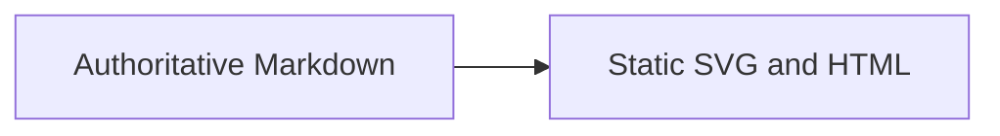

# Publication contract fixture

<a id="abstract"></a>
## Abstract

A self-contained rendering fixture. It makes no hardware or standards claims.

<a id="sotd"></a>
## Status of This Document

Independent prototype. Authors and licensing are unassigned. This is not a W3C publication.

<a id="conformance"></a>
<a id="old-conformance"></a>
## 1. Conformance

A consumer MUST preserve exact numeric tokens. [[!RFC2119]][[!RFC8174]]

<dfn id="dfn-sample">sample</dfn> is a fixture record. The [=sample=] remains local.

| Field | Meaning |
| --- | --- |
| `value` | An exact integer |
| `text` | Literal markup, not executable HTML |

```json
{
    "value": 900719925474099312345,
    "decimal": 1.2300e+02,
    "text": "<script>alert('not executable')</script>",
    "items": [
        {
            "x": true
        }
    ]
}
```



<!-- include: annex.md -->

<!-- example: example.json#/data -->
```json
{
    "large": 900719925474099312345,
    "markup": "<b>literal</b>",
    "list": [
        1,
        2
    ]
}
```

## 2. Links

The [original stable anchor](#old-conformance) and [normative chapter](#conformance) remain valid.

A forward reference to [=qualified operation=] must resolve locally.

> The [=qualified operation=] preserves brackets and QName punctuation.
> `nativeMediaSnapshot`, `constructor`, and `[[NOT-A-CITATION]]` are literal code.

<dfn id="qualified-operation" data-lt="qualified operation"><code>{urn:example}op.name[0]</code></dfn>
is a fixture definition, not WebIDL.
