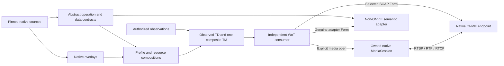
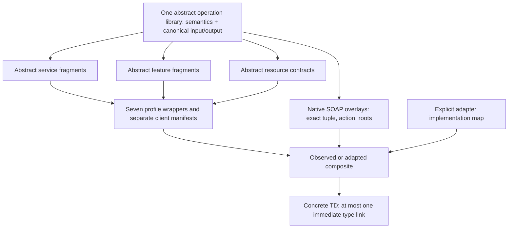
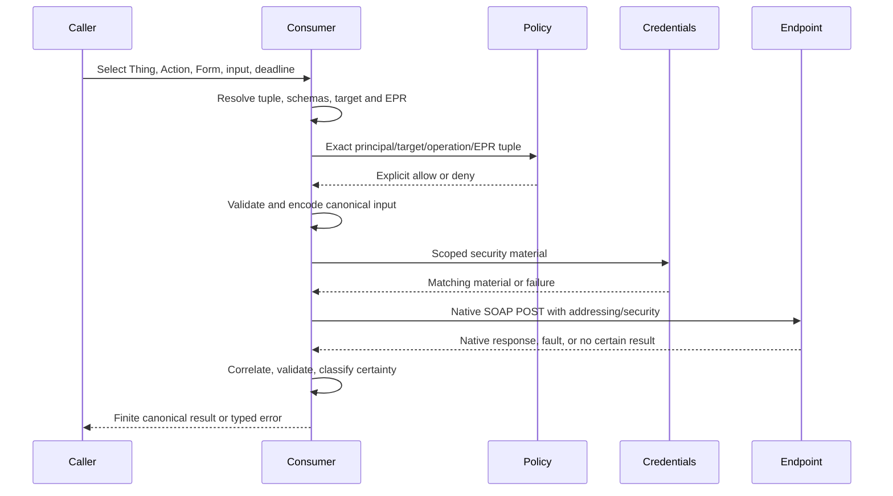
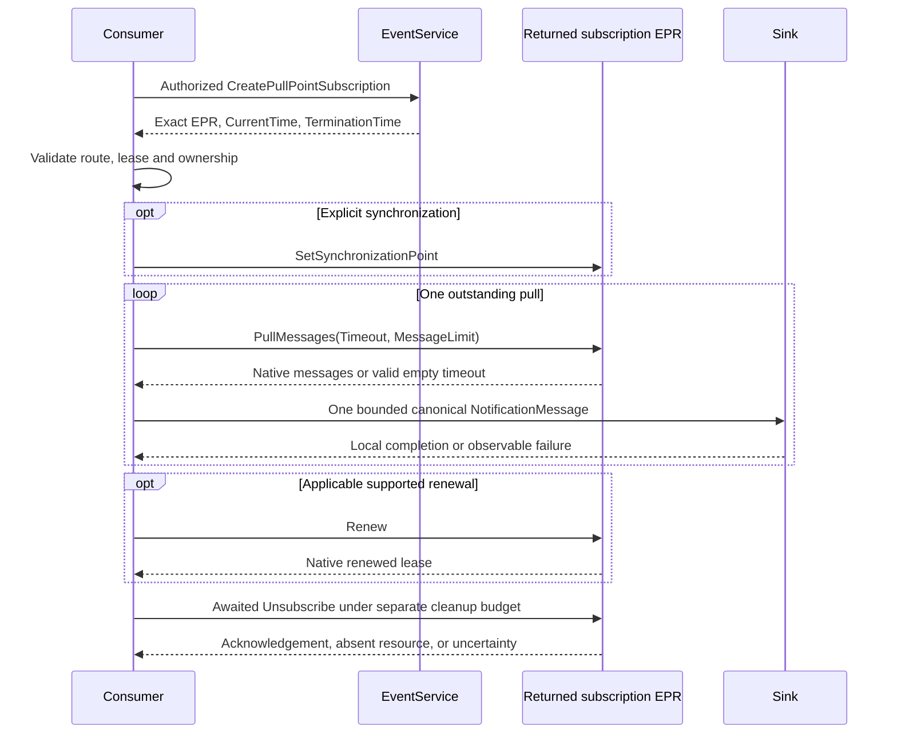

# WoT ONVIF Binding and Canonical Semantic Models

<a id="abstract"></a>
## Abstract

This specification defines a Web of Things (WoT) description and interaction contract for native ONVIF services and for explicitly identified semantic adaptations of other devices. It defines canonical operation and data models, native SOAP Forms, event and media lifecycles, device and resource identity, discovery-to-Thing-Description projection, and interpretation of the device and client requirements of ONVIF Profiles A, C, D, G, M, S, and T.

The contract is independent of a programming language, an SDK, a camera driver, a WoT runtime, a process boundary, or a particular implementation. Native ONVIF remains the authority for native services. This specification defines their mapping into WoT, not an alternative ONVIF wire protocol. A non-ONVIF adapter can implement selected abstract semantics without pretending to implement an ONVIF service.

<a id="sotd"></a>
## Status of This Document

**Independent original proposal; integrated working draft, 16 September 2026.** This is not a W3C Standard, W3C Technical Report, W3C group deliverable, ONVIF publication, certification, or statement of endorsement. No editor, affiliation, license, patent-policy commitment, registration, or publication authority is assigned by this document.

The proposed mapping edition is **0.2-proposed**. The existing binding vocabulary is **0.1**, using the provisional namespace `https://example.org/wot/onvif#`. Its context identifier `https://example.org/wot/onvif/context/v0.1` is an unhosted identifier, not a promise of a download service. Existing identifiers are not renamed by a physical repository move.

The additive inventory edition is **0.2-proposed**: it preserves all 68 original term IRIs and adds only `SemanticThing` and the opaque JSON `projection` record. The legacy context identifier remains an explicit local alias with unchanged meanings for existing terms. A publisher MUST serve the declared inventory revision or a verified local equivalent; an unhosted identifier does not establish network publication.

The source baseline preceding relocation is repository commit `1a9216897254fb132ce55065287bcbdd933adf37`. The specification root now owns the prose, inventory, machine annexes, canonical abstract models and preserved native overlays described here. Physical relocation does not change native public identities. The model manifest identifies current generated bytes and their dependencies.

The normative statements below are the contract **proposed by this document**, not claims that the reference software already satisfies them. Named interpretation notes delimit disagreements in source material. The accompanying session decision record identifies previous behavior, source facts, proposed rules, implementation consequences, and publication gates. That record is not an ONVIF errata document.

The complete inventory-generated vocabulary region and machine-annex closure are integral parts of this working draft. The [current technical decision record](support/editorial/standards-decisions.json) selects the local draft interpretations; it does not leave NP-S1, NP-G1, NP-G2, NP-G3 or NP-A1 awaiting an implementation algorithm. Their retained upstream source-review ambiguities are not resolved ONVIF errata. Conformance here is to the selected mapping edition and its declared requirements, not to an externally approved interpretation or registered native product.

Named editorial/domain review remains an ungranted **future external gate before formal publication**, not an open technical decision in this local drafting task. Formal publication additionally requires explicit decisions on first-party rights, transformed-source datasets, three fetch-only legacy XML dependencies, public identifiers, editorial ownership and the applicable standards route. Source locators and hashes establish the stated input identity/closure only, not recursive process compliance or permission. These gates do not prevent implementation-independent drafting, manufacture an unknown runtime fact as false, or remove any profile requirement.

<a id="contents"></a>
## Contents

- [1. Scope and authority](#scope)
- [2. Conformance](#conformance)
- [3. Terms and architecture](#architecture)
- [4. Binding vocabulary](#vocabulary)
- [5. Identity, addressing, and source coordinates](#identity)
- [6. Canonical model layers and composition](#models)
- [7. Native SOAP and security processing](#soap)
- [8. Canonical XML and JSON values](#canonical-values)
- [9. Native Events and MQTT](#events)
- [10. Native media and the portable MediaSession](#media)
- [11. Discovery and capability inspection](#discovery)
- [12. TD projection and optional Directory publication](#projection)
- [13. Profile requirements and seven families](#profiles)
- [14. Semantic adapters](#adapters)
- [15. Errors, limits, and lifecycle ownership](#errors)
- [16. Security and privacy considerations](#security-privacy)
- [17. Internationalization and accessibility](#i18n-a11y)
- [18. Extensibility, stability, and registration](#versioning)
- [Annex A. Normative artifact manifest](#annex-artifacts)
- [Annex B. Public descriptor grammar](#annex-descriptors)
- [Annex C. Requirements and evidence grammar](#annex-requirements)
- [Annex D. Conformance assertions](#annex-assertions)
- [Annex E. Complete examples and declared inclusions](#annex-examples)
- [Annex F. Informative implementation boundaries](#annex-informative)
- [Normative references](#normative-references)
- [Informative references](#informative-references)

<a id="scope"></a>
## 1. Scope and authority

<a id="scope-contract"></a>
### 1.1 Contract and non-goals

This specification covers description, canonical values, binding selection, native execution, lifecycle ownership, and evidence-preserving projection. It does not require an HTTP control proxy, an ONVIF SOAP facade around a USB camera, a second Thing for every processing stage, or AV annotations on an ONVIF Thing.

Configuration, movement, door control, credential administration, subscriptions, recording search, and media acquisition remain distinct authorized interactions. Discovering a TD, matching an AV Need, instantiating a TM, or reading a capability MUST NOT perform those interactions implicitly.

This specification does not define ONVIF product registration, certification tests, membership, branding, codec patent rights, or redistribution rights. Full native profile compliance includes requirements in the applicable native specification set and process documents that a TD cannot establish.

<a id="authority-order"></a>
### 1.2 Authority and incorporated material

The following division of authority applies:

1. Pinned external ONVIF specifications define native service meanings, roles, wire requirements, and native profile requirements.
2. This document defines original WoT mapping rules, algorithms, omission behavior, errors, evidence boundaries, and semantic-adapter obligations.
3. The reviewed `terms.json` inventory defines term identity and per-term metadata. Its complete readable reference is generated into this document. `context.jsonld` and `ontology.ttl` implement that inventory's JSON-LD/RDF projection.
4. The edition-specific operation/type catalog, mapping schemas, source lock, profile-edition catalog, requirement records, and models listed in [Annex A](#annex-artifacts) are incorporated normative machine annexes for the limited roles stated there.
5. Examples, sample programs, implementation guides, qualification reports, build instructions, test code, research, and historical artifacts are informative unless an explicit normative assertion in this document incorporates a particular vector.

A generated annotation copied from WSDL documentation is not made original prose merely by generation. A source hash establishes identity and integrity, not permission to redistribute or adapt it.

An inconsistency between normative prose, inventory, and a declared annex is an edition defect. An implementation MUST NOT consult private runtime code to choose the normative answer. It MUST report the conflict and decline the affected claim or interaction if there is no unambiguous safe interpretation. A publisher MUST correct or explicitly delimit the defect before publishing a conforming edition.

<a id="source-baseline"></a>
### 1.3 Source baseline and proof scopes

The selected native specification-set release is **ONVIF 26.06**, repository `onvif/specs`, commit `68ee1b540a40f848c9599eba2c55b87547c588d6`. The observed tag includes an August correction; it is not proof of the original July tag contents. References in this document to a native file mean the file at this immutable commit, unless another exact source record is stated.

| Coordinate | Meaning in the frozen input |
| --- | --- |
| Source lock | 53 records: 42 XML documents, seven reference-only profile PDFs, four original notice documents; 50 import/include edges |
| Selected service closure | 39 XML documents and 48 import/include edges; discovery's three older XML documents are separate |
| Canonical entry points | 17 WSDL entry points contributing 500 complete operation tuples |
| Separately classified services | AdvancedSecurity and AuthenticationBehavior contributing 79 additional tuples |
| Compiled mapping | 579 operations, 33 bindings, 3,426 type contracts; no unsupported operation graph in this frozen catalog |
| Authored profile dataset | 2,636 role-specific requirement atoms and 28 at-least-N obligation groups |
| Model inventory | 285 TMs plus seven separate client-requirement manifests; these are not 292 TMs |
| Vocabulary inventory | 68 terms: 21 classes and 47 properties |

These counts measure source composition. They do not measure operation execution, device support, decoder support, hardware behavior, full-profile compliance, W3C readiness, or publication clearance. An implementation MUST keep **compiled**, **advertised**, **observed**, **implemented**, **exercised**, and **independently registered** evidence separate.

<a id="conformance"></a>
## 2. Conformance

<a id="normative-language"></a>
### 2.1 Normative language and roles

The key words MUST, MUST NOT, REQUIRED, SHALL, SHALL NOT, SHOULD, SHOULD NOT, RECOMMENDED, NOT RECOMMENDED, MAY, and OPTIONAL are interpreted as described in [RFC 2119][rfc2119] and [RFC 8174][rfc8174] only when capitalized.

Except for explicitly informative sections, examples, and statements about the frozen implementation, this document is normative within the proposed mapping edition. Diagrams summarize the numbered algorithms; those algorithms govern if a rendering is ambiguous.

A **native device** provides the native service. A **native client** consumes it. A **model author** publishes abstract contracts and overlays. A **TD publisher** describes a particular Thing from evidence. A **binding consumer** executes a selected Form. An **evidence issuer** attests a scoped observation or implementation result. A **semantic adapter** supplies abstract semantics through a different real interface. One implementation can perform several roles, but MUST assess each separately.

<a id="conformance-classes"></a>
### 2.2 Conformance classes

| Class | Required contract | Claim does not establish |
| --- | --- | --- |
| Canonical Model Publisher | Vocabulary, identity, public descriptor/data closure, model composition, source and edition integrity | Running services or complete profile support |
| Canonical Value Processor | Both directions of the applicable descriptor mapping; native constraints, precision, extensions, bounded rejection | Every XSD construct or vendor semantic interpretation |
| Native SOAP Consumer / Provider | Exact tuple, selected endpoint, SOAP 1.2, addressing, declared authentication, faults, execution certainty | Events, media, discovery, or certification by itself |
| Native PullPoint Consumer / Provider | Real creation, returned EPR, serial pulls, filters, lease handling, applicable renewal, awaited termination | Push NotificationConsumer or MQTT support |
| Native BaseNotification Consumer / Producer | Applicable WS-BaseNotification interfaces, callback routing, one-way Notify, subscription manager lifecycle | Merely an HTTP WoT Event receiver |
| Native MQTT Event / Metadata Participant | The selected broker, native topic and payload branch, authorization, retention/deletion and loss semantics | Broker configuration alone proving publication or reception |
| Native Media Consumer / Provider | Selected finite resolver, negotiated native transport, tracks, units, control, clocks and owned cleanup | Support for unselected codecs, transports, or optional security |
| Native Discovery / Inspector | April 2005 discovery where used, explicit confinement, correlation, typed inspection and identity reconciliation | Automatic permission to inspect all advertised targets |
| Observed TD Publisher | Current evidence, honest composite typing, protected publication and import closure | Full wrappers inferred from profile scopes |
| Directory Publisher | The optional declared CRUDL, ownership, readback and lease contract | Device liveness or ownership of foreign registrations |
| Semantic Fragment Adapter | Selected abstract operation/resource/data contracts and genuine adapter Forms | Native ONVIF protocol compliance |
| Full Semantic Profile Implementation | All mandatory and applicable conditional abstract requirements for one exact profile edition and role, including alternatives and behavior | Native ONVIF certification or omitted wire/process requirements |
| Profile Requirement Evaluator | Three-valued facts, raw/local/effective levels, role/resource scope, complete branches and decision notes | Certification from a successful evaluation |

A claim MUST identify the mapping edition, source baseline, annex digests, role, selected classes, applicable feature/transport/codec scope, and any excluded or unimplemented contract. It MUST NOT use an unqualified "ONVIF compliant" label as a substitute.

An implementation that declines an optional class can conform to other classes. It MUST still preserve that class's source requirements in models and assessment data. If a selected native profile makes the class mandatory or conditionally applicable, declining it precludes the corresponding full-profile implementation claim.

<a id="conditional-classes"></a>
### 2.3 Conditional native coverage

The contract includes UDP unicast, RTP/RTSP/TCP interleaving, HTTP and HTTPS tunnels, native TLS/SRTP where specified, multicast, WebSocket carriage, gzip, EXI, forward and conditional reverse replay, backchannel, and MQTT where their source conditions apply. These are not all mandatory on every device or client.

An implementation MUST advertise and select the exact supported combination. A reference worker's lack of multicast, EXI, reverse replay, SRTP, or media mTLS MUST NOT be transformed into a universal prohibition in this standard. Conversely, including their normative contracts is not a claim that a reference worker implements them.

<a id="architecture"></a>
## 3. Terms and architecture

<a id="terms"></a>
### 3.1 Terms

| Term | Definition |
| --- | --- |
| Abstract operation | A semantic action and its canonical request/result, preconditions, effects, faults, and ownership, independent of a transport Form |
| Native overlay | A binding of an abstract operation to an exact native tuple, message roots, action identifiers, endpoint and security |
| Source contract | The identified native operation, type, behavior, or profile clause from which a mapping derives |
| Data contract | The complete canonical value shape plus native validation constraints and its pinned descriptor dependency graph |
| TM | A WoT Thing Model describing reusable affordances or requirements; not a device inventory or instantiated endpoint |
| Profile wrapper | A role-specific composition of all source-profile obligations; not a badge applied to partial devices |
| Observed composite | A model of the actual evidenced interfaces of one endpoint or resource at a specified observation revision |
| TD | A concrete WoT Thing Description with real selected Forms, security declarations, identity, and evidence provenance |
| Form identity | An absolute identifier for a particular Form, distinct from its target `href` |
| Document location | The effective retrieval URI or configured base for resolving a TD, TM, schema, or context |
| EPR | A versioned WS-Addressing endpoint reference, including Address, ordered reference properties/parameters and namespace-aware XML |
| XAddr | An observed physical service transport address; it is not device identity or authorization |
| Native token | An opaque source-assigned identifier in its defined service and parent scope |
| Media profile | A device's association of media configurations identified by a token; not Profile S, T, or M |
| MediaSession | An owned binding-level execution context for negotiated native media; not a SOAP output or WoT Property value |
| Generation | A local fence separating accepted media controls or replacement event subscriptions; not native CSeq, SSRC, or firmware revision |
| Observation | A typed, provenance-bearing result, including non-success states; absence of evidence is not false |
| Applicability | Whether a requirement's condition is true, false, or unknown for a particular role and resource |
| Satisfaction | Evidence that an applicable requirement has been implemented or met, distinct from applicability |
| Execution certainty | Whether an operation was not sent, explicitly rejected, accepted/responded, or may have executed without a known result |
| Source time | A timestamp asserted by a native producer, not an observer's receipt time, Directory lease, or local monotonic clock |

<a id="architecture-diagram"></a>
### 3.2 Architecture and interaction separation



**Algorithm ARCH-1.** A publisher resolves source contracts and models without contacting a device; obtains observations only through authorized inspection; derives a concrete composite and TD; and publishes them independently of later consumption. A consumer retrieves the TD under its own policy, resolves the selected contract, authorizes the interaction, and executes the native or adapter binding. Media or event ownership begins only after explicit consumer intent. No arrow in this diagram implies a trust grant, capability inference, background write, or additional mandatory Thing.

<a id="vocabulary"></a>
## 4. Binding vocabulary

<a id="vocabulary-conventions"></a>
### 4.1 Common entry rules

The namespace of every `onvif:` term in this chapter is `https://example.org/wot/onvif#`. Prefix spelling is not RDF identity. Expanded terms retain their full IRIs. The binding context uses JSON literals for structured values, IRIs for document/class references, and literals for other values; it does not expand arbitrary native XML objects into invented RDF properties.

The matrices below give the editorial contract for all 68 preserved entries. The sole term inventory records these definitions, ownership, cardinality, omission behavior, examples and references. The generated reference also declares SemanticThing and projection as the only two additive terms for model edition 0.2-proposed. Generic comments such as "project metadata" are not sufficient definitions.

Unless a row says otherwise, a property has at most one JSON member on the stated host; a collection is the value of that member, not permission for duplicate JSON keys. Optional absence means "not asserted", never false, zero, anonymous, supported, current, or successful. Consumers MUST reject wrong representation, duplicate keys, contradictory pins, and a use that would alter required processing without a defined contract. A class has no fabricated value default. `@type` is a set of IRIs.

Every evidence-bearing value is subject to [security and privacy](#security-privacy). A publisher supplies public summaries only; a credential provider, principal, key, private path, SDK selector, or local process handle MUST NOT be serialized in these terms. Unknown extension terms MUST NOT weaken a known requirement.

<a id="vocabulary-classes"></a>
### 4.2 Classes: meaning, author, and use

| Class | Host and authority; consumer obligation | Absence, errors, and example boundary |
| --- | --- | --- |
| `NativeThing` | Native TM/TD; model author declares a genuine native endpoint contract. Consumer applies native overlay and source rules. | Does not create a server. An adapted USB camera MUST NOT use this class to claim native service support. |
| `DeviceThing` | Native device TM/TD; publisher identifies one evidenced device, independent of its IP addresses. | No device is established from a URL alone. Example: one device visible on two NICs remains one device. |
| `ResourceThing` | Native resource TM/TD; publisher retains device, service, kind, parents and token. | Generic kind does not mean absent resource semantics. Unknown kinds retain evidence and a diagnostic rather than an invented subtype. |
| `CanonicalXmlValue` | DataSchema; annex author identifies the canonical value mapping in [Chapter 8](#canonical-values). | Bare `type: "object"` is insufficient. Example: a repeated native field is an array even for one item. |
| `XMLQName` | DataSchema/value classification; source author defines an expanded XML name, represented as exactly `namespace` and `localName`. | Prefix-only `"tt:Frame"` is not this value. Example: namespace `http://www.onvif.org/ver10/schema`, local name `Frame`. |
| `UsernameTokenSecurityScheme` | TD security definition; deployment author selects the native WS-Security UsernameToken contract. | No implicit password or anonymous fallback. A token's SHA-1 digest construction does not grant transport confidentiality. |
| `MutualTlsSecurityScheme` | TD security definition; deployment author requires a scoped HTTPS client identity. | No global certificate inheritance. Selecting this class for SOAP does not establish media mTLS. |
| `MediaProfileThing` | Native resource; publisher describes a token-addressed bundle of media configurations. | `fixed` means non-deletable, not immutable. Example: token `main-01` is not a Profile T claim. |
| `RecordingThing` | Native recording resource; publisher preserves recording token and endpoint/service scope. | No implicit creation, search or replay. Two recording resources can have different tracks with the same track-token spelling. |
| `RecordingTrackThing` | Native resource with a Recording parent; consumer MUST retain that parent in identity and inputs. | Missing parent is invalid for a complete identity. `track1` below two recordings is not one track. |
| `RecordingJobThing` | Native recording-job resource; publisher describes actual job identity and observed configuration/state. | Requested Active mode is not evidence of transfer. Creation output's adjusted configuration is authoritative. |
| `AccessPointThing` | Native access-point resource; publisher retains directional areas, entity references and point-scoped capabilities. | No grant or default enabled state. Two access points can refer to one door. |
| `DoorThing` | Native door resource; publisher describes door identity and separate mode/sensor facts. | Unknown sensed position is not unlocked. This class never authorizes LockDoor or AccessDoor. |
| `AnalyticsModuleThing` | Native module under its analytics-configuration parent; module Name and Type remain distinct. | A QName type or sample frame is not live inference. Missing parent MUST NOT be guessed. |
| `AnalyticsRuleThing` | Native rule under its analytics-configuration parent; preserve rule name, rule-type QName and parameters. | No same-named global XSD type is inferred. `LineCounting` denotes a rule type when used as such. |
| `ReceiverThing` | Native Receiver resource; publisher preserves token, configuration, mode and observed connection state. | A configured URI does not establish reception. No implicit CreateReceiver or connection is permitted. |
| `VideoSourceThing` | Native source resource; publisher preserves source identity separately from encoder/profile settings. | Source options do not imply a supported combination or sensor maximum. |
| `AudioSourceThing` | Native source resource; publisher preserves token and actual source facts. | Does not imply audio in every media profile, an output decoder, or backchannel. |
| `DigitalInputThing` | Native I/O resource; publisher scopes facts to the input token. | Missing state is unknown. A Boolean `false` is a known value only with valid evidence. |
| `RelayOutputThing` | Native I/O resource; publisher describes token and supported native configuration/actuation contract. | No actuation default. A successful command is not proof of external electrical or mechanical effect. |
| `SerialPortThing` | Native serial resource; publisher preserves port identity and supported configuration. | No implicit byte transfer, guessed baud rate, or access to an OS serial device. |

<a id="vocabulary-binding"></a>
### 4.3 Native binding and lifecycle properties

| Property | Host; representation; producer/source | Consumer, requiredness/default, and error/example |
| --- | --- | --- |
| `binding` | Form; string; overlay author | REQUIRED on native Forms. `soap12-http-v1` selects Actions; `pullpoint-v1` selects owned Events. Unknown selectors fail before transmission. These are contract labels, not URI schemes or runtime class names. |
| `operation` | Native Action Form; one JSON OperationReference; source catalog | REQUIRED. Resolve binding QName + portType QName + local operation exactly. No default or local-name fallback. A Media1 tuple cannot be replaced by a Media2 tuple because both say GetProfiles. |
| `soapAction` | Native Action Form; nonempty literal URI string; native binding source | Optional redundant declaration. If absent, use the selected catalog literal; if present, exact agreement is REQUIRED. Never derive an action URL from the operation name. |
| `registryDigest` | TD/TM or edition record, not an arbitrary Form extension; lowercase SHA-256 string; annex publisher | Required for edition-pinned publication and media association; legacy unpinned consumption requires explicitly selected trusted edition. Mismatch fails. A matching digest is neither a signature nor authorization. |
| `subscription` | Native Event Form; one JSON lifecycle descriptor; overlay author | REQUIRED for `pullpoint-v1`; contains mode, create, pull and unsubscribe; renew/synchronize are conditional. The Event endpoint is not a guessed subscription path. Invalid or conflicting descriptors fail before creation. |

<a id="vocabulary-values"></a>
### 4.4 Canonical payload properties

| Property | Host; representation; producer/source | Consumer, omission/default, and error/example |
| --- | --- | --- |
| `sourceDataSchema` | DataSchema; one absolute IRI including definition fragment; annex author | REQUIRED on each published canonical operation input/output and Event subscription/data/cancellation root. Nested simple field annotations do not repeat the root schema IRI. Resolve the pinned definition and apply native constraints. The rejecting library root or an ordinary TD object schema is not a replacement. |
| `canonicalType` | DataSchema; string identifier in the public type catalog; annex author | Identifies a named/anonymous/element contract or the documented QName family. Absence does not authorize inference. A private registry handle is not a canonical type identifier. |
| `xmlQName` | DataSchema; JSON QName; native declaration | Exact element/attribute identity; no prefix inference. Absence is allowed only where no single native QName applies. Element root and operation identity are distinct. |
| `xmlTypeQName` | DataSchema; JSON QName; named native type declaration | Retain source type identity and allowed derivations. Anonymous types have no invented QName. An `xsi:type` outside the declared closure is rejected. |
| `xmlKind` | Field DataSchema; string `element` or `attribute`; native declaration | Directs child versus attribute mapping. Optional when not a field annotation. Putting an attribute into child content is invalid even if the local name matches. |
| `xmlFacets` | DataSchema; JSON restriction metadata; native declaration | Apply inherited and local lexical/value-space constraints. Missing annotation does not erase catalog facets. Example: hex length counts octets, not hex characters. |
| `xmlWildcard` | DataSchema; JSON namespace/processContents constraint; native declaration | Permit open content only within the declared wildcard. Unknown strict content fails; lax/skip preservation is scoped. No whole-payload escape is implied. |
| `nativeConstraints` | DataSchema; JSON collection of named native constraints; annex author | These checks supplement JSON Schema. Unknown required constraints preclude validation success. Examples include calendar validity, namespace-sensitive enumeration, sequence attribution, and scoped uniqueness. |
| `xmlDefault` | Field DataSchema; native lexical string; source declaration | Describes an actual source default. Absence means no declared default. It MUST NOT insert an observation or caller argument; an explicit empty defaulted element uses `$default`. |
| `xmlFixed` | Field DataSchema; native lexical string; source declaration | Enforce the source fixed-value constraint in its native value space. Optional absence is not fabricated output. A supplied conflicting value fails. |
| `validation` | DataSchema; literal `sourceDataSchema-and-canonical-codec`; annex author | Both the public schema and the algorithms in this document are REQUIRED. "Codec" names the mapping process, not a required Node package. This value is not a certificate. |
| `unsupported` | DataSchema/contract; nonempty explanatory string; annex author | Affected graphs are rejecting contracts. Absence does not establish device or workflow support. Consumers MUST NOT accept an opaque replacement for an unsupported required graph. |

<a id="vocabulary-provenance"></a>
### 4.5 Source, integrity, and support properties

| Property | Host; representation; producer/source | Consumer, omission/default, and error/example |
| --- | --- | --- |
| `source` | TM/affordance/DataSchema; JSON source record; annex author | Preserve source ID, exact locator/hash and applicable caller/service ownership. No provenance inferred from a title. A WSDL input belongs to the caller; returned configuration belongs to the service. |
| `sourcePins` | TM/edition record; JSON baseline/lock record; annex publisher | Required for a standalone normative bundle. Select exact release, commit and lock digest, not a moving tag. Missing dependencies fail closed; this term never enables network retrieval. |
| `sourceGroup` | Service TM/contract; string `canonical` or `conditional-add-on`; source catalog | Distinguish the 17-entry family from separately classified services. Omission gives no add-on membership. AuthenticationBehavior is not automatically required by A/C/D. |
| `authorship` | TM/edition metadata; literal provenance statement; publisher | Identifies original mapping authorship rather than ownership of native text. Absence grants no rights. It MUST NOT manufacture a license, W3C affiliation, or ONVIF endorsement. |
| `mappingSupport` | Operation/model metadata; string `compiled` or `unsupported`; annex producer | Structural graph status only. `compiled` does not mean exercised, safe, implemented on a device, or certified. Missing status cannot be promoted to compiled. |
| `runtimeStatus` | Model/affordance; literal bounded implementation-status statement; evidence issuer | Distinguish a schema-compiled contract from named runtime qualification. No default success. A generic status string cannot replace a scoped result with product/build/transport provenance. |
| `requirementsDigest` | Profile/model/assessment record; SHA-256 string; requirement-annex publisher | Pin the exact role/condition/group inventory. Missing pin prevents edition-specific satisfaction claims. A changed digest requires assessment regeneration, not silent reuse. |
| `projectionDigest` | TD/projection metadata; SHA-256 string; projector | Identifies declared producer-owned content at a revision. It is not a lease, signature, hardware identity, or immutable device state. Consumers verify its declared recipe and scope. |

<a id="vocabulary-evidence"></a>
### 4.6 Observations, requirements, and resource properties

| Property | Host; representation; producer/source | Consumer, omission/default, and error/example |
| --- | --- | --- |
| `profileClaims` | TD; JSON array of provenance-bearing profile/role assertions; advertiser via publisher | Preserve explicit edition if present. An unversioned scope MUST NOT acquire an edition. Empty means no recorded claim, not nonconformance. |
| `profileEdition` | Profile TM/manifest; JSON selected-document record; source catalog | Identify profile, edition, document month, role, source and hash. No "latest" default. S 1.3 is November 2019, not its upload-directory month. |
| `observedServices` | TD; JSON array of namespace/XAddr/version/evidence summaries; inspector/publisher | Use actual evidenced services. Partial/denied inventory is not confirmed empty. Service namespace, own version and source-set release MUST remain separate. |
| `capabilityEvidence` | TD/resource/assessment; JSON typed scoped observations; identified issuer | Evaluate only matching role/resource conditions. Missing, denied, malformed or stale facts remain unknown. Device support cannot populate a client implementation fact. |
| `conformanceEvidence` | TD/assessment; JSON array of issuer/product/firmware/profile/source associations; external issuer/curator | Preserve verification status and firmware match. No record is generated from an operation success. Absence proves nothing; a stale firmware association is reported. |
| `resourceIdentity` | Resource TD; JSON identity tuple and provenance; publisher | Require device identity, service, kind, ordered parents and token. Do not silently bind Action arguments. Missing parent scope is an identity error. |
| `nativeIdentity` | TM; JSON identity-component/type-parent description; model author | Describes how instances are identified, not an actual observation. Does not grant routing or populate a token. Example: RecordingTrack requires a Recording parent. |
| `requirements` | TM/manifest; JSON array of stable atom IDs; requirement publisher | Resolve all referenced atoms, including behavior/process rows. Empty cannot represent a full wrapper. An operation appearing twice in source prose/tables retains both source assertions. |
| `obligationGroups` | TM/manifest/assessment; JSON array of normalized at-least-N groups; requirement publisher | Count complete active branches, permitting multiple branches. Missing required groups is an error, not universal-M flattening or exclusive `oneOf`. |
| `safeRead` | Reviewed Action alias; JSON alias/operation/source/reason record; mapping author | Opt-in only. Alias retains an Action and exact native input. No Get-name heuristic, Property inference, subscription, search drain, synchronization, or automatic authorization. |
| `diagnostics` | Optional TD/assessment annotation; JSON diagnostic collection; evidence issuer | Carries safe structured findings if explicitly published. The current projector may return these separately. Absence MUST NOT mean success; no side effects are attached to this declared term. |
| `profileAssessments` | TD or separate assessment; JSON role/atom applicability and evidence results; evaluator | Preserve applicability, implementation result and gates separately. An observed operation ID does not discharge a behavior/process atom. Unknowns require reasons and scope. |
| `inputBindings` | Optional advisory model annotation; JSON; model author | Reserved for explicit documented input associations. This edition assigns no implicit token filling or execution behavior. Consumers MUST use complete caller-supplied canonical input; advisory metadata cannot override it. |
| `readOutcomes` | Optional evidence annotation; JSON result-summary array; inspector | Describes actual read outcomes only. Existing unprefixed `readOutcomes` within `observedServices` remains that record's member. Neither form is another execution channel or a reason to expose raw sensitive payloads. |
| `clientRequirements` | Profile TM; one IRI; requirement publisher | Resolves the separate client manifest. Required for a complete two-role edition bundle. It does not create a client Thing hosting device Actions. |
| `serviceModels` | Optional TM/TD annotation; IRI or set of IRIs; model publisher | References relevant service contracts without instantiating them. The term alone has no linking or support inference. Missing references do not justify inferred service presence. |
| `profileModels` | TD; IRI or set of IRIs; publisher | Advisory links to wrappers for explicitly versioned claims. These MUST NOT replace the single observed-composite type link or imply full support. |
| `modelClass` | TM; one class IRI; model author | Identifies the declared project class. No execution or certification follows. A model cannot use a native-specific class to disguise an adapter. |
| `serviceNamespace` | Service TM; literal namespace URI string; source declaration | Distinguishes native contracts, including imported portTypes. Does not locate the service. Media1 and Media2 MUST NOT be merged by local operation name. |
| `resourceKind` | Resource TM; nonempty literal kind label; model author | Selects the defined parent/token scope. Unknown observed kinds retain a generic model and diagnosis; they do not acquire a default camera classification. |
| `requirementSemantics` | Model/manifest; literal explanatory statement; requirement author | Describes how to read requiredness and conditions alongside actual records. Cannot override raw evidence, groups or a named interpretation note. No default requirement level is inferred. |
| `claimSemantics` | TD/assessment; literal statement of claim/evidence separation; publisher | Explains the boundary between advertisement, observation, implementation and registration. Omitting the prose does not weaken that boundary. |

<a id="generated-vocabulary-reference"></a>
### 4.7 Complete inventory-generated reference

The following bounded region is the complete generated reference for the 68 preserved terms and the two explicitly declared additive model terms. Each entry MUST have a stable `term-<name>` anchor, IRI, meaning, host, author/source, JSON/RDF representation, cardinality, required/optional/forbidden conditions, defaults, validation/errors, security/privacy, source reference, example and counterexample. The material above supplies the proposed definitions; this marker is not permission to ship only the matrices.

<!-- BEGIN GENERATED: terms.json#/terms -->
<a id="term-NativeThing"></a>
#### `onvif:NativeThing`

Native TM/TD; model author declares a genuine native endpoint contract. Consumer applies native overlay and source rules. Does not create a server. An adapted USB camera MUST NOT use this class to claim native service support.

| Field | Normative contract |
| --- | --- |
| IRI | `https://example.org/wot/onvif#NativeThing` |
| Kind and representation | class; class IRI |
| Host | Native TM/TD |
| Producer and authority | Native TM/TD; model author declares a genuine native endpoint contract. Consumer applies native overlay and source rules. |
| Consumer | Does not create a server. An adapted USB camera MUST NOT use this class to claim native service support. |
| Cardinality | Zero or one member of the @type IRI set; duplicate class membership has no added meaning. |
| Requiredness | Use only when the NativeThing contract actually applies to the declared host. Does not create a server. An adapted USB camera MUST NOT use this class to claim native service support. |
| Omission and default | Omission asserts no class. No endpoint, resource, physical behavior, trust or conformance is created. |
| Validation and errors | Does not create a server. An adapted USB camera MUST NOT use this class to claim native service support. Consumers MUST reject the wrong JSON/RDF representation, duplicate keys and contradictions with the pinned source contract. |
| Security and privacy | Publish only the minimum authorized public metadata. Credential values, private device/driver selectors, process handles and routing grants MUST NOT appear. An annotation never authenticates its publisher. |
| Sources | [#vocabulary-classes](#vocabulary-classes); [#term-NativeThing](#term-NativeThing) |

Complete JSON annotation example (not an entire TD):

```json
{
    "@type": "onvif:NativeThing"
}
```

Counterexample:

```json
{
    "@type": {
        "namespace": "https://example.org/wot/onvif#",
        "localName": "NativeThing"
    }
}
```

@type requires an IRI or IRI array, not an XML QName object. XML QName identity and RDF class identity are distinct.

<a id="term-DeviceThing"></a>
#### `onvif:DeviceThing`

Native device TM/TD; publisher identifies one evidenced device, independent of its IP addresses. No device is established from a URL alone. Example: one device visible on two NICs remains one device.

| Field | Normative contract |
| --- | --- |
| IRI | `https://example.org/wot/onvif#DeviceThing` |
| Kind and representation | class; class IRI |
| Host | Native device TM/TD |
| Producer and authority | Native device TM/TD; publisher identifies one evidenced device, independent of its IP addresses. |
| Consumer | No device is established from a URL alone. Example: one device visible on two NICs remains one device. |
| Cardinality | Zero or one member of the @type IRI set; duplicate class membership has no added meaning. |
| Requiredness | Use only when the DeviceThing contract actually applies to the declared host. No device is established from a URL alone. Example: one device visible on two NICs remains one device. |
| Omission and default | Omission asserts no class. No endpoint, resource, physical behavior, trust or conformance is created. |
| Validation and errors | No device is established from a URL alone. Example: one device visible on two NICs remains one device. Consumers MUST reject the wrong JSON/RDF representation, duplicate keys and contradictions with the pinned source contract. |
| Security and privacy | Publish only the minimum authorized public metadata. Credential values, private device/driver selectors, process handles and routing grants MUST NOT appear. An annotation never authenticates its publisher. |
| Sources | [#vocabulary-classes](#vocabulary-classes); [#term-DeviceThing](#term-DeviceThing) |

Complete JSON annotation example (not an entire TD):

```json
{
    "@type": "onvif:DeviceThing"
}
```

Counterexample:

```json
{
    "@type": {
        "namespace": "https://example.org/wot/onvif#",
        "localName": "DeviceThing"
    }
}
```

@type requires an IRI or IRI array, not an XML QName object. XML QName identity and RDF class identity are distinct.

<a id="term-ResourceThing"></a>
#### `onvif:ResourceThing`

Native resource TM/TD; publisher retains device, service, kind, parents and token. Generic kind does not mean absent resource semantics. Unknown kinds retain evidence and a diagnostic rather than an invented subtype.

| Field | Normative contract |
| --- | --- |
| IRI | `https://example.org/wot/onvif#ResourceThing` |
| Kind and representation | class; class IRI |
| Host | Native resource TM/TD |
| Producer and authority | Native resource TM/TD; publisher retains device, service, kind, parents and token. |
| Consumer | Generic kind does not mean absent resource semantics. Unknown kinds retain evidence and a diagnostic rather than an invented subtype. |
| Cardinality | Zero or one member of the @type IRI set; duplicate class membership has no added meaning. |
| Requiredness | Use only when the ResourceThing contract actually applies to the declared host. Generic kind does not mean absent resource semantics. Unknown kinds retain evidence and a diagnostic rather than an invented subtype. |
| Omission and default | Omission asserts no class. No endpoint, resource, physical behavior, trust or conformance is created. |
| Validation and errors | Generic kind does not mean absent resource semantics. Unknown kinds retain evidence and a diagnostic rather than an invented subtype. Consumers MUST reject the wrong JSON/RDF representation, duplicate keys and contradictions with the pinned source contract. |
| Security and privacy | Publish only the minimum authorized public metadata. Credential values, private device/driver selectors, process handles and routing grants MUST NOT appear. An annotation never authenticates its publisher. |
| Sources | [#vocabulary-classes](#vocabulary-classes); [#term-ResourceThing](#term-ResourceThing) |

Complete JSON annotation example (not an entire TD):

```json
{
    "@type": "onvif:ResourceThing"
}
```

Counterexample:

```json
{
    "@type": {
        "namespace": "https://example.org/wot/onvif#",
        "localName": "ResourceThing"
    }
}
```

@type requires an IRI or IRI array, not an XML QName object. XML QName identity and RDF class identity are distinct.

<a id="term-CanonicalXmlValue"></a>
#### `onvif:CanonicalXmlValue`

DataSchema; annex author identifies the canonical value mapping in [Chapter 8](#canonical-values). Bare `type: "object"` is insufficient. Example: a repeated native field is an array even for one item.

| Field | Normative contract |
| --- | --- |
| IRI | `https://example.org/wot/onvif#CanonicalXmlValue` |
| Kind and representation | class; class IRI |
| Host | DataSchema |
| Producer and authority | DataSchema; annex author identifies the canonical value mapping in [Chapter 8](#canonical-values). |
| Consumer | Bare `type: "object"` is insufficient. Example: a repeated native field is an array even for one item. |
| Cardinality | Zero or one member of the @type IRI set; duplicate class membership has no added meaning. |
| Requiredness | Use only when the CanonicalXmlValue contract actually applies to the declared host. Bare `type: "object"` is insufficient. Example: a repeated native field is an array even for one item. |
| Omission and default | Omission asserts no class. No endpoint, resource, physical behavior, trust or conformance is created. |
| Validation and errors | Bare `type: "object"` is insufficient. Example: a repeated native field is an array even for one item. Consumers MUST reject the wrong JSON/RDF representation, duplicate keys and contradictions with the pinned source contract. |
| Security and privacy | Publish only the minimum authorized public metadata. Credential values, private device/driver selectors, process handles and routing grants MUST NOT appear. An annotation never authenticates its publisher. |
| Sources | [#vocabulary-classes](#vocabulary-classes); [#term-CanonicalXmlValue](#term-CanonicalXmlValue) |

Complete JSON annotation example (not an entire TD):

```json
{
    "@type": "onvif:CanonicalXmlValue",
    "type": "object",
    "onvif:sourceDataSchema": "https://example.org/wot/onvif/schemas/payloads.schema.json#/$defs/input_Media2Binding_GetProfiles_95aacf693b24",
    "onvif:validation": "sourceDataSchema-and-canonical-codec"
}
```

Counterexample:

```json
{
    "@type": {
        "namespace": "https://example.org/wot/onvif#",
        "localName": "CanonicalXmlValue"
    }
}
```

@type requires an IRI or IRI array, not an XML QName object. XML QName identity and RDF class identity are distinct.

<a id="term-XMLQName"></a>
#### `onvif:XMLQName`

DataSchema/value classification; source author defines an expanded XML name, represented as exactly `namespace` and `localName`. Prefix-only `"tt:Frame"` is not this value. Example: namespace `http://www.onvif.org/ver10/schema`, local name `Frame`.

| Field | Normative contract |
| --- | --- |
| IRI | `https://example.org/wot/onvif#XMLQName` |
| Kind and representation | class; class IRI |
| Host | DataSchema/value classification |
| Producer and authority | DataSchema/value classification; source author defines an expanded XML name, represented as exactly `namespace` and `localName`. |
| Consumer | Prefix-only `"tt:Frame"` is not this value. Example: namespace `http://www.onvif.org/ver10/schema`, local name `Frame`. |
| Cardinality | Zero or one member of the @type IRI set; duplicate class membership has no added meaning. |
| Requiredness | Use only when the XMLQName contract actually applies to the declared host. Prefix-only `"tt:Frame"` is not this value. Example: namespace `http://www.onvif.org/ver10/schema`, local name `Frame`. |
| Omission and default | Omission asserts no class. No endpoint, resource, physical behavior, trust or conformance is created. |
| Validation and errors | Prefix-only `"tt:Frame"` is not this value. Example: namespace `http://www.onvif.org/ver10/schema`, local name `Frame`. Consumers MUST reject the wrong JSON/RDF representation, duplicate keys and contradictions with the pinned source contract. |
| Security and privacy | Publish only the minimum authorized public metadata. Credential values, private device/driver selectors, process handles and routing grants MUST NOT appear. An annotation never authenticates its publisher. |
| Sources | [#vocabulary-classes](#vocabulary-classes); [#term-XMLQName](#term-XMLQName) |

Complete JSON annotation example (not an entire TD):

```json
{
    "@type": "onvif:XMLQName",
    "type": "object",
    "properties": {
        "namespace": {
            "type": "string"
        },
        "localName": {
            "type": "string",
            "minLength": 1
        }
    },
    "required": [
        "namespace",
        "localName"
    ]
}
```

Counterexample:

```json
{
    "@type": {
        "namespace": "https://example.org/wot/onvif#",
        "localName": "XMLQName"
    }
}
```

@type requires an IRI or IRI array, not an XML QName object. XML QName identity and RDF class identity are distinct.

<a id="term-UsernameTokenSecurityScheme"></a>
#### `onvif:UsernameTokenSecurityScheme`

TD security definition; deployment author selects the native WS-Security UsernameToken contract. No implicit password or anonymous fallback. A token's SHA-1 digest construction does not grant transport confidentiality.

| Field | Normative contract |
| --- | --- |
| IRI | `https://example.org/wot/onvif#UsernameTokenSecurityScheme` |
| Kind and representation | class; class IRI |
| Host | TD security definition |
| Producer and authority | TD security definition; deployment author selects the native WS-Security UsernameToken contract. |
| Consumer | No implicit password or anonymous fallback. A token's SHA-1 digest construction does not grant transport confidentiality. |
| Cardinality | Zero or one member of the @type IRI set; duplicate class membership has no added meaning. |
| Requiredness | Use only when the UsernameTokenSecurityScheme contract actually applies to the declared host. No implicit password or anonymous fallback. A token's SHA-1 digest construction does not grant transport confidentiality. |
| Omission and default | Omission asserts no class. No endpoint, resource, physical behavior, trust or conformance is created. |
| Validation and errors | No implicit password or anonymous fallback. A token's SHA-1 digest construction does not grant transport confidentiality. Consumers MUST reject the wrong JSON/RDF representation, duplicate keys and contradictions with the pinned source contract. |
| Security and privacy | Publish only the minimum authorized public metadata. Credential values, private device/driver selectors, process handles and routing grants MUST NOT appear. An annotation never authenticates its publisher. |
| Sources | [#vocabulary-classes](#vocabulary-classes); [#term-UsernameTokenSecurityScheme](#term-UsernameTokenSecurityScheme) |

Complete JSON annotation example (not an entire TD):

```json
{
    "@type": "onvif:UsernameTokenSecurityScheme",
    "scheme": "onvif:UsernameTokenSecurityScheme"
}
```

Counterexample:

```json
{
    "@type": {
        "namespace": "https://example.org/wot/onvif#",
        "localName": "UsernameTokenSecurityScheme"
    }
}
```

@type requires an IRI or IRI array, not an XML QName object. XML QName identity and RDF class identity are distinct.

<a id="term-MutualTlsSecurityScheme"></a>
#### `onvif:MutualTlsSecurityScheme`

TD security definition; deployment author requires a scoped HTTPS client identity. No global certificate inheritance. Selecting this class for SOAP does not establish media mTLS.

| Field | Normative contract |
| --- | --- |
| IRI | `https://example.org/wot/onvif#MutualTlsSecurityScheme` |
| Kind and representation | class; class IRI |
| Host | TD security definition |
| Producer and authority | TD security definition; deployment author requires a scoped HTTPS client identity. |
| Consumer | No global certificate inheritance. Selecting this class for SOAP does not establish media mTLS. |
| Cardinality | Zero or one member of the @type IRI set; duplicate class membership has no added meaning. |
| Requiredness | Use only when the MutualTlsSecurityScheme contract actually applies to the declared host. No global certificate inheritance. Selecting this class for SOAP does not establish media mTLS. |
| Omission and default | Omission asserts no class. No endpoint, resource, physical behavior, trust or conformance is created. |
| Validation and errors | No global certificate inheritance. Selecting this class for SOAP does not establish media mTLS. Consumers MUST reject the wrong JSON/RDF representation, duplicate keys and contradictions with the pinned source contract. |
| Security and privacy | Publish only the minimum authorized public metadata. Credential values, private device/driver selectors, process handles and routing grants MUST NOT appear. An annotation never authenticates its publisher. |
| Sources | [#vocabulary-classes](#vocabulary-classes); [#term-MutualTlsSecurityScheme](#term-MutualTlsSecurityScheme) |

Complete JSON annotation example (not an entire TD):

```json
{
    "@type": "onvif:MutualTlsSecurityScheme",
    "scheme": "onvif:MutualTlsSecurityScheme"
}
```

Counterexample:

```json
{
    "@type": {
        "namespace": "https://example.org/wot/onvif#",
        "localName": "MutualTlsSecurityScheme"
    }
}
```

@type requires an IRI or IRI array, not an XML QName object. XML QName identity and RDF class identity are distinct.

<a id="term-MediaProfileThing"></a>
#### `onvif:MediaProfileThing`

Native resource; publisher describes a token-addressed bundle of media configurations. `fixed` means non-deletable, not immutable. Example: token `main-01` is not a Profile T claim.

| Field | Normative contract |
| --- | --- |
| IRI | `https://example.org/wot/onvif#MediaProfileThing` |
| Kind and representation | class; class IRI |
| Host | Native resource |
| Producer and authority | Native resource; publisher describes a token-addressed bundle of media configurations. |
| Consumer | `fixed` means non-deletable, not immutable. Example: token `main-01` is not a Profile T claim. |
| Cardinality | Zero or one member of the @type IRI set; duplicate class membership has no added meaning. |
| Requiredness | Use only when the MediaProfileThing contract actually applies to the declared host. `fixed` means non-deletable, not immutable. Example: token `main-01` is not a Profile T claim. |
| Omission and default | Omission asserts no class. No endpoint, resource, physical behavior, trust or conformance is created. |
| Validation and errors | `fixed` means non-deletable, not immutable. Example: token `main-01` is not a Profile T claim. Consumers MUST reject the wrong JSON/RDF representation, duplicate keys and contradictions with the pinned source contract. |
| Security and privacy | Publish only the minimum authorized public metadata. Credential values, private device/driver selectors, process handles and routing grants MUST NOT appear. An annotation never authenticates its publisher. |
| Sources | [#vocabulary-classes](#vocabulary-classes); [#term-MediaProfileThing](#term-MediaProfileThing) |

Complete JSON annotation example (not an entire TD):

```json
{
    "@type": "onvif:MediaProfileThing"
}
```

Counterexample:

```json
{
    "@type": {
        "namespace": "https://example.org/wot/onvif#",
        "localName": "MediaProfileThing"
    }
}
```

@type requires an IRI or IRI array, not an XML QName object. XML QName identity and RDF class identity are distinct.

<a id="term-RecordingThing"></a>
#### `onvif:RecordingThing`

Native recording resource; publisher preserves recording token and endpoint/service scope. No implicit creation, search or replay. Two recording resources can have different tracks with the same track-token spelling.

| Field | Normative contract |
| --- | --- |
| IRI | `https://example.org/wot/onvif#RecordingThing` |
| Kind and representation | class; class IRI |
| Host | Native recording resource |
| Producer and authority | Native recording resource; publisher preserves recording token and endpoint/service scope. |
| Consumer | No implicit creation, search or replay. Two recording resources can have different tracks with the same track-token spelling. |
| Cardinality | Zero or one member of the @type IRI set; duplicate class membership has no added meaning. |
| Requiredness | Use only when the RecordingThing contract actually applies to the declared host. No implicit creation, search or replay. Two recording resources can have different tracks with the same track-token spelling. |
| Omission and default | Omission asserts no class. No endpoint, resource, physical behavior, trust or conformance is created. |
| Validation and errors | No implicit creation, search or replay. Two recording resources can have different tracks with the same track-token spelling. Consumers MUST reject the wrong JSON/RDF representation, duplicate keys and contradictions with the pinned source contract. |
| Security and privacy | Publish only the minimum authorized public metadata. Credential values, private device/driver selectors, process handles and routing grants MUST NOT appear. An annotation never authenticates its publisher. |
| Sources | [#vocabulary-classes](#vocabulary-classes); [#term-RecordingThing](#term-RecordingThing) |

Complete JSON annotation example (not an entire TD):

```json
{
    "@type": "onvif:RecordingThing"
}
```

Counterexample:

```json
{
    "@type": {
        "namespace": "https://example.org/wot/onvif#",
        "localName": "RecordingThing"
    }
}
```

@type requires an IRI or IRI array, not an XML QName object. XML QName identity and RDF class identity are distinct.

<a id="term-RecordingTrackThing"></a>
#### `onvif:RecordingTrackThing`

Native resource with a Recording parent; consumer MUST retain that parent in identity and inputs. Missing parent is invalid for a complete identity. `track1` below two recordings is not one track.

| Field | Normative contract |
| --- | --- |
| IRI | `https://example.org/wot/onvif#RecordingTrackThing` |
| Kind and representation | class; class IRI |
| Host | Native resource with a Recording parent |
| Producer and authority | Native resource with a Recording parent; consumer MUST retain that parent in identity and inputs. |
| Consumer | Missing parent is invalid for a complete identity. `track1` below two recordings is not one track. |
| Cardinality | Zero or one member of the @type IRI set; duplicate class membership has no added meaning. |
| Requiredness | Use only when the RecordingTrackThing contract actually applies to the declared host. Missing parent is invalid for a complete identity. `track1` below two recordings is not one track. |
| Omission and default | Omission asserts no class. No endpoint, resource, physical behavior, trust or conformance is created. |
| Validation and errors | Missing parent is invalid for a complete identity. `track1` below two recordings is not one track. Consumers MUST reject the wrong JSON/RDF representation, duplicate keys and contradictions with the pinned source contract. |
| Security and privacy | Publish only the minimum authorized public metadata. Credential values, private device/driver selectors, process handles and routing grants MUST NOT appear. An annotation never authenticates its publisher. |
| Sources | [#vocabulary-classes](#vocabulary-classes); [#term-RecordingTrackThing](#term-RecordingTrackThing) |

Complete JSON annotation example (not an entire TD):

```json
{
    "@type": "onvif:RecordingTrackThing"
}
```

Counterexample:

```json
{
    "@type": {
        "namespace": "https://example.org/wot/onvif#",
        "localName": "RecordingTrackThing"
    }
}
```

@type requires an IRI or IRI array, not an XML QName object. XML QName identity and RDF class identity are distinct.

<a id="term-RecordingJobThing"></a>
#### `onvif:RecordingJobThing`

Native recording-job resource; publisher describes actual job identity and observed configuration/state. Requested Active mode is not evidence of transfer. Creation output's adjusted configuration is authoritative.

| Field | Normative contract |
| --- | --- |
| IRI | `https://example.org/wot/onvif#RecordingJobThing` |
| Kind and representation | class; class IRI |
| Host | Native recording-job resource |
| Producer and authority | Native recording-job resource; publisher describes actual job identity and observed configuration/state. |
| Consumer | Requested Active mode is not evidence of transfer. Creation output's adjusted configuration is authoritative. |
| Cardinality | Zero or one member of the @type IRI set; duplicate class membership has no added meaning. |
| Requiredness | Use only when the RecordingJobThing contract actually applies to the declared host. Requested Active mode is not evidence of transfer. Creation output's adjusted configuration is authoritative. |
| Omission and default | Omission asserts no class. No endpoint, resource, physical behavior, trust or conformance is created. |
| Validation and errors | Requested Active mode is not evidence of transfer. Creation output's adjusted configuration is authoritative. Consumers MUST reject the wrong JSON/RDF representation, duplicate keys and contradictions with the pinned source contract. |
| Security and privacy | Publish only the minimum authorized public metadata. Credential values, private device/driver selectors, process handles and routing grants MUST NOT appear. An annotation never authenticates its publisher. |
| Sources | [#vocabulary-classes](#vocabulary-classes); [#term-RecordingJobThing](#term-RecordingJobThing) |

Complete JSON annotation example (not an entire TD):

```json
{
    "@type": "onvif:RecordingJobThing"
}
```

Counterexample:

```json
{
    "@type": {
        "namespace": "https://example.org/wot/onvif#",
        "localName": "RecordingJobThing"
    }
}
```

@type requires an IRI or IRI array, not an XML QName object. XML QName identity and RDF class identity are distinct.

<a id="term-AccessPointThing"></a>
#### `onvif:AccessPointThing`

Native access-point resource; publisher retains directional areas, entity references and point-scoped capabilities. No grant or default enabled state. Two access points can refer to one door.

| Field | Normative contract |
| --- | --- |
| IRI | `https://example.org/wot/onvif#AccessPointThing` |
| Kind and representation | class; class IRI |
| Host | Native access-point resource |
| Producer and authority | Native access-point resource; publisher retains directional areas, entity references and point-scoped capabilities. |
| Consumer | No grant or default enabled state. Two access points can refer to one door. |
| Cardinality | Zero or one member of the @type IRI set; duplicate class membership has no added meaning. |
| Requiredness | Use only when the AccessPointThing contract actually applies to the declared host. No grant or default enabled state. Two access points can refer to one door. |
| Omission and default | Omission asserts no class. No endpoint, resource, physical behavior, trust or conformance is created. |
| Validation and errors | No grant or default enabled state. Two access points can refer to one door. Consumers MUST reject the wrong JSON/RDF representation, duplicate keys and contradictions with the pinned source contract. |
| Security and privacy | Publish only the minimum authorized public metadata. Credential values, private device/driver selectors, process handles and routing grants MUST NOT appear. An annotation never authenticates its publisher. |
| Sources | [#vocabulary-classes](#vocabulary-classes); [#term-AccessPointThing](#term-AccessPointThing) |

Complete JSON annotation example (not an entire TD):

```json
{
    "@type": "onvif:AccessPointThing"
}
```

Counterexample:

```json
{
    "@type": {
        "namespace": "https://example.org/wot/onvif#",
        "localName": "AccessPointThing"
    }
}
```

@type requires an IRI or IRI array, not an XML QName object. XML QName identity and RDF class identity are distinct.

<a id="term-DoorThing"></a>
#### `onvif:DoorThing`

Native door resource; publisher describes door identity and separate mode/sensor facts. Unknown sensed position is not unlocked. This class never authorizes LockDoor or AccessDoor.

| Field | Normative contract |
| --- | --- |
| IRI | `https://example.org/wot/onvif#DoorThing` |
| Kind and representation | class; class IRI |
| Host | Native door resource |
| Producer and authority | Native door resource; publisher describes door identity and separate mode/sensor facts. |
| Consumer | Unknown sensed position is not unlocked. This class never authorizes LockDoor or AccessDoor. |
| Cardinality | Zero or one member of the @type IRI set; duplicate class membership has no added meaning. |
| Requiredness | Use only when the DoorThing contract actually applies to the declared host. Unknown sensed position is not unlocked. This class never authorizes LockDoor or AccessDoor. |
| Omission and default | Omission asserts no class. No endpoint, resource, physical behavior, trust or conformance is created. |
| Validation and errors | Unknown sensed position is not unlocked. This class never authorizes LockDoor or AccessDoor. Consumers MUST reject the wrong JSON/RDF representation, duplicate keys and contradictions with the pinned source contract. |
| Security and privacy | Publish only the minimum authorized public metadata. Credential values, private device/driver selectors, process handles and routing grants MUST NOT appear. An annotation never authenticates its publisher. |
| Sources | [#vocabulary-classes](#vocabulary-classes); [#term-DoorThing](#term-DoorThing) |

Complete JSON annotation example (not an entire TD):

```json
{
    "@type": "onvif:DoorThing"
}
```

Counterexample:

```json
{
    "@type": {
        "namespace": "https://example.org/wot/onvif#",
        "localName": "DoorThing"
    }
}
```

@type requires an IRI or IRI array, not an XML QName object. XML QName identity and RDF class identity are distinct.

<a id="term-AnalyticsModuleThing"></a>
#### `onvif:AnalyticsModuleThing`

Native module under its analytics-configuration parent; module Name and Type remain distinct. A QName type or sample frame is not live inference. Missing parent MUST NOT be guessed.

| Field | Normative contract |
| --- | --- |
| IRI | `https://example.org/wot/onvif#AnalyticsModuleThing` |
| Kind and representation | class; class IRI |
| Host | Native module under its analytics-configuration parent |
| Producer and authority | Native module under its analytics-configuration parent; module Name and Type remain distinct. |
| Consumer | A QName type or sample frame is not live inference. Missing parent MUST NOT be guessed. |
| Cardinality | Zero or one member of the @type IRI set; duplicate class membership has no added meaning. |
| Requiredness | Use only when the AnalyticsModuleThing contract actually applies to the declared host. A QName type or sample frame is not live inference. Missing parent MUST NOT be guessed. |
| Omission and default | Omission asserts no class. No endpoint, resource, physical behavior, trust or conformance is created. |
| Validation and errors | A QName type or sample frame is not live inference. Missing parent MUST NOT be guessed. Consumers MUST reject the wrong JSON/RDF representation, duplicate keys and contradictions with the pinned source contract. |
| Security and privacy | Publish only the minimum authorized public metadata. Credential values, private device/driver selectors, process handles and routing grants MUST NOT appear. An annotation never authenticates its publisher. |
| Sources | [#vocabulary-classes](#vocabulary-classes); [#term-AnalyticsModuleThing](#term-AnalyticsModuleThing) |

Complete JSON annotation example (not an entire TD):

```json
{
    "@type": "onvif:AnalyticsModuleThing"
}
```

Counterexample:

```json
{
    "@type": {
        "namespace": "https://example.org/wot/onvif#",
        "localName": "AnalyticsModuleThing"
    }
}
```

@type requires an IRI or IRI array, not an XML QName object. XML QName identity and RDF class identity are distinct.

<a id="term-AnalyticsRuleThing"></a>
#### `onvif:AnalyticsRuleThing`

Native rule under its analytics-configuration parent; preserve rule name, rule-type QName and parameters. No same-named global XSD type is inferred. `LineCounting` denotes a rule type when used as such.

| Field | Normative contract |
| --- | --- |
| IRI | `https://example.org/wot/onvif#AnalyticsRuleThing` |
| Kind and representation | class; class IRI |
| Host | Native rule under its analytics-configuration parent |
| Producer and authority | Native rule under its analytics-configuration parent; preserve rule name, rule-type QName and parameters. |
| Consumer | No same-named global XSD type is inferred. `LineCounting` denotes a rule type when used as such. |
| Cardinality | Zero or one member of the @type IRI set; duplicate class membership has no added meaning. |
| Requiredness | Use only when the AnalyticsRuleThing contract actually applies to the declared host. No same-named global XSD type is inferred. `LineCounting` denotes a rule type when used as such. |
| Omission and default | Omission asserts no class. No endpoint, resource, physical behavior, trust or conformance is created. |
| Validation and errors | No same-named global XSD type is inferred. `LineCounting` denotes a rule type when used as such. Consumers MUST reject the wrong JSON/RDF representation, duplicate keys and contradictions with the pinned source contract. |
| Security and privacy | Publish only the minimum authorized public metadata. Credential values, private device/driver selectors, process handles and routing grants MUST NOT appear. An annotation never authenticates its publisher. |
| Sources | [#vocabulary-classes](#vocabulary-classes); [#term-AnalyticsRuleThing](#term-AnalyticsRuleThing) |

Complete JSON annotation example (not an entire TD):

```json
{
    "@type": "onvif:AnalyticsRuleThing"
}
```

Counterexample:

```json
{
    "@type": {
        "namespace": "https://example.org/wot/onvif#",
        "localName": "AnalyticsRuleThing"
    }
}
```

@type requires an IRI or IRI array, not an XML QName object. XML QName identity and RDF class identity are distinct.

<a id="term-ReceiverThing"></a>
#### `onvif:ReceiverThing`

Native Receiver resource; publisher preserves token, configuration, mode and observed connection state. A configured URI does not establish reception. No implicit CreateReceiver or connection is permitted.

| Field | Normative contract |
| --- | --- |
| IRI | `https://example.org/wot/onvif#ReceiverThing` |
| Kind and representation | class; class IRI |
| Host | Native Receiver resource |
| Producer and authority | Native Receiver resource; publisher preserves token, configuration, mode and observed connection state. |
| Consumer | A configured URI does not establish reception. No implicit CreateReceiver or connection is permitted. |
| Cardinality | Zero or one member of the @type IRI set; duplicate class membership has no added meaning. |
| Requiredness | Use only when the ReceiverThing contract actually applies to the declared host. A configured URI does not establish reception. No implicit CreateReceiver or connection is permitted. |
| Omission and default | Omission asserts no class. No endpoint, resource, physical behavior, trust or conformance is created. |
| Validation and errors | A configured URI does not establish reception. No implicit CreateReceiver or connection is permitted. Consumers MUST reject the wrong JSON/RDF representation, duplicate keys and contradictions with the pinned source contract. |
| Security and privacy | Publish only the minimum authorized public metadata. Credential values, private device/driver selectors, process handles and routing grants MUST NOT appear. An annotation never authenticates its publisher. |
| Sources | [#vocabulary-classes](#vocabulary-classes); [#term-ReceiverThing](#term-ReceiverThing) |

Complete JSON annotation example (not an entire TD):

```json
{
    "@type": "onvif:ReceiverThing"
}
```

Counterexample:

```json
{
    "@type": {
        "namespace": "https://example.org/wot/onvif#",
        "localName": "ReceiverThing"
    }
}
```

@type requires an IRI or IRI array, not an XML QName object. XML QName identity and RDF class identity are distinct.

<a id="term-VideoSourceThing"></a>
#### `onvif:VideoSourceThing`

Native source resource; publisher preserves source identity separately from encoder/profile settings. Source options do not imply a supported combination or sensor maximum.

| Field | Normative contract |
| --- | --- |
| IRI | `https://example.org/wot/onvif#VideoSourceThing` |
| Kind and representation | class; class IRI |
| Host | Native source resource |
| Producer and authority | Native source resource; publisher preserves source identity separately from encoder/profile settings. |
| Consumer | Source options do not imply a supported combination or sensor maximum. |
| Cardinality | Zero or one member of the @type IRI set; duplicate class membership has no added meaning. |
| Requiredness | Use only when the VideoSourceThing contract actually applies to the declared host. Source options do not imply a supported combination or sensor maximum. |
| Omission and default | Omission asserts no class. No endpoint, resource, physical behavior, trust or conformance is created. |
| Validation and errors | Source options do not imply a supported combination or sensor maximum. Consumers MUST reject the wrong JSON/RDF representation, duplicate keys and contradictions with the pinned source contract. |
| Security and privacy | Publish only the minimum authorized public metadata. Credential values, private device/driver selectors, process handles and routing grants MUST NOT appear. An annotation never authenticates its publisher. |
| Sources | [#vocabulary-classes](#vocabulary-classes); [#term-VideoSourceThing](#term-VideoSourceThing) |

Complete JSON annotation example (not an entire TD):

```json
{
    "@type": "onvif:VideoSourceThing"
}
```

Counterexample:

```json
{
    "@type": {
        "namespace": "https://example.org/wot/onvif#",
        "localName": "VideoSourceThing"
    }
}
```

@type requires an IRI or IRI array, not an XML QName object. XML QName identity and RDF class identity are distinct.

<a id="term-AudioSourceThing"></a>
#### `onvif:AudioSourceThing`

Native source resource; publisher preserves token and actual source facts. Does not imply audio in every media profile, an output decoder, or backchannel.

| Field | Normative contract |
| --- | --- |
| IRI | `https://example.org/wot/onvif#AudioSourceThing` |
| Kind and representation | class; class IRI |
| Host | Native source resource |
| Producer and authority | Native source resource; publisher preserves token and actual source facts. |
| Consumer | Does not imply audio in every media profile, an output decoder, or backchannel. |
| Cardinality | Zero or one member of the @type IRI set; duplicate class membership has no added meaning. |
| Requiredness | Use only when the AudioSourceThing contract actually applies to the declared host. Does not imply audio in every media profile, an output decoder, or backchannel. |
| Omission and default | Omission asserts no class. No endpoint, resource, physical behavior, trust or conformance is created. |
| Validation and errors | Does not imply audio in every media profile, an output decoder, or backchannel. Consumers MUST reject the wrong JSON/RDF representation, duplicate keys and contradictions with the pinned source contract. |
| Security and privacy | Publish only the minimum authorized public metadata. Credential values, private device/driver selectors, process handles and routing grants MUST NOT appear. An annotation never authenticates its publisher. |
| Sources | [#vocabulary-classes](#vocabulary-classes); [#term-AudioSourceThing](#term-AudioSourceThing) |

Complete JSON annotation example (not an entire TD):

```json
{
    "@type": "onvif:AudioSourceThing"
}
```

Counterexample:

```json
{
    "@type": {
        "namespace": "https://example.org/wot/onvif#",
        "localName": "AudioSourceThing"
    }
}
```

@type requires an IRI or IRI array, not an XML QName object. XML QName identity and RDF class identity are distinct.

<a id="term-DigitalInputThing"></a>
#### `onvif:DigitalInputThing`

Native I/O resource; publisher scopes facts to the input token. Missing state is unknown. A Boolean `false` is a known value only with valid evidence.

| Field | Normative contract |
| --- | --- |
| IRI | `https://example.org/wot/onvif#DigitalInputThing` |
| Kind and representation | class; class IRI |
| Host | Native I/O resource |
| Producer and authority | Native I/O resource; publisher scopes facts to the input token. |
| Consumer | Missing state is unknown. A Boolean `false` is a known value only with valid evidence. |
| Cardinality | Zero or one member of the @type IRI set; duplicate class membership has no added meaning. |
| Requiredness | Use only when the DigitalInputThing contract actually applies to the declared host. Missing state is unknown. A Boolean `false` is a known value only with valid evidence. |
| Omission and default | Omission asserts no class. No endpoint, resource, physical behavior, trust or conformance is created. |
| Validation and errors | Missing state is unknown. A Boolean `false` is a known value only with valid evidence. Consumers MUST reject the wrong JSON/RDF representation, duplicate keys and contradictions with the pinned source contract. |
| Security and privacy | Publish only the minimum authorized public metadata. Credential values, private device/driver selectors, process handles and routing grants MUST NOT appear. An annotation never authenticates its publisher. |
| Sources | [#vocabulary-classes](#vocabulary-classes); [#term-DigitalInputThing](#term-DigitalInputThing) |

Complete JSON annotation example (not an entire TD):

```json
{
    "@type": "onvif:DigitalInputThing"
}
```

Counterexample:

```json
{
    "@type": {
        "namespace": "https://example.org/wot/onvif#",
        "localName": "DigitalInputThing"
    }
}
```

@type requires an IRI or IRI array, not an XML QName object. XML QName identity and RDF class identity are distinct.

<a id="term-RelayOutputThing"></a>
#### `onvif:RelayOutputThing`

Native I/O resource; publisher describes token and supported native configuration/actuation contract. No actuation default. A successful command is not proof of external electrical or mechanical effect.

| Field | Normative contract |
| --- | --- |
| IRI | `https://example.org/wot/onvif#RelayOutputThing` |
| Kind and representation | class; class IRI |
| Host | Native I/O resource |
| Producer and authority | Native I/O resource; publisher describes token and supported native configuration/actuation contract. |
| Consumer | No actuation default. A successful command is not proof of external electrical or mechanical effect. |
| Cardinality | Zero or one member of the @type IRI set; duplicate class membership has no added meaning. |
| Requiredness | Use only when the RelayOutputThing contract actually applies to the declared host. No actuation default. A successful command is not proof of external electrical or mechanical effect. |
| Omission and default | Omission asserts no class. No endpoint, resource, physical behavior, trust or conformance is created. |
| Validation and errors | No actuation default. A successful command is not proof of external electrical or mechanical effect. Consumers MUST reject the wrong JSON/RDF representation, duplicate keys and contradictions with the pinned source contract. |
| Security and privacy | Publish only the minimum authorized public metadata. Credential values, private device/driver selectors, process handles and routing grants MUST NOT appear. An annotation never authenticates its publisher. |
| Sources | [#vocabulary-classes](#vocabulary-classes); [#term-RelayOutputThing](#term-RelayOutputThing) |

Complete JSON annotation example (not an entire TD):

```json
{
    "@type": "onvif:RelayOutputThing"
}
```

Counterexample:

```json
{
    "@type": {
        "namespace": "https://example.org/wot/onvif#",
        "localName": "RelayOutputThing"
    }
}
```

@type requires an IRI or IRI array, not an XML QName object. XML QName identity and RDF class identity are distinct.

<a id="term-SerialPortThing"></a>
#### `onvif:SerialPortThing`

Native serial resource; publisher preserves port identity and supported configuration. No implicit byte transfer, guessed baud rate, or access to an OS serial device.

| Field | Normative contract |
| --- | --- |
| IRI | `https://example.org/wot/onvif#SerialPortThing` |
| Kind and representation | class; class IRI |
| Host | Native serial resource |
| Producer and authority | Native serial resource; publisher preserves port identity and supported configuration. |
| Consumer | No implicit byte transfer, guessed baud rate, or access to an OS serial device. |
| Cardinality | Zero or one member of the @type IRI set; duplicate class membership has no added meaning. |
| Requiredness | Use only when the SerialPortThing contract actually applies to the declared host. No implicit byte transfer, guessed baud rate, or access to an OS serial device. |
| Omission and default | Omission asserts no class. No endpoint, resource, physical behavior, trust or conformance is created. |
| Validation and errors | No implicit byte transfer, guessed baud rate, or access to an OS serial device. Consumers MUST reject the wrong JSON/RDF representation, duplicate keys and contradictions with the pinned source contract. |
| Security and privacy | Publish only the minimum authorized public metadata. Credential values, private device/driver selectors, process handles and routing grants MUST NOT appear. An annotation never authenticates its publisher. |
| Sources | [#vocabulary-classes](#vocabulary-classes); [#term-SerialPortThing](#term-SerialPortThing) |

Complete JSON annotation example (not an entire TD):

```json
{
    "@type": "onvif:SerialPortThing"
}
```

Counterexample:

```json
{
    "@type": {
        "namespace": "https://example.org/wot/onvif#",
        "localName": "SerialPortThing"
    }
}
```

@type requires an IRI or IRI array, not an XML QName object. XML QName identity and RDF class identity are distinct.

<a id="term-operation"></a>
#### `onvif:operation`

Native Action Form; one JSON OperationReference; source catalog REQUIRED. Resolve binding QName + portType QName + local operation exactly. No default or local-name fallback. A Media1 tuple cannot be replaced by a Media2 tuple because both say GetProfiles.

| Field | Normative contract |
| --- | --- |
| IRI | `https://example.org/wot/onvif#operation` |
| Kind and representation | property; JSON literal |
| Host | Native Action Form |
| Producer and authority | Native Action Form; one JSON OperationReference; source catalog |
| Consumer | REQUIRED. Resolve binding QName + portType QName + local operation exactly. No default or local-name fallback. A Media1 tuple cannot be replaced by a Media2 tuple because both say GetProfiles. |
| Cardinality | At most one JSON member on the declared host; an array/object is the value of that member, not duplicate keys. |
| Requiredness | REQUIRED on a native SOAP Action Form; forbidden as a substitute for a complete qualified tuple. |
| Omission and default | REQUIRED. Resolve binding QName + portType QName + local operation exactly. No default or local-name fallback. A Media1 tuple cannot be replaced by a Media2 tuple because both say GetProfiles. Optional absence means not asserted. It MUST NOT fabricate a false capability, successful result, source time, caller argument or peer authorization. |
| Validation and errors | REQUIRED. Resolve binding QName + portType QName + local operation exactly. No default or local-name fallback. A Media1 tuple cannot be replaced by a Media2 tuple because both say GetProfiles. Consumers MUST reject the wrong JSON/RDF representation, duplicate keys and contradictions with the pinned source contract. |
| Security and privacy | Publish only the minimum authorized public metadata. Credential values, private device/driver selectors, process handles and routing grants MUST NOT appear. An annotation never authenticates its publisher. |
| Sources | [#vocabulary-binding](#vocabulary-binding); [#term-operation](#term-operation) |

Complete JSON annotation example (not an entire TD):

```json
{
    "onvif:operation": {
        "bindingQName": {
            "namespace": "http://www.onvif.org/ver20/media/wsdl",
            "localName": "Media2Binding"
        },
        "portTypeQName": {
            "namespace": "http://www.onvif.org/ver20/media/wsdl",
            "localName": "Media2"
        },
        "operation": "GetProfiles"
    }
}
```

Counterexample:

```json
{
    "onvif:operation": "claimed-without-the-required-record"
}
```

This is not the declared JSON literal representation and does not satisfy the operation record/value contract.

<a id="term-source"></a>
#### `onvif:source`

TM/affordance/DataSchema; JSON source record; annex author Preserve source ID, exact locator/hash and applicable caller/service ownership. No provenance inferred from a title. A WSDL input belongs to the caller; returned configuration belongs to the service.

| Field | Normative contract |
| --- | --- |
| IRI | `https://example.org/wot/onvif#source` |
| Kind and representation | property; JSON literal |
| Host | TM/affordance/DataSchema |
| Producer and authority | TM/affordance/DataSchema; JSON source record; annex author |
| Consumer | Preserve source ID, exact locator/hash and applicable caller/service ownership. No provenance inferred from a title. A WSDL input belongs to the caller; returned configuration belongs to the service. |
| Cardinality | At most one JSON member on the declared host; an array/object is the value of that member, not duplicate keys. |
| Requiredness | OPTIONAL on the declared host unless a specific contract in this chapter requires it. Preserve source ID, exact locator/hash and applicable caller/service ownership. No provenance inferred from a title. A WSDL input belongs to the caller; returned configuration belongs to the service. |
| Omission and default | Preserve source ID, exact locator/hash and applicable caller/service ownership. No provenance inferred from a title. A WSDL input belongs to the caller; returned configuration belongs to the service. Optional absence means not asserted. It MUST NOT fabricate a false capability, successful result, source time, caller argument or peer authorization. |
| Validation and errors | Preserve source ID, exact locator/hash and applicable caller/service ownership. No provenance inferred from a title. A WSDL input belongs to the caller; returned configuration belongs to the service. Consumers MUST reject the wrong JSON/RDF representation, duplicate keys and contradictions with the pinned source contract. |
| Security and privacy | Publish only the minimum authorized public metadata. Credential values, private device/driver selectors, process handles and routing grants MUST NOT appear. An annotation never authenticates its publisher. |
| Sources | [#vocabulary-provenance](#vocabulary-provenance); [#term-source](#term-source) |

Complete JSON annotation example (not an entire TD):

```json
{
    "onvif:source": {
        "sourceId": "onvif:wsdl/ver20/media/wsdl/media.wsdl",
        "locator": "GetProfiles",
        "operation": {
            "bindingQName": {
                "namespace": "http://www.onvif.org/ver20/media/wsdl",
                "localName": "Media2Binding"
            },
            "portTypeQName": {
                "namespace": "http://www.onvif.org/ver20/media/wsdl",
                "localName": "Media2"
            },
            "operation": "GetProfiles"
        },
        "inputOwner": "caller",
        "outputOwner": "service"
    }
}
```

Counterexample:

```json
{
    "onvif:source": "claimed-without-the-required-record"
}
```

This is not the declared JSON literal representation and does not satisfy the source record/value contract.

<a id="term-sourcePins"></a>
#### `onvif:sourcePins`

TM/edition record; JSON baseline/lock record; annex publisher Required for a standalone normative bundle. Select exact release, commit and lock digest, not a moving tag. Missing dependencies fail closed; this term never enables network retrieval.

| Field | Normative contract |
| --- | --- |
| IRI | `https://example.org/wot/onvif#sourcePins` |
| Kind and representation | property; JSON literal |
| Host | TM/edition record |
| Producer and authority | TM/edition record; JSON baseline/lock record; annex publisher |
| Consumer | Required for a standalone normative bundle. Select exact release, commit and lock digest, not a moving tag. Missing dependencies fail closed; this term never enables network retrieval. |
| Cardinality | At most one JSON member on the declared host; an array/object is the value of that member, not duplicate keys. |
| Requiredness | REQUIRED for a standalone normative bundle; individual derived documents can inherit the pinned model's source association. |
| Omission and default | Required for a standalone normative bundle. Select exact release, commit and lock digest, not a moving tag. Missing dependencies fail closed; this term never enables network retrieval. Optional absence means not asserted. It MUST NOT fabricate a false capability, successful result, source time, caller argument or peer authorization. |
| Validation and errors | Required for a standalone normative bundle. Select exact release, commit and lock digest, not a moving tag. Missing dependencies fail closed; this term never enables network retrieval. Consumers MUST reject the wrong JSON/RDF representation, duplicate keys and contradictions with the pinned source contract. |
| Security and privacy | Publish only the minimum authorized public metadata. Credential values, private device/driver selectors, process handles and routing grants MUST NOT appear. An annotation never authenticates its publisher. |
| Sources | [#vocabulary-provenance](#vocabulary-provenance); [#term-sourcePins](#term-sourcePins) |

Complete JSON annotation example (not an entire TD):

```json
{
    "onvif:sourcePins": {
        "baseline": {
            "repository": "onvif/specs",
            "release": "26.06",
            "commit": "68ee1b540a40f848c9599eba2c55b87547c588d6"
        },
        "lockDigest": "68bbb72a4cedd5a2d3476f8fab717830aab066e3aea58636ca97361594a74e33"
    }
}
```

Counterexample:

```json
{
    "onvif:sourcePins": "claimed-without-the-required-record"
}
```

This is not the declared JSON literal representation and does not satisfy the sourcePins record/value contract.

<a id="term-profileClaims"></a>
#### `onvif:profileClaims`

TD; JSON array of provenance-bearing profile/role assertions; advertiser via publisher Preserve explicit edition if present. An unversioned scope MUST NOT acquire an edition. Empty means no recorded claim, not nonconformance.

| Field | Normative contract |
| --- | --- |
| IRI | `https://example.org/wot/onvif#profileClaims` |
| Kind and representation | property; JSON literal |
| Host | TD |
| Producer and authority | TD; JSON array of provenance-bearing profile/role assertions; advertiser via publisher |
| Consumer | Preserve explicit edition if present. An unversioned scope MUST NOT acquire an edition. Empty means no recorded claim, not nonconformance. |
| Cardinality | At most one JSON member on the declared host; an array/object is the value of that member, not duplicate keys. |
| Requiredness | OPTIONAL on the declared host unless a specific contract in this chapter requires it. Preserve explicit edition if present. An unversioned scope MUST NOT acquire an edition. Empty means no recorded claim, not nonconformance. |
| Omission and default | Preserve explicit edition if present. An unversioned scope MUST NOT acquire an edition. Empty means no recorded claim, not nonconformance. Optional absence means not asserted. It MUST NOT fabricate a false capability, successful result, source time, caller argument or peer authorization. |
| Validation and errors | Preserve explicit edition if present. An unversioned scope MUST NOT acquire an edition. Empty means no recorded claim, not nonconformance. Consumers MUST reject the wrong JSON/RDF representation, duplicate keys and contradictions with the pinned source contract. |
| Security and privacy | Publish only the minimum authorized public metadata. Credential values, private device/driver selectors, process handles and routing grants MUST NOT appear. An annotation never authenticates its publisher. |
| Sources | [#vocabulary-evidence](#vocabulary-evidence); [#term-profileClaims](#term-profileClaims) |

Complete JSON annotation example (not an entire TD):

```json
{
    "onvif:profileClaims": [
        {
            "profile": "T",
            "edition": "1.0",
            "role": "device",
            "evidence": [
                {
                    "sourceId": "urn:example:operator-attestation",
                    "detail": "Fictional illustration; not qualification or authorization."
                }
            ]
        }
    ]
}
```

Counterexample:

```json
{
    "onvif:profileClaims": "claimed-without-the-required-record"
}
```

This is not the declared JSON literal representation and does not satisfy the profileClaims record/value contract.

<a id="term-profileEdition"></a>
#### `onvif:profileEdition`

Profile TM/manifest; JSON selected-document record; source catalog Identify profile, edition, document month, role, source and hash. No "latest" default. S 1.3 is November 2019, not its upload-directory month.

| Field | Normative contract |
| --- | --- |
| IRI | `https://example.org/wot/onvif#profileEdition` |
| Kind and representation | property; JSON literal |
| Host | Profile TM/manifest |
| Producer and authority | Profile TM/manifest; JSON selected-document record; source catalog |
| Consumer | Identify profile, edition, document month, role, source and hash. No "latest" default. S 1.3 is November 2019, not its upload-directory month. |
| Cardinality | At most one JSON member on the declared host; an array/object is the value of that member, not duplicate keys. |
| Requiredness | REQUIRED on an edition-specific full profile wrapper or client manifest; an unversioned advertisement cannot supply one. |
| Omission and default | Identify profile, edition, document month, role, source and hash. No "latest" default. S 1.3 is November 2019, not its upload-directory month. Optional absence means not asserted. It MUST NOT fabricate a false capability, successful result, source time, caller argument or peer authorization. |
| Validation and errors | Identify profile, edition, document month, role, source and hash. No "latest" default. S 1.3 is November 2019, not its upload-directory month. Consumers MUST reject the wrong JSON/RDF representation, duplicate keys and contradictions with the pinned source contract. |
| Security and privacy | Publish only the minimum authorized public metadata. Credential values, private device/driver selectors, process handles and routing grants MUST NOT appear. An annotation never authenticates its publisher. |
| Sources | [#vocabulary-evidence](#vocabulary-evidence); [#term-profileEdition](#term-profileEdition) |

Complete JSON annotation example (not an entire TD):

```json
{
    "onvif:profileEdition": {
        "profileId": "S",
        "edition": "1.3",
        "documentDate": "2019-11",
        "documentSourceId": "profile-S-1.3"
    }
}
```

Counterexample:

```json
{
    "onvif:profileEdition": "claimed-without-the-required-record"
}
```

This is not the declared JSON literal representation and does not satisfy the profileEdition record/value contract.

<a id="term-observedServices"></a>
#### `onvif:observedServices`

TD; JSON array of namespace/XAddr/version/evidence summaries; inspector/publisher Use actual evidenced services. Partial/denied inventory is not confirmed empty. Service namespace, own version and source-set release MUST remain separate.

| Field | Normative contract |
| --- | --- |
| IRI | `https://example.org/wot/onvif#observedServices` |
| Kind and representation | property; JSON literal |
| Host | TD |
| Producer and authority | TD; JSON array of namespace/XAddr/version/evidence summaries; inspector/publisher |
| Consumer | Use actual evidenced services. Partial/denied inventory is not confirmed empty. Service namespace, own version and source-set release MUST remain separate. |
| Cardinality | At most one JSON member on the declared host; an array/object is the value of that member, not duplicate keys. |
| Requiredness | OPTIONAL on the declared host unless a specific contract in this chapter requires it. Use actual evidenced services. Partial/denied inventory is not confirmed empty. Service namespace, own version and source-set release MUST remain separate. |
| Omission and default | Use actual evidenced services. Partial/denied inventory is not confirmed empty. Service namespace, own version and source-set release MUST remain separate. Optional absence means not asserted. It MUST NOT fabricate a false capability, successful result, source time, caller argument or peer authorization. |
| Validation and errors | Use actual evidenced services. Partial/denied inventory is not confirmed empty. Service namespace, own version and source-set release MUST remain separate. Consumers MUST reject the wrong JSON/RDF representation, duplicate keys and contradictions with the pinned source contract. |
| Security and privacy | Publish only the minimum authorized public metadata. Credential values, private device/driver selectors, process handles and routing grants MUST NOT appear. An annotation never authenticates its publisher. |
| Sources | [#vocabulary-evidence](#vocabulary-evidence); [#term-observedServices](#term-observedServices) |

Complete JSON annotation example (not an entire TD):

```json
{
    "onvif:observedServices": [
        {
            "namespace": "http://www.onvif.org/ver20/media/wsdl",
            "xaddr": "https://camera.example.invalid/media2",
            "evidence": [
                {
                    "sourceId": "urn:example:operator-attestation",
                    "detail": "Fictional illustration; not qualification or authorization."
                }
            ],
            "capabilities": {
                "state": "unknown",
                "evidence": []
            },
            "readOutcomes": []
        }
    ]
}
```

Counterexample:

```json
{
    "onvif:observedServices": "claimed-without-the-required-record"
}
```

This is not the declared JSON literal representation and does not satisfy the observedServices record/value contract.

<a id="term-capabilityEvidence"></a>
#### `onvif:capabilityEvidence`

TD/resource/assessment; JSON typed scoped observations; identified issuer Evaluate only matching role/resource conditions. Missing, denied, malformed or stale facts remain unknown. Device support cannot populate a client implementation fact.

| Field | Normative contract |
| --- | --- |
| IRI | `https://example.org/wot/onvif#capabilityEvidence` |
| Kind and representation | property; JSON literal |
| Host | TD/resource/assessment |
| Producer and authority | TD/resource/assessment; JSON typed scoped observations; identified issuer |
| Consumer | Evaluate only matching role/resource conditions. Missing, denied, malformed or stale facts remain unknown. Device support cannot populate a client implementation fact. |
| Cardinality | At most one JSON member on the declared host; an array/object is the value of that member, not duplicate keys. |
| Requiredness | OPTIONAL on the declared host unless a specific contract in this chapter requires it. Evaluate only matching role/resource conditions. Missing, denied, malformed or stale facts remain unknown. Device support cannot populate a client implementation fact. |
| Omission and default | Evaluate only matching role/resource conditions. Missing, denied, malformed or stale facts remain unknown. Device support cannot populate a client implementation fact. Optional absence means not asserted. It MUST NOT fabricate a false capability, successful result, source time, caller argument or peer authorization. |
| Validation and errors | Evaluate only matching role/resource conditions. Missing, denied, malformed or stale facts remain unknown. Device support cannot populate a client implementation fact. Consumers MUST reject the wrong JSON/RDF representation, duplicate keys and contradictions with the pinned source contract. |
| Security and privacy | Publish only the minimum authorized public metadata. Credential values, private device/driver selectors, process handles and routing grants MUST NOT appear. An annotation never authenticates its publisher. |
| Sources | [#vocabulary-evidence](#vocabulary-evidence); [#term-capabilityEvidence](#term-capabilityEvidence) |

Complete JSON annotation example (not an entire TD):

```json
{
    "onvif:capabilityEvidence": {
        "device.feature.dynamicTracks": {
            "state": "unknown",
            "evidence": [],
            "detail": "Not inspected."
        }
    }
}
```

Counterexample:

```json
{
    "onvif:capabilityEvidence": "claimed-without-the-required-record"
}
```

This is not the declared JSON literal representation and does not satisfy the capabilityEvidence record/value contract.

<a id="term-conformanceEvidence"></a>
#### `onvif:conformanceEvidence`

TD/assessment; JSON array of issuer/product/firmware/profile/source associations; external issuer/curator Preserve verification status and firmware match. No record is generated from an operation success. Absence proves nothing; a stale firmware association is reported.

| Field | Normative contract |
| --- | --- |
| IRI | `https://example.org/wot/onvif#conformanceEvidence` |
| Kind and representation | property; JSON literal |
| Host | TD/assessment |
| Producer and authority | TD/assessment; JSON array of issuer/product/firmware/profile/source associations; external issuer/curator |
| Consumer | Preserve verification status and firmware match. No record is generated from an operation success. Absence proves nothing; a stale firmware association is reported. |
| Cardinality | At most one JSON member on the declared host; an array/object is the value of that member, not duplicate keys. |
| Requiredness | OPTIONAL on the declared host unless a specific contract in this chapter requires it. Preserve verification status and firmware match. No record is generated from an operation success. Absence proves nothing; a stale firmware association is reported. |
| Omission and default | Preserve verification status and firmware match. No record is generated from an operation success. Absence proves nothing; a stale firmware association is reported. Optional absence means not asserted. It MUST NOT fabricate a false capability, successful result, source time, caller argument or peer authorization. |
| Validation and errors | Preserve verification status and firmware match. No record is generated from an operation success. Absence proves nothing; a stale firmware association is reported. Consumers MUST reject the wrong JSON/RDF representation, duplicate keys and contradictions with the pinned source contract. |
| Security and privacy | Publish only the minimum authorized public metadata. Credential values, private device/driver selectors, process handles and routing grants MUST NOT appear. An annotation never authenticates its publisher. |
| Sources | [#vocabulary-evidence](#vocabulary-evidence); [#term-conformanceEvidence](#term-conformanceEvidence) |

Complete JSON annotation example (not an entire TD):

```json
{
    "onvif:conformanceEvidence": [
        {
            "issuer": "urn:example:independent-issuer",
            "product": "Fictional recorder",
            "firmware": "example-1",
            "profile": "G",
            "edition": "1.1",
            "source": "urn:example:unverified-record",
            "independentlyVerified": false
        }
    ]
}
```

Counterexample:

```json
{
    "onvif:conformanceEvidence": "claimed-without-the-required-record"
}
```

This is not the declared JSON literal representation and does not satisfy the conformanceEvidence record/value contract.

<a id="term-resourceIdentity"></a>
#### `onvif:resourceIdentity`

Resource TD; JSON identity tuple and provenance; publisher Require device identity, service, kind, ordered parents and token. Do not silently bind Action arguments. Missing parent scope is an identity error.

| Field | Normative contract |
| --- | --- |
| IRI | `https://example.org/wot/onvif#resourceIdentity` |
| Kind and representation | property; JSON literal |
| Host | Resource TD |
| Producer and authority | Resource TD; JSON identity tuple and provenance; publisher |
| Consumer | Require device identity, service, kind, ordered parents and token. Do not silently bind Action arguments. Missing parent scope is an identity error. |
| Cardinality | At most one JSON member on the declared host; an array/object is the value of that member, not duplicate keys. |
| Requiredness | OPTIONAL on the declared host unless a specific contract in this chapter requires it. Require device identity, service, kind, ordered parents and token. Do not silently bind Action arguments. Missing parent scope is an identity error. |
| Omission and default | Require device identity, service, kind, ordered parents and token. Do not silently bind Action arguments. Missing parent scope is an identity error. Optional absence means not asserted. It MUST NOT fabricate a false capability, successful result, source time, caller argument or peer authorization. |
| Validation and errors | Require device identity, service, kind, ordered parents and token. Do not silently bind Action arguments. Missing parent scope is an identity error. Consumers MUST reject the wrong JSON/RDF representation, duplicate keys and contradictions with the pinned source contract. |
| Security and privacy | Publish only the minimum authorized public metadata. Credential values, private device/driver selectors, process handles and routing grants MUST NOT appear. An annotation never authenticates its publisher. |
| Sources | [#vocabulary-evidence](#vocabulary-evidence); [#term-resourceIdentity](#term-resourceIdentity) |

Complete JSON annotation example (not an entire TD):

```json
{
    "onvif:resourceIdentity": {
        "epr": "urn:example:device",
        "serviceNamespace": "http://www.onvif.org/ver10/recording/wsdl",
        "kind": "RecordingTrack",
        "parentTokens": [
            {
                "kind": "Recording",
                "token": "recording-01"
            }
        ],
        "token": "track-01",
        "evidence": [
            {
                "sourceId": "urn:example:operator-attestation",
                "detail": "Fictional illustration; not qualification or authorization."
            }
        ]
    }
}
```

Counterexample:

```json
{
    "onvif:resourceIdentity": "claimed-without-the-required-record"
}
```

This is not the declared JSON literal representation and does not satisfy the resourceIdentity record/value contract.

<a id="term-nativeIdentity"></a>
#### `onvif:nativeIdentity`

TM; JSON identity-component/type-parent description; model author Describes how instances are identified, not an actual observation. Does not grant routing or populate a token. Example: RecordingTrack requires a Recording parent.

| Field | Normative contract |
| --- | --- |
| IRI | `https://example.org/wot/onvif#nativeIdentity` |
| Kind and representation | property; JSON literal |
| Host | TM |
| Producer and authority | TM; JSON identity-component/type-parent description; model author |
| Consumer | Describes how instances are identified, not an actual observation. Does not grant routing or populate a token. Example: RecordingTrack requires a Recording parent. |
| Cardinality | At most one JSON member on the declared host; an array/object is the value of that member, not duplicate keys. |
| Requiredness | OPTIONAL on the declared host unless a specific contract in this chapter requires it. Describes how instances are identified, not an actual observation. Does not grant routing or populate a token. Example: RecordingTrack requires a Recording parent. |
| Omission and default | Describes how instances are identified, not an actual observation. Does not grant routing or populate a token. Example: RecordingTrack requires a Recording parent. Optional absence means not asserted. It MUST NOT fabricate a false capability, successful result, source time, caller argument or peer authorization. |
| Validation and errors | Describes how instances are identified, not an actual observation. Does not grant routing or populate a token. Example: RecordingTrack requires a Recording parent. Consumers MUST reject the wrong JSON/RDF representation, duplicate keys and contradictions with the pinned source contract. |
| Security and privacy | Publish only the minimum authorized public metadata. Credential values, private device/driver selectors, process handles and routing grants MUST NOT appear. An annotation never authenticates its publisher. |
| Sources | [#vocabulary-evidence](#vocabulary-evidence); [#term-nativeIdentity](#term-nativeIdentity) |

Complete JSON annotation example (not an entire TD):

```json
{
    "onvif:nativeIdentity": {
        "parentKinds": [
            "Recording"
        ],
        "nativeTypeIds": [
            "{http://www.onvif.org/ver10/schema}GetTracksResponseItem"
        ]
    }
}
```

Counterexample:

```json
{
    "onvif:nativeIdentity": "claimed-without-the-required-record"
}
```

This is not the declared JSON literal representation and does not satisfy the nativeIdentity record/value contract.

<a id="term-requirements"></a>
#### `onvif:requirements`

TM/manifest; JSON array of stable atom IDs; requirement publisher Resolve all referenced atoms, including behavior/process rows. Empty cannot represent a full wrapper. An operation appearing twice in source prose/tables retains both source assertions.

| Field | Normative contract |
| --- | --- |
| IRI | `https://example.org/wot/onvif#requirements` |
| Kind and representation | property; JSON literal |
| Host | TM/manifest |
| Producer and authority | TM/manifest; JSON array of stable atom IDs; requirement publisher |
| Consumer | Resolve all referenced atoms, including behavior/process rows. Empty cannot represent a full wrapper. An operation appearing twice in source prose/tables retains both source assertions. |
| Cardinality | At most one JSON member on the declared host; an array/object is the value of that member, not duplicate keys. |
| Requiredness | REQUIRED on complete feature/profile requirement wrappers; optional on individual source operations. |
| Omission and default | Resolve all referenced atoms, including behavior/process rows. Empty cannot represent a full wrapper. An operation appearing twice in source prose/tables retains both source assertions. Optional absence means not asserted. It MUST NOT fabricate a false capability, successful result, source time, caller argument or peer authorization. |
| Validation and errors | Resolve all referenced atoms, including behavior/process rows. Empty cannot represent a full wrapper. An operation appearing twice in source prose/tables retains both source assertions. Consumers MUST reject the wrong JSON/RDF representation, duplicate keys and contradictions with the pinned source contract. |
| Security and privacy | Publish only the minimum authorized public metadata. Credential values, private device/driver selectors, process handles and routing grants MUST NOT appear. An annotation never authenticates its publisher. |
| Sources | [#vocabulary-evidence](#vocabulary-evidence); [#term-requirements](#term-requirements) |

Complete JSON annotation example (not an entire TD):

```json
{
    "onvif:requirements": [
        "G-9.2.3-device-recording-set-track-configuration"
    ]
}
```

Counterexample:

```json
{
    "onvif:requirements": "claimed-without-the-required-record"
}
```

This is not the declared JSON literal representation and does not satisfy the requirements record/value contract.

<a id="term-obligationGroups"></a>
#### `onvif:obligationGroups`

TM/manifest/assessment; JSON array of normalized at-least-N groups; requirement publisher Count complete active branches, permitting multiple branches. Missing required groups is an error, not universal-M flattening or exclusive `oneOf`.

| Field | Normative contract |
| --- | --- |
| IRI | `https://example.org/wot/onvif#obligationGroups` |
| Kind and representation | property; JSON literal |
| Host | TM/manifest/assessment |
| Producer and authority | TM/manifest/assessment; JSON array of normalized at-least-N groups; requirement publisher |
| Consumer | Count complete active branches, permitting multiple branches. Missing required groups is an error, not universal-M flattening or exclusive `oneOf`. |
| Cardinality | At most one JSON member on the declared host; an array/object is the value of that member, not duplicate keys. |
| Requiredness | OPTIONAL on the declared host unless a specific contract in this chapter requires it. Count complete active branches, permitting multiple branches. Missing required groups is an error, not universal-M flattening or exclusive `oneOf`. |
| Omission and default | Count complete active branches, permitting multiple branches. Missing required groups is an error, not universal-M flattening or exclusive `oneOf`. Optional absence means not asserted. It MUST NOT fabricate a false capability, successful result, source time, caller argument or peer authorization. |
| Validation and errors | Count complete active branches, permitting multiple branches. Missing required groups is an error, not universal-M flattening or exclusive `oneOf`. Consumers MUST reject the wrong JSON/RDF representation, duplicate keys and contradictions with the pinned source contract. |
| Security and privacy | Publish only the minimum authorized public metadata. Credential values, private device/driver selectors, process handles and routing grants MUST NOT appear. An annotation never authenticates its publisher. |
| Sources | [#vocabulary-evidence](#vocabulary-evidence); [#term-obligationGroups](#term-obligationGroups) |

Complete JSON annotation example (not an entire TD):

```json
{
    "onvif:obligationGroups": [
        {
            "id": "onvif-S-1.3-client-8.3-group-prose-node-choice",
            "operator": "atLeastN",
            "atLeast": 1,
            "branches": [
                {
                    "id": "GetNode",
                    "evidenceTargets": [
                        "urn:example:complete-getnode-branch"
                    ]
                },
                {
                    "id": "GetNodes",
                    "evidenceTargets": [
                        "urn:example:complete-getnodes-branch"
                    ]
                }
            ]
        }
    ]
}
```

Counterexample:

```json
{
    "onvif:obligationGroups": "claimed-without-the-required-record"
}
```

This is not the declared JSON literal representation and does not satisfy the obligationGroups record/value contract.

<a id="term-safeRead"></a>
#### `onvif:safeRead`

Reviewed Action alias; JSON alias/operation/source/reason record; mapping author Opt-in only. Alias retains an Action and exact native input. No Get-name heuristic, Property inference, subscription, search drain, synchronization, or automatic authorization.

| Field | Normative contract |
| --- | --- |
| IRI | `https://example.org/wot/onvif#safeRead` |
| Kind and representation | property; JSON literal |
| Host | Reviewed Action alias |
| Producer and authority | Reviewed Action alias; JSON alias/operation/source/reason record; mapping author |
| Consumer | Opt-in only. Alias retains an Action and exact native input. No Get-name heuristic, Property inference, subscription, search drain, synchronization, or automatic authorization. |
| Cardinality | At most one JSON member on the declared host; an array/object is the value of that member, not duplicate keys. |
| Requiredness | OPTIONAL on the declared host unless a specific contract in this chapter requires it. Opt-in only. Alias retains an Action and exact native input. No Get-name heuristic, Property inference, subscription, search drain, synchronization, or automatic authorization. |
| Omission and default | Opt-in only. Alias retains an Action and exact native input. No Get-name heuristic, Property inference, subscription, search drain, synchronization, or automatic authorization. Optional absence means not asserted. It MUST NOT fabricate a false capability, successful result, source time, caller argument or peer authorization. |
| Validation and errors | Opt-in only. Alias retains an Action and exact native input. No Get-name heuristic, Property inference, subscription, search drain, synchronization, or automatic authorization. Consumers MUST reject the wrong JSON/RDF representation, duplicate keys and contradictions with the pinned source contract. |
| Security and privacy | Publish only the minimum authorized public metadata. Credential values, private device/driver selectors, process handles and routing grants MUST NOT appear. An annotation never authenticates its publisher. |
| Sources | [#vocabulary-evidence](#vocabulary-evidence); [#term-safeRead](#term-safeRead) |

Complete JSON annotation example (not an entire TD):

```json
{
    "onvif:safeRead": {
        "id": "read_Media2Binding_GetProfiles_95aacf693b24",
        "operationId": "Media2Binding_GetProfiles_95aacf693b24",
        "sourceId": "onvif:wsdl/ver20/media/wsdl/media.wsdl",
        "locator": "GetProfiles",
        "reason": "Explicit finite inventory Action; no allocation, drain or mutation."
    }
}
```

Counterexample:

```json
{
    "onvif:safeRead": "claimed-without-the-required-record"
}
```

This is not the declared JSON literal representation and does not satisfy the safeRead record/value contract.

<a id="term-xmlQName"></a>
#### `onvif:xmlQName`

DataSchema; JSON QName; native declaration Exact element/attribute identity; no prefix inference. Absence is allowed only where no single native QName applies. Element root and operation identity are distinct.

| Field | Normative contract |
| --- | --- |
| IRI | `https://example.org/wot/onvif#xmlQName` |
| Kind and representation | property; JSON literal |
| Host | DataSchema |
| Producer and authority | DataSchema; JSON QName; native declaration |
| Consumer | Exact element/attribute identity; no prefix inference. Absence is allowed only where no single native QName applies. Element root and operation identity are distinct. |
| Cardinality | At most one JSON member on the declared host; an array/object is the value of that member, not duplicate keys. |
| Requiredness | OPTIONAL on the declared host unless a specific contract in this chapter requires it. Exact element/attribute identity; no prefix inference. Absence is allowed only where no single native QName applies. Element root and operation identity are distinct. |
| Omission and default | Exact element/attribute identity; no prefix inference. Absence is allowed only where no single native QName applies. Element root and operation identity are distinct. Optional absence means not asserted. It MUST NOT fabricate a false capability, successful result, source time, caller argument or peer authorization. |
| Validation and errors | Exact element/attribute identity; no prefix inference. Absence is allowed only where no single native QName applies. Element root and operation identity are distinct. Consumers MUST reject the wrong JSON/RDF representation, duplicate keys and contradictions with the pinned source contract. |
| Security and privacy | Publish only the minimum authorized public metadata. Credential values, private device/driver selectors, process handles and routing grants MUST NOT appear. An annotation never authenticates its publisher. |
| Sources | [#vocabulary-values](#vocabulary-values); [#term-xmlQName](#term-xmlQName) |

Complete JSON annotation example (not an entire TD):

```json
{
    "onvif:xmlQName": {
        "namespace": "http://www.onvif.org/ver10/schema",
        "localName": "Frame"
    }
}
```

Counterexample:

```json
{
    "onvif:xmlQName": "claimed-without-the-required-record"
}
```

This is not the declared JSON literal representation and does not satisfy the xmlQName record/value contract.

<a id="term-xmlTypeQName"></a>
#### `onvif:xmlTypeQName`

DataSchema; JSON QName; named native type declaration Retain source type identity and allowed derivations. Anonymous types have no invented QName. An `xsi:type` outside the declared closure is rejected.

| Field | Normative contract |
| --- | --- |
| IRI | `https://example.org/wot/onvif#xmlTypeQName` |
| Kind and representation | property; JSON literal |
| Host | DataSchema |
| Producer and authority | DataSchema; JSON QName; named native type declaration |
| Consumer | Retain source type identity and allowed derivations. Anonymous types have no invented QName. An `xsi:type` outside the declared closure is rejected. |
| Cardinality | At most one JSON member on the declared host; an array/object is the value of that member, not duplicate keys. |
| Requiredness | OPTIONAL on the declared host unless a specific contract in this chapter requires it. Retain source type identity and allowed derivations. Anonymous types have no invented QName. An `xsi:type` outside the declared closure is rejected. |
| Omission and default | Retain source type identity and allowed derivations. Anonymous types have no invented QName. An `xsi:type` outside the declared closure is rejected. Optional absence means not asserted. It MUST NOT fabricate a false capability, successful result, source time, caller argument or peer authorization. |
| Validation and errors | Retain source type identity and allowed derivations. Anonymous types have no invented QName. An `xsi:type` outside the declared closure is rejected. Consumers MUST reject the wrong JSON/RDF representation, duplicate keys and contradictions with the pinned source contract. |
| Security and privacy | Publish only the minimum authorized public metadata. Credential values, private device/driver selectors, process handles and routing grants MUST NOT appear. An annotation never authenticates its publisher. |
| Sources | [#vocabulary-values](#vocabulary-values); [#term-xmlTypeQName](#term-xmlTypeQName) |

Complete JSON annotation example (not an entire TD):

```json
{
    "onvif:xmlTypeQName": {
        "namespace": "http://www.onvif.org/ver10/schema",
        "localName": "RecordingJobConfiguration"
    }
}
```

Counterexample:

```json
{
    "onvif:xmlTypeQName": "claimed-without-the-required-record"
}
```

This is not the declared JSON literal representation and does not satisfy the xmlTypeQName record/value contract.

<a id="term-xmlFacets"></a>
#### `onvif:xmlFacets`

DataSchema; JSON restriction metadata; native declaration Apply inherited and local lexical/value-space constraints. Missing annotation does not erase catalog facets. Example: hex length counts octets, not hex characters.

| Field | Normative contract |
| --- | --- |
| IRI | `https://example.org/wot/onvif#xmlFacets` |
| Kind and representation | property; JSON literal |
| Host | DataSchema |
| Producer and authority | DataSchema; JSON restriction metadata; native declaration |
| Consumer | Apply inherited and local lexical/value-space constraints. Missing annotation does not erase catalog facets. Example: hex length counts octets, not hex characters. |
| Cardinality | At most one JSON member on the declared host; an array/object is the value of that member, not duplicate keys. |
| Requiredness | OPTIONAL on the declared host unless a specific contract in this chapter requires it. Apply inherited and local lexical/value-space constraints. Missing annotation does not erase catalog facets. Example: hex length counts octets, not hex characters. |
| Omission and default | Apply inherited and local lexical/value-space constraints. Missing annotation does not erase catalog facets. Example: hex length counts octets, not hex characters. Optional absence means not asserted. It MUST NOT fabricate a false capability, successful result, source time, caller argument or peer authorization. |
| Validation and errors | Apply inherited and local lexical/value-space constraints. Missing annotation does not erase catalog facets. Example: hex length counts octets, not hex characters. Consumers MUST reject the wrong JSON/RDF representation, duplicate keys and contradictions with the pinned source contract. |
| Security and privacy | Publish only the minimum authorized public metadata. Credential values, private device/driver selectors, process handles and routing grants MUST NOT appear. An annotation never authenticates its publisher. |
| Sources | [#vocabulary-values](#vocabulary-values); [#term-xmlFacets](#term-xmlFacets) |

Complete JSON annotation example (not an entire TD):

```json
{
    "onvif:xmlFacets": {
        "minInclusive": "0",
        "maxInclusive": "18446744073709551615"
    }
}
```

Counterexample:

```json
{
    "onvif:xmlFacets": "claimed-without-the-required-record"
}
```

This is not the declared JSON literal representation and does not satisfy the xmlFacets record/value contract.

<a id="term-xmlWildcard"></a>
#### `onvif:xmlWildcard`

DataSchema; JSON namespace/processContents constraint; native declaration Permit open content only within the declared wildcard. Unknown strict content fails; lax/skip preservation is scoped. No whole-payload escape is implied.

| Field | Normative contract |
| --- | --- |
| IRI | `https://example.org/wot/onvif#xmlWildcard` |
| Kind and representation | property; JSON literal |
| Host | DataSchema |
| Producer and authority | DataSchema; JSON namespace/processContents constraint; native declaration |
| Consumer | Permit open content only within the declared wildcard. Unknown strict content fails; lax/skip preservation is scoped. No whole-payload escape is implied. |
| Cardinality | At most one JSON member on the declared host; an array/object is the value of that member, not duplicate keys. |
| Requiredness | OPTIONAL on the declared host unless a specific contract in this chapter requires it. Permit open content only within the declared wildcard. Unknown strict content fails; lax/skip preservation is scoped. No whole-payload escape is implied. |
| Omission and default | Permit open content only within the declared wildcard. Unknown strict content fails; lax/skip preservation is scoped. No whole-payload escape is implied. Optional absence means not asserted. It MUST NOT fabricate a false capability, successful result, source time, caller argument or peer authorization. |
| Validation and errors | Permit open content only within the declared wildcard. Unknown strict content fails; lax/skip preservation is scoped. No whole-payload escape is implied. Consumers MUST reject the wrong JSON/RDF representation, duplicate keys and contradictions with the pinned source contract. |
| Security and privacy | Publish only the minimum authorized public metadata. Credential values, private device/driver selectors, process handles and routing grants MUST NOT appear. An annotation never authenticates its publisher. |
| Sources | [#vocabulary-values](#vocabulary-values); [#term-xmlWildcard](#term-xmlWildcard) |

Complete JSON annotation example (not an entire TD):

```json
{
    "onvif:xmlWildcard": {
        "namespaces": [
            "urn:example:vendor"
        ],
        "processContents": "lax"
    }
}
```

Counterexample:

```json
{
    "onvif:xmlWildcard": "claimed-without-the-required-record"
}
```

This is not the declared JSON literal representation and does not satisfy the xmlWildcard record/value contract.

<a id="term-nativeConstraints"></a>
#### `onvif:nativeConstraints`

DataSchema; JSON collection of named native constraints; annex author These checks supplement JSON Schema. Unknown required constraints preclude validation success. Examples include calendar validity, namespace-sensitive enumeration, sequence attribution, and scoped uniqueness.

| Field | Normative contract |
| --- | --- |
| IRI | `https://example.org/wot/onvif#nativeConstraints` |
| Kind and representation | property; JSON literal |
| Host | DataSchema |
| Producer and authority | DataSchema; JSON collection of named native constraints; annex author |
| Consumer | These checks supplement JSON Schema. Unknown required constraints preclude validation success. Examples include calendar validity, namespace-sensitive enumeration, sequence attribution, and scoped uniqueness. |
| Cardinality | At most one JSON member on the declared host; an array/object is the value of that member, not duplicate keys. |
| Requiredness | OPTIONAL on the declared host unless a specific contract in this chapter requires it. These checks supplement JSON Schema. Unknown required constraints preclude validation success. Examples include calendar validity, namespace-sensitive enumeration, sequence attribution, and scoped uniqueness. |
| Omission and default | These checks supplement JSON Schema. Unknown required constraints preclude validation success. Examples include calendar validity, namespace-sensitive enumeration, sequence attribution, and scoped uniqueness. Optional absence means not asserted. It MUST NOT fabricate a false capability, successful result, source time, caller argument or peer authorization. |
| Validation and errors | These checks supplement JSON Schema. Unknown required constraints preclude validation success. Examples include calendar validity, namespace-sensitive enumeration, sequence attribution, and scoped uniqueness. Consumers MUST reject the wrong JSON/RDF representation, duplicate keys and contradictions with the pinned source contract. |
| Security and privacy | Publish only the minimum authorized public metadata. Credential values, private device/driver selectors, process handles and routing grants MUST NOT appear. An annotation never authenticates its publisher. |
| Sources | [#vocabulary-values](#vocabulary-values); [#term-nativeConstraints](#term-nativeConstraints) |

Complete JSON annotation example (not an entire TD):

```json
{
    "onvif:nativeConstraints": [
        "Calendar validity and timezone absence remain native constraints, not RFC 3339 coercion."
    ]
}
```

Counterexample:

```json
{
    "onvif:nativeConstraints": "claimed-without-the-required-record"
}
```

This is not the declared JSON literal representation and does not satisfy the nativeConstraints record/value contract.

<a id="term-diagnostics"></a>
#### `onvif:diagnostics`

Optional TD/assessment annotation; JSON diagnostic collection; evidence issuer Carries safe structured findings if explicitly published. The current projector may return these separately. Absence MUST NOT mean success; no side effects are attached to this declared term.

| Field | Normative contract |
| --- | --- |
| IRI | `https://example.org/wot/onvif#diagnostics` |
| Kind and representation | property; JSON literal |
| Host | Optional TD/assessment annotation |
| Producer and authority | Optional TD/assessment annotation; JSON diagnostic collection; evidence issuer |
| Consumer | Carries safe structured findings if explicitly published. The current projector may return these separately. Absence MUST NOT mean success; no side effects are attached to this declared term. |
| Cardinality | At most one JSON member on the declared host; an array/object is the value of that member, not duplicate keys. |
| Requiredness | OPTIONAL on the declared host unless a specific contract in this chapter requires it. Carries safe structured findings if explicitly published. The current projector may return these separately. Absence MUST NOT mean success; no side effects are attached to this declared term. |
| Omission and default | Carries safe structured findings if explicitly published. The current projector may return these separately. Absence MUST NOT mean success; no side effects are attached to this declared term. Optional absence means not asserted. It MUST NOT fabricate a false capability, successful result, source time, caller argument or peer authorization. |
| Validation and errors | Carries safe structured findings if explicitly published. The current projector may return these separately. Absence MUST NOT mean success; no side effects are attached to this declared term. Consumers MUST reject the wrong JSON/RDF representation, duplicate keys and contradictions with the pinned source contract. |
| Security and privacy | Publish only the minimum authorized public metadata. Credential values, private device/driver selectors, process handles and routing grants MUST NOT appear. An annotation never authenticates its publisher. |
| Sources | [#vocabulary-evidence](#vocabulary-evidence); [#term-diagnostics](#term-diagnostics) |

Complete JSON annotation example (not an entire TD):

```json
{
    "onvif:diagnostics": [
        {
            "code": "unknown-requirement-condition",
            "severity": "info",
            "requirementId": "G-9.2.1-device-track-description-update",
            "message": "The dynamic-track fact has not been inspected."
        }
    ]
}
```

Counterexample:

```json
{
    "onvif:diagnostics": "claimed-without-the-required-record"
}
```

This is not the declared JSON literal representation and does not satisfy the diagnostics record/value contract.

<a id="term-profileAssessments"></a>
#### `onvif:profileAssessments`

TD or separate assessment; JSON role/atom applicability and evidence results; evaluator Preserve applicability, implementation result and gates separately. An observed operation ID does not discharge a behavior/process atom. Unknowns require reasons and scope.

| Field | Normative contract |
| --- | --- |
| IRI | `https://example.org/wot/onvif#profileAssessments` |
| Kind and representation | property; JSON literal |
| Host | TD or separate assessment |
| Producer and authority | TD or separate assessment; JSON role/atom applicability and evidence results; evaluator |
| Consumer | Preserve applicability, implementation result and gates separately. An observed operation ID does not discharge a behavior/process atom. Unknowns require reasons and scope. |
| Cardinality | At most one JSON member on the declared host; an array/object is the value of that member, not duplicate keys. |
| Requiredness | OPTIONAL on the declared host unless a specific contract in this chapter requires it. Preserve applicability, implementation result and gates separately. An observed operation ID does not discharge a behavior/process atom. Unknowns require reasons and scope. |
| Omission and default | Preserve applicability, implementation result and gates separately. An observed operation ID does not discharge a behavior/process atom. Unknowns require reasons and scope. Optional absence means not asserted. It MUST NOT fabricate a false capability, successful result, source time, caller argument or peer authorization. |
| Validation and errors | Preserve applicability, implementation result and gates separately. An observed operation ID does not discharge a behavior/process atom. Unknowns require reasons and scope. Consumers MUST reject the wrong JSON/RDF representation, duplicate keys and contradictions with the pinned source contract. |
| Security and privacy | Publish only the minimum authorized public metadata. Credential values, private device/driver selectors, process handles and routing grants MUST NOT appear. An annotation never authenticates its publisher. |
| Sources | [#vocabulary-evidence](#vocabulary-evidence); [#term-profileAssessments](#term-profileAssessments) |

Complete JSON annotation example (not an entire TD):

```json
{
    "onvif:profileAssessments": [
        {
            "requirementId": "G-9.2.1-device-track-description-update",
            "role": "device",
            "applicability": "unknown",
            "runtimeEvidence": "not-established-by-projection",
            "observedOperationIds": []
        }
    ]
}
```

Counterexample:

```json
{
    "onvif:profileAssessments": "claimed-without-the-required-record"
}
```

This is not the declared JSON literal representation and does not satisfy the profileAssessments record/value contract.

<a id="term-inputBindings"></a>
#### `onvif:inputBindings`

Optional advisory model annotation; JSON; model author Reserved for explicit documented input associations. This edition assigns no implicit token filling or execution behavior. Consumers MUST use complete caller-supplied canonical input; advisory metadata cannot override it.

| Field | Normative contract |
| --- | --- |
| IRI | `https://example.org/wot/onvif#inputBindings` |
| Kind and representation | property; JSON literal |
| Host | Optional advisory model annotation |
| Producer and authority | Optional advisory model annotation; JSON; model author |
| Consumer | Reserved for explicit documented input associations. This edition assigns no implicit token filling or execution behavior. Consumers MUST use complete caller-supplied canonical input; advisory metadata cannot override it. |
| Cardinality | At most one JSON member on the declared host; an array/object is the value of that member, not duplicate keys. |
| Requiredness | OPTIONAL on the declared host unless a specific contract in this chapter requires it. Reserved for explicit documented input associations. This edition assigns no implicit token filling or execution behavior. Consumers MUST use complete caller-supplied canonical input; advisory metadata cannot override it. |
| Omission and default | Reserved for explicit documented input associations. This edition assigns no implicit token filling or execution behavior. Consumers MUST use complete caller-supplied canonical input; advisory metadata cannot override it. Optional absence means not asserted. It MUST NOT fabricate a false capability, successful result, source time, caller argument or peer authorization. |
| Validation and errors | Reserved for explicit documented input associations. This edition assigns no implicit token filling or execution behavior. Consumers MUST use complete caller-supplied canonical input; advisory metadata cannot override it. Consumers MUST reject the wrong JSON/RDF representation, duplicate keys and contradictions with the pinned source contract. |
| Security and privacy | Publish only the minimum authorized public metadata. Credential values, private device/driver selectors, process handles and routing grants MUST NOT appear. An annotation never authenticates its publisher. |
| Sources | [#vocabulary-evidence](#vocabulary-evidence); [#term-inputBindings](#term-inputBindings) |

Complete JSON annotation example (not an entire TD):

```json
{
    "onvif:inputBindings": {
        "semantics": "Advisory only; the caller still supplies the complete canonical input."
    }
}
```

Counterexample:

```json
{
    "onvif:inputBindings": "claimed-without-the-required-record"
}
```

This is not the declared JSON literal representation and does not satisfy the inputBindings record/value contract.

<a id="term-readOutcomes"></a>
#### `onvif:readOutcomes`

Optional evidence annotation; JSON result-summary array; inspector Describes actual read outcomes only. Existing unprefixed `readOutcomes` within `observedServices` remains that record's member. Neither form is another execution channel or a reason to expose raw sensitive payloads.

| Field | Normative contract |
| --- | --- |
| IRI | `https://example.org/wot/onvif#readOutcomes` |
| Kind and representation | property; JSON literal |
| Host | Optional evidence annotation |
| Producer and authority | Optional evidence annotation; JSON result-summary array; inspector |
| Consumer | Describes actual read outcomes only. Existing unprefixed `readOutcomes` within `observedServices` remains that record's member. Neither form is another execution channel or a reason to expose raw sensitive payloads. |
| Cardinality | At most one JSON member on the declared host; an array/object is the value of that member, not duplicate keys. |
| Requiredness | OPTIONAL on the declared host unless a specific contract in this chapter requires it. Describes actual read outcomes only. Existing unprefixed `readOutcomes` within `observedServices` remains that record's member. Neither form is another execution channel or a reason to expose raw sensitive payloads. |
| Omission and default | Describes actual read outcomes only. Existing unprefixed `readOutcomes` within `observedServices` remains that record's member. Neither form is another execution channel or a reason to expose raw sensitive payloads. Optional absence means not asserted. It MUST NOT fabricate a false capability, successful result, source time, caller argument or peer authorization. |
| Validation and errors | Describes actual read outcomes only. Existing unprefixed `readOutcomes` within `observedServices` remains that record's member. Neither form is another execution channel or a reason to expose raw sensitive payloads. Consumers MUST reject the wrong JSON/RDF representation, duplicate keys and contradictions with the pinned source contract. |
| Security and privacy | Publish only the minimum authorized public metadata. Credential values, private device/driver selectors, process handles and routing grants MUST NOT appear. An annotation never authenticates its publisher. |
| Sources | [#vocabulary-evidence](#vocabulary-evidence); [#term-readOutcomes](#term-readOutcomes) |

Complete JSON annotation example (not an entire TD):

```json
{
    "onvif:readOutcomes": [
        {
            "operation": "GetProfiles",
            "portType": "Media2",
            "state": "denied",
            "evidence": [
                {
                    "sourceId": "urn:example:operator-attestation",
                    "detail": "Fictional illustration; not qualification or authorization."
                }
            ]
        }
    ]
}
```

Counterexample:

```json
{
    "onvif:readOutcomes": "claimed-without-the-required-record"
}
```

This is not the declared JSON literal representation and does not satisfy the readOutcomes record/value contract.

<a id="term-subscription"></a>
#### `onvif:subscription`

Native Event Form; one JSON lifecycle descriptor; overlay author REQUIRED for `pullpoint-v1`; contains mode, create, pull and unsubscribe; renew/synchronize are conditional. The Event endpoint is not a guessed subscription path. Invalid or conflicting descriptors fail before creation.

| Field | Normative contract |
| --- | --- |
| IRI | `https://example.org/wot/onvif#subscription` |
| Kind and representation | property; JSON literal |
| Host | Native Event Form |
| Producer and authority | Native Event Form; one JSON lifecycle descriptor; overlay author |
| Consumer | REQUIRED for `pullpoint-v1`; contains mode, create, pull and unsubscribe; renew/synchronize are conditional. The Event endpoint is not a guessed subscription path. Invalid or conflicting descriptors fail before creation. |
| Cardinality | At most one JSON member on the declared host; an array/object is the value of that member, not duplicate keys. |
| Requiredness | REQUIRED on a pullpoint-v1 Event Form; forbidden as a native lifecycle claim on an ordinary JSON adapter Action. |
| Omission and default | REQUIRED for `pullpoint-v1`; contains mode, create, pull and unsubscribe; renew/synchronize are conditional. The Event endpoint is not a guessed subscription path. Invalid or conflicting descriptors fail before creation. Optional absence means not asserted. It MUST NOT fabricate a false capability, successful result, source time, caller argument or peer authorization. |
| Validation and errors | REQUIRED for `pullpoint-v1`; contains mode, create, pull and unsubscribe; renew/synchronize are conditional. The Event endpoint is not a guessed subscription path. Invalid or conflicting descriptors fail before creation. Consumers MUST reject the wrong JSON/RDF representation, duplicate keys and contradictions with the pinned source contract. |
| Security and privacy | Publish only the minimum authorized public metadata. Credential values, private device/driver selectors, process handles and routing grants MUST NOT appear. An annotation never authenticates its publisher. |
| Sources | [#vocabulary-binding](#vocabulary-binding); [#term-subscription](#term-subscription) |

Complete JSON annotation example (not an entire TD):

```json
{
    "onvif:subscription": {
        "mode": "pullpoint",
        "create": {
            "bindingQName": {
                "namespace": "http://www.onvif.org/ver10/events/wsdl",
                "localName": "EventBinding"
            },
            "portTypeQName": {
                "namespace": "http://www.onvif.org/ver10/events/wsdl",
                "localName": "EventPortType"
            },
            "operation": "CreatePullPointSubscription"
        },
        "pull": {
            "bindingQName": {
                "namespace": "http://www.onvif.org/ver10/events/wsdl",
                "localName": "PullPointSubscriptionBinding"
            },
            "portTypeQName": {
                "namespace": "http://www.onvif.org/ver10/events/wsdl",
                "localName": "PullPointSubscription"
            },
            "operation": "PullMessages"
        },
        "unsubscribe": {
            "bindingQName": {
                "namespace": "http://www.onvif.org/ver10/events/wsdl",
                "localName": "PullPointSubscriptionBinding"
            },
            "portTypeQName": {
                "namespace": "http://www.onvif.org/ver10/events/wsdl",
                "localName": "PullPointSubscription"
            },
            "operation": "Unsubscribe"
        },
        "renew": {
            "bindingQName": {
                "namespace": "http://www.onvif.org/ver10/events/wsdl",
                "localName": "SubscriptionManagerBinding"
            },
            "portTypeQName": {
                "namespace": "http://docs.oasis-open.org/wsn/bw-2",
                "localName": "SubscriptionManager"
            },
            "operation": "Renew"
        },
        "synchronize": {
            "bindingQName": {
                "namespace": "http://www.onvif.org/ver10/events/wsdl",
                "localName": "PullPointSubscriptionBinding"
            },
            "portTypeQName": {
                "namespace": "http://www.onvif.org/ver10/events/wsdl",
                "localName": "PullPointSubscription"
            },
            "operation": "SetSynchronizationPoint"
        }
    }
}
```

Counterexample:

```json
{
    "onvif:subscription": "claimed-without-the-required-record"
}
```

This is not the declared JSON literal representation and does not satisfy the subscription record/value contract.

<a id="term-sourceDataSchema"></a>
#### `onvif:sourceDataSchema`

DataSchema; one absolute IRI including definition fragment; annex author REQUIRED for published canonical operation data. Resolve the pinned definition and apply native constraints. The rejecting library root or an ordinary TD object schema is not a replacement.

| Field | Normative contract |
| --- | --- |
| IRI | `https://example.org/wot/onvif#sourceDataSchema` |
| Kind and representation | property; IRI |
| Host | DataSchema |
| Producer and authority | DataSchema; one absolute IRI including definition fragment; annex author |
| Consumer | REQUIRED for published canonical operation data. Resolve the pinned definition and apply native constraints. The rejecting library root or an ordinary TD object schema is not a replacement. |
| Cardinality | At most one JSON member on the declared host; an array/object is the value of that member, not duplicate keys. |
| Requiredness | REQUIRED at published canonical input/output/subscription/data/cancellation roots. Nested simple field annotations do not repeat it. |
| Omission and default | REQUIRED for published canonical operation data. Resolve the pinned definition and apply native constraints. The rejecting library root or an ordinary TD object schema is not a replacement. Optional absence means not asserted. It MUST NOT fabricate a false capability, successful result, source time, caller argument or peer authorization. |
| Validation and errors | REQUIRED for published canonical operation data. Resolve the pinned definition and apply native constraints. The rejecting library root or an ordinary TD object schema is not a replacement. Consumers MUST reject the wrong JSON/RDF representation, duplicate keys and contradictions with the pinned source contract. |
| Security and privacy | Publish only the minimum authorized public metadata. Credential values, private device/driver selectors, process handles and routing grants MUST NOT appear. An annotation never authenticates its publisher. |
| Sources | [#vocabulary-values](#vocabulary-values); [#term-sourceDataSchema](#term-sourceDataSchema) |

Complete JSON annotation example (not an entire TD):

```json
{
    "onvif:sourceDataSchema": "https://example.org/wot/onvif/schemas/payloads.schema.json#/$defs/input_Media2Binding_GetProfiles_95aacf693b24"
}
```

Counterexample:

```json
{
    "onvif:sourceDataSchema": {
        "href": "https://example.org/wot/onvif/schemas/payloads.schema.json#/$defs/input_Media2Binding_GetProfiles_95aacf693b24"
    }
}
```

This is not the declared IRI representation and does not satisfy the sourceDataSchema record/value contract.

<a id="term-clientRequirements"></a>
#### `onvif:clientRequirements`

Profile TM; one IRI; requirement publisher Resolves the separate client manifest. Required for a complete two-role edition bundle. It does not create a client Thing hosting device Actions.

| Field | Normative contract |
| --- | --- |
| IRI | `https://example.org/wot/onvif#clientRequirements` |
| Kind and representation | property; IRI |
| Host | Profile TM |
| Producer and authority | Profile TM; one IRI; requirement publisher |
| Consumer | Resolves the separate client manifest. Required for a complete two-role edition bundle. It does not create a client Thing hosting device Actions. |
| Cardinality | At most one JSON member on the declared host; an array/object is the value of that member, not duplicate keys. |
| Requiredness | REQUIRED on complete two-role edition wrappers; optional on a fragment TD. |
| Omission and default | Resolves the separate client manifest. Required for a complete two-role edition bundle. It does not create a client Thing hosting device Actions. Optional absence means not asserted. It MUST NOT fabricate a false capability, successful result, source time, caller argument or peer authorization. |
| Validation and errors | Resolves the separate client manifest. Required for a complete two-role edition bundle. It does not create a client Thing hosting device Actions. Consumers MUST reject the wrong JSON/RDF representation, duplicate keys and contradictions with the pinned source contract. |
| Security and privacy | Publish only the minimum authorized public metadata. Credential values, private device/driver selectors, process handles and routing grants MUST NOT appear. An annotation never authenticates its publisher. |
| Sources | [#vocabulary-evidence](#vocabulary-evidence); [#term-clientRequirements](#term-clientRequirements) |

Complete JSON annotation example (not an entire TD):

```json
{
    "onvif:clientRequirements": "https://example.org/wot/onvif/models/clients/Profile-T-1.0.json"
}
```

Counterexample:

```json
{
    "onvif:clientRequirements": {
        "href": "https://example.org/wot/onvif/models/clients/Profile-T-1.0.json"
    }
}
```

This is not the declared IRI representation and does not satisfy the clientRequirements record/value contract.

<a id="term-serviceModels"></a>
#### `onvif:serviceModels`

Optional TM/TD annotation; IRI or set of IRIs; model publisher References relevant service contracts without instantiating them. The term alone has no linking or support inference. Missing references do not justify inferred service presence.

| Field | Normative contract |
| --- | --- |
| IRI | `https://example.org/wot/onvif#serviceModels` |
| Kind and representation | property; IRI |
| Host | Optional TM/TD annotation |
| Producer and authority | Optional TM/TD annotation; IRI or set of IRIs; model publisher |
| Consumer | References relevant service contracts without instantiating them. The term alone has no linking or support inference. Missing references do not justify inferred service presence. |
| Cardinality | One IRI or an IRI set; every target resolves independently. |
| Requiredness | OPTIONAL on the declared host unless a specific contract in this chapter requires it. References relevant service contracts without instantiating them. The term alone has no linking or support inference. Missing references do not justify inferred service presence. |
| Omission and default | References relevant service contracts without instantiating them. The term alone has no linking or support inference. Missing references do not justify inferred service presence. Optional absence means not asserted. It MUST NOT fabricate a false capability, successful result, source time, caller argument or peer authorization. |
| Validation and errors | References relevant service contracts without instantiating them. The term alone has no linking or support inference. Missing references do not justify inferred service presence. Consumers MUST reject the wrong JSON/RDF representation, duplicate keys and contradictions with the pinned source contract. |
| Security and privacy | Publish only the minimum authorized public metadata. Credential values, private device/driver selectors, process handles and routing grants MUST NOT appear. An annotation never authenticates its publisher. |
| Sources | [#vocabulary-evidence](#vocabulary-evidence); [#term-serviceModels](#term-serviceModels) |

Complete JSON annotation example (not an entire TD):

```json
{
    "onvif:serviceModels": [
        "https://example.org/wot/onvif/models/services/Media2Binding_23ac3332ca85.tm.json"
    ]
}
```

Counterexample:

```json
{
    "onvif:serviceModels": {
        "href": [
            "https://example.org/wot/onvif/models/services/Media2Binding_23ac3332ca85.tm.json"
        ]
    }
}
```

This is not the declared IRI representation and does not satisfy the serviceModels record/value contract.

<a id="term-profileModels"></a>
#### `onvif:profileModels`

TD; IRI or set of IRIs; publisher Advisory links to wrappers for explicitly versioned claims. These MUST NOT replace the single observed-composite type link or imply full support.

| Field | Normative contract |
| --- | --- |
| IRI | `https://example.org/wot/onvif#profileModels` |
| Kind and representation | property; IRI |
| Host | TD |
| Producer and authority | TD; IRI or set of IRIs; publisher |
| Consumer | Advisory links to wrappers for explicitly versioned claims. These MUST NOT replace the single observed-composite type link or imply full support. |
| Cardinality | One IRI or an IRI set; every target resolves independently. |
| Requiredness | OPTIONAL on the declared host unless a specific contract in this chapter requires it. Advisory links to wrappers for explicitly versioned claims. These MUST NOT replace the single observed-composite type link or imply full support. |
| Omission and default | Advisory links to wrappers for explicitly versioned claims. These MUST NOT replace the single observed-composite type link or imply full support. Optional absence means not asserted. It MUST NOT fabricate a false capability, successful result, source time, caller argument or peer authorization. |
| Validation and errors | Advisory links to wrappers for explicitly versioned claims. These MUST NOT replace the single observed-composite type link or imply full support. Consumers MUST reject the wrong JSON/RDF representation, duplicate keys and contradictions with the pinned source contract. |
| Security and privacy | Publish only the minimum authorized public metadata. Credential values, private device/driver selectors, process handles and routing grants MUST NOT appear. An annotation never authenticates its publisher. |
| Sources | [#vocabulary-evidence](#vocabulary-evidence); [#term-profileModels](#term-profileModels) |

Complete JSON annotation example (not an entire TD):

```json
{
    "onvif:profileModels": [
        "https://example.org/wot/onvif/models/profiles/Profile-T-1.0.tm.json"
    ]
}
```

Counterexample:

```json
{
    "onvif:profileModels": {
        "href": [
            "https://example.org/wot/onvif/models/profiles/Profile-T-1.0.tm.json"
        ]
    }
}
```

This is not the declared IRI representation and does not satisfy the profileModels record/value contract.

<a id="term-modelClass"></a>
#### `onvif:modelClass`

TM; one class IRI; model author Identifies the declared project class. No execution or certification follows. A model cannot use a native-specific class to disguise an adapter.

| Field | Normative contract |
| --- | --- |
| IRI | `https://example.org/wot/onvif#modelClass` |
| Kind and representation | property; IRI |
| Host | TM |
| Producer and authority | TM; one class IRI; model author |
| Consumer | Identifies the declared project class. No execution or certification follows. A model cannot use a native-specific class to disguise an adapter. |
| Cardinality | At most one JSON member on the declared host; an array/object is the value of that member, not duplicate keys. |
| Requiredness | OPTIONAL on the declared host unless a specific contract in this chapter requires it. Identifies the declared project class. No execution or certification follows. A model cannot use a native-specific class to disguise an adapter. |
| Omission and default | Identifies the declared project class. No execution or certification follows. A model cannot use a native-specific class to disguise an adapter. Optional absence means not asserted. It MUST NOT fabricate a false capability, successful result, source time, caller argument or peer authorization. |
| Validation and errors | Identifies the declared project class. No execution or certification follows. A model cannot use a native-specific class to disguise an adapter. Consumers MUST reject the wrong JSON/RDF representation, duplicate keys and contradictions with the pinned source contract. |
| Security and privacy | Publish only the minimum authorized public metadata. Credential values, private device/driver selectors, process handles and routing grants MUST NOT appear. An annotation never authenticates its publisher. |
| Sources | [#vocabulary-evidence](#vocabulary-evidence); [#term-modelClass](#term-modelClass) |

Complete JSON annotation example (not an entire TD):

```json
{
    "onvif:modelClass": "https://example.org/wot/onvif#SemanticThing"
}
```

Counterexample:

```json
{
    "onvif:modelClass": {
        "href": "https://example.org/wot/onvif#SemanticThing"
    }
}
```

This is not the declared IRI representation and does not satisfy the modelClass record/value contract.

<a id="term-binding"></a>
#### `onvif:binding`

Form; string; overlay author REQUIRED on native Forms. `soap12-http-v1` selects Actions; `pullpoint-v1` selects owned Events. Unknown selectors fail before transmission. These are contract labels, not URI schemes or runtime class names.

| Field | Normative contract |
| --- | --- |
| IRI | `https://example.org/wot/onvif#binding` |
| Kind and representation | property; literal |
| Host | Form |
| Producer and authority | Form; string; overlay author |
| Consumer | REQUIRED on native Forms. `soap12-http-v1` selects Actions; `pullpoint-v1` selects owned Events. Unknown selectors fail before transmission. These are contract labels, not URI schemes or runtime class names. |
| Cardinality | At most one JSON member on the declared host; an array/object is the value of that member, not duplicate keys. |
| Requiredness | REQUIRED on a selected native Form; forbidden on a non-native JSON adapter Form. |
| Omission and default | REQUIRED on native Forms. `soap12-http-v1` selects Actions; `pullpoint-v1` selects owned Events. Unknown selectors fail before transmission. These are contract labels, not URI schemes or runtime class names. Optional absence means not asserted. It MUST NOT fabricate a false capability, successful result, source time, caller argument or peer authorization. |
| Validation and errors | REQUIRED on native Forms. `soap12-http-v1` selects Actions; `pullpoint-v1` selects owned Events. Unknown selectors fail before transmission. These are contract labels, not URI schemes or runtime class names. Consumers MUST reject the wrong JSON/RDF representation, duplicate keys and contradictions with the pinned source contract. |
| Security and privacy | Publish only the minimum authorized public metadata. Credential values, private device/driver selectors, process handles and routing grants MUST NOT appear. An annotation never authenticates its publisher. |
| Sources | [#vocabulary-binding](#vocabulary-binding); [#term-binding](#term-binding) |

Complete JSON annotation example (not an entire TD):

```json
{
    "onvif:binding": "soap12-http-v1"
}
```

Counterexample:

```json
{
    "onvif:binding": {
        "value": "soap12-http-v1"
    }
}
```

This is not the declared literal representation and does not satisfy the binding record/value contract.

<a id="term-soapAction"></a>
#### `onvif:soapAction`

Native Action Form; nonempty literal URI string; native binding source Optional redundant declaration. If absent, use the selected catalog literal; if present, exact agreement is REQUIRED. Never derive an action URL from the operation name.

| Field | Normative contract |
| --- | --- |
| IRI | `https://example.org/wot/onvif#soapAction` |
| Kind and representation | property; literal |
| Host | Native Action Form |
| Producer and authority | Native Action Form; nonempty literal URI string; native binding source |
| Consumer | Optional redundant declaration. If absent, use the selected catalog literal; if present, exact agreement is REQUIRED. Never derive an action URL from the operation name. |
| Cardinality | At most one JSON member on the declared host; an array/object is the value of that member, not duplicate keys. |
| Requiredness | OPTIONAL redundant Form metadata; absence selects the exact catalog literal, presence requires exact agreement. |
| Omission and default | Optional redundant declaration. If absent, use the selected catalog literal; if present, exact agreement is REQUIRED. Never derive an action URL from the operation name. Optional absence means not asserted. It MUST NOT fabricate a false capability, successful result, source time, caller argument or peer authorization. |
| Validation and errors | Optional redundant declaration. If absent, use the selected catalog literal; if present, exact agreement is REQUIRED. Never derive an action URL from the operation name. Consumers MUST reject the wrong JSON/RDF representation, duplicate keys and contradictions with the pinned source contract. |
| Security and privacy | Publish only the minimum authorized public metadata. Credential values, private device/driver selectors, process handles and routing grants MUST NOT appear. An annotation never authenticates its publisher. |
| Sources | [#vocabulary-binding](#vocabulary-binding); [#term-soapAction](#term-soapAction) |

Complete JSON annotation example (not an entire TD):

```json
{
    "onvif:soapAction": "http://www.onvif.org/ver20/media/wsdl/GetProfiles"
}
```

Counterexample:

```json
{
    "onvif:soapAction": {
        "value": "http://www.onvif.org/ver20/media/wsdl/GetProfiles"
    }
}
```

This is not the declared literal representation and does not satisfy the soapAction record/value contract.

<a id="term-registryDigest"></a>
#### `onvif:registryDigest`

TD/TM or edition record, not an arbitrary Form extension; lowercase SHA-256 string; annex publisher Required for edition-pinned publication and media association; legacy unpinned consumption requires explicitly selected trusted edition. Mismatch fails. A matching digest is neither a signature nor authorization.

| Field | Normative contract |
| --- | --- |
| IRI | `https://example.org/wot/onvif#registryDigest` |
| Kind and representation | property; literal |
| Host | TD/TM or edition record, not an arbitrary Form extension |
| Producer and authority | TD/TM or edition record, not an arbitrary Form extension; lowercase SHA-256 string; annex publisher |
| Consumer | Required for edition-pinned publication and media association; legacy unpinned consumption requires explicitly selected trusted edition. Mismatch fails. A matching digest is neither a signature nor authorization. |
| Cardinality | At most one JSON member on the declared host; an array/object is the value of that member, not duplicate keys. |
| Requiredness | REQUIRED for edition-pinned publication and media association; legacy unpinned consumption requires explicit trusted edition selection. |
| Omission and default | Required for edition-pinned publication and media association; legacy unpinned consumption requires explicitly selected trusted edition. Mismatch fails. A matching digest is neither a signature nor authorization. Optional absence means not asserted. It MUST NOT fabricate a false capability, successful result, source time, caller argument or peer authorization. |
| Validation and errors | Required for edition-pinned publication and media association; legacy unpinned consumption requires explicitly selected trusted edition. Mismatch fails. A matching digest is neither a signature nor authorization. Consumers MUST reject the wrong JSON/RDF representation, duplicate keys and contradictions with the pinned source contract. |
| Security and privacy | Publish only the minimum authorized public metadata. Credential values, private device/driver selectors, process handles and routing grants MUST NOT appear. An annotation never authenticates its publisher. |
| Sources | [#vocabulary-binding](#vocabulary-binding); [#term-registryDigest](#term-registryDigest) |

Complete JSON annotation example (not an entire TD):

```json
{
    "onvif:registryDigest": "3410bc34844a3f718cde6964365b2f8e9e617f8f30e13b224e93a7768ab3defd"
}
```

Counterexample:

```json
{
    "onvif:registryDigest": {
        "value": "3410bc34844a3f718cde6964365b2f8e9e617f8f30e13b224e93a7768ab3defd"
    }
}
```

This is not the declared literal representation and does not satisfy the registryDigest record/value contract.

<a id="term-requirementsDigest"></a>
#### `onvif:requirementsDigest`

Profile/model/assessment record; SHA-256 string; requirement-annex publisher Pin the exact role/condition/group inventory. Missing pin prevents edition-specific satisfaction claims. A changed digest requires assessment regeneration, not silent reuse.

| Field | Normative contract |
| --- | --- |
| IRI | `https://example.org/wot/onvif#requirementsDigest` |
| Kind and representation | property; literal |
| Host | Profile/model/assessment record |
| Producer and authority | Profile/model/assessment record; SHA-256 string; requirement-annex publisher |
| Consumer | Pin the exact role/condition/group inventory. Missing pin prevents edition-specific satisfaction claims. A changed digest requires assessment regeneration, not silent reuse. |
| Cardinality | At most one JSON member on the declared host; an array/object is the value of that member, not duplicate keys. |
| Requiredness | REQUIRED for edition-specific requirement/model satisfaction claims; optional where no such claim is made. |
| Omission and default | Pin the exact role/condition/group inventory. Missing pin prevents edition-specific satisfaction claims. A changed digest requires assessment regeneration, not silent reuse. Optional absence means not asserted. It MUST NOT fabricate a false capability, successful result, source time, caller argument or peer authorization. |
| Validation and errors | Pin the exact role/condition/group inventory. Missing pin prevents edition-specific satisfaction claims. A changed digest requires assessment regeneration, not silent reuse. Consumers MUST reject the wrong JSON/RDF representation, duplicate keys and contradictions with the pinned source contract. |
| Security and privacy | Publish only the minimum authorized public metadata. Credential values, private device/driver selectors, process handles and routing grants MUST NOT appear. An annotation never authenticates its publisher. |
| Sources | [#vocabulary-provenance](#vocabulary-provenance); [#term-requirementsDigest](#term-requirementsDigest) |

Complete JSON annotation example (not an entire TD):

```json
{
    "onvif:requirementsDigest": "97948e60027ba4ac13968ee4ad3445dae714793f8d8480d700e1e38c9d348064"
}
```

Counterexample:

```json
{
    "onvif:requirementsDigest": {
        "value": "97948e60027ba4ac13968ee4ad3445dae714793f8d8480d700e1e38c9d348064"
    }
}
```

This is not the declared literal representation and does not satisfy the requirementsDigest record/value contract.

<a id="term-projectionDigest"></a>
#### `onvif:projectionDigest`

TD/projection metadata; SHA-256 string; projector Identifies declared producer-owned content at a revision. It is not a lease, signature, hardware identity, or immutable device state. Consumers verify its declared recipe and scope.

| Field | Normative contract |
| --- | --- |
| IRI | `https://example.org/wot/onvif#projectionDigest` |
| Kind and representation | property; literal |
| Host | TD/projection metadata |
| Producer and authority | TD/projection metadata; SHA-256 string; projector |
| Consumer | Identifies declared producer-owned content at a revision. It is not a lease, signature, hardware identity, or immutable device state. Consumers verify its declared recipe and scope. |
| Cardinality | At most one JSON member on the declared host; an array/object is the value of that member, not duplicate keys. |
| Requiredness | OPTIONAL on the declared host unless a specific contract in this chapter requires it. Identifies declared producer-owned content at a revision. It is not a lease, signature, hardware identity, or immutable device state. Consumers verify its declared recipe and scope. |
| Omission and default | Identifies declared producer-owned content at a revision. It is not a lease, signature, hardware identity, or immutable device state. Consumers verify its declared recipe and scope. Optional absence means not asserted. It MUST NOT fabricate a false capability, successful result, source time, caller argument or peer authorization. |
| Validation and errors | Identifies declared producer-owned content at a revision. It is not a lease, signature, hardware identity, or immutable device state. Consumers verify its declared recipe and scope. Consumers MUST reject the wrong JSON/RDF representation, duplicate keys and contradictions with the pinned source contract. |
| Security and privacy | Publish only the minimum authorized public metadata. Credential values, private device/driver selectors, process handles and routing grants MUST NOT appear. An annotation never authenticates its publisher. |
| Sources | [#vocabulary-provenance](#vocabulary-provenance); [#term-projectionDigest](#term-projectionDigest) |

Complete JSON annotation example (not an entire TD):

```json
{
    "onvif:projectionDigest": "3410bc34844a3f718cde6964365b2f8e9e617f8f30e13b224e93a7768ab3defd"
}
```

Counterexample:

```json
{
    "onvif:projectionDigest": {
        "value": "3410bc34844a3f718cde6964365b2f8e9e617f8f30e13b224e93a7768ab3defd"
    }
}
```

This is not the declared literal representation and does not satisfy the projectionDigest record/value contract.

<a id="term-canonicalType"></a>
#### `onvif:canonicalType`

DataSchema; string identifier in the public type catalog; annex author Identifies a named/anonymous/element contract or the documented QName family. Absence does not authorize inference. A private registry handle is not a canonical type identifier.

| Field | Normative contract |
| --- | --- |
| IRI | `https://example.org/wot/onvif#canonicalType` |
| Kind and representation | property; literal |
| Host | DataSchema |
| Producer and authority | DataSchema; string identifier in the public type catalog; annex author |
| Consumer | Identifies a named/anonymous/element contract or the documented QName family. Absence does not authorize inference. A private registry handle is not a canonical type identifier. |
| Cardinality | At most one JSON member on the declared host; an array/object is the value of that member, not duplicate keys. |
| Requiredness | OPTIONAL on the declared host unless a specific contract in this chapter requires it. Identifies a named/anonymous/element contract or the documented QName family. Absence does not authorize inference. A private registry handle is not a canonical type identifier. |
| Omission and default | Identifies a named/anonymous/element contract or the documented QName family. Absence does not authorize inference. A private registry handle is not a canonical type identifier. Optional absence means not asserted. It MUST NOT fabricate a false capability, successful result, source time, caller argument or peer authorization. |
| Validation and errors | Identifies a named/anonymous/element contract or the documented QName family. Absence does not authorize inference. A private registry handle is not a canonical type identifier. Consumers MUST reject the wrong JSON/RDF representation, duplicate keys and contradictions with the pinned source contract. |
| Security and privacy | Publish only the minimum authorized public metadata. Credential values, private device/driver selectors, process handles and routing grants MUST NOT appear. An annotation never authenticates its publisher. |
| Sources | [#vocabulary-values](#vocabulary-values); [#term-canonicalType](#term-canonicalType) |

Complete JSON annotation example (not an entire TD):

```json
{
    "onvif:canonicalType": "element:{http://www.onvif.org/ver20/media/wsdl}GetProfiles"
}
```

Counterexample:

```json
{
    "onvif:canonicalType": {
        "value": "element:{http://www.onvif.org/ver20/media/wsdl}GetProfiles"
    }
}
```

This is not the declared literal representation and does not satisfy the canonicalType record/value contract.

<a id="term-xmlKind"></a>
#### `onvif:xmlKind`

Field DataSchema; string `element` or `attribute`; native declaration Directs child versus attribute mapping. Optional when not a field annotation. Putting an attribute into child content is invalid even if the local name matches.

| Field | Normative contract |
| --- | --- |
| IRI | `https://example.org/wot/onvif#xmlKind` |
| Kind and representation | property; literal |
| Host | Field DataSchema |
| Producer and authority | Field DataSchema; string `element` or `attribute`; native declaration |
| Consumer | Directs child versus attribute mapping. Optional when not a field annotation. Putting an attribute into child content is invalid even if the local name matches. |
| Cardinality | At most one JSON member on the declared host; an array/object is the value of that member, not duplicate keys. |
| Requiredness | OPTIONAL on the declared host unless a specific contract in this chapter requires it. Directs child versus attribute mapping. Optional when not a field annotation. Putting an attribute into child content is invalid even if the local name matches. |
| Omission and default | Directs child versus attribute mapping. Optional when not a field annotation. Putting an attribute into child content is invalid even if the local name matches. Optional absence means not asserted. It MUST NOT fabricate a false capability, successful result, source time, caller argument or peer authorization. |
| Validation and errors | Directs child versus attribute mapping. Optional when not a field annotation. Putting an attribute into child content is invalid even if the local name matches. Consumers MUST reject the wrong JSON/RDF representation, duplicate keys and contradictions with the pinned source contract. |
| Security and privacy | Publish only the minimum authorized public metadata. Credential values, private device/driver selectors, process handles and routing grants MUST NOT appear. An annotation never authenticates its publisher. |
| Sources | [#vocabulary-values](#vocabulary-values); [#term-xmlKind](#term-xmlKind) |

Complete JSON annotation example (not an entire TD):

```json
{
    "onvif:xmlKind": "attribute"
}
```

Counterexample:

```json
{
    "onvif:xmlKind": {
        "value": "attribute"
    }
}
```

This is not the declared literal representation and does not satisfy the xmlKind record/value contract.

<a id="term-xmlDefault"></a>
#### `onvif:xmlDefault`

Field DataSchema; native lexical string; source declaration Describes an actual source default. Absence means no declared default. It MUST NOT insert an observation or caller argument; an explicit empty defaulted element uses `$default`.

| Field | Normative contract |
| --- | --- |
| IRI | `https://example.org/wot/onvif#xmlDefault` |
| Kind and representation | property; literal |
| Host | Field DataSchema |
| Producer and authority | Field DataSchema; native lexical string; source declaration |
| Consumer | Describes an actual source default. Absence means no declared default. It MUST NOT insert an observation or caller argument; an explicit empty defaulted element uses `$default`. |
| Cardinality | At most one JSON member on the declared host; an array/object is the value of that member, not duplicate keys. |
| Requiredness | OPTIONAL on the declared host unless a specific contract in this chapter requires it. Describes an actual source default. Absence means no declared default. It MUST NOT insert an observation or caller argument; an explicit empty defaulted element uses `$default`. |
| Omission and default | Describes an actual source default. Absence means no declared default. It MUST NOT insert an observation or caller argument; an explicit empty defaulted element uses `$default`. Optional absence means not asserted. It MUST NOT fabricate a false capability, successful result, source time, caller argument or peer authorization. |
| Validation and errors | Describes an actual source default. Absence means no declared default. It MUST NOT insert an observation or caller argument; an explicit empty defaulted element uses `$default`. Consumers MUST reject the wrong JSON/RDF representation, duplicate keys and contradictions with the pinned source contract. |
| Security and privacy | Publish only the minimum authorized public metadata. Credential values, private device/driver selectors, process handles and routing grants MUST NOT appear. An annotation never authenticates its publisher. |
| Sources | [#vocabulary-values](#vocabulary-values); [#term-xmlDefault](#term-xmlDefault) |

Complete JSON annotation example (not an entire TD):

```json
{
    "onvif:xmlDefault": "false"
}
```

Counterexample:

```json
{
    "onvif:xmlDefault": {
        "value": "false"
    }
}
```

This is not the declared literal representation and does not satisfy the xmlDefault record/value contract.

<a id="term-xmlFixed"></a>
#### `onvif:xmlFixed`

Field DataSchema; native lexical string; source declaration Enforce the source fixed-value constraint in its native value space. Optional absence is not fabricated output. A supplied conflicting value fails.

| Field | Normative contract |
| --- | --- |
| IRI | `https://example.org/wot/onvif#xmlFixed` |
| Kind and representation | property; literal |
| Host | Field DataSchema |
| Producer and authority | Field DataSchema; native lexical string; source declaration |
| Consumer | Enforce the source fixed-value constraint in its native value space. Optional absence is not fabricated output. A supplied conflicting value fails. |
| Cardinality | At most one JSON member on the declared host; an array/object is the value of that member, not duplicate keys. |
| Requiredness | OPTIONAL on the declared host unless a specific contract in this chapter requires it. Enforce the source fixed-value constraint in its native value space. Optional absence is not fabricated output. A supplied conflicting value fails. |
| Omission and default | Enforce the source fixed-value constraint in its native value space. Optional absence is not fabricated output. A supplied conflicting value fails. Optional absence means not asserted. It MUST NOT fabricate a false capability, successful result, source time, caller argument or peer authorization. |
| Validation and errors | Enforce the source fixed-value constraint in its native value space. Optional absence is not fabricated output. A supplied conflicting value fails. Consumers MUST reject the wrong JSON/RDF representation, duplicate keys and contradictions with the pinned source contract. |
| Security and privacy | Publish only the minimum authorized public metadata. Credential values, private device/driver selectors, process handles and routing grants MUST NOT appear. An annotation never authenticates its publisher. |
| Sources | [#vocabulary-values](#vocabulary-values); [#term-xmlFixed](#term-xmlFixed) |

Complete JSON annotation example (not an entire TD):

```json
{
    "onvif:xmlFixed": "true"
}
```

Counterexample:

```json
{
    "onvif:xmlFixed": {
        "value": "true"
    }
}
```

This is not the declared literal representation and does not satisfy the xmlFixed record/value contract.

<a id="term-validation"></a>
#### `onvif:validation`

DataSchema; literal `sourceDataSchema-and-canonical-codec`; annex author Both the public schema and the algorithms in this document are REQUIRED. "Codec" names the mapping process, not a required Node package. This value is not a certificate.

| Field | Normative contract |
| --- | --- |
| IRI | `https://example.org/wot/onvif#validation` |
| Kind and representation | property; literal |
| Host | DataSchema |
| Producer and authority | DataSchema; literal `sourceDataSchema-and-canonical-codec`; annex author |
| Consumer | Both the public schema and the algorithms in this document are REQUIRED. "Codec" names the mapping process, not a required Node package. This value is not a certificate. |
| Cardinality | At most one JSON member on the declared host; an array/object is the value of that member, not duplicate keys. |
| Requiredness | REQUIRED at published canonical DataSchema roots; identifies both public schema and native algorithm obligations. |
| Omission and default | Both the public schema and the algorithms in this document are REQUIRED. "Codec" names the mapping process, not a required Node package. This value is not a certificate. Optional absence means not asserted. It MUST NOT fabricate a false capability, successful result, source time, caller argument or peer authorization. |
| Validation and errors | Both the public schema and the algorithms in this document are REQUIRED. "Codec" names the mapping process, not a required Node package. This value is not a certificate. Consumers MUST reject the wrong JSON/RDF representation, duplicate keys and contradictions with the pinned source contract. |
| Security and privacy | Publish only the minimum authorized public metadata. Credential values, private device/driver selectors, process handles and routing grants MUST NOT appear. An annotation never authenticates its publisher. |
| Sources | [#vocabulary-values](#vocabulary-values); [#term-validation](#term-validation) |

Complete JSON annotation example (not an entire TD):

```json
{
    "onvif:validation": "sourceDataSchema-and-canonical-codec"
}
```

Counterexample:

```json
{
    "onvif:validation": {
        "value": "sourceDataSchema-and-canonical-codec"
    }
}
```

This is not the declared literal representation and does not satisfy the validation record/value contract.

<a id="term-unsupported"></a>
#### `onvif:unsupported`

DataSchema/contract; nonempty explanatory string; annex author Affected graphs are rejecting contracts. Absence does not establish device or workflow support. Consumers MUST NOT accept an opaque replacement for an unsupported required graph.

| Field | Normative contract |
| --- | --- |
| IRI | `https://example.org/wot/onvif#unsupported` |
| Kind and representation | property; literal |
| Host | DataSchema/contract |
| Producer and authority | DataSchema/contract; nonempty explanatory string; annex author |
| Consumer | Affected graphs are rejecting contracts. Absence does not establish device or workflow support. Consumers MUST NOT accept an opaque replacement for an unsupported required graph. |
| Cardinality | At most one JSON member on the declared host; an array/object is the value of that member, not duplicate keys. |
| Requiredness | OPTIONAL on the declared host unless a specific contract in this chapter requires it. Affected graphs are rejecting contracts. Absence does not establish device or workflow support. Consumers MUST NOT accept an opaque replacement for an unsupported required graph. |
| Omission and default | Affected graphs are rejecting contracts. Absence does not establish device or workflow support. Consumers MUST NOT accept an opaque replacement for an unsupported required graph. Optional absence means not asserted. It MUST NOT fabricate a false capability, successful result, source time, caller argument or peer authorization. |
| Validation and errors | Affected graphs are rejecting contracts. Absence does not establish device or workflow support. Consumers MUST NOT accept an opaque replacement for an unsupported required graph. Consumers MUST reject the wrong JSON/RDF representation, duplicate keys and contradictions with the pinned source contract. |
| Security and privacy | Publish only the minimum authorized public metadata. Credential values, private device/driver selectors, process handles and routing grants MUST NOT appear. An annotation never authenticates its publisher. |
| Sources | [#vocabulary-values](#vocabulary-values); [#term-unsupported](#term-unsupported) |

Complete JSON annotation example (not an entire TD):

```json
{
    "onvif:unsupported": "A required future XSD construct has no qualified descriptor; this graph rejects."
}
```

Counterexample:

```json
{
    "onvif:unsupported": {
        "value": "A required future XSD construct has no qualified descriptor; this graph rejects."
    }
}
```

This is not the declared literal representation and does not satisfy the unsupported record/value contract.

<a id="term-mappingSupport"></a>
#### `onvif:mappingSupport`

Operation/model metadata; string `compiled` or `unsupported`; annex producer Structural graph status only. `compiled` does not mean exercised, safe, implemented on a device, or certified. Missing status cannot be promoted to compiled.

| Field | Normative contract |
| --- | --- |
| IRI | `https://example.org/wot/onvif#mappingSupport` |
| Kind and representation | property; literal |
| Host | Operation/model metadata |
| Producer and authority | Operation/model metadata; string `compiled` or `unsupported`; annex producer |
| Consumer | Structural graph status only. `compiled` does not mean exercised, safe, implemented on a device, or certified. Missing status cannot be promoted to compiled. |
| Cardinality | At most one JSON member on the declared host; an array/object is the value of that member, not duplicate keys. |
| Requiredness | OPTIONAL on the declared host unless a specific contract in this chapter requires it. Structural graph status only. `compiled` does not mean exercised, safe, implemented on a device, or certified. Missing status cannot be promoted to compiled. |
| Omission and default | Structural graph status only. `compiled` does not mean exercised, safe, implemented on a device, or certified. Missing status cannot be promoted to compiled. Optional absence means not asserted. It MUST NOT fabricate a false capability, successful result, source time, caller argument or peer authorization. |
| Validation and errors | Structural graph status only. `compiled` does not mean exercised, safe, implemented on a device, or certified. Missing status cannot be promoted to compiled. Consumers MUST reject the wrong JSON/RDF representation, duplicate keys and contradictions with the pinned source contract. |
| Security and privacy | Publish only the minimum authorized public metadata. Credential values, private device/driver selectors, process handles and routing grants MUST NOT appear. An annotation never authenticates its publisher. |
| Sources | [#vocabulary-provenance](#vocabulary-provenance); [#term-mappingSupport](#term-mappingSupport) |

Complete JSON annotation example (not an entire TD):

```json
{
    "onvif:mappingSupport": "compiled"
}
```

Counterexample:

```json
{
    "onvif:mappingSupport": {
        "value": "compiled"
    }
}
```

This is not the declared literal representation and does not satisfy the mappingSupport record/value contract.

<a id="term-runtimeStatus"></a>
#### `onvif:runtimeStatus`

Model/affordance; literal bounded implementation-status statement; evidence issuer Distinguish a schema-compiled contract from named runtime qualification. No default success. A generic status string cannot replace a scoped result with product/build/transport provenance.

| Field | Normative contract |
| --- | --- |
| IRI | `https://example.org/wot/onvif#runtimeStatus` |
| Kind and representation | property; literal |
| Host | Model/affordance |
| Producer and authority | Model/affordance; literal bounded implementation-status statement; evidence issuer |
| Consumer | Distinguish a schema-compiled contract from named runtime qualification. No default success. A generic status string cannot replace a scoped result with product/build/transport provenance. |
| Cardinality | At most one JSON member on the declared host; an array/object is the value of that member, not duplicate keys. |
| Requiredness | OPTIONAL on the declared host unless a specific contract in this chapter requires it. Distinguish a schema-compiled contract from named runtime qualification. No default success. A generic status string cannot replace a scoped result with product/build/transport provenance. |
| Omission and default | Distinguish a schema-compiled contract from named runtime qualification. No default success. A generic status string cannot replace a scoped result with product/build/transport provenance. Optional absence means not asserted. It MUST NOT fabricate a false capability, successful result, source time, caller argument or peer authorization. |
| Validation and errors | Distinguish a schema-compiled contract from named runtime qualification. No default success. A generic status string cannot replace a scoped result with product/build/transport provenance. Consumers MUST reject the wrong JSON/RDF representation, duplicate keys and contradictions with the pinned source contract. |
| Security and privacy | Publish only the minimum authorized public metadata. Credential values, private device/driver selectors, process handles and routing grants MUST NOT appear. An annotation never authenticates its publisher. |
| Sources | [#vocabulary-provenance](#vocabulary-provenance); [#term-runtimeStatus](#term-runtimeStatus) |

Complete JSON annotation example (not an entire TD):

```json
{
    "onvif:runtimeStatus": "semantic-contract-not-implementation-evidence"
}
```

Counterexample:

```json
{
    "onvif:runtimeStatus": {
        "value": "semantic-contract-not-implementation-evidence"
    }
}
```

This is not the declared literal representation and does not satisfy the runtimeStatus record/value contract.

<a id="term-sourceGroup"></a>
#### `onvif:sourceGroup`

Service TM/contract; string `canonical` or `conditional-add-on`; source catalog Distinguish the 17-entry family from separately classified services. Omission gives no add-on membership. AuthenticationBehavior is not automatically required by A/C/D.

| Field | Normative contract |
| --- | --- |
| IRI | `https://example.org/wot/onvif#sourceGroup` |
| Kind and representation | property; literal |
| Host | Service TM/contract |
| Producer and authority | Service TM/contract; string `canonical` or `conditional-add-on`; source catalog |
| Consumer | Distinguish the 17-entry family from separately classified services. Omission gives no add-on membership. AuthenticationBehavior is not automatically required by A/C/D. |
| Cardinality | At most one JSON member on the declared host; an array/object is the value of that member, not duplicate keys. |
| Requiredness | OPTIONAL on the declared host unless a specific contract in this chapter requires it. Distinguish the 17-entry family from separately classified services. Omission gives no add-on membership. AuthenticationBehavior is not automatically required by A/C/D. |
| Omission and default | Distinguish the 17-entry family from separately classified services. Omission gives no add-on membership. AuthenticationBehavior is not automatically required by A/C/D. Optional absence means not asserted. It MUST NOT fabricate a false capability, successful result, source time, caller argument or peer authorization. |
| Validation and errors | Distinguish the 17-entry family from separately classified services. Omission gives no add-on membership. AuthenticationBehavior is not automatically required by A/C/D. Consumers MUST reject the wrong JSON/RDF representation, duplicate keys and contradictions with the pinned source contract. |
| Security and privacy | Publish only the minimum authorized public metadata. Credential values, private device/driver selectors, process handles and routing grants MUST NOT appear. An annotation never authenticates its publisher. |
| Sources | [#vocabulary-provenance](#vocabulary-provenance); [#term-sourceGroup](#term-sourceGroup) |

Complete JSON annotation example (not an entire TD):

```json
{
    "onvif:sourceGroup": "canonical"
}
```

Counterexample:

```json
{
    "onvif:sourceGroup": {
        "value": "canonical"
    }
}
```

This is not the declared literal representation and does not satisfy the sourceGroup record/value contract.

<a id="term-serviceNamespace"></a>
#### `onvif:serviceNamespace`

Service TM; literal namespace URI string; source declaration Distinguishes native contracts, including imported portTypes. Does not locate the service. Media1 and Media2 MUST NOT be merged by local operation name.

| Field | Normative contract |
| --- | --- |
| IRI | `https://example.org/wot/onvif#serviceNamespace` |
| Kind and representation | property; literal |
| Host | Service TM |
| Producer and authority | Service TM; literal namespace URI string; source declaration |
| Consumer | Distinguishes native contracts, including imported portTypes. Does not locate the service. Media1 and Media2 MUST NOT be merged by local operation name. |
| Cardinality | At most one JSON member on the declared host; an array/object is the value of that member, not duplicate keys. |
| Requiredness | OPTIONAL on the declared host unless a specific contract in this chapter requires it. Distinguishes native contracts, including imported portTypes. Does not locate the service. Media1 and Media2 MUST NOT be merged by local operation name. |
| Omission and default | Distinguishes native contracts, including imported portTypes. Does not locate the service. Media1 and Media2 MUST NOT be merged by local operation name. Optional absence means not asserted. It MUST NOT fabricate a false capability, successful result, source time, caller argument or peer authorization. |
| Validation and errors | Distinguishes native contracts, including imported portTypes. Does not locate the service. Media1 and Media2 MUST NOT be merged by local operation name. Consumers MUST reject the wrong JSON/RDF representation, duplicate keys and contradictions with the pinned source contract. |
| Security and privacy | Publish only the minimum authorized public metadata. Credential values, private device/driver selectors, process handles and routing grants MUST NOT appear. An annotation never authenticates its publisher. |
| Sources | [#vocabulary-evidence](#vocabulary-evidence); [#term-serviceNamespace](#term-serviceNamespace) |

Complete JSON annotation example (not an entire TD):

```json
{
    "onvif:serviceNamespace": "http://www.onvif.org/ver20/media/wsdl"
}
```

Counterexample:

```json
{
    "onvif:serviceNamespace": {
        "value": "http://www.onvif.org/ver20/media/wsdl"
    }
}
```

This is not the declared literal representation and does not satisfy the serviceNamespace record/value contract.

<a id="term-resourceKind"></a>
#### `onvif:resourceKind`

Resource TM; nonempty literal kind label; model author Selects the defined parent/token scope. Unknown observed kinds retain a generic model and diagnosis; they do not acquire a default camera classification.

| Field | Normative contract |
| --- | --- |
| IRI | `https://example.org/wot/onvif#resourceKind` |
| Kind and representation | property; literal |
| Host | Resource TM |
| Producer and authority | Resource TM; nonempty literal kind label; model author |
| Consumer | Selects the defined parent/token scope. Unknown observed kinds retain a generic model and diagnosis; they do not acquire a default camera classification. |
| Cardinality | At most one JSON member on the declared host; an array/object is the value of that member, not duplicate keys. |
| Requiredness | OPTIONAL on the declared host unless a specific contract in this chapter requires it. Selects the defined parent/token scope. Unknown observed kinds retain a generic model and diagnosis; they do not acquire a default camera classification. |
| Omission and default | Selects the defined parent/token scope. Unknown observed kinds retain a generic model and diagnosis; they do not acquire a default camera classification. Optional absence means not asserted. It MUST NOT fabricate a false capability, successful result, source time, caller argument or peer authorization. |
| Validation and errors | Selects the defined parent/token scope. Unknown observed kinds retain a generic model and diagnosis; they do not acquire a default camera classification. Consumers MUST reject the wrong JSON/RDF representation, duplicate keys and contradictions with the pinned source contract. |
| Security and privacy | Publish only the minimum authorized public metadata. Credential values, private device/driver selectors, process handles and routing grants MUST NOT appear. An annotation never authenticates its publisher. |
| Sources | [#vocabulary-evidence](#vocabulary-evidence); [#term-resourceKind](#term-resourceKind) |

Complete JSON annotation example (not an entire TD):

```json
{
    "onvif:resourceKind": "RecordingTrack"
}
```

Counterexample:

```json
{
    "onvif:resourceKind": {
        "value": "RecordingTrack"
    }
}
```

This is not the declared literal representation and does not satisfy the resourceKind record/value contract.

<a id="term-authorship"></a>
#### `onvif:authorship`

TM/edition metadata; literal provenance statement; publisher Identifies original mapping authorship rather than ownership of native text. Absence grants no rights. It MUST NOT manufacture a license, W3C affiliation, or ONVIF endorsement.

| Field | Normative contract |
| --- | --- |
| IRI | `https://example.org/wot/onvif#authorship` |
| Kind and representation | property; literal |
| Host | TM/edition metadata |
| Producer and authority | TM/edition metadata; literal provenance statement; publisher |
| Consumer | Identifies original mapping authorship rather than ownership of native text. Absence grants no rights. It MUST NOT manufacture a license, W3C affiliation, or ONVIF endorsement. |
| Cardinality | At most one JSON member on the declared host; an array/object is the value of that member, not duplicate keys. |
| Requiredness | OPTIONAL on the declared host unless a specific contract in this chapter requires it. Identifies original mapping authorship rather than ownership of native text. Absence grants no rights. It MUST NOT manufacture a license, W3C affiliation, or ONVIF endorsement. |
| Omission and default | Identifies original mapping authorship rather than ownership of native text. Absence grants no rights. It MUST NOT manufacture a license, W3C affiliation, or ONVIF endorsement. Optional absence means not asserted. It MUST NOT fabricate a false capability, successful result, source time, caller argument or peer authorization. |
| Validation and errors | Identifies original mapping authorship rather than ownership of native text. Absence grants no rights. It MUST NOT manufacture a license, W3C affiliation, or ONVIF endorsement. Consumers MUST reject the wrong JSON/RDF representation, duplicate keys and contradictions with the pinned source contract. |
| Security and privacy | Publish only the minimum authorized public metadata. Credential values, private device/driver selectors, process handles and routing grants MUST NOT appear. An annotation never authenticates its publisher. |
| Sources | [#vocabulary-provenance](#vocabulary-provenance); [#term-authorship](#term-authorship) |

Complete JSON annotation example (not an entire TD):

```json
{
    "onvif:authorship": "Independent original WoT mapping; native ONVIF source rights and certification remain separate."
}
```

Counterexample:

```json
{
    "onvif:authorship": {
        "value": "Independent original WoT mapping; native ONVIF source rights and certification remain separate."
    }
}
```

This is not the declared literal representation and does not satisfy the authorship record/value contract.

<a id="term-requirementSemantics"></a>
#### `onvif:requirementSemantics`

Model/manifest; literal explanatory statement; requirement author Describes how to read requiredness and conditions alongside actual records. Cannot override raw evidence, groups or a named interpretation note. No default requirement level is inferred.

| Field | Normative contract |
| --- | --- |
| IRI | `https://example.org/wot/onvif#requirementSemantics` |
| Kind and representation | property; literal |
| Host | Model/manifest |
| Producer and authority | Model/manifest; literal explanatory statement; requirement author |
| Consumer | Describes how to read requiredness and conditions alongside actual records. Cannot override raw evidence, groups or a named interpretation note. No default requirement level is inferred. |
| Cardinality | At most one JSON member on the declared host; an array/object is the value of that member, not duplicate keys. |
| Requiredness | OPTIONAL on the declared host unless a specific contract in this chapter requires it. Describes how to read requiredness and conditions alongside actual records. Cannot override raw evidence, groups or a named interpretation note. No default requirement level is inferred. |
| Omission and default | Describes how to read requiredness and conditions alongside actual records. Cannot override raw evidence, groups or a named interpretation note. No default requirement level is inferred. Optional absence means not asserted. It MUST NOT fabricate a false capability, successful result, source time, caller argument or peer authorization. |
| Validation and errors | Describes how to read requiredness and conditions alongside actual records. Cannot override raw evidence, groups or a named interpretation note. No default requirement level is inferred. Consumers MUST reject the wrong JSON/RDF representation, duplicate keys and contradictions with the pinned source contract. |
| Security and privacy | Publish only the minimum authorized public metadata. Credential values, private device/driver selectors, process handles and routing grants MUST NOT appear. An annotation never authenticates its publisher. |
| Sources | [#vocabulary-evidence](#vocabulary-evidence); [#term-requirementSemantics](#term-requirementSemantics) |

Complete JSON annotation example (not an entire TD):

```json
{
    "onvif:requirementSemantics": "Source markers, effective conditions, complete alternative branches and independent dependencies are distinct."
}
```

Counterexample:

```json
{
    "onvif:requirementSemantics": {
        "value": "Source markers, effective conditions, complete alternative branches and independent dependencies are distinct."
    }
}
```

This is not the declared literal representation and does not satisfy the requirementSemantics record/value contract.

<a id="term-claimSemantics"></a>
#### `onvif:claimSemantics`

TD/assessment; literal statement of claim/evidence separation; publisher Explains the boundary between advertisement, observation, implementation and registration. Omitting the prose does not weaken that boundary.

| Field | Normative contract |
| --- | --- |
| IRI | `https://example.org/wot/onvif#claimSemantics` |
| Kind and representation | property; literal |
| Host | TD/assessment |
| Producer and authority | TD/assessment; literal statement of claim/evidence separation; publisher |
| Consumer | Explains the boundary between advertisement, observation, implementation and registration. Omitting the prose does not weaken that boundary. |
| Cardinality | At most one JSON member on the declared host; an array/object is the value of that member, not duplicate keys. |
| Requiredness | OPTIONAL on the declared host unless a specific contract in this chapter requires it. Explains the boundary between advertisement, observation, implementation and registration. Omitting the prose does not weaken that boundary. |
| Omission and default | Explains the boundary between advertisement, observation, implementation and registration. Omitting the prose does not weaken that boundary. Optional absence means not asserted. It MUST NOT fabricate a false capability, successful result, source time, caller argument or peer authorization. |
| Validation and errors | Explains the boundary between advertisement, observation, implementation and registration. Omitting the prose does not weaken that boundary. Consumers MUST reject the wrong JSON/RDF representation, duplicate keys and contradictions with the pinned source contract. |
| Security and privacy | Publish only the minimum authorized public metadata. Credential values, private device/driver selectors, process handles and routing grants MUST NOT appear. An annotation never authenticates its publisher. |
| Sources | [#vocabulary-evidence](#vocabulary-evidence); [#term-claimSemantics](#term-claimSemantics) |

Complete JSON annotation example (not an entire TD):

```json
{
    "onvif:claimSemantics": "An advertised profile is not observed capability, implementation evidence or certification."
}
```

Counterexample:

```json
{
    "onvif:claimSemantics": {
        "value": "An advertised profile is not observed capability, implementation evidence or certification."
    }
}
```

This is not the declared literal representation and does not satisfy the claimSemantics record/value contract.

<a id="term-SemanticThing"></a>
#### `onvif:SemanticThing`

A Thing implementing declared canonical semantic fragments through its actual interface. This class imposes no native SOAP, WS-Discovery or ONVIF registration claim.

| Field | Normative contract |
| --- | --- |
| IRI | `https://example.org/wot/onvif#SemanticThing` |
| Kind and representation | class; class IRI |
| Host | Abstract TM; Semantic adapter TD |
| Producer and authority | Model author or adapter publisher, using actual implemented source-semantic contracts. |
| Consumer | Resolve the abstract fragment schemas and genuine adapter Forms. Authorize the actual Thing/source/binding independently; do not select a native SOAP consumer merely from semantic provenance. |
| Cardinality | One member of the @type IRI set. |
| Requiredness | REQUIRED on concrete semantic-fragment adapter TDs in this edition; forbidden as a substitute for evidence of native DeviceThing behavior. |
| Omission and default | Omission creates no semantic or native-device claim. |
| Validation and errors | Exactly the declared class IRI. An adapter with no implemented canonical fragment cannot claim this class. |
| Security and privacy | The Thing ID is separate from a physical HardwareIdentifier. Operator configuration and source prefixes are not publisher trust or device certification. |
| Sources | [#adapter-contract](#adapter-contract); [#model-layers](#model-layers) |

Complete JSON annotation example (not an entire TD):

```json
{
    "@type": "onvif:SemanticThing"
}
```

Counterexample:

```json
{
    "@type": [
        "onvif:SemanticThing",
        "onvif:DeviceThing"
    ],
    "onvif:projection": {
        "category": "wotSemanticProfile",
        "status": "declared-fragment",
        "mappingEdition": "0.2-proposed",
        "role": "device",
        "operationIds": [
            "Media2Binding_GetProfiles_95aacf693b24"
        ],
        "nativeProtocol": false,
        "fullProfile": false,
        "evidence": [
            {
                "sourceId": "urn:example:operator-attestation",
                "detail": "Fictional illustration; not qualification or authorization."
            }
        ]
    }
}
```

A non-native fragment declaration cannot simultaneously manufacture native-device behavior.

<a id="term-projection"></a>
#### `onvif:projection`

Typed opaque JSON declaration of mapping category, edition, status, role, selected operation IDs and evidence. nativeMapping and wotSemanticProfile are record values, not vocabulary classes.

| Field | Normative contract |
| --- | --- |
| IRI | `https://example.org/wot/onvif#projection` |
| Kind and representation | property; JSON literal |
| Host | TM; TD |
| Producer and authority | Model author or TD publisher; actual observations and implementation attestations retain their own issuer. |
| Consumer | Validate the projection record against binding.schema.json#/$defs/projection and evaluate every claimed requirement separately. Neither declared-fragment nor template is satisfaction evidence. |
| Cardinality | At most one JSON object member. |
| Requiredness | REQUIRED on newly generated native/abstract family metadata and concrete semantic adapter TDs; legacy native TDs remain consumable under explicit edition policy. |
| Omission and default | Absence makes no category/status/full-profile assertion. Unknown and missing evidence never becomes false support. |
| Validation and errors | The record is closed. Full semantic claims require exact profile/edition/role, no unmet or unknown applicable M/C obligations, active groups, data/behavior/physical-role evidence and an explicit release gate. Initial factory inputs admit only fragments. |
| Security and privacy | Public sourceId/detail are documentary provenance, not authenticated grants. No credentials, SDK paths, hardware handles or invented reviewer identity. |
| Sources | [#adapter-contract](#adapter-contract); [#profile-assessment](#profile-assessment); [binding.schema.json#/$defs/projection](binding.schema.json#/$defs/projection) |

Complete JSON annotation example (not an entire TD):

```json
{
    "onvif:projection": {
        "category": "wotSemanticProfile",
        "status": "declared-fragment",
        "mappingEdition": "0.2-proposed",
        "role": "device",
        "operationIds": [
            "Media2Binding_GetProfiles_95aacf693b24"
        ],
        "nativeProtocol": false,
        "fullProfile": false,
        "evidence": [
            {
                "sourceId": "urn:example:operator-attestation",
                "detail": "Fictional illustration; not qualification or authorization."
            }
        ]
    }
}
```

Counterexample:

```json
{
    "onvif:projection": {
        "category": "wotSemanticProfile",
        "status": "full-semantic-profile",
        "mappingEdition": "0.2-proposed",
        "role": "device",
        "operationIds": [
            "Media2Binding_GetProfiles_95aacf693b24"
        ],
        "nativeProtocol": false,
        "fullProfile": true,
        "evidence": [
            {
                "sourceId": "urn:example:operator-attestation",
                "detail": "Fictional illustration; not qualification or authorization."
            }
        ]
    }
}
```

Two camera fragments do not provide every applicable Profile T/M requirement or the required exact full-profile evidence.
<!-- END GENERATED: terms.json#/terms -->

<a id="private-annotations"></a>
### 4.8 Non-vocabulary implementation data

`onvif:xml`, `onvif:xmlRegistryId`, `onvif:xmlRegistry`, `onvif:xmlLimits`, and runtime-owned `onvif:input` are not additional public terms or substitutes for the public descriptor annex. An implementation MAY maintain such private state internally; a published TD MUST NOT obtain authority from it. Private executable descriptors supplied by an untrusted TD MUST NOT replace the pinned annex.

Native scoped uniqueness is defined by the public descriptor's `unique` contract, not by relying on the out-of-inventory annotation `onvif:xmlUnique`. Optional discovery/publication evidence previously carried in a separately identified publication context remains separately versioned. It MUST be preserved during relocation but MUST NOT be smuggled into the 68-term count or treated as route authorization.

<a id="identity"></a>
## 5. Identity, addressing, and source coordinates

<a id="operation-identity"></a>
### 5.1 Complete operation identity

An OperationReference is exactly:

```json
{
    "bindingQName": {
        "namespace": "http://www.onvif.org/ver10/device/wsdl",
        "localName": "DeviceBinding"
    },
    "portTypeQName": {
        "namespace": "http://www.onvif.org/ver10/device/wsdl",
        "localName": "Device"
    },
    "operation": "GetDeviceInformation"
}
```

The local operation name is scoped by both QNames. Binding and imported portType namespaces can differ. The binding QName, portType QName, operation local name, input/output WSDL message QNames, request/response element QNames, SOAP action, WS-Addressing action, XAddr and generated operation identifier are different coordinates.

There is no `onvif:operationQName` alias. A parser MUST NOT invent one, parse identity out of a generated suffix, or select the first operation with a matching local name. For indexed lookup, the v1 tuple key is the JSON array of the five strings in this order: binding namespace, binding local name, portType namespace, portType local name, operation name. Array order and string contents are significant.

The catalog's `id` is an opaque stable mapping identifier. For example, `MediaBinding_GetStreamUri_e8f2b5e1d6c1` and `Media2Binding_GetStreamUri_c353cc7eabef` are distinct. Consumers resolve them through the edition catalog; they MUST NOT reproduce the hash suffix as an authorization test.

<a id="identity-kinds"></a>
### 5.2 Thing, resource, model, and document identity

A device's identity is based on its stable EPR association, not a seed URL, IP address, serial number alone, discovery arrival order, firmware version, or Directory registration URL. Legacy projected v1 IDs MUST remain stable for the same original EPR Address/reference-properties identity. Reference parameters and the addressing namespace MUST additionally be retained as routing/provenance data. A change in routing headers MUST NOT silently retarget an existing trusted association.

Where a deployment needs a richer EPR identity recipe, it MUST declare a new recipe/version and an explicit migration association; it MUST NOT recalculate every existing ID under a changed rule during file relocation. Hash consistency only tests the declared recipe.

A native resource identity includes device identity, exact native service namespace, resource kind, the complete ordered parent-kind/token path, and native token. Track tokens are scoped by recordings; module/rule names by analytics configuration. Kind separation MUST NOT conceal a native service-wide token uniqueness violation, such as a PACS DataEntity token collision.

A publisher MAY assign a stable absolute Thing IRI under an explicit identity policy instead of a particular hash scheme. That assignment MUST retain the native association and MUST NOT imply authentication. TD `id`, model `id`, vocabulary IRI, versioned document URI, Directory resource URI and native `href` remain distinct even when some happen to coincide.

<a id="epr-routing"></a>
### 5.3 EPR routing

An EPR retains its complete namespace-aware XML and:

```text
address: absolute logical or transport URI
addressingNamespace: WSA2004 or WSA2005
referenceProperties: ordered XmlElement array
referenceParameters: ordered XmlElement array
```

The legal namespaces are `http://schemas.xmlsoap.org/ws/2004/08/addressing` and `http://www.w3.org/2005/08/addressing`. WSA2004 permits both header collections. WSA2005 permits ReferenceParameters, not ReferenceProperties. A mixed-version EPR, duplicate Address, non-element reference header, or invalid QName context MUST fail explicitly.

On wire, WSA2004 reference properties and parameters become SOAP header blocks in their retained order, without a fabricated 2005 marker. WSA2005 parameters become header blocks marked with the 2005 `IsReferenceParameter` attribute. Nested namespace bindings, attributes, QName-valued content, and ordered XML children MUST survive. Routing code MUST NOT drop a reference header merely because a transport adapter cannot carry it.

<a id="logical-targets"></a>
### 5.4 Physical and logical authorization

An HTTP(S) Form target is a physical route. A logical `To` can be a URN. Supporting that distinction is REQUIRED; rejecting every logical URN as though it were an HTTP URL is not the routing algorithm.

Before using a logical alias, the consumer MUST obtain an explicit decision from independently trusted policy over the tuple:

```text
(actual Thing identity, authenticated principal or explicit anonymous intent,
 exact physical origin and path/query target, complete operation identity,
 logical Address, addressing namespace,
 ordered referenceProperties, ordered referenceParameters)
```

Approval MUST be explicit and exact. Absence, refusal, invalid policy result, mismatching headers or stale association means denial before transmission. A self-consistent TD/EPR hash, profile scope, certificate Subject string or Directory entry is not an authorizer. The physical target, logical route, credential scope and native operation permission are separately checked.

<a id="source-coordinates"></a>
### 5.5 Sources and editions

Source records identify a source ID, immutable locator, hash, source kind, namespace, own schema version, import declarations and rights/provenance status. Source IDs such as `onvif:wsdl/ver10/events/wsdl/event.wsdl` are identifiers, not paths that may be resolved by arbitrary string concatenation.

The selected profile editions are A 1.0 (June 2017), C 1.0 (December 2013), D 1.0 (June 2021), G 1.1 (October 2025), M 1.1 (March 2024), S 1.3 (**November 2019**), and T 1.0 (September 2018). Q is historical; V and Security Add-on release candidates are not additional released profiles. TLS Configuration and separately locked security services remain add-ons.

PDF physical page and printed page MUST be stored separately. M repeats printed pagination; G has stale running headers; D's cover/revision year discrepancy is retained. Source spelling such as SetUser, SystemReboot, GetHostname and PullMessages is resolved from the actual native declaration while the original profile label remains source evidence.

<a id="models"></a>
## 6. Canonical model layers and composition

<a id="model-layers"></a>
### 6.1 Layer contract



**Algorithm MODEL-1.** Resolve the pinned operation/data library; import reusable affordances by `tm:ref`; compose service, feature, resource and profile contracts; separately apply native overlays or an explicit adapter map; evaluate role/resource evidence; and instantiate exactly the evidenced concrete composite. A profile wrapper retains all requirements even when the concrete composite cannot implement them.

The abstract contract MUST contain canonical requests, results, ownership, state transitions, errors, resource scope and applicable source-profile semantics. Removing Forms alone is not sufficient if semantics remain available only in native SDK documentation.

The native overlay MUST contain actual binding coordinates and native Forms, not descriptions such as "call the SDK". The adapter overlay MUST contain genuine adapter Forms and a per-operation semantic mapping; it MUST NOT retain native SOAP selectors where SOAP is not provided.

<a id="model-compatibility"></a>
### 6.2 Stable native identities and additive abstract models

The existing native operation, service, feature, resource and seven profile-wrapper identities MUST be preserved. Their original artifacts can move physically below `onvif/models/native` or another declared storage path without changing their published `id` values or existing imports.

The PullPoint Event model deliberately retains its legacy `models/events/PullPointSubscription.tm.json` physical document for existing Event consumers. It is still a native overlay with its own abstract counterpart and unchanged public ID. The translation map records this compatibility placement; there is no duplicate model identity or hidden second inheritance edge.

New form-free abstractions MUST receive distinct, versioned identities, for example the proposed document family `https://example.org/wot/onvif/models/abstract/0.2-proposed/`. The abstract library reuses the existing operation IDs as stable member keys and records the original native source tuple as provenance, not as a Form requirement.

A migration record MUST state old identity/document, new physical path, unchanged or revised semantics, abstract counterpart, mapping edition, source/requirements digests and compatibility treatment. A context URL update alone MUST NOT change RDF meaning or silently replace a native model with an abstract one.

<a id="model-instantiation"></a>
### 6.3 Composition and instantiation algorithm

For every generated or authored TM, a model processor MUST:

1. Resolve the exact document and its imports offline or through an independently approved, pinned document resolver.
2. Permit at most one immediate `tm:extends` link. Compose other affordances through `tm:ref`, not multiple inheritance hidden in links.
3. Detect import cycles, missing fragments, conflicting member definitions, changed schema contracts and duplicate identities.
4. Preserve canonical input/output contracts and all associated requirement IDs; do not merge distinct native operations by display name.
5. Interpret `tm:optional` only as TM instantiation optionality. It does not replace condition evaluation, dependencies or at-least-N groups.
6. Bind endpoint placeholders only from actual approved observations or genuine adapter configuration. A TM's `{{xaddr}}` placeholder is not a production endpoint or an RFC 6570 template to transmit unchanged.
7. Preserve protected setters, creates, deletes, actuation and stateful operations in templates. Read-only inspection MUST NOT delete them from the source model.
8. For a concrete observed TD, include only evidenced implementable interactions and applicable data contracts. Link to no more than one immediate `rel: "type"` TM; the publisher class defined here emits exactly one observed composite.
9. Publish profile-wrapper associations separately from that type link, retaining role, edition, unmet requirements and unknown conditions.

A full wrapper MUST include every M and C atom, all group members and independent dependencies, all O atoms as optional source obligations, and the non-TD behavior/process requirements. A partial device MUST NOT be typed directly as that wrapper merely to obtain convenient imports.

<a id="action-defaults"></a>
### 6.4 Actions, aliases, and Properties

Native operations map to Actions by default, including Get operations. Source library Actions use conservative `safe: false` and `idempotent: false`. A separately reviewed execution classification can identify a finite repeatable read, but it does not authorize a call or override the Action's published contract.

The existing 28 SafeReads are **Action aliases**, opt-in, with source evidence and no changes to canonical arguments. A safe alias MUST neither allocate, drain, synchronize, actuate, nor mutate state. `GetRecordingSearchResults`, `GetEventSearchResults`, PullMessages, URI acquisition workflows and ephemeral search/session operations MUST NOT be treated as safe Properties through name heuristics.

A future finite Property alias requires an explicit versioned mapping that defines repeatability, input binding, observed versus requested state, error behavior and representation. This edition defines no generic native SOAP Property binding, no inferred getter/setter pairing, and no indefinitely accumulating Property `.value()` media model.

<a id="soap"></a>
## 7. Native SOAP and security processing

<a id="soap-form"></a>
### 7.1 Native Action Form

`soap12-http-v1` selects document/literal SOAP 1.2 over HTTP or HTTPS. The native Action Form MUST select `invokeaction`, an exact OperationReference, and an actual authorized service target. The payload is the canonical value of the registered request element, not a JSON-RPC wrapper and not the Form object itself.

If an Action argument is omitted and its registered request admits an empty canonical complex value, the consumer MUST construct that value and still transmit the required empty request **element**. Omission does not mean an empty SOAP Body or no POST. If the request requires fields, missing input is a validation error; tokens, credentials and required parameters are not filled from resource annotations.

`contentType` defaults, for this binding only, to `application/soap+xml`. An explicit charset MUST denote UTF-8. `htv:methodName` defaults to POST and MUST NOT select another method. An explicit media-type action parameter or `onvif:soapAction` MUST agree with the catalog. The implementation generates the HTTP `application/soap+xml; charset=utf-8; action="..."` parameter from the literal native action; a SOAP 1.1 `SOAPAction` header is not a replacement for it.

A native Action's Forms MUST implement the same canonical operation contract. Different bindings with coincidentally similar shapes require distinct explicit affordances or a reviewed abstract mapping, not first-Form dispatch. Native aggregate TD Forms and native Property Forms are not defined by these two binding selectors. Other WoT protocol bindings can coexist in a TD, but MUST be selected and processed under their own contracts.

Form `href` resolution uses the effective TD base and standard URI-variable expansion before authorization. A relative reference requires a known effective document location if no absolute base exists. Missing variables, an unresolved `{{xaddr}}` TM placeholder, an ambiguous Form identifier, or a disallowed expanded target fails before network access. A consumer MUST NOT substitute the Thing ID, Directory URL, first service endpoint, or first discovered camera.

Public Form metadata MUST NOT override registered message roots, replace protected headers, supply credentials, or relax parser limits. A newly supported content coding, multipart/XOP/MTOM binding, proxy authentication, or additional protocol feature requires its own explicit, source-compatible binding contract. Unsupported required features fail; they do not justify accepting an unvalidated body.

<a id="soap-algorithm"></a>
### 7.2 Authorization and invocation sequence



**Algorithm SOAP-1.**

1. Establish one invocation budget covering input acquisition, schema resolution, authorization, credential acquisition, authentication exchanges, transmission, response acquisition and decoding. Cancellation before send yields `not-sent`.
2. Resolve the actual selected Form and exact public operation contract. Verify source/registry pins and complete input, output, fault and derived-type closure.
3. Resolve and validate the physical target and complete logical EPR association. Authorize the independently identified caller for that exact operation and target.
4. Resolve security as described below. Validate canonical input before transmission; ensure that any streamed input is finite and within the same budget.
5. Acquire credentials out of band for the exact principal, service/target, security definition and challenged realm. Recheck cancellation/deadline and retained immutable request context after asynchronous acquisition.
6. Create one document/literal SOAP Envelope with exactly one registered request root in Body. Populate the selected WS-Addressing namespace, literal Action, approved To, fresh MessageID, appropriate ReplyTo and complete reference headers.
7. Transmit POST to the approved target with no implicit redirect, credential forwarding, origin substitution or protocol downgrade. An approved redirect, where a separately declared binding permits one, is a fresh authorization decision with independent credential scope.
8. Bound and decode the received HTTP/SOAP response. Correlate it to the outstanding request and selected endpoint; verify expected action/root and required SOAP headers before exposing a value.
9. Return one finite canonical result or an explicit native fault/error with execution certainty. Do not retry an uncertain interaction automatically.

Concurrency MUST NOT share a mutable principal, EPR, header map, token, realm, or Form-selection context between invocations.

<a id="soap-addressing"></a>
### 7.3 SOAP envelope and WS-Addressing

SOAP uses namespace `http://www.w3.org/2003/05/soap-envelope`. Element and attribute matching is by expanded QName, not prefix. The request's WS-Addressing Action is the explicit WSDL Action where declared; this edition's selected native mappings require agreement with the SOAP action. If the WSDL omits an explicit input Action, the literal SOAP action is used. A conflicting pair is an invalid edition contract, not a URL-normalization opportunity.

Request-response exchanges use the anonymous ReplyTo URI of the selected addressing version unless a separately defined callback binding applies. For one-way WSA2005 messages, `.../none` is supported. WSA2004 does not acquire a fabricated 2005 `none` URI. MessageIDs are globally unique opaque URIs; retransmission rules MUST NOT confuse request correlation with operation idempotency.

A response MUST have the correct SOAP Envelope and Body structure and either the exact registered response element or a SOAP Fault. A declared response Action MUST match. `RelatesTo`, when required by the selected native addressing exchange, MUST identify the outstanding MessageID with the correct relationship. Duplicate or contradictory correlation headers, mismatched addressing versions, wrong reply action, or an unrelated response MUST NOT be accepted as the current operation's result. Generic optional headers do not justify ignoring an unknown `mustUnderstand` header targeted at this node.

Reference/custom headers MUST NOT replace SOAP, WS-Addressing or WS-Security control headers. A consumer can support additional qualified headers only through explicit trusted policy and a declared semantic contract. Unknown mandatory headers produce a typed error; dropping them is not interoperability.

<a id="soap-security"></a>
### 7.4 Security selection and authentication

Form-level `security`, when present, selects named TD security definitions; otherwise the TD selection applies. A selection array is a conjunction. Every selected mechanism MUST be satisfied. A `nosec` selection MUST be explicit and cannot be combined with another mechanism as an alternative. Cyclic combinations, unresolved names and conflicting client identities are invalid.

This binding uses separately selectable Forms for alternatives. It does not reinterpret `combo.oneOf` as a conjunction or choose anonymous authentication after another branch fails. A future consumer supporting general WoT alternative combinations MUST declare that additional contract and still select one complete authorized branch before transmission.

Native Digest, native UsernameToken, server-authenticated HTTPS, and scoped client-certificate authentication are distinct mechanisms. SOAP authentication and media or outer-tunnel authentication MUST NOT share credentials merely because hostnames match.

**Digest.** Parse challenges with proper quoted-string handling; reject duplicate/conflicting parameters and control characters. Negotiate only locally allowed algorithms/qops. The proposed secure default is SHA-256, preferring `auth-int` then `auth` when supported. MD5, MD5-sess, SHA-256-sess, or a legacy no-qop exchange require explicit policy and actual support; absence of the algorithm parameter has its native RFC meaning, not permission to enable MD5 automatically.

Digest MUST bind method and exact request URI including path/query, use the correct request entity bytes for `auth-int`, maintain nonce-count/cnonce state per credential scope, honor charset/userhash semantics, and prevent cross-principal, cross-origin or cross-realm reuse. Unsupported offered algorithms are authentication failure, not anonymous success. A challenge exchange or stale-nonce retry is permitted only after a response establishing authentication rejection, within the original bounded budget and a finite exchange limit. It is not retry permission after a lost write.

**UsernameToken.** For PasswordDigest, construct the native digest from fresh nonce octets, the exact UTF-8 Created string, and UTF-8 password, using the algorithm defined by the UsernameToken profile; the base64 digest and nonce are distinct. The wire algorithm's SHA-1 use MUST NOT be relabeled as HTTP Digest SHA-256. Use the correct WSSE/WSU namespaces and native Type/EncodingType URIs. Nonces MUST be unpredictable and non-reused; this proposal requires at least 16 fresh octets. Created MUST use a valid UTC instant. Any device-clock adjustment requires separately evidenced, bounded policy; do not modify the device clock to make authentication succeed.

Providers implementing token validation MUST enforce the applicable freshness/replay policy and constant-time secret comparison. A token does not replace TLS confidentiality. A local clock failure or unacceptable skew is observable, not a reason to bypass validation.

**TLS and certificates.** Verify chain and endpoint identity; the proposed transport floor is TLS 1.2, with TLS 1.3 preferred where supported. Additional trust anchors are explicitly scoped deployment configuration, not a global trust-store mutation. A client certificate/key is selected for the actual principal and target, separately from server trust. Unsupported TLS versions, invalid certificates, wrong hosts, or unavailable client identities fail explicitly.

Native certificate-generation `Subject` parameters use the selected operation's canonical schema and native meaning. They are not universal TD trust-policy strings. Neither a generated certificate's Subject nor a device-provided certificate automatically authorizes that device, a consumer, a door command, or a logical EPR route.

<a id="soap-outcomes"></a>
### 7.5 HTTP outcomes, one-way Notify, and faults

| Response condition | Required processing |
| --- | --- |
| Request-response HTTP success with SOAP content | Validate content type/charset, addressing, exact response root and canonical/native constraints. A permitted 2xx status, including **201**, MUST not be converted to a zero-length result merely because it is not 200. |
| Expected response element with an empty canonical complex value | Preserve the valid empty element as `{}`; this is different from an absent HTTP/SOAP body. |
| Empty HTTP 202 for an explicitly one-way operation | Return accepted-one-way with no invented response schema or JSON result. It acknowledges transport acceptance, not recipient application effects. |
| Empty HTTP 204 for an explicitly one-way operation | This proposal permits an explicitly documented interoperability acceptance; preserve 204. It is not a claim that SOAP 1.2's normal response rule is 204. |
| Empty 200/201 or other unlisted response for a one-way operation | Report an unexpected acknowledgement unless a separately versioned policy explicitly defines it. Do not generalize every 2xx body into success. |
| HTTP authentication failure or policy denial | Report the actual typed failure. Never return an empty list, absent property or zero capacity. |
| SOAP Fault at a valid response boundary | Preserve full native fault information and certainty; do not hide it under an HTTP-only status. |
| Wrong/missing body, malformed XML, unsupported required header, late/lost result after send | Report protocol/validation failure and uncertain execution where the result cannot establish rejection. |

The two frozen one-way Notify contracts use imported OASIS NotificationConsumer and PullPoint portTypes, respectively; both have `response: null`. They are not synthetic device getters. A provider receiving Notify can cause application effects, and a sender MUST use `safe: false` and `idempotent: false`. A repeated notification is not harmless merely because no response payload exists.

A native fault retains expanded Code and ordered Subcode chain, multilingual Reason entries with language tags, Node, Role, complete Detail XML and any independently validated typed detail. Declared WSDL faults do not exhaust possible SOAP faults. Unknown permitted detail is preserved without asserting understood vendor semantics.

A matching Sender rejection can classify the current request as rejected according to its native fault contract; it does not imply rollback of earlier operations. Receiver faults, malformed responses, cancellation or timeout after transmission can leave execution unknown. Neither HTTP status nor a convenient exception name is proof that a write did not occur.

<a id="canonical-values"></a>
## 8. Canonical XML and JSON values

<a id="canonical-scope"></a>
### 8.1 Mapping scope and validation layers

The canonical representation is an original mapping defined here and in the public descriptor annex. It is **not** ONVIF Core Annex E's MQTT JSON format, not a DOM-to-object convention, not a JavaScript object model, and not a byte-preserving XML signature transform.

For each operation, input/output/fault root, and standalone metadata element, the edition declares a complete descriptor and JSON Schema 2020-12 definition. A TD DataSchema points to that definition with `onvif:sourceDataSchema`; TD 1.1's own schema validation does not resolve recursive native contracts automatically.

A Canonical Value Processor MUST perform both structural JSON Schema validation and the native algorithms below. A JSON-schema-valid value can still violate a native facet, namespace constraint, derivation rule, ordered particle, identity constraint or calendar rule. Unsupported required graphs MUST remain rejecting contracts.

Validation is scoped to the selected declared graph. Compiling every currently selected operation does not claim general XSD 1.0/1.1 implementation. Unsupported constructs in a future source or vendor schema require a new qualified descriptor or explicit rejection; they MUST NOT become unconstrained `{}`.

<a id="canonical-parse"></a>
### 8.2 Safe XML parsing

Before mapping, the processor MUST bound source octets, decoded code points, depth, element/node count, attributes, text length, namespace declarations and total validation work. It MUST reject invalid UTF-8, invalid XML characters, malformed markup, duplicate expanded attributes, illegal namespace bindings and multiple document roots.

DTD declarations, external/general parameter entity declarations, external schema fetching, XInclude execution, stylesheet execution and invocation-time network resolution are forbidden. Standard XML character references and predefined escapes are handled normally. Parsing MUST NOT load a file or URL named by received content.

The parsed XML node format is defined in [Annex B](#annex-descriptors). It retains expanded names and namespace maps. Attribute order is not used as native schema identity; ordered child nodes are retained where open/mixed content requires them. XML character/attribute normalization defined by XML is distinguished from lossless retention of significant native lexical values.

<a id="canonical-decoding"></a>
### 8.3 Decode algorithm

**Algorithm XML-DECODE-1.**

1. Resolve the element descriptor and its local type graph. Verify the actual expanded root name, source/version integrity and supported graph.
2. Inspect `xsi:type` and `xsi:nil` in the XML Schema-instance namespace. Resolve QName values using the element's retained namespace context.
3. Select the declared type or an explicitly permitted derived type. An abstract type requires a valid concrete selection. Unknown, blocked or unrelated derivations fail.
4. Decode declared attributes into `$attributes`, using their descriptor keys. Preserve source-permitted undeclared attributes in `$anyAttributes` with `$namespaces`. Reject forbidden or duplicate attributes; enforce required/fixed rules.
5. Preserve absent attributes as absent. Native defaults may contribute to schema validation or an explicitly derived fact only under the rules in [8.6](#canonical-absence); they are not inserted into the canonical observation.
6. If true nil is permitted, require empty content and return `$nil: true` with legal attributes/type metadata. Explicit false nil is retained as `$nil: false`.
7. Decode simple/simple-content values using [8.7](#canonical-scalars), or process the complex particle sequence in declared order. Consume each element exactly once, applying occurrence bounds and declared choice/group attribution.
8. For mixed content, preserve ordered `$children` and `$namespaces`, while independently validating the known child-element sequence, types and occurrences. Do not expose a second flattened copy that can disagree with those children.
9. Validate native restrictions and scoped identity constraints. Reject unmatched trailing elements, premature sequence completion, ambiguous equally specific branches, and undeclared fields.
10. Return the canonical value only after all applicable checks succeed. Unknown extension semantics remain explicitly unknown even when their XML is permitted.

<a id="canonical-particles"></a>
### 8.4 Names, attributes, order, repetition, groups, and choices

The descriptor's `key` determines a canonical field name. A simple local key is permitted where unambiguous; a colliding qualified field uses its explicit expanded-name key or an explicitly declared group. Consumers MUST use the published keys, not infer them from prefixes or recompute source-line suffixes. XSD element/attribute qualification follows each declaration's namespace/form rules.

Declared attributes are separate from child elements:

```json
{
    "$attributes": {
        "token": "main-01",
        "fixed": false
    },
    "Name": "Entrance stream"
}
```

A non-repeated element is a single value when present. A repeated element is an array for zero, one or many instances. The normalized decoded form uses an empty array for a zero-occurrence repeated field. An optional omitted repeated input MAY normalize to that empty array; a scalar singleton MUST NOT silently become an array.

JSON object member order is not XML order. Encoding walks the descriptor's sequence. A group or ordered choice uses an array even when its maximum occurrence is one. A choice entry has exactly `$case` and `$value`; the case names a published alternative. Group arrays retain occurrence boundaries that flattening would erase.

```json
{
    "$choice1": [
        {
            "$case": "VideoAnalytics",
            "$value": {
                "Frame": []
            }
        },
        {
            "$case": "Event",
            "$value": {
                "NotificationMessage": []
            }
        }
    ]
}
```

This is a shape illustration, not a claim that every type uses `$choice1`; MetadataStream's actual keys come from its own descriptor.

Explicit expanded-QName element alternatives take precedence over compatible wildcards. A namespace-constrained wildcard takes precedence over an unconstrained wildcard when the published descriptor allows that attribution. Equally specific competing alternatives are an ambiguity error. A nullable group that cannot consume an observable occurrence MUST NOT cause an infinite loop or invented empty occurrence.

A processor MUST preserve source occurrence bounds and valid grouping. It MUST NOT turn `xs:choice` into an unordered set, combine mutually exclusive branches in one occurrence, or substitute JSON Schema `oneOf` for the unrelated profile at-least-N semantics.

<a id="canonical-open-content"></a>
### 8.5 Mixed content, wildcards, and extensions

Mixed content uses `$children` containing ordered element, text, comment and processing-instruction nodes, plus `$namespaces`. Known declared children remain schema validated. Ordinary element-only types do not accept unexpected non-whitespace character content. A simple-content complex type uses `$value` alongside attributes.

Wildcards preserve complete namespace-aware XML only at locations explicitly declared by the source. Namespace inclusion/exclusion and `processContents` govern each wildcard:

- `strict`: a matching local declaration is required and validated; unknown content fails.
- `lax`: validate against a known local declaration; preserve an unknown permitted element/attribute without claiming semantic understanding.
- `skip`: preserve permitted XML without schema validation of that content, while still enforcing parser and namespace bounds.

The native XSD default for omitted `processContents` is strict. Published descriptors MUST make the resolved value explicit. The historical descriptor helper's omitted-value skip behavior MUST NOT become a native-standard default. A descriptor using intentional skip MUST say so.

Extension/attribute QName contexts MUST remain available, including the default namespace. An unknown QName-valued vendor string cannot be reinterpreted under a newly generated prefix map. Opaque nodes are permitted only for declared open content or actual `xs:anyType`; they are not a fallback for an unsupported operation.

<a id="canonical-absence"></a>
### 8.6 Absent, empty, nil, defaults, and fixed values

| Native situation | Canonical result and obligation |
| --- | --- |
| Optional element absent | Field omitted, or zero-occurrence repeated array normalized as above; no fabricated element |
| Present empty string element | `""` if the selected simple type permits it |
| Present empty complex element | `{}` or the descriptor's normalized empty arrays/attributes |
| `xsi:nil="true"` on nillable element | `{ "$nil": true }`, with any legal required attributes/type annotation |
| `xsi:nil="false"` | Retain explicit false and validate the ordinary value |
| Present empty element with applicable source default | `{ "$default": true }`; the processor can reconstruct the empty element and determine its native default separately |
| Omitted attribute with declared default/fixed value | Remains omitted in canonical observation; any derived effective value carries the valid parent response and source-default provenance |
| Supplied fixed value | Must equal the native fixed value under the declared XSD value-space rule |
| Missing required element or attribute | Validation error, not unknown, false, empty, or default |

`$default` is not allowed without a declared applicable default and MUST NOT coexist with ordinary content or true nil. An absent parent response cannot supply a default. An explicit zero/false overrides an optional default where the source permits that value.

For example, A/C/D resource maxima can use their native defaults after a valid capabilities response, but an HTTP 401 is not a valid response from which to derive those defaults. A missing required Schedule `StateReportingSupported` attribute is invalid; it is not default false.

<a id="canonical-scalars"></a>
### 8.7 Exact scalar values

| Native family | Canonical format and validation |
| --- | --- |
| Boolean | JSON `true`/`false`; native `true`/`1` and `false`/`0` map accordingly; no string truthiness |
| Int32 / UInt32 and narrower bounded derivatives | Exact JSON integer, range checked; no fractional values or coercion |
| Int64 / UInt64 / arbitrary integer | Native-valid lexical decimal string, with exact sign/range checks; UInt64 maximum is `"18446744073709551615"` |
| Decimal | Native-valid lexical string without exponent; preserve significant lexical precision; compare exactly in decimal value space |
| Float / double | Native-valid lexical string, including `INF`, `-INF`, `NaN`; retain lexical form while applying the specified float/double value-space rules |
| QName | Exactly `{ "namespace": "...", "localName": "..." }`; resolve lexical prefixes in source context; localName is an XML NCName |
| Hex binary | Even-length hexadecimal string preserving octets including leading zeros; native value comparison is case-insensitive |
| Base64 binary | Valid base64 of exact octets, with correct padding/pad bits; canonical output removes insignificant base64 whitespace |
| String/normalizedString/token | Apply the native whiteSpace facet, distinguishing preserve, replace and collapse |
| Name/NCName/NMTOKEN/ID/language/anyURI | Native lexical and inherited restrictions, not host-language identifier or URL coercions |
| List | Ordered array of typed items; serialization uses native whitespace separators and rejects items that cannot round-trip through them |
| Union | `{ "$member": "...", "$value": ... }`; member identifiers and source order are declared; decode chooses the first accepting source member |
| dateTime/date/time/gYearMonth/gYear/gMonthDay/gDay/gMonth/duration | Native lexical string with exact calendar, sign, fractional, timezone and source-edition rules |

Neither a 64-bit integer nor a decimal, native timestamp or NTP value may be routed through an imprecise host `Number`/`Date` conversion. A processor MAY use arbitrary-precision numbers internally; its public JSON MUST remain lossless.

Facet length counts native units: characters/code points for strings, octets for binary, items for lists. Inclusive/exclusive bounds and enumeration compare native values rather than arbitrary lexical equality. Multiple pattern alternatives in one restriction level follow XSD rules; nested restriction levels remain cumulative. XML Schema regex syntax, Unicode categories and character-class subtraction MUST NOT be replaced by unreviewed JavaScript/PCRE behavior.

Union encoding MUST verify that the selected member would remain the first valid member on decoding. An invalid earlier member does not hide unsupported validation logic: an unsupported earlier check is not permission to select a later branch. Complex derivation extension/restriction MUST obey the native source and the declared graph. Future unsupported restrictions remain explicit; no inheritance edge is silently ignored.

<a id="canonical-scalar-algorithm"></a>
#### 8.7.1 Scalar and facet algorithm

**Algorithm VALUE-1.** The processor resolves the selected simple type and inherited restriction chain before examining a lexical value. It applies the inherited or explicitly restricted whiteSpace behavior: preserve for string, replace for normalizedString, and collapse for the other scalar families, lists and unions. Replacement changes XML tab, carriage return and line feed to space. Collapse additionally removes leading/trailing XML spaces and reduces each remaining run to one space. It does not perform locale folding, Unicode normalization or host-language truthiness conversion.

For Int32, UInt32, Int64, UInt64 and integer, accept an optional sign followed by one or more decimal digits. Compare the represented integer exactly against the following inclusive bounds; arbitrary integer has no format-imposed value bound but remains subject to declared lexical/work limits.

| Type | Minimum | Maximum | Canonical JSON |
| --- | ---: | ---: | --- |
| Int32 | -2147483648 | 2147483647 | Exact integer number |
| UInt32 | 0 | 4294967295 | Exact integer number |
| Int64 | -9223372036854775808 | 9223372036854775807 | String |
| UInt64 | 0 | 18446744073709551615 | String |

Leading zeros, an explicit plus and negative zero are retained for the string families when valid in the native value space. They do not change numeric equality or permit a negative nonzero unsigned value. A JSON number is not accepted for a string family even if the particular number happens to fit. Encoding a bounded number requires an exact integer in range; encoding a string requires it already to satisfy the canonical whitespace rule.

For decimal, accept the native optional sign, digits and optional decimal point, or a decimal point followed by digits. An exponent is forbidden. To compare two finite decimals, separate sign, digit coefficient and fractional digit count, align their decimal scales using exact integer arithmetic, and compare signed coefficients. Preserve the original accepted lexical string in the result. Removing trailing fractional zeros for comparison MUST NOT rewrite the observed value. For example, `"12345678901234567890.0012300"` remains exactly that string.

For float and double, preserve a valid native lexical value, including `INF`, `-INF` and `NaN`. When a native constraint requires value-space comparison, use the declared IEEE binary32 or binary64 value space and XSD's applicable equality/order rule; lexical preservation does not authorize interpreting float as arbitrary double precision. A processor without the required comparison MUST report an unsupported constraint, not approve it using a host-number shortcut.

For QName, resolve a lexical prefix in the element's namespace map, including the applicable default namespace for an unprefixed QName. Reject an unbound prefix, multiple colons, an invalid NCName or illegal reserved binding. The canonical object contains exactly `namespace` and `localName`; `namespace: ""` is an actual empty namespace. Encoding allocates or reuses a legal prefix without changing either member. An empty-namespace QName requires an empty default namespace in its lexical context. Prefix spelling is not an enumeration or identity key.

Hex binary consists of pairs of hexadecimal digits and preserves all octets, including leading zeros. Base64 accepts the native whitespace normalization, alphabet and complete quartet/padding rules; unused padding bits MUST be zero. The canonical base64 string has no insignificant whitespace. Length facets count decoded octets. Hex case, base64 spelling and lexical whitespace MUST NOT be used to distinguish equal native binary values.

For a list, decode each whitespace-separated item through its own simple contract, retaining order. Encoding rejects a selected item whose lexical form is empty or contains a list separator, because it cannot round-trip as one item. For a union, evaluate source-ordered members and select the first one that accepts. Only a confirmed invalid value permits trying the next member; an unsupported constraint or exhausted budget is not a failed-member match. Encoding a named member MUST round-trip to that same first accepting member.

For each restriction level, enforce its pattern alternatives, enumeration, length and bounds in that level's inherited native value space. Enumeration QName prefixes are resolved in the source declaration's namespace map. Restrictions at separate derivation levels are cumulative. A source fixed value is compared under the same applicable native value-space rule; an implementation-specific lexical-only check cannot redefine that rule. The descriptor format deliberately does not invent absent totalDigits/fractionDigits, key/keyref or unsupported pattern semantics: a required unrepresented restriction makes the affected graph unsupported.

<a id="canonical-time"></a>
### 8.8 Temporal values and identity constraints

Native temporal validation preserves timezone absence, fractional seconds and legal source-edition calendar forms. A timezone-free `xs:dateTime` can be lexically valid while failing a particular ONVIF requirement to use UTC. Those are separate validation/behavior results. Calendar months and years MUST NOT be approximated as fixed-day durations for scheduling.

If a convenience `sourceDateTime` field is provided in a separately declared envelope, it MUST identify its derivation from the retained native value, timezone basis, precision and uncertainty. It MUST NOT replace that native lexical value, imply hardware clock accuracy, or convert receipt/lease time into capture time.

XML IDs are document-wide within the applicable native XML document. Scoped `xs:unique` constraints use their actual namespace-aware selectors and field paths; a processor MUST NOT repair spelling or broaden scope. A selector operates relative to the declaring element, including its declared descendant/child/attribute paths. Field multiplicity violations fail. For uniqueness, only complete tuples participate as defined by XSD, and comparison uses typed value spaces.

Known ID/identity constraints also apply to validated extension content. A default used by the native schema for identity checking is not inserted into the public canonical value. Unsupported key/keyref/identity selectors or unsupported value-space comparison MUST be reported rather than ignored.

<a id="canonical-calendar-algorithm"></a>
#### 8.8.1 Calendar, timezone and scoped identity algorithm

**Algorithm TIME-1.** For the XSD 1.0 dateTime family, retain the optional negative year sign, at least four year digits, month/day, `T`, hour/minute/second, optional fractional digits and optional `Z` or signed `hh:mm` timezone. Year zero is invalid. A year longer than four digits has no leading zero. Check the Gregorian month length with exact year arithmetic: leap years are divisible by four except centuries not divisible by four hundred.

Hours are 00 through 24; minutes and seconds are 00 through 59. Hour 24 is accepted only with zero minutes, zero seconds and an absent or all-zero fraction. This mapping does not accept leap-second 60 through an unrelated RFC 3339 parser. A timezone offset is at most fourteen hours, with minutes 00 through 59 and minutes zero at fourteen hours. Preserve timezone absence and all fractional precision; never invent UTC or an observer's timezone.

Validate date, time and Gregorian partial-date families against their native lexical grammar and corresponding calendar components. A time can use a fixed leap-year reference date for range validation without publishing that reference date as observed data. Duration retains separate year/month/day/hour/minute/second components and sign; converting a calendar month to a fixed count of seconds is not a valid generic comparison. Temporal enumeration/order constraints use XSD's specified value space, including partial ordering where timezone information is absent. A processor unable to establish the required comparison rejects the affected validation claim explicitly.

**Algorithm IDENTITY-1.** For each declaring element, resolve its source-qualified selector alternatives, select the union of matching descendant/child paths within that scope, and evaluate each field path against each selected node. A field selecting more than one value is invalid. Only complete tuples participate in uniqueness. Construct comparison keys from the selected declared types: exact numeric values, expanded QNames, binary octets, Boolean values, or supported string/list values. Compare tuples within that declaring scope, not across unrelated recordings, doors or documents.

Document-wide native ID values are recorded separately, including known validated extension content and applicable schema defaults used only for validation. The public canonical value still preserves absent attributes. Unsupported identity value spaces, selector syntax, key/keyref or namespace ambiguity cause an explicit unsupported/invalid result. No spelling repair, local-name broadening, hash collision shortcut or token-to-number coercion is permitted.

<a id="canonical-encoding"></a>
### 8.9 Encode algorithm and dependency closure

**Algorithm XML-ENCODE-1.** Validate the selected canonical contract; resolve the exact root/type; validate all allowed keys; encode declared attributes and legal wildcard attributes; handle explicit type/nil/default; emit simple content or walk the ordered particle graph; allocate legal namespace bindings without changing expanded names; retain mixed/open content contexts; and validate the constructed native element against the same contract before transmission.

A processor MUST reject extra canonical fields that would be silently lost, cyclic input objects, incorrect scalar types, ambiguous choices, unbound prefixes and exceeded bounds. Changing JSON member order alone MUST NOT change the produced XML element order.

The schema library root deliberately rejects arbitrary payloads. Select `input_<operation-id>`, `output_<operation-id>`, a declared type definition, or a declared global-element fragment. A one-way operation publishes no output DataSchema. A retained library output-named fragment, if present for compatibility, is explicitly rejecting and MUST NOT be interpreted as an available output contract. Recursive `$ref` and descriptor references are resolved through the edition's offline manifest; dependencies include faults, derived alternatives, global attributes and source-permitted known extension declarations.

Missing bytes, unknown source IDs, incorrect hashes, namespace/import disagreement or unsupported descriptor versions fail before use. An untrusted `schemaLocation`, context, import URL or TD annotation MUST NOT replace this authority or trigger invocation-time retrieval.

<a id="events"></a>
## 9. Native Events and MQTT

<a id="event-contracts"></a>
### 9.1 Event data and binding identity

A WoT Event carries one finite canonical native NotificationMessage per delivery. Its subscription input is the canonical CreatePullPointSubscription request; cancellation input is the selected native Unsubscribe request. A zero-message successful pull is not a notification containing `{}`.

The `pullpoint-v1` descriptor has mode `pullpoint`, exact create/pull/unsubscribe tuples, optional explicit renew/synchronize tuples and an optional validated default creation input.

| Role | Binding / portType / operation | PortType namespace |
| --- | --- | --- |
| Create | EventBinding / EventPortType / CreatePullPointSubscription | `http://www.onvif.org/ver10/events/wsdl` |
| Pull | PullPointSubscriptionBinding / PullPointSubscription / PullMessages | `http://www.onvif.org/ver10/events/wsdl` |
| Unsubscribe | PullPointSubscriptionBinding / PullPointSubscription / Unsubscribe | `http://www.onvif.org/ver10/events/wsdl` |
| Conditional Renew | SubscriptionManagerBinding / SubscriptionManager / Renew | `http://docs.oasis-open.org/wsn/bw-2` |
| Synchronization | PullPointSubscriptionBinding / PullPointSubscription / SetSynchronizationPoint | `http://www.onvif.org/ver10/events/wsdl` |

An explicitly selected imported SubscriptionManager Unsubscribe is also valid. The binding QName remains in the ONVIF Event namespace even where the portType is imported. A separately advertised WSN service is not required; the actual returned subscription EPR is the endpoint.

<a id="event-sequence"></a>
### 9.2 Owned PullPoint lifecycle



**Algorithm EVENT-1.**

1. Validate the selected Event Form, full descriptor, canonical creation input, filters, principal, target and bounded lifecycle policy before creating anything.
2. Reserve owned subscription capacity, then send CreatePullPointSubscription to the Event service. Creation allocates state and is not safe/idempotent.
3. Retain the returned EPR, namespace, both legal reference-header collections, CurrentTime and TerminationTime. Authorize the returned route independently; do not guess `/subscription` or reuse the initial service target without evidence.
4. If creation succeeded but later validation/routing fails, attempt cleanup only through an independently authorized route, with observable uncertainty if remote cleanup cannot be established.
5. Perform an explicitly requested synchronization only if its contract and support are available. A missing synchronization tuple fails before creation when synchronization was requested.
6. Run at most one PullMessages request per owned subscription. Use the actual Timeout and MessageLimit request fields and the exact subscription EPR.
7. Validate each complete response, update lease observations, and deliver finite notifications under bounded ordering/backpressure rules.
8. Renew only where its native source condition, descriptor and device support permit it. PullMessages itself is the normal native keepalive mechanism.
9. On cancellation, expiry, restart or failure, fence late responses, stop new work, and settle owned cleanup as below. A new subscription is a new generation with a reported continuity gap.

Native Core 9.1 requires distinct EPRs for created pull points, no power-cycle persistence guarantee, and a lifetime ending on expiry or Unsubscribe. A client MUST NOT assume reconnection restores a prior pull cursor.

<a id="event-pulls-leases"></a>
### 9.3 Pull behavior, leases, and defaults

Core 9.1.2 defines immediate return when matching messages are waiting or first become available, up to the requested MessageLimit, retaining unsent messages for a later pull. If none arrive, the device returns zero messages only at the requested timeout. A provider MUST support a timeout of at least one minute where that native contract applies. A high MessageLimit alone is not a reason to emit PullMessagesFaultResponse; the device returns up to its supported count.

A typed fault for an excessive timeout can carry MaxTimeout and MaxMessageLimit. A consumer MAY make a bounded revised request after confirmed rejection, using the reported maxima. It MUST NOT reissue a drain after a timeout/lost response that may have consumed messages.

Absence of a creation Filter means all occurring events under the native contract; it is not local permission to subscribe broadly. If a caller supplies a local convenience filter and canonical `Filter`, the combination MUST be explicitly defined or rejected, not silently overridden.

This proposal's portable default request policy is a requested 60-second initial lease, 60-second pull timeout, and MessageLimit 16 when the caller has supplied none. These are **mapping-controller defaults**, not XSD defaults or device capability assertions. Implementations MAY expose explicit alternatives but MUST report the selected values and enforce finite request, delivery and cleanup budgets. The reference runtime's particular queue counts, renewal margins and millisecond caps are not universal native limits.

CurrentTime and TerminationTime are native server observations and MUST be retained lexically. The applicable ONVIF contract requires UTC `Z` values; generic XSD validity alone does not satisfy that requirement. Schedule conservatively from an observed server/local clock relation, accounting for round-trip time and a monotonic local clock. Backward clocks, impossible lease intervals or unrepresentable scheduler instants produce an explicit gap/error.

A nil termination time is accepted as indefinite only if both the selected schema and applicable native contract permit it. It does not remove local cancellation or resource budgets. A Renew result omitting a time that is required by the selected ONVIF clause is nonconforming; a generic WS-N optionality MUST NOT silently weaken that clause.

Renew is conditional on WS-BaseNotification support signalled through MaxNotificationProducers under Core 9.1.3, or a more specific applicable profile obligation. C's Renew requirements and each other profile's role rows remain distinct. An implementation MUST NOT add universal Renew support to every PullPoint device merely because the WSDL contains the operation.

<a id="event-topics"></a>
### 9.4 Topic identity, Source/Key/Data, and filtering

The finite canonical notification preserves Topic, ProducerReference, legal SubscriptionReference, native Message UtcTime, Source, optional Key, Data and permitted extensions. Topic is a namespace-aware expression/path, not a local string stripped of dialect. Producer endpoint, topic and Source identify the producer/component; Key extends a property-event identity where defined.

Source/Key/Data are native item groups. SimpleItem names/lexical values and ElementItem XML MUST be retained. Core 9.4 requires item names to be unique across the message's groups; group placement MUST NOT be erased into a single undifferentiated map. Vendor item names use QName semantics under their preserved namespace context. Type information comes from the applicable topic's MessageDescription and pinned service event definition, not from a guessed Boolean conversion of `"0"` or a label ending in `State`.

Property events retain Initialized/Changed/Deleted and native identity. Initialization after subscription or synchronization is a state report, not a second physical occurrence. A non-property event does not acquire Key or a property lifecycle. A successful notification reports the source's assertion; it is not independent proof of a physical effect.

Remote filters include their exact dialect URI, expression and prefix map. Required native topic dialects and ItemFilter behavior follow Core 9.4.4 and 9.6.3 plus role-specific profile requirements. ItemFilter supports the defined Boolean tests over SimpleItem/ElementItem names/values with XPath precedence; it is not arbitrary executable XPath, JavaScript, regex, or a network-enabled query language.

A consumer claiming to evaluate a dialect locally MUST implement that complete declared dialect and native namespace/value rules. Passing an expression to the device is remote evaluation, not local validation of its full semantics. A local post-filter MUST be labelled local, cannot authorize a broader remote subscription automatically, and MUST NOT manufacture complete-history claims after discarded events.

`GetEventProperties` is an Action returning a TopicSet and message descriptions. It is not a Property, a subscription, or evidence that all described events have occurred. Source-listed schema URLs require an approved pinned resolver; they are not permission for live fetching. Unknown permitted topics/extensions remain intact with an unknown-mapping diagnostic. Authentication failure, malformed known data or unsupported mandatory semantics MUST NOT become empty successful delivery.

<a id="event-cleanup"></a>
### 9.5 Delivery, recovery, and awaited cleanup

Delivery MUST preserve the native response order. Standard live events need not be in UtcTime order; after a native persistent-storage Seek, the applicable strict message-time order and direction apply. A client MUST NOT silently sort live events and call that source order.

Each subscription owns bounded message/byte queues, listener work, cancellation and remote cleanup. Overflow, delivery timeout, listener failure, device restart, expiry or a replaced subscription emits a gap/failure with scope and generation. Silent oldest-message replacement is not lossless delivery.

Stopping a subscription first prevents further pulls/renewals and fences late results. It then awaits one separately bounded Unsubscribe that does not inherit an already-aborted request signal. A confirmed absent subscription can be reported as already ended; a lost cleanup response remains uncertain. Repeated stop/close MUST return the retained result, not replay Unsubscribe. Local listener detachment alone does not complete remote cleanup.

Invalid cancellation data MUST be rejected before destroying the caller's ability to submit a valid stop. A cancellation Form selection MUST match the owned lifecycle; it cannot retarget an EPR. A listener may request stop without deadlocking on its own delivery completion; full delivery settlement can be awaited separately.

An automatic replacement after expiry/resource disappearance is disabled by default. If explicitly enabled, it MUST be bounded and report a new generation and gap. An uncertain create MUST NOT trigger another blind create, and uncertain pull/search/seek results MUST NOT be replayed as if no state had changed.

<a id="event-native-branches"></a>
### 9.6 BaseNotification and metadata-carried notifications

Native BaseNotification is a separate conditional class. A producer supporting MaxNotificationProducers must provide the applicable NotificationProducer interface; its SubscriptionManager provides Renew and Unsubscribe. A native client acting as NotificationConsumer MUST host a genuine reachable native callback interface with correct SOAP/addressing/security and one-way Notify semantics. Merely accepting HTTP WoT Event JSON is not that interface.

Subscribe returns the actual SubscriptionManager EPR. The consumer authorizes callback and manager routing, preserves filters and termination times, handles Notify wrapper versus explicitly supported UseRaw, renews only as applicable, and awaits cleanup. Pausable subscription and WS-Resource interfaces remain optional where the native source makes them optional. Direction is preserved: the producer sends Notify to the client, not to a fabricated device-hosted getter.

Notifications carried in RTP metadata use the native NotificationMessage structure within MetadataStream. Core 9.2 forbids SubscriptionReference there because that stream has no explicit subscription reference. Media synchronization uses the Media service's SetSynchronizationPoint, not an invented EventPortType substitute. Supporting one notification transport does not prove another.

<a id="mqtt-events"></a>
### 9.7 Native MQTT event mapping

The MQTT class includes actual publication/reception, not only the broker management Actions. `AddEventBroker` is an **Address-keyed upsert**. Reusing an Address updates its configuration. Address, nonempty TopicPrefix, supported protocol, filters and credentials require explicit authorization; returned configurations MUST omit Password. An update can change external traffic and is not an inspection read.

Core 9.12 defines event broker protocols `mqtt`, `mqtts`, `ws`, and `wss` subject to capabilities. Profile M's selected role/feature obligations do not make all of these universal. QoS 0, 1 and 2 retain native MQTT semantics; QoS 2 is not an application-wide exactly-once proof across crashes, processing, generations and bridges.

Native event topics have the structure:

```text
TopicPrefix / onvif-ej / LocalTopic [ /& SourceValue [ / SourceValue ... ] ]
```

The default topic namespace is the ONVIF topic namespace; extension namespaces retain non-colliding aliases. Source suffix values follow the MessageDescription order from GetEventProperties, not JSON object iteration order. A mapper MUST NOT collapse distinct producer/topic/source identities when removing or escaping characters prohibited by MQTT. An ambiguous mapping is an explicit unsupported identity case.

`onvif-ej` JSON is the native Core 9.12.6 format: UtcTime, Source and optional Data; SimpleItem values remain their native strings, while ElementItems follow that branch's native element/attribute mapping. It is not the `$attributes` canonical SOAP representation. Its incomplete generic reversibility MUST NOT be hidden by guessing a canonical element type.

Property events set the retained flag and do not include PropertyOperation in the MQTT payload. Deleting a retained property uses an **actual zero-byte payload on the exact topic**, not JSON `null`, `{}`, `""`, or a fabricated Deleted object. Event SetSynchronizationPoint MUST NOT republish property events to the broker. Reconnection, retained snapshots, duplicate deliveries and live messages remain distinguishable in the receiving envelope.

<a id="mqtt-metadata"></a>
### 9.8 Native MQTT metadata mapping

Analytics' JSON-over-MQTT branch is separate from `onvif-ej`. It uses the topic structure `TopicPrefix/onvif-mj/MetadataType/MetadataProducer`, with the native producer/profile/module scope defined in the pinned Analytics "JSON over MQTT" clauses. MetadataFilter selects metadata providers/topics; an empty filter has the applicable native all-active-provider meaning, not a claim that all providers are enabled or exist.

Its payload uses Core Annex E's native JSON conversion: native attribute names prefixed by `@`, text-with-attributes represented with `#text`, repeated children represented as arrays, native empty tags permitted as null, and retained extension namespace context. ONVIF namespaces enumerated by that annex can have prefixes omitted; other namespaces require aliases/context. Those rules MUST NOT be confused with this specification's canonical nil/default/group mapping.

A bridge converting MQTT JSON to canonical data MUST use the selected native topic/type descriptor, preserve lossless numeric tokens before host parsing, and identify any unavailable namespace, ordering, nil/default or type information. When the native JSON format does not determine a unique canonical value, the bridge MUST retain the native payload and report that limitation rather than fabricate XML or claim lossless canonical conversion.

No AV property or CloudEvents envelope is defined for these native payloads. A separately declared application envelope MAY wrap them, but MUST identify the original representation and preserve topic, source, retention, timing, QoS and gaps; it MUST NOT claim that the wrapper is native ONVIF JSON.

<a id="media"></a>
## 10. Native media and the portable MediaSession

<a id="media-resolvers"></a>
### 10.1 Finite resolver Actions

Native media acquisition begins with the selected canonical URI Action and its finite output. It does not return a SOAP stream, worker handle, indefinite Property value or invented TD operation.

| Native resolver | Required request coordinates | URI in the validated output |
| --- | --- | --- |
| Media1 GetStreamUri | StreamSetup and ProfileToken | `MediaUri.Uri` |
| Media2 GetStreamUri | Protocol and ProfileToken | `Uri` |
| Replay GetReplayUri | StreamSetup and RecordingToken | `Uri` |
| Media1 GetSnapshotUri | ProfileToken | `MediaUri.Uri` |
| Media2 GetSnapshotUri | ProfileToken | `Uri` |

The complete tuple, selected Form and canonical response root control extraction. Consumers MUST NOT scan arbitrary output for a URI-looking string, infer Media1 from a display name, or substitute Media2 fields into Replay input.

Media1 StreamSetup uses its native Stream and Transport structure. The exact native StreamType values are `RTP-Unicast` and `RTP-Multicast`. Typical selections are `RTP-Unicast`/`UDP`, `RTP-Unicast`/`RTSP`, and `RTP-Unicast`/`HTTP` for UDP unicast, TCP interleaving and tunneling respectively. Underscore/lowercase variants are not these native values. Multicast and nested transport choices remain source-defined, conditional selections.

Media2's published protocol vocabulary is:

| Protocol | Native meaning |
| --- | --- |
| `RtspUnicast` | RTSP-controlled RTP over UDP unicast |
| `RtspMulticast` | RTSP-controlled RTP over UDP multicast |
| `RTSP` | RTSP-controlled RTP over TCP |
| `RtspsUnicast` | Secure RTSP with SRTP over UDP unicast |
| `RtspsMulticast` | Secure RTSP with SRTP over UDP multicast |
| `RtspOverHttp` | RTSP and RTP tunneled over HTTP or HTTPS |

These values are case-sensitive native values. `RTSP` is not the UDP selector; `RtspUnicast` is not the TCP selector. The WSDL's extensible string field does not make arbitrary invented values standard. In particular, a local SDK transport enumeration MUST NOT be inserted as an unrecognized Protocol.

The caller chooses requested transport/security explicitly and checks capabilities. `RtspOverHttp` alone does not choose HTTPS, grant credentials, or authorize another port. Media2 requires the returned tunnel URI's port relationship to the web service as specified in its GetStreamUri clause. A secure selection MUST NOT silently downgrade to plaintext or rewrite an unapproved URI.

Media1 URI validity fields such as InvalidAfterConnect, InvalidAfterReboot and Timeout apply to URI validity, not RTSP lease lifetime. Media2's simpler Uri result does not gain invented Media1 fields. A URI remaining valid after configuration changes does not mean track capabilities or profile contents remain unchanged.

Related inventory and option inputs also have native semantics. GetServices requires an explicit IncludeCapability request member; requesting capability information means supplying true, not assuming a default. In Media2 GetProfiles, omitted Token selects all profiles, whereas omitted Type returns no configuration information; Type containing All requests the associated configurations. A profile list obtained without configuration detail MUST NOT become an observed complete media configuration.

For GetVideoEncoderConfigurationOptions and corresponding native option contracts, ProfileToken and ConfigurationToken constrain compatibility in their declared scopes; supplying both applies their joint context. Omitting both selects generic options, not an active mode or permission to choose every maximum simultaneously. Abstract semantic fragments and adapters MUST preserve these selection/omission rules rather than mapping only the operation's name.

<a id="media-open"></a>
### 10.2 Form-selected media open

```mermaid
sequenceDiagram
    participant App
    participant Binding
    participant SOAP as Selected native resolver
    participant RTSP
    participant Receiver
    App->>Binding: Explicit open intent, Form selection, canonical input
    Binding->>Binding: Resolve document/Form; authorize principal and target
    Binding->>SOAP: Exact GetStreamUri or GetReplayUri
    SOAP-->>Binding: Finite canonical URI result
    Binding->>Binding: Validate URI, transport, independent media credentials
    Binding->>RTSP: DESCRIBE; authorize resolved SDP controls
    RTSP-->>Binding: SDP and supported tracks
    Binding->>RTSP: SETUP selected tracks; PLAY with actual Session/CSeq
    RTSP-->>Binding: Native accepted response
    RTSP-->>Receiver: RTP/RTCP and complete media units
    Receiver-->>App: Bounded next result with source/clock/generation
    App->>Binding: Control or close intent
    Binding->>RTSP: Matching native control or TEARDOWN
    Binding-->>App: Correlated control/cleanup result, including uncertainty
```

**Algorithm MEDIA-OPEN-1.**

1. Bind the actual retrieved TD, its effective document location, selected Action/Form, caller identity and target policy. Select by explicit index or unique Form identity; a FormReference MUST match the actual document, affordance, Form and `invokeaction` operation.
2. Resolve variables/base, verify registry/schema pins, validate the canonical URI request and ensure requested transport, tracks and security are compatible with it.
3. Invoke the actual finite URI Action through the declared native binding. Reject wrong output roots, invalid variants or unrelated operation identities before extraction.
4. Authorize the returned native URI, exact target, transport, local interface and redirect policy independently. Acquire media credentials scoped to the actual principal, origin/realm and native session intent. A SOAP credential is not a media credential by implication.
5. Obtain and validate the native SDP and negotiated track contracts. Authorize aggregate and each media control URI, UDP peer/interface/ports, and any outer tunnel target.
6. SETUP the selected tracks, retain the server-issued RTSP Session and parameters, then PLAY with the actual native headers. Announce protocol readiness only after matching accepted native responses.
7. Expose owned finite outputs and controls. Readiness is not evidence that a first frame, sound sample or metadata document was received.
8. On failure or cancellation, fence late readiness and settle local/remote cleanup under a separate bounded close budget. No implicit fallback creates another session after uncertain SETUP/PLAY.

A default URI port can be resolved only according to its native scheme and the declared URI policy; a reference worker requiring an explicitly written port is an implementation restriction, not a universal native rule. Userinfo, fragments, ambiguous backslashes, control characters and unapproved targets MUST be rejected.

<a id="media-session"></a>
### 10.3 Portable MediaSession contract

The following are abstract binding operations, not JavaScript method names, new TD operation names, or commands published as SOAP affordances:

| Abstract operation | Input and required outcome |
| --- | --- |
| **open** | Selected actual Form/document and canonical resolver input, explicit live/replay intent, transport/security policy, selected tracks, finite budgets and cancellation; returns an owned session only after protocol readiness |
| **next** | Session, output selection and finite waiting/cancellation policy; returns one complete unit, one explicit gap, an end-of-generation marker, or a typed error |
| **control** | Session, current generation and declared pause/play/seek/rate request; returns correlated native acceptance/rejection/uncertainty, not a local queue acknowledgement |
| **close** | Session and cleanup budget; returns retained local-cleanup and remote-termination outcomes; repeated close does not resend native teardown |

The session description identifies a local opaque owner, native Session where applicable, negotiated tracks/direction, selected representation and transport, supported controls, current generation and known timing bases. It MUST NOT be serialized as a native GetStreamUri response or inserted into an AV vocabulary.

A finite helper Property MAY describe current session negotiation or a finite SDP document if a genuine declared binding exposes it. Reading it MUST terminate; it MUST NOT start a stream, silently choose a URI Action, call a protected setter, or aggregate video forever. `soap12-http-v1` itself still does not bind readproperty. A helper's Form, content type, freshness and error semantics MUST identify what is actually read.

The portable contract is implementable using any language's finite result, iterator, callback, stream or equivalent ownership construct. No Node Readable, `.value()`, native DLL, GStreamer plugin, fd number or private IPC magic is a normative guarantee.

<a id="media-sdp"></a>
### 10.4 SDP, representations, and selected tracks

DESCRIBE returns actual SDP with `application/sdp`; SOAP resolver Forms remain `application/soap+xml`; an adapter delivering canonical JSON must declare `application/json`; a decoded finite block's declared representation is not its original wire RTP content type. MIME metadata MUST describe the representation at that interaction boundary.

The consumer parses SDP under finite line/byte/media-section bounds, selects actual tracks by media type, encoding, payload type, clock rate, channels, format parameters and direction, and checks native/application support. A payload type number alone does not identify a codec. Multiple receive tracks or multiple metadata providers are not collapsed into one invented fixed track.

Resolve session/media `a=control` according to the native RTSP/SDP base rules: Content-Base when present, otherwise the applicable Content-Location/request URI basis. Resolve relative references, recognize aggregate control, and independently authorize every resulting URI. An absolute control outside policy is denial, not permission derived from the initial URI.

Retain `a=group`, `a=mid`, multitrack and direction relationships where the selected native class uses them. A virtual multitrack profile token is used only under its native advertised capability; it is not generated by concatenating tokens.

Actual negotiated representation takes precedence over a speculative description. A reported coded size, display size, raw plane layout, bitrate or cadence MUST identify its source and units. Do not synthesize a valid mode by combining unrelated option maxima. Codec existence is not proof of a supported codec profile/level/bit depth or a qualified decoder. Source page numbers, packet sizes and SDK pixel-format names do not establish these representation facts.

<a id="media-transports"></a>
### 10.5 Native transport and security branches

The media class preserves the selected native transport:

- UDP unicast uses negotiated RTP/RTCP destinations and sources, explicit local interface, and peer address **and port** checks before packet processing.
- TCP interleaving uses the negotiated interleaved channels, frame lengths and actual RTSP connection state, not arbitrary stream splitting.
- HTTP/HTTPS tunneling preserves the paired native tunnel behavior and independent outer HTTP authentication; RTSP-level authentication remains separately required where applicable.
- Direct secure RTSP and SRTP use the exact native capabilities, key negotiation and policy. TLS certificate validation cannot be disabled to make a stream work.
- Multicast requires an authorized group/interface/port/TTL policy and the native SDP multicast address. An unspecified address is not a valid multicast announcement under the ONVIF streaming rule. TEARDOWN MUST respect other users and native AutoStart; it does not prove a shared multicast stream has stopped globally.
- WebSocket carriage requires the pinned native subprotocol/handshake and frame contract. Supporting ordinary WebSocket JSON does not establish RTP/RTSP carriage.

SRTP/MIKEY, re-keying and applicable multicast audio security follow the pinned Streaming security clauses. Session descriptions MUST expose the selected protection, not merely a `secure` Boolean. Support for plain RTP, HTTPS tunneling or SOAP mTLS alone does not establish those classes.

No transport fallback, redirect, multicast join, codec conversion or device reconfiguration is implicit in matching or open. A caller MAY explicitly select another supported alternative through a new independently authorized attempt after an outcome whose certainty permits it.

<a id="media-units"></a>
### 10.6 Finite units, ownership, and backpressure

Every delivered unit identifies session/generation, track and direction, representation, exact byte count and source provenance. The abstract output kinds are original RTP packet, RTCP observation, complete decoded video unit, complete decoded audio unit, complete metadata document/value, gap and end-of-generation.

Video units declare coded/display dimensions as applicable, pixel format and plane layout. For a planar raw representation, each plane declares offset, stride, row count and row bytes; every byte range MUST fit the owned buffer. Odd dimensions are handled by the declared sampling/layout rule, not integer truncation. For tight I420, the size is `width*height + 2*ceil(width/2)*ceil(height/2)`; other formats MUST NOT use that formula.

Audio units declare format, sample rate, channel count/layout, samples per channel and exact byte count. Timestamps and sample counts MUST NOT infer remote audible playback. Compressed units retain codec/framing information rather than being labelled raw pixels or PCM.

Buffers MUST remain valid for the consumer's documented ownership lifetime. A native capture buffer MUST be copied or ownership-transferred before requeue/reuse. Local queue admission or copying is not remote delivery acknowledgement.

Live overflow MAY discard **complete units** under explicit policy with gap accounting. Recorded lossless output backpressures or reports failure; it MUST NOT silently discard retained recorded units. Partial image buffers, incomplete XML documents and fragments from different generations MUST NOT be spliced into success.

End-of-generation is distinct from session closure and native TEARDOWN. If data and control arrive independently, the consumer MUST drain to a declared terminal watermark before claiming complete delivery. Missing terminal bytes, post-watermark data and premature transport/process exit are observable failure. An application can choose bounded discard on close, but MUST receive the discard/gap outcome.

<a id="media-rtp-clocks"></a>
### 10.7 RTP/RTCP units and clock qualification

RTP fields retain native widths and meanings: payload type, marker, 16-bit sequence, 32-bit timestamp and SSRC, header extensions, CSRCs and original payload. Sequence wrap, reordering, source restart and SSRC changes are handled under an explicitly bounded policy. An extended local sequence is not the original wire sequence.

The clock envelope keeps separate:

| Field family | Meaning |
| --- | --- |
| RTP timestamp/rate | Track-specific native sampling/presentation clock; 32-bit wrap applies |
| RTCP sender report | Observed RTP/NTP association for that session, generation, SSRC and source incarnation |
| NTP timestamp | Exact 32.32 fixed point since 1900, with explicit era interpretation when necessary |
| Source UtcTime | Lexical native event/frame time; source semantics determine relation to capture |
| Receipt monotonic time | Local elapsed-clock observation, not UTC |
| Derived UTC | Optional documented derivation with basis, precision, wrap/era bounds and uncertainty |

Public JSON encodes u64 fixed-point/monotonic/nanosecond values as decimal strings, never lossy numbers. Unknown PTS is absent/explicitly unknown, not zero or a maximum unsigned sentinel exposed as a real time.

An RTCP anchor is usable only for the corresponding SSRC/incarnation and acknowledged generation, within declared wrap and extrapolation bounds. A sender report is not a hardware synchronization/accuracy certificate. Metadata RTP timestamps have no general source-UTC meaning: the recommended 90 kHz transport clock does not replace Frame or Message UtcTime.

Replay clocks require the distinctions in [10.9](#media-replay). A generic RTCP-to-UTC formula MUST NOT be applied to replay reports whose native timestamps are zero or whose NTP time describes current playback rather than original capture.

<a id="media-metadata"></a>
### 10.8 Native metadata assembly and interpretation

Metadata tracks use SDP application media and the negotiated native encoding: `vnd.onvif.metadata`, `vnd.onvif.metadata+gzip`, or `vnd.onvif.metadata.exi.ext` for the applicable in-band EXI parameters. The exact native declaration is authoritative; an obsolete default EXI mode MUST NOT be inferred.

**Algorithm METADATA-1.** Validate the negotiated track/SSRC/payload type; accumulate ordered payload fragments under wire-size, time and sequence bounds; use the native marker to identify document completion; reject/report gaps or an incomplete document; perform negotiated decompression with independent inflated-size/ratio/work limits; parse safe XML; validate the exact global `{http://www.onvif.org/ver10/schema}MetadataStream`; and decode the complete canonical descriptor before delivery.

The native metadata stream has no universal finite document-size limit. This mapping nevertheless requires finite local bounds and explicit resource-limit failure. It MUST NOT claim an oversized otherwise-native document is syntactically invalid or return a partial successful document.

Packets in one document MUST NOT be assumed to share a single RTP timestamp. The marker closes the XML/compressed document; XML assembly is not determined by timestamp equality. After a loss, resynchronization MUST discard/diagnose the affected document rather than parse an arbitrary interior fragment. Gzip bounds apply before and during inflation. EXI decoding requires the declared grammar/parameters and equivalent parser/data safety; an unsupported EXI receiver declines that conditional class.

Preserve original complete XML, canonical value, source Thing/endpoint/profile/track, SSRC, first/last packet sequence/timestamps, generation and receipt/clock evidence. A safely parsed XML document is not yet XSD validation; a canonical value is not proof that the vendor's analytic assertions are accurate.

The native path is **MetadataStream/VideoAnalytics/Frame**, not VideoAnalyticsStream as an element. Frame UtcTime is required; Object can be absent or empty. Appearance and individual semantic fields remain optional. PTZ, Event, Extension, SensorData and source-permitted open content are not discarded because a receiver only wants video analytics.

Classification strings remain open native values. Face/body/vehicle/plate/geolocation fields preserve their actual schema namespaces and cardinalities. SampleFrame from GetSupportedMetadata describes potential output, not current detected people/objects or an exhaustive class catalog. Multiple modules can emit multiple/out-of-order Frame records for one video frame; source/module context and time evidence MUST survive.

<a id="media-replay"></a>
### 10.9 Recording search and native replay control

FindRecordings, FindEvents and other native search starts allocate state. GetRecordingSearchResults, GetEventSearchResults and other result retrieval operations consume previously unreturned batches. They are Actions, not repeatable Properties. A client owns the SearchToken, scope, time bounds, IncludeStartState, min/max result counts, wait time, keepalive and EndSearch.

A successful empty search batch is distinct from completion, fault, denied access, timeout and an uncertain consumed batch. The native SearchState and result contract govern completion. Search state MUST NOT be regenerated from the previous page after loss. EndSearch has separately bounded, observed cleanup.

Replay opens with the actual GetReplayUri result, then applies the pinned Streaming chapter 6 contract. SETUP/PLAY use `Require: onvif-replay`. Playback uses absolute `Range: clock=...` values, retaining up to the native permitted fractional precision; a local nanoseconds-since-1900 API is not itself the RTSP wire format.

The selected range direction MUST agree with Scale. Rate-Control defaults natively to `yes` if omitted; `no` requests client-paced delivery under transport flow control. With Rate-Control `no`, Scale, if present, is 1.0 or -1.0. Negative Scale requires actual reverse capability. Open/closed ranges, native response range and adjusted clean-point start MUST be preserved, not treated as exactly the requested first frame.

Frames `intra`, `predicted` and `all` retain their source-defined behavior. The intra interval is in the recording timeline, not wall-clock playback time. A client seeking during playback MUST use a source-supported immediate repositioning sequence, including `Immediate: yes` where selected, or an explicitly acknowledged pause/play sequence; it MUST NOT acknowledge seek from an implicit local pause.

Replay RTP extension `0xABAC` retains exact original-capture NTP and flags:

| Field | Native meaning |
| --- | --- |
| C | Access unit is a clean/synchronization point |
| E | End of a contiguous recorded section, including applicable recording gaps |
| D | Transmission discontinuity; particularly significant at reverse-GOP boundaries |
| T | Terminal-track hint recommended by the native specification, not a fabricated mandatory signal |
| Cseq byte | Low-order byte of the PLAY CSeq initiating transmission; not the complete CSeq or a unique generation key |

The extension is required in the first packet of each access unit under the native replay contract. JPEG and replay extensions can coexist. Reserved bits remain source-defined. A low-byte CSeq collision MUST NOT relabel old packets as a new generation.

Reverse replay sends GOPs in reverse order but packets within a GOP in forward delivery order. Wire sequence numbers increase in delivery order; timestamp behavior depends on Rate-Control and need not be globally increasing. Audio/metadata can follow the native permitted reverse-GOP behavior. A forward-only implementation MUST decline reverse requests, not silently reverse an application array.

RTCP in replay is optional under Streaming 6.11. With Rate-Control enabled, sender-report NTP describes current wall-clock playback, not the original-capture NTP extension. With Rate-Control disabled, sender-report RTP and NTP timestamps are zero. These reports MUST NOT be used as invented original-capture anchors.

Reaching the current end of footage is not automatically PAUSE, TEARDOWN, or permanent end-of-recording; a growing recording can resume delivering new data. A finite application range or generation MUST distinguish its own completion from native session lifetime.

<a id="media-controls-close"></a>
### 10.10 Controls, backchannel, snapshots, and cleanup

Pause, play, seek and other supported controls are serialized or otherwise explicitly correlated. A state/generation change is published only after its matching native acceptance. PAUSE preserves generation; an accepted new PLAY/seek creates a new local data fence. Future-generation data can wait boundedly for its acknowledgement; obsolete data is discarded with accounting, never relabelled.

Backchannel is separately selected and authorized. DESCRIBE/SETUP use the applicable native backchannel feature tag, direction and codec negotiation. Sending requires a negotiated output track, declared audio/data format, finite owned buffers, pacing and bounded backpressure. Local acceptance, pipe completion, encoded packets, remote transport acceptance and actual speaker playback are different evidence.

The standard does not restrict backchannel to the reference worker's PCMU/8 kHz mono subset. Other native codecs, directions or metadata backchannels require actual advertised/negotiated support and their native payload contracts. Recorded backchannel or arbitrary control/audio synthesis is not inferred from a live receive track.

Snapshot retrieval is a finite, separately authorized HTTP(S) fetch of the validated native URI. Verify response media type, size, decoding bounds and actual content. A JPEG response does not establish fresh exposure, a particular sensor mode, or source timestamp accuracy. Snapshot URI acquisition and image retrieval are not automatic discovery reads.

Native keepalive follows the negotiated Session timeout and ONVIF Streaming rules. RTCP receiver reports for applicable unicast sessions and appropriate RTSP requests can maintain liveness. A keepalive response can be delayed behind a flow-controlled replay stream; independent control/deadline accounting MUST avoid false acknowledgement.

Close MUST stop new work, interrupt pending controls safely, fence late READY/PLAY results, dispose local resources and attempt the owned native TEARDOWN within a separate deadline. A close result distinguishes remote acknowledged, already-ended, uncertain and not-created, and separately states local cleanup. An actual matching 2xx TEARDOWN can establish acknowledgement; 454 can establish already-ended. Status zero, a closed socket or a successful local process exit is not a native acknowledgement.

Repeated close returns the retained result. It MUST NOT replay uncertain TEARDOWN or restart a session. An implementation using worker processes MUST also establish termination of its owned process, but that process detail is not the portable media protocol.

<a id="discovery"></a>
## 11. Discovery and capability inspection

<a id="discovery-protocol"></a>
### 11.1 Native discovery protocol

Native ONVIF discovery uses SOAP 1.2, WS-Addressing 2004/08 and **WS-Discovery April 2005**, not an unnoticed substitution of the OASIS 2009 revision. The pinned nativeDiscovery source group identifies the exact WSDL/XSD dependencies.

A general ONVIF Device probe and a legacy NetworkVideoTransmitter probe are separate messages. A configured ProbeTypes array expressing those alternatives MUST generate separate typed Probes, not a single Probe containing both QNames: multiple types in one native Probe require conjunction and can miss a valid legacy S endpoint.

Native types include `{http://www.onvif.org/ver10/device/wsdl}Device` and `{http://www.onvif.org/ver10/network/wsdl}NetworkVideoTransmitter`. Profile S's legacy type obligation and generic-device optionality are preserved; a Device-only discovery test does not prove S compatibility.

The native multicast destinations are IPv4 `239.255.255.250:3702` and IPv6 `[ff02::c]:3702`. This identifies the protocol, not permission to send there. Interfaces, segments, destinations, source bindings and hop limits MUST be explicitly configured and confined. Construction of an inspector MUST NOT open sockets; only an explicit start/probe operation does so.

<a id="discovery-sequence"></a>
### 11.2 Discovery, inspection, and independent consumption

```mermaid
sequenceDiagram
    participant Policy
    participant Inspector
    participant Device
    participant Publisher
    participant Host as Model host / optional Directory
    participant Consumer
    Policy->>Inspector: Approved interfaces, segments, exact reads/targets
    Inspector->>Device: Separate Device and legacy Probes
    Device-->>Inspector: Correlated EPR, AppSequence, scopes, XAddrs
    Inspector->>Device: Authorized allowlisted inspection reads
    Device-->>Inspector: Typed observations, failures and tokens
    Inspector->>Publisher: Finite current/partial/last-known evidence
    Publisher->>Host: Owned models and concrete TD; verify readback
    Inspector->>Inspector: Close owned discovery resources
    Consumer->>Host: Independently retrieve TD/model closure
    Consumer->>Device: Separately authorized selected native interaction
```

**Algorithm DISCOVERY-1.**

1. Validate explicit network confinement, target allowlists, finite datagram/inspection/pagination budgets and owned persistence before opening transport.
2. Send separately typed Probes with outstanding-request records containing action, MessageID, interface, segment, deadline and retransmission state.
3. Parse only bounded safe native XML. Correlate ProbeMatch/ResolveMatch by outstanding request, RelatesTo, expected action, receiving interface/segment and deadline.
4. Process unsolicited Hello/Bye and discovery-proxy announcements through their separate policies; they do not authorize a new proxy, endpoint or suppression mode.
5. Reconcile EPR identity, AppSequence, MetadataVersion, provenance and identity conflicts before scheduling inspection.
6. Select only approved complete native read contracts. Verify each target independently; an advertised XAddr is not an allowlist entry.
7. Record typed current results and incomplete outcomes without replacing earlier complete inventories by false emptiness.
8. Project/publish only under the independent publication algorithm. Inspection itself never subscribes, changes configuration, allocates search or starts media.

<a id="discovery-ordering"></a>
### 11.3 Correlation, scope matching, and identity ordering

Retransmissions retain the native MessageID and remain within one bounded probe round. Duplicate/replayed messages MUST NOT refresh liveness indefinitely. Duplicate reception on another configured interface can add provenance without creating another device.

AppSequence InstanceId and MessageNumber are exact native integer values, stored losslessly as decimal strings where needed. A higher valid instance fences old inspection work; lower instances or old message numbers in the same sequence do not refresh current state. Different SequenceIds, including omitted versus explicit values, are incomparable and need separate watermarks. An omitted SequenceId is not the empty string. Conflicting presence evidence MUST NOT be resolved by arbitrary last-arrival wins.

MetadataVersion is an independent metadata revision, not MessageNumber, firmware or local snapshot generation. The reconciliation policy MUST prevent accepting stale metadata as new merely because an endpoint reboots or a different sequence is observed.

ONVIF scope matching uses the native RFC3986-based rule: scheme/authority case handling, case-sensitive path segments, normalization of unreserved escapes, and preservation of reserved escaped delimiters. Encoded slash MUST NOT become an unintended path separator; dot-segment ambiguity MUST NOT produce an authorized match. Query/fragment exclusion for scope comparison MUST NOT be reused for physical-target authorization, which retains the exact path and query.

Same-EPR observations on several NICs can belong to one device. Contradictory authenticated or provisioned identity evidence causes an explicit identity conflict and quarantine; a different IP alone is not clone proof. Unverified EPR equality does not automatically authorize a newly observed physical target.

Bye marks an observed departure signal, not permission to delete every published resource immediately. Liveness/retirement policy MUST distinguish silence, transport failure, denial, SOAP fault, explicit departure and identity conflict. A denied or faulting but responsive device is not absent. Durable tombstones and generation fences prevent stale responses from resurrecting retired identities.

<a id="inspection-contract"></a>
### 11.4 Baseline inspection read contract

Inspection has an additional fixed allowlist beyond native Action classification. The following sets describe the frozen baseline's 46 qualified reads. Each entry resolves through the pinned catalog to its complete binding/portType/action/root tuple. Namespace and native case are significant; especially DeviceIO's namespace/action spelling and EventPortType action suffixes MUST NOT be reconstructed from a naming rule.

| Native service / binding / portType | Baseline read operation names |
| --- | --- |
| Device / DeviceBinding / Device | GetServices, GetServiceCapabilities, GetDeviceInformation, GetScopes, GetEndpointReference, GetSystemDateAndTime, GetCapabilities |
| Media1 / MediaBinding / Media | GetServiceCapabilities, GetProfiles, GetVideoSourceConfigurations, GetVideoEncoderConfigurations, GetMetadataConfigurations, GetVideoAnalyticsConfigurations |
| Media2 / Media2Binding / Media2 | GetServiceCapabilities, GetProfiles, GetVideoSourceConfigurations, GetVideoEncoderConfigurations, GetMetadataConfigurations, GetAnalyticsConfigurations |
| Recording / RecordingBinding / RecordingPort | GetServiceCapabilities, GetRecordings, GetRecordingJobs, GetRecordingJobConfiguration, GetRecordingJobState |
| Analytics / AnalyticsEngineBinding / AnalyticsEnginePort | GetServiceCapabilities, GetSupportedAnalyticsModules, GetAnalyticsModules |
| Analytics / RuleEngineBinding / RuleEnginePort | GetSupportedRules |
| Events / EventBinding / EventPortType | GetServiceCapabilities, GetEventProperties |
| AccessControl / PACSBinding / PACSPort | GetServiceCapabilities, GetAccessPointInfoList |
| DoorControl / DoorControlBinding / DoorControlPort | GetServiceCapabilities, GetDoorInfoList |
| AccessRules / AccessRulesBinding / AccessRulesPort | GetServiceCapabilities, GetAccessProfileList |
| Schedule / ScheduleBinding / SchedulePort | GetServiceCapabilities, GetScheduleList |
| Receiver / ReceiverBinding / ReceiverPort | GetServiceCapabilities, GetReceivers |
| Credential / CredentialBinding / CredentialPort | GetServiceCapabilities |
| DeviceIO / DeviceIOBinding / DeviceIOPort | GetServiceCapabilities |
| Imaging / ImagingBinding / ImagingPort | GetServiceCapabilities |
| PTZ / PTZBinding / PTZ | GetServiceCapabilities |
| Search / SearchBinding / SearchPort | GetServiceCapabilities |
| Replay / ReplayBinding / ReplayPort | GetServiceCapabilities |

A deployment MAY narrow this list. Expanding it requires an explicit reviewed contract, source-qualified tuple, argument policy, target authorization and evidence handling. A generic Get-name pattern is forbidden.

The inspector MUST NOT enumerate credentials, configure users/network/device modes, move a camera, operate a door/relay, allocate or drain searches, acquire stream/replay/snapshot URIs, subscribe, synchronize, or initiate RTP/RTSP sessions as a discovery probe. Even a source-classified read can have a separate inspection exclusion.

GetServices results retain actual namespace, XAddr, native version and embedded capabilities. Only a remote, authenticated-as-applicable unsupported GetServices response can enable the separately bounded legacy GetCapabilities fallback; local decoder absence, timeout or policy denial cannot.

Continuation references and resource tokens are opaque. Pagination is bounded; repeating continuations, conflicting pages, truncation, invalid type shapes and denied later pages produce partial/failed observations. An incomplete new list MUST NOT erase a previous complete inventory. Access-point/door parent scope and nested recording tracks MUST survive normalization.

<a id="observation-contract"></a>
### 11.5 Typed observation and persistence contract

An observation is either known with a typed value and nonempty evidence, or a non-known state with evidence/diagnostic but no success-shaped value. States include unsupported, denied, fault, timeout, truncated and unknown. An unsupported operation is a fact about that operation/evidence scope; it is not proof that proprietary functionality is absent.

An inventory MAY retain `partial` for the current incomplete result and `lastKnown` for an earlier complete result, each with its own time, scope and provenance. Neither is relabelled current-known. Snapshot capture time and observation time are not native XSD source times.

Persistence MUST validate schema, identity, bounded finite JSON, revisions and ownership. A writer MUST NOT silently recover a corrupt inventory as empty, steal another writer's lock, overwrite a conflicting revision, or evict identity tombstones without a declared bounded retention policy. A durable claim requires the declared atomicity/durability guarantees of its storage; an in-memory fixture is explicitly ephemeral.

The specification requires finite limits, explicit failure and cancellation-aware scheduling. The frozen inspector's particular device counts, byte caps, three-second windows and Windows socket/ACL implementation choices are informative profiles, not universal ONVIF network limits.

<a id="projection"></a>
## 12. TD projection and optional Directory publication

<a id="projection-algorithm"></a>
### 12.1 Deterministic observed projection

**Algorithm PROJECT-1.**

1. Validate the finite snapshot, typed evidence, complete identity scope, catalog/requirement digests and explicit security policy.
2. Separate device profile advertisements, explicit profile editions, observed services/resources, implementation facts, external registered evidence and runtime qualification.
3. Resolve evidenced operations by exact native coordinates. A service advertisement alone does not establish all optional operations.
4. Validate known native read values against their canonical response contracts before using them as support evidence. Keep failure state and actual source operation/XAddr.
5. Evaluate each role/resource condition and group without performing device I/O or consulting a hidden runtime default.
6. Construct device and resource composites containing only evidenced usable interfaces. Preserve protected contracts in source templates; do not expose unsupported operations to fill a profile label.
7. Bind Forms to actual approved endpoints with explicit security selections; preserve canonical schemas and complete EPR routing provenance separately from authorization.
8. Emit stable Thing identities, one observed-composite type link per published TD, advisory profile-model links, scoped assessments, diagnostics and content digests.
9. Redact public metadata through an explicit allowlist. Preserve protected native schemas for authorized interactions without copying raw sensitive read payloads into the TD.

Projection is a pure finite transformation of declared input data. It MUST NOT start discovery, make network calls, read a secret store, subscribe, mutate a device, choose a camera or publish a Directory entry. A hash or profile assessment produced by projection is not proof that its input was authenticated.

<a id="projection-resources"></a>
### 12.2 Resource and profile associations

Media-profile/configuration/source resources remain separate from endpoint identity and conformance profiles. Recording jobs, recordings and parent-scoped tracks retain native associations. Analytics modules/rules retain their analytics-configuration parents. Door/access-point/area references retain their native direction and entity kinds.

Explicit `resourceIdentity` does not populate Action input. The caller supplies the complete canonical input, including correct tokens and parent scope. An application MAY offer a convenience input constructor, but it MUST expose its bindings, validate them and obtain explicit interaction intent; the TD annotation does not perform it.

An unversioned profile scope remains an unversioned claim. A publisher MUST NOT silently choose the selected source edition for that device. A versioned claim can link to the appropriate wrapper, but the immediate type remains the observed composite. One endpoint can have several profile claims and several media-profile tokens without those concepts becoming interchangeable.

A firmware change invalidates or requires rechecking firmware-specific evidence. A service address change can preserve identity but requires new target/routing authorization. Unknown resource kinds retain a generic scoped resource and diagnostic rather than an invented camera or empty inventory.

<a id="publication-documents"></a>
### 12.3 Publication documents and independent retrieval

Normative machine artifacts belong to the `onvif` specification root or its declared model/requirement annex directories. Physical storage and public document identity are separate. A relocation resolver MUST preserve old document identities or provide explicit versioned aliases; it MUST NOT rename vocabulary IRIs or native endpoints.

TD retrieval returns actual `application/td+json`; TM retrieval returns actual `application/tm+json`; a schema URI returns the declared schema document, not an HTML index; a context URI returns the declared JSON-LD context. Content negotiation/aliases MUST be consistent with the manifest.

Before a publisher claims network-accessible interoperability, an independent readback MUST obtain the TD's complete required TM/import/schema/context closure and verify the declared hashes/content. A local file bundle is useful but is not proof of URL reachability. Consumers MUST be able to execute a native Form under their own policy after the discovery/publisher process stops.

<a id="directory-contract"></a>
### 12.4 Optional Directory CRUDL contract

Directory publication is optional. A Directory Publisher MUST use a declared WoT Discovery contract, not assume arbitrary collection/search endpoints. The supported contract specifies Create, Retrieve, Update, Delete and List behavior, representation/media types, allowed pagination, registration metadata, authentication, ownership and expiry.

Stable PUT creation/replacement is keyed by the intended TD identity/resource association; it MUST NOT create a new registration on every refresh. Use an applicable strong resource ETag with If-None-Match/If-Match where available. Collection revision markers and resource ETags have different roles. An explicitly attested single-writer contract MAY replace CAS only within that exclusive-writer scope; it is not a fake concurrent-update guarantee.

Before operation, the publisher MUST verify the contract through an owned, separately authorized preflight resource or an explicit trusted attestation. It MUST NOT use another producer's TD as a destructive preflight. Failed preflight cleanup remains visible.

For each publication/renewal:

1. Check producer ownership, current resource identity and content comparison scope.
2. Publish required model/schema/context artifacts and verify independent readback.
3. Create/replace the owned TD using the declared conditional request contract.
4. Verify resulting resource/content and retained native endpoints.
5. Record registration state, resource ETag and lease basis separately from native observation time.
6. Renew/update/delete only owned resources. Treat foreign or unrecognized producer changes as conflicts, not permission to overwrite.

Only explicitly specified Directory-owned registration metadata can be excluded from producer-content comparison automatically. Unknown extra fields are not silently ignored when deciding ownership.

<a id="directory-time"></a>
### 12.5 TTL, liveness, time, and conflicts

Registration TTL is not device liveness. Native observation freshness, inventory grace, Directory lease and media/event lifetime are separate clocks/policies. A bridge outage cannot establish a device outage.

A registration-TTL mode requires real server expiry/purge behavior and the declared renewal/update mechanism, including PATCH support if selected. Whole-second lease serialization MUST preserve a positive valid lease; truncating a requested lease to zero and claiming success is invalid. Server clock/expiry observations and local monotonic renewal scheduling MUST be distinguished; backward wall-clock movement cannot silently extend ownership.

A bridge-delete mode MUST state that a stopped/unreachable bridge cannot enforce remote deletion. Departure/retention policy must be explicit, especially for partial, denied and last-known observations. A failed list page or denied readback is not proof that a registration disappeared.

List operations are bounded by pages/items/restarts and confined to the declared origin/query policy. Repeated continuations, changing collection revisions, invalid resource identity and unexpected writer changes are explicit conflicts or incomplete results. Cleanup and final state MUST remain observable if publishing stops midway.

<a id="profiles"></a>
## 13. Profile requirements and seven families

<a id="profile-interpretation"></a>
### 13.1 Requirement atoms and classification

Every source requirement is retained with stable ID, exact profile edition and role, physical/printed page and clause, raw source marker, local level, enclosing feature path, typed condition, resource scope, native references, mapping, evidence targets and interpretation references.

The normalized classification is:

| Classification | Contract |
| --- | --- |
| protocol | Native Action or event interface; client call/reception obligations remain client implementation requirements |
| schema | Type, field, identity, cardinality, extension and value constraints |
| capability | Advertisement, capacity, supported options or potential output; not necessarily measured behavior |
| behavior | Authentication, transition, lifecycle, filtering, transport, decoding, concurrency or other runtime semantics |
| process | Specification/version/role/process requirement not provable by a TD |
| notRepresentableTd | An explicitly justified mapping gap/non-TD obligation; not a license to drop the requirement or claim intrinsic impossibility |

Protocol rows do not consume all behavior semantics. An available operation does not prove two concurrent subscriptions, a codec decoder, a zero-capacity list rule, a physical transition, topic payload correctness or a process obligation.

<a id="profile-levels"></a>
### 13.2 Raw, local, and effective requiredness

Raw `M`, `C`, `O`, `M*`, `C*`, `C**` and original prose assertions are preserved as source facts. Their meaning is normalized explicitly; asterisks are not universal operators. The local function level and effective enclosing feature condition are separate.

An M operation inside a conditional feature is mandatory **when that feature applies**, not universal on every device. An O operation stays optional within its scope unless an explicit named interpretation reconciles contradictory source assertions for that feature; both original assertions remain in `raw`. A missing advertisement does not make an M requirement optional. Native or proprietary implementation of a feature can activate its conditional native interface obligations.

A requirement whose condition is true is applicable, not automatically satisfied. A false condition makes that scoped obligation inapplicable, not unsupported. Unknown evidence remains unknown and requires a specific reason and evidence scope. Normative contradictions are addressed by named proposal interpretations, not disguised as endless runtime unknowns.

<a id="profile-facts"></a>
### 13.3 Facts, three-valued logic, and nonexclusive alternatives

Conditions use `fact` with typed `equals`, `all`, `any`, `not`, or null for unconditional truth. Equality preserves JSON types. Boolean true, integer 1 and string `"1"` are distinct. A valid native Boolean is normalized before it becomes a fact.

`all` is false if any member is false, true if every member is true, otherwise unknown. `any` is true if any member is true, false if every member is false, otherwise unknown. `not unknown` is unknown. Missing, denied, faulted, truncated, stale, invalid or uninspected facts cannot become false.

Facts identify source, role, device/resource/request scope, observation validity and any actual native default. An applicable source default is derived only from a valid observed parent response. Client capabilities are attested by the client implementer or behavior evidence, never copied from device flags.

An obligation group requires at least N complete active branches. Each branch is a conjunction of its member requirements and any explicit branch evidence condition. Inactive members cannot vacuously satisfy a codec/source choice. Multiple successful branches are allowed. JSON Schema exclusive `oneOf` is not the semantics.

Only explicitly listed alternative-member atoms are exempt from separate universal treatment. Independently applicable dependencies referenced by a branch remain independent. For example, A's SetNTP/GetNTP implication survives even when the manual time-setting branch is also implemented.

<a id="profile-assessment"></a>
### 13.4 Profile assessment algorithm

**Algorithm PROFILE-1.**

1. Select exact profile, edition, role and mapping interpretation edition. Do not infer an edition from an unversioned device scope.
2. Load all role atoms, source assertions, facts, groups, dependencies and applicable named interpretations.
3. Normalize raw/local/effective levels without editing source facts or deduplicating distinct prose/table assertions.
4. Resolve all native references through complete catalog identities and preserve non-operation evidence requirements.
5. Evaluate conditions using only matching typed role/resource evidence; record unknown reasons.
6. Evaluate complete branch support for all active at-least-N groups, retaining independent dependencies.
7. Record for each atom applicability, implementation/observation result, evidence provenance, unresolved external gate and any interpretation note.
8. Claim full semantic implementation only if every applicable mandatory/conditional abstract obligation and active group is met. Missing evidence is not a pass.
9. Report native wire/process/registration obligations separately. A successful mapping assessment MUST NOT be emitted as ONVIF certification.

<a id="profile-editions"></a>
### 13.5 Preserved edition and role inventory

| Profile | Edition and document month | Device atoms | Client atoms | Semantic family |
| --- | --- | ---: | ---: | --- |
| A | 1.0, 2017-06 | 108 | 102 | Access rules, credentials, schedules |
| C | 1.0, 2013-12 | 101 | 96 | Access-point/door state, decisions and control |
| D | 1.0, 2021-06 | 133 | 114 | Access peripherals: readers, doors, or both |
| G | 1.1, 2025-10 | 187 | 193 | Recording, consuming search and replay |
| M | 1.1, 2024-03 | 142 | 112 | Analytics metadata, configuration and conditional events |
| S | 1.3, **2019-11** | 292 | 209 | Media1 basic streaming and conditional functions |
| T | 1.0, 2018-09 | 477 | 370 | Media2 advanced streaming and device functions |
| Total | Seven released source editions | 1,440 | 1,196 | 2,636 atoms |

The profile-family descriptions below are original semantic explanations, not replacements for their incorporated complete role datasets. They explain the binding consequences of every feature family; the atom annex retains the exact individual function/prose requirements, source levels and conditions.

<a id="profile-s"></a>
### 13.6 Profile S: Media1 and legacy discovery

Profile S uses its selected specification minimum and separate role obligations; newer native operations in release 26.06 do not become S 1.3 requirements automatically.

| Clauses / feature family | Required mapping interpretation |
| --- | --- |
| 7.1 authentication; 7.2 capabilities | Preserve the role-specific native authentication and service/capability retrieval obligations, including alternatives where source-defined. A TD Digest declaration does not implement the exchange. |
| 7.3 discovery; 9.1-9.2 device discovery identity | Native discovery, mode/scopes and Streaming/NetworkVideoTransmitter identity retain source-specific levels. The legacy type cannot be replaced by a Device-only probe. |
| 7.4 network; 7.5 system; 7.6 users | Native network settings, device identity/time/reboot and user administration remain distinct authorized Actions. Preserve client table differences; user passwords are never public TD facts. |
| 7.7 events | Preserve complete native push-versus-pull client alternatives, producer/consumer direction, filters, subscription-manager behavior and concurrency requirements. One successful PullMessages is not full event support. |
| 7.8 video; 7.9 M-JPEG | GetStreamUri is finite; actual RTSP/RTP transport, JPEG payload handling and decoder behavior are separate requirements. A URI string or MIME label does not satisfy them. |
| 7.10 encoder; 7.11 media-profile; 7.12 source configuration | Preserve compatible configuration associations, get/set/options, attach/remove semantics and source/profile limits. Do not combine unrelated option maxima or equate a fixed profile with immutable configuration. |
| 7.13 metadata configuration | Preserve Analytics/Events/PTZ selections and source defaults, not an assumption that every metadata field is enabled. |
| 8.1 MPEG-4; 8.2 H.264 | Conditional codec support in any form activates the applicable native requirements. These are codec behaviors/parameters, not invented codec-named SOAP methods. |
| 8.3 PTZ; 8.4 absolute; 8.5 relative positioning | PTZ node/configuration space, pan/tilt/zoom and motorization facts remain scoped to the actual node. Preserve move/stop/status semantics and the node-retrieval interpretation below. |
| 8.6 presets; 8.7 home; 8.8 auxiliary | Preserve native capacities, per-node home support and permitted auxiliary command variants. Discovery MUST NOT test them by moving hardware. |
| 8.9 audio input; 8.10 G.726; 8.11 AAC | Preserve complete source/encoder/profile and reception semantics. The later codec clauses inherit audio interfaces; no new AACStreaming operation is invented. |
| 8.12 multicast | Support is conditional, but the applicable native group, transport, start/stop and shared-session semantics remain in the standard. |
| 8.13 relay | S's selected relay operations use their actual Device contracts; they are not T's DeviceIO operations. |
| 8.14 NTP; 8.15 dynamic DNS; 8.16 zero configuration; 8.17 IP filter | Preserve separate feature conditions, native administrative interfaces and independent security. Proprietary support can activate a condition. |

**Interpretation NP-S1 - client node retrieval.** This proposal reads S 8.3.2's GetNodes-or-GetNode wording as an at-least-one complete client retrieval branch, not XOR. Both 8.3.4 M cells and both native operations remain source facts and model members; their client retrieval function is discharged through the selected complete branch in this proposed mapping. Device obligations are unchanged. This is not a claim that ONVIF has corrected its table. A named profile editor and independent PTZ reviewer must approve the proposed note before a production normative edition is published.

Missing optional native PTZ flags do not default to false. If a PTZFilter is present, its required Status and Position fields must be valid; an unobserved parent is unknown. Source defaults and capability conditions MUST NOT be inferred from a convenient JSON truthiness test.

<a id="profile-t"></a>
### 13.7 Profile T: Media2 and advanced streaming

| Clauses / feature family | Required mapping interpretation |
| --- | --- |
| 7.1 authentication; 7.2 capabilities | Preserve HTTP/native media authentication, actual service/feature advertisements and per-service conditions. Device evidence cannot satisfy client decoding/security requirements. |
| 7.3 discovery; 7.4 network; 7.5 system; 7.6 users | Retain native identity, scopes, network/system/user Actions and role-specific levels. No administrative write is an inspection probe. |
| 7.7 events | Native PullPoint operations, filtering and required property/event behaviors remain separate from implementation-specific callbacks. Conditional client parameters retain their gates. |
| 7.8 profile management | Dynamic Media2 profile creation/deletion and initial source/output configuration constraints are a workflow contract, not constraints imposed on every broader CreateProfile input. |
| 7.9 video streaming | Preserve the device at-least-one H.264/H.265 choice and conditional support-in-any-way implications; applicable clients implement both required decoders. Preserve native transport alternatives and security conditions. |
| 7.10 video-profile; 7.11 video-source; 7.12 encoder configuration | Use native Media2 configuration tokens and attachment/removal rules. Current values, compatible options and capacity are different facts. |
| 7.13 metadata streaming; 7.14 metadata-profile; 7.15 metadata configuration | Deliver complete MetadataStream, with source-selected components, correct filters and transport. Required metadata support does not enable every optional metadata field. |
| 7.16 imaging | Imaging source settings/options remain scoped and explicitly authorized; mode selection must not silently change exposure or other settings. |
| 7.17 tampering | Preserve the device at-least-one native topic group and the applicable client's complete topic reception obligations. A single local motion event is not equivalent. |
| 7.18 OSD | OSD configuration, fonts/text/position and native limits retain source conditions; no generic UI text field substitutes for the native contract. |
| 7.19 JPEG snapshot; 7.20 motion alarm | Keep finite snapshot retrieval separate from URI acquisition and actual motion event semantics. Native device/client levels differ. |
| 7.21 absolute PTZ; 7.22 continuous PTZ | Preserve per-node/per-axis conditions even within mandatory feature chapters; no universal motorized-PTZ hardware claim follows from a T label. |
| 8.1 PTZ-profile; 8.2 PTZ configuration; 8.3 presets; 8.4 home | Preserve scoped space/options/association/capacity and movement behavior under actual feature gates. |
| 8.5 analytics-profile; 8.6 motion-region configuration | Rule-type QName, module/rule parent scope, options and event semantics are native contracts; MotionRegionDetector is not an invented global XSD type. |
| 8.7 video-source mode; 8.8 NTP | Source mode changes and clock administration remain explicit writes; no matcher or media open performs them implicitly. |
| 8.9 audio input; 8.10 audio-profile; 8.11 audio encoder | Preserve input/source/configuration, codec and reception behavior independently of video. |
| 8.12 audio output; 8.13 output-profile | Native backchannel, output/decoder configuration and direction are separate conditional contracts. Receiving audio does not establish sending or audible playback. |
| 8.14 focus; 8.15 relay; 8.16 digital inputs; 8.17 auxiliary | Preserve Imaging/DeviceIO/Device native identities, operation variants and physical-effect uncertainty. Do not substitute S's similarly named operations. |

In a valid observed metadata configuration, absent Events selects no events; present Events without a filter selects all; a supplied filter selects the defined subset. This is a configuration selection rule, not proof that the device lacks Event functionality. Optional Analytics, GeoLocation, ShapePolygon, FieldOfView, guaranteed-frame-rate or PTZ fields retain their actual native default/absence rules.

<a id="profile-g"></a>
### 13.8 Profile G: recorder, source branches, searches, and replay

Profile G is a recording family, not a mandatory camera classification. It preserves independently conditional dynamic recording, dynamic track, on-board source, Receiver source and client provisioning features.

| Clauses / feature family | Required mapping interpretation |
| --- | --- |
| 5-6 profile contract; 7.1 security; 7.2 capabilities | Preserve the selected minimum, Digest, service capability interfaces, role differences and native MaxPullPoints threshold. |
| 7.3 recording search | Preserve recording/event searches, consuming pages, time summaries, attributes, filters, state events and owned EndSearch. Search functions are not cached Properties. |
| 7.4 replay | Preserve finite URI retrieval, real native replay, timing/flags, client codec obligations and conditional timeout/reverse/audio/metadata features. G client H.264/MPEG-4/M-JPEG decoding is not proved by catalog strings. |
| 8.1 dynamic recordings | Create/delete Recording and native lifecycle events are conditional independently of track management. Deletion has native cascading resource semantics. |
| 8.1 dynamic tracks | Create/delete Track is parent-scoped and separately conditional; dynamic recording support does not imply it. |
| 9.1 jobs | Preserve inventory, create/delete, mode, actual aggregate/source/track state and event requirements. Client provisioning is a separate gate. |
| 9.1.4 on-board sources | One complete source alternative; preserve Media1 profile/source/encoder and applicable metadata/audio configuration interfaces. Do not replace it with a similarly named newer capability. |
| 9.1.5 Receiver sources | Another complete, nonexclusive source alternative. Receiver configuration includes real reception behavior; a URI object alone does not satisfy it. |
| 9.2 configuration | Recording/track/job get/set and configuration-change semantics retain exact identities and the named interpretations below. |
| 9.3 discovery; 9.4 network; 9.5 system; 9.6 users | Preserve role/feature conditions and actual native SetUser/SystemReboot operations. No writes become automatic recorder inspection. |
| 9.7 pull points | Preserve native event lifecycle, filters and concurrency; do not require full BaseNotification universally where its native condition is absent. |

GetRecordings contains nested Tracks under each Recording. RecordingTrack identity MUST include its Recording parent even if token text is globally unique on one observed device. CreateRecordingJob returns both JobToken and the **configuration actually used**. Auto-created Receiver tokens and adjusted associations MUST come from that output; no client-generated token is substituted. Active mode requests an attempt; native job/source/track state establishes observed transfer.

**Interpretation NP-G1 - interface availability versus dynamic behavior.** The proposal preserves G 9.2.3's SetTrackConfiguration interface as mandatory for the G device role, while 9.2.1's dynamic-track description-update behavior remains conditional. A false dynamic-track fact does not erase the native method; supported-operation evidence and behavior applicability are separate. Invalid target/operation use retains native faults. This mapping interpretation requires named recording-domain review before production publication; it does not alter either source assertion or declare ONVIF errata.

**Interpretation NP-G2 - optional feature existence, complete native interface.** Optional on-board metadata/audio functionality is not manufactured on a recorder. Once the corresponding on-board feature exists through native or proprietary means, the applicable M*/M** native configuration interface is required in this proposal. Optional feature existence does not permit a partial native interface. The metadata, audio-source and audio-encoder prose/table assertions and their individual conditions remain separately traceable and require named review.

**Source closure NP-G3 - recording-job configuration topic.** The pinned native RecordingControl **5.29.2**, lines 1945-1954, specifies `RecordingConfig/RecordingJobConfiguration` in the ONVIF topic namespace. It is a non-property configuration-change event with Source `RecordingJobToken` (`tt:RecordingJobReference`) and Data ElementItem `Configuration` described with `tt:RecordingJobConfiguration`. This closes the earlier "no exact topic located" gap for both G device and client rows; no invented JobChanged topic is needed.

The topic's type-bearing ElementItem description MUST NOT be mistaken for proof of a same-named global element declaration. Preserve its actual XML and resolve the applicable native message description/content contract. Any root/type ambiguity in a received TopicSet is reported rather than repaired by guessing. The source-proven topic and Source/Data mapping are retained even while the publication dataset's exact machine representation receives editorial review.

The [topic contract annex](topic-contracts.json) records both RecordingControl 5.29.2 and Core 9.4.3. For `Configuration`, `sourceDeclaredTypeQName` names the type and `globalElementVerified: false` forbids assuming a same-named root. An independently trusted native message description must establish the actual root before type-based content validation. This limitation gates payload qualification and any affected full semantic claim; it does not erase the source-proven topic or convert its condition to an invented false capability.

<a id="profile-m"></a>
### 13.9 Profile M: analytics and metadata, not a universal camera

| Clauses / feature family | Required mapping interpretation |
| --- | --- |
| 4-5 profile contract; 7.1 authentication | Preserve the selected minimum and HTTP/RTSP/tunnel authentication obligations; outer HTTP authentication alone is insufficient where RTSP Digest is required. |
| 7.2 services; 7.3 discovery; 7.4 system | Device/Media2/Analytics capability interfaces and conditional Events remain distinct. M device WS-Discovery optionality does not remove required GetScopes/profile scope semantics or the client's discovery obligations. |
| 7.5 metadata streaming | Ready metadata profile, finite URI retrieval, actual transport and reception are mandatory per role; preserve device transport obligations and client at-least-one transport choice. |
| 7.6 metadata information | GetSupportedMetadata reports potential module output; Type is a QName and omission selects the native all-modules case. SampleFrame is not telemetry. |
| 7.7 metadata-profile; 7.8 metadata configuration | Preserve attach/remove/configuration/options and conditional content/compression flags. Client GetMetadataConfigurations is M; Options/Set are O in the selected source scope. |
| 7.9 analytics-profile; 7.10 modules | Preserve parent-scoped module names/QNames, create/delete/options/modify contracts and actual options capability gates. |
| 8.1 media-profile management | Conditional dynamic profiles, native maximum/fixed eligibility and distinct client levels remain; no full profile is created implicitly. |
| 8.2 video streaming | Conditional in M; metadata support does not imply video. Preserve device codec choice, client decoders and transport alternatives. |
| 8.3 image sending | Preserve the nonexclusive device approach choice and applicable client URI/base64 reception obligations; no GetImage SOAP method is invented. |
| 8.4 pull points; 8.5 MQTT | Independently gated native workflows. Broker CRUD is not reception; retained zero-byte deletion and metadata/event topic branches remain native. |
| 8.6 rules | Parent-scoped rule types/instances and native options/modification gates, not a generic inference API. |
| 8.7 classification | Open StringLikelihood class values and native likelihood/extensions; not a closed legacy enum. |
| 8.8 face; 8.9 body; 8.10 vehicle; 8.11 plate; 8.12 geolocation metadata | Separate conditional semantic fields, actual namespaces and optional per-frame/object cardinalities. None implies every frame contains an object or a biometric image. |
| 8.13 face recognition; 8.14 plate recognition | Actual advertised rule QName and native recognition topic/payload. Plate clauses do not acquire face requirements from copied wording. |
| 8.15 line counter | LineCounting and RuleEngine/CountAggregation/Counter are a native property-event/count contract, not per-frame object count or generic motion. |

The selected native metadata schema is authoritative for element names and cardinalities. Required Frame UtcTime does not make Object mandatory. Optional object-distance/geolocation or audio extensions do not establish dense depth or universal audio analytics. The separate AnalyticsDevice service is not substituted for M's Analytics/Media2 contract.

<a id="profile-a"></a>
### 13.10 Profile A: access rules, credentials, and schedules

Profile A's configuration family is not a camera interface. Its native Device/Event/AccessRules/Credential/Schedule contracts retain role-specific CRUD and event obligations.

| Clauses / feature family | Required mapping interpretation |
| --- | --- |
| 6.1 authentication; 6.2 capabilities | HTTP Digest, actual services/capabilities and at least two applicable pull points; client capability-query optionality is preserved. |
| 6.3 access profiles | Device inventory/configuration interfaces; client list-or-info-list alternative, conditional full configuration/CRUD, and explicit change/remove event reception. |
| 6.4 credentials | Device credential functions and configuration/state events; **client full credential retrieval and CRUD are mandatory** in their source scope, unlike the access-profile/schedule client configuration feature. |
| 6.5 schedules | Native inventory/CRUD, capability-dependent state and Active events. iCalendar Standard content and extended/special-day capability rules remain native. |
| 6.6 events | Device real-time pull points, concurrent capacity and topic filtering; client operation/parameter optionality differs from C and D. |
| 6.7 discovery; 6.8 network | Native scope/mode and network functions, with independent client feature gates. |
| 6.9 system | Explicit time-setting alternatives: SetSystemDateAndTime, or SetNTP plus GetNTP; preserve the independent GetNTP implication. |
| 6.10 users | Native service-login account administration, not physical-access credentials; client user functions are M in A's selected scope. |
| 7.1 antipassback; 7.2 special days | Conditional reset/events and special-day inventories/CRUD/events; retain nonexclusive client inventory alternatives. |
| 7.3 persistent events; 7.4 IP filter | Conditional native Seek/storage behavior and Device IP-filter interfaces, not Event filter parameters. |

Native SetAccessProfile/SetCredential/SetSchedule present in a newer WSDL do not become A 1.0 table requirements automatically. Credential identifiers are typed hexBinary data and preserve leading zeros; CredentialToken is an opaque reference even if it looks hexadecimal.

**Interpretation NP-A1 - schedule-state subject.** This proposal uses a client implementation-attestation fact for the client's schedule-state feature. The device Schedule StateReportingSupported capability is a separate, required native Boolean with no default. The client's implemented state-consumption obligation is not copied from one peer's flag; the peer flag governs applicability of an actual interaction with that peer. No client-hosted GetServiceCapabilities endpoint is invented. The original wording and role discrepancy remain visible for named access-control review before production publication.

AccessPolicy schedule/entity associations retain their native scope and union semantics for multiple applicable schedules. HTTP login users, physical credentials, holder identity, authentication profiles and access authorization policy MUST remain distinct concepts and permission scopes.

<a id="profile-c"></a>
### 13.11 Profile C: access-point and door state/control

| Clauses / feature family | Required mapping interpretation |
| --- | --- |
| 7.1-7.2 authentication/capabilities | Separate roles, Digest, actual service inventory and Event capacity; an aggregator can hold both roles without merging assessments. |
| 7.3-7.5 access-point/door/area information | Info-list versus specific retrieval levels and native entity references remain distinct. |
| 7.6 access-point state | Native state and Enabled event, not inferred state from inventory presence. |
| 7.7 door state | Required DoorMode is separate from sensed position, lock/double-lock, alarm/tamper/fault fields; preserve per-door monitoring conditions and client reception requirements. |
| 7.8 door control | AccessDoor, LockDoor and UnlockDoor are distinct; extended double-lock/block/lockdown/lock-open/release commands retain independent conditions. |
| 7.9 decisions | Credential, anonymous, unknown-card and taken/not-taken topics preserve direction, identity and role conditions. |
| 7.10 events | Synchronize/create/pull/Renew/unsubscribe are M for both roles in this profile; properties/topic filter parameter levels differ. |
| 8.1-8.3 configuration events | Enclosing conditional feature and support-in-any-way footnotes remain; an inner M is not universally applicable outside that feature. |
| 8.4 access-point control; 8.5 external authorization | Explicit native enable/disable and client-to-device authorization decision, with separate request/timeout topics. |
| 8.6 duress; 8.7 persistent storage; 8.8 IP filter | Preserve protected notifications, stateful Seek and Device filtering contracts. |
| 9.1-9.4 discovery/network/system/users | Device obligations and conditional client features retain their separate levels. |

AccessDoor is timed momentary access returning to the previous mode, not persistent UnlockDoor. Lockdown and lock-open have distinct release semantics. Requested duration and successful command response do not prove a sensed physical transition.

ExternalAuthorization is invoked **by the client on the native device** through PACSPort. Its canonical request carries AccessPointToken, optional CredentialToken/Reason and Granted/Denied Decision; there is no invented RequestID. C's Request/Credential and D's Request/Identifier are different topics.

<a id="profile-d"></a>
### 13.12 Profile D: readers, door outputs, or both

Profile D describes a peripheral. It does not imply an A credential database, a local access-rule engine, video support, or camera typing.

| Clauses / feature family | Required mapping interpretation |
| --- | --- |
| 7.1 authentication; 7.2 capabilities | Digest and applicable RTSP/tunnel authentication; mandatory AccessControl and DoorControl capability surfaces; MaxAccessPoints/MaxDoors alternative and Event capacity. |
| 7.3 discovery; 7.4 network; 7.5 system; 7.6 users | Native administrative interfaces with separate client feature/operation levels. |
| 7.7 events | Native synchronize/create/pull, filters, ItemFilter, unsubscribe and capacity rules; client optionality/conditions are not copied from A/C. |
| 7.8 access-point information | All four device inventory operations remain supported even when capacity is zero; changed/removed events keep occurrence conditions. |
| 7.9 state; 7.10 access control; 7.11 access taken | Per-point device capabilities, external grant/deny, identifier requests, Feedback, timeouts and taken/not-taken semantics; mandatory client implementation is not gated by one reader-only/door-only peer. |
| 7.12 door information | All four native inventory operations remain supported even at zero door capacity. |
| 7.13 door state; 7.14 door control | Device door/sensor gates, client state reception and basic control, optional/conditional extended control remain distinct. |
| 8.1 access-point management; 8.2 point control; 8.3 door management | Conditional CRUD and native client-supplied-token capabilities do not remove mandatory information interfaces. |
| 8.4 format types; 8.5 whitelist; 8.6 blacklist | Format support is activated by whitelist **or** blacklist support; preserve typed identifier data, native management and grant/deny events. |

At least one of MaxAccessPoints or MaxDoors MUST be positive for the applicable D device capacity requirement. Reader-only, door-only and both-positive devices are valid alternatives; 0/0 fails. Native default maxima apply only after valid capability responses; explicit zero wins.

The numeric component has the explicit [Profile D capacity schema](binding.schema.json#/$defs/profileDCapacities). A capability evaluator supplies both same-device unsigned values from valid service responses, with any native-default provenance retained separately. This fragment uses nonexclusive `anyOf`, not `oneOf`; it rejects 0/0, negative/out-of-range values and string/Boolean coercions. It checks only the numeric capacity alternative, not the mandatory four-operation empty-list behavior or full profile conformance.

```json
{
    "MaxAccessPoints": 1,
    "MaxDoors": 0
}
```

At zero capacity, the four operations for that resource kind return the source-defined empty lists, including specific-token retrieval. Removing the service, returning ActionNotSupported, or fabricating emptiness after denial does not satisfy this behavior. AccessPointManagementSupported=false does not remove GetAccessPoints/GetAccessPointList; the analogous door rule also applies.

PACS token lengths and service-unique DataEntity identity retain native constraints; the recommendation for short locally generated tokens is not a replacement maximum. Access-point EntityType omission has its documented Door assumption, while AccessPolicy EntityType omission has its AccessPoint assumption. These are distinct contextual defaults, not generic "everything is a door".

AuthenticationBehavior and AuthenticationProfileToken relationships are separately classified native additions, not universal A/C/D requirements. Physical recognition, credential data, service login and authorization decisions MUST NOT be merged.

The following scoped defaults are particularly important to independent implementations. They supplement, not replace, the complete source descriptor graph:

| Native fact | Default/absence contract |
| --- | --- |
| AccessControl MaxAccessPoints and DoorControl MaxDoors | Native XSD default 10 only after a valid applicable capability response; explicit zero takes precedence |
| Access/door management and client-supplied-token support flags with declared defaults | Native false default applies only to the corresponding valid response; it does not negate unknown proprietary functionality or mandatory information interfaces |
| Credential whitelist/blacklist maxima with declared defaults | Native zero default does not imply a full Profile A credential database |
| Schedule StateReportingSupported | Required Boolean, no default; missing attribute is invalid |
| Per-door monitor, lock, alarm, tamper and fault flags | Preserve each actual declaration; an optional absent flag without a default is unknown, not false |
| Access-point capability and feedback data | Scope to that exact point; required members and optional no-default members remain distinct |
| Event MaxPullPoints | At least two where the selected profile/role requires it; in M the applicable pull-point feature gate remains explicit |
| Client implementation capability | No default from the peer device, service catalog, profile scope or successful device read |

An inventory or authentication error cannot supply any of these source defaults. A claimed capacity threshold is an arithmetic requirement with boundary cases, not merely evidence that a capability field exists.

<a id="profile-editorial-gates"></a>
### 13.13 Named interpretations and publication limits

NP-S1, NP-G1, NP-G2, NP-G3 and NP-A1 are explicit original mapping interpretations/source-closure notes. They are not hidden TODOs and not assertions of official ONVIF errata. The draft algorithms use their deterministic stated rules; original source rows remain unchanged under each normalized row's raw member, and a dated historical decision snapshot retains the previous dispositions. The current register records exact changes and affected IDs without fabricating named approval.

The register's `decisions` array retains legacy source-review status, including an unsettled native-source interpretation and null approval decision. Its separate `mappingInterpretations` array declares the selected draft rules and exact affected IDs. The normalized requirement index explicitly records both source-review status and selected mapping edition; using that draft rule does not change the source review into an external approval.

Before a production normative edition incorporates those rules, its decision register MUST record the named responsible editor/reviewer, preserved source assertions, affected IDs, approved interpretation edition and conformance assertions. No person's name or approval is invented here.

Historical/current process document editions and transformed-dataset rights remain external gates for recursive native compliance/publication. An unknown runtime fact has a diagnostic and evidence route; an external rights/process gate is not represented as a fake Boolean device capability. None of these gates justifies dropping an A/C/D/G/M/S/T model or atom from the draft.

<a id="adapters"></a>
## 14. Semantic adapters

<a id="adapter-contract"></a>
### 14.1 Same abstract contract, different real binding

A non-ONVIF camera or peripheral adapter implements selected canonical **abstract** source/operation/data contracts. It exposes an ordinary WoT Thing with actual adapter Forms, such as HTTP canonical JSON Actions and a finite HTTP JPEG resource. It does not need to emulate SOAP or answer native WS-Discovery.

The claim categories `nativeMapping` and `wotSemanticProfile` are values in the declared opaque `onvif:projection` record, not classes or independent vocabulary terms. The additive `onvif:SemanticThing` class and `onvif:projection` property are inventoried with context, RDF, SHACL, JSON Schema, producer/consumer/default rules and four-space examples. Native-specific `NativeThing` typing and native binding selectors MUST NOT be attached to a non-ONVIF interface.

The adapter implementation map identifies physical source identity/provenance, abstract model edition/member IDs, native backend capabilities, request/output translation, default/unsupported behavior, permissions, lifecycle, resource-key mapping and evidence. A map MUST distinguish a genuine supported semantic operation from a superficially similar SDK method.

<a id="adapter-algorithm"></a>
### 14.2 Adapter processing algorithm

**Algorithm ADAPTER-1.**

1. Require explicit physical-device identity or an explicit approved selection policy. Do not select the first camera or scan unrelated SDK devices.
2. Read native capabilities under configured permission without configuration writes or stream start.
3. Map each actual resource and operation to a form-free canonical fragment with stable identity, complete data schema and declared semantic equivalence.
4. Publish only supported fragment Forms and honest observed composites. A missing mandatory/applicable conditional behavior precludes a full semantic-profile claim.
5. On explicit invocation, authorize the actual source/operation, validate canonical input, translate it through the declared map and execute the real backend.
6. Return validated actual output or typed unsupported/denied/fault/timeout/uncertain result. Do not return an empty success when backend authentication, permission, format negotiation or acquisition failed.
7. For events/media, implement the owned finite lifecycle, buffering, generation, clock and cleanup contract at the adapter boundary.
8. Retain source/provenance and qualification scope. Never generate native ONVIF certificates or native-service/profile compliance from a TM link.

<a id="adapter-media"></a>
### 14.3 UVC and GenICam semantic fragments

Initial camera adapters can implement abstract profile/source inventory and snapshot-URI/image acquisition fragments with genuine adapter endpoints. UVC, GigE Vision and USB3 Vision support different native capability/permission models. A source capability does not establish arbitrary exposure/PTZ/analytics/credential/door functionality.

GetProfiles-like semantic data describes adapter-assigned media bundles with explicit origin and stable resource keys. It MUST NOT advertise those tokens as native ONVIF profile certificates. GetSnapshotUri-like semantics require a real finite image target and declared freshness/authentication/expiry behavior, not a fabricated RTSP URL containing an SDK handle.

Live output requires the portable capture/media contract and an actually provided transport. No camera settings, frame trigger, exposure change, PTZ command or analytics-rule update is implied by selecting a mode. If conversion/encoding is required, it is explicit and its output description reflects the actual converted representation.

Native buffers MUST remain valid until copied or ownership-transferred; requeued SDK buffers MUST NOT remain exposed as stable consumer memory. Source capture timestamps, receipt timestamps and missing clock correlation remain separate. Hardware absence, permission refusal and unplug/EOS are observable results, not reasons to substitute synthetic frames in a hardware-qualified claim.

<a id="adapter-full-profile"></a>
### 14.4 Full versus partial semantic-profile claims

All seven profile wrappers are available as requirement contracts. Most simple camera adapters implement only fragments of S/T/M semantics. They MUST publish that subset rather than a full T or M badge with missing authentication, native event behavior, configuration, codec or applicable client obligations.

A full semantic-profile implementation MUST map every mandatory and applicable conditional abstract interface/behavior, all active alternatives and every required data contract for its exact role and edition. Native wire/discovery/process/registration requirements that are intentionally not implemented remain separately identified; a semantic claim MUST explicitly say it is not native ONVIF compliance.

The `onvif:projection` record is validated by [binding.schema.json](binding.schema.json). Its category, status, exact role, operation IDs and evidence are typed fields within one declared JSON literal, not new RDF terms. `declared-fragment` always has `fullProfile: false` and `nativeProtocol: false`. The initial fragment factory does not accept a full-profile claim, native DeviceThing classification, a caller-supplied canonical-schema replacement or a local-name-only operation key.

A full semantic record identifies the exact profile/edition/role and requirements digest, has no unmet or unknown applicable M/C obligations, and carries nonempty source-qualified implementation evidence. That evidence includes required body semantics, active alternatives, conditional protocol behavior, physical-device/peripheral nature and client obligations where the client role is selected. A merely complete list of callable operations is insufficient. `nativeProtocol` records the actual described interface, never native certification. Every draft interpretation retains its named-editor and independent-domain-review gate before formal release.

A/C/D semantic adaptations are access-control/peripheral Things, not camera placeholders. A G adaptation requires actual recording/search/replay semantics, not only video capture. Resource/process handles and SDK/plugin/driver selectors are private deployment configuration, not published canonical vocabulary.

<a id="errors"></a>
## 15. Errors, limits, and lifecycle ownership

<a id="error-model"></a>
### 15.1 Error categories and certainty

Errors MUST be observable as errors, not success-shaped fallbacks. An implementation can use language-specific exceptions/status types, but its documented mapping MUST preserve these distinctions:

| Category | Meaning |
| --- | --- |
| InvalidDescription / InvalidContract | Malformed TD/model/descriptor, conflict, unknown version or missing required contract |
| IntegrityFailure | Source/schema/model digest or manifest mismatch |
| InvalidValue / InvalidXml | Canonical/native value, namespace, calendar, particle or lexical violation |
| UnsupportedCapability | A required operation, graph, dialect, transport, codec or binding has no supported implementation |
| PolicyDenied | Independently configured caller/target/operation/resource policy refused the interaction |
| AuthenticationFailed / InvalidSecurity | Required authentication or certificate validation failed/unavailable |
| NativeFault | Preserved source fault with typed and original detail |
| ResourceLimit / Truncated | A finite processing/queue/inventory bound prevented completeness |
| Timeout / Cancelled | Budget/cancellation ended work; certainty is reported separately |
| OutcomeUnknown | A request may have executed, allocated, consumed or changed state without a known result |
| Conflict | Identity, revision, writer ownership, source assertion or pagination conflict |
| Gap / CleanupUncertain | Continuity loss or unestablished remote/local cleanup |

Execution certainty is `not-sent`, `rejected`, `response`, `accepted-one-way`, or `unknown` as applicable. A success receipt MUST identify what was accepted/observed; it is not a physical-effect assertion. Diagnostics retain bounded safe source/operation/phase/HTTP/native-code context without echoing credentials or arbitrary native text.

<a id="retry-limits"></a>
### 15.2 Retry and resource policy

An implementation MUST NOT automatically retry an uncertain write, create, delete, movement, door command, credential change, PullMessages, search drain, seek, synchronization, or session allocation. Discovery datagram retransmission and known-rejected authentication negotiation have their explicit separate rules. Local idempotent close means retained ownership settlement, not repeated remote commands.

Every input, network exchange, queue, parser, decoder, descriptor resolver, pagination, callback wait and cleanup operation requires finite limits. Limits MUST be declared by the implementation and can be tightened by the caller. Untrusted TD data cannot increase them. Exhaustion MUST identify incomplete scope and known cleanup state.

Cancellation stops future work and fences late completions. It cannot prove that a sent request was not executed. Arbitrary application callbacks cannot be forcibly cancelled as though their effects vanished; bounded waiting reports timeout/failure.

<a id="lifecycle-ownership"></a>
### 15.3 Ownership

Each subscription, search, media session, discovery transport and publication writer has an explicit owner. Close rejects new work, cancels/settles in-flight operations, awaits owned remote cleanup while required transports remain available, and then disposes local resources. Repeated close returns the retained outcome.

The implementation MUST NOT close shared resources it does not own, terminate processes by name, revoke unrelated credentials, alter a global trust store, or infer cleanup from an unrelated process exit. Process/SDK-specific details belong in informative implementation material.

<a id="security-privacy"></a>
## 16. Security and privacy considerations

<a id="security-threats"></a>
### 16.1 Security

TDs, discovery messages, returned URIs, topic schemas, SDP controls, native faults and source extensions are untrusted inputs until verified under applicable policy. Their names, digests and claimed identities are not permission. Principal, exact target, logical EPR, selected operation, resource scope and credential purpose MUST be independently bound.

Implementations MUST defend against SSRF through XAddrs, EPRs, media redirects, SDP controls, broker addresses and schema/context URLs; XML entity/schema expansion; oversized/gzip/EXI/codec bombs; QName confusion; ID wrapping; sequence replay; cross-principal nonce reuse; callback amplification; stale-generation data; and Directory ownership races.

Authentication alternatives MUST NOT weaken to anonymous or a legacy algorithm on failure. TLS verification and host checking remain enabled. Native Subject/serial/profile metadata is not server identity verification. Administrative operations require least-privilege authorization and audit appropriate to their risk.

Physical actions such as door access, relay control and PTZ have consequences outside the information model. A consumer MUST preserve native restrictions, timing/fault/uncertainty and application authorization. A read-only inspector MUST NOT exercise them merely to prove support.

<a id="privacy"></a>
### 16.2 Privacy

Video, audio, metadata, face/body/plate recognition, locations, credential identifiers, door activity and event histories can identify or track people. A publisher MUST apply an explicit public-metadata allowlist and retention policy. Device-login secrets, PINs, holder/biometric data, physical credential values/tokens, sensitive histories and unreviewed vendor extensions MUST NOT be copied into public TD metadata.

Preserving protected canonical schemas is not permission to publish instance values. A stable hash is a persistent correlator, not anonymization. Device IDs, topic prefixes, parent tokens and Directory registrations require appropriate scope and access control.

Capture/recognition and event subscriptions require explicit purpose and authorization; no library constructor, discovery probe or model instantiation activates them. Logs and errors MUST redact credentials and sensitive native payloads while retaining sufficient safe diagnostics for ownership and uncertainty.

<a id="i18n-a11y"></a>
## 17. Internationalization and accessibility

Native XML and JSON use valid Unicode through their declared encodings. Human labels, descriptions and localized SOAP fault reasons MUST retain language information. Token/identifier/QName equality MUST NOT apply locale-dependent case folding or normalization that changes native identity. Digest credential encoding follows negotiated native charset rules, not UI locale.

Titles/descriptions MAY be localized under WoT's language-map rules. A localized title is not an operation identifier. Native iCalendar/timezone/calendar rules are preserved; local display formatting MUST NOT alter source timestamps or scheduling semantics.

Published standards HTML and examples MUST expose semantic headings, table headers, stable anchors, readable code, keyboard-accessible navigation and text equivalents for the six diagrams. The numbered algorithms in this document provide those textual equivalents. Diagram rendering, color or a screen reader's pronunciation MUST NOT be the only way to obtain a normative sequence.

A device interaction interface SHOULD make destructive/stateful action intent, authorization failure, gaps and uncertain execution understandable without relying only on color or transient visual indicators. This recommendation does not change native protocol fields.

<a id="versioning"></a>
## 18. Extensibility, stability, and registration

<a id="version-rules"></a>
### 18.1 Version coordinates

Vocabulary version, mapping edition, descriptor format, source release, native schema version, profile edition, model document revision, observation generation, projection digest and implementation build are independent coordinates. Implementations MUST NOT substitute one for another.

Existing published term/model identities remain stable. Changes to canonical keys, scalar representations, tuple semantics, security defaults, allowed transport behavior or profile interpretation require an explicitly versioned semantic change. A filesystem move is not such a change and MUST NOT silently produce one.

Unknown optional annotations can be preserved without execution effects. Unknown required contract versions, native constraints, mandatory headers or selected bindings fail explicitly. Extensions MUST NOT reuse a known term with a conflicting datatype or redefine an ONVIF namespace. New abstract artifacts are additive; compatibility with old native model IDs remains explicit.

<a id="iana"></a>
### 18.2 Registration and namespace considerations

This proposal requests no IANA allocation. It reuses native HTTP(S), RTSP/RTP/RTCP, SOAP, XML, SDP, MQTT and WoT media types/identifiers under their existing specifications. Binding selector strings and the provisional `onvif:` vocabulary are project-defined and unregistered; they are not new URI schemes, MIME types, port assignments or ONVIF marks.

If a future edition introduces a new media type, URI scheme, protocol parameter or registry-governed value, that edition MUST identify the actual registration procedure and status rather than assert an allocation. Namespace hosting, persistence, editors, rights and a possible standards submission route require separate explicit publication decisions.

<a id="annex-artifacts"></a>
## Annex A. Normative artifact manifest

<a id="annex-artifact-roles"></a>
### A.1 Incorporated machine annexes

This annex is normative. The edition manifest MUST enumerate each concrete document, logical identity, byte digest, format version, role and dependency. "All models" means the complete manifest-owned native and abstract model closure, not only models used by an example.

The following paths are relative to this `onvif` specification root. Logical public IDs resolve through the current model manifest and translation map, not filesystem naming conventions.

| Artifact | Normative authority and required content |
| --- | --- |
| `terms.json` | Sole authored 70-entry term inventory (68 preserved terms plus SemanticThing and projection), enriched with Chapter 4's full contract metadata |
| `context.jsonld` | JSON-LD representation of that inventory; stable namespace/term IRIs and explicit JSON/IRI/literal handling |
| `ontology.ttl` | RDF classes/properties and declared relationships from the same inventory; no automatic certification inference |
| `form.schema.json` | Selected native Action/Event Form syntax; prose supplies registry/security/routing agreement |
| `mapping.schema.json` | Complete public descriptor/catalog grammar in Annex B and its explicitly declared versions, not a private runtime interface |
| `payloads.schema.json` | Complete JSON Schema 2020-12 payload library with rejecting root, type/element/operation fragments and native-constraint annotations |
| `catalog.json` | Complete 579-operation frozen native identity/action/root/fault source catalog and public `xml` descriptor graph; `types` supplies all 3,426 type-contract source records |
| `sources.lock.json` | Source IDs, hashes, native release/commit, own schema versions, exact import edges and provenance/rights classification |
| `profile-editions.json` | All seven selected released PDF editions, exact hashes/dates/pages, roles and technical minima |
| `requirements/requirements-st.json` | All 1,348 S/T atoms, source assertions, fact definitions, groups and conditions |
| `requirements/requirements-gm.json` | All 634 G/M atoms and source/fact/group/interpretation data |
| `requirements/requirements-acd.json` | All 654 A/C/D atoms and raw markers, fact/group/dependency/publication data |
| `requirements-index.json` | One normalized resolution/assessment authority preserving every source atom and all 28 source groups, with the proposed interpretation edition explicit |
| `models.json` | Complete model/index graph, including native preserved identities, abstract counterparts, wrappers, resource models and separate client manifests |
| `model-manifest.json` | Exact identities/paths/digests/roles/import closure of all declared normative model artifacts |
| `models/native/` | Preserved native operation/service/feature/resource/profile/Event contracts, with original IDs and declared document aliases |
| `models/abstract/` | New, separately identified form-free semantic operation/service/feature/resource/profile contracts |
| `models/features/`, `models/profiles/`, `models/resources/` | Specification-owned compositions at declared identities; path placement does not duplicate independently authored operations |
| `support/editorial/editorial-decisions.json` | Deterministic draft interpretations/source-closure notes, preserved source evidence, exact affected IDs and named-review release gates |
| `binding.schema.json` | Typed projection/conformance record and contextual canonical DataSchema annotation grammar |
| `vocabulary.shacl.ttl` | RDF host/representation constraints generated from the same term inventory |
| `model-translation.json` | Stable native public identity, new native physical path and versioned abstract counterpart map |
| `topic-contracts.json` | Source-proven native topic records, typed Source/Data semantics and exact affected-scope limitations |

The translation map and current manifest specify the physical placement of model groups, normative roles, original identities and import closure. A publication step MUST reconcile its deployed paths with that manifest before release. Removing a required abstract model or generated vocabulary region is an assembly failure, not evidence of implemented code.

The old source lock, catalogs and model data remain authoritative **frozen inputs**. The following fingerprints identify those inputs, not already-produced 0.2-proposed output:

```text
repository commit:
1a9216897254fb132ce55065287bcbdd933adf37
native source-set commit:
68ee1b540a40f848c9599eba2c55b87547c588d6
sourceLockDigest:
d09705699a8cc787d7bc881230ad2927f5b10dee6ab7a20835f0725bfbdf8e20
registryDigest:
3410bc34844a3f718cde6964365b2f8e9e617f8f30e13b224e93a7768ab3defd
requirementsDigest:
97948e60027ba4ac13968ee4ad3445dae714793f8d8480d700e1e38c9d348064
catalog.json byte SHA-256:
b58fd8daa2cef69737126b5b2d52a702573a9f39412d1ec72d7750f686a51acd
```

<a id="annex-native-authorities"></a>
### A.2 Pinned native prose and clause authority

The native source specification set is incorporated by exact file/commit and applicable clause, not by copying entire PDFs/WSDL documentation into this proposal. A service operation's native parameters, constraints, faults, access classification and behavior are the corresponding operation clause plus its WSDL/XSD definitions at the pin. The mapping algorithms in this document explain how those contracts are consumed independently.

| Native area | Pinned file and clause authority |
| --- | --- |
| SOAP framework/security | `doc/Core.xml`, 5.1-5.10, especially 5.7 binding, 5.8 faults, 5.9 security |
| Device discovery | `doc/Core.xml`, 7.1-7.3; April 2005 WS-Discovery sections 3-6 and Appendix I; S 9.1-9.2 |
| Device management | `doc/Core.xml`, corresponding chapter 8 operation/data/access clauses; Device WSDL |
| Events | `doc/Core.xml`, 9.1-9.9 and 9.11-9.12; Event WSDL and imported WSN contracts |
| Native MQTT JSON | `doc/Core.xml`, 9.12.5-9.12.8 and Annex E; `doc/Analytics.xml`, JSON over MQTT section |
| Media1 | `doc/Media.xml`, profile/configuration, stream URI, snapshot, multicast and synchronization clauses; Media1 WSDL |
| Media2 | `doc/Media2.xml`, corresponding profile/configuration/URI/capability clauses, including GetStreamUri at lines 1377-1458; Media2 WSDL |
| Streaming | `doc/Streaming.xml`, 5 live/SDP/RTP/RTCP/backchannel, 6 replay, 7 WebSocket, 8 SRTP, 9 multicast audio security |
| Recording | `doc/RecordingControl.xml`, service/data/operation clauses and 5.29 events; notably 5.29.2 configuration changes |
| Search | `doc/RecordingSearch.xml`, 5.2 session/scope/time, 5.7-5.18 starts/drains, 5.19 EndSearch and 5.21-5.22 event/filter contracts |
| Replay | `doc/Replay.xml`, Replay Control service data/operation clauses and `wsdl/ver10/replay.wsdl`; Streaming chapter 6 governs native media execution |
| Analytics | `doc/Analytics.xml`, scene temporal/spatial relations, module/rule/configuration/event and JSON-over-MQTT clauses; native metadata/schema files |
| AccessControl / AccessRules | `doc/AccessControl.xml` and `doc/AccessRules.xml`, corresponding entity, operation and event clauses |
| Credential / Schedule / DoorControl | `doc/Credential.xml`, `doc/Schedule.xml`, `doc/DoorControl.xml`, corresponding type, default, operation, state and event clauses |
| Imaging / PTZ / DeviceIO / Receiver | `doc/Imaging.xml`, `doc/PTZ.xml`, `doc/DeviceIo.xml`, `doc/Receiver.xml`, corresponding named operation/data/event clauses and catalog source references |
| AdvancedSecurity / AuthenticationBehavior | `doc/Security.xml` and `doc/AuthenticationBehavior.xml`, separately classified service contracts; inclusion does not impose them on all seven profiles |

For the cached native prose used directly in this draft, Git blob identities at the pin were independently checked: Core `cc94dcfd9c2282c9178a7f53a087184c87aeab38`, Streaming `36f61704abccc3cd25c155d6d5cef8ed5090d77f`, RecordingSearch `86169409a9394259772adaf354008e03074ef4b1`. The additional primary RecordingControl, Media2 and Analytics reads used blobs `ef310bf02434fc5b018eb77fdd08503ad2958528`, `cd4d822f330dffe738c3666531966867be896559` and `dda9216fbd06e27a8df8b22fa4be85709556f44b`, respectively.

A Git blob ID is provenance, not the publication manifest's SHA-256 or a rights grant. The production source manifest MUST include the native prose/dependency records required by its declared scope; the existing XML service lock alone MUST NOT be called exhaustive prose/process closure.

<a id="annex-offline"></a>
### A.3 Offline resolution and publication gates

An offline normative bundle MUST resolve every required context, schema fragment, model import, type, fault, derivation and requirement reference through a verified identity-to-document map. Namespace equality alone is not sufficient to choose a schema document. Import edges are resolved by source ID and declared namespace/kind, preserving source bytes.

The three legacy discovery/addressing XML inputs remain fetch-only under the frozen rights policy. A compiler/consumer can use an explicitly prepared authorized cache, but a distributor MUST NOT bundle them until applicable permission is established. Full profile process/document editions and transformed requirement-dataset clearance remain separately recorded gates.

Unknown source permissions, missing data, absent public hosting or an unapproved editorial interpretation MUST NOT be concealed by a passing local build or a shortened annex. The edition may be a readable proposal while those gates are open; it MUST NOT claim publication clearance or complete native certification coverage.

<a id="annex-generated-closure"></a>
### A.4 Complete generated edition closure

<!-- BEGIN GENERATED: model-manifest.json -->
The following inventory is generated from this edition's actual normative annexes. These are source/model counts, not operation execution, hardware qualification, runtime support, publication clearance or product conformance.

| Coordinate | Current value |
| --- | --- |
| Registry digest | `3410bc34844a3f718cde6964365b2f8e9e617f8f30e13b224e93a7768ab3defd` |
| Requirements digest | `f217c29114244c3e181bc77f75ceede8d2497ca0f33fe334aca599f7cfca50b7` |
| Source lock digest | `68bbb72a4cedd5a2d3476f8fab717830aab066e3aea58636ca97361594a74e33` |
| Qualified source operations | 579 |
| Source type contracts | 3426 |
| Native overlays with preserved IDs | 285 |
| Additive form-free abstract TMs | 286 |
| Separate client manifests | 7 |
| Original requirement atoms / source groups | 2636 / 28 |
| Vocabulary entries | 70; 68 preserved plus 2 declared model terms |
| Manifest-owned generated artifacts, including manifest | 596 |

Native public document IDs are unchanged. The [translation map](model-translation.json) gives each native physical path and versioned abstract counterpart; the [manifest](model-manifest.json) gives byte hashes, roles and physical paths. The complete [model index](models.json), [descriptor catalog](catalog.json), [public descriptor grammar](mapping.schema.json), [canonical value library](payloads.schema.json), [typed binding declarations](binding.schema.json), and [topic contracts](topic-contracts.json) are incorporated, not replaced by this table.

| Native binding | PortType namespace and local name | Operations / source group |
| --- | --- | --- |
| `{http://www.onvif.org/ver10/accessrules/wsdl}AccessRulesBinding` | `{http://www.onvif.org/ver10/accessrules/wsdl}AccessRulesPort` | 9; canonical |
| `{http://www.onvif.org/ver10/advancedsecurity/wsdl}AdvancedSecurityServiceBinding` | `{http://www.onvif.org/ver10/advancedsecurity/wsdl}AdvancedSecurityService` | 1; conditional-add-on |
| `{http://www.onvif.org/ver20/analytics/wsdl}AnalyticsEngineBinding` | `{http://www.onvif.org/ver20/analytics/wsdl}AnalyticsEnginePort` | 8; canonical |
| `{http://www.onvif.org/ver10/authenticationbehavior/wsdl}AuthenticationBehaviorBinding` | `{http://www.onvif.org/ver10/authenticationbehavior/wsdl}AuthenticationBehaviorPort` | 17; conditional-add-on |
| `{http://www.onvif.org/ver10/advancedsecurity/wsdl}AuthorizationServerBinding` | `{http://www.onvif.org/ver10/advancedsecurity/wsdl}AuthorizationServer` | 4; conditional-add-on |
| `{http://www.onvif.org/ver10/events/wsdl}CreatePullPointBinding` | `{http://docs.oasis-open.org/wsn/bw-2}CreatePullPoint` | 1; canonical |
| `{http://www.onvif.org/ver10/credential/wsdl}CredentialBinding` | `{http://www.onvif.org/ver10/credential/wsdl}CredentialPort` | 28; canonical |
| `{http://www.onvif.org/ver10/device/wsdl}DeviceBinding` | `{http://www.onvif.org/ver10/device/wsdl}Device` | 103; canonical |
| `{http://www.onvif.org/ver10/deviceIO/wsdl}DeviceIOBinding` | `{http://www.onvif.org/ver10/deviceIO/wsdl}DeviceIOPort` | 29; canonical |
| `{http://www.onvif.org/ver10/doorcontrol/wsdl}DoorControlBinding` | `{http://www.onvif.org/ver10/doorcontrol/wsdl}DoorControlPort` | 19; canonical |
| `{http://www.onvif.org/ver10/advancedsecurity/wsdl}Dot1XBinding` | `{http://www.onvif.org/ver10/advancedsecurity/wsdl}Dot1X` | 7; conditional-add-on |
| `{http://www.onvif.org/ver10/events/wsdl}EventBinding` | `{http://www.onvif.org/ver10/events/wsdl}EventPortType` | 6; canonical |
| `{http://www.onvif.org/ver20/imaging/wsdl}ImagingBinding` | `{http://www.onvif.org/ver20/imaging/wsdl}ImagingPort` | 11; canonical |
| `{http://www.onvif.org/ver10/advancedsecurity/wsdl}JWTBinding` | `{http://www.onvif.org/ver10/advancedsecurity/wsdl}JWT` | 2; conditional-add-on |
| `{http://www.onvif.org/ver10/advancedsecurity/wsdl}KeystoreBinding` | `{http://www.onvif.org/ver10/advancedsecurity/wsdl}Keystore` | 31; conditional-add-on |
| `{http://www.onvif.org/ver20/media/wsdl}Media2Binding` | `{http://www.onvif.org/ver20/media/wsdl}Media2` | 59; canonical |
| `{http://www.onvif.org/ver10/media/wsdl}MediaBinding` | `{http://www.onvif.org/ver10/media/wsdl}Media` | 79; canonical |
| `{http://www.onvif.org/ver10/advancedsecurity/wsdl}MediaSigningBinding` | `{http://www.onvif.org/ver10/advancedsecurity/wsdl}MediaSigning` | 3; conditional-add-on |
| `{http://www.onvif.org/ver10/events/wsdl}NotificationConsumerBinding` | `{http://docs.oasis-open.org/wsn/bw-2}NotificationConsumer` | 1; canonical |
| `{http://www.onvif.org/ver10/events/wsdl}NotificationProducerBinding` | `{http://docs.oasis-open.org/wsn/bw-2}NotificationProducer` | 2; canonical |
| `{http://www.onvif.org/ver10/accesscontrol/wsdl}PACSBinding` | `{http://www.onvif.org/ver10/accesscontrol/wsdl}PACSPort` | 24; canonical |
| `{http://www.onvif.org/ver10/events/wsdl}PausableSubscriptionManagerBinding` | `{http://docs.oasis-open.org/wsn/bw-2}PausableSubscriptionManager` | 4; canonical |
| `{http://www.onvif.org/ver20/ptz/wsdl}PTZBinding` | `{http://www.onvif.org/ver20/ptz/wsdl}PTZ` | 29; canonical |
| `{http://www.onvif.org/ver10/events/wsdl}PullPointBinding` | `{http://docs.oasis-open.org/wsn/bw-2}PullPoint` | 3; canonical |
| `{http://www.onvif.org/ver10/events/wsdl}PullPointSubscriptionBinding` | `{http://www.onvif.org/ver10/events/wsdl}PullPointSubscription` | 4; canonical |
| `{http://www.onvif.org/ver10/receiver/wsdl}ReceiverBinding` | `{http://www.onvif.org/ver10/receiver/wsdl}ReceiverPort` | 8; canonical |
| `{http://www.onvif.org/ver10/recording/wsdl}RecordingBinding` | `{http://www.onvif.org/ver10/recording/wsdl}RecordingPort` | 25; canonical |
| `{http://www.onvif.org/ver10/replay/wsdl}ReplayBinding` | `{http://www.onvif.org/ver10/replay/wsdl}ReplayPort` | 4; canonical |
| `{http://www.onvif.org/ver20/analytics/wsdl}RuleEngineBinding` | `{http://www.onvif.org/ver20/analytics/wsdl}RuleEnginePort` | 6; canonical |
| `{http://www.onvif.org/ver10/schedule/wsdl}ScheduleBinding` | `{http://www.onvif.org/ver10/schedule/wsdl}SchedulePort` | 18; canonical |
| `{http://www.onvif.org/ver10/search/wsdl}SearchBinding` | `{http://www.onvif.org/ver10/search/wsdl}SearchPort` | 18; canonical |
| `{http://www.onvif.org/ver10/events/wsdl}SubscriptionManagerBinding` | `{http://docs.oasis-open.org/wsn/bw-2}SubscriptionManager` | 2; canonical |
| `{http://www.onvif.org/ver10/advancedsecurity/wsdl}TLSServerBinding` | `{http://www.onvif.org/ver10/advancedsecurity/wsdl}TLSServer` | 14; conditional-add-on |

The binding and portType namespaces above need not be equal. Every concrete action's SOAP action is the catalog's source literal, not a concatenation of a displayed service/operation name.
<!-- END GENERATED: model-manifest.json -->

<a id="annex-descriptors"></a>
## Annex B. Public descriptor grammar

<a id="descriptor-conventions"></a>
### B.1 Notation and core values

This annex is normative and language-neutral. `?` marks an optional member; `[]` an ordered array; `map<K,V>` a JSON object with unique keys. Alternatives separated by `|` are grammar alternatives, not JSON Schema exclusive-profile choices. Each descriptor object is closed to undeclared semantic members unless the edition explicitly declares an extension.

All JSON is finite, UTF-8, free of duplicate keys and non-finite JSON numbers. Registry numeric fields use exact nonnegative integers within the declared bounded format; native large numeric values use their canonical lexical forms. Object member order has no semantic meaning except through a declared canonicalization algorithm; array order does.

```text
QName = {
    namespace: string,
    localName: XML-NCName
}

OperationReference = {
    bindingQName: QName,
    portTypeQName: QName,
    operation: nonempty string
}

XmlAttribute = {
    name: QName,
    value: string,
    prefix?: XML-NCName
}

XmlElement = {
    kind: "element",
    name: QName,
    prefix?: XML-NCName,
    namespaces: map<prefix-or-empty, namespace-string>,
    attributes: XmlAttribute[],
    children: XmlNode[]
}

XmlNode = XmlElement
    | { kind: "text", value: string }
    | { kind: "comment", value: string }
    | { kind: "processing-instruction", target: XML-Name, value: string }
```

`namespace: ""` means no namespace; it is not a missing namespace. Namespace maps include the empty/default prefix where needed. Reserved xml/xmlns bindings and XML namespace constraints apply. Element/attribute `prefix` is a retained serialization hint, not identity. Illegal comments, processing-instruction targets/content and duplicate expanded attributes are rejected.

<a id="descriptor-types"></a>
### B.2 Type and element descriptors

```text
ScalarName =
    "string" | "boolean" | "int32" | "uint32" | "int64" | "uint64"
    | "integer" | "decimal" | "float" | "double"
    | "hexBinary" | "base64Binary" | "QName"
    | "dateTime" | "date" | "time" | "duration"
    | "gYearMonth" | "gYear" | "gMonthDay" | "gDay" | "gMonth"
    | "normalizedString" | "token" | "language"
    | "Name" | "NCName" | "NMTOKEN" | "ID" | "anyURI"

SimpleType =
    { kind: "scalar", type: ScalarName }
    | { kind: "list", item: SimpleType }
    | { kind: "union", members: NamedSimpleType[1..] }
    | { kind: "restriction", base: SimpleType, facets: SimpleFacets }

NamedSimpleType = { name: nonempty string, type: SimpleType }

SimpleFacets = {
    enumeration?: { lexical: string, namespaces?: NamespaceMap }[1..],
    minInclusive?: string,
    maxInclusive?: string,
    minExclusive?: string,
    maxExclusive?: string,
    length?: nonnegative integer,
    minLength?: nonnegative integer,
    maxLength?: nonnegative integer,
    whiteSpace?: "preserve" | "replace" | "collapse",
    patterns?: string[1..]
}

AttributeDescriptor = {
    key: nonempty string,
    name: QName,
    type: SimpleType | UnsupportedType,
    required?: boolean,
    defaultLexical?: string,
    fixedLexical?: string
}

ComplexType = {
    kind: "complex",
    abstract?: boolean,
    mixed?: boolean,
    text?: SimpleType,
    attributes?: AttributeDescriptor[],
    anyAttributes?: boolean,
    attributeWildcard?: WildcardConstraint,
    sequence?: Particle[]
}

UnsupportedType = { kind: "unsupported", feature: nonempty string }

TypeDescriptor = SimpleType | ComplexType
    | { kind: "ref", ref: public-type-id }
    | { kind: "opaque" }
    | UnsupportedType

ElementDescriptor = {
    name: QName,
    type: TypeDescriptor,
    nillable?: boolean,
    typeQName?: QName,
    defaultLexical?: string,
    defaultNamespaces?: NamespaceMap,
    fixedLexical?: string,
    unsupported?: nonempty-string[],
    unique?: UniqueConstraint[],
    types?: { name: QName, type: TypeDescriptor }[]
}
```

`required`, `abstract`, `mixed`, `anyAttributes` and `nillable` default to false if omitted in this descriptor format. These are descriptor defaults, not fabricated native observations. A native declaration's inherited constraints MUST already be included or referenced. A simple-content `text` descriptor cannot simultaneously specify element sequence/mixed content. Attribute keys and expanded names MUST be unique.

Type references select public catalog entries, including anonymous and element-scoped identifiers. Consumers MUST NOT parse IDs to infer shape. Alias-only reference cycles fail; legitimate recursive element/type graphs are resolved lazily under depth/work limits. Derived alternatives are complete source-permitted selections, not arbitrary dynamic type loading.

An opaque descriptor is valid only where the source authorizes complete open XML. Unknown constraints, unsupported patterns/facets, unsupported complex restrictions, keys or keyrefs require an explicit rejecting descriptor or a newer qualified format. They MUST NOT be omitted from a nominally compiled graph. The frozen format's facet member list is not a claim to express every possible XSD facet.

<a id="descriptor-particles"></a>
### B.3 Particle and wildcard descriptors

```text
Occurrences = {
    minOccurs?: nonnegative integer,
    maxOccurs?: nonnegative integer | "unbounded"
}

WildcardConstraint = {
    namespaces?: namespace-string[],
    notNamespaces?: namespace-string[],
    processContents: "strict" | "lax" | "skip"
}

Particle =
    { kind: "element", key: string, element: ElementDescriptor, ...Occurrences }
    | { kind: "choice", key: string, alternatives: ChoiceAlternative[1..], ...Occurrences }
    | { kind: "group", key: string, sequence: Particle[], ...Occurrences }
    | { kind: "any", key: string, ...WildcardConstraint, ...Occurrences }

ChoiceAlternative =
    { key: string, element: ElementDescriptor }
    | { key: string, sequence: Particle[] }
    | { key: string, any: WildcardConstraint }
```

Occurrence defaults are 1/1; finite max MUST be at least min. `maxOccurs > 1` or unbounded makes an element repeated; choices/groups/wildcards have their array representation regardless of a singleton maximum. A max of zero prohibits occurrences.

`namespaces` and `notNamespaces` are mutually exclusive. Absence of both allows any namespace, not arbitrary placement. Native `##other`, `##targetNamespace` and `##local` MUST be resolved correctly against the declaring source into explicit constraints. In this proposal, processContents is explicit in published descriptors; unresolved omission is not an inferred skip policy.

The reserved canonical keys are `$attributes`, `$anyAttributes`, `$namespaces`, `$value`, `$type`, `$nil`, `$default`, `$children`, `$case`, and `$member`. Source-derived particle keys such as `$choice1_1`, `$sequence2` and `$group3` are explicitly published identifiers; consumers use their exact values and MUST NOT guess their numeric suffixes.

For reproducible source lowering, the publisher records the source declaration and deterministic key allocation. The frozen lowering uses local element names when unambiguous, expanded names for certain collisions, and path-numbered group/choice/wildcard keys. Those published keys are stable for that edition. A lowering change that alters keys requires a new mapping edition; reconstructing an old key algorithm is not required of a consumer.

<a id="descriptor-identity"></a>
### B.4 Identity constraints and registry

```text
XmlNameTest = {
    namespace: string | null,
    localName: XML-NCName | null
}

IdentityPath = {
    descendant: boolean,
    elements: XmlNameTest[],
    attribute?: XmlNameTest
}

UniqueConstraint = {
    name: QName,
    selector: IdentityPath[1..],
    fields: IdentityPath[1..][1..]
}

XmlRegistry = {
    types: map<public-type-id, TypeDescriptor>,
    elements: map<expanded-name-key, ElementDescriptor>,
    attributes: map<expanded-name-key, AttributeDescriptor>,
    derivedTypes?: map<base-type-id, { name: QName, type: TypeDescriptor }[]>
}
```

Null in a name test denotes a wildcard component; it is not canonical XML nil. Paths select relative to the declaring scope. Selector alternatives form a union of selected elements; fields can select elements or the final attribute step. Prefixes in source identity XPath are resolved at publication time, not against arbitrary instance prefixes.

The publisher MUST retain unsupported identity constructs explicitly. A receiving processor cannot replace an unrecognized identity constraint by a permissive result. `xml:id` and native ID uniqueness still apply independently of source-declared unique groups.

<a id="descriptor-operation"></a>
### B.5 Operation catalog and source contract

```text
OperationDescriptor = {
    ...OperationReference,
    id: stable-operation-id,
    serviceNamespace: namespace-string,
    soapAction: literal-action-URI,
    addressingAction: literal-action-URI,
    responseAction?: literal-action-URI,
    request: ElementDescriptor,
    response: ElementDescriptor | null,
    faults?: FaultDescriptor[],
    execution: {
        mode: "request-response" | "one-way",
        safe: boolean,
        idempotent: boolean
    },
    access: "preauth" | "read" | "write" | "actuate" | "stateful" | "unclassified",
    source: SourceLocation,
    input: MessageContract,
    output: MessageContract | null,
    mappingSupport: "compiled" | "unsupported",
    reachableTypes: public-type-id[],
    openContent: public-component-id[],
    issues: CompilationIssue[],
    ...declared source/provenance members
}

FaultDescriptor = {
    name: nonempty string,
    messageQName: QName,
    element: ElementDescriptor,
    action?: literal-action-URI,
    sourceId: source-id
}

MessageContract = {
    messageQName: QName,
    className: string,
    elementSource: SourceLocation,
    owner: "caller" | "service"
}
```

Caller owns request input; service owns the returned result. `response` and `output` are null exactly for a one-way operation and do not license an empty invented JSON output. `execution.mode` MUST agree. One-way safe/idempotent flags are false.

SourceLocation and declared provenance carry source ID, immutable document/locator, line and hash as applicable. The complete catalog also records binding/portType/action source locations, explicit-action basis and original documentation provenance. Documentation strings are not a private normative API; native source clauses and this mapping govern.

Execution classification does not grant authorization or convert profile inspection restrictions. A preauth/read classification does not mean anonymous access. `unclassified` remains conservative, and an operation not in an inspector's allowlist is not an inspection read.

<a id="descriptor-integrity"></a>
### B.6 Canonical digests and schema fragments

For the preserved registry v1 recipe, sort operations lexicographically by their five-string tuple key; canonicalize the object containing `operations` and `xml` by recursively sorting object keys, retaining array order, using JSON string escaping and finite JSON primitive serialization; encode UTF-8 without added whitespace; and compute lowercase SHA-256 hex. Registry numbers are exact supported JSON values. This recipe is independent of a particular Node loader.

Byte-manifest digests instead hash the exact published bytes, including formatting. Requirements/projection digests MUST identify their own explicit included content and exclusion rules. No digest signs or authenticates the material unless a separate trusted signature contract is applied.

The preserved payload fragment names include:

```text
input_<stable-operation-id>
output_<stable-operation-id>
t_<published-type-definition-key>
e_<published-element-definition-key>
```

Only the manifest/catalog is authoritative for the concrete type/element keys. A consumer MUST NOT infer an element QName, operation or type by decoding a hash. The old logical schema identity resolves to the root-level payload file through the declared publication identity map.

<a id="descriptor-media-record"></a>
### B.7 Portable media and notification envelope formats

The abstract binding contract can be represented in JSON or an equivalent lossless typed interface. Where serialized as JSON, an implementation MUST declare the following semantic fields and exact representation:

| Record | Required semantic fields |
| --- | --- |
| Session description | Local owner ID; generation; selected Form/document and resolver operation; native Session if applicable; transport; negotiated tracks/direction; declared controls; source/clock basis |
| Unit | Kind; session/generation/track; representation; exact byte count; owned bytes or a declared finite byte representation; source provenance; optional native/receipt timestamps |
| RTP unit | Complete original RTP bytes and parsed native header fields; no substitution of local sequence for wire sequence |
| RTCP observation | Native report kind/SSRC/RTP/NTP, source incarnation and receipt clock; replay-specific semantics retained |
| Metadata unit | Complete original representation, canonical value only when validated, source/topic/profile/module/track provenance, sequence/generation/clock information and mapping status |
| Gap | Affected owner/generation/output/sequence interval when known, cause, extent known/unknown and retained cleanup state |
| End-of-generation | Generation and terminal delivery boundary/watermark, reason and completeness; not remote session closure |
| Control result | Requested control, native method/target/Session/CSeq, resulting acknowledged generation/state, raw status/range/flags as applicable and certainty |
| Close result | Local cleanup; remote acknowledged/already-ended/uncertain/not-created; native termination evidence when present; discards/gaps; stable repeated-close result |

Large integers are decimal strings. Bytes use an explicitly identified finite binary transfer or base64 value; JSON has no implicit Buffer/bigint/process-handle type. A serialized duration declares units; native RTSP clock strings remain native clock strings. Missing timestamp/evidence is not serialized as a made-up zero.

These are portable semantics, not a new TD operation vocabulary or a mandatory private wire framing. A concrete API/transport binding MUST document field names, cardinalities and supported branches; it cannot claim the class if required semantics are unobservable.

For interchanging these observations between independent bindings, this proposal defines the following JSON record profile. The names below are members of a **session envelope**, not new `onvif:` TD vocabulary terms:

```text
MediaEnvelope = {
    format: "onvif-media-observation-1",
    session: nonempty opaque local-owner string,
    generation: nonnegative exact integer,
    kind: "description" | "rtp" | "rtcp" | "video" | "audio"
        | "metadata" | "gap" | "end" | "control" | "close",
    track?: nonempty string,
    source: {
        thing: absolute IRI,
        document?: absolute IRI,
        form?: absolute Form IRI,
        operation?: OperationReference,
        nativeUri?: absolute URI,
        nativeSession?: opaque native Session string,
        profileToken?: opaque native token,
        recordingToken?: opaque native token,
        module?: scoped native module name,
        incarnation?: nonempty string
    },
    clock?: {
        rtpTimestamp?: UInt32,
        rtpClockRate?: positive exact integer,
        ntpFixed64?: unsigned-decimal-string,
        ntpEra?: exact integer,
        sourceUtcTime?: native-lexical-dateTime-string,
        receiptMonotonicNs?: unsigned-decimal-string,
        ptsNs?: signed-decimal-string,
        basis: "native-source" | "sender-report" | "replay-extension"
            | "receipt-only" | "unknown",
        derivation?: explicitly documented finite JSON record
    },
    data: kind-specific finite record
}
```

For byte-bearing kinds, `data` declares `representation`, exact `byteLength` and either `bytesBase64` or a transport-declared finite binary part, never both. Base64 decodes to exactly byteLength bytes. Video/audio add the layout/sample fields required in 10.6; RTP adds original header fields; metadata adds original XML/native JSON and, only after validation, `canonicalValue`. A transport MUST NOT label an RTP packet as decoded video.

For `control`, data contains `command`, native `method`, `cseq`, `status`, `certainty`, and resulting state/generation only when acknowledged. CSeq is an exact decimal string. For `close`, data contains `localCleanup` and `remote` with the four values specified in 10.10, plus native status/correlation only when observed. For `gap`/`end`, data contains cause/reason, affected range or explicit unknown extent, terminal watermark when used, and completeness. Omitted clock fields are unknown, not zero.

The profile does not serialize secrets or grants. A `source` field records provenance and MUST NOT be used as an authorizer. A binding offering another lossless API can conform without emitting this JSON profile; when it emits `format: "onvif-media-observation-1"`, these field names and rules apply.

<a id="descriptor-generated-index"></a>
### B.8 Complete descriptor schema reference

The public names below define JSON records, not a required programming-language interface. In particular, compiler SourceNode/SourceType objects, namespace parser nodes, local XML registry handles and consumed-schema augmentation are not public descriptors. The entire `catalog.json` is validated against the catalog root of `mapping.schema.json`; its individual definitions also validate standalone descriptor records.

<!-- BEGIN GENERATED: mapping.schema.json#/$defs -->
Every record below is a public data contract. The linked definition supplies its complete JSON Schema, including closed fields, alternatives and conditional constraints. Cross-field, graph and native value-space checks in Chapter 8 and Annex B remain mandatory; no private runtime object supplies missing semantics.

<a id="descriptor-QName"></a>
#### QName

Definition: [`mapping.schema.json#/$defs/QName`](mapping.schema.json#/$defs/QName).

| Member | Requiredness and value |
| --- | --- |
| `namespace` | Required; string |
| `localName` | Required; string |

Undeclared members are forbidden.

<a id="descriptor-OperationReference"></a>
#### OperationReference

Definition: [`mapping.schema.json#/$defs/OperationReference`](mapping.schema.json#/$defs/OperationReference).

| Member | Requiredness and value |
| --- | --- |
| `bindingQName` | Required; [`QName`](mapping.schema.json#/$defs/QName) |
| `portTypeQName` | Required; [`QName`](mapping.schema.json#/$defs/QName) |
| `operation` | Required; string |

Undeclared members are forbidden.

<a id="descriptor-NamespaceMap"></a>
#### NamespaceMap

Definition: [`mapping.schema.json#/$defs/NamespaceMap`](mapping.schema.json#/$defs/NamespaceMap).

map of string

<a id="descriptor-XmlAttribute"></a>
#### XmlAttribute

Definition: [`mapping.schema.json#/$defs/XmlAttribute`](mapping.schema.json#/$defs/XmlAttribute).

| Member | Requiredness and value |
| --- | --- |
| `name` | Required; [`QName`](mapping.schema.json#/$defs/QName) |
| `value` | Required; string |
| `prefix` | Optional; string |

Undeclared members are forbidden.

<a id="descriptor-XmlElement"></a>
#### XmlElement

Definition: [`mapping.schema.json#/$defs/XmlElement`](mapping.schema.json#/$defs/XmlElement).

| Member | Requiredness and value |
| --- | --- |
| `kind` | Required; `"element"` |
| `name` | Required; [`QName`](mapping.schema.json#/$defs/QName) |
| `prefix` | Optional; string |
| `namespaces` | Required; map of string |
| `attributes` | Required; ordered array of [`XmlAttribute`](mapping.schema.json#/$defs/XmlAttribute) |
| `children` | Required; ordered array of [`XmlNode`](mapping.schema.json#/$defs/XmlNode) |

Undeclared members are forbidden.

<a id="descriptor-XmlNode"></a>
#### XmlNode

Definition: [`mapping.schema.json#/$defs/XmlNode`](mapping.schema.json#/$defs/XmlNode).

[`XmlElement`](mapping.schema.json#/$defs/XmlElement) or object or object

<a id="descriptor-ScalarType"></a>
#### ScalarType

Definition: [`mapping.schema.json#/$defs/ScalarType`](mapping.schema.json#/$defs/ScalarType).

| Member | Requiredness and value |
| --- | --- |
| `kind` | Required; `"scalar"` |
| `type` | Required; `string`, `boolean`, `int32`, `uint32`, `int64`, `uint64`, `integer`, `decimal`, `float`, `double`, `hexBinary`, `base64Binary`, `QName`, `dateTime`, `date`, `time`, `duration`, `gYearMonth`, `gYear`, `gMonthDay`, `gDay`, `gMonth`, `normalizedString`, `token`, `language`, `Name`, `NCName`, `NMTOKEN`, `ID`, `anyURI` |

Undeclared members are forbidden.

<a id="descriptor-SimpleFacets"></a>
#### SimpleFacets

Definition: [`mapping.schema.json#/$defs/SimpleFacets`](mapping.schema.json#/$defs/SimpleFacets).

| Member | Requiredness and value |
| --- | --- |
| `enumeration` | Optional; ordered array of object |
| `minInclusive` | Optional; string |
| `maxInclusive` | Optional; string |
| `minExclusive` | Optional; string |
| `maxExclusive` | Optional; string |
| `length` | Optional; integer |
| `minLength` | Optional; integer |
| `maxLength` | Optional; integer |
| `whiteSpace` | Optional; `preserve`, `replace`, `collapse` |
| `patterns` | Optional; ordered array of string |

Undeclared members are forbidden.

<a id="descriptor-SimpleType"></a>
#### SimpleType

Definition: [`mapping.schema.json#/$defs/SimpleType`](mapping.schema.json#/$defs/SimpleType).

[`ScalarType`](mapping.schema.json#/$defs/ScalarType) or object or object or object

<a id="descriptor-UnsupportedType"></a>
#### UnsupportedType

Definition: [`mapping.schema.json#/$defs/UnsupportedType`](mapping.schema.json#/$defs/UnsupportedType).

| Member | Requiredness and value |
| --- | --- |
| `kind` | Required; `"unsupported"` |
| `feature` | Required; string |

Undeclared members are forbidden.

<a id="descriptor-AttributeDescriptor"></a>
#### AttributeDescriptor

Definition: [`mapping.schema.json#/$defs/AttributeDescriptor`](mapping.schema.json#/$defs/AttributeDescriptor).

| Member | Requiredness and value |
| --- | --- |
| `key` | Required; string |
| `name` | Required; [`QName`](mapping.schema.json#/$defs/QName) |
| `type` | Required; [`SimpleType`](mapping.schema.json#/$defs/SimpleType) or [`UnsupportedType`](mapping.schema.json#/$defs/UnsupportedType) |
| `required` | Optional; boolean; descriptor default `false` |
| `defaultLexical` | Optional; string |
| `fixedLexical` | Optional; string |

Undeclared members are forbidden.

<a id="descriptor-WildcardConstraint"></a>
#### WildcardConstraint

Definition: [`mapping.schema.json#/$defs/WildcardConstraint`](mapping.schema.json#/$defs/WildcardConstraint).

| Member | Requiredness and value |
| --- | --- |
| `namespaces` | Optional; ordered array of string |
| `notNamespaces` | Optional; ordered array of string |
| `processContents` | Required; `strict`, `lax`, `skip` |

Undeclared members are forbidden.

<a id="descriptor-ChoiceAlternative"></a>
#### ChoiceAlternative

Definition: [`mapping.schema.json#/$defs/ChoiceAlternative`](mapping.schema.json#/$defs/ChoiceAlternative).

object or object or object

<a id="descriptor-Particle"></a>
#### Particle

Definition: [`mapping.schema.json#/$defs/Particle`](mapping.schema.json#/$defs/Particle).

object or object or object or object

<a id="descriptor-ComplexType"></a>
#### ComplexType

Definition: [`mapping.schema.json#/$defs/ComplexType`](mapping.schema.json#/$defs/ComplexType).

| Member | Requiredness and value |
| --- | --- |
| `kind` | Required; `"complex"` |
| `abstract` | Optional; boolean; descriptor default `false` |
| `mixed` | Optional; boolean; descriptor default `false` |
| `attributes` | Optional; ordered array of [`AttributeDescriptor`](mapping.schema.json#/$defs/AttributeDescriptor) |
| `anyAttributes` | Optional; boolean; descriptor default `false` |
| `attributeWildcard` | Optional; [`WildcardConstraint`](mapping.schema.json#/$defs/WildcardConstraint) |
| `text` | Optional; [`SimpleType`](mapping.schema.json#/$defs/SimpleType) |
| `sequence` | Optional; ordered array of [`Particle`](mapping.schema.json#/$defs/Particle) |

Undeclared members are forbidden.

<a id="descriptor-TypeDescriptor"></a>
#### TypeDescriptor

Definition: [`mapping.schema.json#/$defs/TypeDescriptor`](mapping.schema.json#/$defs/TypeDescriptor).

[`SimpleType`](mapping.schema.json#/$defs/SimpleType) or [`ComplexType`](mapping.schema.json#/$defs/ComplexType) or object or object or [`UnsupportedType`](mapping.schema.json#/$defs/UnsupportedType)

<a id="descriptor-XmlNameTest"></a>
#### XmlNameTest

Definition: [`mapping.schema.json#/$defs/XmlNameTest`](mapping.schema.json#/$defs/XmlNameTest).

| Member | Requiredness and value |
| --- | --- |
| `namespace` | Required; string or null |
| `localName` | Required; string or null |

Undeclared members are forbidden.

<a id="descriptor-IdentityPath"></a>
#### IdentityPath

Definition: [`mapping.schema.json#/$defs/IdentityPath`](mapping.schema.json#/$defs/IdentityPath).

| Member | Requiredness and value |
| --- | --- |
| `descendant` | Required; boolean |
| `elements` | Required; ordered array of [`XmlNameTest`](mapping.schema.json#/$defs/XmlNameTest) |
| `attribute` | Optional; [`XmlNameTest`](mapping.schema.json#/$defs/XmlNameTest) |

Undeclared members are forbidden.

<a id="descriptor-UniqueConstraint"></a>
#### UniqueConstraint

Definition: [`mapping.schema.json#/$defs/UniqueConstraint`](mapping.schema.json#/$defs/UniqueConstraint).

| Member | Requiredness and value |
| --- | --- |
| `name` | Required; [`QName`](mapping.schema.json#/$defs/QName) |
| `selector` | Required; ordered array of [`IdentityPath`](mapping.schema.json#/$defs/IdentityPath) |
| `fields` | Required; ordered array of ordered array of [`IdentityPath`](mapping.schema.json#/$defs/IdentityPath) |

Undeclared members are forbidden.

<a id="descriptor-ElementDescriptor"></a>
#### ElementDescriptor

Definition: [`mapping.schema.json#/$defs/ElementDescriptor`](mapping.schema.json#/$defs/ElementDescriptor).

| Member | Requiredness and value |
| --- | --- |
| `name` | Required; [`QName`](mapping.schema.json#/$defs/QName) |
| `type` | Required; [`TypeDescriptor`](mapping.schema.json#/$defs/TypeDescriptor) |
| `nillable` | Optional; boolean; descriptor default `false` |
| `typeQName` | Optional; [`QName`](mapping.schema.json#/$defs/QName) |
| `defaultLexical` | Optional; string |
| `defaultNamespaces` | Optional; map of string |
| `fixedLexical` | Optional; string |
| `unsupported` | Optional; ordered array of string |
| `unique` | Optional; ordered array of [`UniqueConstraint`](mapping.schema.json#/$defs/UniqueConstraint) |
| `types` | Optional; ordered array of object |

Undeclared members are forbidden.

<a id="descriptor-XmlRegistry"></a>
#### XmlRegistry

Definition: [`mapping.schema.json#/$defs/XmlRegistry`](mapping.schema.json#/$defs/XmlRegistry).

| Member | Requiredness and value |
| --- | --- |
| `types` | Required; map of [`TypeDescriptor`](mapping.schema.json#/$defs/TypeDescriptor) |
| `elements` | Required; map of [`ElementDescriptor`](mapping.schema.json#/$defs/ElementDescriptor) |
| `attributes` | Required; map of [`AttributeDescriptor`](mapping.schema.json#/$defs/AttributeDescriptor) |
| `derivedTypes` | Optional; map of ordered array of object |

Undeclared members are forbidden.

<a id="descriptor-SourceLocation"></a>
#### SourceLocation

Definition: [`mapping.schema.json#/$defs/SourceLocation`](mapping.schema.json#/$defs/SourceLocation).

| Member | Requiredness and value |
| --- | --- |
| `sourceId` | Required; string |
| `line` | Required; integer |
| `sha256` | Optional; string |

Undeclared members are forbidden.

<a id="descriptor-NativeSource"></a>
#### NativeSource

Definition: [`mapping.schema.json#/$defs/NativeSource`](mapping.schema.json#/$defs/NativeSource).

| Member | Requiredness and value |
| --- | --- |
| `kind` | Required; `generated`, `fixture` |
| `document` | Required; string |
| `locator` | Required; string |
| `sha256` | Optional; string |

Undeclared members are forbidden.

<a id="descriptor-SourceImport"></a>
#### SourceImport

Definition: [`mapping.schema.json#/$defs/SourceImport`](mapping.schema.json#/$defs/SourceImport).

| Member | Requiredness and value |
| --- | --- |
| `kind` | Required; string |
| `namespace` | Required; string or null |
| `location` | Required; string |
| `declaringNamespace` | Required; string or null |
| `sourceId` | Required; string |

Undeclared members are forbidden.

<a id="descriptor-LockedSource"></a>
#### LockedSource

Definition: [`mapping.schema.json#/$defs/LockedSource`](mapping.schema.json#/$defs/LockedSource).

| Member | Requiredness and value |
| --- | --- |
| `id` | Required; string |
| `kind` | Required; string |
| `url` | Required; string |
| `relativePath` | Required; string |
| `storage` | Required; string |
| `sha256` | Required; string |
| `bytes` | Required; integer |
| `targetNamespace` | Optional; string or null |
| `schemaVersions` | Optional; ordered array of string |
| `imports` | Optional; ordered array of [`SourceImport`](mapping.schema.json#/$defs/SourceImport) |

Undeclared members are forbidden.

<a id="descriptor-SourcePins"></a>
#### SourcePins

Definition: [`mapping.schema.json#/$defs/SourcePins`](mapping.schema.json#/$defs/SourcePins).

| Member | Requiredness and value |
| --- | --- |
| `lockDigest` | Required; string |
| `baseline` | Required; object |
| `entryPoints` | Required; ordered array of string |
| `sources` | Required; ordered array of [`LockedSource`](mapping.schema.json#/$defs/LockedSource) |
| `xmlDocuments` | Required; integer |
| `imports` | Required; integer |

Undeclared members are forbidden.

<a id="descriptor-CompilationIssue"></a>
#### CompilationIssue

Definition: [`mapping.schema.json#/$defs/CompilationIssue`](mapping.schema.json#/$defs/CompilationIssue).

| Member | Requiredness and value |
| --- | --- |
| `sourceId` | Required; string |
| `line` | Required; integer |
| `sha256` | Optional; string |
| `code` | Required; string |
| `component` | Required; string |
| `message` | Required; string |

Undeclared members are forbidden.

<a id="descriptor-MessageContract"></a>
#### MessageContract

Definition: [`mapping.schema.json#/$defs/MessageContract`](mapping.schema.json#/$defs/MessageContract).

| Member | Requiredness and value |
| --- | --- |
| `messageQName` | Required; [`QName`](mapping.schema.json#/$defs/QName) |
| `className` | Required; string |
| `elementSource` | Required; [`SourceLocation`](mapping.schema.json#/$defs/SourceLocation) |
| `owner` | Required; `caller`, `service` |

Undeclared members are forbidden.

<a id="descriptor-FaultDescriptor"></a>
#### FaultDescriptor

Definition: [`mapping.schema.json#/$defs/FaultDescriptor`](mapping.schema.json#/$defs/FaultDescriptor).

| Member | Requiredness and value |
| --- | --- |
| `name` | Required; string |
| `messageQName` | Required; [`QName`](mapping.schema.json#/$defs/QName) |
| `element` | Required; [`ElementDescriptor`](mapping.schema.json#/$defs/ElementDescriptor) |
| `action` | Optional; string |
| `sourceId` | Required; string |

Undeclared members are forbidden.

<a id="descriptor-SourceField"></a>
#### SourceField

Definition: [`mapping.schema.json#/$defs/SourceField`](mapping.schema.json#/$defs/SourceField).

| Member | Requiredness and value |
| --- | --- |
| `sourceId` | Required; string |
| `line` | Required; integer |
| `sha256` | Optional; string |
| `xmlKind` | Required; string |
| `xmlQName` | Optional; [`QName`](mapping.schema.json#/$defs/QName) |
| `typeQName` | Optional; [`QName`](mapping.schema.json#/$defs/QName) |
| `minOccurs` | Optional; integer; descriptor default `1` |
| `maxOccurs` | Optional; integer or `"unbounded"`; descriptor default `1` |
| `use` | Optional; string |
| `defaultLexical` | Optional; string |
| `documentation` | Required; string |

Undeclared members are forbidden.

<a id="descriptor-TypeContract"></a>
#### TypeContract

Definition: [`mapping.schema.json#/$defs/TypeContract`](mapping.schema.json#/$defs/TypeContract).

| Member | Requiredness and value |
| --- | --- |
| `sourceId` | Required; string |
| `line` | Required; integer |
| `sha256` | Optional; string |
| `id` | Required; string |
| `name` | Optional; [`QName`](mapping.schema.json#/$defs/QName) |
| `className` | Required; string |
| `documentation` | Required; string |
| `baseType` | Optional; [`QName`](mapping.schema.json#/$defs/QName) |
| `fields` | Required; ordered array of [`SourceField`](mapping.schema.json#/$defs/SourceField) |

Undeclared members are forbidden.

<a id="descriptor-CompiledService"></a>
#### CompiledService

Definition: [`mapping.schema.json#/$defs/CompiledService`](mapping.schema.json#/$defs/CompiledService).

| Member | Requiredness and value |
| --- | --- |
| `sourceId` | Required; string |
| `line` | Required; integer |
| `sha256` | Optional; string |
| `id` | Required; string |
| `namespace` | Required; string |
| `bindingQName` | Required; [`QName`](mapping.schema.json#/$defs/QName) |
| `portTypeQName` | Required; [`QName`](mapping.schema.json#/$defs/QName) |
| `className` | Required; string |
| `group` | Required; `canonical`, `conditional-add-on` |
| `operationIds` | Required; ordered array of string |
| `hasConcreteService` | Required; boolean |

Undeclared members are forbidden.

<a id="descriptor-CompiledOperation"></a>
#### CompiledOperation

Definition: [`mapping.schema.json#/$defs/CompiledOperation`](mapping.schema.json#/$defs/CompiledOperation).

| Member | Requiredness and value |
| --- | --- |
| `bindingQName` | Required; [`QName`](mapping.schema.json#/$defs/QName) |
| `portTypeQName` | Required; [`QName`](mapping.schema.json#/$defs/QName) |
| `operation` | Required; string |
| `id` | Required; string |
| `serviceNamespace` | Required; string |
| `sourceId` | Required; string |
| `portTypeSource` | Required; [`SourceLocation`](mapping.schema.json#/$defs/SourceLocation) |
| `soapActionSource` | Required; [`SourceLocation`](mapping.schema.json#/$defs/SourceLocation) |
| `soapAction` | Required; string |
| `addressingAction` | Required; string |
| `responseAction` | Optional; string |
| `addressingActionBasis` | Required; `wsaw:Action`, `soap12:operation/@soapAction` |
| `request` | Required; [`ElementDescriptor`](mapping.schema.json#/$defs/ElementDescriptor) |
| `response` | Required; [`ElementDescriptor`](mapping.schema.json#/$defs/ElementDescriptor) or null |
| `faults` | Optional; ordered array of [`FaultDescriptor`](mapping.schema.json#/$defs/FaultDescriptor) |
| `execution` | Required; object |
| `access` | Required; `preauth`, `read`, `write`, `actuate`, `stateful`, `unclassified` |
| `source` | Required; [`NativeSource`](mapping.schema.json#/$defs/NativeSource) |
| `input` | Required; [`MessageContract`](mapping.schema.json#/$defs/MessageContract) |
| `output` | Required; [`MessageContract`](mapping.schema.json#/$defs/MessageContract) or null |
| `documentation` | Required; string |
| `mappingSupport` | Required; `compiled`, `unsupported` |
| `reachableTypes` | Required; ordered array of string |
| `openContent` | Required; ordered array of string |
| `issues` | Required; ordered array of [`CompilationIssue`](mapping.schema.json#/$defs/CompilationIssue) |

Undeclared members are forbidden.

<a id="descriptor-Catalog"></a>
#### Catalog

Definition: [`mapping.schema.json#/$defs/Catalog`](mapping.schema.json#/$defs/Catalog).

| Member | Requiredness and value |
| --- | --- |
| `formatVersion` | Required; `1` |
| `compilerVersion` | Required; `"onvif-canonical-1"` |
| `registryDigest` | Required; string |
| `sourcePins` | Required; [`SourcePins`](mapping.schema.json#/$defs/SourcePins) |
| `xml` | Required; [`XmlRegistry`](mapping.schema.json#/$defs/XmlRegistry) |
| `types` | Required; ordered array of [`TypeContract`](mapping.schema.json#/$defs/TypeContract) |
| `services` | Required; ordered array of [`CompiledService`](mapping.schema.json#/$defs/CompiledService) |
| `operations` | Required; ordered array of [`CompiledOperation`](mapping.schema.json#/$defs/CompiledOperation) |
| `issues` | Required; ordered array of [`CompilationIssue`](mapping.schema.json#/$defs/CompilationIssue) |

Undeclared members are forbidden.
<!-- END GENERATED: mapping.schema.json#/$defs -->

<a id="annex-requirements"></a>
## Annex C. Requirements and evidence grammar

<a id="requirement-record"></a>
### C.1 Normalized requirement record

This annex is normative. Normalization preserves the old source records; it does not overwrite their meaning or IDs.

```text
Requirement = {
    id: stable-atom-id,
    profile: "A" | "C" | "D" | "G" | "M" | "S" | "T",
    edition: exact-edition-string,
    role: "device" | "client",
    source: {
        sourceId: source-id,
        clause: nonempty string,
        pdfPage: positive integer,
        printedPage: string | integer | null,
        table?: string,
        row?: string,
        paragraph?: string,
        ...preserved source locator fields
    },
    sourceRequirementLevel: original marker/prose assertion or explicit not-specified record,
    requirementLevel: effective draft level,
    localLevel: "mandatory" | "conditional" | "optional",
    effectiveLevel: documented normalized level,
    feature: stable-feature-id,
    featurePath: source-feature-path,
    condition: Condition,
    scope: { role: "device" | "client", sourceScope: preserved source scope },
    classification: protocol | schema | capability | behavior | process | notRepresentableTd,
    native: SourceReference[],
    mapping: MappingRecord,
    evidenceTargets: stable-assertion-id[1..],
    editorialDecisionIds: stable-decision-id[],
    raw: complete unchanged authored source record,
    interpretation?: {
        mappingEdition: "0.2-proposed",
        decisionIds: stable-decision-id[1..],
        approval: "pending-named-review",
        releaseGate: "named-editor-and-independent-review-before-formal-release"
    },
    ...declared preserved group/dependency fields
}

Condition = null
    | { fact: fact-id, equals: finite-JSON-value }
    | { all: Condition[1..] }
    | { any: Condition[1..] }
    | { not: Condition }
    | { constant: boolean }
    | { atLeast: positive integer, of: Condition[1..] }
```

A raw marker not explicitly stored in one older ledger MUST be resolved from its exact source assertion or retained as not-specified with explanation. It MUST NOT be manufactured by treating an effective C as a literal source C.

The preserved format-1 importer explicitly supports constant, atLeast and implicit-equals encodings. Omitted `equals` normalizes to Boolean true; an explicit null remains null. The normalized index always writes `equals`. Threshold evaluation follows the same three-valued rule, never exclusive oneOf. Unknown operators or missing fact definitions are invalid/unsupported interpretation, not executable expressions. A rejecting `unresolved` record can retain the original expression and a nonempty reason; it never evaluates to false or success.

SourceReference distinguishes operation, type, field, topic, behavior and process references. An operation reference resolves to the complete binding tuple even if an old ledger stores only service/portType/local name. A topic reference includes namespace, path, message-description source and role/direction. A type reference is not treated as a same-named operation or global element.

<a id="fact-record"></a>
### C.2 Facts, observations, and groups

```text
Observation<T> =
    { state: "known", value: T, evidence: Evidence[1..] }
    | {
        state: "unsupported" | "denied" | "fault" | "timeout" | "truncated" | "unknown",
        evidence: Evidence[],
        detail?: safe diagnostic
      }

Evidence = {
    sourceId: source-or-evidence-id,
    operation?: OperationReference,
    observedAt?: explicitly typed observation-time,
    scope?: declared role/resource/target scope,
    detail?: safe bounded explanation
}

FactDefinition = {
    id: stable-fact-id,
    role: "device" | "client",
    scope: declared scope,
    valueType: declared finite value contract,
    meaning: nonempty explanation,
    source/default rules: explicit records,
    evidenceTargets: stable-assertion-id[]
}

ObligationGroup = {
    id: stable-group-id,
    profile: profile-id,
    edition: edition-string,
    role: "device" | "client",
    condition: Condition,
    operator: "atLeastN",
    atLeast: positive integer,
    multipleBranchesAllowed: true,
    alternativeMemberRequirementIds: stable-atom-id[],
    branches: {
        id: stable-branch-id,
        requirementIds: stable-atom-id[1..],
        evidenceCondition?: Condition
    }[1..],
    independentDependencyRequirementIds: stable-atom-id[],
    source: source-locator
}
```

The legacy A/C/D `atLeast`/`requirementIds`, S/T `atLeastN`/`allRequirementIds`, and G/M inline alternatives are normalized to this meaning, preserving their raw representations in provenance. Branch count MUST meet N without counting inactive/vacuous branches. All IDs resolve and all alternative/dependency distinctions are retained.

Format-1 source encodings of `atLeastN` and `allRequirementIds` may additionally remain as preserved source fields, but `atLeast` and `requirementIds` are the normalized evaluator fields. A branch can alternatively identify explicit `evidenceTargets` for non-operation semantics; those targets are not silently replaced by remote read successes. Current group membership and independently applicable dependencies are resolved from complete source rows, not inferred from member count.

Non-known observations MUST NOT contain a value. A partial result belongs in a separately labelled partial container, not a known result with a hidden truncation flag. An explicit known false needs typed evidence; a missing claim/fact is not false.

<a id="assessment-record"></a>
### C.3 Assessment and decision records

An assessment identifies mapping/source/requirement editions and digests, subject/role/resource, atom/group, condition result, implementation/satisfaction state, evidence, actual observed operation IDs, native/runtime/process limitations and named interpretation references. It MUST distinguish a proposal mapping result from externally registered product evidence.

A decision record identifies previous source/reference and rule, proposed replacement/delimitation, reason, preserved source facts, affected requirement IDs, implementation scope, assertion targets and approval/publication gate. A source-verified correction to a locator/name is different from an original normative interpretation. The record MUST retain contradictory source facts rather than rewriting upstream documents.

Unknown evidence requires a specific explanation: denied target, invalid response, uninspected resource, missing client attestation, absent dependency, or a named external review/rights gate. "Unknown" without a cause cannot be used as a permanent substitute for editorial closure.

<a id="annex-assertions"></a>
## Annex D. Conformance assertions

This annex is normative for the stated class. Assertion IDs are stable specification obligations, not claims that tests were executed during this drafting task. An implementation can use independent tools/oracles to demonstrate them.

| Assertion | Required boundary/result |
| --- | --- |
| DOC-68 | Every one of 68 existing terms has a complete inventory-generated entry; no private runtime term silently changes the count |
| MODELTERMS | SemanticThing and projection are the only additive model terms, with complete inventory/context/RDF/SHACL/JSON record contracts; category/status values do not create undeclared terms |
| SRC-579 | Preserve all 579 frozen operation tuples, including the 79 separate/add-on tuples; no local-name deduplication |
| SRC-3426 | Preserve every source/type contract and all request/output/fault/derived closure; absent dependency is explicit failure |
| REQ-2636 | Preserve 1,440 device and 1,196 client atoms and exact seven-edition counts |
| REQ-28 | Preserve all 28 source obligation groups and normalize their nonexclusive complete-branch semantics |
| MODEL-ONE-BASE | Every TM has at most one immediate tm:extends; published concrete TDs have one actual observed-composite type link |
| MODEL-ABSTRACT | Abstract models have complete semantic/data contracts without native SOAP Forms; native identities remain unchanged |
| OP-TUPLE | Media1/Media2 and imported WSN portTypes remain distinct; operationQName/local-only aliases are rejected |
| SOAP-ROOT | Wrong request/response root, action or required correlation fails; bodyless results do not satisfy response schemas |
| SOAP-201 | A valid expected SOAP response at an accepted HTTP 201 is decoded; 201 is not reduced to empty success |
| SOAP-ONEWAY | Explicit Notify has no output schema, false safe/idempotent flags and accepted-empty handling limited to its declared status policy |
| AUTH-SCOPE | Wrong principal/origin/path/query/realm/EPR/header association is denied before send |
| AUTH-URN | An explicitly trusted logical URN tuple works without changing TD identity; absent authorizer or only a matching hash denies |
| AUTH-WSA | 2004 sends both legal ordered header lists; 2005 marks parameters and rejects ReferenceProperties/mixed versions |
| AUTH-FAIL | Denied, authentication-failed and invalid-certificate outcomes are never empty lists/false capabilities |
| XML-CHOICE | Repeated singleton/empty, ordered choices/groups, mixed content and QName collisions preserve declared meaning |
| XML-PRECISION | UInt64 maximum, signed limits, decimal fractions, binary leading zeros and high-precision native time round-trip without Number/Date loss |
| XML-NIL | Missing, empty, true/false nil, explicit default and fixed-value cases remain distinct; invalid required omissions fail |
| XML-EXTENSION | Strict unknown fails; permitted lax/skip retains namespace-aware XML; no whole-payload escape |
| XML-IDENTITY | Duplicate IDs, scoped unique conflicts and unbound/unsupported selectors fail; no spelling/scope repair |
| EVENT-SERIAL | Two concurrent PullMessages on one owner are prevented; timeout emptiness is not a notification |
| EVENT-LEASE | Correct returned EPR/time/conditional Renew behavior; no universal Renew inference or clock default |
| EVENT-CLEANUP | Stop awaits owned Unsubscribe; repeated stop retains result; lost cleanup remains uncertain |
| EVENT-FILTER | Local and remote filter evaluation are distinguished; unknown topics/extensions retain native data |
| MQTT-DELETE | Retained property deletion uses exactly zero payload bytes, not any JSON value |
| MQTT-REPRESENTATION | onvif-ej, onvif-mj and canonical SOAP JSON remain distinct; ambiguous reverse mapping is not fabricated |
| MEDIA-RESOLVER | All three stream/replay resolver input/output paths and exact protocol selectors are validated |
| MEDIA-FORM | Form identity/document/base/security selection is exact; no first-Form or first-camera fallback |
| MEDIA-FINITE | No indefinite Property value; every next result is a complete bounded unit/gap/end/error |
| MEDIA-CLOCK | Original capture, RTP, qualified RTCP, replay NTP, era, monotonic receipt and source UtcTime remain distinct |
| MEDIA-METADATA | Sequence/SSRC/marker-aware complete XML assembly, bounded gzip/EXI, empty Object and complete MetadataStream branches |
| MEDIA-CONTROL | Only matching native CSeq/Session responses acknowledge control; low CSeq byte is not generation identity |
| MEDIA-CLOSE | Actual teardown evidence, separate local cleanup and no replay after uncertain close |
| DISCOVERY-OR | Device and legacy types produce separate Probes; multiple types in one Probe are not treated as OR |
| DISCOVERY-EVIDENCE | AppSequence/MetadataVersion/RelatesTo/interface/segment rules and conflict quarantine preserve identity |
| INSPECT-NO-EFFECT | No write, create, subscription, search drain, URI acquisition or media start occurs in baseline inspection |
| TD-PARTIAL | Partial/denied/current/last-known outcomes remain typed; no full wrapper is inferred from a claim |
| DIRECTORY-OWNER | Stable owned PUT/CAS or explicit single writer; foreign updates conflict and preflight touches only owned resources |
| DIRECTORY-TTL | Registration TTL, native freshness and grace are separate; invalid zero-second lease and failed expiry evidence fail |
| PROFILE-ROLES | Client facts do not come from device flags; per-door/per-node conditions stay scoped |
| PROFILE-S-NP1 | GetNode-only, GetNodes-only and both can meet the proposed active client branch; supporting neither operation fails; raw M cells remain |
| PROFILE-G-NP1 | DynamicTracks=false does not remove mandatory interface; dynamic update behavior and native faults remain distinct |
| PROFILE-G-TOPIC | Exact RecordingConfig/RecordingJobConfiguration source/topic/data mapping is used, not an invented event |
| PROFILE-A-NP1 | Client schedule-state attestation and peer StateReportingSupported remain distinct |
| PROFILE-D-ZERO | Reader-only, door-only and both capacities meet the group; 0/0 fails; all zero-capacity list operations remain supported |
| ADAPTER-HONEST | Actual adapter Forms/fragments, owned buffers and typed failures; no native SOAP/profile/certificate fiction |
| PUBLICATION-GATE | No normative release claim with missing generated regions/imports, unapproved interpretations or uncleared dependencies |

<a id="annex-examples"></a>
## Annex E. Complete examples and declared inclusions

This annex is informative. Every value below is hypothetical, using reserved example identifiers and synthetic tokens. No camera, door, broker, Directory or hardware qualification is asserted. Examples illustrate actual contract coordinates; their fictional provenance does not assert execution against hardware.

<a id="example-file-declarations"></a>
### E.1 Example artifacts

The following declarative files are part of the generated `onvif/examples` assembly. They describe fictional source observations and semantic fragments, never actual hardware discovery or qualification. The assembler MUST reconcile their paths with the relocation/model manifest and verify complete TD/TM/schema/context references. Each full file MUST identify its hypothetical, simulator-qualified or hardware-qualified status without inventing results.

| Declared file under `onvif/examples` | Required coverage and companion model |
| --- | --- |
| `cameras/t-m-camera.td.json` | T+M native camera, Device/Media2/Event contracts, partial observed composite, explicit media-profile tokens; literal below |
| `cameras/t-m-camera-observed.tm.json` | Actual hypothetical composite for the preceding TD, not a full T/M wrapper |
| `cameras/t-m-resources.tds.json` | Two media-profile tokens, video source and parent-scoped analytics module/rule resources; separate native profile claims |
| `cameras/s-camera.td.json` | Independent S 1.3 Media1/legacy-discovery variant and S wrapper/role references |
| `recorders/g-recorder.td.json` | G recording/job/search/replay interface and G wrapper/role references |
| `recorders/g-recording-resources.tds.json` | Two recordings reusing a track-token spelling, adjusted job configuration, consuming search and replay generation examples |
| `access-control/a-controller.td.json` | A AccessRules/Credential/Schedule semantics, protected CRUD and independent A client obligations |
| `access-control/c-access-device.td.json` | C access-point/door state, momentary versus persistent control and full native Event lifecycle |
| `access-control/d-reader-only.td.json` | D positive access-point/zero-door capacity and supported empty door inventory contracts |
| `access-control/d-door-only.td.json` | D zero-access-point/positive-door capacity and supported empty access-point inventories |
| `access-control/d-reader-door.td.json` | D both-positive alternative, entity direction and identifier/decision/Feedback contracts |
| `adapted-cameras/uvc-camera.td.json` | Form-free abstract fragments with genuine adapter HTTP Forms and finite JPEG acquisition; no native SOAP/profile certificate |
| `adapted-cameras/genicam-camera.td.json` | Same semantic boundary with explicit GigE Vision/USB3 Vision provenance, real format/buffer-ownership contract |
| `canonical/native-value-boundaries.json` | QName, repeated/choice/mixed, nil/default, exact numeric/binary/time and native fault examples |
| `canonical/media-observations.json` | Portable finite media/control/clock/gap/close envelopes, with source time distinguished from receipt |

All seven profile wrappers MUST have discoverable coverage in this example set and separate client manifest references. A camera-only example set cannot substitute for A/C/D or G. Native operation keys/schema fragments in examples MUST be checked against the catalog, not hand-built from display names.

<a id="example-full-td"></a>
### E.2 Complete hypothetical T+M camera TD

The complete literal is the proposed inclusion of `onvif/examples/cameras/t-m-camera.td.json`, JSON Pointer `#`. The native operation IDs and schema fragments below come from the frozen catalog. The example advertises hypothetical T/M claims but deliberately exposes a partial observed interface; its type is the companion observed composite. It is not a complete profile-conformance example.

The context's old logical identity and payload-schema identities resolve through the declared local publication map, not a live `example.org` download. All native endpoint URLs below are illustrative and MUST NOT be used as discovery seeds or granted authorization.

<!-- BEGIN EXAMPLE: examples/cameras/t-m-camera.td.json# -->
```json
{
    "@context": [
        "https://www.w3.org/2022/wot/td/v1.1",
        "https://example.org/wot/onvif/context/v0.1"
    ],
    "securityDefinitions": {
        "nativeDigest": {
            "scheme": "digest"
        }
    },
    "security": [
        "nativeDigest"
    ],
    "onvif:registryDigest": "3410bc34844a3f718cde6964365b2f8e9e617f8f30e13b224e93a7768ab3defd",
    "onvif:requirementsDigest": "f217c29114244c3e181bc77f75ceede8d2497ca0f33fe334aca599f7cfca50b7",
    "onvif:claimSemantics": "Advertised claims, observations, registered firmware evidence and runtime qualification are distinct. No profile conformance is inferred.",
    "id": "urn:onvif:device:04b45151f88156c85c49b82e720b9081c341180edb058abda3764e5dd2de4c65",
    "title": "Fictional T+M entrance network camera",
    "@type": "onvif:DeviceThing",
    "actions": {
        "AnalyticsEngineBinding_GetAnalyticsModules_b93416f01a5c": {
            "title": "GetAnalyticsModules",
            "description": "List the currently assigned set of analytics modules of a VideoAnalyticsConfiguration.",
            "safe": false,
            "idempotent": false,
            "input": {
                "@type": "onvif:CanonicalXmlValue",
                "onvif:sourceDataSchema": "https://example.org/wot/onvif/schemas/payloads.schema.json#/$defs/input_AnalyticsEngineBinding_GetAnalyticsModules_b93416f01a5c",
                "onvif:xmlQName": {
                    "namespace": "http://www.onvif.org/ver20/analytics/wsdl",
                    "localName": "GetAnalyticsModules"
                },
                "onvif:canonicalType": "element:{http://www.onvif.org/ver20/analytics/wsdl}GetAnalyticsModules",
                "onvif:validation": "sourceDataSchema-and-canonical-codec",
                "type": "object"
            },
            "output": {
                "@type": "onvif:CanonicalXmlValue",
                "onvif:sourceDataSchema": "https://example.org/wot/onvif/schemas/payloads.schema.json#/$defs/output_AnalyticsEngineBinding_GetAnalyticsModules_b93416f01a5c",
                "onvif:xmlQName": {
                    "namespace": "http://www.onvif.org/ver20/analytics/wsdl",
                    "localName": "GetAnalyticsModulesResponse"
                },
                "onvif:canonicalType": "element:{http://www.onvif.org/ver20/analytics/wsdl}GetAnalyticsModulesResponse",
                "onvif:validation": "sourceDataSchema-and-canonical-codec",
                "type": "object"
            },
            "forms": [
                {
                    "href": "https://camera-tm.example.invalid/native/analytics",
                    "op": "invokeaction",
                    "contentType": "application/soap+xml",
                    "htv:methodName": "POST",
                    "onvif:binding": "soap12-http-v1",
                    "onvif:operation": {
                        "bindingQName": {
                            "namespace": "http://www.onvif.org/ver20/analytics/wsdl",
                            "localName": "AnalyticsEngineBinding"
                        },
                        "portTypeQName": {
                            "namespace": "http://www.onvif.org/ver20/analytics/wsdl",
                            "localName": "AnalyticsEnginePort"
                        },
                        "operation": "GetAnalyticsModules"
                    },
                    "onvif:soapAction": "http://www.onvif.org/ver20/analytics/wsdl/GetAnalyticsModules",
                    "security": [
                        "nativeDigest"
                    ]
                }
            ],
            "onvif:source": {
                "sourceId": "onvif:wsdl/ver20/analytics/wsdl/analytics.wsdl",
                "locator": "L720",
                "sha256": "cc09117371c94791b2d1bae610970f76a764bf70405d4a4a56b0375d508f02e5",
                "inputClass": "GetAnalyticsModulesRequest",
                "outputClass": "GetAnalyticsModulesResponse",
                "inputOwner": "caller",
                "outputOwner": "service"
            },
            "onvif:mappingSupport": "compiled",
            "onvif:runtimeStatus": "schema-compiled-not-operation-qualified"
        },
        "AnalyticsEngineBinding_GetServiceCapabilities_47f3d9630968": {
            "title": "GetServiceCapabilities",
            "description": "Returns the capabilities of the analytics service. The result is returned in a typed answer.",
            "safe": false,
            "idempotent": false,
            "input": {
                "@type": "onvif:CanonicalXmlValue",
                "onvif:sourceDataSchema": "https://example.org/wot/onvif/schemas/payloads.schema.json#/$defs/input_AnalyticsEngineBinding_GetServiceCapabilities_47f3d9630968",
                "onvif:xmlQName": {
                    "namespace": "http://www.onvif.org/ver20/analytics/wsdl",
                    "localName": "GetServiceCapabilities"
                },
                "onvif:canonicalType": "element:{http://www.onvif.org/ver20/analytics/wsdl}GetServiceCapabilities",
                "onvif:validation": "sourceDataSchema-and-canonical-codec",
                "type": "object"
            },
            "output": {
                "@type": "onvif:CanonicalXmlValue",
                "onvif:sourceDataSchema": "https://example.org/wot/onvif/schemas/payloads.schema.json#/$defs/output_AnalyticsEngineBinding_GetServiceCapabilities_47f3d9630968",
                "onvif:xmlQName": {
                    "namespace": "http://www.onvif.org/ver20/analytics/wsdl",
                    "localName": "GetServiceCapabilitiesResponse"
                },
                "onvif:canonicalType": "element:{http://www.onvif.org/ver20/analytics/wsdl}GetServiceCapabilitiesResponse",
                "onvif:validation": "sourceDataSchema-and-canonical-codec",
                "type": "object"
            },
            "forms": [
                {
                    "href": "https://camera-tm.example.invalid/native/analytics",
                    "op": "invokeaction",
                    "contentType": "application/soap+xml",
                    "htv:methodName": "POST",
                    "onvif:binding": "soap12-http-v1",
                    "onvif:operation": {
                        "bindingQName": {
                            "namespace": "http://www.onvif.org/ver20/analytics/wsdl",
                            "localName": "AnalyticsEngineBinding"
                        },
                        "portTypeQName": {
                            "namespace": "http://www.onvif.org/ver20/analytics/wsdl",
                            "localName": "AnalyticsEnginePort"
                        },
                        "operation": "GetServiceCapabilities"
                    },
                    "onvif:soapAction": "http://www.onvif.org/ver20/analytics/wsdl/GetServiceCapabilities",
                    "security": [
                        "nativeDigest"
                    ]
                }
            ],
            "onvif:source": {
                "sourceId": "onvif:wsdl/ver20/analytics/wsdl/analytics.wsdl",
                "locator": "L684",
                "sha256": "cc09117371c94791b2d1bae610970f76a764bf70405d4a4a56b0375d508f02e5",
                "inputClass": "GetServiceCapabilitiesRequest",
                "outputClass": "GetServiceCapabilitiesResponse",
                "inputOwner": "caller",
                "outputOwner": "service"
            },
            "onvif:mappingSupport": "compiled",
            "onvif:runtimeStatus": "schema-compiled-not-operation-qualified"
        },
        "DeviceBinding_GetDeviceInformation_80e5d5eeab01": {
            "title": "GetDeviceInformation",
            "description": "This operation gets basic device information from the device.",
            "safe": false,
            "idempotent": false,
            "input": {
                "@type": "onvif:CanonicalXmlValue",
                "onvif:sourceDataSchema": "https://example.org/wot/onvif/schemas/payloads.schema.json#/$defs/input_DeviceBinding_GetDeviceInformation_80e5d5eeab01",
                "onvif:xmlQName": {
                    "namespace": "http://www.onvif.org/ver10/device/wsdl",
                    "localName": "GetDeviceInformation"
                },
                "onvif:canonicalType": "element:{http://www.onvif.org/ver10/device/wsdl}GetDeviceInformation",
                "onvif:validation": "sourceDataSchema-and-canonical-codec",
                "type": "object"
            },
            "output": {
                "@type": "onvif:CanonicalXmlValue",
                "onvif:sourceDataSchema": "https://example.org/wot/onvif/schemas/payloads.schema.json#/$defs/output_DeviceBinding_GetDeviceInformation_80e5d5eeab01",
                "onvif:xmlQName": {
                    "namespace": "http://www.onvif.org/ver10/device/wsdl",
                    "localName": "GetDeviceInformationResponse"
                },
                "onvif:canonicalType": "element:{http://www.onvif.org/ver10/device/wsdl}GetDeviceInformationResponse",
                "onvif:validation": "sourceDataSchema-and-canonical-codec",
                "type": "object"
            },
            "forms": [
                {
                    "href": "https://camera-tm.example.invalid/native/device",
                    "op": "invokeaction",
                    "contentType": "application/soap+xml",
                    "htv:methodName": "POST",
                    "onvif:binding": "soap12-http-v1",
                    "onvif:operation": {
                        "bindingQName": {
                            "namespace": "http://www.onvif.org/ver10/device/wsdl",
                            "localName": "DeviceBinding"
                        },
                        "portTypeQName": {
                            "namespace": "http://www.onvif.org/ver10/device/wsdl",
                            "localName": "Device"
                        },
                        "operation": "GetDeviceInformation"
                    },
                    "onvif:soapAction": "http://www.onvif.org/ver10/device/wsdl/GetDeviceInformation",
                    "security": [
                        "nativeDigest"
                    ]
                }
            ],
            "onvif:source": {
                "sourceId": "onvif:wsdl/ver10/device/wsdl/devicemgmt.wsdl",
                "locator": "L3870",
                "sha256": "5b1a155e801d5d3af3ce61230084871ec9fa589c0e53a9583c0028204ce06e54",
                "inputClass": "GetDeviceInformationRequest",
                "outputClass": "GetDeviceInformationResponse",
                "inputOwner": "caller",
                "outputOwner": "service"
            },
            "onvif:mappingSupport": "compiled",
            "onvif:runtimeStatus": "schema-compiled-not-operation-qualified"
        },
        "EventBinding_GetServiceCapabilities_9cccae95f79b": {
            "title": "GetServiceCapabilities",
            "description": "Returns the capabilities of the event service. The result is returned in a typed answer.",
            "safe": false,
            "idempotent": false,
            "input": {
                "@type": "onvif:CanonicalXmlValue",
                "onvif:sourceDataSchema": "https://example.org/wot/onvif/schemas/payloads.schema.json#/$defs/input_EventBinding_GetServiceCapabilities_9cccae95f79b",
                "onvif:xmlQName": {
                    "namespace": "http://www.onvif.org/ver10/events/wsdl",
                    "localName": "GetServiceCapabilities"
                },
                "onvif:canonicalType": "element:{http://www.onvif.org/ver10/events/wsdl}GetServiceCapabilities",
                "onvif:validation": "sourceDataSchema-and-canonical-codec",
                "type": "object"
            },
            "output": {
                "@type": "onvif:CanonicalXmlValue",
                "onvif:sourceDataSchema": "https://example.org/wot/onvif/schemas/payloads.schema.json#/$defs/output_EventBinding_GetServiceCapabilities_9cccae95f79b",
                "onvif:xmlQName": {
                    "namespace": "http://www.onvif.org/ver10/events/wsdl",
                    "localName": "GetServiceCapabilitiesResponse"
                },
                "onvif:canonicalType": "element:{http://www.onvif.org/ver10/events/wsdl}GetServiceCapabilitiesResponse",
                "onvif:validation": "sourceDataSchema-and-canonical-codec",
                "type": "object"
            },
            "forms": [
                {
                    "href": "https://camera-tm.example.invalid/native/events",
                    "op": "invokeaction",
                    "contentType": "application/soap+xml",
                    "htv:methodName": "POST",
                    "onvif:binding": "soap12-http-v1",
                    "onvif:operation": {
                        "bindingQName": {
                            "namespace": "http://www.onvif.org/ver10/events/wsdl",
                            "localName": "EventBinding"
                        },
                        "portTypeQName": {
                            "namespace": "http://www.onvif.org/ver10/events/wsdl",
                            "localName": "EventPortType"
                        },
                        "operation": "GetServiceCapabilities"
                    },
                    "onvif:soapAction": "http://www.onvif.org/ver10/events/wsdl/EventPortType/GetServiceCapabilitiesRequest",
                    "security": [
                        "nativeDigest"
                    ]
                }
            ],
            "onvif:source": {
                "sourceId": "onvif:wsdl/ver10/events/wsdl/event.wsdl",
                "locator": "L622",
                "sha256": "96e86818dcd348d334cd7b032e0a182f2dbc0af3c564adbc80b16086fbe1398e",
                "inputClass": "GetServiceCapabilitiesRequest",
                "outputClass": "GetServiceCapabilitiesResponse",
                "inputOwner": "caller",
                "outputOwner": "service"
            },
            "onvif:mappingSupport": "compiled",
            "onvif:runtimeStatus": "schema-compiled-not-operation-qualified"
        },
        "Media2Binding_GetProfiles_95aacf693b24": {
            "title": "GetProfiles",
            "description": "Retrieve the profile with the specified token or all defined media profiles. If no Type is provided the returned profiles shall contain no configuration information. If a single Type with value 'All' is provided the returned profiles shall include all associated configurations. Otherwise the requested list of configurations shall for each profile include the configurations present as Type.",
            "safe": false,
            "idempotent": false,
            "input": {
                "@type": "onvif:CanonicalXmlValue",
                "onvif:sourceDataSchema": "https://example.org/wot/onvif/schemas/payloads.schema.json#/$defs/input_Media2Binding_GetProfiles_95aacf693b24",
                "onvif:xmlQName": {
                    "namespace": "http://www.onvif.org/ver20/media/wsdl",
                    "localName": "GetProfiles"
                },
                "onvif:canonicalType": "element:{http://www.onvif.org/ver20/media/wsdl}GetProfiles",
                "onvif:validation": "sourceDataSchema-and-canonical-codec",
                "type": "object"
            },
            "output": {
                "@type": "onvif:CanonicalXmlValue",
                "onvif:sourceDataSchema": "https://example.org/wot/onvif/schemas/payloads.schema.json#/$defs/output_Media2Binding_GetProfiles_95aacf693b24",
                "onvif:xmlQName": {
                    "namespace": "http://www.onvif.org/ver20/media/wsdl",
                    "localName": "GetProfilesResponse"
                },
                "onvif:canonicalType": "element:{http://www.onvif.org/ver20/media/wsdl}GetProfilesResponse",
                "onvif:validation": "sourceDataSchema-and-canonical-codec",
                "type": "object"
            },
            "forms": [
                {
                    "href": "https://camera-tm.example.invalid/native/media2",
                    "op": "invokeaction",
                    "contentType": "application/soap+xml",
                    "htv:methodName": "POST",
                    "onvif:binding": "soap12-http-v1",
                    "onvif:operation": {
                        "bindingQName": {
                            "namespace": "http://www.onvif.org/ver20/media/wsdl",
                            "localName": "Media2Binding"
                        },
                        "portTypeQName": {
                            "namespace": "http://www.onvif.org/ver20/media/wsdl",
                            "localName": "Media2"
                        },
                        "operation": "GetProfiles"
                    },
                    "onvif:soapAction": "http://www.onvif.org/ver20/media/wsdl/GetProfiles",
                    "security": [
                        "nativeDigest"
                    ]
                }
            ],
            "onvif:source": {
                "sourceId": "onvif:wsdl/ver20/media/wsdl/media.wsdl",
                "locator": "L2583",
                "sha256": "61af80d4056a9bd0d98b024a8f5601e8c4d4cfa8a3fe2a9abb182c1e026cc305",
                "inputClass": "GetProfilesRequest",
                "outputClass": "GetProfilesResponse",
                "inputOwner": "caller",
                "outputOwner": "service"
            },
            "onvif:mappingSupport": "compiled",
            "onvif:runtimeStatus": "schema-compiled-not-operation-qualified"
        },
        "Media2Binding_GetSnapshotUri_c14d66eeeeff": {
            "title": "GetSnapshotUri",
            "description": "A client uses the GetSnapshotUri command to obtain a JPEG snapshot from the device. The returned URI shall remain valid indefinitely even if the profile is changed. The URI can be used for acquiring a JPEG image through an HTTP GET operation. The image encoding will always be JPEG regardless of the encoding setting in the media profile. The Jpeg settings (like resolution or quality) may be taken from the profile if suitable. The provided image will be updated automatically and independent from calls to GetSnapshotUri.",
            "safe": false,
            "idempotent": false,
            "input": {
                "@type": "onvif:CanonicalXmlValue",
                "onvif:sourceDataSchema": "https://example.org/wot/onvif/schemas/payloads.schema.json#/$defs/input_Media2Binding_GetSnapshotUri_c14d66eeeeff",
                "onvif:xmlQName": {
                    "namespace": "http://www.onvif.org/ver20/media/wsdl",
                    "localName": "GetSnapshotUri"
                },
                "onvif:canonicalType": "element:{http://www.onvif.org/ver20/media/wsdl}GetSnapshotUri",
                "onvif:validation": "sourceDataSchema-and-canonical-codec",
                "type": "object"
            },
            "output": {
                "@type": "onvif:CanonicalXmlValue",
                "onvif:sourceDataSchema": "https://example.org/wot/onvif/schemas/payloads.schema.json#/$defs/output_Media2Binding_GetSnapshotUri_c14d66eeeeff",
                "onvif:xmlQName": {
                    "namespace": "http://www.onvif.org/ver20/media/wsdl",
                    "localName": "GetSnapshotUriResponse"
                },
                "onvif:canonicalType": "element:{http://www.onvif.org/ver20/media/wsdl}GetSnapshotUriResponse",
                "onvif:validation": "sourceDataSchema-and-canonical-codec",
                "type": "object"
            },
            "forms": [
                {
                    "href": "https://camera-tm.example.invalid/native/media2",
                    "op": "invokeaction",
                    "contentType": "application/soap+xml",
                    "htv:methodName": "POST",
                    "onvif:binding": "soap12-http-v1",
                    "onvif:operation": {
                        "bindingQName": {
                            "namespace": "http://www.onvif.org/ver20/media/wsdl",
                            "localName": "Media2Binding"
                        },
                        "portTypeQName": {
                            "namespace": "http://www.onvif.org/ver20/media/wsdl",
                            "localName": "Media2"
                        },
                        "operation": "GetSnapshotUri"
                    },
                    "onvif:soapAction": "http://www.onvif.org/ver20/media/wsdl/GetSnapshotUri",
                    "security": [
                        "nativeDigest"
                    ]
                }
            ],
            "onvif:source": {
                "sourceId": "onvif:wsdl/ver20/media/wsdl/media.wsdl",
                "locator": "L2885",
                "sha256": "61af80d4056a9bd0d98b024a8f5601e8c4d4cfa8a3fe2a9abb182c1e026cc305",
                "inputClass": "GetSnapshotUriRequest",
                "outputClass": "GetSnapshotUriResponse",
                "inputOwner": "caller",
                "outputOwner": "service"
            },
            "onvif:mappingSupport": "compiled",
            "onvif:runtimeStatus": "schema-compiled-not-operation-qualified"
        },
        "Media2Binding_GetStreamUri_c353cc7eabef": {
            "title": "GetStreamUri",
            "description": "This operation requests a URI that can be used to initiate a live media stream using RTSP as the control protocol. The returned URI shall remain valid indefinitely even if the profile is changed. Defined stream types are If a multicast stream is requested at least one of VideoEncoder2Configuration, AudioEncoder2Configuration and MetadataConfiguration shall have a valid multicast setting. For full compatibility with other ONVIF services a device should not generate Uris longer than 128 octets. RtspUnicast RTSP streaming RTP as UDP Unicast. RtspMulticast RTSP streaming RTP as UDP Multicast. RtspsUnicast Secure RTSP streaming with SRTP as UDP Unicast. RtspsMulticast Secure RTSP streaming with SRTP as UDP Multicast. RTSP RTSP streaming RTP over TCP. RtspOverHttp Tunneling both the RTSP control channel and the RTP stream over HTTP or HTTPS.",
            "safe": false,
            "idempotent": false,
            "input": {
                "@type": "onvif:CanonicalXmlValue",
                "onvif:sourceDataSchema": "https://example.org/wot/onvif/schemas/payloads.schema.json#/$defs/input_Media2Binding_GetStreamUri_c353cc7eabef",
                "onvif:xmlQName": {
                    "namespace": "http://www.onvif.org/ver20/media/wsdl",
                    "localName": "GetStreamUri"
                },
                "onvif:canonicalType": "element:{http://www.onvif.org/ver20/media/wsdl}GetStreamUri",
                "onvif:validation": "sourceDataSchema-and-canonical-codec",
                "type": "object"
            },
            "output": {
                "@type": "onvif:CanonicalXmlValue",
                "onvif:sourceDataSchema": "https://example.org/wot/onvif/schemas/payloads.schema.json#/$defs/output_Media2Binding_GetStreamUri_c353cc7eabef",
                "onvif:xmlQName": {
                    "namespace": "http://www.onvif.org/ver20/media/wsdl",
                    "localName": "GetStreamUriResponse"
                },
                "onvif:canonicalType": "element:{http://www.onvif.org/ver20/media/wsdl}GetStreamUriResponse",
                "onvif:validation": "sourceDataSchema-and-canonical-codec",
                "type": "object"
            },
            "forms": [
                {
                    "href": "https://camera-tm.example.invalid/native/media2",
                    "op": "invokeaction",
                    "contentType": "application/soap+xml",
                    "htv:methodName": "POST",
                    "onvif:binding": "soap12-http-v1",
                    "onvif:operation": {
                        "bindingQName": {
                            "namespace": "http://www.onvif.org/ver20/media/wsdl",
                            "localName": "Media2Binding"
                        },
                        "portTypeQName": {
                            "namespace": "http://www.onvif.org/ver20/media/wsdl",
                            "localName": "Media2"
                        },
                        "operation": "GetStreamUri"
                    },
                    "onvif:soapAction": "http://www.onvif.org/ver20/media/wsdl/GetStreamUri",
                    "security": [
                        "nativeDigest"
                    ]
                }
            ],
            "onvif:source": {
                "sourceId": "onvif:wsdl/ver20/media/wsdl/media.wsdl",
                "locator": "L2845",
                "sha256": "61af80d4056a9bd0d98b024a8f5601e8c4d4cfa8a3fe2a9abb182c1e026cc305",
                "inputClass": "GetStreamUriRequest",
                "outputClass": "GetStreamUriResponse",
                "inputOwner": "caller",
                "outputOwner": "service"
            },
            "onvif:mappingSupport": "compiled",
            "onvif:runtimeStatus": "schema-compiled-not-operation-qualified"
        },
        "MediaBinding_GetVideoSources_ed679b303446": {
            "title": "GetVideoSources",
            "description": "This command lists all available physical video inputs of the device.",
            "safe": false,
            "idempotent": false,
            "input": {
                "@type": "onvif:CanonicalXmlValue",
                "onvif:sourceDataSchema": "https://example.org/wot/onvif/schemas/payloads.schema.json#/$defs/input_MediaBinding_GetVideoSources_ed679b303446",
                "onvif:xmlQName": {
                    "namespace": "http://www.onvif.org/ver10/media/wsdl",
                    "localName": "GetVideoSources"
                },
                "onvif:canonicalType": "element:{http://www.onvif.org/ver10/media/wsdl}GetVideoSources",
                "onvif:validation": "sourceDataSchema-and-canonical-codec",
                "type": "object"
            },
            "output": {
                "@type": "onvif:CanonicalXmlValue",
                "onvif:sourceDataSchema": "https://example.org/wot/onvif/schemas/payloads.schema.json#/$defs/output_MediaBinding_GetVideoSources_ed679b303446",
                "onvif:xmlQName": {
                    "namespace": "http://www.onvif.org/ver10/media/wsdl",
                    "localName": "GetVideoSourcesResponse"
                },
                "onvif:canonicalType": "element:{http://www.onvif.org/ver10/media/wsdl}GetVideoSourcesResponse",
                "onvif:validation": "sourceDataSchema-and-canonical-codec",
                "type": "object"
            },
            "forms": [
                {
                    "href": "https://camera-tm.example.invalid/native/media1",
                    "op": "invokeaction",
                    "contentType": "application/soap+xml",
                    "htv:methodName": "POST",
                    "onvif:binding": "soap12-http-v1",
                    "onvif:operation": {
                        "bindingQName": {
                            "namespace": "http://www.onvif.org/ver10/media/wsdl",
                            "localName": "MediaBinding"
                        },
                        "portTypeQName": {
                            "namespace": "http://www.onvif.org/ver10/media/wsdl",
                            "localName": "Media"
                        },
                        "operation": "GetVideoSources"
                    },
                    "onvif:soapAction": "http://www.onvif.org/ver10/media/wsdlGetVideoSources/",
                    "security": [
                        "nativeDigest"
                    ]
                }
            ],
            "onvif:source": {
                "sourceId": "onvif:wsdl/ver10/media/wsdl/media.wsdl",
                "locator": "L2936",
                "sha256": "09ee51ef000d58c4c52ed33f30eea6331a14e53355c0d7dcfb129deb7e40e63e",
                "inputClass": "GetVideoSourcesRequest",
                "outputClass": "GetVideoSourcesResponse",
                "inputOwner": "caller",
                "outputOwner": "service"
            },
            "onvif:mappingSupport": "compiled",
            "onvif:runtimeStatus": "schema-compiled-not-operation-qualified"
        },
        "RuleEngineBinding_GetRules_28c27023238f": {
            "title": "GetRules",
            "description": "List the currently assigned set of rules of a VideoAnalyticsConfiguration.",
            "safe": false,
            "idempotent": false,
            "input": {
                "@type": "onvif:CanonicalXmlValue",
                "onvif:sourceDataSchema": "https://example.org/wot/onvif/schemas/payloads.schema.json#/$defs/input_RuleEngineBinding_GetRules_28c27023238f",
                "onvif:xmlQName": {
                    "namespace": "http://www.onvif.org/ver20/analytics/wsdl",
                    "localName": "GetRules"
                },
                "onvif:canonicalType": "element:{http://www.onvif.org/ver20/analytics/wsdl}GetRules",
                "onvif:validation": "sourceDataSchema-and-canonical-codec",
                "type": "object"
            },
            "output": {
                "@type": "onvif:CanonicalXmlValue",
                "onvif:sourceDataSchema": "https://example.org/wot/onvif/schemas/payloads.schema.json#/$defs/output_RuleEngineBinding_GetRules_28c27023238f",
                "onvif:xmlQName": {
                    "namespace": "http://www.onvif.org/ver20/analytics/wsdl",
                    "localName": "GetRulesResponse"
                },
                "onvif:canonicalType": "element:{http://www.onvif.org/ver20/analytics/wsdl}GetRulesResponse",
                "onvif:validation": "sourceDataSchema-and-canonical-codec",
                "type": "object"
            },
            "forms": [
                {
                    "href": "https://camera-tm.example.invalid/native/analytics",
                    "op": "invokeaction",
                    "contentType": "application/soap+xml",
                    "htv:methodName": "POST",
                    "onvif:binding": "soap12-http-v1",
                    "onvif:operation": {
                        "bindingQName": {
                            "namespace": "http://www.onvif.org/ver20/analytics/wsdl",
                            "localName": "RuleEngineBinding"
                        },
                        "portTypeQName": {
                            "namespace": "http://www.onvif.org/ver20/analytics/wsdl",
                            "localName": "RuleEnginePort"
                        },
                        "operation": "GetRules"
                    },
                    "onvif:soapAction": "http://www.onvif.org/ver20/analytics/wsdl/GetRules",
                    "security": [
                        "nativeDigest"
                    ]
                }
            ],
            "onvif:source": {
                "sourceId": "onvif:wsdl/ver20/analytics/wsdl/analytics.wsdl",
                "locator": "L654",
                "sha256": "cc09117371c94791b2d1bae610970f76a764bf70405d4a4a56b0375d508f02e5",
                "inputClass": "GetRulesRequest",
                "outputClass": "GetRulesResponse",
                "inputOwner": "caller",
                "outputOwner": "service"
            },
            "onvif:mappingSupport": "compiled",
            "onvif:runtimeStatus": "schema-compiled-not-operation-qualified"
        }
    },
    "links": [
        {
            "rel": "type",
            "href": "https://example.org/wot/onvif/models/composites/Observed-6ef31c48076da100431cdbb9309c094a274d9ddbdfb4407e03777bcc445dd409.tm.json",
            "type": "application/tm+json"
        },
        {
            "rel": "describedby",
            "href": "https://example.org/wot/onvif/examples/cameras/t-m-camera-assessments.json",
            "type": "application/json"
        }
    ],
    "onvif:profileClaims": [
        {
            "profile": "T",
            "edition": "1.0",
            "role": "device",
            "evidence": [
                {
                    "sourceId": "urn:example:fictional-native-source:t-m-camera:hypothetical-profile-T",
                    "detail": "Independently authored fictional native observation; not hardware discovery, certification or a live network result."
                }
            ]
        },
        {
            "profile": "M",
            "edition": "1.1",
            "role": "device",
            "evidence": [
                {
                    "sourceId": "urn:example:fictional-native-source:t-m-camera:hypothetical-profile-M",
                    "detail": "Independently authored fictional native observation; not hardware discovery, certification or a live network result."
                }
            ]
        }
    ],
    "onvif:profileModels": [
        "https://example.org/wot/onvif/models/profiles/Profile-M-1.1.tm.json",
        "https://example.org/wot/onvif/models/profiles/Profile-T-1.0.tm.json"
    ],
    "onvif:observedServices": [
        {
            "namespace": "http://www.onvif.org/ver10/device/wsdl",
            "xaddr": "https://camera-tm.example.invalid/native/device",
            "evidence": [
                {
                    "sourceId": "urn:example:fictional-native-source:t-m-camera:/native/device",
                    "detail": "Independently authored fictional native observation; not hardware discovery, certification or a live network result."
                }
            ],
            "capabilities": {
                "state": "unknown",
                "evidence": [],
                "detail": "Not supplied by this fictional read-only source."
            },
            "readOutcomes": [
                {
                    "operation": "GetDeviceInformation",
                    "portType": "Device",
                    "binding": "DeviceBinding",
                    "state": "known",
                    "evidence": [
                        {
                            "sourceId": "urn:example:fictional-native-source:t-m-camera:DeviceBinding_GetDeviceInformation_80e5d5eeab01",
                            "detail": "Independently authored fictional native observation; not hardware discovery, certification or a live network result."
                        }
                    ]
                }
            ]
        },
        {
            "namespace": "http://www.onvif.org/ver10/events/wsdl",
            "xaddr": "https://camera-tm.example.invalid/native/events",
            "evidence": [
                {
                    "sourceId": "urn:example:fictional-native-source:t-m-camera:/native/events",
                    "detail": "Independently authored fictional native observation; not hardware discovery, certification or a live network result."
                }
            ],
            "capabilities": {
                "state": "known",
                "value": {
                    "$attributes": {
                        "MaxPullPoints": 2
                    },
                    "$anyAttributes": [],
                    "$namespaces": {
                        "": "",
                        "xml": "http://www.w3.org/XML/1998/namespace",
                        "e": "http://www.onvif.org/ver10/events/wsdl"
                    },
                    "$any1_1": []
                },
                "evidence": [
                    {
                        "sourceId": "urn:example:fictional-native-source:t-m-camera:EventBinding_GetServiceCapabilities_9cccae95f79b",
                        "detail": "Independently authored fictional native observation; not hardware discovery, certification or a live network result."
                    }
                ]
            },
            "readOutcomes": [
                {
                    "operation": "GetServiceCapabilities",
                    "portType": "EventPortType",
                    "binding": "EventBinding",
                    "state": "known",
                    "evidence": [
                        {
                            "sourceId": "urn:example:fictional-native-source:t-m-camera:EventBinding_GetServiceCapabilities_9cccae95f79b",
                            "detail": "Independently authored fictional native observation; not hardware discovery, certification or a live network result."
                        }
                    ]
                }
            ]
        },
        {
            "namespace": "http://www.onvif.org/ver10/media/wsdl",
            "xaddr": "https://camera-tm.example.invalid/native/media1",
            "evidence": [
                {
                    "sourceId": "urn:example:fictional-native-source:t-m-camera:/native/media1",
                    "detail": "Independently authored fictional native observation; not hardware discovery, certification or a live network result."
                }
            ],
            "capabilities": {
                "state": "unknown",
                "evidence": [],
                "detail": "Not supplied by this fictional read-only source."
            },
            "readOutcomes": [
                {
                    "operation": "GetVideoSources",
                    "portType": "Media",
                    "binding": "MediaBinding",
                    "state": "known",
                    "evidence": [
                        {
                            "sourceId": "urn:example:fictional-native-source:t-m-camera:MediaBinding_GetVideoSources_ed679b303446",
                            "detail": "Independently authored fictional native observation; not hardware discovery, certification or a live network result."
                        }
                    ]
                }
            ]
        },
        {
            "namespace": "http://www.onvif.org/ver20/analytics/wsdl",
            "xaddr": "https://camera-tm.example.invalid/native/analytics",
            "evidence": [
                {
                    "sourceId": "urn:example:fictional-native-source:t-m-camera:/native/analytics",
                    "detail": "Independently authored fictional native observation; not hardware discovery, certification or a live network result."
                }
            ],
            "capabilities": {
                "state": "known",
                "value": {
                    "$attributes": {
                        "RuleSupport": true,
                        "AnalyticsModuleSupport": false,
                        "SupportedMetadata": true,
                        "ImageSendingType": [
                            "Embedded",
                            "LocalStorage"
                        ]
                    },
                    "$anyAttributes": [],
                    "$namespaces": {
                        "": "",
                        "xml": "http://www.w3.org/XML/1998/namespace",
                        "a": "http://www.onvif.org/ver20/analytics/wsdl"
                    },
                    "$any1_1": []
                },
                "evidence": [
                    {
                        "sourceId": "urn:example:fictional-native-source:t-m-camera:AnalyticsEngineBinding_GetServiceCapabilities_47f3d9630968",
                        "detail": "Independently authored fictional native observation; not hardware discovery, certification or a live network result."
                    }
                ]
            },
            "readOutcomes": [
                {
                    "operation": "GetServiceCapabilities",
                    "portType": "AnalyticsEnginePort",
                    "binding": "AnalyticsEngineBinding",
                    "state": "known",
                    "evidence": [
                        {
                            "sourceId": "urn:example:fictional-native-source:t-m-camera:AnalyticsEngineBinding_GetServiceCapabilities_47f3d9630968",
                            "detail": "Independently authored fictional native observation; not hardware discovery, certification or a live network result."
                        }
                    ]
                },
                {
                    "operation": "GetAnalyticsModules",
                    "portType": "AnalyticsEnginePort",
                    "binding": "AnalyticsEngineBinding",
                    "state": "known",
                    "evidence": [
                        {
                            "sourceId": "urn:example:fictional-native-source:t-m-camera:AnalyticsEngineBinding_GetAnalyticsModules_b93416f01a5c",
                            "detail": "Independently authored fictional native observation; not hardware discovery, certification or a live network result."
                        }
                    ]
                },
                {
                    "operation": "GetRules",
                    "portType": "RuleEnginePort",
                    "binding": "RuleEngineBinding",
                    "state": "known",
                    "evidence": [
                        {
                            "sourceId": "urn:example:fictional-native-source:t-m-camera:RuleEngineBinding_GetRules_28c27023238f",
                            "detail": "Independently authored fictional native observation; not hardware discovery, certification or a live network result."
                        }
                    ]
                }
            ]
        },
        {
            "namespace": "http://www.onvif.org/ver20/media/wsdl",
            "xaddr": "https://camera-tm.example.invalid/native/media2",
            "evidence": [
                {
                    "sourceId": "urn:example:fictional-native-source:t-m-camera:/native/media2",
                    "detail": "Independently authored fictional native observation; not hardware discovery, certification or a live network result."
                }
            ],
            "capabilities": {
                "state": "unknown",
                "evidence": [],
                "detail": "Not supplied by this fictional read-only source."
            },
            "readOutcomes": [
                {
                    "operation": "GetProfiles",
                    "portType": "Media2",
                    "binding": "Media2Binding",
                    "state": "known",
                    "evidence": [
                        {
                            "sourceId": "urn:example:fictional-native-source:t-m-camera:Media2Binding_GetProfiles_95aacf693b24",
                            "detail": "Independently authored fictional native observation; not hardware discovery, certification or a live network result."
                        }
                    ]
                }
            ]
        }
    ],
    "onvif:capabilityEvidence": {},
    "onvif:conformanceEvidence": [],
    "onvif:projection": {
        "category": "nativeMapping",
        "status": "observed-interface",
        "mappingEdition": "0.2-proposed",
        "role": "device",
        "nativeProtocol": true,
        "fullProfile": false,
        "operationIds": [
            "AnalyticsEngineBinding_GetAnalyticsModules_b93416f01a5c",
            "AnalyticsEngineBinding_GetServiceCapabilities_47f3d9630968",
            "DeviceBinding_GetDeviceInformation_80e5d5eeab01",
            "EventBinding_GetServiceCapabilities_9cccae95f79b",
            "Media2Binding_GetProfiles_95aacf693b24",
            "Media2Binding_GetSnapshotUri_c14d66eeeeff",
            "Media2Binding_GetStreamUri_c353cc7eabef",
            "MediaBinding_GetVideoSources_ed679b303446",
            "RuleEngineBinding_GetRules_28c27023238f"
        ],
        "evidence": [
            {
                "sourceId": "urn:example:fictional-native-source:t-m-camera:/native/analytics",
                "detail": "Independently authored fictional native observation; not hardware discovery, certification or a live network result."
            },
            {
                "sourceId": "urn:example:fictional-native-source:t-m-camera:/native/device",
                "detail": "Independently authored fictional native observation; not hardware discovery, certification or a live network result."
            },
            {
                "sourceId": "urn:example:fictional-native-source:t-m-camera:/native/events",
                "detail": "Independently authored fictional native observation; not hardware discovery, certification or a live network result."
            },
            {
                "sourceId": "urn:example:fictional-native-source:t-m-camera:/native/media1",
                "detail": "Independently authored fictional native observation; not hardware discovery, certification or a live network result."
            },
            {
                "sourceId": "urn:example:fictional-native-source:t-m-camera:/native/media2",
                "detail": "Independently authored fictional native observation; not hardware discovery, certification or a live network result."
            },
            {
                "sourceId": "urn:example:fictional-native-source:t-m-camera:AnalyticsConfiguration:analytics-01",
                "detail": "Independently authored fictional native observation; not hardware discovery, certification or a live network result."
            },
            {
                "sourceId": "urn:example:fictional-native-source:t-m-camera:AnalyticsModule:Detector-01",
                "detail": "Independently authored fictional native observation; not hardware discovery, certification or a live network result."
            },
            {
                "sourceId": "urn:example:fictional-native-source:t-m-camera:AnalyticsRule:Line-01",
                "detail": "Independently authored fictional native observation; not hardware discovery, certification or a live network result."
            },
            {
                "sourceId": "urn:example:fictional-native-source:t-m-camera:MediaProfile:0001",
                "detail": "Independently authored fictional native observation; not hardware discovery, certification or a live network result."
            },
            {
                "sourceId": "urn:example:fictional-native-source:t-m-camera:MediaProfile:0002",
                "detail": "Independently authored fictional native observation; not hardware discovery, certification or a live network result."
            },
            {
                "sourceId": "urn:example:fictional-native-source:t-m-camera:VideoSource:source-01",
                "detail": "Independently authored fictional native observation; not hardware discovery, certification or a live network result."
            },
            {
                "sourceId": "urn:example:fictional-native-source:t-m-camera:hypothetical-profile-M",
                "detail": "Independently authored fictional native observation; not hardware discovery, certification or a live network result."
            },
            {
                "sourceId": "urn:example:fictional-native-source:t-m-camera:hypothetical-profile-T",
                "detail": "Independently authored fictional native observation; not hardware discovery, certification or a live network result."
            }
        ]
    },
    "description": "Fictional native source observation. This partial interface advertises only the finite reads/resolvers in its declared source emulation; no hardware, native authentication qualification, writes or profile conformance are asserted.",
    "version": {
        "instance": "31f535ba58ab692589dc92d47f8ab814f8a1a5e80e46112a09df4ea9dbc3e790"
    },
    "onvif:projectionDigest": "31f535ba58ab692589dc92d47f8ab814f8a1a5e80e46112a09df4ea9dbc3e790"
}
```
<!-- END EXAMPLE: examples/cameras/t-m-camera.td.json# -->

The finite Media2 input for the named live resolver is:

```json
{
    "Protocol": "RTSP",
    "ProfileToken": "main-01"
}
```

The token is a hypothetical media-profile token. Selecting `RTSP` requests TCP streaming; it is not a Profile T assertion or permission to open a session. Returned URI validation, media authorization, SDP negotiation and explicit open follow Chapter 10.

An application locating the exact Form can use this AV-compatible reference shape without making AV mandatory:

```json
{
    "document": "https://directory.example.invalid/things/camera-t-m-01",
    "form": "urn:example:form:camera-media2-live",
    "operation": "https://www.w3.org/2019/wot/td#invokeAction"
}
```

These member meanings correspond to AV document/Form/operation reference semantics. The document is the effective TD retrieval location, the form is its actual absolute Form identifier, and operation is the WoT operation IRI. It is not a generic new ONVIF request envelope.

<a id="example-adapter"></a>
### E.3 Honest adapted-camera shape

The UVC/GenICam examples MUST reference a form-free abstract operation fragment and expose a real adapter binding. An illustrative Form for a canonical JSON snapshot resolver uses `application/json`, a real HTTP method and target, and no `onvif:binding: "soap12-http-v1"` metadata. Its returned finite image URI belongs to the adapter's own authorized service.

The adapter Thing's identity and physical-device provenance are separate. Its model/claim metadata MUST state the implemented fragments and missing full-profile semantics. Native ONVIF security/profile certificates, discovery types and SOAP service claims MUST NOT be fabricated merely to make a native client consume it.

<a id="annex-informative"></a>
## Annex F. Informative implementation boundaries

This annex is informative. The frozen repository contains source-compilation, native SOAP, Events, discovery, projection/publication and media reference work. None of those code paths is a normative authority for this proposed edition.

After coordinated regrouping, executable reference material belongs under `onvif/samples/reference-runtime/`, native worker/sample material under its `native-media` or another declared `samples/native` subtree, and adapters under `onvif/samples/adapters/`. Qualification, source-policy, SDK, native-patch and migration reports belong under `onvif/support/reports/` or other explicit support subdirectories, not at the normative specification root.

The Windows C/GStreamer worker's private IPC framing, DLL/plugin selection, local source/SDK paths, ownership channels, buffer caps, revision labels and build tools are implementation details. The native SDK/plugin/API and private patch qualification MUST be reported by actual build/platform/fixture/hardware scope. A source fingerprint or plugin inventory is not decoder qualification, distribution permission, full-profile support or native security certification.

The existing bounded loopback work is not real-camera/physical-door qualification. Unsupported or separately qualified classes include various multicast, reverse replay, SRTP/MIKEY, EXI, media mTLS, codec-profile/bit-depth and non-Windows combinations. These limits do not remove their applicable native contracts from this standard.

The preserved reference canonical processor has additional qualification limits that must not become normative defaults: private wildcard helpers can treat an omitted processContents as skip (published descriptors make it explicit); some fixed values are compared lexically rather than by complete XSD value space; float-width and temporal comparison constraints require additional qualification; unsupported temporal/float uniqueness comparisons reject. Chapters 8 and Annex B define the independent mapping rule. A passing reference vector for another type does not claim those unqualified comparisons.

The informative package catalog API exports `createSemanticAdapterModel`, `deriveAdapterTd`, `semanticAdapterOperationId` and `assertSemanticAdapterValue`. It uses a validated canonical catalog, complete qualified operation tuples, explicit nonempty public evidence, actual JSON HTTP Forms and caller-supplied security metadata. The initial permitted Media2 operations are GetProfiles and GetSnapshotUri. These helper names are not normative protocol operations and are not a requirement to use this package.

Packaging, CI, SDK provisioning, licensing/corresponding-source/relinking, codec patents, device datasets and public-host availability have independent evidence/gates. The reference implementation remains informative. The independent contract is this document and its incorporated public descriptor, model, requirement and source annexes. Local implementation results do not authorize formal publication or native certification.

<a id="normative-references"></a>
## Normative references

References to native ONVIF source files below mean commit `68ee1b540a40f848c9599eba2c55b87547c588d6`; applicable clauses are identified in Annex A and Chapters 7-13. Schema/WSDL identities and PDF hashes remain in the incorporated source catalog.

| Reference | Selected authority |
| --- | --- |
| BCP 14 | [RFC 2119][rfc2119] and [RFC 8174][rfc8174] |
| WoT TD 1.1 | [W3C Recommendation, 5 December 2023][td11], including Thing Models and standard interaction operation semantics |
| WoT Discovery | [W3C Recommendation, 5 December 2023][wot-discovery], for the optional Directory contract |
| JSON / URI templates | [RFC 8259][rfc8259], [RFC 3986][rfc3986], [RFC 6570][rfc6570] |
| JSON Schema | [Core and Validation, draft 2020-12][json-schema] |
| XML / namespaces / XSD | [XML 1.0 Fifth Edition][xml10], [Namespaces in XML 1.0 Third Edition][xmlns10], [XSD 1.0 Structures][xsd10-structures] and [Datatypes][xsd10-datatypes] Second Edition; exact native-source dependencies prevail |
| JSON-LD / RDF / SHACL | [JSON-LD 1.1][jsonld11], [RDF 1.1 Concepts][rdf11] and [SHACL][shacl] for inventory-derived representation and validation |
| SOAP 1.2 | [Part 1][soap12-1] and [Part 2][soap12-2], Second Edition, 27 April 2007 |
| WS-Addressing | [August 2004 submission][wsa2004] and [2005/08 Core][wsa2005] with its [SOAP binding][wsa-soap]; do not merge namespaces |
| WS-Discovery | [April 2005][wsdiscovery-2005], sections 3-6 and Appendix I; exact legacy XML dependencies in sources.lock.json |
| WS-Notification | OASIS [WS-BaseNotification 1.3][ws-base-notification] and [WS-Topics 1.3][ws-topics] with the exact imported WSDL/XSD records |
| Authentication / TLS | [RFC 7616][rfc7616] and native legacy Digest requirements where explicitly selected; [OASIS UsernameToken Profile][wsse-ut]; [RFC 8446][rfc8446]/[RFC 5246][rfc5246] as applicable |
| Native media | [RFC 2326][rfc2326], [RFC 3550][rfc3550], [RFC 4566][rfc4566], native RTP payload references, [RFC 1952][rfc1952] gzip, [W3C EXI][exi] and native Streaming security/transport references where applicable |
| MQTT | [OASIS MQTT 3.1.1][mqtt311] or the explicitly selected supported version, with native ONVIF topic/payload rules |
| ONVIF Core | [Pinned Core.xml][onvif-core], native framework/security/discovery/Device/Event/MQTT clauses and Annex E |
| ONVIF Streaming | [Pinned Streaming.xml][onvif-streaming], chapters 5-9 |
| ONVIF Media | [Pinned Media.xml][onvif-media1] and [Media2.xml][onvif-media2], native operation/data/capability clauses |
| ONVIF Recording | [Pinned RecordingControl.xml][onvif-recording], including 5.29.2; [RecordingSearch.xml][onvif-search]; [Replay.xml][onvif-replay] |
| ONVIF Analytics | [Pinned Analytics.xml][onvif-analytics] and locked native metadata/schema declarations |
| ONVIF Access families | [AccessControl.xml][onvif-access], [AccessRules.xml][onvif-accessrules], [Credential.xml][onvif-credential], [Schedule.xml][onvif-schedule], [DoorControl.xml][onvif-door] |
| Remaining native services | Pinned [Imaging.xml][onvif-imaging], [PTZ.xml][onvif-ptz], [DeviceIo.xml][onvif-deviceio], [Receiver.xml][onvif-receiver], and separately classified [Security.xml][onvif-security]/[AuthenticationBehavior.xml][onvif-authenticationbehavior] sources |
| Profile A | [1.0, June 2017][profile-a], minimum set 2.6; complete device/client clauses |
| Profile C | [1.0, December 2013][profile-c], minimum Core 2.3; complete device/client clauses |
| Profile D | [1.0, June 2021][profile-d], minimum set 21.06; complete device/client clauses |
| Profile G | [1.1, October 2025][profile-g], minimum set 2.4; complete device/client clauses |
| Profile M | [1.1, March 2024][profile-m], minimum set 21.06; complete device/client clauses |
| Profile S | [1.3, November 2019][profile-s], minimum set 1.02; complete device/client clauses |
| Profile T | [1.0, September 2018][profile-t], minimum set 18.06; complete device/client clauses |

Normative incorporation does not reproduce or assign rights to the referenced publications. Native process/registration documents must be edition-pinned before claiming recursively complete native compliance.

<a id="informative-references"></a>
## Informative references

The dated prior ONVIF mapping/profile notes under `support/notes/`, native binding/reference runtime sources, catalog-generation tools, tests, generated coverage reports, SDK/native-media qualifications, examples and source-policy history are informative evidence for this consolidation. They remain preserved through the coordinated relocation ledger.

Specific verified evidence for the important source-closure and mapping distinctions includes:

- `onvif/specs:doc/Core.xml:7103-7265` - native Create/Pull behavior and conditional Renew; `:7412-7441` - native BaseNotification roles and interfaces.
- `onvif/specs:doc/Core.xml:7477-7500,7634-7642` - Source/Key/Data, item identity and native message descriptions; `:8282-8353,8445-8558,8676-8691` - broker/upsert/native JSON/retained deletion.
- `onvif/specs:doc/Core.xml:9611-9725` - native Annex E JSON representation, distinct from the canonical mapping.
- `onvif/specs:doc/Streaming.xml:800-829,1269-1311` - metadata RTP/document and SDP representation; `:1773-1805,1934-2038,2068-2113` - replay flags, controls, timestamps and RTCP distinction.
- `onvif/specs:doc/RecordingControl.xml:1945-1954` - verified native recording-job configuration-change topic and Source/Data description.
- `onvif/specs:doc/Media2.xml:1377-1458` - finite native URI and protocol semantics; `doc/Analytics.xml:625-629,2626-2733` - metadata temporal relation and native MQTT branch.

These code/document citations explain provenance, not required implementation dependencies. A conforming independent implementation uses this specification and its incorporated normative artifacts, not the cited package or CLI.

[rfc2119]: https://www.rfc-editor.org/rfc/rfc2119
[rfc8174]: https://www.rfc-editor.org/rfc/rfc8174
[rfc8259]: https://www.rfc-editor.org/rfc/rfc8259
[rfc3986]: https://www.rfc-editor.org/rfc/rfc3986
[rfc6570]: https://www.rfc-editor.org/rfc/rfc6570
[td11]: https://www.w3.org/TR/2023/REC-wot-thing-description11-20231205/
[wot-discovery]: https://www.w3.org/TR/2023/REC-wot-discovery-20231205/
[json-schema]: https://json-schema.org/draft/2020-12
[soap12-1]: https://www.w3.org/TR/2007/REC-soap12-part1-20070427/
[soap12-2]: https://www.w3.org/TR/2007/REC-soap12-part2-20070427/
[wsa2004]: https://www.w3.org/Submission/2004/SUBM-ws-addressing-20040810/
[wsa2005]: https://www.w3.org/TR/2006/REC-ws-addr-core-20060509/
[onvif-core]: https://github.com/onvif/specs/blob/68ee1b540a40f848c9599eba2c55b87547c588d6/doc/Core.xml
[onvif-streaming]: https://github.com/onvif/specs/blob/68ee1b540a40f848c9599eba2c55b87547c588d6/doc/Streaming.xml
[onvif-media1]: https://github.com/onvif/specs/blob/68ee1b540a40f848c9599eba2c55b87547c588d6/doc/Media.xml
[onvif-media2]: https://github.com/onvif/specs/blob/68ee1b540a40f848c9599eba2c55b87547c588d6/doc/Media2.xml
[onvif-recording]: https://github.com/onvif/specs/blob/68ee1b540a40f848c9599eba2c55b87547c588d6/doc/RecordingControl.xml
[onvif-search]: https://github.com/onvif/specs/blob/68ee1b540a40f848c9599eba2c55b87547c588d6/doc/RecordingSearch.xml
[onvif-replay]: https://github.com/onvif/specs/blob/68ee1b540a40f848c9599eba2c55b87547c588d6/doc/Replay.xml
[onvif-analytics]: https://github.com/onvif/specs/blob/68ee1b540a40f848c9599eba2c55b87547c588d6/doc/Analytics.xml
[onvif-access]: https://github.com/onvif/specs/blob/68ee1b540a40f848c9599eba2c55b87547c588d6/doc/AccessControl.xml
[onvif-accessrules]: https://github.com/onvif/specs/blob/68ee1b540a40f848c9599eba2c55b87547c588d6/doc/AccessRules.xml
[onvif-credential]: https://github.com/onvif/specs/blob/68ee1b540a40f848c9599eba2c55b87547c588d6/doc/Credential.xml
[onvif-schedule]: https://github.com/onvif/specs/blob/68ee1b540a40f848c9599eba2c55b87547c588d6/doc/Schedule.xml
[onvif-door]: https://github.com/onvif/specs/blob/68ee1b540a40f848c9599eba2c55b87547c588d6/doc/DoorControl.xml
[onvif-imaging]: https://github.com/onvif/specs/blob/68ee1b540a40f848c9599eba2c55b87547c588d6/doc/Imaging.xml
[onvif-ptz]: https://github.com/onvif/specs/blob/68ee1b540a40f848c9599eba2c55b87547c588d6/doc/PTZ.xml
[onvif-deviceio]: https://github.com/onvif/specs/blob/68ee1b540a40f848c9599eba2c55b87547c588d6/doc/DeviceIo.xml
[onvif-receiver]: https://github.com/onvif/specs/blob/68ee1b540a40f848c9599eba2c55b87547c588d6/doc/Receiver.xml
[profile-a]: https://www.onvif.org/wp-content/uploads/2017/06/ONVIF_Profile_A_Specification_v1-0.pdf
[profile-c]: https://www.onvif.org/wp-content/uploads/2017/01/2013_12_ONVIF_Profile_C_Specification_v1-0.pdf
[profile-d]: https://www.onvif.org/wp-content/uploads/2021/06/onvif-profile-d-specification-v1-0.pdf
[profile-g]: https://www.onvif.org/wp-content/uploads/2025/11/ONVIF-Profile-G-Specification-v1-1.pdf
[profile-m]: https://www.onvif.org/wp-content/uploads/2024/04/onvif-profile-m-specification-v1-1.pdf
[profile-s]: https://www.onvif.org/wp-content/uploads/2019/12/ONVIF_Profile_-S_Specification_v1-3.pdf
[profile-t]: https://www.onvif.org/wp-content/uploads/2018/09/ONVIF_Profile_T_Specification_v1-0.pdf
[xml10]: https://www.w3.org/TR/2008/REC-xml-20081126/
[xmlns10]: https://www.w3.org/TR/2009/REC-xml-names-20091208/
[xsd10-structures]: https://www.w3.org/TR/2004/REC-xmlschema-1-20041028/
[xsd10-datatypes]: https://www.w3.org/TR/2004/REC-xmlschema-2-20041028/
[jsonld11]: https://www.w3.org/TR/2020/REC-json-ld11-20200716/
[rdf11]: https://www.w3.org/TR/2014/REC-rdf11-concepts-20140225/
[shacl]: https://www.w3.org/TR/2017/REC-shacl-20170720/
[wsa-soap]: https://www.w3.org/TR/2006/REC-ws-addr-soap-20060509/
[wsdiscovery-2005]: https://schemas.xmlsoap.org/ws/2005/04/discovery/ws-discovery.pdf
[ws-base-notification]: https://docs.oasis-open.org/wsn/wsn-ws_base_notification-1.3-spec-os.pdf
[ws-topics]: https://docs.oasis-open.org/wsn/wsn-ws_topics-1.3-spec-os.pdf
[rfc7616]: https://www.rfc-editor.org/rfc/rfc7616
[wsse-ut]: https://docs.oasis-open.org/wss-m/wss/v1.1.1/os/wss-UsernameTokenProfile-v1.1.1-os.html
[rfc8446]: https://www.rfc-editor.org/rfc/rfc8446
[rfc5246]: https://www.rfc-editor.org/rfc/rfc5246
[rfc2326]: https://www.rfc-editor.org/rfc/rfc2326
[rfc3550]: https://www.rfc-editor.org/rfc/rfc3550
[rfc4566]: https://www.rfc-editor.org/rfc/rfc4566
[rfc1952]: https://www.rfc-editor.org/rfc/rfc1952
[exi]: https://www.w3.org/TR/2014/REC-exi-20140211/
[mqtt311]: https://docs.oasis-open.org/mqtt/mqtt/v3.1.1/os/mqtt-v3.1.1-os.html
[onvif-security]: https://github.com/onvif/specs/blob/68ee1b540a40f848c9599eba2c55b87547c588d6/doc/Security.xml
[onvif-authenticationbehavior]: https://github.com/onvif/specs/blob/68ee1b540a40f848c9599eba2c55b87547c588d6/doc/AuthenticationBehavior.xml
