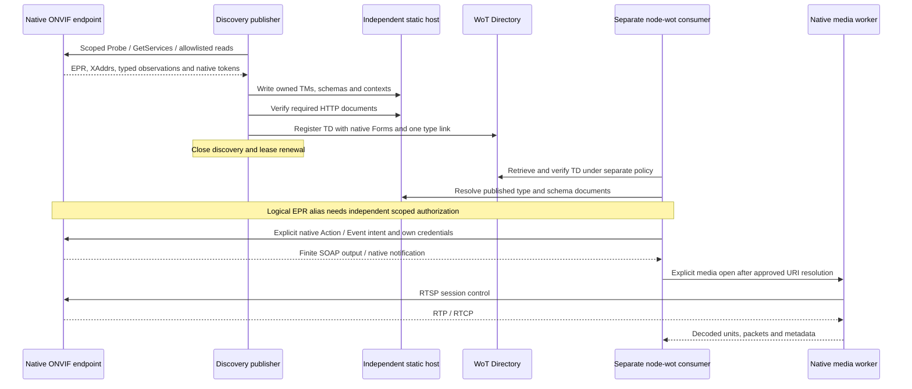

# Native ONVIF bridge and composed runtime

The private `@wot-av/binding-onvif` package composes native SOAP/node-wot,
canonical A/C/D/G/M/S/T projection, read-only discovery, publication and the Node
media API. `onvif-bridge` is `dist\cli\main.js`; constructing a bridge opens no
sockets. It is not a camera-control proxy, static web server, Directory server,
certificate installer, or assertion of product/profile certification.

**Qualification status, 16 September 2026:** the composed non-native-worker
rerun passes, including the formerly failing post-Directory invocation whose
original logical EPR differs from the projected Thing ID. The consumer now uses
explicit principal/target-bound authorization; no default trust relaxation was
introduced. This is bounded loopback integration, not full-profile or hardware
qualification. See [logical EPR policy](#logical-epr-authorization-status).

## Commands and configuration

PowerShell 7, from the repository root, with Node >=20.19.0 and npm on PATH:

```powershell
npm run build:onvif
node .\onvif\samples\reference-runtime\dist\cli\main.js --help
```

`build:onvif` compiles **all** package sources and stages already generated,
integrity-pinned catalog assets. It does not regenerate the canonical XML,
ledgers or models. Generation remains the separate `generate:onvif` command.
No install, `npm ci`, remote publication or native worker download is necessary
to use an already provisioned checkout. For a fresh, private checkout use
`npm ci --ignore-scripts`; do not replace shared dependencies during parallel
work. [Packaging](onvif-packaging.md) owns installation, Windows native build
prerequisites and publication checks; these commands do not install a worker.

Copy `onvif\examples\onvif-bridge-fixture.json` or
`onvif\examples\onvif-bridge-directory.json` into a private operator-owned directory
and edit its **absolute paths** and explicitly authorized endpoints. They are
configuration references, not running services or conformance attestations.
The Directory example addresses loopback only; nothing starts a listener at
those ports. Supply your owned ONVIF/Directory fixture and static model host,
unique preflight ID, verified contract, CA and client-identity files first.
Do not substitute unapproved devices or public Directory resources.

Pre-create separate private model, TD, identity, trust and state directories.
State/model ownership locks and content checks reject foreign writers and
independently replaced files. The model host must serve the configured model
directory at `models.baseUrl`; Directory mode verifies the complete required
model/import graph by HTTP before publishing TDs. Model requests do not borrow
Directory bearer or native credentials. File mode writes an offline bundle
and does **not** claim that its configured model URLs are reachable.

```powershell
$config = 'C:\onvif-lab\bridge.json' # Edited private copy, not the repository example.
node .\onvif\samples\reference-runtime\dist\cli\main.js inspect --config $config
node .\onvif\samples\reference-runtime\dist\cli\main.js export --config 'C:\onvif-lab\fixture-export.json'
node .\onvif\samples\reference-runtime\dist\cli\main.js run --config $config --once
node .\onvif\samples\reference-runtime\dist\cli\main.js run --config $config
```

`inspect` outputs the exact finite inventory without publishing, even when the
configuration names a publication output. Discovery input still performs the
authorized read-only inspection; fixture input performs no device I/O.
`export` requires file output. `run --once` publishes once and closes owned
resources; continuous `run` requires `intervalMs`. SIGINT/SIGTERM close the
bridge. Closing stops discovery and lease renewal, **not the remote device**.
Published native Forms and static models remain independent of the bridge;
Directory registrations survive only within their configured lease.

Only explicit interfaces, segments and exact XAddrs are authorized, including
path/query. No broadcast/host scan, credential database, security downgrade,
unknown option or unsupported fallback is implicitly enabled. Failure exits
nonzero; configuration errors have a typed code and safe explanatory message.

### Credentials and security

Keep all secret material outside JSON/TDs. Certificate targets use
`credential: {kind:"tls", certFile, keyFile, passphraseEnv?}`; server trust uses
`native.tlsCaFile`. `cert` and `onvif:MutualTlsSecurityScheme` select the real
principal-scoped native TLS identity. One CLI certificate target cannot also
select password authentication; such conjunctions require the explicit
programmatic runtime and fail in the CLI rather than losing a credential.

Digest/UsernameToken targets use
`credential: {kind:"password", usernameEnv, passwordEnv, realm?}` (`kind` may be
omitted for the original password configuration). Digest policy fields are
`algorithms` and `qops`; Digest realm must match the declared credential scope.
Directory authentication separately uses `authentication.mode: "bearer-env"`
and `tokenEnv`. Populate environment references through the operator's secret
manager; never paste tokens, passwords, certificates or keys into config/TDs.
Every target has its own principal/security binding. Definitions and actual
projected Form selections must agree with that exact native binding.

Directory HTTP is limited to loopback; other origins require HTTPS. Native TLS
verification is never disabled. Directory access, static model reads and
device requests use separate authorization scopes.

## Directory publication contract

The implementation supports the declared WoT Discovery array/Link CRUDL
contract, not arbitrary search endpoints. Configure either an owned roundtrip
preflight or explicit attestation. Strong resource ETag CAS (`If-Match`,
`If-None-Match`) is preferred; `single-writer` requires explicit exclusive-writer
evidence and is not a fabricated CAS mechanism. PUT creation/replacement,
PATCH, deletion, denial, readback content and expiry are checked, including
cleanup after a partial preflight. Unknown producer changes are conflicts, not
authority to overwrite. Only standard registration metadata and the Discovery
context are automatically excluded from producer ownership comparison.

Pagination is bounded by pages/items/restarts and same-origin, declared query
parameters. Resource ETags and collection revision links are distinct.
`registration-ttl` requires server expiry/purge evidence and declared PATCH
support. `bridge-delete` instead explicitly acknowledges that a stopped bridge
cannot enforce deletion during an outage. Fresh native observation time,
registration liveness and grace/retention are separate. Partial, denied,
unknown, truncated, unsupported and last-known outcomes are not observed false
or confirmed empty inventories. An unrepresentable whole-second lease fails
explicitly; it is not reported as successful retirement.

Every published TD has exactly one `rel:"type"` pointing to its actually
published observed composite TM. Native Forms preserve observed XAddrs, never
point to a Directory/control gateway. Stable EPR and parent-scoped resource
identities survive endpoint/firmware changes. `onvif:discovery` retains the source
EPR, its discovery addressing namespace, observation statuses and provenance.
Principals and credentials are not promoted into the public TD.

Keep document roles distinct when configuring the static host and Directory:

| Published location | Document to serve / consumer use |
| --- | --- |
| Configured Directory TD resource | Actual Thing Description (`application/td+json`) with native Forms; this is what `runtime.consume` consumes. |
| Static `models/...` URL | Actual Thing Model (`application/tm+json`), including the observed composite and its imports; not a TD, HTML index or control endpoint. |
| Static `schemas/...` URL | Canonical schema library; select the declared fragment, not its deliberately rejecting library root. |
| Static `context/v0.1` and `context/publication/v1` | Generated JSON-LD contexts with their distinct binding/publication terms. |

Publication relocates these document references to the configured base; it
does not change `https://example.org/wot/onvif#` or make the placeholder public
context address a hosted service. File-only output still requires a separately
configured host before any URL-reachability claim.

### Discovery, publication and independent consumption



This separates component responsibilities, not a claim that one bridge test
executes every arrow. In particular, inspection never calls `GetStreamUri` or
`GetReplayUri`; a media consumer needs an actually declared, evidenced resolver
Action and independent transport/credential policy. The static host and Directory
are externally operated services, not sockets created by the bridge.

Native EPR Address (often a source UUID), projected Thing `id`, Directory TD
document URL, model URL and native XAddr are distinct identities/locations.
Keep both EPR header lists and their actual addressing namespace; do not derive
any of these from another. A consumer still needs a current usable TD and
independent authorization after bridge shutdown. Registration expiry and native
session lifetime are unrelated.

## Addressed reads and opt-in Events

The bridge uses the unchanged packaged canonical operation registry.
`GetServices` and reviewed inspection operations now have real read
classifications; the bridge no longer uses the historical
`createInspectionRegistry` authorization overlay. That exported helper remains
for compatibility with the preserved isolated inspection tests.

The optional `RuntimeReadAdapter.execute` hook receives the real runtime,
consumed Thing, canonical arguments, target and request budgets. The bridge
wires it to `runtime.execute`, retaining physical XAddr, principal/trust,
AbortSignal, byte/time limits, logical To and **both** EPR header lists.
Discovery EPRs use WS-Addressing 2004/08. Programmatic `input.addressing(target)`
can supply another explicitly known namespace/route; do not infer 2005 or
relabel 2004 reference properties. A standalone adapter without an extended
hook still rejects reference headers it cannot carry.

### Logical EPR authorization status

**Resolved with explicit policy; denied by default.** The original failure
passed a different logical EPR URN through HTTP(S) target authorization.
The current [logical endpoint gate](../../samples/reference-runtime/src/security/logical-endpoint.ts)
separates routing identity from the physical Form target.
[`bridge.test.cjs`](../../tools/tests/reference-runtime/integration/bridge.test.cjs)
now passes in the composed rerun without changing the TD ID/security or
discarding EPR headers.

The programmatic option is `trust.authorizeLogicalEndpoint`, with exported type
`LogicalEndpointAuthorizer = (scope: LogicalEndpointScope) => boolean`.
It is an **out-of-band, synchronous policy callback**, not a TD annotation,
credential, per-invocation override, or serializable CLI JSON option.
Only literal `true` authorizes the exact request; absence, refusal and
non-boolean results deny the alias before network transmission.

| Scope field | What the independently provisioned policy must assess |
| --- | --- |
| `thingId`, `principal` | The actual consumed Thing and caller, not a principal copied from discovery metadata. |
| `origin`, `href` | The exact physical native Form target, including path/query, already checked against runtime target policy. |
| `operation` | Complete binding QName, portType QName and operation tuple. |
| `endpointReference` | Original `address`, `addressingNamespace`, and both ordered `referenceProperties`/`referenceParameters` lists. |

With this opt-in configured, consume validates and snapshots the projected
`onvif:discovery` EPR association. Device IDs must match their EPR identity;
resource IDs additionally include native service/kind/token/ordered parents.
This digest consistency check is **not device authentication**: independently
verify the TD and approve the exact route from operator-owned evidence.
Untrusted TD metadata, even with a self-consistent hash, cannot grant an alias.

Invocation must match that retained EPR, actual WSA2004/2005 namespace, ordered
headers and selected Form target. HTTP(S) logical aliases also undergo their own
physical-style target checks; URNs are logical identities, not HTTP endpoints.
The same-Thing logical To and ordinary selected HTTP(S) To paths remain intact.
WSA2005 does not gain WSA2004 reference properties. Addressing/header snapshots
are retained across awaited credential lookup, and the callback cannot replace
the selected native security.

Do not use an unconditional approval callback, rewrite TD identity/security,
drop headers or weaken target checks. A deployment overriding the bridge's SOAP
route must separately configure its consumer's policy. Credentials, Directory
trust, native target permission and logical route approval remain separate.

### Explicit Event publication

Inspection never subscribes. Event publication is an explicit additional
configuration, for example:

```json
{
    "eventSubscriptions": [
        {
            "xaddr": "https://127.0.0.1:18443/events",
            "evidence": [
                {
                    "sourceId": "operator:approved-lab-pullpoint-publication"
                }
            ]
        }
    ]
}
```

Place this object under `adapter`. It requires a current, positive integral
`tev:Capabilities/@MaxPullPoints` and successful native `GetEventProperties`.
Zero/unknown/string values, unavailable schemas or a profile claim alone do
not create an Event. The different legacy Device Events capability field
`WSPullPointSupport` is not substituted for this Event-service field.
The composite TM imports the actual canonical PullPoint Event, including
subscription/data/cancellation DataSchemas; its Form preserves service security.
Actual Create/Pull/Unsubscribe begins only with consumer subscription intent.
Listeners receive node-wot `InteractionOutput`: await `output.value()`.
Await the managed handle's `stop()` and then the runtime's `close()`.
Renewal, filters and recovery need their separately supported explicit options.

## Scope and qualification

`test:onvif` (also `test:onvif:all`) builds once and discovers all existing unit, binding-gate,
catalog, events, discovery, publication, media-unit and integration test files.
Preserved isolated imports are resolved to the current composed `dist`; stale
`.compiled` trees are not test evidence. Empty/unknown suites are errors.

```powershell
npm run test:onvif
npm run test:onvif:integration
npm run test:onvif:publication
npm run test:onvif:media
```

The bridge integration uses independent owned UDP/SOAP/Directory/model fixtures,
the actual packaged projector/registry and a separate node-wot consumer after
bridge shutdown. The strengthened logical-EPR variant now passes with explicit
scoped policy and reaches its later A/C/D/Event assertions. All seven profile device/client role claims are assessed
without certification inference. The native observations specifically cover
DeviceInformation, A access profiles, C doors and PullPoint events, D DeviceIO
capabilities, service/resource inventories, recording-parent identity and
conditional fact preservation. These are **not** full native conformance proofs
for every profile, service operation, resource workflow or deployed device.
Certificate configuration additionally proves a second principal reads changed
live firmware rather than cached inspection data.

Native media is deliberately excluded from automatic/default tests:

```powershell
$env:ONVIF_MEDIA_NATIVE_TEST = '1'
$env:ONVIF_MEDIA_WORKER = 'C:\onvif-lab\native\onvif_media_worker.exe'
$env:ONVIF_MEDIA_SDK_ROOT = 'C:\onvif-lab\gstreamer'
$env:ONVIF_MEDIA_PYTHON = 'C:\onvif-lab\python\python.exe'
npm run test:onvif:media:native
```

These must reference an already built/qualified worker, matching SDK and Python.
Missing opt-in or paths fail, not skip or succeed. No SYSTEMTEMP binary path
is embedded in scripts. The paths above are operator-selected examples, not
provided executables or an automatic SDK installation.

Scoped [Node media](onvif-node-media.md) and
[native worker qualification](../reports/onvif-media-qualification.md) now have their own
completed local fixture cohorts. Their codec/transport/backchannel limits remain
separate from bridge qualification; an export alone is not that proof.
See the [support matrix](../reports/onvif-conformance.md) and
[packaging/CI boundary](onvif-packaging.md). No hardware, full-profile,
distribution or certification result is inferred.
