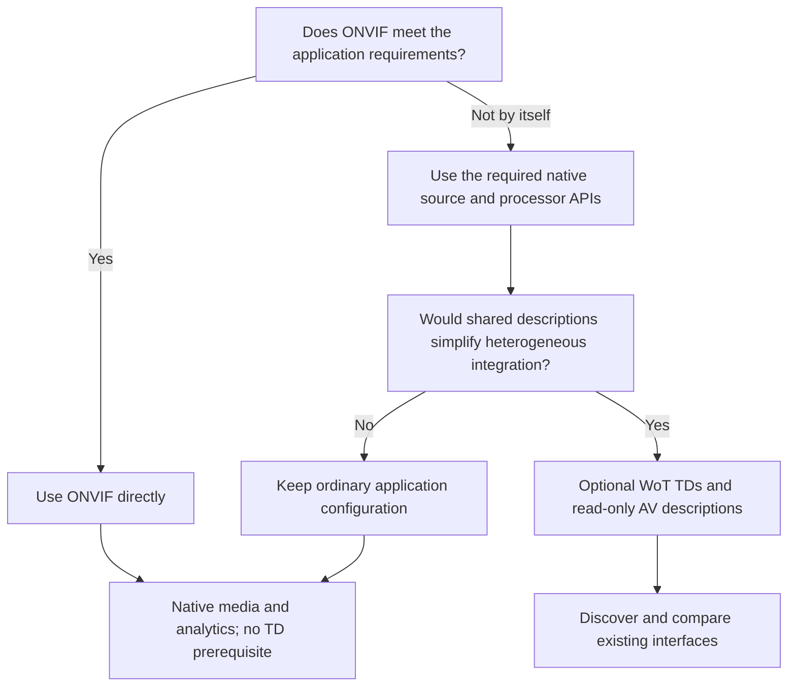
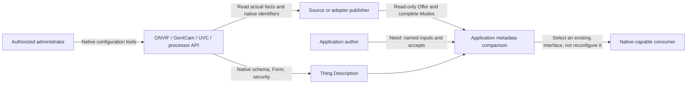
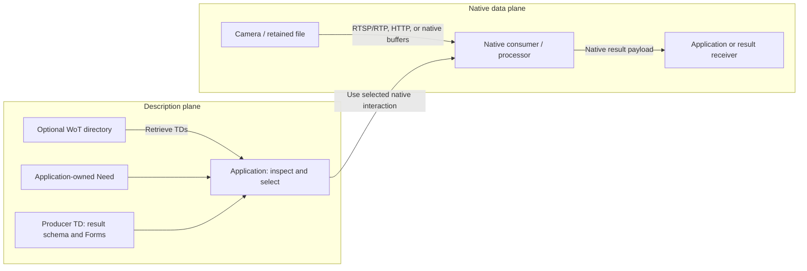
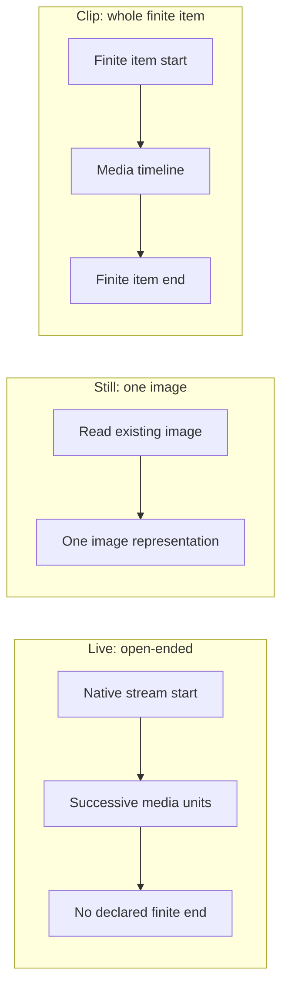
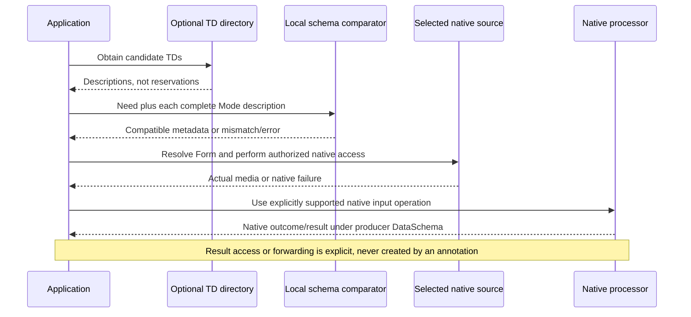
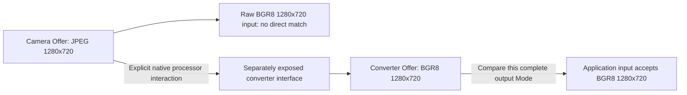

# WoT AV Extension specification

**If ONVIF meets requirements, use ONVIF directly.** The WoT layer is optional
read-only heterogeneous application integration. ONVIF already covers
discovery, configuration, PTZ/imaging, live media, snapshots, supported
analytics/events, and recording/search/replay. Profiles S/T/G/M express
different, support-dependent device and client obligations; they are not
streaming presets or a guarantee of every feature.[^onvif-profiles]

**Draft `0.2-proposed`, 14 September 2026.** This is an original proposal,
not a W3C Recommendation, registered vocabulary, implementation, or
interoperability certificate. Its **new, unregistered namespace** is
`https://example.org/wot/av/0.2#`; the context identifier
`https://example.org/wot/av/context/v0.2` is an **unhosted placeholder**.
The [migration note](spec/migration.md) separates this breaking revision from
the deprecated [v0.1 specification](archive/v0.1-proposed/spec.md).

**Separate implementation:** the repository also contains a
[native ONVIF WoT binding](bindings/onvif/readme.md) for the seven released
A/C/D/G/M/S/T profile models, native SOAP/Events, media and discovery/publication.
Its provisional `onvif:` terms and authorized native operations do not extend
the AV 0.2 vocabulary, change this draft's read-only metadata semantics, or
establish profile certification. See its [actual support boundaries](spec/onvif-conformance.md).

## Contents

- [1. Decide whether another layer helps](#1-decide-whether-another-layer-helps)
- [2. Seven classes, with clear ownership and defaults](#2-seven-classes-with-clear-ownership-and-defaults)
- [3. Keep descriptions separate from media and native access](#3-keep-descriptions-separate-from-media-and-native-access)
- [4. Describe complete existing Modes](#4-describe-complete-existing-modes)
- [5. Live, Still, and Clip](#5-live-still-and-clip)
- [6. Match a Mode description, not bytes or execution](#6-match-a-mode-description-not-bytes-or-execution)
- [7. Explicit conversion and multiple inputs](#7-explicit-conversion-and-multiple-inputs)
- [8. Reuse native result schemas and Forms](#8-reuse-native-result-schemas-and-forms)
- [9. Conformance, security, and publication boundaries](#9-conformance-security-and-publication-boundaries)
- [Complete per-entry reference](spec/terms.md)

## 1. Decide whether another layer helps

An application that can discover, configure, and consume its cameras through
ONVIF needs no TD merely to keep using them. The same is true for an external
processor consuming native media or analytics. ONVIF's analytics architecture
already supports distributing its components across devices and servers;
external processing is not evidence that ONVIF lacks analytics.[^onvif-analytics]

The decision below puts ordinary native integration before shared metadata.
Add the optional layer only when it makes a heterogeneous application simpler.



WoT can describe existing Things, their Properties/Actions/Events, native
Forms, data constraints, and security. This draft adds only reusable media
facts and application-owned acceptance criteria. It does not replace those
WoT mechanisms or define a universal transport.[^td]

The active inventory contains **7 classes and 29 AV properties**, including
the three additions `av:accepts`, `av:result`, and `av:destination`.
It requires **zero AV profile families**. There is no generic Assignment,
lease, document-pin closure, model manifest, scheduler, or lifecycle module
hidden behind optional headings.

[vocabulary/terms.json](vocabulary/terms.json) is the authored authority for
the term surface, values, cardinalities, and per-entry documentation.
[spec/terms.md](spec/terms.md) is its generated reference and linked TOC;
this document specifies composition and matching behavior. Context, ontology,
shapes, examples, and prose MUST agree on the chosen revision. Conflicting
artifacts do not permit an implementation to select whichever meaning passes.

Here **MUST/MUST NOT** mark requirements for the feature being claimed,
**SHOULD** a recommendation, and **MAY** an option. These are this proposal's
requirements, not changes to an upstream standard. Example JSON is complete
for its stated object or fragment, not an assertion that the fragment alone
is a conforming TD. File/JSON Pointer markers identify literal source excerpts.

## 2. Seven classes, with clear ownership and defaults

The native device or processor is the source of operational facts. An adapter
publisher is responsible for a faithful, read-only projection. The application
author owns requested inputs; the producer and receiver own their respective
payload schemas and access policies.

The diagram separates the only native configuration path from description
and selection. There is deliberately no arrow from a Need to a camera setter.



Changing a requested width or rate MUST NOT change the source configuration.
An authorized native change instead requires readback and refreshed
descriptions. ONVIF already defines encoder, imaging, and PTZ operations;
GenICam/UVC sources retain their own native authorities.[^native-controls]

| Class | Who authors it / what it describes | How a consumer uses it | Presence, omission, and defaults |
| --- | --- | --- | --- |
| `Offer` | Source/adapter publisher: one source Thing's complete alternative Modes. | Read `source`, TD `document`, and nonempty `mode` set. | No Offer means no AV advertisement, not no native capability. |
| `Mode` | Publisher: one jointly offered kind, native Form, and simultaneous track roster. | Evaluate this whole combination; keep its selected Form. | Missing kind/Form/tracks is invalid; no combination is synthesized. |
| `Track` | Publisher: one named component at the offered interface. | Inspect its actual encoded/raw video/audio facts. | Essential representation facts are required; other absent facts are unknown. |
| `Rational` | Publisher: an exact ratio, used for media cadence. | Compare reduced numerator/denominator pairs exactly. | Both integers are required; denominator is positive. No denominator-one or nominal-rate default. |
| `Need` | Application/deployment author: requested named inputs, optionally a processor and result access. | Discover or compare compatible existing interfaces. | Nonempty inputs required; no implied active state, assignment, or execution. |
| `InputRequirement` | Application author: one named input, explicit presence, and a whole-Mode schema. | Test `accepts`; include it if required or explicitly selected. | Missing presence/schema is invalid. Optional inclusion does not relax its schema. |
| `FormReference` | Selecting party: TD document, named Form, standard operation. | Resolve native access and the producer/receiver schema. | All three fields required. No first-Form, `href`-as-identity, or guessed-TD fallback. |

This representative entry table shows how to read the
[complete generated entries](spec/terms.md). The reference applies the same
who/what/how/omission template to **every** class, property, domain use, and
controlled value; it is not a 105-field summary of the old design.

| Entry | Author and described fact | Consumer behavior | Omission/default rule |
| --- | --- | --- | --- |
| `av:source` | Publisher: the source Thing's absolute IRI, including a converter for its own output. | Compare source identity; do not treat it as a TD retrieval URL. | Required on Offer; never inferred from `href`. |
| `av:document` | Publisher or selecting party: explicit TD retrieval location. | Resolve the named Form using the original TD and effective base. | Required on Offer/FormReference; not an immutable-byte guarantee. |
| `av:width` / `av:height` | Publisher: actual image dimensions in pixels. | Test required dimensions or bounds in `accepts`. | Required for concrete video; absent for audio. No sensor-maximum or resize fallback. |
| `av:cadence` / `av:frameRate` | Publisher: video media cadence and, only for Constant, exact frames/media-second. | Test an exact rate pair where requested. | Unknown cadence stays unknown; Constant requires rate; Still forbids both. |
| `av:presence` | Application author: Required or Optional whole-input inclusion. | Require a compatible selection, or permit explicit omission. | Required; neither value is an implicit default. |
| `av:accepts` | Application author: JSON Schema over the deterministic description. | Validate one Mode's facts without modifying them. | Required. Omitted `$schema` selects 2020-12; `default` never fills missing data. |
| `av:result` | Application selects; producer defines payload meaning. | Resolve the producer's native DataSchema and Form. | Optional: no declared result selection, not proof that no results exist. |
| `av:destination` | Application selects; receiver owns input schema and policy. | Use only through an explicitly supported native transfer interaction. | Optional; requires result when present. No default sink, push, or subscription. |

Read-only here is an **ownership and projection rule**, not a new TD keyword
or access-control mechanism. An actual PropertyAffordance still uses native
`readOnly`/`writeOnly`, Forms, and security.[^td]

## 3. Keep descriptions separate from media and native access

The TD describes where and how to interact. It does not transport the camera
stream, hold a frame buffer, or execute an application. The two planes below
remain separate even if one process implements several boxes.



WoT Discovery can supply the descriptions; it does not reserve capacity,
authorize access, or prove that a transport or decoder works.
The directory's actual advertised interfaces determine how it is queried;
do not assume that every directory exposes the same search mechanism.[^discovery]

### Native Form first

An annotated TD keeps the native TD 1.1 context first and adds the new AV
context. Native keys, `input`/`output`, operations, security, and defaults are
not redefined. Standalone Need documents may use the AV context alone.
`av:accepts` is an opaque JSON-LD `@json` value: its schema property names are
not extra AV graph predicates.[^jsonld]

This HTTP/JPEG Property fragment belongs inside the complete
[source TD](examples/source.td.json); it is **not a TD by itself**.
It describes an existing image read, not an exposure command.

<!-- example: examples/source.td.json#/properties/snapshot -->
```json
{
    "title": "Latest-existing JPEG",
    "description": "The response is JPEG bytes, not a JSON string or base64 value. Geometry is a publisher-supplied fact about this example output, not a device maximum. Freshness and exposure time are unspecified.",
    "readOnly": true,
    "observable": false,
    "forms": [
        {
            "@id": "urn:example:av-example:form:snapshot",
            "@type": "hctl:Form",
            "href": "https://media.example.org/latest.jpg",
            "op": "readproperty",
            "htv:methodName": "GET",
            "contentType": "image/jpeg",
            "response": {
                "contentType": "image/jpeg"
            }
        }
    ]
}
```

The publisher owns `href`, binding details, and security. A Mode's `av:form`
names that Form's absolute, unique `@id`, **not** its `href`. Form membership
MUST be checked in the declared TD's native `forms` collections; an unrelated
lookalike node is not an access description. Requiring this named identity
is an AV convention, not a new WoT profile family.[^forms]

A FormReference supplies `av:document`, `av:form`, and `av:operation`.
The operation is an existing TD operation IRI, such as
`https://www.w3.org/2019/wot/td#readProperty`; the native Form still uses its
normal lowercase `op` token. Resolve supported operations, native defaults,
relative targets, URI variables, effective retrieval location, explicit
`base`, and security inheritance from the **original TD**.[^forms]

An Offer's retrieved TD MUST identify its `av:source` Thing. A reference to a
mutable document is not an exact-byte pin, publisher authentication, or
current-availability guarantee. Use ordinary application cache/version/trust
policies where needed; the core adds no digest-closure protocol.

For ONVIF, the [native flow](spec/onvif-integration.md#native-read-flow-with-real-operation-names)
uses Device `GetServices`, Media2 `GetProfiles(Type=["All"])`,
`GetVideoEncoderConfigurationOptions`, `GetStreamUri`, and `GetSnapshotUri`.
The returned URI still needs native RTSP/RTP or HTTP access. A TD annotation
does not implement SOAP, authentication, negotiation, or a universal ONVIF
binding.[^onvif-native]

## 4. Describe complete existing Modes

Each Offer has one source Thing, one TD document location, and a nonempty
unordered set of mutually alternative Modes. Each Mode has an absolute
identity, an explicit kind, one native Form, and a complete nonempty
simultaneous Track roster. Offers, Modes, Tracks, Needs, and named inputs use
the inventory's absolute-identity rules.

This complete **Offer fragment**, embedded in the source TD, shows the useful
minimum: one existing JPEG interface without acquisition profiles, resources,
pins, leases, or another endpoint object.

<!-- example: examples/source.td.json#/av:offer/0 -->
```json
{
    "@id": "urn:example:av-example:offer:still",
    "@type": "av:Offer",
    "av:source": "urn:example:av-example:source",
    "av:document": "https://media.example.org/source.td.json",
    "av:mode": [
        {
            "@id": "urn:example:av-example:mode:jpeg720",
            "@type": "av:Mode",
            "av:kind": "av:Still",
            "av:form": "urn:example:av-example:form:snapshot",
            "av:track": [
                {
                    "@id": "urn:example:av-example:track:jpeg",
                    "@type": "av:Track",
                    "dcterms:identifier": "picture",
                    "av:representation": "av:EncodedVideo",
                    "av:codec": "av:JPEG",
                    "av:width": 1280,
                    "av:height": 720
                }
            ]
        }
    ]
}
```

`dcterms:identifier` names each Track uniquely within its Mode; it is not a
device index or packet identifier. The term retains its external identifier
meaning.[^dc] Set order establishes neither preference nor availability.

| Representation | Required concrete facts beyond identity/name | Facts that must not be invented |
| --- | --- | --- |
| `av:EncodedVideo` | Width, height, codec family. | Pixel format, decoded buffer layout, or decoder support. |
| `av:RawVideo` | Width, height, pixel format, buffer-layout category. | Codec, detailed strides, memory access, or conversion permissions. |
| `av:EncodedAudio` | Codec family, samples/second/channel, channel count and layout. | PCM sample format or signaling-derived sampling facts. |
| `av:PCM` | Sample rate, channel count/layout, sample format, buffer layout. | Codec or an assumed host-native sample format. |

The inventory defines the permitted codec, pixel, sample, channel, and layout
values and their conditional fields. H264/JPEG/H265 are encoded-video families;
AAC/Opus are encoded-audio families. Such labels do not supply initialization,
transport framing, decoder implementation, colorimetry, or detailed native
buffer access. A Strided category alone cannot prove buffer compatibility.

A publisher lacking essential concrete facts MUST NOT publish that concrete
Mode. It MAY still publish the native TD and whatever its native capability
interface can honestly describe. Other missing facts mean unknown, never
zero, false, unconstrained capability, or a favorable default.

A 1080p25 Mode with audio and a separate 720p30 Mode without audio do **not**
advertise 720p30 with audio. The comparator MUST evaluate one complete Mode,
not independently join video, audio, resolution, or rate across alternatives.

## 5. Live, Still, and Clip

These are different media kinds, not three scheduling states. The diagram
illustrates their temporal boundaries; the Mode still declares its complete
simultaneous Track roster.



| Kind | Publisher's claim / consumer use | Omission and boundary |
| --- | --- | --- |
| `av:Live` | Open-ended media through the named native interface. | No implied duration, lossless delivery, or wall-clock processing rate. |
| `av:Still` | Still image access; the native operation defines how images are obtained. | No cadence/frameRate. No implicit fresh exposure, trigger, or capture timestamp. |
| `av:Clip` | The whole finite item. | Native media/container or explicit interaction owns extents and seeking. Unknown duration is not zero; no AV seek/timeline graph is required. |

ONVIF snapshots update independently of `GetSnapshotUri`; reading one does
not mean a new exposure. Native recording/replay operations remain native.
Repeated Still reads do not, by themselves, establish a Live frame rate.[^onvif-native]

Only explicit `av:Constant` video cadence carries `av:frameRate`, a positive
reduced Rational in frames per media second. Variable/Triggered cadence does
not assert an exact rate; Triggered is descriptive, not a trigger command.
Integer facts and Rational parts follow the inventory's exact-integer rules.
Ordinary JSON integer tokens are limited to magnitude `9007199254740991`;
larger exact source values use an explicit decimal lexical `xsd:integer`
value object. Fractional/exponent tokens, numeric-looking strings, booleans,
and non-finite values are not substitutes for an integer fact.
Both numerator and denominator are explicit; denominator is positive and the
pair is reduced by its greatest common divisor.

`30/1` and `30000/1001` remain different. The core supports exact pairs or
explicitly enumerated pairs in a schema, **not general FPS inequalities**,
cross-field rational arithmetic, or rounded "29.97 equals 30" promises.
Media cadence is not delivered losslessness or processing throughput.
See the complete [Live TD](examples/live.td.json) and
[whole-Clip TD](examples/clip.td.json).

This exact-rate schema fragment is taken from the Live Need's video
definition. Both parts are required, so it describes `30/1`, not a rounded
decimal or an inequality. The enclosing
[Live Need](examples/live-need.jsonld) requires the video and audio together
in one Mode.

<!-- example: examples/live-need.jsonld#/av:input/0/av:accepts/$defs/video/properties/av:frameRate -->
```json
{
    "type": "object",
    "required": [
        "av:numerator",
        "av:denominator"
    ],
    "properties": {
        "av:numerator": {
            "const": 30
        },
        "av:denominator": {
            "const": 1
        }
    }
}
```

## 6. Match a Mode description, not bytes or execution

### Deterministic comparison value

`av:accepts` validates one **Mode description**. That phrase names a JSON
view, not an eighth AV class. The input is neither the original TD, a
DataSchema node, JPEG/PCM bytes, a model tensor, nor a proposed schedule.

For a structurally valid Offer/Mode, construct exactly this root object:
`av:source` is the Offer's absolute source IRI, `av:kind` is its compact AV
controlled value, and `av:track` is the complete Track array.
Each Track includes its `dcterms:identifier` and only its present descriptive
fields: representation, width, height, codec, pixelFormat, cadence, frameRate,
sampleRate, channels, channelLayout, sampleFormat, and bufferLayout.

Use fixed compact `av:` keys and controlled values under the **0.2 namespace**,
independent of aliases in the original JSON-LD. Sort Tracks by their unique
`dcterms:identifier` strings, case-sensitively in Unicode code-point order.
Preserve exact integer values and reduced Rational pairs; a frameRate value
contains only `av:numerator` and `av:denominator`. Decode any explicit
`xsd:integer` lexical value in the source to an exact integer in this view,
not a floating-point approximation or a copied RDF value wrapper. Do not
round, add defaults, or copy unknown fields into the view. Old-namespace
values do not silently become 0.2 values.

There are **no** Offer/Mode/Track `@id`/`@type` fields, contexts, Form addresses,
document locations, or security data in this comparison value. The one source
IRI is descriptive identity, not a retrieval instruction. Deterministic
Track ordering makes serialization repeatable; contracts MUST express
track requirements without positional `prefixItems` or array-order priority.
Use identifiers/`contains` instead.
JSON object member order has no matching significance.

For the preceding JPEG Offer, the complete comparison value is:

```json
{
    "av:source": "urn:example:av-example:source",
    "av:kind": "av:Still",
    "av:track": [
        {
            "dcterms:identifier": "picture",
            "av:representation": "av:EncodedVideo",
            "av:width": 1280,
            "av:height": 720,
            "av:codec": "av:JPEG"
        }
    ]
}
```

This is a derived view of `examples/source.td.json`, pointer
`/av:offer/0/av:mode/0`, not a literal excerpt or a second editable source.

### Application-owned schema

Each Need has a nonempty set of uniquely named InputRequirements.
Each input explicitly supplies `av:Required` or `av:Optional` and an
`av:accepts` **schema object**. The application controls this contract,
not the camera publisher.

The schema dialect is JSON Schema **2020-12**. `$schema`, when supplied,
MUST be `https://json-schema.org/draft/2020-12/schema`; omission selects
that same dialect by this draft's explicit default. Other dialects are not
silently reinterpreted. `$ref`/`$dynamicRef` references MUST use local `#`
fragments resolving within the supplied schema; unresolved or external
dependencies are errors, not successful matches or invitations to fetch
arbitrary URLs. The portable comparison
surface rejects positional `prefixItems`, custom/unsupported keywords or
vocabularies, and a request for format-assertion behavior rather than silently
ignoring a purported hard requirement.[^schema-core]

This complete Need requests the processor's advertised **contiguous BGR8
Still interface**, exactly 1280 by 720. It deliberately does **not** match
the preceding camera/JPEG description: the source and representation differ.
Equal geometry is not permission to decode or substitute the source.
The processor's separate output is described in the next section.

<!-- example: examples/need.jsonld# -->
```json
{
    "@context": "https://example.org/wot/av/context/v0.2",
    "@id": "urn:example:av-example:need:inspection:2",
    "@type": "av:Need",
    "dcterms:isVersionOf": "urn:example:av-example:need:inspection",
    "dcterms:description": "The workload author requests the processor's advertised 1280x720 contiguous BGR8 Still input. The encoded JPEG source does not match directly. A separate, explicitly invoked converter could produce this interface; no conversion or execution follows from this Need.",
    "av:processor": "urn:example:av-example:processor",
    "av:input": [
        {
            "@id": "urn:example:av-example:input:inspection:2",
            "@type": "av:InputRequirement",
            "dcterms:identifier": "inspection",
            "av:presence": "av:Required",
            "av:accepts": {
                "$schema": "https://json-schema.org/draft/2020-12/schema",
                "type": "object",
                "required": [
                    "av:source",
                    "av:kind",
                    "av:track"
                ],
                "properties": {
                    "av:source": {
                        "const": "urn:example:av-example:processor"
                    },
                    "av:kind": {
                        "const": "av:Still"
                    },
                    "av:track": {
                        "type": "array",
                        "minItems": 1,
                        "maxItems": 1,
                        "items": {
                            "type": "object",
                            "required": [
                                "dcterms:identifier",
                                "av:representation",
                                "av:pixelFormat",
                                "av:width",
                                "av:height",
                                "av:bufferLayout"
                            ],
                            "properties": {
                                "dcterms:identifier": {
                                    "type": "string",
                                    "minLength": 1
                                },
                                "av:representation": {
                                    "const": "av:RawVideo"
                                },
                                "av:pixelFormat": {
                                    "const": "av:BGR8"
                                },
                                "av:width": {
                                    "const": 1280
                                },
                                "av:height": {
                                    "const": 720
                                },
                                "av:bufferLayout": {
                                    "const": "av:Contiguous"
                                }
                            }
                        }
                    }
                }
            }
        }
    ]
}
```

Standard `properties` constraints apply **if the property is present**.
Every hard fact MUST also be required by the schema at the appropriate level.
Missing required facts fail. `default` annotations MUST NOT inject source
facts; `format` is annotation-only in the core, not an assertion that proves
URI syntax, reachability, or authenticity. Structural identifier checks
remain separate.[^schema-validation]

Use whole-description `anyOf` for alternatives, normal integer
`minimum`/`maximum` for supported dimensions or sampling facts, and `contains`
with explicit predicates for simultaneous components. If two tracks are
required, both tests apply to the **same** `av:track` array; use distinct
identifiers or representation predicates when distinct tracks are intended.
Do not reinterpret two matches to one track as two independent inputs.

An Optional input may be left out. Once included, its entire schema remains
hard. No input ordering, preference ranking, conversion, synchronization,
capacity reservation, or all-or-none transaction is implied.

### From discovery to native results

The sequence deliberately labels metadata compatibility before native
connection and work. A failure at any later stage remains a failure; the
comparison does not make the operation succeed.



Discovery errors, incomplete pages, denied access, and unresolved references
MUST NOT become a success-shaped empty search. Metadata comparison MUST NOT
drop an unsupported requirement to obtain a match. Runtime authority,
negotiation, decoder/layout support, resource availability, and actual
processing remain separate native/application checks.

## 7. Explicit conversion and multiple inputs

A JPEG Mode cannot directly satisfy RawVideo/BGR8 input requirements.
An explicit converter can publish its own output Offer **only when there is
an independently exposed cross-workload interface to describe**. Its own
native interaction defines conversion parameters and output access.

The diagram contrasts a direct non-match with a genuinely different offered
interface. It does not require an adapter-plan graph or discoverable Thing
for every internal transform.



If decoding and `cv2` conversion are private implementation details of one
application, keep them private: use the native source and normal code.
No TD is required per stage. A requested output size neither configures the
camera nor authorizes arbitrary resizing, tensor normalization, or model
preprocessing. Those belong to explicitly supported native processor inputs.

See the [processor TD](examples/processor.td.json) for an exposed boundary and
the [two-input Need](examples/two-input-need.jsonld) for separate named inputs.
Each required input needs one complete matching Mode; compatible inputs do
not prove simultaneous availability or clock synchronization. The application
owns its cross-input scheduling and native error handling.

An ordinary processor Action MAY return its own selection/outcome JSON naming
input IDs, chosen Mode IDs, and FormReferences. Such a record is application
data, not a new AV Assignment class. A claimed successful selection must
represent every required input and validate every included Optional input.
It does not establish execution, a lease, distributed atomicity, or durability.

## 8. Reuse native result schemas and Forms

The result **producer** defines payload meaning using its native
PropertyAffordance DataSchema, Action `output`, or Event `data`.
`av:result` selects the native producer Form and operation; it does not copy
the schema into an AV manifest. Native `@type` on a DataSchema types that
schema node, not automatically every runtime payload.[^td]

Here is the complete `actions.inspect.output` DataSchema from the
[processor TD](examples/processor.td.json). This deliberately small example
defines a mean-blue-channel result; it is not a universal analytics schema,
inference manifest, or fabricated response.

<!-- example: examples/processor.td.json#/actions/inspect/output -->
```json
{
    "description": "Native result payload: meanBlue is the arithmetic mean of all blue-channel byte values, in the inclusive range 0 through 255. resultId and imageId are application identifiers, not an AV execution or durable-receipt graph.",
    "type": "object",
    "properties": {
        "resultId": {
            "type": "string",
            "minLength": 1
        },
        "imageId": {
            "type": "string",
            "minLength": 1,
            "pattern": "^[A-Za-z0-9._-]+$"
        },
        "meanBlue": {
            "type": "number",
            "minimum": 0,
            "maximum": 255
        }
    },
    "required": [
        "resultId",
        "imageId",
        "meanBlue"
    ]
}
```

The application selects that producer with this complete FormReference
excerpt from `examples/result-need.jsonld`, pointer `/av:result`:

<!-- example: examples/result-need.jsonld#/av:result -->
```json
{
    "@type": "av:FormReference",
    "av:document": "https://processing.example.org/processor.td.json",
    "av:form": "urn:example:av-example:form:inspect",
    "av:operation": "https://www.w3.org/2019/wot/td#invokeAction"
}
```

The optional `av:destination` selects a writable Property or Action input.
The receiving Thing owns the authoritative input schema and access policy.
The sender must explicitly support that destination through its ordinary
API, with any required arguments and authorization. A FormReference alone
creates **no push, callback, subscription, routing instruction, or transfer**.
If destination is present, result MUST also be present.

The [result Need](examples/result-need.jsonld) and
[processor TD](examples/processor.td.json) keep these roles separate.
The example's result reference selects `inspect` Action output. Its optional
destination selects the [receiver TD's](examples/sink.td.json) Action with
the same declared payload shape:

<!-- example: examples/result-need.jsonld#/av:destination -->
```json
{
    "@type": "av:FormReference",
    "av:document": "https://results.example.org/sink.td.json",
    "av:form": "urn:example:av-example:form:receive-result",
    "av:operation": "https://www.w3.org/2019/wot/td#invokeAction"
}
```

`inspect.input` explicitly supports a destination parameter and separately
requires an `imageId` from an actual successful conversion. No default
image ID, sink, credential forwarding, or invocation is inferred by the Need.
The application must pass those native parameters and handle actual outcomes;
neither Action starts because the two references appear together.

| Declaration or omission | Who decides / how to interpret it |
| --- | --- |
| Result Property schema, Action output, or Event data | Producer owns the actual payload structure; resolve it from the selected affordance. |
| No `av:result` | Requester declares no result selection. Do not infer no outputs, arbitrary compatibility, or successful completion. |
| Result selected but no producer schema | Payload compatibility remains unknown; do not invent an unconstrained schema. |
| No `av:destination` | No push destination was requested. Use the selected result access where applicable. |
| Receiver schema or native transfer support missing | Do not claim delivery is supported or schedule a hidden relay. |
| An empty result payload | Interpret under the producer's schema and outcome semantics; it is not a generic substitute for an error or absent response. |

Additional application schemas can describe detections, transcripts,
embeddings, or other outputs without adding AV result classes. Existing
artifact formats own learned-model files and tensors; a WoT Thing Model is
instead a reusable interaction-description template.[^thing-model]
Optional external provenance can record **actual** use and derivation;
a Need or selected interface is not proof that those activities occurred.[^prov]

## 9. Conformance, security, and publication boundaries

State the exact target of every conformance claim: strict JSON and readable
formatting, native TD structure, JSON-LD/RDF shapes, resolved Form membership,
or 2020-12 Mode-description compatibility. None proves a native implementation,
camera capability, decoder, timing bound, authorization, or hardware
interoperability. [Validation details](spec/validation.md) describe these
separate layers and the assembled offline commands.[^shacl]

JSON/JSON-LD publication uses **four-space indentation**, opening object/array
delimiters on the property line, one field per line, and expanded nonempty
arrays/objects. Empty `{}`/`[]` may remain inline. Format without changing
numeric tokens, strings, or historical/vendored bytes. Literal example
snippets must stay consistent with their cited file and JSON Pointer.

Authenticate publishers separately from reading descriptions. Apply bounded
retrieval and native security policies to TDs and media/results; do not
publish credentials, bearer URLs, or secret keys. Matching schemas are
self-contained and cannot use network resolution to discover data or
substitute missing facts. Native connections can consume resources even when
the advertised facts are read-only.

The [README](readme.md) identifies active paths, local commands, licensing,
private publication status, and the public-only research boundary.
The [research report](research/media-registry-research.md) is informative
historical rationale, not a second normative term source. Release hashes and
offline caches are publication tooling, not runtime vocabulary.

The deprecated v0.1 corpus is preserved separately under
`archive/v0.1-proposed/` from committed historical bytes. Do not reinterpret
its assignments as accepted 0.2 work, overwrite its context, or run the new
generator over the archive. Future incompatible meanings likewise need an
explicit migration, not a silent context or IRI substitution.

## Primary references

The WoT baseline is the dated W3C Recommendations below. ONVIF references use
release **26.06**, commit `68ee1b540a40f848c9599eba2c55b87547c588d6`, with
separately versioned profile documents. No private implementation source or
hardware experiment is incorporated.

[^onvif-profiles]: ONVIF [Profile S v1.3, sections 6-8](https://www.onvif.org/wp-content/uploads/2019/12/ONVIF_Profile_-S_Specification_v1-3.pdf);
    [Profile T v1.0, sections 5, 7-8](https://www.onvif.org/wp-content/uploads/2018/09/ONVIF_Profile_T_Specification_v1-0.pdf);
    [Profile G v1.1, sections 7-9](https://www.onvif.org/wp-content/uploads/2025/11/ONVIF-Profile-G-Specification-v1-1.pdf);
    [Profile M v1.1, sections 5, 7-8](https://www.onvif.org/wp-content/uploads/2024/04/onvif-profile-m-specification-v1-1.pdf).
[^onvif-analytics]: ONVIF Analytics, [distributed architecture and native interfaces, lines 552-587](https://github.com/onvif/specs/blob/68ee1b540a40f848c9599eba2c55b87547c588d6/doc/Analytics.xml#L552-L587).
[^td]: W3C, [WoT Thing Description 1.1, sections 5-6](https://www.w3.org/TR/2023/REC-wot-thing-description11-20231205/#sec-vocabulary-definition),
    Recommendation, 5 December 2023.
[^native-controls]: ONVIF [Media2 encoder configuration, lines 1246-1282](https://github.com/onvif/specs/blob/68ee1b540a40f848c9599eba2c55b87547c588d6/doc/Media2.xml#L1246-L1282),
    [Imaging settings/options, lines 590-646](https://github.com/onvif/specs/blob/68ee1b540a40f848c9599eba2c55b87547c588d6/doc/Imaging.xml#L590-L646),
    and [PTZ operations, lines 306-339](https://github.com/onvif/specs/blob/68ee1b540a40f848c9599eba2c55b87547c588d6/doc/PTZ.xml#L306-L339);
    EMVA, [GenICam modules](https://www.emva.org/standards-technology/genicam/introduction-new/);
    USB-IF, [UVC 1.5, Device Class Definition, section 2](https://www.usb.org/sites/default/files/USB_Video_Class_1_5.zip).
[^discovery]: W3C, [WoT Discovery, Directory API](https://www.w3.org/TR/2023/REC-wot-discovery-20231205/#exploration-directory-api),
    Recommendation, 5 December 2023.
[^jsonld]: W3C, [JSON-LD 1.1, contexts](https://www.w3.org/TR/2020/REC-json-ld11-20200716/#the-context)
    and [JSON literals](https://www.w3.org/TR/2020/REC-json-ld11-20200716/#json-literals),
    Recommendation, 16 July 2020.
[^forms]: W3C TD 1.1, [Forms](https://www.w3.org/TR/2023/REC-wot-thing-description11-20231205/#form);
    native context at `87808f1644ba79eb0a58d238385a8bd4a2236853`,
    [Form mappings, lines 380-451](https://github.com/w3c/wot-thing-description/blob/87808f1644ba79eb0a58d238385a8bd4a2236853/context/td-context-1.1.jsonld#L380-L451).
[^onvif-native]: ONVIF Core, [GetServices, lines 2955-3014](https://github.com/onvif/specs/blob/68ee1b540a40f848c9599eba2c55b87547c588d6/doc/Core.xml#L2955-L3014);
    Media2 [GetProfiles, lines 713-749](https://github.com/onvif/specs/blob/68ee1b540a40f848c9599eba2c55b87547c588d6/doc/Media2.xml#L713-L749),
    [configuration options, lines 1285-1313](https://github.com/onvif/specs/blob/68ee1b540a40f848c9599eba2c55b87547c588d6/doc/Media2.xml#L1285-L1313),
    [GetStreamUri, lines 1377-1439](https://github.com/onvif/specs/blob/68ee1b540a40f848c9599eba2c55b87547c588d6/doc/Media2.xml#L1377-L1439),
    and [GetSnapshotUri, lines 1469-1489](https://github.com/onvif/specs/blob/68ee1b540a40f848c9599eba2c55b87547c588d6/doc/Media2.xml#L1469-L1489).
[^dc]: DCMI, [Metadata Terms: identifier](https://www.dublincore.org/specifications/dublin-core/dcmi-terms/2020-01-20/#http://purl.org/dc/terms/identifier),
    20 January 2020.
[^schema-core]: JSON Schema, [2020-12 Core, dialect and reference semantics](https://json-schema.org/draft/2020-12/json-schema-core).
[^schema-validation]: JSON Schema, [2020-12 Validation, required, format vocabularies, and default annotations](https://json-schema.org/draft/2020-12/json-schema-validation).
[^thing-model]: W3C TD 1.1, [Thing Models](https://www.w3.org/TR/2023/REC-wot-thing-description11-20231205/#thing-model).
[^prov]: W3C, [PROV-O starting-point terms](https://www.w3.org/TR/2013/REC-prov-o-20130430/#description-starting-point-terms),
    Recommendation, 30 April 2013.
[^shacl]: W3C, [Shapes Constraint Language](https://www.w3.org/TR/2017/REC-shacl-20170720/),
    Recommendation, 20 July 2017.
