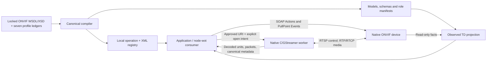

# Native ONVIF integration and optional AV metadata

**ONVIF remains the native protocol; WoT is optional.** This repository now
implements a [native WoT client binding](../bindings/onvif/readme.md), while
the [AV `0.2-proposed` specification](../spec.md) remains a separate, thin,
read-only metadata layer. Using the binding does not require AV annotations;
using an AV Offer does not authorize a native operation.
The ONVIF source baseline is release
**26.06**, commit `68ee1b540a40f848c9599eba2c55b87547c588d6`; the profile
documents below retain their own versions.

## What ONVIF already supplies

ONVIF services cover discovery, configuration, PTZ, imaging, live streams,
snapshots, analytics metadata, events, recording, search, and replay. Whether
a particular operation or feature is usable depends on the product, service,
profile, and client support; the list is not a claim that every ONVIF device
implements everything.[^profiles][^services]

| Native concept | Who defines or supplies it | How to use it; what is not implied |
| --- | --- | --- |
| Service | ONVIF defines the interface; the device reports its namespace, `XAddr`, version, and capabilities. | Discover the actual endpoint with `GetServices`; do not guess a Media2 URL. |
| ONVIF conformance profile | ONVIF defines A, C, D, G, M, S, T, and their separate device/client obligations. | Check the selected edition, required features and actual product support. A profile is not a camera preset. |
| Media-profile token | The device supplies a token for a configured media-profile bundle. | Use it with that device's Media service. `"profile-main"` is an illustrative token, not a Profile T claim. |
| Configuration token | The device supplies a reference to a component configuration. | Retain its profile/configuration context when querying options. Do not combine unrelated maximum values. |
| AV Mode | A publisher or thin adapter describes one existing complete interface. | Read-only projection, not a native configuration command or a conformance badge. |

The token and option distinctions come from the native Media and Media2
contracts. A native profile marked `fixed` is non-deletable, **not immutable**;
the values it references can change.[^tokens][^options]

| Profile | Reuse boundary and support/default caution |
| --- | --- |
| A v1.0 | Access-rule, credential and schedule configuration, with native Events. Device and client CRUD obligations differ; a model does not grant authority to change access policy. |
| C v1.0 | Access-point/door information, control and events. Per-resource capabilities and role-specific conditions matter; no door actuation is implied by discovery. |
| D v1.0 | Access-control peripherals and supported credential, I/O, audio/video and event functions. It is not a universal camera profile or a promise of every peripheral function. |
| G v1.1 | Recording, search, and replay. Dynamic recording and individual search facilities have their own conditions. |
| M v1.1 | Analytics metadata/configuration and supported event integration. Specific object descriptors, counting, recognition, and MQTT support are not universal algorithm guarantees. |
| S v1.3, November 2019 | Basic streaming and Media1 configuration; PTZ, audio, metadata, and other functions have feature-specific obligations. The December PDF upload path is not its edition month. |
| T v1.0 | Media2 and advanced video streaming, with imaging, events, PTZ, metadata, and analytics requirements. H.264/H.265 support is not a promise that every device and client support both. |

Read the device and client requirements separately; conditional/optional
support is not a favorable default.[^profiles]

The [source catalog](onvif-sources.md) covers all seven released editions;
[S/T](onvif-profile-st.md), [G/M](onvif-profile-gm.md), and
[A/C/D](onvif-profile-acd.md) retain the complete authored requirement ledgers.
Retired Q is historical only; V and its companion Security Add-on release
candidates are excluded. TLS Configuration is separately versioned, not an
eighth profile or a universal requirement. A profile label, a native capability,
a client implementation fact and firmware-specific registered product evidence
are different claims.

**Use native analytics before adding another inference stage.** ONVIF already
defines scene descriptions, objects and classifications, analytics rules, and
events. Its architecture explicitly permits server-based and distributed
analytics. An application may consume those results directly or index them
without rerunning inference. Add external processing for demonstrated needs
such as a different algorithm, cross-source fusion, or additional search
outputs, not because ONVIF supposedly has no analytics.[^analytics][^metadata]

A direct ONVIF consumer or an OpenCV application downstream of native
acquisition needs no TD for each internal processing step. Shared WoT
descriptions are useful only if the application benefits from discovering
heterogeneous interfaces and comparing their descriptions.

## What the implemented binding adds

The implementation maps locked WSDL/XSD contracts to WoT Actions and canonical
payloads; it does not invent corresponding JSON endpoints on the device.
The [compiler and projector](onvif-mapping.md) cover all 579 current operation
graphs, but observed TDs expose only supported, evidenced interactions.
The [native runtime](onvif-binding.md) uses released node-wot with SOAP 1.2,
Digest/UsernameToken/TLS policy and native [PullPoint Events](onvif-events.md).
The [Node media API](onvif-node-media.md) separately owns a native
[C/GStreamer worker](onvif-media.md) and real RTSP sessions.



An authorized caller can invoke native configuration or stateful search Actions;
that is separate from AV matching and from the discovery bridge's fixed read
allowlist. A generated Action does not prove a physical effect, client workflow
or profile certificate. See the [support matrix](onvif-conformance.md) for
mapped, exercised, conditional and unsupported boundaries.

## Native read flow, with real operation names

Start with WS-Discovery `Probe`/`ProbeMatch` or an administrator-provided
Device-service endpoint. Native discovery returns service addressing; it is
not replaced by publishing an AV Offer.[^discovery]

The implemented discovery engine sends separate native `tds:Device` and legacy
S `dn:NetworkVideoTransmitter` Probes, not both types in one AND-matching Probe.
Interfaces, segments and exact XAddrs require explicit policy; see
[discovery](onvif-discovery.md). Discovery does not allocate searches, drain
results, subscribe, write configuration or start media.

| Step | Native operation and inputs | Meaning, omission, and next action |
| --- | --- | --- |
| Discover services | Device `GetServices(IncludeCapability=true)` | Obtain namespaces, `XAddr`s, versions, and capabilities. `IncludeCapability` is supplied explicitly, not an assumed adapter default. |
| Read profiles | Media2 `GetProfiles(Type=["All"])` | Omitted `Token` lists all profiles. Omitted `Type` returns **no configuration information**; `"All"` requests the associated configurations. |
| Read compatible options | `GetVideoEncoderConfigurationOptions(ProfileToken, ConfigurationToken)` | Either token scopes compatibility; both constrain it to their joint context. Neither supplied means generic device options, not an active Mode. |
| Resolve live access | Media2 `GetStreamUri(Protocol, ProfileToken)` | Returns a URI, not the video. Establish the native RTSP/RTP session separately. |
| Resolve still access | `GetSnapshotUri(ProfileToken)` | When supported, HTTP GET the returned URI for JPEG. The image updates independently of URI lookup; this does not trigger an exposure. |

These are ONVIF operations, not a new AV interaction vocabulary.
`GetCapabilities` is the backward-compatible capability interface, not a
substitute for the modern service inventory. Media1 `GetStreamUri` uses
`StreamSetup` and `ProfileToken`; Media2 uses `Protocol` and `ProfileToken`.
Do not send one version's request shape to the other.[^services][^capabilities][^profiles-query][^options][^stream][^media1-stream][^snapshot]

### Ordinary adapter configuration, not a JSON wire protocol

The following complete configuration object is an **original, illustrative
read-only adapter contract**, not configuration for the shipped binding, an
ONVIF request envelope, or TD vocabulary. For actual implementation options use
the [typed quickstart](../bindings/onvif/readme.md#typed-integration-helper) and
[bridge CLI configuration](onvif-runtime.md). This illustrative adapter translates the selected operations
into native SOAP. Device/configuration tokens stand for values read from the
selected device; the credential reference is a local secret-store key, never
the secret itself.

<!-- example: examples/onvif-adapter.json# -->
```json
{
    "description": "Illustrative integrator-owned adapter configuration, not ONVIF JSON on the wire and not configuration for an implementation shipped here. A native client translates operation arguments into ONVIF SOAP requests. All endpoints, tokens and credential references are fictional.",
    "adapter": "onvif-media2",
    "deviceService": "https://camera.example.org/onvif/device_service",
    "credentialRef": "camera-reader",
    "mediaServiceNamespace": "http://www.onvif.org/ver20/media/wsdl",
    "GetServices": {
        "IncludeCapability": true
    },
    "GetProfiles": {
        "Type": [
            "All"
        ]
    },
    "GetVideoEncoderConfigurationOptions": {
        "ProfileToken": "profile-main",
        "ConfigurationToken": "encoder-main"
    },
    "GetStreamUri": {
        "Protocol": "RTSP",
        "ProfileToken": "profile-main"
    },
    "GetSnapshotUri": {
        "ProfileToken": "profile-main"
    },
    "configurationWrites": false
}
```

| Configuration entry | Who supplies it / what it describes | How it is used / omission or default |
| --- | --- | --- |
| `description` | Example author: synthetic scope and implementation disclaimer. | Informative prose, not a native request member; omission does not change operation semantics. |
| `adapter` | Integrator: native-client implementation choice. | Required; no universal ONVIF/WoT binding is inferred. |
| `deviceService` | Administrator or native discovery: Device-service address. | Required; no fabricated endpoint or address derived from a Thing ID. |
| `credentialRef` | Administrator: local credential-store reference. | Required by this example contract; no embedded password or anonymous fallback. |
| `mediaServiceNamespace` | Integrator: explicit Media2 interface choice. | Resolve its actual `XAddr` through `GetServices`; no silent Media1 substitution. |
| `GetServices.IncludeCapability` | Integrator: request service capabilities. | Explicit `true`; the native request member is required. |
| `GetProfiles.Type` | Integrator: requested configuration detail. | `["All"]` includes all associated configurations; omission natively supplies none. |
| `GetVideoEncoderConfigurationOptions` tokens | Device supplies identifiers; integrator selects their scope. | Use the returned values for that device. Missing tokens mean generic native options, not default configured settings. |
| `GetStreamUri.Protocol` / `ProfileToken` | Integrator selects transport and an existing native profile. | Both explicit. `"RTSP"` requests RTP over RTSP/TCP, not TLS. Unsupported or security-policy-incompatible access fails; do not downgrade silently. |
| `GetSnapshotUri.ProfileToken` | Integrator selects a supported snapshot operation and profile. | Omission of this configuration block means no snapshot request, not an implicit decoded frame from the live stream. |
| `configurationWrites` | Adapter implementer: read-only boundary. | This example contract defaults to `false` and rejects `true`; this is **not** an ONVIF setting. |

Native field semantics come from Device and Media2; the surrounding
configuration policy is specific to this example.[^services][^profiles-query][^options][^stream][^snapshot]

The corresponding native SOAP **body element** for live URI lookup is small.
It deliberately omits the envelope, headers, and authentication and is not a
complete runnable request.[^stream][^namespace]

```xml
<tr2:GetStreamUri xmlns:tr2="http://www.onvif.org/ver20/media/wsdl">
    <tr2:Protocol>RTSP</tr2:Protocol>
    <tr2:ProfileToken>profile-main</tr2:ProfileToken>
</tr2:GetStreamUri>
```

After lookup, ordinary RTSP `DESCRIBE`, `SETUP`, and `PLAY` negotiate the
session and media transport. For a snapshot, an illustrative access is
`GET /camera/latest.jpg HTTP/1.1` at the **returned** HTTP endpoint, with the
applicable native authentication. Neither URI lookup nor metadata matching
performs that access.[^streaming][^snapshot]

## Ownership: projection does not write through

The source/adapter publisher owns the Offer and the normalized facts read
from native configurations. It retains native endpoint/token, observation,
and mapping information in its own implementation or ordinary metadata.
The application author owns the Need. Requested dimensions, codec, rate, or
result destination **MUST NOT** become implicit camera setters.

For the AV metadata draft, keep exposure, triggers, imaging, PTZ, encoders, analytics-rule
configuration, and device authority in native interfaces. Media
`SetVideoEncoderConfiguration`, Imaging `GetOptions`/`SetImagingSettings`, and
PTZ operations already own those effects. Native configuration can affect
existing streams; read back actual settings and refresh the descriptive
projection after authorized changes.[^configuration][^imaging][^ptz]

The adapter MUST NOT advertise one concrete Mode by mixing independent
maxima or incomplete essential fields. It can still publish the native TD
when it cannot faithfully describe a concrete media combination. Native
options describe possible configurations, not proof that all of them are
currently active, simultaneously usable, or authorized.

No ONVIF capability is fabricated for non-ONVIF devices. UVC and GenICam
interfaces remain their own authorities; a USB or Ethernet connection does
not establish ONVIF support. GenICam provides cross-interface feature and
transport-access machinery rather than a replacement network protocol.[^other-native]

## Recording, results, and honest limits

For native stored media, reuse Recording Control `GetRecordings`, Search
`FindRecordings`/`GetRecordingSearchResults` and supported event/metadata
queries, then Replay `GetReplayUri(StreamSetup, RecordingToken)`.
`RecordingToken`, search-session tokens, and media `ProfileToken` values are
different references. Use native RTSP playback after replay URI lookup;
the AV Clip kind adds no seek or recording-control operation.[^recording][^search][^replay]

`FindRecordings` creates a search session; successive result requests can drain
distinct native batches, and `EndSearch` owns its cleanup. These remain explicit
stateful Actions, not safe Property reads or discovery calls. The native runtime
preserves faults and uncertain outcomes rather than automatically replaying a
drain/write. URI resolution and forward recorded playback have separate
[runtime/media evidence](onvif-conformance.md); reverse replay is not implemented.

If WoT is useful for an additional producer, its native Property DataSchema,
Action `output`, or Event `data` defines the result payload.
`av:result` selects that producer Form; `av:destination` optionally selects
the receiver's native input Form. The receiver owns its schema and access
policy. These annotations do not create subscriptions, callbacks, transfers,
durable results, or authority to use either endpoint.[^td]

Native analytics can remain native; no AV ResultContract, model manifest,
lease, or controller is required. Session establishment, bandwidth, permissions,
decoder/layout support, and actual output quality remain implementation
concerns. A passing [offline check](validation.md) proves none of those.

The [discovery publisher/CLI](onvif-runtime.md) can register observed TDs in an
independently operated WoT Directory or export a local bundle. Models, schemas
and contexts must be served at the configured static base URL; a Thing ID is
not a TD document location. Consumers keep native Forms after bridge shutdown,
subject to independent credentials, reachability and registration leases.
The [logical-EPR authorization regression](onvif-runtime.md#logical-epr-authorization-status)
now passes with independent scoped policy. Native consumption after bridge
shutdown is a bounded local fixture result, not unconditional endpoint,
deployment or full-profile qualification.

## Primary references

All native specification links below use the release-26.06 commit named at the
top; profile PDFs retain their own editions. Only public source citations are
used. Implementation links refer to repository-owned code/evidence, not private
third-party implementations or product certification.

[^profiles]: ONVIF [Profile A v1.0](https://www.onvif.org/wp-content/uploads/2017/06/ONVIF_Profile_A_Specification_v1-0.pdf);
    [Profile C v1.0](https://www.onvif.org/wp-content/uploads/2017/01/2013_12_ONVIF_Profile_C_Specification_v1-0.pdf);
    [Profile D v1.0](https://www.onvif.org/wp-content/uploads/2021/06/onvif-profile-d-specification-v1-0.pdf);
    [Profile S v1.3, sections 6-8](https://www.onvif.org/wp-content/uploads/2019/12/ONVIF_Profile_-S_Specification_v1-3.pdf);
    [Profile T v1.0, sections 5, 7-8](https://www.onvif.org/wp-content/uploads/2018/09/ONVIF_Profile_T_Specification_v1-0.pdf);
    [Profile G v1.1, sections 7-9](https://www.onvif.org/wp-content/uploads/2025/11/ONVIF-Profile-G-Specification-v1-1.pdf);
    [Profile M v1.1, sections 5, 7-8](https://www.onvif.org/wp-content/uploads/2024/04/onvif-profile-m-specification-v1-1.pdf).
[^services]: ONVIF Core, [GetServices and service capabilities, lines 2955-3014](https://github.com/onvif/specs/blob/68ee1b540a40f848c9599eba2c55b87547c588d6/doc/Core.xml#L2955-L3014).
[^tokens]: ONVIF Media, [profile/configuration semantics, lines 477-531](https://github.com/onvif/specs/blob/68ee1b540a40f848c9599eba2c55b87547c588d6/doc/Media.xml#L477-L531).
[^profiles-query]: ONVIF Media2, [GetProfiles, lines 713-749](https://github.com/onvif/specs/blob/68ee1b540a40f848c9599eba2c55b87547c588d6/doc/Media2.xml#L713-L749).
[^options]: ONVIF Media2, [configuration options and token scope, lines 1285-1313](https://github.com/onvif/specs/blob/68ee1b540a40f848c9599eba2c55b87547c588d6/doc/Media2.xml#L1285-L1313).
[^analytics]: ONVIF Analytics, [distributed architecture and native interfaces, lines 552-587](https://github.com/onvif/specs/blob/68ee1b540a40f848c9599eba2c55b87547c588d6/doc/Analytics.xml#L552-L587).
[^metadata]: ONVIF metadata schema, [object descriptors, lines 172-228](https://github.com/onvif/specs/blob/68ee1b540a40f848c9599eba2c55b87547c588d6/wsdl/ver10/schema/metadatastream.xsd#L172-L228),
    and Analytics, [line-counting rule, lines 4341-4380](https://github.com/onvif/specs/blob/68ee1b540a40f848c9599eba2c55b87547c588d6/doc/Analytics.xml#L4341-L4380).
[^discovery]: ONVIF Core, [discovery and Probe/ProbeMatch, lines 2697-2728](https://github.com/onvif/specs/blob/68ee1b540a40f848c9599eba2c55b87547c588d6/doc/Core.xml#L2697-L2728)
    and [discovery modes, lines 2867-2883](https://github.com/onvif/specs/blob/68ee1b540a40f848c9599eba2c55b87547c588d6/doc/Core.xml#L2867-L2883).
[^capabilities]: ONVIF Core, [GetCapabilities compatibility role, lines 3431-3444](https://github.com/onvif/specs/blob/68ee1b540a40f848c9599eba2c55b87547c588d6/doc/Core.xml#L3431-L3444).
[^stream]: ONVIF Media2, [GetStreamUri, protocol values, and inputs, lines 1377-1439](https://github.com/onvif/specs/blob/68ee1b540a40f848c9599eba2c55b87547c588d6/doc/Media2.xml#L1377-L1439).
[^media1-stream]: ONVIF Media, [Media1 GetStreamUri, lines 3500-3582](https://github.com/onvif/specs/blob/68ee1b540a40f848c9599eba2c55b87547c588d6/doc/Media.xml#L3500-L3582).
[^snapshot]: ONVIF Media2, [GetSnapshotUri and JPEG/HTTP semantics, lines 1469-1489](https://github.com/onvif/specs/blob/68ee1b540a40f848c9599eba2c55b87547c588d6/doc/Media2.xml#L1469-L1489).
[^namespace]: ONVIF Media2, [namespace definitions, lines 411-469](https://github.com/onvif/specs/blob/68ee1b540a40f848c9599eba2c55b87547c588d6/doc/Media2.xml#L411-L469).
[^streaming]: ONVIF Streaming, [RTSP session initiation, lines 1312-1366](https://github.com/onvif/specs/blob/68ee1b540a40f848c9599eba2c55b87547c588d6/doc/Streaming.xml#L1312-L1366).
[^configuration]: ONVIF Media2, [setting encoder configuration and readback, lines 1246-1282](https://github.com/onvif/specs/blob/68ee1b540a40f848c9599eba2c55b87547c588d6/doc/Media2.xml#L1246-L1282).
[^imaging]: ONVIF Imaging, [settings and options, lines 590-646](https://github.com/onvif/specs/blob/68ee1b540a40f848c9599eba2c55b87547c588d6/doc/Imaging.xml#L590-L646).
[^ptz]: ONVIF PTZ, [native operations, lines 306-339](https://github.com/onvif/specs/blob/68ee1b540a40f848c9599eba2c55b87547c588d6/doc/PTZ.xml#L306-L339).
[^other-native]: USB-IF, [USB Video Class 1.5, Device Class Definition, section 2](https://www.usb.org/sites/default/files/USB_Video_Class_1_5.zip);
    EMVA, [GenICam introduction and modules](https://www.emva.org/standards-technology/genicam/introduction-new/).
[^recording]: ONVIF Recording Control, [GetRecordings, lines 769-784](https://github.com/onvif/specs/blob/68ee1b540a40f848c9599eba2c55b87547c588d6/doc/RecordingControl.xml#L769-L784).
[^search]: ONVIF Recording Search, [query types, lines 260-282](https://github.com/onvif/specs/blob/68ee1b540a40f848c9599eba2c55b87547c588d6/doc/RecordingSearch.xml#L260-L282)
    and [FindRecordings, lines 859-882](https://github.com/onvif/specs/blob/68ee1b540a40f848c9599eba2c55b87547c588d6/doc/RecordingSearch.xml#L859-L882).
[^replay]: ONVIF Replay, [GetReplayUri, lines 245-270](https://github.com/onvif/specs/blob/68ee1b540a40f848c9599eba2c55b87547c588d6/doc/Replay.xml#L245-L270).
[^td]: W3C, [WoT Thing Description 1.1, affordances, DataSchema, and Forms](https://www.w3.org/TR/2023/REC-wot-thing-description11-20231205/#sec-vocabulary-definition),
    Recommendation, 5 December 2023.
